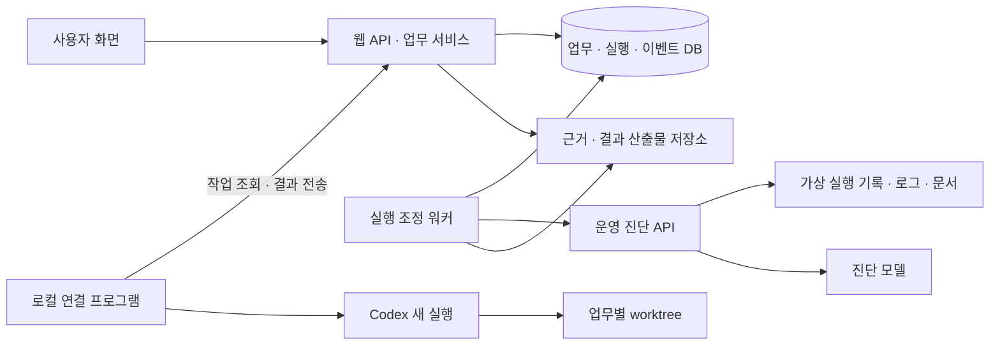

# 아키텍처 — 기존 에이전트 등록과 업무 자동 실행

갱신일: 2026-09-20
상태: 기술 설계 v0.3. [PRD](PRD.md)의 합의된 동작을 위한 초안이다. 첫 로컬 도구와 서버 스택은 [ADR-0001](adr/0001-first-local-agent-codex.md)·[ADR-0002](adr/0002-server-stack-python-fastapi-sqlite.md)로 확정했고, 진단 모델은 [ADR-0003](adr/0003-diagnosis-model-openai-gpt41-mini.md)의 작업 가정이다. 그 외 실행 계약·DB 제약은 assistant 제안이며 구현 착수 승인은 아니다. 코드·서비스 연결 실험은 수행하지 않았다.

## 첫 선택과 전제

첫 검증은 운영 진단 API A → 로컬 개발 에이전트 B다. A는 자료를 조사하고 B는 별도 데모 저장소에서 수정한다. 중앙 서비스가 선택·실행·완료·인계를 관리한다.

| 항목 | 권장안 | 이유·한계 |
|---|---|---|
| 첫 로컬 도구 | Codex CLI | 설치본의 비대화형 실행·JSONL·결과 스키마 옵션 확인. 기존 하네스도 기본 엔진으로 사용. Claude Code는 후속 어댑터 후보 |
| 중앙 구성 | 웹/API와 실행 조정 워커, 하나의 영속 DB | 장시간 작업과 화면 요청을 분리하되 단일 서버로 시작. 별도 큐 서비스는 보류 |
| 로컬 통신 | 연결 프로그램의 HTTPS 작업 조회·이벤트 업로드 | 사용자 컴퓨터에 수신 포트·공인 주소 불필요. 초기에는 폴링 |
| 진단 API | HTTPS 작업 접수 + 상태 조회 | 진단을 HTTP 요청 하나에 묶지 않음. 데모 계약이며 임의 외부 API 범용 호환은 아님 |
| 저장 | SQLite + 비공개 산출물 디렉터리 | 단일 지속 실행 서버·소규모 데모 전제. 다중 서버·임시 디스크 배포에서는 재검토 |
| 진단 구현 | 별도 FastAPI 서비스 + OpenAI Responses API + 읽기 전용 도구 4개 | GPT-4.1 mini를 첫 평가 후보로 제안. 실제 진단 품질·계정 접근은 미검증 |
| n8n·A2A·MCP·OpenArchive | 첫 구현의 필수 의존에서 제외 | 두 실행 계약으로 시연 가능. 등록된 기존 에이전트의 MCP 사용은 별도로 재사용 검증 |

위 표에서 첫 로컬 도구·중앙 구성·저장·진단 구현의 스택은 ADR-0001·0002로 확정했고, 진단 모델은 ADR-0003의 작업 가정이다. 나머지 행은 제안이다. 폴링 간격·시간 제한·성능 수치는 측정 전 확정하지 않는다.

## 기술 스택 제안

현재 저장소에는 제품용 패키지 명세가 없으며 기존 하네스와 테스트는 Python이다. 로컬 기본 Python은 3.13.2로 확인했다. 이를 근거로 첫 구현은 Python 3.13 계열로 맞추되 정확한 패치·의존 버전은 호환성 검증 후 고정한다. 설치된 구버전 패치를 배포 기준으로 그대로 삼지는 않는다.

| 영역 | 제안 | 선택 이유와 적용 범위 |
|---|---|---|
| 웹/API | Python, FastAPI, Uvicorn | 등록·업무 API와 진단 API에서 같은 언어·입출력 검증 방식을 사용 |
| 웹 화면 | Jinja2, CSS, 브라우저 JavaScript | 등록·업무 목록·실행 상세를 서버 렌더링하고 상태 영역만 폴링 갱신. 별도 프런트엔드 빌드 파이프라인은 보류 |
| 입출력 계약 | Pydantic v2 | API 경계에서 검증하고 JSON Schema 생성. 도메인 규칙은 Python 함수·표준 타입으로 유지 |
| 실행 조정 | 별도 Python 워커 프로세스 | DB의 실행·결과를 지속 조회. 웹 요청의 수명과 독립 |
| 로컬 연결 | Python CLI, HTTPX, 표준 subprocess·sqlite3 | 기존 Codex 프로세스 실행, HTTPS 통신, 로컬 실행 기록 보존 |
| 영속 저장 | 표준 sqlite3, 명시적 SQL, 파일 산출물 | 작은 스키마에서 트랜잭션과 제약을 직접 관리. ORM은 첫 범위에 추가하지 않음 |
| 진단 서비스 | FastAPI + 별도 Python 워커 + OpenAI Python SDK | API 접수와 모델 실행 분리. 도구 호출 반복은 작은 명시적 루프로 구현 |
| 보고서 데모 | 별도 Python Git 저장소, pytest | 변환 실패와 TDD 수정의 범위를 작게 유지 |
| 품질 검사 | pytest, Ruff | 상태·계약·재시작 동작 테스트와 정적 검사. 구체적 명령은 구현 계획에서 훅과 맞춤 |

FastAPI는 Jinja2 템플릿과 정적 파일 제공을 지원한다. 이 프로젝트에서는 첫 화면 범위에 맞는 단순한 구성이므로 선택한다. 복잡한 흐름 편집기·대규모 클라이언트 상태가 필요해지면 React 계열을 재검토한다. [FastAPI 템플릿 문서](https://fastapi.tiangolo.com/advanced/templates/)

SQLite는 WAL에서도 쓰기 작업이 직렬화되므로 트랜잭션 안에서 네트워크·모델·CLI 완료를 기다리지 않는다. API와 워커는 같은 서버의 로컬 디스크 DB에 짧게 접근하며 쓰기 충돌 재시도는 제한한다. 중앙 DB, 진단 서비스 DB, 연결 프로그램 DB를 분리하고 다른 구성 요소의 DB를 직접 열지 않는다. [SQLite WAL 문서](https://www.sqlite.org/wal.html)

FastAPI `BackgroundTasks`만으로 장시간 실행을 관리하지 않는다. DB에 접수를 기록한 뒤 별도 워커가 실행하며 웹/API 재시작 후에도 기록으로 복구한다. 첫 배포 단위는 중앙 API + 중앙 워커 + 진단 API + 진단 워커, 그리고 사용자 컴퓨터의 연결 프로그램이다. 중앙과 진단은 같은 호스트에 둘 수 있지만 프로세스·자격 증명·데이터 디렉터리를 구분한다. [FastAPI BackgroundTasks 문서](https://fastapi.tiangolo.com/tutorial/background-tasks/)

### 진단 모델과 평가 기준

제공자는 OpenAI, 호출 방식은 Responses API, 첫 평가 모델은 `gpt-4.1-mini-2025-04-14`로 제안한다. 공식 문서에서 Responses API·function calling·structured outputs·해당 스냅샷을 확인했다. 작은 자료와 네 도구로 구성된 데모에서 먼저 평가할 후보이며 최신·최고 성능 모델이라는 주장은 아니다. [모델 문서](https://developers.openai.com/api/docs/models/gpt-4.1-mini)

처리 순서는 조사 요청과 도구 정의 전달 → 모델의 도구 요청 → 서비스에서 인자·권한 검사 후 실제 조회 → 조회 결과를 모델에 반환 → 구조화 진단 수집이다. 모델은 DB·파일 경로를 직접 실행하지 않는다. 별도 에이전트 프레임워크나 벡터 검색은 첫 범위에 추가하지 않는다. [도구 호출 문서](https://developers.openai.com/api/docs/guides/function-calling)

모델은 원인 주장과 근거 참조를 작성한다. 첨부 본문·버전·해시는 진단 서비스가 실제 조회 기록에서 조립한다. 모델이 원문을 다시 생성한 내용을 근거 스냅샷으로 채택하지 않는다. 구조화 출력 성공과 사실 관계 검증 통과는 별개다.

API 자격 증명은 진단 서비스에만 배치한다. 로컬 Codex 로그인으로 진단 API 호출 권한을 대체한다고 가정하지 않는다. 계정의 API 사용 가능 여부·호출 한도·비용 예산은 실연동 전에 확인한다. 이 세션에서는 자격 증명을 읽거나 유료 호출을 실행하지 않았다. 중앙 서비스는 선택·완료 기준 제안에 모델을 쓰지 않으며([ADR-0004](adr/0004-central-service-rule-based-no-llm.md)) 진단 서비스에 그 책임을 추가하지 않는다.

첫 품질 검증은 PRD의 정상 근거, 실패 응답 누락, 변경 안내 누락, 적용 시각 충돌, HTTP 오류로 바뀐 입력을 각각 세 번 실행하는 안이다. 인계 가능한 정상 사례는 모두 정확한 근거와 결과를 만들고, 나머지는 잘못된 수정 착수를 한 번도 허용하지 않아야 한다. 사용 토큰·경과 시간·호출 실패도 기록한다. 이는 작은 데모 통과 기준이지 운영 성공률 추정이 아니다.

실패하면 도구 반환·계약·프롬프트 문제를 먼저 분리하고 같은 사례로 모델 교체 필요성을 판단한다. 실행 중 다른 모델로 조용히 대체하지 않으며 결과에 모델 ID·프롬프트 버전·도구 계약 버전을 기록한다. 정확한 호출 상한·비용 상한은 실연동 전에 설정한다.

### 디렉터리와 의존 방향 제안

아래는 아직 생성하지 않은 경로다. 하나의 저장소에서 코드·계약을 관리하되 진단 서비스와 연결 프로그램은 별도 진입점으로 실행한다.

```text
src/
  workflow/
    domain/           # 업무·선택·완료 규칙
    contracts/        # API 요청·이벤트·산출물 스키마
    server/           # 웹/API·템플릿·정적 파일·중앙 워커
    connector/        # 등록·Codex·Git·로컬 실행 기록
    adapters/         # 중앙 DB·HTTP·산출물 저장
  diagnostic_demo/
    api/              # 접수·상태·능력 API
    worker/           # 모델 호출과 진단 조립
    tools/            # PRD 조회 도구 4개
    fixtures/         # 가상 실행 기록·로그·운영 문서
tests/                # 도메인·계약·통합 검증
```

`server`·`connector`는 공유 계약을 사용하지만 상대방 구현을 import하지 않는다. 진단 데모는 공개 계약만 공유하고 중앙 DB에 접근하지 않는다. 진단 자료는 파일 fixture, 실행 상태는 진단 서비스 자체 DB에 둔다. 보고서 수정 대상 저장소는 이 트리 밖에 별도로 준비한다. 패키지·경로는 구현 시 필요한 것부터 생성하며 빈 추상화 계층을 미리 만들지 않는다.

## 구성과 책임



| 구성 | 책임 | 경계 |
|---|---|---|
| 웹/API | 등록, 업무 설정, 상태 조회, 검토 완료, 권한 확인 | 로컬 경로를 원격 셸 명령으로 실행하지 않음 |
| 실행 조정 워커 | 대상 선택, 실행 생성·전달, 완료 검증, 후속 조건 평가 | 모델의 완료 선언을 그대로 상태에 반영하지 않음 |
| 진단 API | 도구 조회·조회 이력, 모델 진단, 근거 스냅샷 | B 실행·저장소 수정·플랫폼 업무 완료 권한 없음 |
| 로컬 연결 프로그램 | 로컬 등록, Codex 프로세스, worktree, 결과 보존·업로드 | 등록된 폴더·도구에서만 실행 |
| Codex | 기존 설정과 전달 자료로 재현·수정·테스트 | 테스트 성공과 업무 완료는 별도. 운영 배포는 시연 범위 밖 |

도메인 규칙(선행 조건·완료·선택)은 프레임워크·CLI를 직접 호출하지 않는다. DB·HTTP·프로세스·Git은 경계 모듈에서 다룬다. 경로 제안은 기술 스택 절을 따른다. 기존 `scripts/execute.py`를 제품 런타임으로 전용하거나 승인·샌드박스 우회와 Claude 자동 대체 정책을 복사하지 않는다.

## 등록·선택·권한

로컬 연결은 웹에서 발급한 일회성 연결 코드를 컴퓨터에서 교환하는 방식으로 제안한다. 교환 후 해당 소유자·연결 프로그램에 한정된 취소 가능한 자격 증명을 받는다. 폴더·실행 파일은 로컬에서 선택하고 서버에는 등록 ID·표시 이름·확인된 능력을 보낸다. 브라우저의 로컬 파일 시스템 탐색을 전제하지 않는다.

연결 프로그램은 허용된 지침·설정·도구 메타데이터로 능력 설명을 제안하고 소유자가 수정한다. 발견 경로와 확인 수준을 표시하며 “설정 발견”과 “실제 사용 확인”을 구분한다. 설정·인증 파일 전체를 서버에 업로드하지 않는다.

API 에이전트는 주소·자격 증명으로 등록하고 데모 서비스의 `GET /capabilities`에서 역할·자료 범위·계약 버전을 확인한다. 자격 증명은 서버에 보관하며 브라우저·프롬프트에 넣지 않는다. 첫 API 주소는 운영자가 허용한 데모 주소로 제한한다. 임의 주소 등록은 후속 범위다.

자동 선택은 접근 권한을 먼저 검사한 뒤 요구 능력과 등록 능력을 비교한다. 첫 구현의 규칙은 [ADR-0004](adr/0004-central-service-rule-based-no-llm.md)와 PRD 2절을 따른다: 일치 후보가 정확히 1개면 선택, 0개 또는 2개 이상이면 확인 필요. 직접 선택도 권한·실행 조건을 검사한다.

능력 필드 — 첫 구현:

```json
{ "code": "operations.diagnose", "scope": { "workflow_id": "daily-report" } }
{ "code": "code.modify", "scope": { "repository_id": "demo-report-repo" } }
```

Agent는 `capabilities` 배열, Task는 `required_capability` 객체 하나를 가진다. 일치는 `code`가 같고 `scope`의 모든 키·값이 같은 경우다. 인식하지 않는 코드·scope 키는 등록 시 422로 거부한다. 선택 결과에는 선택한 Agent ID, 일치한 항목, 후보 수를 기록해 화면 이유 표시와 테스트에 같은 값을 쓴다.

업무·에이전트·실행·산출물마다 소유 범위를 검사하고 연결 토큰은 해당 프로그램 또는 API 역할에 제한한다. 팀 공유 권한 UI는 미결이다. 시연의 개인·사내 소유 표시를 다중 조직 권한 구현 완료로 소개하지 않는다.

### 인증·권한·비밀정보 규칙 — 2026-09-20 확정

접근 모델은 [ADR-0005](adr/0005-access-model-anonymous-session-operator-token.md)를 따른다. 아래는 구현할 규칙이다.

| 주체 | 인증 | 할 수 있는 것 | 할 수 없는 것 |
|---|---|---|---|
| 심사자 세션 | 첫 방문에 발급하는 서명 쿠키(HMAC, `SESSION_SECRET`). 유효기간 14일 | 자기 세션의 업무 등록·실행·검토(승인·수정 요청·종료), 운영자 에이전트 목록·능력·연결 상태 열람 | 에이전트 등록·삭제, 연결 코드 발급, 병합, 다른 세션 자료 열람 |
| 운영자 | `OPERATOR_TOKEN` 환경변수 값을 운영자 화면(`/operator`)에 입력 → 같은 쿠키에 operator 표시 | 에이전트 등록·수정·삭제, 연결 코드 발급·취소, 병합 확인, 모든 세션 업무 열람 | — |
| 로컬 연결 프로그램 | `connector_id` + 연결 토큰(Bearer) | 자기 `connector_id`의 claim·heartbeat, 배정된 실행의 events·artifacts | 다른 실행·다른 프로그램 자료(403), 웹 동작 전부 |
| 중앙 워커 → 진단 API | `DIAG_API_TOKEN`(양쪽 환경변수) Bearer | `/runs` 접수·조회, `/capabilities` | 그 외 없음 |
| 진단 워커 → OpenAI | `OPENAI_API_KEY` 진단 워커 환경변수 | 모델 호출 | — |

연결 코드: 운영자가 운영자 화면에서 발급한다. 1회용, 발급 후 10분 만료, 교환 즉시 무효, 미사용 코드는 취소할 수 있다. 교환 시 연결 프로그램은 `connector_id`와 연결 토큰을 받는다. 토큰은 무작위 32바이트에 접두사 `wfc_`를 붙인 값이며 서버는 SHA-256 해시만 저장한다. 운영자가 연결을 취소하면 다음 요청부터 401이다. 프로그램은 토큰을 사용자 홈의 0600 파일에 보관한다.

진단 API 자격 증명: 중앙 DB의 Agent 레코드에는 토큰 값이 아닌 참조명(`credential_ref`, 예: `env:DIAG_API_TOKEN`)만 저장한다. 값은 중앙 워커 프로세스의 환경변수에서 읽는다. 브라우저 응답·템플릿·로그·프롬프트에 넣지 않는다.

API 에이전트의 자료 범위: 등록된 `capabilities[].scope.workflow_id`가 진단 서비스가 조회할 수 있는 자동화의 전부다. 데모는 `daily-report` 하나다. 조회 도구는 요청의 `run_id`·`workflow_id`가 범위 밖이면 `access_denied`를 반환하고 빈 본문으로 바꾸지 않는다.

로그·산출물의 비밀정보: 모든 구성 요소는 `Authorization` 헤더를 로그에서 마스킹하고 예외 메시지에 요청 헤더를 넣지 않는다. Codex 프로세스에는 환경변수 허용 목록(`HOME`, `PATH`, `LANG`, `TERM`, Codex가 요구하는 변수)만 전달하고 연결 토큰·API 키를 상속하지 않는다. 연결 프로그램은 JSONL·stderr 산출물을 업로드하기 전에 `wfc_`·`sk-` 접두사를 검사해 발견하면 마스킹하고 `progress` 이벤트로 경고를 남긴다.

B에 전달하는 근거: `attachments`에는 진단 서비스의 조회 이력에 실제로 있는 evidence만 넣는다. 데모 fixture는 모두 가상 자료이므로 전부 전달 가능하며, 전달 불가 자료 유형은 첫 구현에 없다. 첨부 총 크기 상한은 1MB이고 초과하면 확인 필요로 둔다. B는 사내 조회 권한이 없으며 첨부만으로 재현한다.

병합: 운영자 전용이다. 심사자 세션이 B를 검토 승인하면 업무는 완료되고 "병합: 운영자 확인 대기"를 표시한다. 데모 저장소의 기준 커밋은 심사 기간 동안 고정하며 심사자 세션의 결과 커밋은 세션별 작업 브랜치에만 남는다.

## 최소 데이터 모델과 영속성

| 레코드 | 핵심 필드 |
|---|---|
| Agent | ID, 소유 범위, 연결 유형·참조, 능력·자료 범위, 소유자 확인 내용, 연결 상태 |
| Task | ID, 소유 범위, 요청, 요구 능력, 대상/선택 방식, 실행·완료 방식, 완료 기준·버전, 선행 Task ID, 상태·이유 |
| Execution | ID, Task ID, 시도 번호, 고정된 Agent·업무 설정·입력 산출물, 실행 상태, 시각, 결과 참조 |
| ExecutionEvent | Execution ID, 발신자, 순번, 종류, 시각, 본문. 실행·발신자·순번 조합은 유일 |
| Artifact | ID, 소유 범위, 생성 실행, 종류, 내용 해시, 저장 참조. 생성 후 내용 불변 |

Task는 업무이고 Execution은 한 번의 시도다. 같은 Task에 활성 Execution을 둘 수 없다. 실행 중 설정은 고정하고 변경 요청은 다음 시도에 적용한다. B는 완료된 A의 Artifact ID를 고정해 받으며 A 재실행이 기존 B 입력을 바꾸지 않는다.

DB가 상태의 기준이다. 워커는 트랜잭션 안에서 실행을 생성하고 전송 전에 저장한다. 재전송에는 같은 Execution ID를 사용한다. 산출물은 임시 저장·해시 검증·확정 후 DB에 연결하며 필수 결과가 보존되기 전 완료하지 않는다.

## 실행 인터페이스 초안

공통 요청은 `execution_id`, `task_id`, `contract_version`, `request`, `input_artifact_ids`를 포함한다. 경로는 아직 제안이다.

| 호출 | 계약 |
|---|---|
| 서비스 → API `POST /runs` | 동일 Execution ID는 같은 실행 반환. 새 접수는 202와 실행 참조. 접수와 시작 구분 |
| 서비스 → API `GET /runs/{execution_id}` | 접수·실행·결과·실패, 조회 이력·산출물 참조 수집 |
| 연결 프로그램 → 서비스 `POST /connector/claim` | 인증된 프로그램에 배정된 실행 하나를 원자적으로 인수 |
| 연결 프로그램 → 서비스 `POST /executions/{id}/events` | 접수·시작·진행·종료 이벤트. 같은 순번은 중복 반영하지 않음 |
| 연결 프로그램 ↔ 서비스 `GET/POST /executions/{id}/artifacts` | 허용된 입력 다운로드·결과 업로드, 해시 확인 |
| 연결 프로그램 → 서비스 `POST /connector/heartbeat` | 마지막 연결·현재 실행 ID 보고. 연결 생존과 모델 진행 구분 |

API 추가 입력은 조사할 `run_id`다. 로컬 추가 입력은 `local_registration_id`, `base_commit`, 인계 자료 참조다. 외부에서 셸 명령 문자열을 받지 않고 어댑터가 고정된 실행 파일과 인자 배열을 만든다. 연결 토큰을 Codex 프로세스 환경에 상속하지 않는다.

두 실행 환경은 ID별 접수 기록을 영속 보존한다. 접수 후 통신이 끊겨도 새 ID로 실행하지 않고 같은 ID를 조회·재전송한다.

### 계약 v1의 공통 규칙

다음 표는 구현할 JSON Schema의 필드·조건 명세다. 완전한 요청·이벤트·결과·오류 예시는 [CONTRACT.md](CONTRACT.md)에 있으며 계약 테스트의 fixture로 쓴다. 아직 스키마 파일이나 API 코드를 생성하지 않았다. 명세된 객체는 알 수 없는 필드를 거부하고, 선택 필드는 표에서 명시한다. 숫자·문자열 자동 변환을 허용하지 않는다. `null`은 허용한다고 적은 필드에서만 사용한다.

- `contract_version`: 정수 `1`. 지원하지 않는 버전은 422로 거부한다.
- ID: 비어 있지 않은 불투명 문자열. 경로로 해석하지 않으며 소유 범위는 인증 정보와 저장된 레코드로 확인한다.
- 시각: 시간대가 있는 RFC 3339 문자열, DB에는 UTC로 정규화. 발신 시각과 서버 수신 시각을 구분한다.
- 해시: 서버가 보존한 정확한 파일 바이트의 SHA-256 소문자 64자리. JSON을 다시 직렬화한 값과 혼동하지 않는다.
- 오류 본문은 `code`, `message`, `field`(없으면 null), `details`(없으면 null, 예: `sequence_gap`의 `expected_seq`)를 반환한다. 인증 오류 401, 권한 오류 403, 없는 자료 404, 중복 내용 충돌·불가능한 상태 전환 409, 필드 오류 422, 실행 상한 도달 429를 구분한다.

### 실행 요청과 접수

| 필드 | 타입·필수 조건 |
|---|---|
| `contract_version`, `execution_id`, `task_id` | 공통 규칙, 모두 필수 |
| `kind` | `diagnosis` 또는 `code_change` |
| `agent_id` | 선택·고정된 Agent ID |
| `task_revision` | 1 이상 정수. 요청·완료 기준·대상 설정의 고정 버전 |
| `request` | 비어 있지 않은 업무 설명 |
| `input_artifact_ids` | 중복 없는 ID 배열. 입력이 없으면 빈 배열 |
| `target` | 아래 종류별 객체. 다른 종류의 필드를 혼합할 수 없음 |

`diagnosis`의 target은 `run_id`만 가진다. `code_change`는 `local_registration_id`, `base_commit`, `verification_profile_id`를 가진다. `base_commit`은 등록 저장소에서 확인한 전체 커밋 ID다. 검증 프로필은 소유자가 사전 등록한 명령의 ID이며 요청에 셸 명령을 넣지 않는다. B의 입력 배열에는 검증·보존된 A 인계 Artifact가 반드시 있어야 한다.

```json
{
  "contract_version": 1,
  "execution_id": "exec-diagnose-001",
  "task_id": "diagnose-daily-0920",
  "kind": "diagnosis",
  "agent_id": "agent-ops-demo",
  "task_revision": 1,
  "request": "실패 원인과 수정에 필요한 근거를 조사해 주세요.",
  "input_artifact_ids": [],
  "target": { "run_id": "daily-0920-0900" }
}
```

PRD의 조사 요청은 이 봉투 안의 `task_id`, `request`, `target.run_id`를 진단 업무 입력으로 투영한 것이다. 같은 실행 ID의 요청을 다시 받으면 모든 의미 필드가 같은지 비교하고 같으면 기존 접수·상태를 반환한다. 키 순서·공백 차이는 무시하되 필드 값이 다르면 409다. 실행 ID가 같다고 다른 내용을 덮어쓰지 않는다.

새 접수는 202, 동일 요청 재접수·상태 조회는 200과 `execution_id`, `status`, `last_event_seq`, `result_artifact_id`, `error`를 반환한다. 결과 전에는 결과 ID가 null, 실행 실패 전에는 error가 null이다. error는 `code`, `message`를 가진다. 결과 스키마가 깨진 채 프로세스가 끝난 경우도 수신 증거를 보존하고 확인 필요로 판정한다.

`POST /connector/claim`은 `connector_id`를 인증된 주체와 대조한다. 아직 접수 확인되지 않은 배정이 있으면 같은 실행을 다시 반환하며, 작업이 없으면 204다. 프로그램은 로컬 접수 기록을 먼저 저장한 뒤 accepted 이벤트를 보낸다. 첫 데모는 연결 프로그램당 실행 하나로 제한한다. 이는 향후 독립 업무 병렬 실행을 없애는 제품 결정이 아니다.

### 실행 이벤트

| 필드 | 타입·규칙 |
|---|---|
| `contract_version`, `execution_id` | 필수, URL의 실행 ID와 일치 |
| `seq` | 1부터 시작하는 연속 정수. 해당 실행의 인증된 실행 주체가 발급 |
| `occurred_at` | 발신 시각. 상태 순서는 시각이 아닌 seq로 결정 |
| `type` | `accepted`, `started`, `progress`, `result_ready`, `failed` 중 하나 |
| `data` | 이벤트 종류별 객체 |

accepted의 data는 빈 객체, started는 `runtime_ref` 문자열, progress는 `message` 문자열, result_ready는 `result_artifact_id`, failed는 `code`, `message`, `process_stopped` 불리언을 가진다. 시작 불명·하트비트 만료에 따른 unknown 판정은 서버의 별도 관찰 기록으로 남기며 실행 주체의 seq를 소비하지 않는다.

```json
{
  "contract_version": 1,
  "execution_id": "exec-diagnose-001",
  "seq": 2,
  "occurred_at": "2026-09-20T00:10:01Z",
  "type": "started",
  "data": { "runtime_ref": "diagnostic-run-001" }
}
```

서버는 이벤트 저장·last_event_seq 갱신·실행 상태 변경을 한 트랜잭션에서 처리한다. 같은 seq·같은 내용은 성공 응답하고 다시 적용하지 않는다. 같은 seq·다른 내용은 409다. 순번이 빠지면 409와 `details.expected_seq`를 반환하며 발신자는 그 순번부터 재전송한다. 프로그램 재시작 시에도 seq를 1로 되돌리지 않는다. 발신자 신원은 토큰·배정으로 확인하며 이벤트 본문의 자칭 sender를 신뢰하지 않는다.

API 진단 실행도 같은 논리적 이벤트를 보존한다. 상태 조회는 선택적 `after_seq`로 이후 이벤트를 반환하고 중앙 워커가 순서대로 반영한다. 접수 API의 응답은 프로세스 시작 증거가 아니다. result_ready는 참조한 결과가 영속 저장되고 해당 실행에 연결된 뒤에만 수용한다.

정상 전이는 queued → accepted → running → result_ready다. 시작 실패는 accepted에서 failed로, 실행 실패는 running에서 failed로 이동한다. progress는 running에서만 허용한다. unknown은 기존 실행 주체의 누락 없는 이벤트 재전송과 실행 동일성 확인으로 복원하고 새 프로세스를 시작하지 않는다. 최종 상태 뒤의 새로운 started는 거부하며 이미 반영한 과거 이벤트의 동일 재전송만 허용한다.

### 진단 결과와 근거

진단 결과 봉투는 `contract_version`, `execution_id`, `task_id`, `run_id`, `outcome`, `summary`, `findings`, `diagnosis`, `repair_request`, `missing_information`, `attachments`, `provenance`를 필수로 가진다. 기존 PRD 예시는 설명용 발췌이며 완전한 봉투가 아니다.

| 필드 | 추가 명세 |
|---|---|
| `outcome` | `ready_for_handoff` 또는 `needs_information` |
| `findings` | `claim` 문자열 + `evidence_refs` 배열을 가진 객체 배열 |
| `diagnosis` | null 또는 아래 구조화된 원인 객체 |
| `repair_request` | null 또는 PRD의 `target_component`, `change`, `preserve`, `checks` 객체 |
| `missing_information` | `code`, `description`, `evidence_id`(불명 시 null)를 가진 객체 배열 |
| `attachments` | `evidence_id`, `version`, `content_type`, `artifact_id`, `sha256`를 가진 참조 배열. 실제 원문 파일을 같은 인계 묶음에 포함 |
| `provenance` | `model_id`, `prompt_version`, `tool_contract_version`, `tool_trace_artifact_id`. 진단 서비스가 기록 |

근거 참조는 `evidence_id`, `version`, `location`을 갖는다. location은 JSON 자료에서는 `$.data.records` 같은 단순 객체 경로, 텍스트 자료에서는 `lines:2-3` 같은 1부터 시작하는 줄 범위다. 운영 문서 근거는 `{ "markdown": …, "machine": … }` 형태의 JSON이며 v1에서는 `$.machine.*`만 인용하고 Markdown 본문은 줄 단위로 인용하지 않는다. 첫 데모는 와일드카드·필터 표현식을 지원하지 않는다. 이 문법으로 가리킨 값·줄이 실제 첨부에 존재해야 한다.

```json
{
  "code": "response_path_changed",
  "baseline_run_id": "daily-0919-0900",
  "failed_run_id": "daily-0920-0900",
  "old_path": "$.items",
  "new_path": "$.data.records",
  "change_document": { "evidence_id": "upstream-response-change", "version": "1" },
  "report_contract": { "evidence_id": "daily-report-contract", "version": "1" }
}
```

위는 diagnosis 객체 예시다. 데모 자동 판정은 이 code만 지원한다. `ready_for_handoff`이면 diagnosis·repair_request는 null이 아니고 findings는 비어 있지 않으며 missing_information은 빈 배열이어야 한다. `needs_information`이면 diagnosis·repair_request는 null이고 missing_information이 하나 이상이다. 부분 관찰·가설은 findings·summary에 남긴다. 알려지지 않은 원인은 임의 code 추가 대신 `unsupported_diagnosis` 사유로 보류한다.

변경 안내의 기계 판정용 자료는 `workflow_id`, `effective_at`, `old_path`, `new_path`, `preserved_fields`를 갖는다. 보고서 계약은 `workflow_id`, `supported_paths`, `required_row_fields`, `empty_list_policy`를 갖는다. Markdown 설명과 이 필드는 하나의 버전 자료에 함께 보존하고 별개로 수정하지 않는다. 파서가 임의 자연어에서 사실을 추측하지 않아도 확인할 수 있는 데모 계약이다.

검증기는 같은 workflow·코드 버전, 정상/실패 상태, HTTP 200 뒤 변환 실패, 과거 old_path 배열·실패 응답 new_path 배열·old_path 부재, 문서 적용 시각, 유지 필드와 구형 지원 계약을 실제 자료에서 확인한다. PRD의 빈 배열·누락·모호한 경로 처리 규칙과 충돌하면 보류한다. 예상 보고서 수치는 입력 행에서 계산해 비교하며 20·5를 하드코딩한 정답 판정으로 사용하지 않는다. 진단 문장이 아니라 이 검증 결과로 A 완료를 결정한다.

### 코드 수정 결과

B 결과는 `contract_version`, `execution_id`, `task_id`, `outcome`, `summary`, `base_commit`, `result_commit`, `artifact_ids`, `verification`을 포함한다. outcome은 `ready_for_review` 또는 `needs_information`이다. 정상 제출은 결과 커밋, diff, 수정 전 재현 실패 기록, 수정 후 테스트 기록, 생성 보고서를 필수로 요구한다. 보류 제출에서는 result_commit이 null일 수 있고 summary에 부족한 조건을 명시한다.

verification은 사전 등록된 `profile_id`, 검사 대상 `result_commit`, `exit_code`, `log_artifact_id`를 포함하며 실행 후 연결 프로그램이 채운다. 검사 중 worktree 변경 여부를 확인해 검사한 코드와 보존한 결과 커밋이 일치해야 한다. Codex가 출력한 “통과” 문장으로 대체하지 않는다. 올바른 제출도 사람 검토 전에는 B 완료가 아니다.

### DB 제약과 실행 잠금

| 위치 | 제약 |
|---|---|
| Task | `revision >= 1`, 자기 자신을 선행 업무로 지정 금지. 선행 연결 변경 시 같은 소유 범위·순환 여부를 서비스 트랜잭션에서 검사 |
| Execution | 기본키 ID, `UNIQUE(task_id, attempt_no)`, `UNIQUE(task_id, start_key)`, `attempt_no >= 1` |
| Execution 활성 잠금 | `released_at IS NULL`인 행에 대해 task_id 유일. result_ready 검토 대기·unknown도 잠금을 유지 |
| ExecutionEvent | `UNIQUE(execution_id, seq)`, `seq >= 1`. 배정된 실행 주체만 추가 가능 |
| Artifact | ID 기본키, 생성 실행 FK, 확정 후 내용 변경 금지. 해시가 같아도 소유 권한을 합치지 않음 |
| 결과 인계 | B Execution에 선행 Execution ID·입력 Artifact ID를 고정. 같은 소유 범위이며 A 완료 시 채택한 산출물인지 검사 |

모든 DB 연결에서 외래키 검사를 활성화하고 NOT NULL·허용 상태 CHECK를 적용한다. 복합 소유 관계는 `(owner_id, id)` 참조 또는 동일 트랜잭션 검사로 보장한다. 순환 금지·진단 의미 검증은 단순 CHECK만으로 해결했다고 주장하지 않는다.

`start_key`는 최초 자동 실행에서는 Task revision에 연결된 서버 생성 키, 직접 실행·명시적 재시도에서는 저장된 실행 요청 ID다. 이벤트 중복 처리와 웹 요청 재전송은 같은 키를 사용한다. 실패 후 자동 평가가 반복돼도 새 키를 만들지 않는다. 명시적 재시도만 새 키·attempt_no를 생성한다. 따라서 활성 실행이 끝난 뒤 같은 완료 이벤트가 와도 새 실행이 생기지 않는다.

프로세스 종료 확인과 업무 검토 종결을 모두 충족할 때 `released_at`을 기록한다. unknown, 프로세스 종료 미확인 실패, 검토 대기는 자동 해제하지 않는다. 검토자가 수정 요청을 하면 이전 시도를 종결하고 새 키·`attempt_no + 1`로 실행을 만드는 트랜잭션을 사용한다. 새 시도의 `input_artifact_ids`에는 원래 입력에 더해 이전 시도의 결과 Artifact와 검토 의견 Artifact를 넣는다. 코드 수정 업무의 새 시도는 같은 worktree·작업 브랜치를 쓰고 `base_commit`은 이전 시도가 보존한 `result_commit`, 없으면 원래 기준 커밋이다. 검토자의 종료는 Task를 실패(검토 거절)로 마감하고 잠금을 해제한다. 무조건 덮어쓰기나 기한 만료에 따른 잠금 해제는 하지 않는다.

A 완료 트랜잭션은 판정 기록·채택 Artifact·Task 완료 상태를 함께 저장한다. 이후 워커가 완료된 선행 업무를 다시 스캔해 B 입력 고정·실행 생성을 트랜잭션으로 처리한다. 이 사이에 서버가 재시작돼도 스캔으로 이어가고 start_key 유일성으로 중복을 막는다. B 직접 실행 설정에서는 입력만 준비하고 사용자 조작 전에는 실행을 생성하지 않는다.

### 계약 수용 기준

| 입력·장애 | 기대 결과 |
|---|---|
| 같은 요청·ID 두 번, 키 순서만 변경 | 같은 실행 참조 반환, 실제 실행 1회 |
| 같은 ID로 대상·내용 변경 | 409, 기존 실행 미변경 |
| claim 응답 유실 후 재조회 | 같은 배정 반환, 로컬 접수 기록으로 중복 시작 방지 |
| 이벤트 중복·순서 역전·내용 충돌 | 동일 중복만 수용, 누락 순번 재전송 안내, 충돌 거부 |
| 다른 실행의 Artifact 또는 변조된 해시 | 결과 채택·완료 차단 |
| A 완료 저장 직후 서버 재시작 | 후속 스캔으로 B 한 번 생성 |
| B 종료 뒤 과거 A 완료 이벤트 재처리 | start_key 제약으로 B 추가 실행 없음 |
| B가 unknown 또는 검토 대기인 동안 새 실행 요청 | 잠금 유지, 중복 착수 없음 |
| 판정 대상 건수가 바뀜 | 입력에서 기대 합계 재계산. 정상 자료에서 잘못된 고정값 진단이면 차단 |

## 배포와 실행 예산 — 2026-09-20 확정

구성은 [ADR-0006](adr/0006-deployment-vm-caddy-mac-connector.md)을 따른다. 아래 수치 중 "초기값"은 측정 후 조정하며, 상한은 설정 파일 값으로 두고 코드에 박지 않는다.

### 실행 위치와 프로세스

| 구성 | 위치 | 실행 방식 | 데이터 |
|---|---|---|---|
| Caddy | VM | systemd, 도메인 인증서 자동 발급, HTTP → HTTPS 리다이렉트 | — |
| 중앙 웹/API | VM, `127.0.0.1:8000` | systemd `Restart=always` | `/var/lib/workflow/central/db.sqlite`, `artifacts/` |
| 중앙 워커 | VM | systemd, 시작 시 DB 스캔으로 복구 | 위와 같은 DB |
| 진단 API | VM, `127.0.0.1:8100`, 외부 비공개 | systemd | `/var/lib/workflow/diag/db.sqlite`, `fixtures/`, `traces/` |
| 진단 워커 | VM | systemd | 위와 같은 DB |
| 연결 프로그램 + Codex | 운영자 Mac | launchd `KeepAlive` | `~/Library/Application Support/workflow-connector/` (state.sqlite, 토큰 0600) |
| 데모 저장소 | 운영자 Mac | 기준 커밋 고정 clone | worktree는 저장소 옆 `<repo>-worktrees/<task_id>/` |

중앙과 진단은 같은 VM에 있지만 환경변수 파일(0600)과 데이터 디렉터리를 분리한다. 진단 API는 Caddy 뒤에 두지 않으며 중앙 워커만 localhost로 호출한다. 시스템 사용자는 하나여도 된다.

### 연결 끊김과 Mac 오프라인

연결 프로그램 heartbeat 30초, 90초 미수신이면 Agent 연결 상태를 `offline`으로 바꾼다. offline인 동안 B 업무는 `대기`(연결 끊김, 마지막 확인 시각)로 남고 실행을 생성하지 않는다. 재접속하면 이미 claim한 실행부터 이어간다. 진단(A)은 Mac과 무관하게 동작한다.

제안 — 사용자 확인 전: Mac 오프라인 동안에도 심사자가 B 결과를 볼 수 있도록, 운영자 세션에서 실제로 완료한 A → B 업무 한 쌍을 "예시 실행"으로 읽기 전용 공개한다. "운영자가 {날짜}에 실행한 기록"으로 표시하며 고정 답변 재생이 아니다. 구현 범위가 늘어나므로 채택 여부는 별도 확인한다.

### 모델 호출 예산 — 총액 US$30

| 상한 | 값 | 초과 시 |
|---|---|---|
| 진단 1회 모델 호출 수 | 15회(도구 호출 왕복 포함) | 실행 `failed`, code `budget_exceeded` |
| 진단 1회 누적 입력/출력 토큰 | 80k / 8k | 위와 같음 |
| 진단 1회 경과 시간 | 5분 | 실행 `failed`, code `timeout` |
| 세션당 하루 진단 실행 | 10회 | 429 `daily_limit_reached`, 화면에 "오늘 진단 한도 도달" |
| 전체 하루 진단 실행 | 60회 | 위와 같음 |
| 총액 추정 | US$27(90%) 도달 | 429 `budget_exhausted`, 운영자 화면에 표시 |

진단 서비스는 응답의 usage 토큰을 실행마다 기록하고 설정된 단가로 누적 비용을 계산한다. 단가는 실연동 전 공식 가격 페이지에서 확인해 설정값으로 넣는다. 진단 1회 비용 추정(수 센트)은 첫 실연동에서 실제 토큰으로 대체한다. 진단 워커 동시 실행은 2건, 연결 프로그램당 실행은 1건이다. 세션당 활성 업무는 5개까지 만들 수 있다.

### 타임아웃과 폴링 — 초기값

| 항목 | 초기값 |
|---|---|
| 웹 화면 상태 폴링 | 3초 |
| 연결 프로그램 claim 폴링 | 5초 |
| 중앙 워커 → 진단 API 상태 조회 | 3초 |
| `accepted` 후 `started` 미확인 → `unknown` | 2분 |
| Codex 실행 | 20분 |
| 검증 프로필 실행 | 5분 |
| SQLite `busy_timeout` | 5초 |

시간 초과 시 프로세스 종료를 시도하고 `failed`의 `process_stopped`에 실제 종료 확인 여부를 적는다. 종료를 확인하지 못하면 `unknown`으로 두고 재실행하지 않는다.

### 재시작·백업·보존

- systemd `Restart=always`, launchd `KeepAlive`. 워커는 시작 시 DB의 활성 실행을 스캔해 이어간다.
- 매일 03:00(VM 시각) `sqlite3 .backup`으로 두 DB를 복사하고 `artifacts/`·`traces/`를 tar로 묶어 `/var/backups/workflow/`에 7일 보관한다. 진단 fixture는 저장소에 있으므로 백업 대상이 아니다. Mac의 연결 프로그램 상태는 백업하지 않는다(재등록 가능).
- 심사 기간 중 데이터 리셋은 없다. 세션 데이터는 14일 보존한다. worktree는 자동 삭제하지 않고 심사 종료 후 수동으로 정리한다.

## 상태·재접속·완료

사용자 상태와 내부 상태의 대응표는 PRD 3절을 따른다. 내부 Execution은 `queued`, `accepted`, `running`, `result_ready`, `failed`, `unknown`을 구분한다. 결과 제출을 바로 업무 완료로 바꾸지 않는다.

1. 선행 조건·대상·권한·입력을 확인한다. 직접 실행은 사용자 조작을, 자동 실행은 조건 충족을 기다린다.
2. 요청 전달 후 프로세스·진단 시작을 확인해야 실행 중으로 바꾼다.
3. 결과 보존과 기준 검증 후 자동 완료하거나 사람 검토를 기다린다. 검토 대기는 확인 필요와 이유로 표시한다.
4. A 완료 후 B의 입력을 고정하고 실행을 생성한다. DB 제약과 조건부 상태 전환으로 완료 이벤트 중복에도 한 번만 실행한다.

로컬 프로그램은 ID별 `accepted/launching/running/finished`, PID·프로세스 시작 식별정보, 미전송 이벤트를 디스크에 보존한다. 네트워크 단절 중 이미 시작한 작업은 계속하고 결과를 저장해 재접속 때 업로드하는 안이다. 화면에는 마지막 확인 시각과 연결 끊김을 표시한다.

프로세스 생성 직후 프로그램이 죽을 수 있으므로 “기록 없음 = 시작 안 됨”으로 판단하지 않는다. `launching`만 남거나 프로세스 동일성을 확인할 수 없으면 `unknown`으로 보고 확인 필요로 둔다. 연결 만료만으로 다른 프로그램에 재배정하거나 다시 시작하지 않는다. 자동 복구 범위를 줄여 중복 실행을 방지하는 선택이다.

통신·업로드는 같은 ID로 재시도한다. 모델·CLI 실패나 사용량 한도는 실패로 기록하고 다른 엔진으로 자동 대체하지 않는다. 업무 재실행은 이전 프로세스 종료 확인 후 새 Execution으로 수행한다. 무제한 자동 재시도는 첫 범위 밖이다.

## Codex와 worktree

2026-09-20 로컬 읽기 전용 확인 결과:

- `codex-cli 0.155.1`: `exec --json`, `-C`, `--output-schema`, `--output-last-message`, `--sandbox` 확인.
- `Claude Code 2.1.278`: `--print`, `--output-format stream-json`, `--json-schema` 확인. Claude가 부적합해서 제외한 것은 아니다.
- 버전·도움말만 실행했다. 인증·모델 실행·Git 변경·테스트는 검증하지 않았다. Codex 도움말은 PATH 별칭 생성 권한 경고 후 정상 출력됐다.

공식 문서는 JSONL·결과 스키마·저장된 CLI 인증 재사용을 설명한다. 프로젝트 설정은 신뢰 조건에 영향을 받고 AGENTS.md 탐색은 작업 디렉터리를 기준으로 이뤄진다. 출처: [비대화형 실행](https://learn.chatgpt.com/docs/non-interactive-mode), [설정 계층](https://learn.chatgpt.com/docs/config-file/config-basic), [지침 탐색](https://learn.chatgpt.com/docs/agent-configuration/agents-md). 프로젝트의 모든 설정이 재사용된다는 검증은 아니다.

연결 프로그램이 worktree를 관리하고 Codex에 `-C`로 경로를 전달한다. 도구 간 결과 보존을 통일하기 위해 내장 `--worktree`는 첫 어댑터에서 사용하지 않는 안이다. 목표·인계 자료는 stdin으로 주고 JSONL·stderr·구조화된 최종 결과를 분리 수집한다. 종료 코드 0은 테스트 통과를 뜻하지 않는다.

`workspace-write` 범위에서 사전 준비된 데모 저장소·테스트 도구를 사용하는 안으로 검증한다. 추가 권한이나 대화형 확인이 필요하면 확인 필요로 보고한다. 승인 정책 인자와 Git 공용 메타데이터 접근 범위는 실제 실험 후 확정한다. 자동 실행을 샌드박스 전체 해제로 해석하지 않는다.

기존 인증·사용자 설정은 로컬에서 활용하고 추적된 프로젝트 설정은 지정 커밋의 worktree에 포함된다. 미추적 설정·상대 경로 도구·훅 신뢰·MCP 자격 증명은 자동 복사하지 않고 준비 단계에서 필요한 항목을 확인한다. 파일 발견과 실제 사용 증거를 구분한다.

코드 기준은 시작 시 고정한 커밋이다. 미커밋 변경은 자동 포함하지 않고 제외 사실을 표시한다. 첫 데모는 깨끗한 별도 저장소에서 시작한다. 결과는 전용 작업 브랜치의 로컬 커밋으로 보존하는 안을 제안한다. 보존 대상 파일을 확인하고 실패하면 완료하지 않는다. 기준 브랜치 병합·원격 푸시는 별도다.

후속 코드 업무는 보존된 커밋에서 새 worktree로 시작한다. A → B 진단 인계에는 A 코드 커밋이 없다. 다른 컴퓨터로 Git 결과를 전송하는 기능은 첫 검증에서 제외하고 실행 전에 지원 불가를 표시한다. worktree 자동 삭제는 보류하고 결과 확인 후 사용자가 정리하도록 한다.

## 진단 완료 검증

진단 API는 PRD 도구와 모델로 자료를 비교한다. 호출 횟수·시간 상한을 두고 초과 시 실패로 보고한다. 모델 자격 증명은 진단 서비스에 둔다. 근거·로그는 조사 데이터이며 실행 지시가 아니다.

공통 검증은 요청·스키마·조회 이력과 인용 일치·첨부 해시를 검사한다. 데모 전용 검증은 가상 변경 안내의 구조화된 계약 정보(적용 시각, 이전/이후 경로, 유지 필드)와 실행 기록·응답을 비교한다. 계약 정보는 문서와 같은 원본에서 생성·버전 관리하고 A도 조회할 수 있게 한다. 숨겨 둔 정답 문장과의 일치 판정은 사용하지 않는다.

자동 완료의 원인 주장은 계약 v1의 diagnosis 객체로 구조화하고 자유 텍스트 설명을 병행한다. `response_path_changed`에서만 사실 관계를 결정적으로 확인하고 다른 원인·충돌은 확인 필요로 둔다. 범용 자연어 진단 검증기로 소개하지 않는다. 논리적 의미는 PRD, 필드·제약은 이 문서의 계약 v1 절을 따른다.

B는 실제 테스트 기록·diff·보고서를 제출한다. 연결 프로그램이 사전 등록된 검증 명령을 별도로 실행하고 최종 결과를 기록한다. 테스트 무력화 여부는 사람 검토 대상으로 남긴다. 검증 명령을 A 문서나 모델 응답에서 임의 추출해 실행하지 않는다.

## 검증 순서와 다음 결정

다음은 구현 요청 후 수행할 검증이며 아직 실행하지 않았다.

| 순서 | 검증 | 통과 기준 |
|---|---|---|
| 1 | Codex 단독 연결 | 지정 폴더 새 실행에서 JSONL·최종 결과·실패 구분 |
| 2 | 설정과 worktree | 지침·테스트·선택한 기존 도구 사용 증거, 원래 폴더·기준 브랜치 미변경 |
| 3 | 중복·재접속 | 같은 ID 두 번 전달 시 한 번 실행, 업로드 복구, 시작 불명 시 보류 |
| 4 | 진단 API | 실제 조회·정상 인계·자료 누락/충돌 보류·입력에 따른 진단 변화 |
| 5 | A → B | 근거 검증 후 자동 착수, 재현 실패 → 수정 후 통과, 정확한 보고서와 사람 검토 대기 |

스택·모델 평가안과 계약 v1의 필드·DB 제약을 작성했다. 다음은 중앙 서비스의 자동 정보 제안 방식, 사용자 인증·배포 환경, 실행 예산을 구체화하고 작은 구현 단계로 나누는 것이다. 실제 JSON Schema 생성·DB 마이그레이션·API 구현은 구현 요청 후 시작한다. 새 기능은 TDD로 시작한다. 기존 하네스를 수정하면 `python3 -m pytest scripts/`를 통과시킨다.
