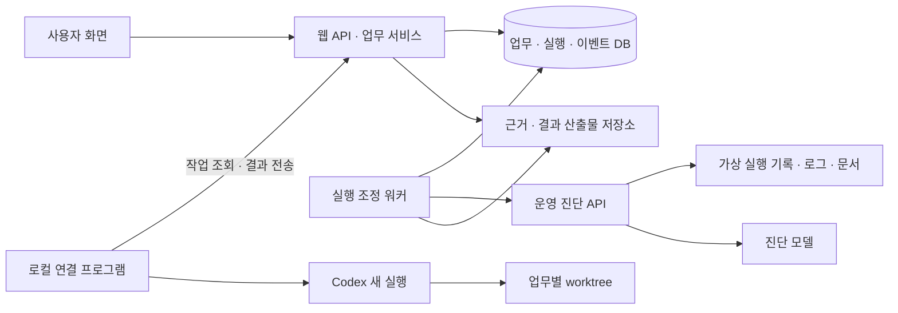

# 아키텍처 — 기존 에이전트 등록과 업무 자동 실행

갱신일: 2026-10-01 (phase 19 step 0 — "판단 — phase 19" 절 추가: 흐름·판단 단계 가르기·스키마 v15·계약·러너·경로·화면·이름 고정). 이전: 2026-09-30 (phase 17 step 0 — "사람 사이 인계 — phase 17" 절 추가: 맡기기 정책·소유자 승인·꺼진 러너 대기·검증만 다시·요청문·저장소 보기·스키마 v13·이름 고정). 이전: 2026-09-30 (phase 16 step 0 — "업무 화면 — phase 16" 절 추가: 주소·스키마 v12·직접 작업·PR 신호·이름 고정). 이전: 2026-09-27 (phase 11 step 8 — 연결 화면·[에이전트에게 맡기기] 버튼). 이전: 2026-09-27 (phase 11 step 6 — 자동 매칭 구현·대기 코드 표). 이전: 2026-09-27 (phase 11 step 0 — "GitHub App 연결 — phase 11" 절 추가). 이전: 2026-09-27 (phase 10 step 0 — "셀프호스트 — phase 10" 절 추가). 이전: 2026-09-27 (phase 9 step 0 — "측정 — phase 9" 절 추가, step 6 — 지표 결과 모양 `Stat.total`·`Ratio`·`MetricsGroup` 고정, step 12 — 접수 → 완료 = GitHub 병합 시각, 접수 → 승인 분리). 이전: 2026-09-23 phase 8 step 15 — GitHub 업무 순환 구현·대역 검증 완료
상태: 현재 구현의 설계·계약과 초기 설계 이력을 포함한다. 새 제품 기준은 [ADR-0011](adr/0011-task-driven-work-cycle.md), 수용 기준은 [PRD](PRD.md)다. 아래 전환 설계는 미구현이며, 이후 본문의 phase 6·7 계약을 이미 변경했다는 뜻이 아니다. 실제 연결 검증 범위는 [VERIFICATION_LOG](VERIFICATION_LOG.md)를 따른다.

## 실서비스 전환 설계 — ADR-0011

출시 순서 정정(2026-09-23): [ADR-0013](adr/0013-existing-tasks-first-staged-rollout.md)과 [ROADMAP](product/ROADMAP.md)에 따라 기존 업무 접수·Agent 실행·원본 결과 반영·제한된 후속 생성을 MVP로 구현한다. 기본 실행 기록은 처음부터 남기지만 아래 패턴 발견·추천·효과 분석 기능은 후속이다. 과거 전체 로그 정규화·분석을 MVP의 선행 구현으로 강제하지 않는다. 아래 구현 순서는 기술 의존 관계의 초안이며 버전 범위는 ROADMAP을 따른다.

2026-09-23 확장([ADR-0012](adr/0012-delegated-decisions-and-pattern-feedback.md)): 위임된 AI 판단과 이력 기반 패턴 발견·도입 후 효과 검증을 포함한다. 아래 중앙 모델 미호출은 현재 구현 기준이며 새 제품의 영구 제약이 아니다. 특정 모델·SDK·호출 위치는 아직 채택하지 않았다.

### 패턴 발견과 개선의 설계 대상

- 기록 연결: 허용된 출처에서 원본 식별자·업무 식별자·시각·행동·역할·입출력·결과를 읽는다. 원본과 추정·메모리를 구분하고 중복·누락·시계 차이·연결 불명확성을 보존한다. 접근 범위·보관·삭제·모델 전달 범위를 수집 전에 정한다.
- 후보 정형화: 반복·대기·예외를 근거로 시작 조건·필수 입력·담당 역할·행동·후속·검증 기준을 제안한다. 후보와 적용 정책을 분리하고 개인/팀 적용 범위·근거·버전을 남긴다. 기존 KindSpec·SuccessorRule로 표현되는지 먼저 확인하며 새 스키마를 선결정하지 않는다.
- 위임 판단: 허용 행동 후보를 구성한 뒤 모델 평가를 입력으로 정책을 적용한다. 미해결 시 제한된 조회·전문 에이전트 검토·사람 요청으로 이어진다. confidence는 실제 업무별 검증 없이 자동 실행의 단독 근거가 될 수 없다.
- 효과 검증: 자동화 적용 전부터 비교 가능한 지표를 수집하고 정책·모델·패턴 버전과 연결한다. 과거 이력 재생·실행 없는 비교 후 제한 적용한다. 업무 구성 변화와 관측 누락을 표시하고, 적용 중단·이전 버전 복귀 및 활성 Execution 처리 정책을 설계한다.

모델 재학습은 이번 범위가 아니다. 새 기능 구현은 현재 계약을 유지하는 경계부터 TDD로 진행하며, 아래 기존 순서에 기록 정규화·기준 측정을 앞단으로, 패턴 후보 검증·적용 후 비교를 후속 단계로 추가한다. 구체적인 구현 step은 아직 작성하지 않았다.

제품의 실행 단위는 Task이며 Chain은 현재 구현의 묶음이다. 실서비스 전체를 사전 구성한 단일 체인으로 제한하지 않는다. Task·Execution·Artifact와 실행 입력 고정, 기존 연결 프로그램, 증거 기반 판정, 중복 실행 방지는 재사용한다. 다음 항목은 구현 전 구체화할 설계 방향으로, 새 API 필드·상태·DB 스키마는 아직 확정하지 않았다.

| 영역 | 필요한 변화 | 검증할 불변식 |
|---|---|---|
| 업무 접수 | 외부 업무 식별·갱신과 입력 요구 파악 | 같은 외부 이벤트로 업무가 중복되지 않음 |
| 담당 관계 | 사람·역할·업무 대상과 사용 가능한 Agent·위임 범위 연결 | 에이전트 소유자와 담당자를 혼동하지 않고, 결과가 권한을 확대하지 않음 |
| 실행 가능 판단 | 목록에서 업무별 입력·의존·권한·위임·가용성 평가 | 무관한 업무의 대기가 준비된 업무를 막지 않음. 자원 충돌 제약은 유지 |
| 결과와 후속 | 결과에서 후속 제안을 받아 기존 업무 연결 또는 새 Task 생성 | 원인 Execution·Artifact 버전 추적, 동일 원인 재처리 시 중복 생성 방지 |
| 사람 개입 | 결정·정보·권한·조율 요청과 응답을 보존하고 재평가 | 해결 전 실행하지 않고, 응답 후 새 업무 등록 없이 재개 |
| 완료와 승인 | 형식 검증·품질 검증·업무 마감·후속 착수 조건 분리 | 필요한 승인을 우회하지 않으며 허용된 검토를 불필요하게 막지 않음 |

입력 해석·후속 작업 제안은 규칙 또는 에이전트로 수행할 수 있으나 주체와 계약은 미정이다. 현재 중앙 LLM 미호출 규칙을 그대로 유지한다. 제안의 채택·권한 확인·상태 변경은 명시적인 정책과 저장된 근거를 따른다. 결과 요약을 곧바로 실행 명령이나 임의 파일 경로로 해석하지 않는다.

n8n 입구·callback은 현재 계약을 유지한다. n8n이 더 많은 실행을 맡을지는 별도 결정하며 같은 업무를 두 엔진이 독립적으로 생성·배정하지 않도록 책임을 하나로 정한다. 현재 `chain_settled`는 사람 차례 통지이고 최종 성공이나 일반적인 재개 이벤트가 아니다.

### 구현 계획을 구체화할 순서

1. 담당 관계·필수 입력·위임·대기 사유의 도메인과 계약을 설계한다. 검증: PRD의 A·B 자동 실행과 C·D·E 대기를 구분하는 테스트를 먼저 작성한다.
2. 목록 단위 실행 판단과 사람 요청·응답 후 재개를 구현한다. 검증: 독립 업무가 진행되고, 필요한 응답 후 해당 업무만 재평가되며 중복 실행이 없다.
3. 결과 기반 기존 업무 연결·새 업무 생성·배정을 구현한다. 검증: A → 기존 C, B → 새 F, 모호한 제안 보류, 재전송·재시작의 중복 방지와 생성 반복 제한을 확인한다.
4. 실제 외부 업무 도구 한 종류와 실제 Agent로 전체 순환을 검증한다. 검증: PRD 수용 시나리오와 병목 지표를 기록한다. 구체적인 첫 도구·업무 사례·비용은 실행 전 정한다.

각 단계는 `service`에서 분기하고 TDD를 적용한다. DB 변경은 기존 데이터 보존과 마이그레이션을 설계한 뒤 수행하며, 공개 데모의 초기화 배포 방식을 실서비스에 자동 적용하지 않는다. 현 단계에서는 계약 v1 예시·코드 식별자·스키마 버전을 바꾸지 않는다.

## GitHub 업무 순환 — phase 8 계약

상태(2026-09-23 step 15): 아래 step 1~13 이 구현되어 있고 step 14 의 대역 e2e(`tests/e2e/test_github_cycle.py`)를 통과했다. 실제 GitHub·실제 Agent 는 아직 쓰지 않았다(step 16). 운영 절차·미검증 항목·계획과 구현의 차이는 [GitHub 런북](github/README.md).

[ADR-0014](adr/0014-github-task-cycle.md)를 따른다. 위 구현 순서 1~4를 GitHub Issues 버그 수정 → 커밋 검토 한 유형으로 구체화한 것이며 아래 이름은 구현 step 표기를 따른다. 예시 payload 는 [CONTRACT](CONTRACT.md) 13절. 계약 버전은 1 그대로이고 기존 v1 payload 는 바뀌지 않는다.

step 1 구현 상태: 위치가 `contracts/`(1) 인 모델은 있다 — `BUILTIN_KIND_NAMES`·`BUILTIN_KINDS` 4종, `BUILTIN_RULES` 에 `bug_fix → code_review`, 산출물 kind `code_review_result`, `ExecutionRequest` 의 종류별 target 규칙(`bug_fix` 는 `CodeChangeTarget`·입력 비어도 됨, `code_review` 는 `CommitReviewTarget`·입력 필수). 내장 이름은 예약어다 — 계약은 사용자 정의 `KindSpec` 이 내장 이름이면 거부하고, 화면 `POST /kinds` 는 409 `kind_exists`.

step 4 구현 상태: 새 세션(`repo.create_session`)은 내장 종류 4개·내장 규칙 2개를 seed 하고, 기존 세션은 아래 "저장 — v5 마이그레이션" 이 넣는다. 완료 기준 템플릿(`domain/completion`)에 `bug_fix`·`code_review` 항목을 더했다. 실행·판정 경로(step 8~10)는 아직 없어, 지금 만든 `bug_fix`·`code_review` Task 는 실행되지 않고 머문다 — phase 가 끝나기 전 `service` 에 병합하지 않는다.

step 5 구현 상태: `adapters/github_client.py` 의 `HttpGitHubClient`(HTTPX, transport 주입)가 있다. 아직 부르는 곳은 없다(수집 step 7, 댓글 전달 step 12). 아래 "GitHub REST 경계" 참고.

step 6 구현 상태: `server/github_api.py` 가 운영자 설정 API(`/github/sources`·미리보기·변경·중지·담당 연결, 요청·오류는 [CONTRACT](CONTRACT.md) 13.10)를 제공한다. 운영자 세션만, 소스는 만든 세션 소유, 다른 세션이 이미 GitHub 소스를 가지면 새 소스를 거부한다(셀프호스트 1개 워크스페이스 — 전역 토큰을 두 워크스페이스가 나눠 쓰지 않게). 설정은 `Settings.github_token`(`WORKFLOW_GITHUB_TOKEN`, `OPTIONAL_SECRET_KEYS` — 비면 기능만 꺼지고 `WORKFLOW_DEV` 도 만들지 않음, `repr` 제외)·`Settings.github_repos`(`WORKFLOW_GITHUB_REPOS`)에서 읽고 응답은 `token_configured` 만 보인다. 저장소는 허용 목록 안(대소문자 무시, 저장은 목록 표기)에서만, 변경 시 저장소는 바꿀 수 없다(커서·원본 매핑이 그 저장소 것). `config_revision` 잠금은 `repo.save_github_source(..., expected_revision=)` 가 같은 트랜잭션에서 검사한다(`StaleConfig` → 409 `stale_config`). 검토 Agent·담당 Agent 는 세션 등록 + `code.review`/`code.fix {repository_id}` 능력 + (담당) 소스 검증 프로필 보고를 요구한다. 설정 변경은 이미 만든 Task·Execution 입력을 바꾸지 않는다. GitHub 클라이언트는 워커가 만든다(step 7).

step 7 구현 상태: `server/github_sync.sync_source` 가 소스 하나를 목록 폴링으로 수집한다(webhook 없음). 워커는 `settings.github_token` 이 있을 때만 `HttpGitHubClient(settings.github_token, settings.github_repos)` 를 만들고, tick 첫 단계에서 켜진 소스마다 `GITHUB_SYNC_INTERVAL_SECONDS`(60초) 간격으로 부른다(rate limit 이면 알려준 시간, 없으면 60초 쉰다. 간격은 메모리 값이라 재시작하면 바로 한 번 부른다). 수집은 Task 만 만들고 착수하지 않는다 — 준비 판정·착수는 step 10.
- 범위(`domain/issue_intake.intake_scope`, 아직 Task 가 없는 이슈만): 다른 저장소·PR 은 언제나 제외. `selected_issue_numbers` 로 고른 이슈는 명시적 선택이라 라벨·시작 시각·닫힘과 무관하게 받는다(닫혀 있으면 준비 판정이 `source_closed`). 그 밖은 open 이고 `label_filter` 라벨을 모두 가지며(대소문자 무시) `created_at >= start_at` 이어야 한다 — 시작 전 백로그(`before_start`)·라벨 불일치·닫힘·필터 없음(`not_selected`)은 받지 않고 `SyncReport.skipped` 에 사유별로 센다. 이미 받은 이슈는 범위를 벗어나도(라벨 제거 등) 계속 갱신한다.
- 매핑(`snapshot_to_task_spec`): `bug_fix`, 요구 능력 `code.fix {repository_id: workflow_repository_id}`, 제목 = 이슈 제목, 요청 = 본문(앞뒤 공백 제거, 명령·경로로 해석하지 않음), `run_mode` = 그 시점 설정, 선택 `auto`·완료 `review`, 완료 기준 = 내장 템플릿, target `{}`(실행 생성 때 등록값으로 고정), `source_ref` = `owner/name#번호`, 상태 `대기 · 준비 판정 대기`.
- 커서: 최초는 `IssueCursor(since=start_at)`. 한 페이지의 이슈를 모두 저장한 뒤에 다음 페이지 커서를 저장한다 — GitHub 오류(`SyncReport.error`)나 저장 중 예외면 커서가 그 페이지에 남아 다음 호출이 다시 받고, 다시 받은 이슈는 `unchanged`. 마지막 페이지 뒤 `since` = 이번에 본 가장 늦은 `updated_at`(포함 경계). since 가 그대로이고 1페이지뿐이었을 때만 ETag 를 남겨 다음 요청이 304 가 된다. 한 호출은 최대 `MAX_PAGES_PER_SYNC`(10) 페이지. 아직 받지 않은 선택 이슈는 목록 뒤에 `get_issue` 로 받는다(404 는 `not_found` 로 세고 넘어감). 알려진 한계: 페이지를 넘기는 사이 다른 이슈가 수정돼 뒤로 밀리면 번호 기반 페이지에서 한 건이 빠질 수 있다 — 그 이슈가 다음에 수정되거나 선택 번호로 지정되면 들어온다.
- 원본 변경(`repo.upsert_source_issue`): 제목·요청이 바뀌면 같은 트랜잭션에서 Task 제목·요청을 바꾸고 `revision`+1(`SourceIssueUpsert.input_changed`, `SyncReport.input_changed` — 재평가 필요). 마감된 Task 는 바꾸지 않는다. 진행 중 Execution 의 `request_json`·`task_revision` 은 그대로라서 "Task revision > 실행의 task_revision" 이 재평가 필요 기록이다. 담당·라벨·상태·`updated_at`(원본 댓글로 인한 변경 포함)만 바뀐 것은 원본 스냅샷의 `source_revision` 만 올린다. 닫힘·재오픈은 Task 를 마감·재생성하지 않는다.
- 준비 판정 입력(`github_sync.task_intake_facts` → `domain/issue_intake.IntakeFacts`, `TaskFacts(**facts.as_kwargs())`): 가져온 Task 와 직접 등록 Task 가 같은 함수를 거친다. 원본 매핑이 있으면 스냅샷의 담당자·`AssigneeBinding`·원본 상태·소스 `max_rework_rounds`, 없으면(직접 등록) `assignee_ids=None`(직접·자동 선택). 요청은 언제나 필수(`request_required`).
- 댓글은 읽지 않고 GitHub 에 쓰지 않는다 — 원본 댓글이 업무를 만들거나 명령이 되는 경로는 없다.
- 병합 PR 조회(phase 9 step 12, ADR-0015 결정 9): 수집(목록·선택 이슈)이 오류 없이 끝나면 `list_issues_needing_merge_check`(닫힘·병합 시각 모름) 중 아직 조회 안 했거나 조회 뒤 이슈가 바뀐(`issue_updated_at > merge_checked_at`) 이슈를 번호순으로 한 호출에 최대 `MAX_MERGE_CHECKS_PER_SYNC`(20) 건 `get_issue_pr_link` → `record_issue_merge`. 병합 없음도 `merge_checked_at` 을 남겨 이슈가 다시 바뀔 때까지 재조회하지 않는다. 조회 실패는 `SyncReport.merge_error`(워커가 경고 로그)에만 남고 이미 저장한 수집 결과는 그대로다 — rate limit·연결 실패는 이번 조회를 멈추고(rate limit 은 `retry_after_seconds`), 이슈 하나의 오류(없는 이슈 등)는 건너뛴다. `SyncReport.merged` = 병합을 새로 기록한 Task.

step 8 구현 상태: 연결 프로그램이 `bug_fix` 를 실행한다 — 도구별 `launch` 는 그대로, 공통 `LocalToolAdapter.run` 이 `request.kind ∈ DEMO_REPORT_KINDS`(`code_change`)일 때만 데모 프롬프트(`build_prompt`)·`vp-report` 보고서(`report_output`)를 쓰고, 그 밖(`bug_fix`)은 `build_bug_fix_prompt`(요청 원문 + 저장소 규칙, 데모 문구 없음, 인계 디렉터리의 `CodeReviewResult` JSON 을 "이전 검토 지적" 절로) + 등록된 `verification_profile_id` 하나로 `diff`·`test_log_before`(결과 커밋의 새 테스트만 `base_commit` 체크아웃에서)·`test_log_after`·`verification_log`(결과 커밋의 깨끗한 체크아웃)를 남긴다. 기준 커밋 고정: 도구를 띄우기 전 worktree HEAD ≠ `base_commit` 이면 `base_commit_mismatch`, 미커밋 잔여 변경이면 `worktree_dirty`, 도구가 직접 커밋해 HEAD 가 움직였으면 `commit_mismatch`(원시 로그 보존, `process_stopped` = 도구 종료 확인값). 재작업은 `base_commit` = 이전 `result_commit` 이라 남은 `task/<id>` 브랜치에서 이어진다. 도구·검증 환경은 기존 허용 목록(`codex_env`)이라 `WORKFLOW_GITHUB_TOKEN`·`GITHUB_TOKEN`·`GH_TOKEN` 이 없다. 연결 프로그램은 claim 에 `supported_kinds = SUPPORTED_BUILTIN_KINDS`(`code_change`·`bug_fix`)를 보내고 서버 claim 은 `repo.record_supported_kinds` 로 `connectors.supported_kinds_json` 에 남긴다(생략 claim 은 NULL). 중앙의 `bug_fix` 결과 판정(`required_artifacts` 에서 `report_output` 제외·`commit_matches`)과 실행 생성은 step 10 이다.

step 9 구현 상태: 연결 프로그램이 `code_review` 를 실행한다. `LocalToolAdapter.run` 은 target 이 `CommitReviewTarget` 이면 `_run_commit_review` 로 간다 — 인계 디렉터리만 읽는 `_run_generic` 이 아니다. 착수 전(도구를 띄우지 않음): 검토 등록(`registration_missing`) → `result_commit`·`base_commit` 이 그 등록 저장소에 있음(`git_ops.has_commit`, 없으면 `commit_missing` — 수정·검토 등록이 같은 로컬 저장소를 봐야 하고 다른 기기·클론으로 커밋을 옮기지 않는다) → `base_commit` 이 `result_commit` 의 조상(`git_ops.is_ancestor`, `commit_mismatch`) → 인계 디렉터리의 `CodeChangeResult` 중 `execution_id == source_execution_id` 가 있고 그 `base_commit`·`result_commit` 이 target 과 같음(`source_mismatch`). 그 뒤 결과 커밋의 깨끗한 임시 체크아웃(`_in_clean_checkout`, 시스템 임시 디렉터리의 detached worktree)에서 도구별 `launch_readonly`(Codex `--sandbox read-only -C <체크아웃>`, Claude `Read Glob Grep`, cwd 체크아웃) + 스키마 `REVIEW_RESULT_SCHEMA`, 프롬프트 `build_review_prompt`(첫 줄 `# 커밋 검토`, 요청·두 커밋·수정 결과 요약·검증 기록, 저장소에서 직접 뽑은 `base..result` diff — 60,000자 초과분은 잘라 체크아웃에서 읽게 함 — 인계 목록, 읽기 전용·실행 금지 규칙). 실행 뒤: 시간 초과·`classify_failure` → 체크아웃 HEAD ≠ `result_commit`·체크아웃 변경(`git status`)·인계 파일 변경은 `readonly_violation` → `read_structured_message`(Codex 마지막 메시지 파일, Claude `structured_output`)를 `CodeReviewResult` 로 검증(`result_invalid`). `reviewed_commit` 은 도구가 적은 값이 아니라 검토 뒤 확인한 체크아웃 HEAD 다. 체크아웃은 성공·실패와 관계없이 지우고, 원본 저장소 작업 트리·수정 Task 의 `task/<id>` 브랜치는 건드리지 않는다. runner 는 target 모양으로 결과 봉투를 고른다(`CodeChangeTarget` → `code_change_result`, `CommitReviewTarget` → `code_review_result`, 그 외 `generic_result`) — 종류 이름 분기 없음. 검토 Task 는 업무 worktree 가 없어 인계 디렉터리만 정리한다. `SUPPORTED_BUILTIN_KINDS` 에 `code_review` 를 더했다. 중앙의 검토 결과 판정(`reviewed_commit` = 최신 수정 결과 · `stale_review`)과 검토 실행 생성은 step 10 이다. 실제 Codex·Claude 가 git worktree 체크아웃에서 이 인자로 도는 동작은 가짜 실행 파일로만 확인했다.

step 10 구현 상태: 중앙 워커가 업무 순환을 돈다. 종류 이름 분기 대신 `domain/execution_policy.BUILTIN_POLICIES` 를 조회한다 — `verifier` 가 `report_code_change`(데모 `code_change`, 기존 검사 그대로)·`code_change`(`bug_fix`)·`commit_review`(`code_review`)·`generic`(사용자 정의)·`diagnosis`, `cycle` 이 참인 종류(`bug_fix`·`code_review`)만 아래 순환을 타고 기존 후속 스캔(`_spawn_successors`)에서는 빠진다. tick 순서: … 코드 수정 결과 확인 → 커밋 검토 결과 확인 → 범용 판정 → `_advance_cycle`(결과 → `decide_followup` → 저장 → 준비 판정 → 착수, 그다음 실행 없는 Task 의 준비 판정 → 착수) → 후속 스캔 → 실패 반영 → callback. 트랜잭션 중 HTTP·도구를 기다리지 않고 GitHub 에 쓰지 않는다(원본 반영은 tick 마지막 단계 — step 12).
- 판정: `bug_fix` 는 `result_parsed`·`result_ids_match`(결과의 execution_id·task_id)·`commit_matches`(결과 `base_commit` = 요청 target)·`required_artifacts`(정책 표 — `report_output` 없음)·`test_before_failed`·`verification_passed`. `needs_information` 결과는 수정·검증이 없는 정상 제출이라 앞의 셋만 보고 통과시킨다 — 그래야 `decide_followup` 이 `fix_verification_failed` 가 아니라 `fix_needs_information` 사람 요청을 만든다. `code_review` 는 `result_parsed`·`result_ids_match`·`source_matches`(결과 `source_execution_id` = target)·`commit_matches`(`reviewed_commit` = target `result_commit`). 최신 수정 결과인지는 판정이 아니라 후속 결정(`stale_review`)이 본다.
- 준비 판정 재료(`server/task_cycle.task_facts`·`evaluate`): 세션 등록 Agent·연결 프로그램의 마지막 `supported_kinds`·heartbeat, `github_sync.task_intake_facts`(담당·요청·실행 방식), 사람 요청(열린 요청 → `decision_pending`, `*_needs_information` 요청 당시 revision → `input_missing`), 원본 이슈 상태·허용 저장소(`Settings.github_repos`)·재작업 상한은 Task 또는 선행을 따라 올라간 원본 매핑(`origin_source` — 검토 Task 는 수정 Task 의 원본을 따른다). 실행 Agent 가 정해진 뒤 그 로컬 등록에서 아직 도는(`queued`·`accepted`·`running`·`unknown`) 다른 수정 실행을 `repo.busy_executions` 로 넣어 다시 평가한다 — `result_ready`(검토·사람 대기)는 저장소를 쓰지 않으므로 다른 업무를 막지 않는다. 대기면 Task 상태를 `대기 · <사유 · 사유>`(직접 실행 모드만 남으면 `실행 가능 · 직접 실행 모드`)로 쓴다.
- 착수: 실행 없는 `bug_fix` Task 는 `auto_start_key(task_id, revision)`, target = 실행 Agent 의 `local_registration_id` + 기준 커밋(재작업이면 검토한 결과 커밋, 아니면 이 Task 의 마지막 결과 커밋, 없으면 등록 보고값) + 소스 `fix_verification_profile_id`(원본이 없으면 Agent 의 첫 보고 프로필). 이슈 본문은 `request` 문자열일 뿐 target·Agent·프로필을 바꾸지 않는다. 실행 중 원본 편집(Task revision+1)은 활성 실행이 있는 동안 새 실행을 만들지 않는다.
- 후속: 결과마다 `FollowupContext` 를 DB 에서 다시 계산한다 — 기존 후속은 `predecessor_task_id` 가 이 수정 Task 이고 규칙 `to_kind` 인 마감 전 Task(미리 등록된 것 포함), 이미 처리한 원인은 그 Task 들의 실행 `start_key` 와 사람 요청 `cause_key`. `create_task` 는 `repo.create_followup_once`(검토 Task: `<종류 label>: <수정 제목>`, 요구 능력 = 후속 종류 능력 + 수정 Task 의 같은 범위 값, 실행 Agent = 소스 `review_agent_id`, 실행 방식 = 그 시점 소스 설정) 뒤 착수, `link_existing` 은 그 Task 에 착수 — 둘 다 `start_key` `review:<fix_execution_id>`, target `CommitReviewTarget`(검토 Agent 등록 + 수정 결과의 두 커밋), 입력은 규칙 `handoff_kinds` 인계 묶음(`assemble_handoff`), 준비 판정에 `pair_agent_id`(같은 연결 프로그램·저장소)를 넣는다. 진행 중인 이전 검토 실행은 끊지 않고 끝나기를 기다린다. `rework` 는 같은 수정 Task 의 다음 시도(`rework:<review_execution_id>`, 입력 = 이전 수정 결과·검토 결과 산출물, 기준 커밋 = 검토한 결과 커밋)이고 이전 시도의 잠금 해제와 새 시도 생성은 `repo.create_execution(..., release_execution_id=)` 한 트랜잭션이다. 검토 Task 는 `대기 · 수정 요청 — 재작업 결과 대기`. `request_human` 은 `repo.create_human_request_once` + 대상 Task `확인 필요 · <이유>`(재개는 아래 step 11). `approved` 는 검토 Task 를 `완료 · 검토 승인` 으로 마감하고 수정 Task 는 `확인 필요 · 검토 승인 — 병합·이슈 종료는 사람`(잠금 유지). 보류: `source_closed` → `대기`, `stale_review` → 검토 Task `확인 필요`, 운영자 종료(`실패` 마감)면 아무 것도 만들지 않는다. 규칙 revision 개념은 아직 없어 `followup_links.rules_revision` 은 1 이다.

step 11 구현 상태: 사람 요청과 응답 후 재개. 응답 권한은 운영자 세션뿐이다(MVP) — GitHub 담당자를 웹 인증 사용자로 보지 않고 GitHub 댓글을 응답·승인 명령으로 읽지 않는다(댓글에는 응답 위치 안내만 쓴다 — step 12). API 는 `server/human_api.py`(CONTRACT 13.11).
- 요청이 생기는 곳: (1) 후속 결정 `request_human`(step 10 — `fix_verification_failed`·`fix_needs_information`·`review_*`·`rework_limit_reached`), (2) 준비 판정 대기 중 운영자가 정해야 풀리는 사유 `task_cycle.READINESS_REQUEST_CODES`(`assignee_multiple`·`delegation_denied`·`input_missing`) — 워커 `_write_blocked` 가 cause_key `ready:<code>:r<revision>` 로 revision 마다 한 번 만든다. 이미 다른 요청을 기다리면(`decision_pending`) 더 묻지 않는다. (2)는 그 대기 사유가 이미 막고 있으므로 `decision_pending` 에 세지 않는다 — 담당자를 한 명으로 줄이는 식으로 사유가 사라지면 응답 없이도 착수한다.
- 응답(`human_api.respond_to_request` → `repo.record_human_response_once`): `response_id` 멱등, `expected_revision` 잠금, 요청 `answered`·Task `revision`+1 을 한 트랜잭션에서. `action` 은 요청 code 별 허용(`assignee_multiple` → `choose_agent`·`close`, 그 밖 → `resume`·`close`), 정보 요청(`input_missing`·`*_needs_information`)은 빈 답을 받지 않는다. `choose_agent` 는 세션 등록 Agent 만 받아 같은 트랜잭션에서 `chosen_agent_id` 로 두고, 담당자 연결·능력·위임 범위는 재평가가 다시 본다 — 응답은 권한·소스 설정을 바꾸지 않는다(위임 밖은 설정 API 가 따로). `close` 는 같은 트랜잭션에서 `실패 · 운영자 종료 — 사람 요청 응답` 마감 + 활성 실행 해제. 마감된 Task 는 `repo.create_execution` 도 같은 트랜잭션에서 `TaskClosed` 로 거부해 종료와 착수가 겹쳐도 실행이 붙지 않는다.
- 응답 내용: `task_cycle.request_text` 가 Task 요청 원문 뒤에 글이 있는 응답을 `## 사람 응답 (운영자)` 절로 붙여 다음 실행 `request` 와 준비 판정의 `request_text` 로 쓴다. Task 요청 원문·원본 스냅샷은 바꾸지 않는다.
- 재개: 응답은 실행을 만들지 않는다. 실행이 없던 Task 는 다음 tick 의 준비 판정이 새 revision 의 `auto_start_key` 로 착수한다. 결과를 기다리던 시도(`result_ready`, 잠금 유지)는 그 시도 이후에 물은 요청(ready: 제외)의 응답이 시도의 `task_revision` 보다 새 revision 을 만들었을 때만 `_resume` 이 해제 + 새 시도를 한 트랜잭션으로 만든다(`auto_start_key`, 준비 판정 통과 필요) — 수정은 입력 = 이전 입력 + 이전 결과, 기준 커밋 = 마지막 결과 커밋, 검토는 같은 수정 결과(`source_execution_id`)를 다시 본다. 응답이 없으면(원본 편집만으로 revision 이 올라도) 결과를 기다리는 시도를 다시 돌리지 않는다. `TickReport.tasks_resumed`.
- 스키마: v5 는 아직 배포 전이라 `human_responses.agent_id`(nullable)를 v5 DDL 에 더했다 — 이 브랜치로 이미 v5 를 만든 로컬 개발 DB 는 다시 만들어야 한다.

### 현재 코드와의 간극 (step 0 확인)

| 영역 | 현재 코드 | phase 8 에서 바꿀 것 |
|---|---|---|
| 외부 업무 | `adapters/task_sources.py` 의 GitHub·Jira 는 fixture, 수집·원본 ID 저장 없음 | `adapters/github_client.py`(step 5) + `server/github_sync.py`(step 7) + 원본 매핑 저장(step 4) |
| 코드 수정 판정 | `worker._code_result_checks` 가 `report_output`·expected-report 를 항상 요구, `LocalToolAdapter.run` 이 `vp-report` 로 보고서 생성 | `bug_fix` 는 `BUILTIN_POLICIES` 의 필수 산출물만 요구(step 8·10). `code_change` 경로는 그대로 |
| 검토 | 사용자 정의 종류는 `_run_generic` 으로 인계 디렉터리만 읽음 — 결과 커밋을 보지 않음 | `code_review` 가 `CommitReviewTarget` 의 결과 커밋을 깨끗한 읽기 전용 체크아웃에서 읽음(step 9) |
| 후속 | `_spawn_successors` 는 미리 등록된 후속 Task 만 착수 | `decide_followup` 으로 기존 연결·새 Task 생성·재작업·사람 요청(step 3·10) |
| 담당 | Agent 능력 선택만 있음. GitHub 담당자 개념 없음 | `AssigneeBinding`, `TaskReadiness`(step 2·6) |
| 사람 개입 | 검토 승인·수정 요청·종료 버튼뿐 | `HumanRequest`·응답 후 재평가(step 11 구현 — `server/human_api.py`) |
| 원본 반영 | n8n callback(체인당 1회)만 | Task 별 댓글 outbox `SourceDelivery`(step 12) |
| DB | `SCHEMA_VERSION` 4, 마이그레이션 없음(`WORKFLOW_RESET_DB`) | 데이터 보존 트랜잭션 마이그레이션 4 → 5(step 4 구현됨) |

### 진단 데모 코드 수정과 일반 버그 수정 비교

> `main` 전용([ADR-0019](adr/0019-service-selfhost-only.md)) — `service` 에서는 phase 13 이 이 코드를 지운다. 아래는 `main` 공개 데모의 기록이다.

| 항목 | 데모 `code_change`(유지) | 일반 `bug_fix`(신규) |
|---|---|---|
| 착수 입력 | 판정 통과 진단의 `handoff_bundle` 필수(`input_artifact_ids` 비면 422) | 이슈 스냅샷을 담은 `request` + 고정 target. 첫 시도 `input_artifact_ids` 빈 배열 허용. 재작업 시 이전 `code_change_result`·`code_review_result` |
| target | `CodeChangeTarget` | `CodeChangeTarget` 재사용 — `base_commit` 은 실행 생성 시 그 로컬 등록이 마지막으로 보고한 커밋 |
| 검증 프로필 | `vp-pytest` + 보고서용 `vp-report` | 소스 설정의 `fix_verification_profile_id` 하나(등록된 ID만, 명령은 로컬 등록에만 있음). `vp-report` 사용 안 함 |
| 결과 봉투 | `CodeChangeResult` | `CodeChangeResult` 재사용 |
| 필수 산출물 | `diff`·`test_log_before`·`test_log_after`·`report_output`·`verification_log` | `diff`·`test_log_before`·`test_log_after`·`verification_log` |
| 판정 checks | `result_parsed`·`required_artifacts`·`test_before_failed`·`verification_passed`·`report_matches` | `result_parsed`·`result_ids_match`·`commit_matches`·`required_artifacts`·`test_before_failed`·`verification_passed` |
| 재현 테스트 없음·변경 없음 | `needs_information` | 같음 |
| 다음 단계 | 사람 검토(웹 승인·수정 요청) | 판정 통과 + `ready_for_review` 면 `code_review` 자동 연결 |

### 인터페이스 — 이름·소유·책임

| 이름 | 위치(step) | 필드·시그니처 | 책임과 오류 |
|---|---|---|---|
| `GitHubIssueSnapshot` | `contracts/github.py`(1) | `repository_id: int`, `repository_full_name`, `issue_id: int`, `number: int`, `title`, `body`, `state: open\|closed`, `labels: list[str]`, `assignee_ids: list[int]`, `assignee_logins: list[str]`, `html_url`, `created_at`, `updated_at`(RFC 3339), `is_pull_request: bool` | GitHub 응답에서 필요한 값만. `snapshot_digest(snapshot)`(sha256, 정렬된 JSON)로 같은 내용 판정. `body` 는 `Task.request` 재료일 뿐 명령·경로로 해석하지 않음 |
| `GitHubSourceConfig` | `contracts/github.py`(1) | `source_id`(`ghs-` + 8 hex), `repository_full_name`, `workflow_repository_id`(이 제품 scope 값), `label_filter: list[str]`, `selected_issue_numbers: list[int]`, `start_at`, `fix_verification_profile_id`, `review_agent_id`, `run_mode: auto\|manual`, `max_rework_rounds: int`(0~3, 기본 1), `enabled: bool`, `config_revision: int` | 토큰 필드 없음. `repository_full_name ∉ WORKFLOW_GITHUB_REPOS` 는 422 `repository_not_allowed`. `label_filter`·`selected_issue_numbers` 가 둘 다 비면 422(전체 백로그 금지) |
| `AssigneeBinding` | `contracts/github.py`(1) | `source_id`, `github_user_id: int`, `github_login`(표시용), `agent_id` | 운영자가 등록. Agent 가 없거나 `code.fix {repository_id}` 능력이 없으면 422. 같은 `(source_id, github_user_id)` 는 하나 |
| `CommitReviewTarget` | `contracts/v1.py`(1) | `local_registration_id`, `source_execution_id`, `base_commit`, `result_commit`(전체 SHA) | `code_review` 전용 target |
| `CodeReviewResult` | `contracts/v1.py`(1) | `contract_version`, `execution_id`, `task_id`, `source_execution_id`, `reviewed_commit`, `outcome: approved\|changes_requested\|needs_information`, `summary`, `findings: list[ReviewFinding]`, `missing_information: list[str]`, `artifact_ids` | 검증: `changes_requested` → `blocking` finding 1개 이상, `approved` → `blocking` 없음, `needs_information` ↔ `missing_information` 비어 있지 않음. `ReviewFinding(severity: blocking\|non_blocking, path: str\|None, line: int\|None, message)` — `path` 는 표시용 문자열 |
| `ClaimRequest.supported_kinds` | `contracts/v1.py`(1) | `list[KindId] \| None = None` | null 이면 구버전 — 내장 중 `diagnosis`·`code_change`(`LEGACY_BUILTIN_KINDS`)만. 서버가 `connectors.supported_kinds_json` 에 저장 |
| `ExecutionPolicy` / `BUILTIN_POLICIES` | `domain/execution_policy.py`(10) | `kind`, `target: diagnosis\|code_change\|commit_review\|local`, `result_kind`, `required_artifacts`, `verifier: diagnosis\|report_code_change\|code_change\|commit_review\|generic`, `cycle: bool`, `starts_from_result`(= target `commit_review`). `policy_for(kind)` | 종류 이름 분기 대신 조회하는 표. 사용자 정의 종류는 `GENERIC_POLICY`. 후속 종류는 규칙 표(`SuccessorRule`), 재작업 여부는 `decide_followup` 이 정하므로 step 0 초안의 `requires_report`·`followup_on_ready`·`rework_outcome` 은 두지 않았다(보고서 요구는 `verifier` `report_code_change`). step 10 구현됨 |
| `TaskFacts` → `TaskReadiness` | `domain/task_readiness.py`(2) | `evaluate_readiness(facts: TaskFacts) -> TaskReadiness`. `TaskReadiness(ready: bool, blockers: tuple[Blocker, ...], agent_id: str \| None)`, `Blocker(code, reason, actor: operator\|assignee\|system)` | DB Row 가 아닌 값(현재 시각도 `TaskFacts.now`). 아래 대기 코드 표를 모두 평가해 한 번에 돌려준다(첫 사유에서 멈추지 않음, 운영자 종료만 `task_closed` 하나). `agent_id` 는 담당 연결·`select_agent` 능력 검사를 통과한 실행 Agent. 사람이 지정한 Agent 도 같은 검사를 다시 거친다. step 2 구현됨 |
| `FollowupContext` → `FollowupDecision` | `domain/task_followup.py`(3) | `decide_followup(context: FollowupContext) -> FollowupDecision`. `FollowupDecision(action: link_existing\|create_task\|rework\|request_human\|none, reason, target_task_id, create: FollowupTaskSpec \| None, cause_key, request_code, hold_code, review_commit, base_commit, input_execution_ids)`. `FollowupContext` 는 결과 `execution_id`·`outcome`·`verdict`·`result_commit`·`rules`·`rules_revision`, 검토 결과면 `ReviewFacts(fix_task_id, source_execution_id, reviewed_commit, latest_fix_execution_id, latest_fix_commit, rounds_used, max_rework_rounds)`, 명시적 원인 참조 `existing_followup_task_id`, 이미 처리한 `handled_cause_keys` | 후속 종류는 규칙 표에서 찾는다(종류 이름 분기 없음). `cause_key` 는 `review:<fix_exec>`·`rework:<review_exec>`·`<request_code>:<exec>` — 이미 처리한 키면 `none`. `hold_code` 는 `stale_review`·`source_closed`·`task_closed`. 저장·착수는 워커. step 3 구현됨 |
| `HumanRequest` / `respond_to_request` | `adapters/repo.py`(4)·`server/`(11) | repo: `create_human_request_once(conn, task_id, code, question, cause_key, now) -> (request_id, created)`, `get_human_request(conn, session_id, request_id)`, `record_human_response_once(conn, session_id, request_id, *, response_id, expected_revision, action, text, now, agent_id=None, close_reason=None) -> (task_revision, created)`, `list_human_requests`·`list_open_human_requests(conn, session_id)`·`list_human_responses(conn, task_id)`(11). 서버: `human_api.respond_to_request(conn, session_id, request_id, body: ResponseBody, now) -> dict`(11) | 운영자만. 같은 `response_id`·같은 내용(`action`·`text`·`agent_id`) 재전송은 같은 결과, 다른 내용 `ResponseConflict` → 409 `response_conflict`, `expected_revision` 불일치·이미 응답됨 `StaleRequest(current_revision)` → 409 `stale_request`, 마감된 Task `TaskClosed` → 409 `task_closed`. 응답은 요청을 `answered` 로, Task `revision` 을 +1(다음 실행 입력). `action` 허용 값(`resume`·`choose_agent`·`close`)은 서버가 요청 code 로 검사 |
| `SourceDelivery` | `contracts/github.py`(1)·`server/github_delivery.py`(12) | `delivery_id`, `source_id`, `task_id`, `issue_number`, `body_revision: int`, `body_digest`, `state: pending\|sending\|delivered\|unknown\|failed`, `comment_id: int \| None`, `attempts`, `next_at`, `last_error` | `deliver_source_updates(conn, client, now) -> DeliveryReport`, `queue_source_updates(conn, store, public_url, now) -> int`, `marker(task_id)`. marker 조정, 최신 revision 만 전송, claim fence. step 12 구현됨 |
| `GitHubClient` | `adapters/github_client.py`(5) | Protocol `list_issues(repo, cursor: IssueCursor \| None) -> IssuePage`, `get_issue(repo, number) -> GitHubIssueSnapshot`, `list_comments(repo, number, cursor: int \| None) -> CommentPage`, `create_comment(repo, number, body) -> int`, `update_comment(repo, comment_id, body) -> None` | `api.github.com` 만, 리다이렉트 따라가지 않음, 허용 저장소 밖은 요청 전 `GitHubRepositoryNotAllowed`. 오류 `GitHubRateLimited`·`GitHubForbidden`·`GitHubNotFound`·`GitHubUnavailable`(5xx·timeout) 구분, 그 밖은 `GitHubError`. 토큰·헤더를 메시지·로그에 넣지 않음. step 5 구현됨 |
| `sync_source` | `server/github_sync.py`(7) | `sync_source(conn, client, source_id, now) -> SyncReport(source_id, disabled, pages, not_modified, created, updated, input_changed, unchanged, stale, skipped, error, retry_after_seconds, merged, merge_error)`. 순수 매핑 `domain/issue_intake.py`: `intake_scope(config, snapshot) -> IntakeScope(accept, reason, explicit)`, `snapshot_to_task_spec(config, snapshot, *, session_id, task_id) -> dict`, `intake_facts(...) -> IntakeFacts`. `task_intake_facts(conn, session_id, task_id) -> IntakeFacts` | 페이지별 커서 저장. 실패 페이지는 커서를 넘기지 않음. GitHub 오류는 `error`, DB 오류는 예외. step 7 구현됨 |

### GitHub REST 경계 (step 5)

`HttpGitHubClient(token, allowed_repos, *, transport, timeout)` — 운영은 `HttpGitHubClient.from_env()` 가 `WORKFLOW_GITHUB_TOKEN`·`WORKFLOW_GITHUB_REPOS` 를 환경변수에서만 읽는다. 중앙 서버는 같은 두 값을 `Settings.github_token`·`github_repos` 로 읽는다(step 6, 토큰은 선택 비밀값 `OPTIONAL_SECRET_KEYS`). 요청 헤더는 `Authorization: Bearer`·`Accept: application/vnd.github+json`·`X-GitHub-Api-Version: 2022-11-28`.

| 동작 | 요청 | 필요한 권한(fine-grained PAT) | 처리 |
|---|---|---|---|
| `list_issues` | `GET /repos/{o}/{r}/issues?state=all&sort=updated&direction=asc&per_page=100&page=N[&since=…]` | Issues read | `pull_request` 키가 있는 항목은 빼고 `skipped_pull_requests` 로 센다. `IssueCursor(since, page, etag)` — `etag` 가 있으면 `If-None-Match`, 304 는 빈 `IssuePage(not_modified=True)`. 다음 페이지는 Link 헤더 `rel="next"` 의 `page` 값만 꺼낸다(다른 host 면 `GitHubError`, URL 자체는 쓰지 않음). DB 에는 `IssueCursor.to_str()`(JSON, URL 없음), 읽을 때 `IssueCursor.parse` 가 키·타입을 검사한다. `state=all` 은 닫힌 이슈를 `source_closed` 로 보기 위해서다 |
| `get_issue` | `GET /repos/{o}/{r}/issues/{n}` | Issues read | PR 이면 `is_pull_request: true` 스냅샷(거를지는 수집기 몫) |
| 저장소 ID | `GET /repos/{o}/{r}` | Metadata read | 스냅샷 `repository_id` 용, 클라이언트 인스턴스당 한 번 |
| `list_comments` | `GET /repos/{o}/{r}/issues/{n}/comments?per_page=100&page=N` | Issues read | id 오름차순. marker 조정(step 12)용 `IssueComment(comment_id, body, author_id, author_login, updated_at)` |
| `create_comment` | `POST …/issues/{n}/comments` `{"body"}` → 201 | Issues write | 새 댓글 ID. 너무 빠른 생성은 secondary rate limit — 전달은 직렬로 |
| `update_comment` | `PATCH /repos/{o}/{r}/issues/comments/{id}` `{"body"}` | Issues write | |

오류 분류: 429, 또는 403 이면서 `x-ratelimit-remaining: 0` 이나 `retry-after` 가 있으면 `GitHubRateLimited(retry_after_seconds, reset_epoch)`(둘 다 없으면 호출자가 최소 1분 대기). 나머지 401·403 `GitHubForbidden`, 404·410 `GitHubNotFound`(410 = 삭제된 이슈, 권한 없는 비공개 저장소도 404), 5xx·연결 오류·timeout `GitHubUnavailable`, 3xx·422·응답 형식 오류는 `GitHubError`. 메시지는 `메서드 경로: HTTP 상태`(또는 예외 클래스 이름)뿐이다. 재시도·대기는 호출자가 정한다.

공식 문서와 다르게 정한 것: GitHub 는 301·302·307 리다이렉트를 따르라고 권하지만(저장소 이름 변경·이슈 이전), 허용 host·저장소 범위를 지키려고 따라가지 않는다 — 이전된 이슈·바뀐 저장소 이름은 오류로 드러나고 운영자가 설정을 고친다.

출처(2026-09-23 확인, API 버전 2022-11-28): [Issues](https://docs.github.com/en/rest/issues/issues?apiVersion=2022-11-28)(목록 파라미터·PR 포함·301/304/404/410), [Issue comments](https://docs.github.com/en/rest/issues/comments?apiVersion=2022-11-28)(id 오름차순·생성 시 secondary rate limit), [Best practices](https://docs.github.com/en/rest/using-the-rest-api/best-practices-for-using-the-rest-api?apiVersion=2022-11-28)(ETag·304 는 primary 한도 미차감·Link 헤더·직렬 요청·rate limit 대기), [Rate limits](https://docs.github.com/en/rest/using-the-rest-api/rate-limits-for-the-rest-api?apiVersion=2022-11-28)(403/429·`x-ratelimit-*`·`retry-after`), [fine-grained PAT 권한](https://docs.github.com/en/rest/authentication/permissions-required-for-fine-grained-personal-access-tokens?apiVersion=2022-11-28)(Issues read/write, Metadata read).

### 준비 판정 — 대기 코드 (`Blocker.code`)

독립 Task 는 서로의 대기에 막히지 않는다. 사유는 모두 모아 보여주고, `ready` 는 blocker 가 없을 때만 참이다.

| code | 조건 | 응답할 주체 | 해소 |
|---|---|---|---|
| `assignee_missing` | GitHub 담당자 0명 | operator | GitHub 에서 배정 후 다음 동기화 |
| `assignee_multiple` | 담당자 2명 이상 | operator | 한 명으로 줄이거나 사람 요청 응답으로 Agent 지정 |
| `assignee_unbound` | 담당자에 `AssigneeBinding` 없음 | operator | 연결 등록 |
| `input_missing` | 필수 입력(재현 정보 등) 없음 — 규칙: 본문이 비었거나 `needs_information` 결과 | assignee(응답은 operator 가 기록) | 사람 요청 응답 |
| `delegation_denied` | 위임 밖 — 능력·scope 불일치, 허용 저장소 밖 | operator | 설정 변경(별도 권한) |
| `decision_pending` | 열린 `HumanRequest` 있음 | operator | 응답 |
| `executor_offline` | 선택 Agent 연결 끊김 | system | 재연결 |
| `executor_outdated` | 연결 프로그램이 이 종류를 `supported_kinds` 에 선언하지 않음 | operator | 연결 프로그램 업데이트 |
| `repository_busy` | 같은 로컬 등록에서 다른 수정 Execution 활성 | system | 앞 실행 종료 |
| `review_repository_mismatch` | 검토 Agent 가 수정 Agent 와 다른 연결 프로그램·`repository_id` | operator | 검토 Agent 변경 |
| `not_delegated` | `intake: all_open` 소스 Task 에 실행 지시(`delegated_at`) 없음 — phase 11 step 5 | operator | [에이전트에게 맡기기] 또는 트리거 라벨 |
| `repository_unmatched` | 소스 저장소(owner/name)를 보고한 로컬 Agent 없음 — 자동 매칭, phase 11 step 6. 문구 "{owner/name} 을 등록한 러너 없음 — 러너에서 이 저장소 폴더를 등록하세요" | operator | 러너에서 저장소 폴더 등록 |
| `repository_ambiguous` | 같은 GitHub 저장소를 보고한 로컬 저장소 ID 가 둘 이상 | operator | 설정에서 로컬 저장소 고르기 |
| `fix_agent_unmatched`·`fix_agent_ambiguous` | `all_open` 수정 Task 에서 담당 연결·기본 수정 Agent 없이 `code.fix {repository_id}` 후보가 0·2+ | operator | 러너 등록 또는 설정의 기본 수정 Agent |
| `profile_unmatched`·`profile_ambiguous` | 소스에 검증 프로필이 없고 수정 Agent 등록이 보고한 프로필이 0·2+ | operator | 러너 등록에 검증 프로필 추가 또는 설정에서 고르기 |
| `review_agent_unmatched`·`review_agent_ambiguous` | 검토 Task(설정·Task 에 검토 Agent 없음)에서 `code.review {repository_id}` 후보가 0·2+ | operator | 러너 등록 또는 설정의 검토 Agent |
| `manual_mode` | `run_mode = manual` | operator | 직접 실행 |
| `awaiting_result` | 필요한 선행 결과(검토의 수정 결과 등) 없음 | system | 결과 도착 |
| `rework_limit_reached` | 재작업 상한 도달 | operator | 사람 요청 응답 |
| `source_closed` | 원본 이슈 closed | operator | 재오픈 |
| `task_closed` | 운영자 종료 | — | 없음(마감) |
| `owner_approval_pending` | 맡긴 사람 ≠ 에이전트 소유자이고 정책 `owner_approval` 인데 승인 전 — phase 17 | operator(소유자·관리자) | [승인] |
| `owner_approval_declined` | 소유자가 그 맡기기를 거절 — phase 17 | operator | 다른 담당을 고르거나 다시 맡기기 |

phase 17 부터 `executor_offline` 이유는 "<소유자>의 러너 꺼짐 · 켜지면 시작", `executor_outdated` 는 검증만 다시에서 러너가 `verify_only` 를 보고하지 않을 때도 쓴다("사람 사이 인계 — phase 17").

### 후속 결정 표 (`decide_followup`)

| 원인 | 조건 | `action` | 결과 |
|---|---|---|---|
| `bug_fix` 판정 `passed` + `ready_for_review` | 수정 Task 의 검토 Task 없음 | `create_task` | 검토 Task 1개(원인 키 `(session_id, cause_execution_id, "code_review")` 유일), 준비 판정 후 착수 |
| 같음 | 검토 Task 있음(이전 라운드에서 만든 것, 또는 `predecessor_task_id` 로 미리 등록된 것) | `link_existing` | 기존 검토 Task 에 새 Execution(`start_key` = `review:<fix_execution_id>`) |
| `bug_fix` `needs_information` | — | `request_human` | `fix_needs_information` |
| `bug_fix` 판정 `failed` | — | `request_human` | `fix_verification_failed`. 자동 재시도 없음 |
| `code_review` `approved` | 최신 수정 결과를 검토함 | `none` | 검토 Task `완료`, 수정 Task `확인 필요 · 검토 승인 — 병합·이슈 종료는 사람`. close·merge·push 없음 |
| `code_review` `changes_requested` | `rounds_used < max_rework_rounds` | `rework` | 수정 Task 의 다음 Execution(`attempt_no + 1`, `base_commit` = 이전 `result_commit`, 입력 += 이전 결과·검토 결과) |
| 같음 | `rounds_used >= max_rework_rounds` | `request_human` | `rework_limit_reached` |
| `code_review` `needs_information` | — | `request_human` | `review_needs_information` |
| `code_review` 결과 | `reviewed_commit` ≠ 최신 수정 결과 커밋 | `none` | `stale_review` 기록만 |
| 모든 결과 | 원본 closed | `none`(보류) | `source_closed` 대기, 재오픈 시 재평가 |
| 모든 결과 | Task 운영자 종료 | `none` | 새 후속 없음 |

### 중복 키

| 대상 | 유일 키 | 재처리 동작 |
|---|---|---|
| 원본 이슈 → Task | `(source_id, github_issue_id)` | 같은 digest 는 무시, 다른 digest 는 새 `source_revision` |
| Execution | 기존 `UNIQUE(task_id, start_key)` | 자동 착수 `auto_start_key(task_id, revision)`, 검토 `review:<fix_execution_id>`, 재작업 `rework:<review_execution_id>` |
| 후속 Task | `(session_id, cause_execution_id, to_kind)` | 기존 Task 반환 |
| 사람 요청 | `(task_id, cause_key)` | 기존 요청 반환 |
| 사람 응답 | `(request_id, response_id)` | 같은 응답 반환, 다른 내용은 409 |
| 원본 댓글 | Task 당 marker 1개 + `(task_id, body_revision)` | 최신 revision 만 전송, `unknown` 은 marker 조회로 조정 |

### 저장 — v5 마이그레이션 (step 4 구현됨)

`adapters/db.py` `SCHEMA_VERSION` 4 → 5. `init_schema` 가 시작할 때 `BEGIN IMMEDIATE` 한 트랜잭션으로 올린다 — `WORKFLOW_RESET_DB` 가 필요 없고, 실패하면 4 그대로 남는다(DDL 도 되돌린다). 빈 DB 는 v5 로 바로 만든다. 3 이하·6 이상은 여전히 `RuntimeError`(2 인 공개 데모 VM 은 첫 갱신 때 `WORKFLOW_RESET_DB=1`). 원본 v4 스키마는 `tests/workflow/adapters/fixtures/schema_v4.sql`(`service` cf90517 에서 뽑음)에 고정해 마이그레이션 테스트가 쓴다.

마이그레이션 순서: (1) 기존 `kinds` 에 `bug_fix`·`code_review` 이름이 있으면 `세션:종류` 목록을 담은 `RuntimeError` 로 전체 취소 → (2) `connectors.supported_kinds_json TEXT`(NULL = 구버전) 추가 → (3) `artifacts` 를 새 테이블로 옮겨 kind CHECK 에 `code_review_result` 추가(phase 7 DB 에는 없다. `artifacts` 를 참조하는 FK 는 없다) → (4) 아래 새 테이블 → (5) 세션마다 `bug_fix`·`code_review` 와 규칙 `bug_fix → code_review` seed(지운 기존 내장 규칙은 되살리지 않음) → (6) `PRAGMA foreign_key_check` → 버전 5.

| 테이블 | 핵심 열 | 유일·제약 |
|---|---|---|
| `github_sources` | `source_id`, `session_id`, `repository_full_name`, `config_json`(`GitHubSourceConfig`, 토큰 없음), `cursor`, `cursor_updated_at` | `UNIQUE(session_id, repository_full_name)` |
| `github_assignee_bindings` | `source_id`, `github_user_id`, `github_login`(표시용), `agent_id` → `agents` | `PK(source_id, github_user_id)` |
| `source_issues` | `source_id`, `github_issue_id`, `issue_number`, `task_id`, `source_revision`, `snapshot_json`, `snapshot_digest`, `issue_updated_at`, `state` | `PK(source_id, github_issue_id)`, `task_id` UNIQUE |
| `followup_links` | `session_id`, `cause_execution_id` → `executions`, `to_kind`, `task_id`, `rules_revision` | `PK(session_id, cause_execution_id, to_kind)`, `(session_id, to_kind)` → `kinds` |
| `human_requests` | `request_id`(`hr-`), `task_id`, `code`, `question`, `cause_key`, `task_revision`(요청 당시), `revision`, `state: open\|answered`, `answered_at` | `UNIQUE(task_id, cause_key)` |
| `human_responses` | `request_id`, `response_id`, `action`, `text`, `expected_revision`, `task_revision`(응답이 만든 것) | `PK(request_id, response_id)` |
| `source_deliveries` | `delivery_id`(`dlv-`), `source_id`, `task_id`, `issue_number`, `body_revision`, `body_digest`, `body`, `state`, `comment_id`, `attempts`, `next_at`, `last_error` | `UNIQUE(task_id, body_revision)`, `delivered` → `comment_id` NOT NULL |

repo 함수(세션 소유는 source·Task 에서 따라가며 같은 트랜잭션에서 검사 — 다른 세션이면 `NotFound` 또는 `None`): `save_github_source`(교체, 커서 유지)·`get_github_source`·`save_source_cursor`·`get_source_cursor`·`bind_assignee`(같은 GitHub 사용자는 한 행)·`list_assignee_bindings`·`upsert_source_issue(conn, session_id, source_id, snapshot, *, task, now) -> SourceIssueUpsert(action: created|updated|unchanged|stale, task_id, source_revision)`(처음이면 `task` 를 같은 트랜잭션에 만든다. 저장값보다 이른 `updated_at` 은 `stale`, 같은 digest 는 `unchanged`, 같은 시각·다른 digest 는 `updated`. step 7 부터 `updated` 때 `task` 의 제목·요청이 저장값과 다르고 마감 전이면 같은 트랜잭션에서 Task revision+1, `input_changed`)·`get_source_issue_by_task`·`list_source_issues`·`github_source_session`(step 7)·`create_followup_once(conn, spec: FollowupTaskSpec, task, now) -> (task_id, created)`(원인 실행이 같은 세션이어야 함)·사람 요청 셋(위 인터페이스 표)·`enqueue_source_delivery_once(conn, task_id, body, now) -> (SourceDelivery, created)`(원본 이슈에 연결된 Task 만, 최신 본문과 같으면 새 revision 없음). 비밀값 열은 없다 — `WORKFLOW_GITHUB_TOKEN` 이 DB·WAL 바이트에 없음을 테스트한다.

### 원본 반영 상태 (`SourceDelivery.state`)

`pending` → claim → `sending` → 2xx `delivered`(`comment_id` 저장) / POST 응답 유실(연결 오류·timeout·5xx) `unknown` / PATCH 연결 오류·5xx `pending`(`next_at` 백오프 30·2^(n-1)초, 최대 1시간 — 같은 댓글을 덮어쓰므로 다시 보내도 중복 없음) / rate limit(429·403+한도) `pending`(`retry-after`·reset, 최소 60초) 후 그 바퀴 중단 / 401·403·404·410·422 등 `failed`. `unknown` 은 다음 tick 에 댓글 목록(전 페이지, 최대 30페이지)에서 첫 줄이 marker 인 댓글을 찾는다: 있으면 `delivered`, 전 페이지를 봤는데 없으면 `pending`(같은 바퀴에 다시 POST), 조회 실패면 `unknown` 유지(백오프). `sending` 이 claim 만료 시각(`next_at`, `CLAIM_SECONDS` 120초)을 넘기면 `comment_id` 없는 것(POST)은 `unknown` 과 같이 조정하고, 있는 것(PATCH)은 다시 보낸다. 새 `body_revision` 이 생기면 아직 안 보낸 이전 revision 은 `pending` 으로 남고 보내지 않는다 — Task 의 반영 상태는 최신 revision 행이다. 화면은 `반영 대기`·`반영됨`·`반영 불확실`·`반영 실패` 로 Task 상태와 따로 보인다.

step 12 구현 상태: `server/github_delivery.py`. 워커는 GitHub 클라이언트가 있을 때 tick 마지막 단계(`_deliver_github`, callback 뒤)에서 `queue_source_updates` → `deliver_source_updates` 를 부른다. `TickReport.deliveries_queued`·`deliveries_sent`·`deliveries_failed`.
- 본문(`source_update_body`): 첫 줄 marker `<!-- runloom:task=<task_id> -->`, 제목, 수정 Task 상태·사유, 판정 통과한 최신 수정 결과(요약·기준 커밋 → 결과 커밋 전체 SHA, "로컬 저장소에만 있고 자동 푸시 없음"), 업무 순환 후속(`ExecutionPolicy.cycle`)의 상태·판정 통과 검토 결과(`outcome`·요약·검토 커밋·차단 지적 수), 열린 사람 요청 질문과 "응답은 Runloom 운영자 화면에서 — 이 댓글 답글은 반영되지 않음", 링크 `WORKFLOW_PUBLIC_URL/tasks/<id>`(운영자 로그인 필요 — 공개 링크로 가정하지 않음, 설정이 없으면 Task ID 만), "PR·푸시·병합·이슈 종료를 자동으로 하지 않음". 시각을 넣지 않아 상태가 같으면 본문이 같고 새 revision 이 없다. 결과·검토 요약은 한 줄로 접고 500자에서 자른다. 실행도 사람 요청도 없는 Task(담당 없음 대기 등)에는 댓글을 달지 않는다.
- 전달(`deliver_source_updates(conn, client, now) -> DeliveryReport(created, updated, reconciled, requeued, uncertain, deferred, failed, rate_limited)`): 끝나지 않은 반영이 있는 Task 마다 (1) 닿았는지 모르는 POST 부터 조정하고 그동안 그 Task 에는 보내지 않음, (2) 최신 revision 만 claim — 알려진 `comment_id`(이전 revision 포함 가장 최근 값)가 있으면 PATCH, 없으면 POST. 여러 소비자: `repo.claim_source_delivery`(조건부 UPDATE, `attempts + 1` 이 fence, 전송 claim 은 최신 revision 이고 같은 Task 의 다른 행이 `sending`·`unknown` 이 아닐 때만) → HTTP(트랜잭션 밖) → `repo.record_source_delivery`(같은 fence 일 때만 — 만료 뒤 늦게 끝난 소비자의 기록은 버림). `attempts` 는 claim(전송·조회) 횟수다.
- 사람이 지운 댓글(PATCH 404)은 다시 만들지 않고 `failed`. 중지된 소스(`enabled=false`)에는 본문을 만들지도 보내지도 않는다. 반영 실패·불확실은 Task 상태·실행·판정을 바꾸지 않는다.
- 한계(원격 exactly-once 아님): marker 가 첫 줄인 다른 사람의 댓글을 우리 댓글로 볼 수 있다. 조회로 "없음"을 확인한 뒤 POST 하기 전에 늦게 도착한 이전 POST 가 생기면 댓글이 둘이 될 수 있다. 전송 후 claim 만료(120초) 전에는 crash 를 알 수 없어 그동안 반영이 멈춘다. 30페이지(3,000개)를 넘는 댓글에서는 marker 를 확인하지 못해 `unknown` 에 머문다. 결과 요약의 `@멘션`은 그대로 GitHub 알림이 된다.

### 화면 (step 13 구현 상태)

- 운영자 `GET /operator/github`(`operator_github.html`, 비운영자 403): 토큰 `토큰 설정됨`/`토큰 없음`(값은 없음)·허용 저장소, 소스 설정(미리보기·변경·중지), 담당 연결(GitHub 사용자 숫자 ID → 수정 Agent), 수집한 실제 이슈 목록(원본 링크·Task 상태와 이유·GitHub 반영 상태), 열린 사람 요청. 쓰기 폼은 `data-json-action` 으로 `base.html` 스크립트가 기존 JSON API(`/github/sources…`·`/human-requests/{id}/responses`)에 보낸다 — 화면 전용 쓰기 경로는 없다. CSRF: 세션 쿠키 SameSite=Lax + 이 API 들은 JSON 본문만 받는다(폼·text/plain 본문은 422). 고급 규칙 JSON·자연어 워크플로우 입력은 없다.
- 업무 상세 `_cycle.html`(`views.cycle_context`): 업무 순환 종류이거나 원본 이슈가 있는 Task 에만. `실제 GitHub 이슈` 표시와 원본 링크(`https://github.com/{owner/name}/issues/{n}` — 응답의 `html_url` 을 링크로 쓰지 않음), GitHub 담당 → 연결 Agent, 대기 사유(워커와 같은 `task_cycle.evaluate` 의 `Blocker` 코드·문구·행동 주체), 사람 요청(운영자에게만 응답 폼 — 허용 동작은 `human_api.allowed_actions`, 폼마다 새 `response_id` 라 두 번 눌러도 한 번 반영), 입력 보충(응답 목록), 생성 근거(`repo.get_followup_link` — 어느 수정 실행 결과가 이 검토 Task 를 만들었나), 실행 횟수·자동 재작업 `사용/상한`, 검토 결과(`CodeReviewResult` outcome·요약·검토 커밋·지적), GitHub 반영(최신 `SourceDelivery` 의 `반영 대기`·`반영됨`·`반영 불확실`·`반영 실패`·시도 횟수·마지막 오류). 반영 줄·사람 요청·Task 상태 줄(Agent 작업)은 서로 다른 줄이다. fixture 가져오기 Task 는 `시연 데이터 · 실제 이슈 아님`.
- 업무 순환 종류의 상태는 워커가 저장한 값(`views.status_of`)이다 — 선택 기록 기반 `user_status` 로 다시 판정하지 않는다. 선택 폼·데모 후속 등록 칩은 보이지 않고, 열린 사람 요청이 있으면 검토 폼 대신 응답 폼만 보인다.
- 직접 실행 모드: 준비 판정에 `manual_mode` 만 남았거나(실행 없음), 결과 뒤 다음 실행을 워커가 직접 실행 모드로 멈춰 둔 때(`실행 가능`) `실행` 버튼. `POST /tasks/{id}/run` 은 업무 순환 종류면 `Worker.start_manually` — 이 Task 와 선행·후속만 tick 과 같은 규칙(`_cycle_followups`·`_start_ready_tasks`)으로 돌리고 이 Task 의 준비 판정에서만 `manual_mode` 를 뺀다. start_key(`auto:`·`review:`·`rework:`)가 같아 두 번 눌러도 실행은 하나, 새 실행이 없으면 지금 대기 사유로 409.

## 측정 — phase 9

상태(2026-09-27 step 10): step 0~10 구현·대역 검증 완료(`tests/e2e/test_metrics.py`). 실제 GitHub 기준선 가져오기는 미실행. [ADR-0015](adr/0015-measurement-events-and-baseline.md)를 따른다. 기본값·step 목록은 [phase 9 README](../phases/9-measure/README.md). 아래 이름은 괄호의 step 이 만든다 — 바꿀 때는 ADR-0015·이 절·[CONTRACT](CONTRACT.md) 3절·[GLOSSARY](GLOSSARY.md)·테스트를 같이 고친다. 예시 payload 는 CONTRACT 3.1절의 `json` 블록(step 1 에서 계약 모델 구현·fixture 편입).

### 현재 코드와의 간극 (step 0 확인)

| 필요한 것 | 지금 | 위치 | 바꿀 것(step) |
|---|---|---|---|
| 착수 가능해진 시각, 대기 사유 변화 | 없음. 준비 판정은 매 tick 계산만 하고 결과는 `tasks.status_reason` 문구로 덮어쓴다 | `domain/task_readiness.py`, `server/task_cycle.py`, `server/worker.py` `_write_blocked`·`_create_cycle_execution` | `task_events` `blocked`·`ready`(3·5) |
| Task 상태 변화 이력 | 없음. `tasks.status` 를 덮어쓴다 | `adapters/repo.py` `update_task_status`(`now` 인자 없음, 자체 트랜잭션 없음)·`finish_task`·`record_verdict`·`record_human_response_once`(`close`) | `status_changed` 를 같은 트랜잭션에(4) |
| 운영자 검토 결정 이력 | `tasks.review_decision` 한 칸을 덮어쓴다 — `request_changes` 뒤 `approve` 면 앞 결정이 사라진다 | `server/web.py` `_refresh_status`·검토 승인·거절 | `status_changed.data.review_decision`(4) |
| 규칙/설정 버전 | 없음. `followup_links.rules_revision` 은 1 고정 | `server/worker.py` `_advance_cycle` 의 `"rules_revision": 1` | `sessions.config_revision`·`executions.config_revision`(3·4·5) |
| 러너 폴더 커밋 | 없음. 등록 때 HEAD 만 `agents.base_commit` 으로 보고 | `connector/cli.py` `_register`, `connector/runner.py` 의 `started` 발신(`progress(..., runtime_ref=)`) | `StartedData.folder_commit`·`folder_dirty`(1·2) |
| 비용·토큰 | 없음. `ClaudeResult`(`extra="ignore"`)가 `total_cost_usd`·`usage` 를 버린다. 계약에 칸이 없다 | `connector/claude.py`, `contracts/v1.py` | `ExecutionUsage`(1·2), `executions` 칸(3·4) |
| 기준선 | 없음. GitHub 어댑터는 이슈·댓글 REST 만 있다 | `adapters/github_client.py` | `list_issue_pr_links`(7) |
| 도입 후 완료 시각 | `merge_confirmed_at`(`repo.confirm_merge`)은 `code_change` 에만 제공(`web._awaits_merge`). `bug_fix` 는 `확인 필요 · 검토 승인 — 병합·이슈 종료는 사람` 에 머물고 운영자 승인으로 `완료` 가 된다 | `server/web.py` | 지표가 두 원천을 차례로 본다(6) — 아래 지표 표 |

### 저장 — v6 마이그레이션 (step 3)

`adapters/db.py` `SCHEMA_VERSION` 5 → 6. v4 → v5 와 같이 `init_schema` 가 `BEGIN IMMEDIATE` 한 트랜잭션으로 올리고, 실패하면 5 그대로다. 빈 DB 는 v6 으로 바로 만든다. 4 는 5 → 6 을 이어서 거친다. 원본 v5 스키마는 `tests/workflow/adapters/fixtures/schema_v5.sql` 로 고정해 마이그레이션 테스트가 쓴다. 기존 실행의 새 칸은 NULL(= 모름), 기존 세션 `config_revision` 은 1, 과거 이벤트를 추정해 채우지 않는다.

| 대상 | 열 | 제약·의미 |
|---|---|---|
| `task_events`(새) | `id INTEGER PRIMARY KEY`, `task_id` → `tasks`, `session_id` → `sessions`, `type`, `task_revision INTEGER`, `config_revision INTEGER`, `occurred_at TEXT`, `data_json TEXT` | `type CHECK (type IN ('status_changed','blocked','ready'))`. 모두 NOT NULL. 추가 전용 — UPDATE·DELETE 경로 없음. `task_revision`·`config_revision` 은 기록 시점의 Task·세션 값. `occurred_at` 은 서버 시계(워커 tick·요청 처리 시각). 인덱스 `(task_id, id)`·`(session_id, occurred_at)` |
| `sessions.config_revision`(새 칸) | `INTEGER NOT NULL DEFAULT 1 CHECK (config_revision >= 1)` | 워크스페이스 설정 번호 |
| `executions` 새 칸 | `config_revision INTEGER`, `folder_commit TEXT`, `folder_dirty INTEGER CHECK (folder_dirty IS NULL OR folder_dirty IN (0, 1))`, `cost_usd REAL CHECK (cost_usd IS NULL OR cost_usd >= 0)`, `input_tokens INTEGER CHECK (… >= 0)`, `output_tokens INTEGER CHECK (… >= 0)` | 모두 NULL 허용, NULL = 모름(0 과 다름). `config_revision` 은 실행 생성 때, `folder_*` 는 `started` 때, 비용·토큰은 `result_ready`·`failed` 때 채운다 |
| `baseline_items`(새) | `source_id` → `github_sources`, `issue_number INTEGER`, `issue_title TEXT`, `issue_opened_at TEXT`, `pr_number INTEGER`, `pr_merged_at TEXT`, `fetched_at TEXT` | `PRIMARY KEY (source_id, issue_number, pr_number)`. 이슈 하나에 병합 PR 이 여럿이면 행도 여럿 |
| `baseline_imports`(새) | `source_id PRIMARY KEY` → `github_sources`, `opened_before TEXT`, `fetched_at TEXT`, `item_count INTEGER` | 마지막 가져오기 기록. `opened_before` = 그 소스의 `github_sources.created_at` |
| `source_issues` 새 칸(step 11) | `merged_pr_number INTEGER`, `pr_merged_at TEXT`, `merge_checked_at TEXT` | 모두 NULL 허용. NULL = 아직 모름/병합 없음, `merge_checked_at` = 마지막 조회 시각. v6 는 배포 전이라 새 버전 없이 v6 정의에 넣었다 — `source_issues` 의 v5 정의를 4 → 5 가 그대로 쓰므로 빈 DB·5 → 6 모두 `ALTER TABLE … ADD COLUMN` 으로 더한다 |

비밀값 열은 없다. `data_json` 에도 요청 본문·토큰·경로를 넣지 않는다(아래 표의 키만).

도입 후 완료 시각(ADR-0015 결정 9, step 11·12): 기준선이 "이슈 열림 → 그 이슈를 닫은 PR 병합"이므로, 원본 이슈가 있는 묶음의 도입 후 완료도 운영자 검토 승인 시각이 아니라 GitHub 에서 그 이슈를 닫은 병합 PR 중 가장 이른 병합 시각(`source_issues.pr_merged_at`)으로 맞춘다 — 승인 뒤 사람이 하는 push·PR·병합까지 같은 구간에 들어간다. 운영자 승인 시각은 별도 지표로 남긴다. step 11 은 조회(`get_issue_pr_link`)와 저장(`record_issue_merge`·`list_issues_needing_merge_check`), step 12 는 수집 주기 동기화("GitHub 업무 순환" 절의 병합 PR 조회)와 지표 연결(아래 표의 접수 → 완료·접수 → 승인).

### 이벤트 기록 규칙 (step 4·5)

| type | 어디서 | 트랜잭션 | 중복 방지 | `data_json` |
|---|---|---|---|---|
| `status_changed` | 상태를 바꾸는 repo 함수 안: `update_task_status`(step 4 가 `now` 키워드와 자체 트랜잭션을 더한다 — 호출자 `worker._write_status`·`web._refresh_status`·`web` 검토 승인·거절)·`finish_task`·`record_verdict`·`record_human_response_once`(`close`) | 상태 UPDATE 와 같은 트랜잭션 | 저장된 `status` 와 새 값이 다를 때만. 단 `review_decision` 이 주어지면 상태가 같아도 쓴다(운영자 검토 결정 한 번 = 한 행). 사유 문구만 바뀐 것은 쓰지 않는다 | `{"from", "to", "reason", "review_decision"}`(`review_decision` 은 `approve`·`request_changes`·`close`·null) |
| `blocked` | `worker._write_blocked`(준비 판정 `ready=false` — `manual_mode` 만 남은 `실행 가능` 도 포함, 마감된 Task 제외) → `repo.record_blocked` | 상태 쓰기 직후, `record_blocked` 자체 트랜잭션(`append_task_event` 를 감쌈). `(code, actor)` 중복은 하나로 | 그 Task 의 가장 최근 `blocked`·`ready` 행이 같은 목록의 `blocked` 면 쓰지 않는다 | `{"blockers": [{"code", "actor"}, …]}` — `code` 로 정렬. 사유 문구는 넣지 않는다(코드가 원천) |
| `ready` | `worker._create_cycle_execution` → `repo.create_execution(..., ready=True)` | 실행 INSERT 와 같은 트랜잭션 — 실행이 거부되면(`DuplicateStartKey`·`ActiveExecutionExists`·`TaskClosed`) 이벤트도 없다 | 그 Task 의 가장 최근 행(종류 무관)이 `ready` 면 쓰지 않는다 | `{"execution_id", "agent_id", "start_key"}` |

- `ready` 는 준비 판정을 거치는 업무 순환 종류(`ExecutionPolicy.cycle`)만 쓴다. 그 밖 경로(웹 시작·데모 후속 스캔)는 실행 생성 시각(`executions.created_at`)이 곧 착수 가능 시각이다.
- Task 생성(`insert_task`·`upsert_source_issue`·`create_followup_once`)은 이벤트를 쓰지 않는다 — `tasks.created_at`·`followup_links.created_at` 이 원천이다. 판정(`task_verdicts`)·사람 요청/응답·실행 시각도 기존 테이블에서 읽는다.
- 실행 이벤트 저장(`repo.append_event`, step 4): `started` 면 `folder_commit`·`folder_dirty`, `result_ready`·`failed` 면 `usage` 세 값을 `executions` 칸에 같은 트랜잭션으로 옮긴다. `usage` 가 null 이거나 칸이 null 이면 NULL. 서버가 확정하는 실패(`fail_execution`·`mark_unknown`)는 사용량을 모르므로 NULL. 원문은 기존대로 `execution_events.data_json` 에도 남는다.

### 설정 번호 (`config_revision`)

| 올린다(같은 트랜잭션에서 +1) | 올리지 않는다 |
|---|---|
| `insert_kind`·`delete_kind`(종류 추가·삭제), `insert_rule`·`delete_rule`(후속 규칙 추가·삭제), `save_github_source`(소스 설정 생성·변경·중지 — 저장이 실제로 일어날 때), `replace_field_mappings`(매핑 표 교체, phase 14) | `create_session`(1 로 시작)·마이그레이션 seed, `bind_assignee`(담당자 연결), `upsert_agent`·`register_session_agent`·`update_registration`(에이전트 등록·보고), 연결 코드·연결 토큰·입구 토큰, 수집 커서, Task·실행·사람 응답 |

- 실행 생성(`create_execution`)은 같은 트랜잭션에서 Task 의 세션 값을 `executions.config_revision` 에 찍는다. 후속 결정(`_advance_cycle`)은 `repo.get_config_revision(conn, session_id)` 을 `FollowupContext.rules_revision` 으로 넘겨 `followup_links.rules_revision` 에 남긴다(1 고정 제거).
- `delete_rule` 은 지금 트랜잭션 없이 DELETE 한 줄이다 — step 4 가 `_tx` 로 감싼다.

### 지표 정의 (step 6)

"업무 묶음" = 업무(`work_items`) 하나의 모든 단계(phase 14 step 8 — 아래 "지표 묶음 (step 8)"). 시작 Task 는 업무의 가장 이른 단계(`created_at`, rowid 순) — 원본 이슈에서 온 첫 단계(`source_issues.task_id`) 또는 직접 등록의 첫 단계. 업무 사이 연결(`work_item_links` `blocks`·`spawned_from`)로 이어진 업무는 각자 묶음이다. 재작업은 같은 Task 의 다음 Execution 이다.

| 영역 | 지표 | 정의 | 원천 칸 | 미완료 | 모름 |
|---|---|---|---|---|---|
| 병목 | 인계 대기 | 같은 업무의 다음 단계(시작 Task 가 아닌 단계 — 후속·다시 맡긴 단계) 생성 → 그 단계 첫 실행 `started_at`. 업무 사이 연결(`blocks`·`spawned_from`)은 인계로 세지 않는다. 그 사이 `blocked` 구간을 `actor`(operator·assignee·system)별로 나눠 입력 부족(`input_missing`)·승인·결정 대기를 따로 집계 | `tasks.created_at`(후속), `executions.started_at`, `task_events`(`blocked`·`ready`) | 아직 시작 안 한 후속 | v6 이전 후속은 구간 분해 없이 전체만 |
| 속도 | 접수 → 사람 차례 | 이슈 열림(`source_issues.snapshot_json` 의 `created_at`, 없으면 업무 생성 시각 = 시작 Task `created_at`) → 묶음에서 처음 사람 차례가 된 시각(첫 `human_requests.created_at` 과 첫 `status_changed.to = '확인 필요'` 중 이른 것) | `source_issues`, `tasks`, `human_requests`, `task_events` | 아직 사람 차례 없음 | — |
| 속도 | 접수 → 완료 | 이슈 열림 → 완료. GitHub 이슈 묶음(시작 Task 에 원본 이슈가 있음)의 완료 = 그 이슈를 닫은 병합 PR 의 병합 시각(`source_issues.pr_merged_at`) — 운영자 승인 시각은 쓰지 않는다(step 12). 직접 등록 묶음은 시작 Task `merge_confirmed_at`, 없으면 시작 Task 의 `status_changed.to = '완료'` 시각. GitHub 이슈 묶음만 모은 같은 값이 `intake_to_merge`(기준선과 같은 구간 — 화면 맨 위 비교는 이것끼리) | `source_issues.pr_merged_at`·`state`·`merge_checked_at`, `tasks.merge_confirmed_at`, `task_events` | 끝점 없음(실패 마감 `closed_failed`, 병합 없이 닫힘 `closed_unmerged` = 닫혔고 조회했지만 병합 PR 없음 — 둘 다 따로 셈) | 직접 등록의 v6 이전 마감은 `finished_at` 을 쓰고 표시 |
| 속도 | 접수 → 승인 | 이슈 열림 → 묶음에서 처음 운영자 승인(`status_changed.data.review_decision = 'approve'`) 또는 `완료` 로 바뀐 시각 중 이른 것(`intake_to_approval`, step 12) | `task_events` | 아직 승인·완료 없음 | — |
| 사람 부담 | 개입 횟수, 응답 시간 | 묶음당 `human_requests` 수 + 운영자 검토 결정 수(`status_changed.data.review_decision` 이 있는 행). 응답 시간 = 요청 `created_at` → `answered_at` | `human_requests`, `task_events` | 열린 요청 | — |
| 품질 | 1회 통과율 | 첫 `code_review` 결과가 `approved` 인 묶음 비율 | `executions`(kind `code_review`)·결과 산출물·`task_verdicts` | 검토 결과 없는 묶음(분모에서 빼고 따로 셈) | — |
| 품질 | 재작업 횟수 | 묶음당 `start_key` `rework:` 실행 수 | `executions.start_key` | — | — |
| 품질 | 사람 거부 비율 | 운영자 검토 결정 중 `request_changes`·`close` 비율 | `task_events` | — | v6 이전 결정은 `tasks.review_decision`(마지막 값)뿐이라 제외 |
| 비용 | 실행 시간 | `started_at` → `finished_at` | `executions` | 끝나지 않은 실행 | `started_at` 없음 |
| 비용 | 비용, 토큰 | `cost_usd`·`input_tokens`·`output_tokens` 합계·중앙값, "모름" 건수를 따로 | `executions` | — | NULL — 0 으로 더하지 않는다 |
| 신뢰성 | 실패율, 실패 사유, 재실행 | 끝난 실행 중 `failed` 비율, `failed_code` 분포, `attempt_no > 1` 건수 | `executions` | 끝나지 않은 실행 | — |

- 모든 수치는 `Stat(median, n, incomplete, unknown, total)` 이다(`total` 은 합계를 내는 비용·토큰·건수·대기 구간만, 그 밖은 null). 비율은 `Ratio(numerator, denominator, incomplete, unknown)` 로 분자·분모를 함께 내고 분모 0 이면 `rate` 가 null. 인계 대기의 actor 별 구간은 후속 Task 당 합이며, 이벤트가 하나도 없는 후속(v6 이전)은 `unknown`. 접수 → 완료는 `finished_at` 으로 대신한 건수(`done_by_finished_at`)와 실패 마감(`closed_failed`)·병합 없이 닫힘(`closed_unmerged`, 둘 다 미완료에 포함)을 따로 낸다. 사람 거부 비율의 `unknown` 은 `tasks.review_decision` 만 있고 결정 이벤트가 없는 Task 수. 표본이 작으면 사례를 보여주고 일반화하지 않는다.
- 기간(`from` 이상 `to` 미만, RFC 3339): 묶음 지표는 접수 시각, 실행 지표는 `created_at` 으로 거른다.
- 묶음 기준(`group_by`): `config_revision` 또는 `folder_commit`. 실행 지표는 그 실행의 값, 묶음 지표는 묶음 첫 실행(`created_at` 가장 이른 것)의 값. NULL(실행 없는 묶음 포함)은 "모름" 그룹 하나(`metrics.UNKNOWN`)로 모은다. `group_by` 가 없으면 그룹 하나(`metrics.ALL_GROUP`). 결과는 `MetricsReport.groups`(`MetricsGroup` 튜플, 값 순 — 설정 번호는 수 순서 — 모름은 끝).
- 기준선(`summarize_baseline`): 이슈별 가장 이른 `pr_merged_at` − `issue_opened_at` 의 중앙값, n = 이슈 수, `opened_before`·`fetched_at` 과 "하네스·Claude 사용 시기 이력 — 순수 수작업 기준 아님" 주석.

### 이름 고정 (시그니처 수준)

| 이름 | 위치(step) | 시그니처·필드 | 책임 |
|---|---|---|---|
| `ExecutionUsage` | `contracts/v1.py`(1) | `cost_usd: float \| None = None`(≥ 0), `input_tokens: int \| None = None`(≥ 0), `output_tokens: int \| None = None`(≥ 0) | 실행 사용량. 모르는 값은 null |
| `StartedData` 추가 칸 | `contracts/v1.py`(1) | `folder_commit: str \| None = None`(소문자 hex 40자), `folder_dirty: bool \| None = None` | 러너 등록 폴더의 HEAD·미커밋 변경 |
| `ResultReadyData.usage` / `FailedData.usage` | `contracts/v1.py`(1) | `usage: ExecutionUsage \| None = None` | null = 전부 모름 |
| 러너 보고 | `connector/`(2) | `git_ops.head_sha`·`git_ops.is_dirty` 를 등록 경로에, 도구별 사용량 파서 | 읽기 실패는 null, 실행을 막지 않음 |
| `append_task_event` | `adapters/repo.py`(4) | `append_task_event(conn, *, task_id, type, data: dict, now) -> bool` | 자체 BEGIN 없음 — 호출자 트랜잭션 안에서 쓴다(상태 변경 repo 함수·실행 생성). 위 중복 방지 규칙을 적용하고 썼으면 True. 세션·`task_revision`·`config_revision` 은 DB 에서 읽는다. 없는 Task 는 `NotFound` |
| `record_blocked` | `adapters/repo.py`(5) | `record_blocked(conn, task_id, blockers: list[dict], *, now) -> bool` | 자체 트랜잭션으로 `blocked` 한 행(`{"blockers": blockers}`) — 중복 방지는 `append_task_event` 규칙 |
| `list_task_events` | `adapters/repo.py`(4) | `list_task_events(conn, task_id) -> list[Row]` | `id` 순 |
| `update_task_status` | `adapters/repo.py`(4) | 기존 인자 + `now: str`(키워드) | `status_changed` 를 같은 트랜잭션에 |
| `create_execution` | `adapters/repo.py`(4·5) | 기존 인자 + `ready: bool = False` | `executions.config_revision` 을 찍고, `ready` 면 `ready` 이벤트를 같은 트랜잭션에 |
| `bump_config_revision` / `get_config_revision` | `adapters/repo.py`(4) | `bump_config_revision(conn, session_id) -> int`(호출자 트랜잭션 안에서만 — 자체 BEGIN 없음), `get_config_revision(conn, session_id) -> int` | 위 "올린다" 함수들이 내부에서 부른다 |
| `replace_baseline` | `adapters/repo.py`(7) | `replace_baseline(conn, session_id, source_id, items: Sequence[IssuePrLink], *, opened_before, now) -> int` | 소스의 `baseline_items` 전체 교체 + `baseline_imports` 기록, 한 트랜잭션. 다른 세션 소스는 `NotFound` |
| `record_issue_merge` | `adapters/repo.py`(11) | `record_issue_merge(conn, *, session_id, source_id, github_issue_id, link: IssuePrLink \| None, now) -> None` | 자체 트랜잭션. `merge_checked_at = now`, 병합 칸은 비어 있을 때만 채운다 — 한 번 기록한 병합은 다른 값·None 으로 덮지 않는다(같은 값은 멱등). 다른 세션 소스·없는 이슈 `NotFound`, 이슈 번호가 다른 링크 `ValueError` |
| `list_issues_needing_merge_check` | `adapters/repo.py`(11) | `list_issues_needing_merge_check(conn, session_id, source_id) -> list[Row]` | `state = 'closed'` 이고 `pr_merged_at IS NULL` 인 `source_issues`, 번호순. 다른 세션 소스 `NotFound` |
| `list_baseline` | `adapters/repo.py`(7) | `list_baseline(conn, session_id, source_id) -> tuple[Row \| None, list[Row]]` | 가져오기 기록과 항목 |
| `list_metric_facts` | `adapters/repo.py`(8) | `list_metric_facts(conn, session_id, *, store) -> MetricFacts` | 세션의 Task·실행·이벤트·사람 요청을 도메인 값 객체로 옮김(계산 없음). Task 는 생성 순(`created_at`, rowid)이고 `TaskFact.work_item_id` = `tasks.work_item_id`(phase 14 step 8). `TaskFact.issue_opened_at` = `source_issues.snapshot_json` 의 `created_at`, `issue_state`·`pr_merged_at`·`merge_checked_at` = `source_issues` 의 `state`·같은 이름 칸(직접 등록은 None, step 12). `ExecutionFact.outcome` = 가장 최근 판정의 outcome, 단 `code_review` 는 판정이 `passed` 일 때 결과 산출물(`CodeReviewResult`)의 outcome(판정 JSON 에는 통과 여부만 있다 — 그래서 `store` 를 받는다), 판정 전·실패면 null |
| `github_source_created_at` | `adapters/repo.py`(8) | `github_source_created_at(conn, session_id, source_id) -> str` | 소스 연결 시각(설정 변경에도 불변) = 기준선 `opened_before`. 다른 세션 소스 `NotFound` |
| `workflow.domain.metrics` | `domain/metrics.py`(6) | 값 객체 `TaskFact`·`ExecutionFact`·`TaskEventFact`·`HumanRequestFact`·`MetricFacts`, `BaselineItemFact`, 결과 `Stat`·`Ratio`·`MetricsGroup`·`MetricsReport`·`BaselineSummary`. `compute_metrics(facts: MetricFacts, *, since: str \| None, until: str \| None, group_by: Literal["config_revision", "folder_commit"] \| None) -> MetricsReport`, `summarize_baseline(items: Sequence[BaselineItemFact], *, opened_before: str, fetched_at: str) -> BaselineSummary` | 순수 계산 — FastAPI·sqlite3·HTTPX·subprocess·Git import 없음, 현재 시각을 읽지 않음 |
| `IssuePrLink` | `contracts/github.py`(7) | `issue_number: int`, `issue_title: str`, `issue_opened_at`, `pr_number: int`, `pr_merged_at`(RFC 3339) | 병합된 PR 만 |
| `list_issue_pr_links` | `adapters/github_client.py`(7) | `GitHubClient.list_issue_pr_links(repo: str, *, opened_before: str) -> list[IssuePrLink]` | `POST https://api.github.com/graphql`(같은 헤더·허용 저장소·리다이렉트 금지·오류 분류). 이슈의 `closedByPullRequestsReferences`(또는 PR 의 `closingIssuesReferences`)에서 `merged` 인 PR 만, `createdAt < opened_before` 이슈만. step 7 구현: `repository.issues(states: CLOSED, orderBy: CREATED_AT ASC, first: 100)` 를 `pageInfo.endCursor` 로 끝까지, 이슈마다 `closedByPullRequestsReferences(first: 25, includeClosedPrs: true)` 에서 가장 이른 `mergedAt` PR 하나(그래서 `baseline_items` 는 지금 이슈당 한 행), 이슈 번호순. 200 응답의 `errors` 는 `type` 으로 `RATE_LIMITED`→`GitHubRateLimited`·`FORBIDDEN`→`GitHubForbidden`·`NOT_FOUND`→`GitHubNotFound`·그 밖 `GitHubError`(message 는 버림). 권한: 기존 Issues read 에 Pull requests read([docs/github](github/README.md) 1절, 2026-09-27 GitHub 문서 확인) |
| `get_issue_pr_link` | `adapters/github_client.py`(11) | `GitHubClient.get_issue_pr_link(repo: str, number: int) -> IssuePrLink \| None` | 같은 GraphQL 경계·허용 저장소·오류 분류. `repository.issue(number)` 의 `closedByPullRequestsReferences(first: 25, includeClosedPrs: true)` 에서 병합 PR 중 가장 이른 병합 하나 — `list_issue_pr_links` 와 같은 노드 해석(`_earliest_merge`)을 쓴다. 이슈가 `CLOSED` 가 아니거나 병합 PR 이 없으면 None. 이슈가 null 이면 형식 오류(`GitHubError`) |

### API·화면 (step 7·8·9)

인증은 기존 운영자 GitHub 화면·API 와 같다(코드 확인: `server/web.py` `operator_github_page`, `server/auth.py` `require_operator`, `server/github_api.py`).

| 경로 | 위치 | 인증 | 동작 |
|---|---|---|---|
| `GET /metrics` | `server/web.py`(9), `metrics.html` | `require_session` + `_base(...)["is_operator"]` 아니면 `PageError(403, "forbidden")` — `/operator/github` 과 같음 | 맨 위 비교는 기준선과 도입 후 `intake_to_merge`(GitHub 이슈 묶음, 병합 없이 닫힘 건수) — "이슈 열림 → 병합" 끼리만. 접수 → 승인 은 아래 속도 표(step 12). 도입 후 지표와 기준선 나란히, n·미완료·모름·주석. GET 폼 쿼리 `from`·`to`·`group_by` 는 JSON 과 같되 빈 값 = 지정 안 함, 어긋나면 422 오류 화면. 계산은 `metrics_api._report`·`_baselines` 그대로, 표시는 `views.metrics_context`(모름은 "모름", 0 아님). 기준선 가져오기 버튼은 소스마다 `data-json-action` 으로 아래 POST |
| `GET /metrics.json` | `server/metrics_api.py`(8) | `Depends(require_operator)` — 운영자 세션 쿠키 아니면 `ApiError(403, "forbidden")` | 쿼리 `from`·`to`(RFC 3339, 시간대 필수, `from < to`)·`group_by`(`config_revision`\|`folder_commit`) — 어긋나면 422 `invalid_field`. 운영자 세션(`session_id`)의 데이터만. 응답 `from`·`to`·`group_by`·`groups`(`MetricsGroup` 칸 그대로 — `Stat` 은 `median·n·incomplete·unknown·total`, `Ratio` 는 `numerator·denominator·rate·incomplete·unknown`)·`baselines`(세션 소스마다 `source_id`·`repository_full_name`·`imported`·`opened_before`·`fetched_at`·`intake_to_merge`·`note` — 가져온 적 없으면 null). 기준선은 기간·그룹과 무관 |
| `GET /metrics.csv` | `server/metrics_api.py`(8) | 같음 | 같은 계산을 행 단위로. 열 `group`·`area`·`metric`·`unit`(`seconds`·`usd`·`tokens`·`count`·`ratio`)·`median`·`n`·`incomplete`·`unknown`·`total`·`numerator`·`denominator`·`note`. 비율 행은 분자·분모, 건수 하나(`bundles`·`done_by_finished_at`·`closed_failed`·`closed_unmerged`·`failed_code:<code>`)는 `total`, actor 별 대기는 `handoff_blocked:<actor>`. 기준선은 `group` = `baseline:<source_id>`, `metric` = `intake_to_merge`, `note` 에 주석. 모름은 빈 칸 |
| `POST /operator/github/sources/{source_id}/baseline` | `server/metrics_api.py`(8) | `Depends(require_operator)` + 소스가 그 세션 소유(아니면 404 `not_found`, `github_api._existing` 과 같은 규칙). 본문 없음 — `POST /github/sources/{id}/stop` 처럼 세션 쿠키 SameSite=Lax 에 기댄다. 토큰 없으면(`Settings.github_token` 없음) 409 `github_token_missing`(새 코드 — 기존 설정 API 는 `token_configured` 만 보이고 이 경우 오류가 없다) | `list_issue_pr_links` → `replace_baseline`, 응답 `source_id`·`opened_before`·`item_count`. 요청 중 트랜잭션을 잡지 않는다(HTTP 는 트랜잭션 밖). GitHub 오류는 `ErrorBody`(예외 메시지 대신 고정 문구) — `GitHubRateLimited` 429 `github_rate_limited`(`details.retry_after_seconds`, 모르면 60), `GitHubRepositoryNotAllowed` 409 `repository_not_allowed`, `GitHubForbidden` 502 `github_forbidden`, `GitHubNotFound` 502 `github_not_found`, `GitHubUnavailable` 502 `github_unavailable`, 그 밖 502 `github_error`. 실패하면 이전 기준선 그대로. 클라이언트는 `app.state.github_client`(없으면 요청 때 `HttpGitHubClient`) — 테스트가 가짜로 바꾼다 |

- 경로 접두어: 기존 운영자 JSON API 는 `/github/sources…`(`github_api.router`)이지만 기준선 가져오기는 이 phase 계획대로 `/operator/github/sources/{source_id}/baseline` 에 둔다.
- 화면 문구는 인과를 단정하지 않는다("도입 후 줄었다" 대신 "기준선 중앙값 X, 도입 후 중앙값 Y, n").

### CLI 결과에서 비용·토큰 얻기 (step 2)

| 도구 | 확인한 근거 | 키 | 처리 |
|---|---|---|---|
| Claude(`claude -p --output-format json`) | `connector/claude.py` 모듈 설명(2026-09-20 `claude 2.1.278` 1회 실행으로 결과 키 확인 — `usage` 포함), `tests/workflow/connector/test_claude.py` fixture(`"total_cost_usd": 0.01`, `"usage": {"input_tokens": 429, "output_tokens": 67}`) | `total_cost_usd` → `cost_usd`, `usage.input_tokens` → `input_tokens`, `usage.output_tokens` → `output_tokens` | `ClaudeResult` 가 지금은 읽지 않는다(`extra="ignore"`). 값이 없거나 숫자가 아니면 그 칸만 null. `usage.input_tokens` 는 CLI 가 보고한 값 그대로(캐시 생성·읽기 토큰은 별도 키라 더하지 않는다). 시간 초과·결과 JSON 없음이면 `usage` 전체 null. `total_cost_usd` 는 CLI 계산값이며 구독 사용 시 실제 청구액이 아니다 |
| Codex(`codex exec --json`) | `connector/codex.py` 는 `--output-last-message` 파일만 읽고 stdout JSONL 은 원시 로그(`codex_jsonl`)로만 둔다. `tests/workflow/connector/test_codex.py` fixture 의 `turn.completed` 에는 `usage` 가 없다. 실제 실행으로 토큰 키를 확인한 기록이 없다 | 확인 못 함. 후보: `turn.completed` 의 `usage.input_tokens`·`usage.output_tokens` | step 2 는 stdout JSONL 에 `turn.completed.usage` 가 정수로 있으면 턴별 합, 없거나 형식이 다르면 null. 비용은 보고하지 않으므로 항상 null. 실제 키 확인은 실연동 때 VERIFICATION_LOG 에 남긴다 |
| 대본 에이전트(`scripted/`)·`EchoAdapter` | — | — | 보내지 않음(null) |

## 셀프호스트 — phase 10

상태(2026-09-28 step 6): step 0 설계, step 1~6 구현(아래 각 절의 구현 메모). [ADR-0016](adr/0016-selfhost-docker-fixed-workspace.md)을 따른다. 기본값·step 목록은 [phase 10 README](../phases/10-selfhost/README.md). 아래 이름은 괄호의 step 이 만든다 — 바꿀 때는 ADR-0016·이 절·[GLOSSARY](GLOSSARY.md)·테스트를 같이 고친다. 공개 데모 구성(아래 "배포와 실행 예산", [DEPLOY](DEPLOY.md))은 바뀌지 않는다.

### 구성

```
호스트 Mac
├─ Docker (compose 프로젝트, deploy/selfhost/compose.yaml)
│   ├─ central  : uvicorn workflow.server.app:app --host 0.0.0.0 --port 8000
│   │             ports "127.0.0.1:${WORKFLOW_PORT:-8000}:8000"
│   ├─ worker   : python3 -m workflow.server.worker
│   └─ volume workflow-data → 두 서비스 모두 /data
│         /data/central.sqlite (WAL) · /data/artifacts/ · /data/backups/
└─ 네이티브
    ├─ 브라우저 → http://127.0.0.1:<포트>  (/login)
    └─ launchd 러너: python3 -m workflow.connector run
          → http://127.0.0.1:<포트> (/connector/*, Bearer wfc_…)
          → claude / codex (호스트 로그인), 등록 작업 폴더
```

- 이미지: `deploy/selfhost/Dockerfile` 하나(저장소 루트에는 두지 않는다), 빌드 컨텍스트는 저장소 루트. `python:3.13-slim`, 비 root 사용자 `workflow`(uid 1000, `/data` 소유), `pyproject.toml`·`src/` 만 복사해 `pip install --no-cache-dir`(dev 의존성 없음). compose 는 두 서비스에 같은 `build`·`image: workflow-selfhost:${COMPOSE_PROJECT_NAME}`(프로젝트별 태그로 테스트와 운영 이미지를 격리) 을 준다. central `healthcheck` 는 이미지 안 `python3` 의 `urllib` 로 `/healthz` 를 부르고(slim 에 curl 없음), worker 는 `depends_on: central: service_healthy`(step 5). `central`·`worker` 가 같은 이미지를 명령만 달리 쓴다. 이미지 안에 비밀값을 넣지 않는다 — `.env` 는 compose `env_file` 로 실행 때 주입, 저장소 루트 `.dockerignore` 가 `.env`·`data/`·`.git` 을 뺀다(step 5).
- 컨테이너 환경변수 고정값(compose `environment`): `WORKFLOW_MODE=selfhost`, `WORKFLOW_DB_PATH=/data/central.sqlite`, `WORKFLOW_ARTIFACT_DIR=/data/artifacts`, `WORKFLOW_BACKUP_DIR=/data/backups`.
- `deploy/selfhost/.env`(0600, git 에 넣지 않음, `install.sh` 가 생성): `SESSION_SECRET`·`OPERATOR_TOKEN`(생성), `WORKFLOW_PORT`(기본 8000), 선택 `WORKFLOW_PUBLIC_URL`·`WORKFLOW_CALLBACK_HOSTS`·`WORKFLOW_GITHUB_TOKEN`·`WORKFLOW_GITHUB_REPOS`·`DIAG_API_TOKEN`·`DIAG_API_URL`. 키 목록 원본은 `deploy/selfhost/.env.example` 이고, `settings.ENV_KEYS` 에서 compose 고정값(`WORKFLOW_MODE`·`WORKFLOW_DB_PATH`·`WORKFLOW_ARTIFACT_DIR`)을 빼고 `WORKFLOW_PORT` 를 더한 것과 같은지 `tests/test_selfhost_files.py` 가 본다(step 5). 빈 칸은 코드 기본값(상한 `settings.Limits`)이다.
- compose 에 진단 API·진단 워커·Caddy·대본 에이전트(`deploy/bin`)는 없다. 재시작 정책은 `restart: unless-stopped`.

### 모드 — `WORKFLOW_MODE` (step 1·2·3)

> [ADR-0019](adr/0019-service-selfhost-only.md) 로 `service` 에서 폐지 — 모드 없이 늘 selfhost 동작이고 `WORKFLOW_MODE=demo` 는 시작 때 설정 오류다. 아래는 `main` 기록이다.

`Settings.mode` 는 `"demo"`(미설정 기본) 또는 `"selfhost"`. 그 밖의 값은 `load_settings` 가 `ValueError`.

| 항목 | demo (기본, 공개 데모) | selfhost |
|---|---|---|
| 세션 생성 | 첫 방문에 익명 세션을 만들고 서명 쿠키 발급(`require_session`) | 만들지 않는다. 워크스페이스는 첫 로그인 때 한 번 만든 고정 워크스페이스뿐 |
| 로그인 | 없음. `/operator` 에서 `OPERATOR_TOKEN` 입력(`POST /operator/login`) → 그 쿠키 세션에 `is_operator=1` | `GET /login` 화면, `POST /login`(폼 `token`) → 고정 워크스페이스 쿠키. `POST /operator/login` 은 `POST /login` 과 같은 동작(step 2) |
| 운영자 판정 | 쿠키 세션의 `is_operator` | 로그인 = 운영자(고정 워크스페이스는 `is_operator=1`). `require_operator` 규칙은 같다 |
| 미인증 | 해당 없음(세션 자동 발급). 운영자 전용은 403 | 화면 → `/login` 303, JSON API → 401 `unauthenticated` |
| 로그아웃 | 없음(`/login`·`/logout` 은 404) | `POST /logout` → 쿠키 삭제, `/login` 303. DB 는 건드리지 않는다 |
| `/` 랜딩 | 공개 랜딩(`landing.html`) | 로그인 상태면 `/tasks`, 아니면 `/login` 으로 303 |
| 진단 | `DIAG_API_TOKEN` 필수, 진단 API 호출 | `DIAG_API_TOKEN` 선택(`WORKFLOW_DEV` 도 만들지 않음). 비면 `Settings.diagnosis_enabled=False` — `worker.main` 이 진단 클라이언트 없이(`diag=None`) 워커를 만들어 진단 접수·폴링을 건너뛰고, 진단 실행 요청(`POST /tasks/{id}/run`)은 409 `diagnosis_disabled` "진단 기능이 꺼져 있습니다" 로 거부한다(실행·진단 시작 기록 없음) |
| 데모 전용 화면 요소 | 그대로(랜딩·"시연용" 표시·데모 후속 등록 칩·fixture 가져오기 등) | 숨긴다(step 3, 템플릿 컨텍스트 `mode` 하나로 분기): 왼쪽 목록 `+`(fixture 가져오기 → 직접 등록 `/tasks/new`)·"세션 · 익명, 14일 보존"(→ "셀프호스트 워크스페이스" + 로그아웃 버튼), 홈 `업무 가져오기` 버튼·GitHub·Jira 가져오기 안내, 업무 상세 `후속 업무 B 등록` 칩(데모 예시 미리 채움), 업무 등록 `run_id (진단 업무)` 칸·범위 예시(daily-report·demo-report-repo), 운영자 `진단 사용량`(데모 예산)·"데모 저장소" 병합 안내, 입구 요청 예시(진단→수정 시연 데이터 → 수정 항목 하나). 진단 데모는 compose 에 없으므로 진단 입력은 토큰 유무와 상관없이 selfhost 에서 숨긴다. "시연용 · 대본 재생"·"시연 데이터" 표시는 데이터(`demo_scripted`·fixture 출처)가 정하는 사실 표시라 그대로 둔다 |
| 러너·n8n·`/healthz` | 연결 토큰 `wfc_`·입구 토큰 `wfs_`·공개 | 같다 |

분기는 인증(`server/auth.py`)·화면 노출(템플릿 컨텍스트)·진단 켜짐(`settings`·`worker.main`)에만 둔다. 업무·실행·후속 규칙 코드에 모드 분기를 두지 않는다.

### 고정 워크스페이스와 워크스페이스 로그인 (step 2)

> `service` 에서는 아래 "팀 — phase 15" 가 로그인·권한을 대체한다([ADR-0021](adr/0021-team-accounts-and-roles.md)) — `OPERATOR_TOKEN` 은 첫 설정·복구 전용, 로그인은 멤버 이메일·비밀번호(쿠키 `wf_login`). 고정 워크스페이스 식별·생성은 그대로다.

- 식별: 세션 id 고정값 `SELFHOST_SESSION_ID = "sess-selfhost"`(`server/auth.py`). `sessions` 테이블에 이 id 행 하나다. 스키마는 바꾸지 않는다.
- 생성: 첫 `POST /login` 성공 때 행이 없으면 `repo.create_session`(내장 종류·규칙 seed) + `repo.mark_operator` 를 한 번 한다. 이후 로그인은 같은 행을 재사용한다(멱등). 로그인 전에는 행을 만들지 않는다.
- 쿠키: 이름은 기존 `wf_session`, 값은 `sign_session("sess-selfhost", SESSION_SECRET)`. HttpOnly, SameSite=Lax, 유효기간 `session_cookie_days`(14일). 127.0.0.1 http 이므로 `Secure` 는 붙이지 않는다. `SESSION_SECRET` 을 바꾸면 모든 로그인이 풀린다.
- 인증: selfhost 의 세션 의존성은 쿠키 서명이 맞고 id 가 `sess-selfhost` 이며 그 행이 있을 때만 통과한다. 다른 id(예: demo DB 에서 가져온 익명 세션 쿠키)는 미인증이다.
- 토큰 비교는 `hmac.compare_digest`. 실패는 로그인 화면을 403 으로 다시 보여주고("토큰이 올바르지 않습니다"), 로그에는 실패 사실만 남긴다 — 입력한 토큰 값·길이를 로그·응답·템플릿에 넣지 않는다.
- 시도 제한(step 2 구현): 프로세스 메모리 카운터 `auth.LoginThrottle`(`app.state.login_throttle`). 최근 `LOGIN_FAILURE_WINDOW_SECONDS`(60초) 안 실패가 `LOGIN_MAX_FAILURES`(5회)에 닿으면 창이 지날 때까지 맞는 토큰도 로그인 화면 429("잠시 후 다시 시도하세요"). 성공하면 카운터를 비운다. 재시작하면 초기화된다(127.0.0.1 전용이라 충분).
- 구현(step 2): `auth.workspace_session`(로그인 판정)·`auth.ensure_workspace`(행 1회 생성)·`require_session`(selfhost 미로그인 → `HTTPException` 303 `Location: /login`)·`require_operator`(selfhost 미로그인 → 401). 화면 라우트는 `require_session`, JSON API 는 `require_operator` 를 쓰므로 화면 303·API 401 이 의존성으로 갈린다. `GET /login` 은 최소 화면(`login.html`)이고 step 3 이 다듬는다.
- CSRF: 로그인·로그아웃은 폼 POST, 쿠키 SameSite=Lax 에 기댄다(기존 운영자 폼과 같음).

### 헬스 확인 — `GET /healthz` (step 5)

인증 없음, 두 모드 모두. DB 에 연결해 `schema_version` 을 읽는다.

- 정상: 200 `{"status": "ok", "mode": "selfhost", "schema_version": 6}`
- DB 를 열 수 없거나 읽기 실패, `schema_version` 이 코드의 `SCHEMA_VERSION` 과 다름: 503 `{"status": "error", "mode": "selfhost"}` — 예외 메시지·경로를 싣지 않는다.
- 구현(step 5): `app._healthz` 가 DB 를 읽기 전용 URI(`mode=ro`)로 연다 — 파일이 없어도 빈 DB 를 만들지 않는다. demo 에서도 세션 쿠키를 발급하지 않는다.

compose `healthcheck` 와 `install.sh` 가 이것을 본다. 워커 상태는 싣지 않는다(워커는 별도 컨테이너, 상태는 `docker compose ps`).

### 백업·복원 CLI — `python3 -m workflow.server.backup` (step 4)

`WORKFLOW_DB_PATH`·`WORKFLOW_ARTIFACT_DIR`·`WORKFLOW_BACKUP_DIR`(기본 `data/backups`, 컨테이너 `/data/backups`)를 환경변수에서 읽는다. 비밀값을 요구하지 않는다(`load_settings` 를 거치지 않는다).

| 명령 | 동작 |
|---|---|
| `create [--dest DIR] [--keep N]` | 이름 = UTC 시각 `YYYYMMDDTHHMMSSZ`. `{백업}/{이름}/central.sqlite`(SQLite 온라인 백업 API — 서버·워커가 돌아도 안전, 복사본은 `journal_mode=DELETE` 단일 파일)와 `{백업}/{이름}/artifacts.tar.gz`(최상위 `artifacts/`). 숨은 임시 디렉터리에서 만들고 복사본 `PRAGMA integrity_check` 가 `ok` 일 때만 이름을 붙인다. `--dest` 는 백업 디렉터리를 바꾸고, `--keep N` 은 최근 N 개(복원 전 백업 포함)만 남기고 오래된 것부터 지운다. 마지막 줄에 이름 출력. DB 가 없으면 종료 코드 1 |
| `list` | 새것부터 한 줄에 하나: `이름<TAB>시각(ISO UTC)<TAB>크기(바이트)<TAB>schema N` |
| `restore <이름> [--force]` | central·worker 를 멈춘 뒤 실행한다(도움말에도 적음). 먼저 대상 백업을 검사한다(DB `integrity_check`, tar 읽기 — 손상이면 종료 코드 1, 아무것도 바꾸지 않음). 대상 DB 가 있으면 `--force` 없이 거부(종료 코드 1). `--force` 면 현재 DB·산출물을 `{백업}/pre-restore-{시각}/` 로 먼저 백업하고(`list`·`restore` 대상), 남은 `-wal`·`-shm` 을 지운 뒤 DB·산출물을 바꾸고 `init_schema` 가 통과하는지 확인한다. 없는 이름(이름 규칙 밖 포함)이면 종료 코드 2, 아무것도 바꾸지 않는다 |

compose 에서는 `docker compose exec central python3 -m workflow.server.backup create`, 복원은 `docker compose stop central worker` → `docker compose run --rm central python3 -m workflow.server.backup restore <이름>` → `docker compose up -d`. 백업을 호스트로 꺼내는 방법은 `docker compose cp`(step 7 문서). `.env`·연결 토큰 파일은 백업하지 않는다.

### SQLite 두 프로세스와 named volume

`central`·`worker` 두 컨테이너가 같은 `/data/central.sqlite` 를 연다(`adapters/db.connect` — WAL, `busy_timeout` 5초). 조건:

- 두 컨테이너가 **같은 Docker 호스트(같은 Linux 커널)** 에서 **같은 named volume** 을 쓴다. Docker Desktop 에서는 named volume 이 Linux VM 안의 로컬 파일시스템이라 WAL 의 `-shm` 공유 메모리(mmap)와 POSIX 파일 잠금이 한 커널 안에서 맞게 동작한다 — 두 프로세스가 한 머신에서 도는 공개 데모 VM 과 같은 조건이다.
- 네트워크 파일시스템·원격 볼륨 드라이버를 쓰지 않는다. 컨테이너를 여러 호스트에 나누지 않는다.
- 파일 복사로 백업하지 않는다(WAL 미반영 위험). 백업 CLI 가 온라인 백업 API 를 쓴다.

Mac bind mount 를 쓰지 않는 이유: 호스트 디렉터리는 Docker Desktop 의 파일 공유 계층(virtiofs·gRPC FUSE)을 거친다. 이 계층은 컨테이너 사이 mmap 공유 메모리와 잠금의 일관성을 보장하지 않아 WAL 이 깨질 수 있고, 쓰기 성능도 떨어진다. 호스트에서 파일이 필요하면 백업 CLI + `docker compose cp` 로 꺼낸다.

### 러너 붙이기 — compose 밖 (step 6)

아래 순서로 붙인다. 러너 코드·계약은 바꾸지 않는다. `deploy/selfhost/install-runner.sh`(step 6)는 패키지 설치·plist·launchd 적재만 하고, 2·3 의 명령은 사용자가 치도록 출력만 한다 — 스크립트는 연결 코드·토큰을 다루지 않는다. (phase 12 step 9 부터 기본 흐름은 저장소 카드 [러너 붙이기] → `install-runner.sh --server --code --repo` 한 명령 — "실제 저장소 순환 — phase 12" 의 경로 절. 아래는 인자 없는 호출·수동 흐름.)

1. 사용자가 브라우저에서 로그인 → `/operator` 에서 연결 코드 발급(1회용·10분).
2. `python3 -m workflow.connector connect --server http://127.0.0.1:<포트> --code <코드>` — 연결 토큰을 `~/Library/Application Support/workflow-connector/` 의 0600 파일에 둔다(기존 `connector_paths`).
3. `python3 -m workflow.connector register --id … --repo … --repository-id … --tool claude|codex [--verify NAME=COMMAND]` — 폴더 + 도구 로컬 등록.
4. launchd: `~/Library/LaunchAgents/com.workflow.selfhost.connector.plist`(`KeepAlive`, `<python 절대 경로> -m workflow.connector run`, `WorkingDirectory`=저장소, 로그 `~/Library/Logs/workflow-connector-selfhost/`). 공개 데모용 `deploy/launchd/com.workflow.connector.plist` 와 라벨이 달라 한 Mac 에 같이 있어도 겹치지 않는다(단 연결 토큰 파일 위치는 같다 — 두 러너를 동시에 쓰려면 한쪽에 `WORKFLOW_CONNECTOR_HOME`). plist 에 토큰·API 키를 넣지 않는다.

`install-runner.sh`(step 6 구현): `python3 -m pip install -e <저장소>`(`SKIP_PIP_INSTALL=1` 로 건너뜀) → python 은 `sys.executable` 로 실제 인터프리터 경로를 적고(pyenv shim 회피), plist `PATH` 는 python·`claude`·`codex` 위치 + `/opt/homebrew/bin:/usr/local/bin:/usr/bin:/bin` → plist 는 `plistlib` 로 쓴다(홈은 실제 값) → 연결 토큰 파일(`WORKFLOW_CONNECTOR_HOME` 또는 기본 위치의 `token.json`)이 **있을 때만** `launchctl bootout`(있으면) + `bootstrap gui/<uid>` 한다. 없으면 적재하지 않고 connect 뒤 다시 실행하라고 안내한다(토큰 없이 KeepAlive 가 재시작을 반복하지 않게). 서버 주소는 `http://127.0.0.1:${WORKFLOW_PORT}`(환경변수 > `deploy/selfhost/.env` > 8000). macOS 전용, `--help`·`DRY_RUN=1`(할 일과 plist 내용만 출력).

### 설치 스크립트 — `deploy/selfhost/install.sh` (step 6)

멱등. `docker`·`docker compose` 가 없으면 설치 안내 후 종료 1. `deploy/selfhost/.env` 가 없을 때만 `.env.example` 을 복사하고 `SESSION_SECRET`·`OPERATOR_TOKEN` 을 `openssl rand -hex 32`(없으면 python `secrets`)로 채워 0600 으로 만든다 — 있으면 건드리지 않는다. 이어서 `docker compose -p ${RUNLOOM_PROJECT:-runloom} -f deploy/selfhost/compose.yaml up -d --build`(재실행 = 재빌드·재기동 = 업그레이드, 볼륨은 `down -v` 하지 않으므로 유지) → `curl http://127.0.0.1:<포트>/healthz` 가 `"status":"ok"` 일 때까지 1초 간격으로 `HEALTH_TIMEOUT`(기본 120)초 대기, 넘기면 `logs central worker` 명령을 안내하고 종료 1. 포트는 환경변수 `WORKFLOW_PORT` > `.env` 의 값 > 8000(compose 치환 규칙과 같다). 끝나면 접속 주소(`/login`)·로그인 토큰이 있는 **파일 위치**(값은 출력하지 않는다)·다음 할 일(로그인 → 연결 코드 → `install-runner.sh`)을 출력한다. `--help`·`DRY_RUN=1`(할 일만 출력, `.env`·컨테이너 변경 없음). compose 프로젝트 이름이 `runloom` 이므로 볼륨 실제 이름은 `runloom_workflow-data` 다.

러너는 `127.0.0.1` 로 붙으므로 compose 포트는 호스트 루프백에만 열어도 된다.

### 이름 고정

| 대상 | 이름 |
|---|---|
| 모드 환경변수 | `WORKFLOW_MODE` = `demo` \| `selfhost` (미설정 = `demo`), `Settings.mode` |
| 포트 환경변수 | `WORKFLOW_PORT`(compose 치환 전용, 기본 8000). 컨테이너 안은 항상 8000 |
| compose 프로젝트 이름 | `RUNLOOM_PROJECT`(install.sh 전용, 기본 `runloom` → 볼륨 `runloom_workflow-data`) |
| 백업 경로 환경변수 | `WORKFLOW_BACKUP_DIR` |
| 파일 | `deploy/selfhost/compose.yaml`, `deploy/selfhost/Dockerfile`, `deploy/selfhost/install.sh`, `deploy/selfhost/install-runner.sh`, `deploy/selfhost/.env.example`, 생성물 `deploy/selfhost/.env`(0600), 저장소 루트 `.dockerignore` |
| compose 서비스·볼륨 | `central`, `worker`, volume `workflow-data` |
| 컨테이너 데이터 경로 | `/data/central.sqlite`, `/data/artifacts`, `/data/backups` |
| 고정 워크스페이스 | `SELFHOST_SESSION_ID = "sess-selfhost"` |
| 경로 | `GET /login`·`POST /login`·`POST /logout`·`GET /healthz` |
| 백업 CLI | `python3 -m workflow.server.backup create` · `list` · `restore <이름>` |
| launchd 라벨 | `com.workflow.selfhost.connector` |
| 문서 | `docs/SELFHOST.md`(step 7) |

## 셀프호스트 전용 — phase 13

[ADR-0019](adr/0019-service-selfhost-only.md) 를 따른다. `service` 브랜치에만 적용하고 `main`(공개 데모)은 바꾸지 않는다. step 목록은 [phase 13 README](../phases/13-selfhost-only/README.md). 이 시점에는 구현이 없다.

### 앱 동작

- 모드 없음. 늘 고정 워크스페이스 `sess-selfhost` + `OPERATOR_TOKEN` 로그인(위 "고정 워크스페이스와 워크스페이스 로그인"). 익명 세션·공개 랜딩·`/operator` 토큰 입력으로 세션을 운영자로 올리는 경로는 없다.
- `WORKFLOW_MODE`: 빈 값·미설정·`selfhost` 는 읽고 버린다. `demo`(그 밖의 값도)는 `load_settings` 가 `SettingsError`(`ValueError` 계열)로 시작을 멈춘다 — "service 브랜치는 셀프호스트 전용, 공개 데모는 main" 취지. `DIAG_API_TOKEN` 은 요구하지 않는다. `/healthz` 의 `mode` 는 `"selfhost"` 고정값.

### 지우는 것

| 범주 | 대상 |
|---|---|
| 모드 분기 | `Settings.mode`, `server/auth.py`·`server/web.py`·`server/machine_api.py`·`adapters/repo.py`·`server/app.py` 의 분기, 템플릿 `home.html`·`_sidebar.html`·`_live.html`·`operator.html`·`task_new.html`·`sources.html`·`login.html` 의 `mode` 분기, `landing.html`, 익명 세션 발급 |
| demo 전용 경로 | `/agents/register`·`/agents/{id}/unregister`(카탈로그), `/tasks/import`(`adapters/task_sources.py`·`task_source_fixtures/`), `web.EXAMPLES`·`with_successor`, `web._EMPTY_FORM` 진단 기본값 |
| 진단 데모 | `src/diagnostic_demo/`, `adapters/diag_client.py`, `server/worker.py` 진단 경로, `domain/verification.py` `_Demo` 검사, 진단 한도 설정 |
| 내장 `diagnosis`·`code_change` | 두 `KindSpec` 과 그 사이 내장 규칙, 보고서 데모(`connector/local_tool.py` `DEMO_REPORT_KINDS`·`vp-report`, `domain/execution_policy.py` `report_code_change`), 병합 확인 대기열(`web._awaits_merge`) |
| 대본·VM 배포 | `src/workflow/scripted/`, `deploy/bin/`·`deploy/systemd/`·`deploy/env/`·`deploy/launchd/`, `deploy/install-vm.sh`·`update-vm.sh`·`backup.sh`·`Caddyfile`, `scripts/seed_demo.py`·`local_stack.py`·`scaffold_demo_repo.py`·`diag_eval.py`·`make_handoff_dir.py` 와 각 `scripts/test_*` |
| 칸·표 (코드에서만) | `tasks.merge_confirmed_at`·`review_decision`, `agents.shared_to_all_sessions`·`demo_scripted`, 표 `diagnosis_usage` — 스키마에는 남기고 읽고 쓰지 않는다. 삭제(테이블 재생성)는 14-task-model 에서 판단 |

### 남기는 것

`sessions`·`session_id`(뜻 = 워크스페이스 키)·`sessions.is_operator`·`session_agents`, 산출물 종류 `code_change_result`·`diff`·`test_log_*`·`verification_log`, n8n 입구(`POST /sources/n8n/chains`·`source_tokens`·`chains`·callback), 직접 등록 `/tasks/new`(종류 기본값 `bug_fix`), `deploy/selfhost/*`, phase 8·11·12 GitHub 순환 전부.

### 내장 종류와 스키마 v9

- `BUILTIN_KIND_NAMES = ("bug_fix", "code_review")`, `BUILTIN_RULES` 는 `bug_fix --[ready_for_review]--> code_review` 하나. 새 워크스페이스는 이 둘만 seed 한다.
- v8 → v9 마이그레이션: 먼저 `tasks` 에 `diagnosis`·`code_change` 종류 Task 가 있거나, `(from_kind, to_kind) = (diagnosis, code_change)` 쌍 밖에서 둘 중 하나를 `from_kind`/`to_kind` 로 가진 후속 규칙(사용자 등록)이 있으면 개수를 적은 예외로 중단한다(DB 는 v8 그대로 — v4 → v5 중단 방식과 같다). 없으면 그 쌍의 규칙 행(내장 규칙 — `succession_rules` 에 내장 표시 칸이 없어 쌍으로 식별)과 두 종류 행을 이 순서로 지우고(외래 키) `schema_version` 을 9 로 올린다. 칸·표는 지우지 않는다.

## GitHub App 연결 — phase 11

상태(2026-09-28 step 6): step 0 설계, step 1~6 구현(아래 각 절의 구현 메모). [ADR-0017](adr/0017-github-app-connection.md)을 따른다. 기본값·step 목록은 [phase 11 README](../phases/11-github-app/README.md). 아래 이름은 괄호의 step 이 만든다 — 바꿀 때는 ADR-0017·이 절·[GLOSSARY](GLOSSARY.md)·테스트를 같이 고친다. phase 8 계약("GitHub 업무 순환 — phase 8 계약")은 `intake: filtered` 소스에 그대로다.

### 흐름

```
/operator/github [GitHub 연결]
  → GET /operator/github/app/new            state 쿠키 발급, manifest 폼 자동 제출 화면
  → (브라우저) POST github.com/settings/apps/new?state=S1   manifest=…     [Create] 은 사용자
  → GET /operator/github/app/callback?code=C&state=S1
        state 확인 → POST /app-manifests/C/conversions (인증 없음, 1시간 안)
        → SecretStore 에 App 정보·개인 키·client secret·webhook secret 저장
  → 303 github.com/apps/{slug}/installations/new?state=S2                    [Install] 은 사용자
  → GET /operator/github/app/setup?installation_id=I[&setup_action=…][&state=S2]
        App JWT 로 GET /app/installations/I 확인(우리 App 의 설치인지)
        → 설치 토큰으로 GET /installation/repositories (페이지)
        → 저장소마다 소스 생성·갱신(intake all_open, installation_id=I) → 303 /operator/github
  → 워커 주기 조회(60초): 소스별 클라이언트(설치 토큰) → 열린 이슈 전부 Task(대기 · 실행 지시 전)
  → [에이전트에게 맡기기] POST /tasks/{id}/delegate  또는  이슈에 `runloom` 라벨 → 지시 기록
  → 준비 판정(자동 매칭) → 수정 → 검토 → 재작업 (phase 8 그대로)
```

App 이 이미 저장돼 있으면 `GET /operator/github/app/new` 는 manifest 단계를 건너뛰고 설치 화면으로 303 한다(App 다시 만들기는 범위 밖).

### 경로 (step 7·8)

모두 운영자 전용(selfhost 로그인, demo 는 운영자 세션). 화면 경로는 미로그인 시 기존 규칙(selfhost `/login` 303, demo 403).

| 경로 | 동작 | 실패 |
|---|---|---|
| `GET /operator/github/app/new[?org=<login>]` | state 발급 + manifest 를 담은 자동 제출 폼 화면(`operator_github_app_new.html`). `org` 가 있으면 조직 URL. App 이 있으면 설치 URL 로 303 | `org` 형식 오류 422 `invalid_field`, `WORKFLOW_PUBLIC_URL` 없이 루프백(127.0.0.1·localhost·::1) 밖 주소로 열면 400 `public_url_required`(Host 헤더를 믿지 않는다) |
| `GET /operator/github/app/callback?code&state` | state 확인 → code 교환 → 비밀 저장 → 설치 URL 로 303(새 state) | state 불일치 403 `github_state_invalid`, 교환 실패(만료·404·422) 400 `github_manifest_failed` "다시 [GitHub 연결]" — 응답 본문·code 는 싣지 않는다 |
| `GET /operator/github/app/setup?installation_id[&setup_action][&state]` | JWT 로 설치 확인 → 설치 저장소 목록 → 소스 맞춤 → `/operator/github` 303 | App 없음 409 `github_app_missing`, 우리 App 의 설치가 아님(404) 400 `github_installation_invalid`, GitHub 오류 502 `github_unavailable` |
| `POST /operator/github/token` (폼 `token`, `repository_full_name`) | 고급: PAT 붙여 넣기. `GET /repos/{o}/{r}`(`HttpGitHubClient.repository_id`)로 확인 뒤 비밀 파일 `github_token` 에 저장, 그 저장소 소스가 없으면 생성(`intake: all_open`, `github_connect.ensure_token_source`) → `/operator/github` 303 | 빈 토큰·접근 불가 400 `github_token_invalid`(토큰 값·길이를 응답·로그에 넣지 않음), 저장소 형식 422 `invalid_field`, rate limit·연결 실패 502 `github_unavailable`. 확인 실패면 저장하지 않는다 |
| `POST /tasks/{task_id}/delegate` | GitHub 소스 Task 에 실행 지시 기록(`delegated_by=operator`) → `/tasks/{id}/run` 과 같은 착수 시도(`Worker.start_manually`) → 업무 상세 303. 못 시작하면 대기 사유가 상세에 남고 워커가 풀리는 대로 착수한다. 이미 지시됐으면 기록은 그대로(멱등, 라벨 지시도 유지) | 남의 Task 404, 운영자 아님 403 `forbidden`, 원본 이슈가 없는 Task 409 `not_delegatable`, 마감된 Task 409 `task_closed` |

state(CSRF) 규칙:
- 값은 `secrets.token_urlsafe(32)`. 쿠키 `wf_gh_state`(HttpOnly, SameSite=Lax, `Path=/operator/github/app`, Max-Age 3600 — manifest code 1시간과 같음, 127.0.0.1 http 라 `Secure` 없음)에 `<state>.<발급 epoch>.<HMAC(SESSION_SECRET)>` 로 두고 쿼리 `state` 와 `hmac.compare_digest` 로 비교한다. 발급 뒤 3600초가 지나면 서버도 거부한다(브라우저 Max-Age 에만 기대지 않음). 서버 메모리·DB 에 두지 않는다(central 재시작과 무관). GitHub 에서 돌아오는 top-level GET 이라 Lax 쿠키가 실린다. 운영자 세션 확인이 state 보다 먼저다.
- setup 이 끝나면 쿠키를 지운다. manifest code 는 응답·DB 에 싣지 않는다(GitHub 가 준 callback URL 이라 접근 로그에는 남는다 — 한 번 쓰면 무효).
- callback 은 state 가 반드시 맞아야 한다(한 번 쓰면 새 값으로 교체).
- setup 은 state 가 있으면 맞아야 하고, 없으면(GitHub 설정 화면에서 설치를 바꾸고 돌아온 경우) 허용한다. 어느 경우든 `installation_id` 는 결정 3 대로 JWT 로 확인하기 전에는 쓰지 않는다.
- 요청 Host 대신 `WORKFLOW_PUBLIC_URL` 이 있으면 그것으로 `redirect_url`·`setup_url`·`url` 을 만든다. 없으면 요청의 base URL(셀프호스트 `http://127.0.0.1:<포트>`).

manifest(step 7, `adapters/github_app.build_manifest(base_url, name)`):

```json
{
  "name": "runloom-<6자 무작위 소문자·숫자>",
  "url": "<base>",
  "redirect_url": "<base>/operator/github/app/callback",
  "setup_url": "<base>/operator/github/app/setup",
  "setup_on_update": true,
  "public": false,
  "default_permissions": {"issues": "write", "pull_requests": "read", "metadata": "read"},
  "default_events": []
}
```

이름은 GitHub 전역에서 유일해야 해 무작위 접미사를 붙인다. 권한 근거: 이슈 목록·댓글 쓰기(Issues write), 이슈를 닫은 병합 PR 조회(`list_issue_pr_links`·`get_issue_pr_link`, Pull requests read), 저장소 ID(Metadata read). Contents 는 주지 않는다.

### 비밀 파일 (step 1·7)

`SecretStore` 루트 = `WORKFLOW_SECRET_DIR`(기본 `data/secrets`, compose 고정값 `/data/secrets` — `workflow-data` 볼륨 안, `artifacts` 밖이라 백업에 들어가지 않는다).

| 이름(상수) | 내용 | 비밀 |
|---|---|---|
| `github_app.json` | `{"app_id", "client_id", "slug", "name", "owner_login", "html_url", "created_at"}` — 개인 키와 함께 있어야 쓸모 있어 같은 곳에 둔다. 화면에 slug·owner 만 보인다 | 아니오(0600 은 같게) |
| `github_app_private_key.pem` | conversion 의 `pem` | 예 |
| `github_app_client_secret` | `client_secret` | 예 |
| `github_app_webhook_secret` | `webhook_secret`(웹훅은 끄지만 GitHub 가 발급한 값이라 버리지 않는다) | 예 |
| `github_token` | 고급 설정에서 붙여 넣은 PAT | 예 |

설치 토큰은 파일에 쓰지 않는다(프로세스 메모리 캐시). 백업·복원은 이 디렉터리를 건드리지 않는다.

### 소스 설정 새 칸 (step 3)

`GitHubSourceConfig` 에 추가(모두 기본값 있음 — 저장된 옛 `config_json`·옛 API 본문이 그대로 유효):

| 칸 | 타입·기본 | 의미 |
|---|---|---|
| `intake` | `"filtered" \| "all_open"`, 기본 `"filtered"` | `filtered` = phase 8 그대로(라벨·시작 시각·고른 번호, 둘 다 비면 거부). `all_open` = 열린 이슈 전부(PR 제외, `label_filter`·`start_at` 무시, 둘 다 비어도 됨) |
| `trigger_label` | `NonEmptyStr \| None`, 기본 `None`. App·PAT 연결이 만든 소스는 `"runloom"` | `all_open` 에서 이 라벨이 붙은 이슈는 지시된 것으로 본다(대소문자 무시) |
| `default_fix_agent_id` | `NonEmptyStr \| None`, 기본 `None` | 담당자 연결이 없을 때 쓸 수정 Agent |
| `workflow_repository_id` | `NonEmptyStr \| None`(기존 필수 → 선택) | `None` 이면 자동 매칭 |
| `fix_verification_profile_id` | `NonEmptyStr \| None`(기존 필수 → 선택) | `None` 이면 자동 매칭 |
| `review_agent_id` | `NonEmptyStr \| None`(기존 필수 → 선택) | `None` 이면 자동 매칭 |
| `installation_id` | `PositiveInt \| None`, 기본 `None` | App 설치에서 만든 소스. 있으면 클라이언트가 설치 토큰을 쓴다 |

호환 규칙: `intake: filtered` 소스는 세 ID 가 여전히 필수다(검증기가 거부 — phase 8 요청과 같은 오류). `start_at` 은 타입을 바꾸지 않는다 — `all_open` 에서는 연결 시각 기록일 뿐 범위에 쓰지 않는다. 허용 저장소는 `WORKFLOW_GITHUB_REPOS` ∪ 설치 저장소 ∪ PAT 로 확인한 저장소다. 기존 "다른 세션이 소스를 가지면 409 `github_workspace_taken`" 은 그대로다.

운영자 API(`server/github_api.py`, step 3): 본문의 새 칸은 `intake`·`trigger_label`·`default_fix_agent_id`(`installation_id` 는 본문으로 받지 않고 변경 때 유지). `start_at` 생략 = 서버 수신 시각, `all_open` 의 `trigger_label` 생략 = `"runloom"`(명시한 `null` 은 그대로). `filtered` 에서 세 ID 가 없으면 그 필드의 422 `invalid_field`. `None` 인 ID 는 검사하지 않고, `workflow_repository_id` 가 `None` 이면 능력·프로필 범위 검사를 건너뛴다(등록 여부만). `installation_id` 가 있는 소스의 변경은 `WORKFLOW_GITHUB_REPOS` 검사를 하지 않는다. 계약 예시는 [CONTRACT 13.6·13.10](CONTRACT.md).

### 클라이언트 선택 (step 2·5)

`HttpGitHubClient(token: str | TokenProvider, allowed_repos, …)` — 문자열이면 지금처럼 고정 헤더, `TokenProvider` 면 요청마다 `token()` 을 불러 `Authorization: Bearer` 를 채운다. 워커의 소스별 선택(`server/github_clients.client_for(source, settings, secrets, *, app=None, transport=None)`, 워커는 프로세스당 하나인 `SourceClients(settings, secrets)` 로 부른다 — App 인증(설치 토큰 캐시)을 소스끼리 같이 쓰고, 자격이 같으면 클라이언트를 재사용하며, App·PAT 이 나중에 저장돼도 재시작 없이 따라간다):

1. `installation_id` 있음 + 저장된 App 자격 → `InstallationTokenProvider(GitHubAppAuth, installation_id)`, 허용 목록 = 그 소스 저장소(설치 저장소). App 자격이 없으면 2 로 내려간다
2. 비밀 파일 `github_token` 있음 → 그 PAT(화면에서 넣은 값이 환경변수보다 우선), 허용 목록 = `WORKFLOW_GITHUB_REPOS` + 그 소스 저장소
3. `Settings.github_token`(`WORKFLOW_GITHUB_TOKEN`) → 지금 동작(허용 목록 `WORKFLOW_GITHUB_REPOS`)
4. 없음 → 그 소스는 수집·전달하지 않는다(소스 오류 `github_not_connected` — step 5 는 로그 없이 건너뛰고 다음 간격에 다시 본다)

워커는 수집·원본 반영 모두 소스마다 그 소스의 클라이언트를 쓴다(`deliver_source_updates(…, source_id=)`). 자격 있는 소스가 하나도 없으면 댓글 outbox 도 쌓지 않는다(토큰 없을 때의 기존 동작). 준비 판정의 허용 저장소 검사(`delegation_denied` "허용 저장소 밖")는 `installation_id` 가 있는 소스는 통과 — 설치 자체가 허용 범위다. 비밀 파일 `github_token`(붙여 넣은 PAT)이 있으면 모든 소스가 통과한다 — 2 의 클라이언트가 소스 저장소를 허용하는 것과 같은 규칙(step 7).

`GITHUB_SYNC_INTERVAL_SECONDS`·rate limit 대기·오류 분류(`GitHubRateLimited`·`GitHubForbidden`…)는 그대로다. 설치 토큰 발급 실패도 같은 분류를 쓴다.

### 러너 보고 — `github_repository` (step 4)

`connector/discovery.discover` 가 `found.github_repository` 를 더한다: 등록 폴더의 원격 URL(`git config --get-regexp remote\..*\.url`, 로컬만) 중 `https://github.com/{o}/{r}(.git)`, `git@github.com:{o}/{r}(.git)`, `ssh://git@github.com/{o}/{r}(.git)` 형식인 것에서 `"{o}/{r}"`(원격 표기 그대로, 호스트는 대소문자 무시) — origin 우선, origin 이 GitHub 가 아니거나 없으면 설정 순서상 첫 GitHub 원격. 없으면 키 없음. URL 원문·사용자 정보(`user:token@`)는 보내지 않는다. `RegistrationRequest.discovered` 는 이미 자유 dict 라 계약 변경이 없다 — 서버는 `agents.discovered_json` 에서 읽는다. 옛 러너(키 없음)는 자동 매칭 후보가 되지 않을 뿐이다.

### 자동 매칭 (step 6)

`domain/github_match.py` 의 순수 함수 `match_source(source, agents) -> SourceMatch`. 후보 = 이 워크스페이스의 로컬 Agent 중 `discovered.found.github_repository` 가 소스 저장소와 같은 것(대소문자 무시). 설정에 값이 있으면 그 값이 우선이다(자동 매칭은 `None` 칸만 채운다).

| 결정 | 규칙 | 없음 | 둘 이상 |
|---|---|---|---|
| 로컬 저장소 ID | 후보들의 `repository_id` 가 하나로 모임 | `repository_unmatched` | `repository_ambiguous` |
| 검증 프로필 | 정해진 수정 Agent 의 등록이 보고한 프로필이 하나(연결 프로그램은 자기 등록의 프로필만 실행한다) | `profile_unmatched` | `profile_ambiguous` |
| 수정 Agent | ① 담당자 1명 + `AssigneeBinding` ② `default_fix_agent_id` ③ `code.fix {repository_id}` 후보가 하나 | `fix_agent_unmatched` | `fix_agent_ambiguous` |
| 검토 Agent | `code.review {repository_id}` 후보가 하나(같은 연결 프로그램 조건은 기존 `review_repository_mismatch` 그대로) | `review_agent_unmatched` | `review_agent_ambiguous` |

모든 대기 코드는 actor `operator`, 해소는 "러너에서 이 저장소 폴더 등록" 또는 "설정에서 하나 고르기"(고른 값은 소스 설정에 저장, `config_revision` + 1). `intake: filtered` 소스는 ①~③ 중 ③(자동 하나 선택)을 하지 않고 기존 `assignee_missing`·`assignee_multiple`·`assignee_unbound` 를 그대로 낸다 — 기존 설정 동작을 바꾸지 않기 위해서다. `all_open` 소스에서 담당자가 0명·여러 명이어도 ②·③ 으로 정해지면 막지 않는다.

구현(step 6): 저장하지 않고 판정 때마다 계산한다 — `task_cycle.source_match(conn, task)` 가 세션의 로컬 Agent 행(`discovered_json` 의 `found.github_repository`·`repository_id`·능력·`verification_profile_ids_json`)을 `MatchAgent` 로 넘기고, 워커는 같은 값의 `fix_verification_profile_id` 로 실행 target 을 고정한다. 로컬 저장소가 정해지지 않으면 Agent·프로필도 정하지 않고 `repository_*` 하나만 낸다. 사유는 Task 별로 나눈다(`SourceMatch.fix_blockers`·`review_blockers`) — 수정 Task 는 `repository_*`·`fix_agent_*`·`profile_*`, 검토 Task 는 `repository_*`·`review_agent_*`. 검토 Agent 가 없어도 수정은 먼저 돈다. 준비 판정 입력은 `TaskFacts.matched_agent_id`·`match_blockers`·`auto_match`: `all_open` 수정 Task 와 `chosen_agent_id` 없는 검토 Task 는 `auto_match` 로 매칭 결과만 쓰고(담당 대기·기존 자동 선택 없음), `filtered` 수정 Task 는 담당 연결이 풀리지 않을 때 `default_fix_agent_id` 를 쓴 뒤 기존 `assignee_*` 를 낸다. `workflow_repository_id` 가 빈 소스의 Task 는 저장 scope 값이 GitHub 저장소 이름(`owner/name`, 수집 때 로컬 저장소를 모르므로)이고, 준비 판정이 매칭한 로컬 저장소로 바꿔 능력을 본다. 매칭 대기는 설정에서 고르는 일이라 사람 요청(`READINESS_REQUEST_CODES`)을 만들지 않는다.

### 실행 지시 (step 5·7)

- 저장: `source_issues` 에 `delegated_at TEXT NULL`, `delegated_by TEXT NULL CHECK (delegated_by IN ('operator', 'label'))`(스키마 v7, step 5 — v6 데이터 보존 ALTER). 기록은 `repo.mark_issue_delegated(conn, *, session_id, source_id, github_issue_id, by, now) -> bool`(처음 지시만, 멱등).
- 수집: `all_open` 소스의 최초 커서는 `since` 없음(처음부터 — 오래된 열린 이슈도 받는다. 닫힌 이력 페이지도 한 번 훑는다). 이슈 라벨에 `trigger_label` 이 있으면(`domain.issue_intake.label_delegated`) 처음 본 때 `delegated_by=label` 로 기록. 한 번 기록되면 라벨을 떼도 지우지 않는다.
- 준비 판정: `all_open` 이고 지시가 없으면 대기 코드 `not_delegated`("실행 지시 전 — [에이전트에게 맡기기] 또는 `runloom` 라벨", actor `operator`). `filtered` 소스에는 이 코드가 없다(수집 = 지시, phase 8 그대로).
- `run_mode`: [맡기기](`operator`)는 직접 지시라 `manual_mode` 로 막지 않는다. 라벨 지시는 `run_mode: auto` 일 때만 착수, `manual` 이면 `manual_mode` 대기. App 이 만든 소스는 `auto`.
- 목록 화면은 지시 전 업무를 "대기 · 지시 전" 하나로 묶어 보이고 다른 대기 사유는 상세에서만 보인다(step 8). 준비 판정 자체는 모든 사유를 계산한다.
- 화면(step 8, `views.undelegated(conn, task)`): `all_open` 소스 이슈의 수정 Task 이고 지시 없음·마감 전이면 업무 목록(`/tasks`)·`/operator/github` 업무 목록·업무 상세에 운영자에게만 [에이전트에게 맡기기](`POST /tasks/{id}/delegate` 폼)를 보인다. 라벨로 지시된 것·`filtered` 소스·검토 Task 에는 없다.

### 연결 화면 `/operator/github` (step 8)

- 소스가 없으면(연결 전) 설명 한 줄 + [GitHub 연결](`/operator/github/app/new`) + 접힌 "고급 — 토큰으로 연결"(PAT 폼, 비밀 연결됨/없음, `WORKFLOW_GITHUB_REPOS` 가 있으면 phase 8 라벨 범위 소스 만들기 폼). 기본 화면(접힌 `<details>` 밖)에 내부 ID·토큰 입력 칸이 없다.
- 소스가 있으면 App slug·owner 와 [저장소 추가/변경](App 설치 설정 `https://github.com/apps/{slug}/installations/new`, App 없으면 [GitHub 연결]) + 저장소 카드(`data-source-card`): 마지막 동기화(`repo.get_source_synced_at` = 커서 저장 시각)·가져온 이슈 수·수집 자격 종류(`github_clients.credential_kind` → App 설치·붙여 넣은 토큰·서버 환경변수 토큰, 없으면 "GitHub 자격 없음")·트리거 라벨·러너 매칭(`task_cycle.match_for_source` — 담당 연결 없는 이슈 기준, 값마다 "설정"·"자동", `repository_unmatched` 면 "이 저장소를 등록한 러너 없음 — 러너에서 register" 안내)·기준선 가져오기·수집 중지, 카드마다 접힌 "고급 설정"(소스 설정 PUT·담당 연결 — `all_open` 의 자동 결정 칸은 "비워 두면 자동").
- 수집 실패(rate limit·권한 오류)는 저장하지 않아 카드에 없다(워커 로그만) — 카드의 오류는 자격 없음·수집 중지뿐이다.

### 이름·시그니처 고정

| 대상 | 위치(step) | 이름·시그니처 |
|---|---|---|
| 비밀 저장소 | `adapters/secret_store.py`(1) | `SecretStore(root: Path)`, `SecretStore.from_env(env=os.environ)`(`WORKFLOW_SECRET_DIR`, 기본 `data/secrets`), `read(name) -> str \| None`, `write(name, value: str) -> None`(디렉터리 0700·파일 0600·원자 교체), `delete(name) -> None`, `exists(name) -> bool`. 이름은 여섯 상수(`NAMES`)만 — 그 밖(`../`·절대 경로 포함)은 `ValueError`, 상수 `GITHUB_APP_INFO`·`GITHUB_APP_PRIVATE_KEY`·`GITHUB_APP_CLIENT_SECRET`·`GITHUB_APP_WEBHOOK_SECRET`·`GITHUB_TOKEN`·`NOTIFY_WEBHOOK_URL`(phase 12 step 7). `repr` 에 내용 없음 |
| App 자격 | `adapters/github_app.py`(2) | `AppCredentials(app_id: int, client_id, slug, name, owner_login, html_url, client_secret, webhook_secret, pem)`(`repr` 에 비밀 제외), `exchange_manifest_code(code, *, transport=None) -> AppCredentials`(code 는 `[A-Za-z0-9_-]` 만, 오류 문구에 code 없음), `save_credentials(store, creds, now)`, `load_app(store, *, transport=None) -> GitHubAppAuth \| None`. `build_manifest(base_url, name) -> dict` 는 step 7 |
| App 인증 | `adapters/github_app.py`(2) | `GitHubAppAuth(client_id, private_key_pem, *, transport=None, clock=time.time)`, `app_jwt() -> str`, `installation_token(installation_id) -> str`(캐시, 만료 5분 전 갱신), `invalidate(installation_id)`(캐시 버림). JWT 호출이 401 이면 JWT 를 새로 만들어, 설치 토큰 호출이 401 이면 캐시를 버리고 한 번만 다시 보낸다. `get_installation(installation_id) -> Installation(installation_id, account_login, repository_selection)`, `list_installation_repositories(installation_id) -> list[InstalledRepository(repository_id, full_name)]` |
| 토큰 공급자 | `adapters/github_client.py`(2) | Protocol `TokenProvider: token() -> str, invalidate() -> None`, `InstallationTokenProvider(auth, installation_id)`. 클라이언트는 공급자면 401 에 `invalidate()` 뒤 한 번 다시 보낸다(문자열 토큰은 다시 보내지 않음). 오류 분류는 `check_response(method, path, response)`·Link 페이지는 `next_page(response, path)` 로 github_app 과 같이 쓴다 |
| 클라이언트 선택 | `server/github_clients.py`(5) | `client_for(source: GitHubSourceConfig, settings, secrets: SecretStore, *, app=None, transport=None) -> HttpGitHubClient \| None`, `SourceClients(settings, secrets, *, transport=None)(source) -> HttpGitHubClient \| None`(워커 `Worker(…, github_for=)`) |
| 소스 맞춤 | `server/github_connect.py`(7) | `sync_installation_sources(conn, session_id, installation_id, repositories, now) -> list[str]`(새로 만든·`installation_id` 를 바꾼·수집을 멈춘 source_id — 다시 부르면 `[]`), `ensure_token_source(conn, session_id, repository_full_name, now) -> str \| None`(없을 때만 만든 source_id). 새 소스 = `all_open`·`runloom`·`auto`·빈 자동 결정 칸·`start_at`=연결 시각. 저장소 비교는 대소문자 무시. 설치에서 빠졌다 다시 들어온 저장소의 멈춘 소스는 그대로 멈춰 있다(`installation_id` 가 같으면 바꿀 것이 없다 — 다시 켜기는 화면 몫) |
| 자동 매칭 | `domain/github_match.py`(6) | `match_source(source, agents: Sequence[MatchAgent], *, assignee_ids=(), bindings=None) -> SourceMatch(workflow_repository_id, fix_verification_profile_id, fix_agent_id, review_agent_id, blockers)`, `MatchAgent(agent_id, github_repository, repository_id, capabilities, verification_profile_ids)`, `SourceMatch.fix_blockers`·`review_blockers`, `server/task_cycle.source_match(conn, task) -> SourceMatch \| None` |
| 연결 화면 | `server/views.py`·`server/task_cycle.py`·`server/github_clients.py`·`adapters/repo.py`(8) | `views.github_context(conn, session_id, *, now, settings, secrets)`, `views.undelegated(conn, task) -> bool`(`task_summary`·`cycle_context` 의 `delegatable`·`can_delegate`), `task_cycle.match_for_source(conn, session_id, config) -> SourceMatch`, `github_clients.credential_kind(source, settings, secrets) -> "app" \| "pat" \| "env" \| None`, `repo.get_source_synced_at(conn, session_id, source_id) -> str \| None` |
| 러너 보고 키 | `connector/discovery.py`(4) | `found.github_repository` = `"owner/name"` |
| 환경변수 | `settings`(1) | `WORKFLOW_SECRET_DIR`(비밀 아님, compose 고정값 `/data/secrets`) |
| 쿠키 | `server/web.py`(7) | `wf_gh_state` |
| 대기 코드 | `domain/task_readiness.py`(5·6) | `not_delegated`, `repository_unmatched`·`repository_ambiguous`, `profile_unmatched`·`profile_ambiguous`, `fix_agent_unmatched`·`fix_agent_ambiguous`, `review_agent_unmatched`·`review_agent_ambiguous` |

미확인(실제 App 생성 때 확인): `setup_action` 값(`install`·`update` 로 알려져 있으나 공식 문서에서 확인 못 함 — 서버는 값에 따라 분기하지 않는다), 설치 URL 의 `state` 가 setup 으로 돌아오는지.

## 실제 저장소 순환 — phase 12

상태(2026-09-28 step 10): step 0 설계, step 1~9 구현(아래 각 절의 구현 메모), step 10 대역 e2e `tests/e2e/test_real_repo.py`([VERIFICATION_LOG](VERIFICATION_LOG.md) 2026-09-28 절). [ADR-0018](adr/0018-real-repo-cycle.md)을 따른다. 기본값·step 목록은 [phase 12 README](../phases/12-real-repo/README.md). 아래 이름은 괄호의 step 이 만든다 — 바꿀 때는 ADR-0018·이 절·[CONTRACT](CONTRACT.md) 14절·[GLOSSARY](GLOSSARY.md)·테스트를 같이 고친다. phase 8·11 계약은 구버전 러너(새 선택 칸을 보내지 않음)에 그대로다.

### 흐름

```
/operator/github 저장소 카드 [러너 붙이기]                                    (step 9)
  → 연결 코드 발급 + 명령 한 줄 표시: install-runner.sh --server S --code C --repo <폴더>
  → (호스트 Mac) install-runner.sh → pip install → connector setup → launchd 적재   (step 2·9)
        setup = connect(코드 → 토큰) + register(폴더 이름·GitHub owner/name 기본값, --link·--env 로컬 저장)
        → POST /connector/registrations: Agent 없으면 selfhost 에서 새로 만듦(code.fix+code.review)   (step 1)
  → 자동 매칭(phase 11): 소스 저장소 = found.github_repository → 같은 Agent 가 수정·검토 후보
  → 러너 claim 루프: 60초마다 등록별 git fetch origin → origin/HEAD 커밋                   (step 3)
        → POST /connector/claim { registration_heads } → agents.base_commit 갱신
  → [에이전트에게 맡기기]/runloom 라벨 → 수정 실행(base_commit = 기본 브랜치 최신)
        worktree 생성 직후 --link 심볼릭 링크 + info/exclude, --env 는 검증·도구 환경    (step 4)
  → ready_for_review 결과 커밋 → git push origin task/<id>:task/<id> (force 없음)            (step 5)
        → result_ready { branch_pushed: true } → executions.branch_pushed = 1
  → 검토(phase 8 그대로) → approved
        → task_pull_requests 대기열 → 워커가 기존 PR 조회 / 초안 PR 생성(Fixes #N)        (step 6)
        → 수정 Task "확인 필요 · 사람 차례 · PR 확인" + 알림 pr_opened                   (step 7)
  → 사람이 GitHub 에서 병합 → 주기 조회가 병합을 봄 → 수정 Task 완료(병합 시각)         (step 6)
```

### 계약 변경 (모두 선택 칸 — `contract_version` 1 그대로)

| 대상 | 위치(step) | 추가 | 의미·호환 |
|---|---|---|---|
| `ClaimRequest` | `contracts/v1.py`(3) | `registration_heads: dict[NonEmptyStr, CommitSha] \| None = None`(항목 최대 50) | 키 = 이 연결 프로그램의 `local_registration_id`, 값 = fetch 뒤 `refs/remotes/origin/HEAD` 커밋. 서버는 `connector_id` 가 같은 Agent 만 갱신하고 모르는 키는 무시한다. null·생략 = 보고 없음(이전 값 유지). 새 러너는 보고할 것이 없으면 칸을 뺀다 |
| `ResultReadyData` | `contracts/v1.py`(5) | `branch_pushed: bool \| None = None` | `true` push 성공, `false` 시도했으나 실패, 생략 = 시도 안 함(원격 없음·결과 커밋 없음·구버전). `_OmitUnknownMeasure` 처럼 null 이면 직렬화에서 뺀다(구버전 서버 422·중복 이벤트 비교 보호). 서버는 `executions.branch_pushed` 에 옮긴다 |
| `RegistrationRequest` | `server/machine_api.py`(1) | `agent_name: NonEmptyStr \| None = None`(100자 이하) | Agent 를 새로 만들 때의 이름(러너는 폴더 이름을 보냄). 기존 Agent 갱신에는 쓰지 않는다(이름은 운영자 값) |
| 등록 응답 | `server/machine_api.py`(1) | `{"agent_id", "created": bool}` | `created` = 이번 요청이 Agent 를 만들었는가. 구버전 러너는 `agent_id` 만 읽는다 |

등록 요청의 `repository_id`·`base_commit` 은 여전히 필수다 — 러너가 기본값(GitHub `owner/name` 또는 폴더 이름, 폴더 HEAD)을 채워 보낸다. `base_commit` 은 첫 fetch 보고 전까지의 값이다.

### Agent 자동 생성 (step 1)

`repo.register_local_agent(conn, *, connector_id, local_registration_id, agent_name, repository_id, base_commit, verification_profile_ids, discovered, session_id, now) -> tuple[str, bool]`(agent_id, created). 같은 `local_registration_id` 의 Agent 가 있으면 기존 `update_registration` 과 같은 갱신(이름·소유 구분·능력 유지). 없으면 `session_id` 가 있을 때만 만든다: `agent_id` = `agt-` + 8 hex, 이름 = `agent_name` 또는 `local_registration_id`, `owner_scope` `personal`, `connection_type` `local`, 능력 `[{"code": "code.fix", "scope": {"repository_id": R}}, {"code": "code.review", "scope": {"repository_id": R}}]`, `shared_to_all_sessions` 0, `session_agents` 에 `session_id` 로 등록 — 한 트랜잭션. 경로는 `Settings.mode == "selfhost"` 면 `session_id = SELFHOST_SESSION_ID`, `demo` 면 `None`(없으면 지금처럼 404 `not_found`). 수정·검토가 같은 Agent 여도 준비 판정·자동 매칭이 막지 않는다 — step 1 에서 확인했다(막는 검사 없음: `match_source` 는 수정·검토 후보를 따로 세고, 검토 짝 검사 `review_repository_mismatch` 는 같은 Agent 면 같은 연결 프로그램·저장소라 통과). selfhost 에서 같은 `local_registration_id` 의 Agent 가 이미 있고 그 `connector_id` 가 취소되지 않은(`revoked_at IS NULL`) 다른 연결 프로그램이면 `RegistrationTaken` → 409 `registration_taken`(`field` = `local_registration_id`). demo 는 이 검사 없이 지금처럼 덮어쓴다. 응답 모델 `RegistrationResponse`(`server/machine_api.py`). 구현: step 1 (2026-09-27). 주의: 러너를 새 연결 코드로 다시 붙이면 새 `connector_id` 라 옛 연결 프로그램이 취소되기 전까지 409 — step 2·9 가 저장된 토큰 재사용 또는 옛 연결 취소 경로를 정한다.

### 러너 로컬 등록 새 칸 (step 2·4)

로컬 상태 DB(`connector/state.py`) `registrations` 에 칸 추가 — `init_schema` 가 기존 `executions` 칸처럼 `PRAGMA table_info` 로 보고 없으면 `ALTER TABLE registrations ADD COLUMN`:

| 칸 | 타입·기본 | 의미 |
|---|---|---|
| `links_json` | `TEXT NOT NULL DEFAULT '[]'` | `--link` 상대 경로 목록(정규화, 중복 제거, 선언 순서) |
| `copies_json` | `TEXT NOT NULL DEFAULT '[]'` | `--copy` 상대 경로 목록(`--link` 와 같은 검사). `git_ops.copy_prepared_paths` 가 복사한다(2026-09-29 추가) |
| `env_json` | `TEXT NOT NULL DEFAULT '{}'` | `--env` 이름 → 값. 중앙에 보내지 않는다 |

`save_registration`·`get_registration` 이 `links: list[str]`·`env: dict[str, str]` 로 주고받는다. `register` 를 다시 하면 두 칸은 이번 인자로 바뀐다(인자가 없으면 빈 값 — 등록은 선언 전체를 다시 쓰는 것). 검사(`connector/cli.py`, 인자 파싱 때 거부 → exit 2):
- link: 빈 값·절대 경로·`..`·`.git` 구성 요소 거부.
- env: 이름 `^[A-Za-z_][A-Za-z0-9_]*$`, 거부 이름 `RESERVED_ENV_NAMES` = `OPERATOR_TOKEN`·`DIAG_API_TOKEN`·`OPENAI_API_KEY`·`SESSION_SECRET`·`WORKFLOW_GITHUB_TOKEN`·`PATH`·`HOME` + 접두사 `WORKFLOW_`. 같은 이름을 두 번 주면 거부.

worktree 준비(step 4, `git_ops.link_prepared_paths(repo, worktree, links) -> list[str]` = 건 링크): `ensure_worktree` 가 **새로 만든 경우에만** 부른다(재시도로 기존 worktree 를 쓰면 이미 있다). 경로마다 원본 `repo/<p>` 가 없거나 `worktree/<p>` 가 이미 있으면 건너뛰고 로그. 부모 디렉터리를 만들고 `os.symlink(repo/<p>, worktree/<p>)`. `git rev-parse --git-common-dir` 의 `info/exclude` 에 `/<p>` 줄이 없으면 덧붙인다(끝 `/` 없는 규칙이라 심볼릭 링크에도 맞는다). 환경: `child_env()` = `codex_env(env_base)` + 등록의 `env`(검증·테스트 전후·도구 프로세스 모두). 값 가림: `masking.mask_secrets(text, extra: Mapping[str, str] | None = None)` — `extra` 값(8자 이상)을 `<env:이름>` 으로 바꾼다. 러너가 업로드 전 산출물·진행 메시지·실패 문구에 등록 `env` 를 넘긴다.

구현: step 4 (2026-09-27). `link_prepared_paths` 는 worktree 를 이어 쓸 때도 부른다 — 이미 있는 경로(이전 시도의 링크·추적 파일)는 건너뛰므로 링크가 빠진 worktree 만 채운다. 검증용 깨끗한 체크아웃(`test_log_before`·`verification_log`)에도 같은 링크를 건다 — 검증도 원본 폴더 설치물(`.venv`)이 있어야 돌기 때문이다(정리 `worktree remove --force` 는 링크만 지우고 대상은 따라가지 않는다). 커밋 검토 체크아웃에는 걸지 않는다. `info/exclude` 경로는 `git rev-parse --git-path info/exclude`(공용 git 디렉터리), 규칙의 glob 특수 문자(`\*?[`)는 `\` 로 막는다. 환경 결합은 `child_env()` = `codex_env(env_base)` + `masking.registered_env(등록 env)` — 실행 때 허용 목록 이름(`ENV_ALLOWLIST`·`XDG_*`)·`RESERVED_ENV_NAMES`·`WORKFLOW_*`·형식 위반을 다시 뺀다(등록 env 가 허용 목록 값을 덮지 못함). 어댑터는 `run` 마다 요청의 로컬 등록 env 를 정하고(코드 수정·커밋 검토·사용자 정의 종류 모두), Claude `tool_env` 는 그 위에 부모 `CLAUDE_*`·`ANTHROPIC_*` 를 더한다. 값 가림은 러너 한 곳(`Runner._registered_env`): 산출물 업로드·진행 메시지·실패 문구·결과 봉투(`result_json`). 어댑터가 로컬 DB 에 보존한 원시 산출물은 원문이다(러너 Mac 안). `RESERVED_ENV_NAMES`·`ENV_NAME` 은 `connector/masking.py` 로 옮겼고 `cli.py` 가 가져다 쓴다.

### 기준 커밋 보고 (step 3)

- `git_ops.fetch_origin(repo) -> None`(`git fetch --quiet origin`, 환경 `GIT_TERMINAL_PROMPT=0`, 제한 시간 `GIT_NETWORK_TIMEOUT_SECONDS` = 120), `git_ops.origin_head(repo) -> str | None`(`git symbolic-ref --quiet refs/remotes/origin/HEAD` 가 없으면 `git remote set-head origin --auto` 한 번, 그다음 `git rev-parse --verify refs/remotes/origin/HEAD^{commit}`; `origin` 원격이 없거나 실패면 None). 실패는 `GitError` 로 올리고 러너가 로그만 남긴다.
- `Runner` 가 claim 전에 `_registration_heads() -> dict[str, str]` 를 만든다: 등록마다 마지막 fetch 뒤 `BASE_FETCH_INTERVAL_SECONDS`(60) 가 지났으면 fetch, 성공한 등록의 커밋을 메모리에 두고 매 claim 에 실어 보낸다. 실행 중에는 claim 을 하지 않으므로 fetch 도 없다.
- 서버(`/connector/claim`): `repo.update_registration_heads(conn, connector_id, heads) -> int`(바뀐 Agent 수) — `UPDATE agents SET base_commit = ? WHERE connector_id = ? AND local_registration_id = ?`. 배정 판단보다 먼저 한다. `_start_fix` 의 우선순위(주어진 값 → 이 Task 의 마지막 결과 커밋 → `agents.base_commit`)는 바꾸지 않는다.
- 구현: step 3 (2026-09-27). `origin_head` 는 origin 없음·읽기 실패를 None 으로 돌려준다(`fetch_origin` 만 GitError). 러너는 `state.list_registrations` 로 등록(최대 50)을 돌고, fetch 실패·커밋 못 읽음은 그 등록을 빼고 INFO 로그만 남긴다(origin 없는 로컬 저장소는 정상이라 경고하지 않음). `CentralClient.claim` 은 보고할 것이 없으면 칸을 뺀다. 최신 git 은 fetch 때 `origin/HEAD` 를 스스로 만들기도 한다 — `set-head --auto` 는 없을 때만.

### 브랜치 push (step 5)

`git_ops.push_task_branch(repo, task_id) -> bool` — `git push --quiet origin refs/heads/task/<safe>:refs/heads/task/<safe>`(`<safe>` = `worktree_path` 와 같은 `_safe(task_id)`, force·`+` 없음, `GIT_TERMINAL_PROMPT=0`, 제한 시간 `GIT_NETWORK_TIMEOUT_SECONDS`). 조건: 결과 봉투가 `CodeChangeResult` 이고 `outcome == "ready_for_review"`·`result_commit` 있음 + 등록 폴더에 `origin` 이 있음(`git_ops.has_origin`). 종류 이름으로 분기하지 않는다. 재작업 커밋은 같은 브랜치를 앞으로 옮기므로 fast-forward push 다 — 원격이 갈라졌으면 거부되고 `branch_pushed: false`. 서버가 발급하는 `task_id`(`task-` + 12 hex)는 `_safe` 로 바뀌지 않으므로 중앙은 `task/<task_id>` 로 같은 이름을 계산한다.

- 구현: step 5 (2026-09-28). push 는 `Runner._finalize` 가 결과 봉투를 올린 뒤 `result_ready` 직전에 한다(`_push_result`, 재시도 때 다시 push 해도 같은 커밋이면 성공). origin URL 모양(GitHub 여부)은 보지 않는다 — 대상 ref 가 `refs/heads/task/…` 로 고정이라 원격 종류와 무관하게 안전하고, 테스트는 로컬 bare origin 으로 한다. 실패는 `False` + INFO 로그(원격 URL·`user@host:` 는 `<원격>` 으로 가림). 사용자 git 훅(pre-push)은 그대로 돈다. 서버는 받은 값을 `execution_events.data_json` 에 그대로 남긴다 — `executions.branch_pushed` 칸과 옮겨 쓰기는 스키마 v8 을 올리는 step 6 이 한다.

### 초안 PR (step 6)

- 워커 검토 `approved` 처리(`hold_code is None and outcome == "approved"`): 기존 동작(검토 Task 완료, 수정 Task `확인 필요`)에 더해, 수정 Task 에 원본 이슈가 있고 검토 target 의 `source_execution_id` 실행이 `branch_pushed = 1` 이면 같은 트랜잭션에서 `repo.enqueue_pull_request(...)` 하고 수정 Task 문구를 `검토 승인 — PR 여는 중` 으로 둔다. 조건이 안 맞으면 지금 문구(`검토 승인 — 병합·이슈 종료는 사람`) 그대로.
- 전달 `Worker._deliver_pull_requests`(트랜잭션 밖, `_deliver_github` 옆): 소스의 클라이언트(`github_for`)로 ① `find_pull_request` ② 없으면 `default_branch` → `create_pull_request(draft=True)` ③ `GitHubUnprocessable` 이고 문구에 `draft` 가 있으면 `draft=False` 로 한 번 더 ④ 그 밖의 `GitHubUnprocessable` 은 ① 재조회. 성공 → `state='open'`, `pr_number`·`pr_url`·`draft` 저장, 수정 Task `확인 필요 · 사람 차례 · PR 확인 — #<n>`, 알림 `pr_opened`. 실패 → `attempts`+1, `next_at` = 30초 × 2^(n−1), `PR_MAX_ATTEMPTS`(5) 뒤 `failed` + 수정 Task `검토 승인 — PR 을 열지 못함, 병합·이슈 종료는 사람`. 자격 없는 소스는 시도하지 않고 `failed`(`github_not_connected`).
- PR 본문(`domain/pull_request.pr_body(issue_number, review_summary, task_url) -> str`): 첫 줄 `Fixes #<N>`, 검토 요약(검토 결과 `summary`), `Runloom 업무: <task_url>`(`task_url` 이 없으면 `Runloom 업무: <task_id>`), 끝에 marker `<!-- runloom:task=<task_id> -->`. 제목 = 원본 이슈 제목.
- 추적 `Worker._sync_pull_requests`(GitHub 주기 조회와 같은 간격): `state='open'` 행마다 `get_pull_request` → `merged_at` 있으면 `state='merged'`·`merged_at` 저장·수정 Task `완료`(사유 `PR 병합`), 병합 없이 `closed` 면 `state='closed'`·`closed_at`·수정 Task `실패`(사유 `PR 이 병합 없이 닫힘`). 이슈 닫힘에 따른 `source_closed` 대기·지표의 이슈 병합 PR 조회(`record_issue_merge`)는 그대로다.
- 구현: step 6 (2026-09-28). 달라진 점·더한 점:
  - 422 처리는 클라이언트 `create_pull_request` 안에 있다 — 초안 미지원(`GitHubUnprocessable.message` 에 `draft`)이면 `draft=False` 로 한 번 더, 그 밖의 422 는 `find_pull_request` 재조회(없으면 `GitHubUnprocessable`). 워커는 ① `find_pull_request` ② 없으면 `default_branch` → `create_pull_request` 만 부른다. `GitHubUnprocessable` 은 PR 생성 호출(`_call(..., unprocessable=True)`)에서만 나고, `str()` 은 다른 오류처럼 `POST 경로: HTTP 422` 뿐이다(`.message` 는 판단용, 저장·로그 안 함).
  - 사람 요청: 코드 `pr_unavailable`(`domain/pull_request.PR_REQUEST_CODE`), 원인 키 `pr:<검토 execution_id>`. ① 검토한 수정 실행이 `branch_pushed = 0` → 대기열 없이 바로 요청(사유에 `git push origin task/<id>` 뒤 PR 을 직접 열라는 안내) ② 403·허용 저장소 밖 → 바로 `failed` + 요청(사유 `GitHub App 권한(Pull requests 쓰기) 승인 필요`) ③ 자격 없음·소스 중지 → 바로 `failed` + 요청 ④ 그 밖의 GitHub 오류 → 백오프 재시도, `PR_MAX_ATTEMPTS` 뒤 `failed` + 요청. 이 요청에 `resume` 으로 답해도 수정을 다시 돌리지 않는다(`Worker._resume` 이 `pr:` 원인 키를 `ready:` 처럼 뺀다). `branch_pushed` 가 NULL(보고 없음 — 구버전 러너·origin 없음)이면 phase 8 그대로 PR·요청 없음.
  - `last_error` 는 오류 `str()`(`메서드 경로: HTTP 상태`) — 본문·토큰 없음. 조회용 `repo.get_pull_request_row(conn, task_id)`.
  - 병합을 보면 원본 이슈의 `merged_pr_number`·`pr_merged_at` 이 비어 있을 때 `record_issue_merge` 로 채운다(그 PR 번호·병합 시각 — 지표 "이슈 열림 → 병합"). 이미 마감된 수정 Task(운영자 종료 등)는 PR 행만 `merged`·`closed` 로 바꾸고 Task 는 그대로 둔다. `_sync_pull_requests` 는 소스 수집이 성공한 주기에만 같은 클라이언트로 부르고(rate limit·연결 오류면 그 소스의 나머지 PR 조회를 멈춘다), 같은 head 의 PR 을 찾았는데 이미 끝났으면 연 직후 같은 규칙으로 반영한다. tick 순서는 `_deliver_callbacks` → `_deliver_pull_requests` → `_deliver_github`.
  - 화면: 업무 상세 업무 순환 영역에 PR 줄(`data-pull-request` = 대기열 상태, 문구 `views.PULL_REQUEST_LABELS`, 링크는 저장소 이름·번호로 만든 `https://github.com/<o>/<r>/pull/<n>`).
  - 스키마 7 → 8 은 `executions.branch_pushed` 를 이미 받은 `result_ready` 이벤트의 `data_json.branch_pushed`(true/false 일 때만)로 채운다. 원본 이슈 댓글(`github_delivery`)의 "자동으로 푸시하지 않습니다" 문구는 step 10 에서 고쳤다 — 판정 통과 수정 실행의 `branch_pushed = 1` 이면 "결과 브랜치 `task/<id>` 를 원격에 올렸습니다. 검토 승인 뒤 초안 PR 을 엽니다.", 아니면 예전 문구.

### 스키마 v8 (step 6·7)

`SCHEMA_VERSION` 7 → 8. v7 데이터를 보존하는 트랜잭션 마이그레이션(새 테이블 `CREATE TABLE IF NOT EXISTS` + `ALTER TABLE … ADD COLUMN`). step 6 이 버전을 올리고 두 테이블을 모두 만든다(step 7 은 쓰기·전달만).

| 대상 | 칸 | 제약·의미 |
|---|---|---|
| `executions` 새 칸 | `branch_pushed INTEGER` | `NULL` = 보고 없음, `CHECK (branch_pushed IS NULL OR branch_pushed IN (0, 1))` |
| `task_pull_requests`(새) | `task_id TEXT PRIMARY KEY REFERENCES tasks`(수정 Task), `session_id TEXT NOT NULL`, `source_id TEXT NOT NULL REFERENCES github_sources`, `repository_full_name TEXT NOT NULL`, `issue_number INTEGER NOT NULL`, `head_branch TEXT NOT NULL`(`task/<task_id>`), `fix_execution_id TEXT NOT NULL`, `review_execution_id TEXT NOT NULL`, `state TEXT NOT NULL CHECK (state IN ('pending','open','merged','closed','failed'))`, `pr_number INTEGER`, `pr_url TEXT`, `draft INTEGER CHECK (draft IS NULL OR draft IN (0,1))`, `attempts INTEGER NOT NULL DEFAULT 0`, `next_at TEXT`, `last_error TEXT`, `created_at`·`updated_at TEXT NOT NULL`, `merged_at TEXT`, `closed_at TEXT` | 수정 Task 하나에 PR 하나(재작업은 같은 브랜치라 같은 PR). `CHECK (state NOT IN ('open','merged','closed') OR pr_number IS NOT NULL)`. `last_error` 는 분류 문구만(응답 본문·토큰 없음) |
| `notifications`(새) | `notification_id TEXT PRIMARY KEY`(`ntf-` + 8 hex), `session_id TEXT NOT NULL`, `event TEXT NOT NULL CHECK (event IN ('human_request','pr_opened','task_failed'))`, `task_id TEXT REFERENCES tasks`, `dedupe_key TEXT NOT NULL UNIQUE`, `content TEXT NOT NULL`, `payload_json TEXT NOT NULL`, `state TEXT NOT NULL CHECK (state IN ('pending','sent','failed','skipped'))`, `attempts INTEGER NOT NULL DEFAULT 0`, `next_at TEXT`, `last_error TEXT`, `created_at TEXT NOT NULL`, `sent_at TEXT` | 중복 키: `human_request:<request_id>`, `pr_opened:<task_id>:<pr_number>`, `task_failed:<execution_id>`. URL 은 칸이 없다(보낼 때 비밀 파일에서 읽는다) |

백업은 DB 를 담으므로 두 테이블도 담긴다 — 비밀이 없다.

### 알림 (step 7·8)

- 넣기: 워커의 `create_human_request_once` 호출부가 `fresh` 일 때(`human_request`), PR 이 열렸을 때(`pr_opened`), `_reflect_failures` 가 실행 실패를 반영할 때(`task_failed`) — 같은 트랜잭션에서 `repo.enqueue_notification(...)`. 알림 URL(비밀 파일)이 설정되지 않았으면 쌓지 않는다(step 7 결정 — demo 모드·URL 없는 설치의 DB 가 그대로다). 사람이 닫은 PR·운영자 종료(이미 마감된 Task)는 넣지 않는다. 사람 요청은 `Worker._request_human`(= `create_human_request_once` + `fresh` 면 알림) 한 곳을 지난다. PR 은 열린 상태로 찾거나 연 경우만(이미 병합·닫힌 PR 은 알리지 않음).
- 문구(`domain/notification.py`, 순수): `notification_text(event, *, title, detail, pr_url) -> str` — `[Runloom] 사람 차례 — <title>: <detail>`, `[Runloom] PR 확인 — <title> <pr_url>`, `[Runloom] 실패 — <title>: <detail>`. `notification_body(url, message: NotificationMessage) -> dict` — 호스트(소문자)가 `discord.com`·`discordapp.com` 이거나 그 하위 도메인이면 `{"content": text[:2000]}`, 그 밖은 `{"content", "event", "task_id", "task_url", "title", "pr_url"}`. `task_url` = `Settings.public_url` 이 있으면 `<public_url>/tasks/<task_id>`, 없으면 null.
- 전달(`Worker._deliver_notifications`, 트랜잭션 밖, `adapters/notify_sender.py` `NotifySender(*, transport=None).post(url, body) -> None`, httpx 제한 시간 10초, 리다이렉트 따라가지 않음): 2xx = `sent`. 실패는 `NotifyFailed(message, retry_after: float | None)` — `attempts`+1, `next_at` = max(30초 × 2^(n−1), `retry_after`), `NOTIFY_MAX_ATTEMPTS`(5) 뒤 `failed`. 오류 문구·로그에 URL 을 넣지 않는다(호스트만 — `webhook_host`). httpx 가 요청마다 남기는 URL INFO 로그는 보내는 동안 `notify_sender` 의 로그 필터가 막는다. 보낼 때 URL 이 지워졌으면 `skipped`(attempts 불변), 형식이 깨졌으면(`webhook_url_valid` 거짓) 보내지 않고 `failed`·`last_error='URL 형식 오류'`. 업무 상태는 바꾸지 않는다. 워커는 `Worker(..., secrets=SecretStore, notifier=NotifySender)` 로 받고, 둘 중 없으면 쌓지도 보내지도 않는다(기존 테스트·demo 구성).
- URL 검사(저장·테스트 때, 전송 때도 한 번 더): `notification.webhook_url_valid(url)` — `http`·`https`, 호스트 있음, 2048자 이하. 사용자 정보(`user:pass@`)는 거부. 저장 때는 더해 `https` 또는 루프백 호스트(`127.0.0.1`·`localhost`·`::1`)의 `http` 만 받는다(`web._webhook_url_savable`, step 8).

### 비밀 파일 (step 7)

`SecretStore.NAMES` 에 하나 추가(상수 `NOTIFY_WEBHOOK_URL`):

| 이름(상수) | 내용 | 비밀 |
|---|---|---|
| `notify_webhook_url` | 알림 웹훅 URL 한 줄 | 예 — 화면은 "설정됨/없음"·호스트 이름만 |

### 새 경로 (step 8·9)

모두 운영자 전용(selfhost 로그인, demo 는 운영자 세션). 미로그인 규칙은 phase 11 과 같다.

| 경로 | 동작 | 실패 |
|---|---|---|
| `GET /operator/notifications` | 알림 설정 화면(`operator_notifications.html`): 설정됨/없음·호스트, 최근 알림 20건(사건·상태·시각·오류 분류 — URL·본문 없음), URL 폼(`type=password`)·[테스트 보내기]·[삭제] — 버튼 둘은 URL 이 설정됐을 때만. 운영자 왼쪽 목록에 "알림" | |
| `POST /operator/notifications/webhook` (폼 `url`) | 검사 뒤 비밀 파일 `notify_webhook_url` 에 저장 → 303 `/operator/notifications`(phase 16 부터 `/connect?tab=notify`) | 형식 오류 422 `invalid_field`(`url`) — 값을 되돌려 보이지 않는다 |
| `POST /operator/notifications/webhook/delete` | 비밀 파일 삭제 → 303 | |
| `POST /operator/notifications/test` | 저장된 URL 로 대기열 없이 한 번 보내고(`NotifySender(transport=app.state.notify_transport)`, 본문은 `notification_body` — 사건 `test`) 결과를 화면에 표시(200, `data-notify-test="sent\|failed"`) | URL 없음 409 `notify_not_configured`, 전송 실패는 화면 메시지(`HTTP 404`·`시간 초과`·`연결 오류: <클래스>`, URL 없음) |
| `POST /operator/github/sources/{source_id}/runner` | 연결 코드 발급(`repo.issue_connect_code`) → `/operator/github` 를 그 카드에 명령 한 줄(`runner_command`)을 넣어 그대로 렌더(200, 리다이렉트 없음 — 코드가 URL·기록에 남지 않게) | 남의 소스 404, 운영자 아님 403 `forbidden` |

명령 한 줄: `deploy/selfhost/install-runner.sh --server <base> --code <코드> --repo <폴더>` — `<base>` = `WORKFLOW_PUBLIC_URL` 또는 요청 base URL, `<폴더>` 는 글자 그대로 둔다(사용자가 채움). 카드에 "Runloom 설치 폴더에서 실행, 코드는 10분 유효" 안내. 러너가 이미 매칭된 카드에는 버튼이 없다(고급 설정 안에 [러너 다시 붙이기]).

`install-runner.sh`(step 9): `--server`·`--code`·`--repo`(셋 다 있거나 셋 다 없음, 하나만·모르는 인자는 종료 2)·`--tool`·`--verify`·`--link`·`--env`(반복, setup 에 그대로). 있으면 pip 설치 뒤 `<python> -m workflow.connector setup --server … --code … --repo … [나머지]` 를 실행하고 성공하면 plist 를 쓰고 토큰 파일 확인 없이 적재까지 한다(실패하면 plist·적재 없이 종료 1). 인자가 없으면 지금 동작(토큰 파일이 있을 때만 적재, connect·register 안내 출력). 코드·`--env` 값은 plist·출력에 쓰지 않는다 — `DRY_RUN=1` 의 setup 줄도 `--code ***`·`--env 이름=***`. plist `EnvironmentVariables` 는 `PATH`·`HOME`(실제 값 — git push·fetch 가 `~/.gitconfig`·osxkeychain·`~/.ssh` 를 찾게)·`LANG`. `SSH_AUTH_SOCK` 은 넣지 않는다(ssh 원격은 실패할 수 있음 — SELFHOST 러너 절).

구현 메모(step 9): 경로 `web.operator_attach_runner` 는 `require_session` + `_require_operator_page`(selfhost 미로그인 → `/login`, demo 비운영자 403), 소스는 `repo.get_github_source(conn, session_id, …)` 로 찾아 없으면 404 `not_found`. 템플릿 변수 `runner_issued = {source_id, command, expires_at}` — 그 카드에만 `data-runner-command` 블록(명령 `<pre>`, "10분 유효·1회용", 만료 시각 KST). 러너 없는 카드(`runner_missing`)는 `data-runner-missing` 줄에 [러너 붙이기](발급 뒤엔 [다시 발급]) POST 폼, 매칭된 카드는 접힌 "고급 설정" 맨 위에 [러너 다시 붙이기]. `<폴더>` 자리 글자는 `<이 저장소를 클론한 폴더>`.

### 업무 상태 문구

| 시점 | 수정 Task 상태 · 사유 |
|---|---|
| 검토 승인, push 보고 없음 | `확인 필요` · `검토 승인 — 병합·이슈 종료는 사람`(지금 그대로) |
| 검토 승인, push 실패 보고 | `확인 필요` · `검토 승인 — 결과 브랜치 task/<id> 가 GitHub 에 push 되지 않음. …`(사람 요청 `pr_unavailable` 과 같은 문구) |
| 검토 승인, PR 대기열 | `확인 필요` · `검토 승인 — PR 여는 중` |
| PR 열림 | `확인 필요` · `사람 차례 · PR 확인 — #<n>` (목록 표시 "사람 차례 · PR 확인") |
| PR 열기 실패(상한) | `확인 필요` · `검토 승인 — PR 을 열지 못함, 병합·이슈 종료는 사람` |
| PR 병합 | `완료` · `PR 병합` |
| PR 병합 없이 닫힘 | `실패` · `PR 이 병합 없이 닫힘` |

### 이름·시그니처 고정

| 대상 | 위치(step) | 이름·시그니처 |
|---|---|---|
| 러너 CLI | `connector/cli.py`(2) | `setup --server URL [--code CODE] --repo PATH [--id ID] [--repository-id RID] [--tool claude\|codex] [--verify N=CMD]… [--link PATH]… [--env N=V]…`(같은 서버의 `token.json` 이 있으면 connect 생략, 없는데 `--code` 도 없으면 exit 2; `--tool` 기본 = PATH 의 `claude` → `codex` → `claude`), `register` 에 `--link`·`--env` 추가·`--id`·`--repository-id` 선택. 기본값 함수 `default_registration_id(repo: Path) -> str`(소문자, `a-z0-9._-` 밖은 `-`), `default_repository_id(repo: Path, discovered: dict) -> str`. 등록 보고에 `agent_name` = 폴더 이름(100자까지)을 싣는다(`CentralClient.report_registration` 은 값이 있을 때만 보냄). 끝에 한 줄 요약(등록 이름·GitHub·검증 프로필·링크 수·환경변수 이름·다음 할 일). 구현: step 2 |
| 로컬 등록 | `connector/state.py`(2) | `registrations.links_json`·`env_json`, `save_registration(conn, reg)` 의 `reg["links"]`·`reg["env"]`, `get_registration` 이 같은 키로 돌려줌 |
| env 거부 목록 | `connector/masking.py`(2·4, `cli.py` 가 가져다 씀) | `RESERVED_ENV_NAMES`, 접두사 `WORKFLOW_` |
| fetch·기준 | `connector/git_ops.py`·`connector/runner.py`(3) | `fetch_origin(repo)`, `origin_head(repo) -> str \| None`, `BASE_FETCH_INTERVAL_SECONDS = 60`, `GIT_NETWORK_TIMEOUT_SECONDS = 120`, `Runner._registration_heads() -> dict[str, str]`, `CentralClient.claim(connector_id, *, registration_heads=None)` |
| 서버 반영 | `adapters/repo.py`(3) | `update_registration_heads(conn, connector_id: str, heads: Mapping[str, str]) -> int` |
| Agent 생성 | `adapters/repo.py`·`server/machine_api.py`(1) | `register_local_agent(...) -> tuple[str, bool]`(위 절), 능력 상수 `SELF_REGISTER_CAPABILITIES = ("code.fix", "code.review")` |
| 준비물 | `connector/git_ops.py`·`connector/masking.py`·`connector/local_tool.py`(4) | `link_prepared_paths(repo, worktree, links) -> list[str]`, `mask_secrets(text, extra=...)`, `child_env()` 가 등록 `env` 를 더함 |
| push | `connector/git_ops.py`·`connector/local_tool.py`(5) | `push_task_branch(repo, task_id) -> bool`, `ResultReadyData.branch_pushed`, `executions.branch_pushed` |
| GitHub PR | `adapters/github_client.py`·`contracts/github.py`(6) | `PullRequestRef(number: int, html_url: str, state: Literal["open","closed"], draft: bool, merged_at: Rfc3339 \| None)`, `HttpGitHubClient.default_branch(repo) -> str`, `find_pull_request(repo, head_branch) -> PullRequestRef \| None`(head = `<owner>:<branch>`, `state=all`, 가장 최근), `create_pull_request(repo, *, head, base, title, body, draft) -> PullRequestRef`, `get_pull_request(repo, number) -> PullRequestRef`, 예외 `GitHubUnprocessable(GitHubError)`(422, `.message` = 응답 `message`+`errors[].message` 요약) — 구현 step 6, 422 재시도·재조회는 `create_pull_request` 안 |
| PR 대기열 | `adapters/repo.py`·`server/worker.py`(6) | `enqueue_pull_request(conn, *, task_id, session_id, source_id, repository_full_name, issue_number, fix_execution_id, review_execution_id, now) -> bool`, `pull_requests_due(conn, now, *, max_attempts) -> list[Row]`, `record_pull_request(conn, task_id, *, state, now, pr=None, error=None, next_at=None)`, `open_pull_requests(conn) -> list[Row]`, `Worker._deliver_pull_requests`·`_sync_pull_requests`, `PR_MAX_ATTEMPTS = 5`, `PR_BACKOFF_SECONDS = 30`, `TickReport.prs_opened`·`prs_failed`·`prs_merged` |
| PR 본문 | `domain/pull_request.py`(6) | `pr_body(*, issue_number, task_id, review_summary, task_url) -> str`, `head_branch(task_id) -> str`(`"task/" + task_id`) |
| App 권한 | `adapters/github_app.py`(6) | `build_manifest` 의 `default_permissions` = `{"issues": "write", "pull_requests": "write", "contents": "read", "metadata": "read"}` — Contents 읽기는 2026-09-29 실연동 1 에서 추가(PR 생성이 ref 를 읽는다) |
| 알림 | `domain/notification.py`·`adapters/notify_sender.py`·`adapters/repo.py`·`server/worker.py`(7) | `NotificationMessage(event, task_id, title, content, task_url, pr_url)`, `notification_text(...)`, `notification_body(url, message) -> dict`, `is_discord_url(url) -> bool`, `NotifySender.post(url, body)`, `NotifyFailed(message, retry_after)`, `enqueue_notification(conn, *, session_id, event, task_id, dedupe_key, content, payload, now) -> bool`, `notifications_due(conn, now, *, max_attempts) -> list[Row]`, `record_notification_attempt(conn, notification_id, *, state, error, now, next_at)`(`skipped` 외에는 attempts+1), `list_notifications(conn, session_id, limit=20)`(새것 먼저), `webhook_url_valid(url)`, `webhook_host(url)`, `Worker._request_human`·`_notify`·`_deliver_notifications`(tick 맨 뒤), `NOTIFY_MAX_ATTEMPTS = 5`, `NOTIFY_BACKOFF_SECONDS = 30`, `TickReport.notifications_sent`·`notifications_failed` |
| 비밀 파일 | `adapters/secret_store.py`(7) | `NOTIFY_WEBHOOK_URL = "notify_webhook_url"`(`NAMES` 여섯 개) |
| 화면 | `server/web.py`·`server/views.py`(8·9) | `operator_notifications.html`, `views.notifications_context(conn, session_id, *, secrets)`, `github_context` 카드의 `runner_command`, `runner_attach` 버튼 |
| 오류 코드 | `server/web.py`(8) | `notify_not_configured` |
| 설치 스크립트 | `deploy/selfhost/install-runner.sh`(9) | `--server`·`--code`·`--repo`·`--tool` |

## 업무와 단계 — phase 14

[ADR-0020](adr/0020-work-items-and-stages.md) 을 따른다. `service` 브랜치에만 적용한다. step 목록은 [phase 14 README](../phases/14-task-model/README.md). 이 시점에는 구현이 없다 — 아래 이름·표·시그니처는 step 1~10 이 그대로 만든다. 괄호의 숫자는 만드는 step.

### 한 줄 요약

목록 한 줄 = 업무(`WorkItem`, 표 `work_items`, 키 `RUN-n`). 수정·검토·다시 맡기기는 그 업무의 단계(`Task`, 표 `tasks` 그대로)이고, 재작업은 지금처럼 같은 단계의 새 Execution 이다. 업무 상태(8개)는 저장하고 값은 순수 함수가 단계·사람 요청·PR 에서 계산한다. 단계 상태(`tasks.status`, 사용자 상태 7개)와 그 판정은 바뀌지 않는다.

### 스키마 v10 (step 2)

`adapters/db.py` `SCHEMA_VERSION` 9 → 10. v4 → v5 와 같이 `init_schema` 가 `BEGIN IMMEDIATE` 한 트랜잭션으로 올리고 실패하면 9 그대로다. 빈 DB 는 v10 으로 바로 만든다. 원본 v9 스키마는 `tests/workflow/adapters/fixtures/schema_v9.sql` 로 고정해 마이그레이션 테스트가 쓴다. `tasks` 는 재생성하지 않는다(ALTER 로 칸 하나만 더함).

| 대상 | 칸 | 제약·의미 |
|---|---|---|
| `work_items`(새) | `work_item_id TEXT PRIMARY KEY`(`wi-` + 12 hex), `session_id TEXT NOT NULL REFERENCES sessions`, `key_number INTEGER NOT NULL CHECK (key_number >= 1)`, `title TEXT NOT NULL`, `request TEXT NOT NULL`, `kind TEXT NOT NULL`(대표 종류 = 첫 단계 종류), `priority TEXT NOT NULL DEFAULT 'normal' CHECK (priority IN ('high','normal','low'))`, `assignee_type TEXT CHECK (assignee_type IS NULL OR assignee_type IN ('member','agent'))`, `assignee_id TEXT`, `status TEXT NOT NULL CHECK (status IN (<업무 상태 8개>))`, `status_reason TEXT NOT NULL`, `source_type TEXT NOT NULL CHECK (source_type IN ('github','n8n','manual'))`, `source_id TEXT`, `source_item_id TEXT`, `source_key TEXT`, `source_url TEXT`, `source_state TEXT`, `form_json TEXT NOT NULL DEFAULT '{}'`, `revision INTEGER NOT NULL DEFAULT 1 CHECK (revision >= 1)`, `created_at TEXT NOT NULL`, `updated_at TEXT NOT NULL`, `closed_at TEXT` | `UNIQUE (session_id, key_number)`, `FOREIGN KEY (session_id, kind) REFERENCES kinds(session_id, kind)`, `CHECK ((assignee_type IS NULL) = (assignee_id IS NULL))`, `CHECK ((status IN ('완료','종료')) = (closed_at IS NOT NULL))`. 삭제 경로 없음. 인덱스 `(session_id, status)` |
| `work_item_links`(새) | `from_work_item_id TEXT NOT NULL REFERENCES work_items`, `to_work_item_id TEXT NOT NULL REFERENCES work_items`, `type TEXT NOT NULL CHECK (type IN ('blocks','spawned_from'))`, `cause_execution_id TEXT REFERENCES executions`(NULL 허용), `created_at TEXT NOT NULL` | `PRIMARY KEY (from_work_item_id, to_work_item_id, type)`, `CHECK (from_work_item_id != to_work_item_id)`. 방향은 늘 앞 → 뒤: `blocks` = from 이 끝나야 to 를 시작, `spawned_from` = to 가 from 의 결과(`cause_execution_id`)에서 생김. 두 업무는 같은 워크스페이스(repo 가 검사) |
| `members`(새) | `member_id TEXT PRIMARY KEY`(`mem-` + 8 hex), `session_id TEXT NOT NULL REFERENCES sessions`, `display_name TEXT NOT NULL`, `role TEXT NOT NULL CHECK (role IN ('admin','member'))`, `created_at TEXT NOT NULL` | 이 phase 는 첫 관리자(`display_name = '관리자'`, `role = 'admin'`)만 만든다. 로그인 칸 없음(15-team) |
| `field_mappings`(새) | `mapping_id TEXT PRIMARY KEY`(`map-` + 8 hex), `session_id TEXT NOT NULL REFERENCES sessions`, `source_type TEXT NOT NULL CHECK (source_type IN ('github','n8n'))`, `field TEXT NOT NULL CHECK (field IN ('kind','priority'))`, `source_value TEXT NOT NULL`(`*` = 나머지 전부), `runloom_value TEXT NOT NULL`, `position INTEGER NOT NULL CHECK (position >= 1)`, `created_at TEXT NOT NULL` | `UNIQUE (session_id, source_type, field, source_value)`. `position` 은 유일하지 않다 — 같은 값이면 `created_at`, `mapping_id` 순(순서 바꾸기가 행 하나 UPDATE 로 끝나게). `priority` 행의 `runloom_value` 는 `high`·`normal`·`low`, `kind` 행은 그 워크스페이스에 등록된 종류(repo 가 검사) |
| `work_item_events`(새) | `id INTEGER PRIMARY KEY`, `work_item_id TEXT NOT NULL REFERENCES work_items`, `session_id TEXT NOT NULL REFERENCES sessions`, `type TEXT NOT NULL CHECK (type IN ('status_changed','assigned'))`, `config_revision INTEGER NOT NULL`, `occurred_at TEXT NOT NULL`, `data_json TEXT NOT NULL` | 추가 전용(UPDATE·DELETE 없음). `status_changed` = `{"from", "to", "reason"}`, `assigned` = `{"from": {"type", "id"} \| null, "to": …}`. 인덱스 `(work_item_id, id)`·`(session_id, occurred_at)`. `task_events` 에 섞지 않는다 — `task_events.task_id` 가 NOT NULL 이고 `type` CHECK 를 바꾸려면 재생성이 필요하다. 업무 생성은 이벤트 없이 `work_items.created_at` 이 원천 |
| `tasks.work_item_id`(새 칸) | `ALTER TABLE tasks ADD COLUMN work_item_id TEXT REFERENCES work_items(work_item_id)` | NULL 허용(ALTER 제약)이지만 **v10 이후 repo 가 늘 채운다** — `insert_task`·`create_followup_once` 는 `work_item_id` 를 필수 키워드로 받고, `insert_work_item_task`·`upsert_source_issue`(새 이슈일 때)는 업무를 같은 트랜잭션에서 만든다. 인덱스 `(work_item_id, created_at)`. 불변식 테스트: 마이그레이션·모든 생성 경로 뒤 `SELECT COUNT(*) FROM tasks WHERE work_item_id IS NULL` = 0 |

- **업무 키**: DB 에는 번호(`key_number`)만 둔다. 문자열은 계산한다 — `contracts/v1.format_work_key(n) -> "RUN-<n>"`(접두 상수 `WORK_KEY_PREFIX = "RUN"`). 발급은 `create_work_item` 이 같은 트랜잭션에서 `COALESCE(MAX(key_number), 0) + 1`. 삭제 경로가 없으므로 재사용되지 않고, 경쟁은 `UNIQUE(session_id, key_number)` 가 막는다(쓰기는 `BEGIN IMMEDIATE`).
- **목록 "키" 칸**: `source_key` 가 있으면 그것(GitHub `owner/name#N` — 지금 `tasks.source_ref` 와 같은 값, n8n 항목 `key`), 없으면 업무 키.
- **원본 칸**: `github` = `source_id`(`github_sources.source_id`)·`source_item_id`(GitHub 이슈 숫자 ID 문자열)·`source_key`·`source_url`(`https://github.com/<owner/name>/issues/<n>` — 응답 `html_url` 을 쓰지 않음)·`source_state`(`open`\|`closed`, 수집 때 갱신). `n8n` = `source_id`(`chain_id`)·`source_item_id`·`source_key`(항목 `key`)·`source_url`(항목 `url`, 없으면 NULL)·`source_state` NULL. `manual` = 모두 NULL. 원본 이슈의 중복 방지는 지금의 `source_issues` PK 가 한다 — `work_items` 에 원본 유일키를 따로 두지 않는다.
- **원본 갱신**: `upsert_source_issue` 가 `updated` 로 첫 단계의 제목·요청을 바꿀 때 같은 트랜잭션에서 업무의 `title`·`request`·`source_state`·`form_json` 도 바꾸고 업무 `revision` +1.
- 비밀값 칸은 없다.

### 업무 상태 (step 1·6)

값 8개(`domain/work_status.WORK_STATUSES`, 이 순서가 화면 순서): `새로 들어옴` · `대기` · `에이전트 작업 중` · `직접 작업 중` · `내 차례` · `PR · 검토` · `완료` · `종료`. 끝 상태 `TERMINAL_WORK_STATUSES = ("완료", "종료")`. `직접 작업 중` 은 phase 16 step 8 부터 계산한다(아래 "업무 화면 — phase 16" 의 "업무 상태 표 갱신").

판정은 `work_status(facts: WorkItemFacts) -> WorkStatus` 한 곳이다. 위에서부터 첫 일치:

| 순서 | 조건 | 상태 | 이유 문구 예 |
|---|---|---|---|
| 1 | 저장된 상태가 끝 상태 | 그대로 | (저장된 이유 그대로 — 끝 상태는 다시 열지 않는다) |
| 2 | PR `merged` | `완료` | `PR 병합 — #12` |
| 3 | PR `closed`(병합 없음) | `종료` | `PR 이 병합 없이 닫힘 — #12` |
| 4 | 열린 사람 요청이 있음 | `내 차례` | `stage_failed` 면 `실패 — <단계 사유>`, 그 밖 `사람 요청 — <질문 첫 줄, 80자>` |
| 5 | PR `pending`·`open` | `PR · 검토` | `PR 여는 중` / `PR 확인 — #12` |
| 6 | `확인 필요` 인 단계가 있음 | `내 차례` | 그 단계의 `status_reason`(예: `검토 승인 — 병합·이슈 종료는 사람`) |
| 7 | 모든 단계가 마감(`완료`·`실패`)이고 가장 최근 단계가 `완료` | `완료` | `<단계 종류 라벨> 완료` |
| 8 | 모든 단계가 마감이고 가장 최근 단계가 `실패` | `종료` | 그 단계의 `status_reason`(예: `운영자 종료 — 사람 요청 응답`) |
| 9 | `실행 요청됨`·`실행 중` 인 단계가 있음 | `에이전트 작업 중` | `<단계 종류 라벨> 실행 중` |
| 10 | 실행이 한 번도 없고 담당 없음 또는 지시 전 | `새로 들어옴` | `담당 없음` / `지시 전 — [에이전트에게 맡기기]` |
| 11 | 그 밖 | `대기` | 가장 최근 열린 단계의 `status_reason`(예: `선행 대기`, `연결 끊김`) |

- "실패" 는 끝 상태가 아니다: 실행 실패는 4(열린 `stage_failed`)로 `내 차례` 가 된다. 사람이 `close` 로 답하면 응답 경로가 업무를 `종료`(이유 `닫음 — 실행 실패`)로 직접 기록한다. `retry` 면 새 단계가 생겨 9·10·11 로 간다.
- "지시 전" = 원본 소스가 `all_open` 이고 `source_issues.delegated_by` 가 NULL. "담당 없음" = 업무 `assignee_*` 가 NULL 이고 어느 단계에도 `chosen_agent_id` 가 없음.
- 기록 규칙: `set_work_status` 는 값 또는 이유가 저장값과 다를 때만 UPDATE 하고 같은 트랜잭션에 `work_item_events(status_changed)` 한 행을 쓴다. 끝 상태가 되면 `closed_at = now`.
- 다시 계산하는 곳(`refresh_work_status`): 워커 tick 끝(`Worker._refresh_work_statuses` — 끝나지 않은 업무 전부), 사람 응답(`human_api`), 운영자 검토 결정(`web`), 원본 수집(`upsert_source_issue` 뒤), PR 반영(`_deliver_pull_requests`·`_sync_pull_requests`). 모두 그 변경과 같은 트랜잭션 끝에서 한다.
- 구현(step 6): 호출은 repo 한 곳 — 단계를 쓰는 repo 함수가 트랜잭션 끝에 내부 `_refresh_stage_work(conn, task_id, *, now)`(그 단계의 업무에 `refresh_work_status`, 업무 없는 원시 행은 건너뜀)를 부른다: `update_task_status`(워커 `_write_status`·`_refresh_task`·원본 닫힘 대기·web 검토 결정), `finish_task`, `record_verdict`, `create_execution`, `create_human_request_once`(새로 만들 때), `record_human_response_once`, `enqueue_pull_request`·`record_pull_request`(둘 다 이제 자체 트랜잭션), `finish_failed_stage`, 그리고 기존 `create_followup_once`·`mark_issue_delegated`. 워커 쪽 흩어진 호출(step 4 의 `refresh_task_work_statuses`)은 없앴다. tick 끝 `Worker._refresh_work_statuses` 는 `repo.refresh_open_work_statuses(conn, *, now) -> int`(끝나지 않은 업무 전부, 한 트랜잭션)로 단계 쓰기를 거치지 않은 변화(수집이 막 만든 업무의 `''` 이유)를 잡고 바뀐 수를 `TickReport.work_statuses_changed` 에 센다.
- 업무 담당 채우기(step 6): `create_execution` 이 같은 트랜잭션에서 업무 담당이 비어 있으면 실행 Agent 로 채우고 `assigned` 이벤트를 남긴다(자동 매칭·지시·직접 실행 모두). 이미 담당이 있으면 바꾸지 않는다 — 검토 Agent 가 검토 단계를 맡아도 업무 담당은 수정 Agent 그대로.

### 후속 규칙 `placement` (step 4)

`SuccessorRule.placement: Literal["same_work", "new_work"] = "same_work"` — 계약에 선택 칸으로 더한다(`contract_version` 1 그대로). 저장된 `rule_json` 에 칸이 없으면 `same_work`. `POST /rules` 는 선택 필드 `placement` 를 받는다(기본 `same_work`). 내장 `bug_fix → code_review` 는 `same_work`.

| `placement` | 후속 Task | 업무 | 링크 |
|---|---|---|---|
| `same_work` | 원인 Task 의 업무에 새 단계(`predecessor_task_id` = 원인 Task — 지금과 같다) | 그대로(상태만 다시 계산) | 없음 |
| `new_work` | 새 업무의 첫 단계(`predecessor_task_id` NULL) | 새로 만든다 — 제목·요청·종류 = 후속 Task 의 것, 원본 칸은 원인 업무의 `source_type`·`source_id`·`source_key`·`source_url` 복사(`source_item_id` NULL — 원본 이슈의 댓글·PR 은 원인 업무만), 담당 = 후속 Task 의 선택 Agent | `work_item_links(from = 원인 업무, to = 새 업무, type = 'spawned_from', cause_execution_id = 원인 실행)` |

- 중복 방지는 기존 `followup_links` 유일키 `(session_id, cause_execution_id, to_kind)` 그대로다. 새 업무·링크는 `create_followup_once` 가 Task 를 **새로 만들 때만** 같은 트랜잭션에서 만든다(재처리는 기존 Task 반환, 업무도 링크도 새로 없음).
- 후속을 만드는 두 경로(업무 순환 `_create_followup_task`, 일반 `_spawn_successors`) 모두 규칙 행의 `placement` 를 읽는다. 종류 이름으로 분기하지 않는다(ADR-0009).
- **선행의 뜻**: `tasks.predecessor_task_id` = 같은 업무 안 단계 순서만. 업무 사이 선행 = `work_item_links(type='blocks')` — n8n·체인 `blocked_by`, 직접 등록 폼의 선행. 준비·인계 판정의 "선행 단계"(`repo.tasks_with_ready_predecessor`·`predecessor_ready_execution`, 체인 정산 `predecessor_status`)는 `predecessor_task_id` 가 있으면 그것, 없으면 이 업무를 막는 앞 업무(`blocks` 가 정확히 하나일 때)의 가장 최근 단계. 둘 이상이면 준비되지 않은 것으로 본다(이 phase 에 생기지 않음).
- **원본 찾기**: `task_cycle.origin_source(conn, task)` 는 Task 의 업무에서 `source_type = 'github'` 이면 `source_id`·`source_item_id` 로 `source_issues`·소스 설정을 읽는다. 선행 사슬을 거슬러 오르지 않는다. `source_issues.task_id` 는 첫 단계를 그대로 가리킨다(다시 맡긴 단계로 옮기지 않음 — 찾기는 업무로).
- 구현(step 4): `FollowupTaskSpec.placement`(규칙 행의 값, `decide_followup` 이 채움) → `repo.create_followup_once(..., work_item_id=<원인 업무>, placement=)`. 새 업무·링크·Task·`followup_links` 와 관련 업무의 `refresh_work_status` 가 한 트랜잭션이다. 기존 후속 찾기(`FollowupContext.existing_followup_task_id`)는 `repo.followups_of(conn, task_id)` = `predecessor_task_id` 후속 + 이 Task 실행이 `followup_links` 로 만든 후속(`new_work` 는 선행이 NULL 이라)이라, 재작업 결과도 새 업무의 같은 검토 Task 에 잇는다. 워커 쪽 업무 상태 재계산은 step 6 에서 단계를 쓰는 repo 함수 안으로 옮겼다(위 "업무 상태" 구현). `origin_source` 는 `repo.get_source_issue(conn, session_id, source_id, github_issue_id)` 로 읽고, `new_work` 업무(원본 이슈 칸 NULL)는 `(None, 소스 설정)` — 검토 Agent·실행 방식·재작업 상한은 소스 설정을 따른다. `_spawn_successors` 는 미리 등록된 Task 에 실행만 만들므로 `placement` 로 Task 를 옮기지 않는다. 업무 사이 선행(`blocks`)으로 준비 판정을 옮기는 일과 교차 업무 `predecessor_task_id` NULL 화는 아직 하지 않았다(체인 `blocks` 링크는 step 5).

### 실패 처리 — 다시 맡기기·닫기 (step 6)

| 시점 | 동작 | 중복 방지 |
|---|---|---|
| `worker._reflect_failures` 가 실행 실패를 반영 | `repo.finish_failed_stage` — 지금처럼 단계 Task 를 `실패` 로 마감 + 같은 트랜잭션에서 그 Task 에 사람 요청 `stage_failed`(질문 `실행 실패 — <failed_code>: <failed_message 첫 줄>`) + 업무 상태 `내 차례 · 실패 — <코드> · <메시지>`. 알림은 지금처럼 `task_failed` 한 번(중복 키 `task_failed:<execution_id>`) — 이 요청에는 `human_request` 알림을 보내지 않는다(한 실패에 알림 하나, step 6 결정: 실패 문구가 더 구체적이고 기존 알림 설정·문구를 그대로 둔다) | 원인 키 `stage_failed:<execution_id>` — 기존 `UNIQUE(task_id, cause_key)` |
| 응답 `retry`(화면 [다시 맡기기]) | 같은 업무에 새 단계 Task: 종류·제목·요청·`required_capability`·`criteria`·`target_json`·`selection_mode`·`chosen_agent_id`·`run_mode`·`completion_mode`·`predecessor_task_id` 를 실패한 단계에서 복사(선행은 실패한 단계가 아니라 그 단계의 선행 — 실패한 선행은 `tasks_with_ready_predecessor` 가 제외하므로 같은 준비 조건으로 다시 시작하려면 복사해야 한다), `text` 가 있으면 요청 끝에 `## 사람 응답 (운영자)` 절. 상태 `대기 · 준비 판정 대기`, 워커가 평소처럼 준비 판정·착수. `chain_id`·`source_ref` 는 복사하지 않는다(원본은 업무에서 찾는다). 요청은 `answered` | 사람 응답 `(request_id, response_id)` + 요청이 `answered` 가 되므로 두 번째 `retry` 는 409 `stale_request` — 새 단계는 하나 |
| 응답 `close`(화면 [닫기]) | 업무 `종료`(이유 `닫음 — 실행 실패`), 요청 `answered` | 같음 |

- `human_api`: `Action` 에 `retry` 를 더하고 `allowed_actions("stage_failed") = {"retry", "close"}`. `stage_failed` 요청은 Task 가 이미 마감(`실패`)이어도 응답을 받는다 — 기존 409 `task_closed` 검사에서 이 코드만 뺀다. 자동 재시도는 없다(ADR-0014 그대로).
- 다시 맡긴 단계의 원본(step 6): `repo.get_source_issue_by_task` 는 원본 이슈를 가져온 단계뿐 아니라 같은 업무에서 그 단계와 종류가 같은 단계에도 그 이슈를 돌려준다 — 다시 맡긴 수정 단계가 담당자 연결·지시·입력(`github_sync.task_intake_facts`)과 초안 PR 대기열·병합 추적을 그대로 잇는다. 같은 업무의 다른 종류 단계(검토)는 지금처럼 None. 원본 이슈 댓글(`github_delivery`, `source_issues.task_id` 기준)은 바꾸지 않았다(step 7).
- 구현(step 6): `human_api.respond_to_request` 가 `stage_failed` 에 `retry` 면 `record_human_response_once(..., retry_task_id=<새 id>)`, `close` 면 `close_work_reason="닫음 — 실행 실패"`(단계 `close_reason` 없음 — 이미 마감)를 넘긴다. 새 단계·업무 `종료` 는 응답 기록과 한 트랜잭션이다.

### 매핑 표 (step 5)

`domain/field_mapping.map_value(rows, source_type, field, values) -> str | None`: `rows` 중 `source_type`·`field` 가 같은 행을 `position` 오름차순으로 보고 첫 일치의 `runloom_value`. `source_value == "*"` 는 무엇이든(값이 없어도) 일치, 그 밖은 `values` 중 하나와 대소문자 무시(`casefold`)로 같으면 일치. 없으면 None.

- GitHub 은 라벨 이름 목록을 `values` 로 넘긴다. `kind` 가 None 이면 그 이슈를 가져오지 않는다 — `intake_scope` 제외와 같이 다루고(`SyncReport.unmapped` 로 셈) 이슈가 갱신되면 다시 본다. 종류 이름으로 기본값을 두지 않는다. `priority` 가 None 이면 `normal`.
- seed: 새 워크스페이스(`create_session`)와 v10 마이그레이션이 `github · kind · * → bug_fix`(position 1) 한 행을 넣는다 — 지금 동작 그대로. `priority` 행은 seed 하지 않는다.
- n8n 은 이 phase 에서 매핑 표를 읽지 않는다(라벨 규칙 `kind:<kind>` 그대로, 우선순위 `normal`). 직접 등록은 폼의 종류와 우선순위(기본 `normal`).
- 설정 번호: `replace_field_mappings`(행 전부 교체 — 본문 순서가 `position`)는 같은 트랜잭션에서 `sessions.config_revision` +1(위 "설정 번호" 표의 "올린다" 열). seed 는 올리지 않는다. 매핑 변경은 이미 만든 업무를 바꾸지 않는다. 검사: `kind` 값은 등록된 종류, `priority` 값은 `PRIORITIES`, 같은 (원본 종류, 필드, 원본 값 casefold) 중복 금지 — 어기면 ValueError·변경 없음.
- 운영자 API(`server/mapping_api.py`, 운영자 세션만): `GET /field-mappings` → `{"config_revision", "mappings": [{source_type, field, source_value, runloom_value}]}`(순서대로), `PUT /field-mappings` 본문 `{"mappings": [...]}`(Pydantic, 모르는 칸 422) → 교체 뒤 같은 모양. 검사 실패는 422 `invalid_field`(field `mappings`). 화면은 16-work-ui.
- 구현(step 5): 수집(`github_sync._Intake`)은 소스마다 매핑 행·등록 종류를 한 번 읽고 새 이슈에 `issue_intake.issue_kind`·`issue_priority` 를 적용한다. 등록되지 않은 종류로 매핑돼도 `unmapped`. 이미 받은 이슈의 갱신은 매핑을 보지 않는다(종류는 첫 단계 그대로). `snapshot_to_task_spec(..., kind=<KindSpec>)` 의 능력·범위 키·완료 조건은 그 종류 봉투에서 온다(`ISSUE_KIND` 고정 제거).

### 양식 칸 (step 5)

`domain/form_sections.extract_form(body: str) -> WorkForm`. 본문을 줄 단위로 보고 `##` 또는 `###` 로 시작하는 줄을 절 제목으로 삼는다. 절 내용은 다음 `#`·`##`·`###` 제목 줄 전까지, 앞뒤 공백을 뺀 것. 제목은 앞뒤 공백과 끝 `:` 를 빼고 `casefold` 해서 아래 동의어 표(`FORM_HEADINGS`, 코드 상수)와 정확히 비교한다. 같은 칸의 절이 여럿이면 첫 절. 내용이 비었거나 `_No response_`(GitHub issue forms 의 빈 답)면 없는 칸이다. 코드 블록 안의 `#` 줄도 제목으로 본다(단순함 우선 — 알려진 한계).

| 칸 키 | 화면 | 제목 동의어 |
|---|---|---|
| `goal` | 목표 | 목표, 목적, 요약, Goal, Objective, Summary |
| `steps_to_reproduce` | 재현 절차 | 재현 절차, 재현 방법, 재현 단계, Steps to reproduce, Reproduction steps, To reproduce |
| `expected_behavior` | 기대 동작 | 기대 동작, 기대 결과, 예상 동작, Expected behavior, Expected behaviour, Expected result |
| `acceptance_criteria` | 인수 조건 | 인수 조건, 완료 조건, 수용 기준, Acceptance criteria, Definition of done |

- `form_json` 모양: 찾은 칸만 `{"<칸 키>": {"value": "<절 내용>", "source": "github_body:<원래 제목 줄>"}}`(예: `{"steps_to_reproduce": {"value": "1. 쿠폰 적용\n2. 새로고침", "source": "github_body:### 재현 절차"}}`). 없으면 `{}`. n8n·직접 등록은 `{}`.
- 양식은 참고 정보다 — 실행 요청(`request`)은 지금처럼 본문 그대로다.
- 제목 줄은 `#` 1~3 개 + 공백으로 시작하는 줄(마크다운 제목). `#` 은 절을 끝내기만 하고, `####` 이하는 절 내용이다.
- 구현(step 5): 수집이 `extract_form(snapshot.body).to_json()` 을 `upsert_source_issue(..., form=, priority=)` 로 넘긴다. 새 이슈면 업무에 넣고, 갱신이면 원본 상태(`source_state`)·`updated_at` 은 늘 따르고 첫 단계 입력(제목·요청)이 바뀐 때만(마감 전 — Task 규칙과 같게) 업무 `title`·`request`·`form_json` 을 바꾸고 `revision` +1. `mark_issue_delegated` 는 처음 지시일 때 같은 트랜잭션에서 그 업무의 `refresh_work_status`.
- 업무 사이 선행(step 5): `insert_work_item_task` 는 Task 에 `predecessor_task_id` 가 있으면(체인 `blocked_by`·직접 등록 폼 선행) 선행 업무 → 새 업무 `blocks` 링크를 같은 트랜잭션에 남긴다. 준비·인계 판정은 아직 `predecessor_task_id` 를 보고, 교차 업무 `predecessor_task_id` NULL 화도 하지 않았다 — 판정을 링크로 옮길 때 함께 한다.

### 실행 요청 `work_key`·`branch_seq`와 브랜치 (step 7)

- 계약: `ExecutionRequest.work_key: str | None = None`(패턴 `WORK_KEY_PATTERN = ^[A-Z][A-Z0-9]{1,9}-[1-9][0-9]{0,8}$`), `branch_seq: int = Field(default=1, ge=1)`. `branch_seq != 1` 인데 `work_key` 가 None 이면 422. 두 칸 모두 선택 칸 — `contract_version` 1 그대로. dump 에서 `work_key` None·`branch_seq` 1 은 빼지 않는다(모델 기본 직렬화).
- 이름 규칙 한 곳: `contracts/v1.result_branch(task_id: str, work_key: str | None, branch_seq: int = 1) -> str` — `work_key` 가 있으면 `runloom/<work_key>`(`branch_seq` 1) 또는 `runloom/<work_key>-<branch_seq>`(2 이상), 없으면 `task/<task_id>`. 러너 `connector/git_ops`(worktree 브랜치 만들기·`push_task_branch`)와 서버 `domain/pull_request.head_branch`, 원본 댓글 문구(`server/github_delivery.py`)가 이 함수를 쓴다. 러너는 요청 모델 검증을 통과한 값만 쓴다 — 외부 입력에서 브랜치 이름을 받지 않고 패턴으로 좁힌 키만 넣는다.
- 서버가 채우는 값: Task 에 이미 실행이 있으면 **그 Task 의 첫 실행 요청의 두 칸을 그대로 복사**(없으면 빼고 — v10 이전에 시작한 Task 는 끝까지 `task/<task_id>`). 첫 실행이면 `work_key = format_work_key(업무 key_number)`, `branch_seq` = 그 업무의 Task 중 target 이 `CodeChangeTarget` 인 Task 를 `created_at`·`task_id` 순으로 셌을 때 이 Task 의 순번(1부터). 검토(`CommitReviewTarget`)·사용자 정의(`LocalTarget`) Task 요청에도 같은 규칙으로 채우지만 러너는 쓰지 않는다(브랜치를 만들지 않음).
- 재작업·검토: 재작업은 같은 Task 의 다음 Execution 이라 첫 요청의 두 칸을 그대로 실어 같은 브랜치를 앞으로 옮긴다 — 지금 `task/<id>` 와 같은 규칙(fast-forward push, force 없음). 검토는 `CommitReviewTarget` 의 커밋으로 보고 브랜치를 쓰지 않는다(지금과 같다). 다시 맡기기는 새 Task 라 `branch_seq` 가 올라가 기준 커밋에서 새 브랜치(`runloom/RUN-23-2`)다.
- PR: `task_pull_requests.head_branch` 에는 검토한 수정 실행 요청의 두 칸으로 `result_branch` 를 계산해 넣는다. 이미 기록된 행은 바꾸지 않는다. 제목 `domain/pull_request.pr_title(work_key: str | None, title: str) -> str` = `<업무 키> <업무 제목>`(키 없으면 업무 제목) — 예 `RUN-23 할인 쿠폰이 두 번 적용됨`. 본문 첫 줄 `Fixes #N`·marker 는 그대로.
- 업그레이드 순서: 구버전 러너는 새 칸을 `extra="forbid"` 로 거부한다 — 중앙과 러너를 같은 체크아웃으로 함께 올린다(step 10 이 SELFHOST 에 적는다).
- 구현(step 7): 서버의 두 칸은 `repo.execution_branch_fields(conn, task_id)` 한 곳이 계산하고 실행 요청을 만드는 세 곳(워커 `_create_cycle_execution`·`_spawn_successors`, 화면 직접 실행 `web._start_execution`)이 싣는다. 순번은 위 "target 이 `CodeChangeTarget` 인 Task" 대신 **그 업무에서 같은 종류(`tasks.kind`) 단계** 중 순번으로 센다 — 수정 단계의 target 은 실행 때 정해져 Task 행(`target_json`)에 없고, 다시 맡기기는 종류를 복사하므로 같은 결과다. 같은 시각에 만든 단계는 만든 순(`rowid`)으로 가른다. 러너(`git_ops.ensure_worktree`·`push_task_branch` 의 `work_key`·`branch_seq` 키워드)는 `result_branch(_safe(task_id), …)` 로 이름을 짓고, `result_branch` 는 계약 밖 값(패턴 밖 키·1 미만 순번·키 없는 순번)이면 git 을 부르기 전에 ValueError — `LocalToolAdapter` 는 이를 실행 `failed` 코드 `invalid_work_key`(`process_stopped` true)로 보고한다. worktree 폴더는 여전히 단계마다(`<repo>-worktrees/<task_id>`). 서버: `enqueue_pull_request` 가 `fix_execution_id` 의 요청으로 `head_branch` 를 계산하고(이미 있는 행은 `ON CONFLICT DO NOTHING` 이라 그대로), PR 제목·본문 업무 키 줄(`업무 키: RUN-23`, `Runloom 업무:` 줄 바로 앞 — 첫 줄 `Fixes #N`·끝 marker 그대로)도 그 요청의 `work_key` 다. push 안내 사람 요청 문구(`not_pushed_question`·`failed_question`)는 브랜치 이름을 받는다 — 앞은 수정 실행 요청으로 계산, 뒤는 대기열 행의 `head_branch`. 원본 이슈 댓글은 제목 줄을 `### Runloom 작업 현황 — RUN-23 <제목>` 으로, 올린 브랜치를 그 실행 요청의 `result_branch` 로 적는다. 연결 프로그램 claim 응답은 저장 요청을 모델로 다시 직렬화하므로 칸이 없던 요청도 `work_key: null`·`branch_seq: 1` 을 싣는다.

### 지표 묶음 (step 8)

"업무 묶음"(위 "측정 — phase 9" 의 지표 정의)을 업무로 바꾼다 — 묶음 = 한 업무의 모든 단계. 시작 Task 는 업무의 가장 이른 단계, 접수 시각은 원본 이슈가 있으면 `source_issues.snapshot_json` 의 `created_at`, 없으면 업무 `created_at`. `predecessor_task_id` 사슬을 거슬러 오르지 않으므로 체인의 여러 업무가 한 묶음이 되지 않는다. `TaskFact` 에 `work_item_id` 를 더하고 `compute_metrics` 는 그것으로 묶는다. 기준선·이벤트 기록은 그대로.

구현(step 8): `repo.list_metric_facts` 가 `tasks.work_item_id` 를 싣고 Task 를 생성 순으로 넘기며, `metrics._Index.bundles` 는 업무마다 처음 나온 단계를 시작 Task 로 삼는다. 업무 생성 시각은 첫 단계 `created_at` 과 같다(`insert_work_item_task`·`upsert_source_issue`·`create_followup_once(new_work)` 가 같은 `now` 로 한 트랜잭션에 넣고, 마이그레이션도 첫 단계 값) — 그래서 `TaskFact` 에 업무 시각 칸을 따로 두지 않는다. 인계 대기는 시작 Task 가 아닌 단계만 센다(`predecessor_task_id` 를 보지 않음 — 체인·폼의 업무 사이 선행은 제외, 선행 없는 다시 맡긴 단계는 포함). `TaskFact.predecessor_task_id` 는 쓰는 곳이 없어 뺐다. 접수 → 완료의 직접 등록 규칙(시작 Task 의 `완료` 시각)·`group_by`·기준선은 그대로. `new_work` 로 생긴 업무는 원본 칸을 복사해도 `source_issues` 행이 원인 업무의 첫 단계에만 있으므로 GitHub 이슈 묶음이 아니다(`intake_to_merge` 에 들지 않고 직접 등록 규칙으로 잰다). `/metrics` 맨 위 설명은 "GitHub 이슈 업무만".

구현(step 9, 최소 변경): 홈(`/tasks`)·왼쪽 목록은 Task 대신 업무 한 줄(`_base.my_work` = `views.work_summary`, 키 번호 내림차순) — 키(원본 키가 있으면 원본 키, 없으면 `RUN-n`)·제목·담당(`assignee_label`: 멤버 표시 이름 / Agent 이름 / `담당 없음`)·저장된 업무 상태·이유·`updated_at` 경과. 화면은 업무 상태를 다시 판정하지 않는다(수집이 막 만든 업무는 워커 tick 끝까지 `새로 들어옴`). 첫 단계가 지시 전이면 그 줄에 [에이전트에게 맡기기](`/tasks/<첫 단계>/delegate`) 그대로. 줄은 `/work/RUN-n` 으로 간다 — 키 형식(`RUN-<1~9자리>`)이 아니거나 이 워크스페이스에 없는 번호는 404 `not_found`. 업무 상세는 머리(원본 링크·담당·가장 늦은 단계의 PR·상태 줄)·요청·단계 목록(`단계 N/M · 종류 라벨`, 단계 상태·이유·실행 횟수, `/tasks/{id}` 링크)·열린 사람 요청(`_cycle.html` 의 `response_form` 재사용 — `stage_failed` 는 [다시 맡기기]·[닫기])·양식 칸(찾은 칸만)·연결 업무(`work_item_links` — 이어서 생긴 업무/원인 업무/선행 업무/뒤따르는 업무)·접힌 "자세히"(업무 id·원본 종류·요청 코드·양식 출처 — 내부 코드는 여기만). 단계 상세 브레드크럼 맨 앞에 업무 키 링크, 선행·후속 칩은 같은 업무 단계면 `단계 N/M`, 다른 업무면 `선행|후속 RUN-n`(업무 상세로). 후속 칩은 `followups_of`(new_work 후속 포함). 등록 폼의 선행 select 는 여전히 Task 목록(`_form_context.my_tasks`). 상태 배지(`_status.html`)는 업무 상태 8개도 받는다.

### v9 → v10 마이그레이션 (step 2·4)

한 트랜잭션. 실패하면 v9 그대로(DDL 도 되돌림).

1. 새 표 5개·`tasks.work_item_id` 칸·인덱스.
2. 세션마다 Task 를 `created_at`, `task_id` 순으로 보며 업무를 정한다: `followup_links.task_id` 에 있는 Task 는 그 `cause_execution_id` 실행의 Task 가 속한 업무(원인이 먼저 만들어졌으므로 이미 정해져 있다), 그 밖 Task 는 각자 새 업무.
3. 업무 키: 업무의 가장 이른 Task `created_at`(같으면 `task_id`) 순으로 세션마다 1 부터.
4. 업무 칸: 제목·요청·종류 = 첫 단계, 우선순위 `normal`, 담당 = 첫 단계 `chosen_agent_id` 가 있으면 `agent`, 원본 = 첫 단계에 `source_issues` 행이 있으면 `github`(칸은 위 "원본 칸"), `chain_id` 가 있고 `chains.source = 'n8n'` 이면 `n8n`, 그 밖 `manual`. `form_json` `{}`(양식은 새로 가져올 때부터). `created_at` = 첫 단계, `updated_at` = 마이그레이션 시각. n8n 업무의 `source_item_id`·`source_key` 는 둘 다 첫 단계 `source_ref`(항목 `key` — 옛 행에 항목 id 가 따로 없다).
5. 업무 사이 선행: `predecessor_task_id` 가 다른 업무의 Task 를 가리키면 `blocks` 링크(선행 업무 → 이 업무). step 4 가 준비 판정을 링크로 옮길 때 이 Task 들의 `predecessor_task_id` 를 NULL 로 바꾸는 줄을 같은 마이그레이션에 더한다(그 전 step 에서는 남겨 둔다). `predecessor_task_id` 로 미리 등록한 검토 Task 는 `followup_links` 가 없으면 별도 업무 + `blocks` 가 된다.
6. 업무 상태: `repo.work_item_facts` → `work_status(facts)` 로 계산해 넣는다(이벤트 없음, 끝 상태면 `closed_at` = 마이그레이션 시각). 워커가 첫 tick 에 다시 계산한다.
7. 세션마다 첫 관리자·매핑 seed. `config_revision` 은 올리지 않는다.
8. `PRAGMA foreign_key_check` → 버전 10. 기준선·지표 기록(`baseline_*`·`task_events`·`executions` 측정 칸)은 그대로.

### 이름·시그니처 고정

| 대상 | 위치(step) | 이름·시그니처 |
|---|---|---|
| 업무 상태 | `domain/work_status.py`(1) | `WORK_STATUSES`(8개, 위 순서), `TERMINAL_WORK_STATUSES`, `WorkStatus(status: str, reason: str)`, `StageFact(task_id, kind, kind_label, status, status_reason, created_at, executed: bool)`, `RequestFact(code, question)`, `PullRequestFact(state: Literal["pending","open","merged","closed","failed"], number: int \| None)`, `WorkItemFacts(stored_status: str, stored_reason: str, assigned: bool, delegated: bool, stages: tuple[StageFact, ...], open_requests: tuple[RequestFact, ...], pull_request: PullRequestFact \| None)`, `work_status(facts: WorkItemFacts) -> WorkStatus` — 순수, 현재 시각을 읽지 않음 |
| 업무 키·브랜치 | `contracts/v1.py`(3·7) | `WORK_KEY_PREFIX = "RUN"`, `WORK_KEY_PATTERN`, `format_work_key(n: int) -> str`, `result_branch(task_id, work_key, branch_seq=1) -> str`, `ExecutionRequest.work_key`·`branch_seq` |
| 후속 규칙 | `contracts/v1.py`·`domain/task_followup.py`·`adapters/repo.py`(4) | `SuccessorRule.placement: Literal["same_work","new_work"] = "same_work"`, `FollowupTaskSpec.placement`, `create_followup_once(conn, spec, task, now, *, work_item_id, placement="same_work")`, `followups_of(conn, task_id)`, `get_source_issue(conn, session_id, source_id, github_issue_id)`, 화면 `views.PLACEMENT_LABELS` |
| 양식 칸 | `domain/form_sections.py`(5) | `FORM_HEADINGS: dict[str, tuple[str, ...]]`(칸 키 → 동의어), `FormField(value: str, source: str)`, `WorkForm(fields: dict[str, FormField])` + `to_json() -> dict`, `extract_form(body: str) -> WorkForm` |
| 매핑 | `domain/field_mapping.py`(5) | `MappingRow(source_type, field, source_value, runloom_value, position)`, `map_value(rows: Sequence[MappingRow], source_type: str, field: str, values: Sequence[str]) -> str \| None`, `WILDCARD = "*"`, `PRIORITIES = ("high", "normal", "low")` |
| 업무 저장 | `adapters/repo.py`(3) | `create_work_item(conn, session_id, *, title, request, kind, source_type, source_id=None, source_item_id=None, source_key=None, source_url=None, source_state=None, priority="normal", assignee_type=None, assignee_id=None, form=None, now) -> tuple[str, int]`(`(work_item_id, key_number)`, 자체 BEGIN 없음 — 업무와 첫 단계를 호출자가 한 트랜잭션에), `get_work_item(conn, session_id, work_item_id) -> Row \| None`, `get_work_item_by_key(conn, session_id, key_number) -> Row \| None`, `work_item_of_task(conn, task_id) -> Row \| None`, `list_work_items(conn, session_id, *, include_closed=True, status=None, assignee: tuple[type, id] \| None = None) -> list[Row]`(`key_number` 내림차순), `list_work_item_tasks(conn, work_item_id) -> list[Row]`(`created_at`, `task_id` 순), `set_work_status(conn, work_item_id, status: WorkStatus, *, now) -> bool`(자체 BEGIN 없음, 바뀌면 이벤트), `assign_work_item(conn, session_id, work_item_id, *, assignee_type, assignee_id, now) -> bool`(자체 트랜잭션, 멤버·세션 Agent 검사, 바뀌면 `assigned` 이벤트), `link_work_items(conn, *, from_work_item_id, to_work_item_id, type, cause_execution_id=None, now) -> bool`(있으면 False), `list_work_item_links(conn, work_item_id) -> list[Row]`, `list_work_item_events(conn, work_item_id) -> list[Row]`, `refresh_work_status`(아래 "업무 상태 쓰기" — 함수는 step 3 이 만들고 부르는 곳은 step 6). `insert_task`·`create_followup_once` 에 `work_item_id` 필수 키워드, `insert_work_item_task(conn, task, now, *, source_type="manual", source_id=None, source_item_id=None, source_key=None) -> str`(업무 + 첫 단계 한 트랜잭션 — 직접 등록·체인, 담당 = Task 의 선택 Agent), `upsert_source_issue` 는 새 이슈면 `github` 원본 칸을 채운 업무를 스스로 만든다(업무 id 를 미리 받지 않음 — 이미 있는 이슈에 빈 업무를 만들지 않도록) |
| 멤버 | `adapters/repo.py`(3) | `ensure_first_admin(conn, session_id, *, now) -> str`(있으면 그 관리자 id, 자체 BEGIN 없음 — `create_session` 과 마이그레이션이 부름), `list_members(conn, session_id) -> list[Row]`, `add_member(conn, session_id, *, display_name, role="member", now) -> str`(15-team 전까지 테스트용) |
| 매핑 저장 | `adapters/repo.py`(5) | `list_field_mappings(conn, session_id, source_type=None, field=None) -> list[MappingRow]`(`position`·`created_at`·`mapping_id` 순), `replace_field_mappings(conn, session_id, rows: Sequence[MappingRow], *, now) -> int`(자체 트랜잭션 + `bump_config_revision`, 새 설정 번호). 한 행씩 추가·수정·삭제 함수는 두지 않았다 — API 가 표 전체 PUT 이라 |
| 업무 상태 쓰기 | `adapters/repo.py`·`server/worker.py`(6) | `work_item_facts(conn, work_item_id) -> WorkItemFacts`, `refresh_work_status(conn, work_item_id, *, now) -> bool`(facts → `work_status` → `set_work_status`, 자체 BEGIN 없음), `refresh_open_work_statuses(conn, *, now) -> int`, `finish_failed_stage(conn, *, task_id, execution_id, reason, question, cause_key, now) -> tuple[str, bool]`, `record_human_response_once(..., retry_task_id=None, close_work_reason=None)`, `Worker._refresh_work_statuses`, `TickReport.work_statuses_changed`, 사람 요청 코드 `STAGE_FAILED = "stage_failed"`(`domain/work_status.py`), 응답 action `retry`(`human_api.Action`, `CLOSE_WORK_REASON`) |
| PR | `domain/pull_request.py`(7) | `head_branch(task_id, *, work_key=None, branch_seq=1) -> str`(= `result_branch`), `pr_title(work_key: str \| None, title: str) -> str`, `pr_body(..., work_key=None)`, `not_pushed_question(branch)`, `failed_question(branch, cause)` |
| 실행 요청 브랜치 칸 | `adapters/repo.py`·`connector/git_ops.py`(7) | `execution_branch_fields(conn, task_id) -> {"work_key", "branch_seq"}`, `ensure_worktree(repo, task_id, base_commit, *, work_key=None, branch_seq=1)`, `push_task_branch(repo, task_id, *, work_key=None, branch_seq=1)`, 실패 코드 `invalid_work_key` |
| 지표 | `domain/metrics.py`·`adapters/repo.py`(8) | `TaskFact.work_item_id`, 묶음 = 업무 |
| 화면 | `server/web.py`·`server/views.py`(9) | 홈·왼쪽 목록 = `list_work_items` 한 줄(`views.work_summary` — 키·제목·담당·업무 상태·이유·갱신 경과), `GET /work/{key}`(`views.work_context`, `work_detail.html`), `views.assignee_label`·`FORM_LABELS`, 응답 동작 `retry`(화면 [다시 맡기기]) — 새 화면 구성은 16-work-ui |

## 팀 — phase 15

[ADR-0021](adr/0021-team-accounts-and-roles.md) 을 따른다. `service` 브랜치에만 적용한다. step 목록은 [phase 15 README](../phases/15-team/README.md). 이 시점에는 구현이 없다 — 아래 이름·표·경로·시그니처는 step 1~11 이 그대로 만든다(괄호의 숫자는 만드는 step). **README 와 다르면 이 절이 기준이다.** 위 "고정 워크스페이스와 워크스페이스 로그인"(토큰 = 로그인 = 운영자)은 이 절이 대체한다 — 고정 워크스페이스 `sess-selfhost` 하나·익명 세션 없음·러너(`wfc_`)·n8n(`wfs_`) 인증은 그대로다.

### 한 줄 요약

로그인 = 멤버 이메일·비밀번호(서버 로그인 세션 표, 쿠키 `wf_login`). `OPERATOR_TOKEN` 은 첫 설정(비밀번호 있는 활성 멤버 0)과 복구에만 쓴다. 멤버는 관리자가 발급한 초대 링크로 가입한다. 권한 = 역할(`admin`·`member`) × 동작 표 한 곳(`domain/team.can`). 업무가 `내 차례` 면 받는 사람은 담당 멤버 → 맡긴 사람 → 활성 관리자 전원. 알림은 공용 웹훅 한 번(`→ 이름`) + 받는 사람의 개인 웹훅. 러너는 연결 코드를 발급한 멤버가 소유한다. 쿠키 인증 변경 요청은 Origin 검사.

### 스키마 v11 (step 2)

`adapters/db.py` `SCHEMA_VERSION` 10 → 11. v9 → v10 과 같이 `init_schema` 가 `BEGIN IMMEDIATE` 한 트랜잭션으로 올리고 실패하면 10 그대로다. 빈 DB 도 v10 DDL 뒤 같은 ALTER 를 거쳐 만든다(칸 순서가 한 가지). 원본 v10 스키마는 `tests/workflow/adapters/fixtures/schema_v10.sql` 로 고정한다. **기존 표는 재생성하지 않는다** — ALTER ADD COLUMN + 새 표 두 개. 표 단위 CHECK 를 ALTER 로 더할 수 없는 조건(아래 "repo 가 지킴")은 repo 함수가 지킨다.

| 대상 | 칸 | 제약·의미 |
|---|---|---|
| `members`(칸 추가) | `email TEXT`, `password_hash TEXT`, `disabled_at TEXT` | `email` 은 `normalize_email` 결과(소문자)만 저장. `CREATE UNIQUE INDEX members_session_email ON members(session_id, email) WHERE email IS NOT NULL`. `password_hash` 는 아래 저장 형식. 계정 = `email` 과 `password_hash` 가 둘 다 있음(repo 가 지킴 — 둘은 함께 채운다). 활성 = `disabled_at IS NULL`. 삭제 경로 없음 |
| `login_sessions`(새) | `login_id TEXT PRIMARY KEY`(`lgn-` + 12 hex), `session_id TEXT NOT NULL REFERENCES sessions(session_id)`, `member_id TEXT NOT NULL REFERENCES members(member_id)`, `token_sha256 TEXT NOT NULL UNIQUE`, `created_at TEXT NOT NULL`, `expires_at TEXT NOT NULL`, `last_seen_at TEXT NOT NULL`, `revoked_at TEXT` | 쿠키 원문은 저장하지 않는다. 유효 = `revoked_at IS NULL AND expires_at > now` 이고 멤버가 활성. 인덱스 `(member_id)`. 만료 행은 지우지 않는다(작다) |
| `member_invites`(새) | `invite_id TEXT PRIMARY KEY`(`inv-` + 12 hex), `session_id TEXT NOT NULL REFERENCES sessions(session_id)`, `purpose TEXT NOT NULL CHECK (purpose IN ('invite','reset'))`, `role TEXT CHECK (role IS NULL OR role IN ('admin','member'))`, `member_id TEXT REFERENCES members(member_id)`, `token_sha256 TEXT NOT NULL UNIQUE`, `created_by_member_id TEXT REFERENCES members(member_id)`, `created_at TEXT NOT NULL`, `expires_at TEXT NOT NULL`, `used_at TEXT`, `used_by_member_id TEXT REFERENCES members(member_id)`, `revoked_at TEXT` | `CHECK ((purpose = 'invite' AND role IS NOT NULL AND member_id IS NULL) OR (purpose = 'reset' AND role IS NULL AND member_id IS NOT NULL))`, `CHECK ((used_at IS NULL) = (used_by_member_id IS NULL))`. 초대 7일(`INVITE_TTL_DAYS`), 재설정 24시간(`RESET_TTL_HOURS`). 유효 = 미사용·미취소·미만료. 같은 멤버에게 재설정 링크를 새로 발급하면 그 멤버의 쓰지 않은 재설정 링크를 같은 트랜잭션에서 취소한다 |
| `work_items.requested_by_member_id`(새 칸) | `TEXT REFERENCES members(member_id)` | 맡긴 사람(아래 "맡긴 사람"). NULL = 기록 없음 |
| `human_responses.member_id`(새 칸) | `TEXT REFERENCES members(member_id)` | 응답한 멤버. v11 이전 응답은 NULL |
| `notifications`(칸 추가) | `recipient_member_id TEXT REFERENCES members(member_id)`, `channel TEXT NOT NULL DEFAULT 'shared' CHECK (channel IN ('shared','personal'))` | `personal` 행은 `recipient_member_id` 가 늘 있다(repo 가 지킴). `shared` 행은 받는 사람이 한 명이면 그 멤버, 여럿이면 NULL(받는 사람 목록은 `payload_json.recipient_member_ids`). v11 이전 행은 `shared`·NULL |
| `connect_codes.issued_by_member_id`(새 칸) | `TEXT REFERENCES members(member_id)` | 발급 멤버. NULL = v11 이전 발급 |
| `connectors.owner_member_id`(새 칸) | `TEXT REFERENCES members(member_id)` | 교환 때 코드의 `issued_by_member_id` 를 옮긴다. NULL = 소유자 없음(관리자 관리) |

비밀값 칸은 없다 — 토큰은 sha256 hex, 비밀번호는 scrypt 해시만. 백업 CLI 는 DB 를 그대로 담으므로 해시가 백업에 들어가고, 원문은 어디에도 없다.

### 비밀번호 (step 1)

- 저장 형식: `scrypt$<n>$<r>$<p>$<salt>$<hash>` — `salt` 는 `secrets.token_bytes(16)`, `hash` 는 `hashlib.scrypt(pw.encode("utf-8"), salt=salt, n=n, r=r, p=p, dklen=32)`, 둘 다 표준 base64(`=` 패딩 포함). 예 `scrypt$16384$8$1$q3v…==$Xk2…=`.
- 파라미터: `SCRYPT_N = 2**14`, `SCRYPT_R = 8`, `SCRYPT_P = 1`, `SCRYPT_DKLEN = 32`(메모리 16 MiB — `hashlib` 기본 상한 32 MiB 안). `hash_password(pw, *, n=None)` 의 `n=None` 은 **호출 때** 모듈 상수 `SCRYPT_N` 을 읽는다 — 테스트는 `monkeypatch.setattr(team, "SCRYPT_N", 2**4)` 로 낮춘다(기본 인자에 상수를 박지 않는다).
- 검증: `verify_password(pw, stored)` 는 저장 문자열의 파라미터로 다시 계산해 `hmac.compare_digest`. 형식이 깨졌거나 `n` 이 2 의 거듭제곱이 아니거나 `2**20` 을 넘으면(DB 조작으로 CPU 를 쓰게 하지 않게) 예외 없이 False. 이메일이 없거나 비활성인 로그인 시도도 고정 더미 해시(`DUMMY_PASSWORD_HASH`)로 한 번 검증해 응답 시간을 맞춘다.
- 규칙 `password_problem(pw) -> str | None`: 글자 수 `PASSWORD_MIN_LENGTH = 10` 이상 `PASSWORD_MAX_LENGTH = 128` 이하(긴 입력으로 CPU 를 쓰지 않게 — 넘으면 해시하지 않고 거부). 문제 문구 예 `비밀번호는 10자 이상이어야 합니다.`·`비밀번호는 128자 이하여야 합니다.` 문자 종류 규칙은 두지 않는다. 비밀번호 원문은 로그·응답·템플릿(되돌려 채우기 포함)에 넣지 않는다.
- 이메일 `normalize_email(s) -> str | None`: 앞뒤 공백 제거 → 소문자 → `@` 정확히 하나, 앞뒤 부분이 비지 않음, 공백·제어 문자 없음, 254자 이하. 아니면 None. 표시 이름 `clean_display_name(s) -> str | None`: 앞뒤 공백 제거, 1~40자, 제어 문자 없음.

### 로그인 세션·쿠키 (step 3·4)

- 쿠키 `LOGIN_COOKIE = "wf_login"`, 값 = `secrets.token_urlsafe(32)`(DB 에는 sha256). `HttpOnly`, `SameSite=Lax`, `Path=/`, `Max-Age` = `session_cookie_days`(14일), `Secure` 는 `Settings.public_url` 이 `https://` 로 시작할 때만.
- 옛 `wf_session` 쿠키는 읽지 않는다(무시 — 로그인 화면으로). 로그아웃 응답은 두 쿠키를 모두 지운다. `SESSION_SECRET` 은 GitHub App state 쿠키(`wf_gh_state`) 서명에 계속 쓴다.
- 판정 `current_member`: 쿠키 → `member_for_login_token` → 유효한 세션 + 활성 멤버 + 멤버의 `session_id` 가 `sess-selfhost`. `last_seen_at` 은 5분(`LOGIN_TOUCH_SECONDS = 300`)보다 오래됐을 때만 쓴다(요청마다 쓰기를 만들지 않게).
- 폐기 경로 — 모두 같은 트랜잭션에서 `revoked_at = now`:

| 사건 | 폐기 범위 | 뒤 |
|---|---|---|
| `POST /logout` | 그 쿠키의 세션 하나(`revoke_login_session`) | 쿠키 삭제, `/login` 303 |
| 비활성화(`disable_member`) | 그 멤버의 전부 | |
| 비밀번호 변경(`POST /me/password`) | 그 멤버의 전부(지금 세션 포함) | 새 세션을 만들어 쿠키를 바꿔 준다 |
| 재설정 링크 사용(`use_reset_link`)·복구(`/login/recover`) | 그 멤버의 전부 | 새 세션으로 로그인 |
| 역할 변경 | 폐기하지 않는다 — 권한은 요청마다 DB 의 역할로 판정한다 | |

### 첫 설정·복구·초대·재설정 흐름 (step 5)

"첫 설정 필요" = `needs_first_setup(conn, "sess-selfhost")` = 워크스페이스 행이 없거나, `email`·`password_hash` 가 있고 `disabled_at IS NULL` 인 멤버가 0.

| 경로 | 첫 설정 필요 | 그 밖 |
|---|---|---|
| `GET /login` | "관리자 계정 만들기" 폼(운영자 토큰·이메일·표시 이름·비밀번호) — 토큰 위치 안내(`deploy/selfhost/.env` 의 `OPERATOR_TOKEN`, 값은 보이지 않음) | 이메일·비밀번호 폼 + "비밀번호를 잊었나요 — 관리자에게 재설정 링크를 받거나 관리자는 복구" 링크(`/login/recover`) |
| `POST /login/setup`(폼 `token`·`email`·`display_name`·`password`) | 토큰(`hmac.compare_digest`) → 입력 검사 → `ensure_workspace` → 첫 관리자 행(`ensure_first_admin` — 이미 있으면 그 행, 없으면 새로)에 `set_member_credentials`(표시 이름도 바꿈) → 로그인 세션 → 303 `/` | 409 `already_set_up` 화면("이미 관리자 계정이 있습니다") |
| `POST /login`(폼 `email`·`password`) | 첫 설정 폼을 다시 보임(303 `/login`) | 맞으면 로그인 세션 → 303 `/`. 틀림·없는 이메일·비활성은 모두 같은 문구 403 `이메일 또는 비밀번호가 올바르지 않습니다.` |
| `GET·POST /login/recover`(폼 `token`·`email`·`password`) | 303 `/login` | 토큰이 맞고 이메일이 **활성 관리자**면 새 비밀번호로 `set_member_credentials` → 그 멤버 세션 전부 폐기 → 새 세션 → 303 `/`. 아니면 403 `토큰 또는 관리자 이메일이 올바르지 않습니다.` |
| `GET·POST /invite/{token}`(폼 `email`·`display_name`·`password`) | 303 `/login` | 유효한 초대면 가입 폼 / `accept_invite` → 새 멤버(초대의 역할) → 로그인 세션 → 303 `/`. 없음·만료·사용·취소는 모두 404 `초대 링크가 없거나 만료됐습니다.` 이미 쓰인 이메일은 422 `invalid_field`(`email`) |
| `GET·POST /reset/{token}`(폼 `password`) | 303 `/login` | 유효한 재설정 링크면 새 비밀번호 폼 / `use_reset_link` → 세션 전부 폐기 → 새 세션 → 303 `/`. 무효는 404 `재설정 링크가 없거나 만료됐습니다.` |
| `POST /logout` | — | 위 폐기 표 |

- 입력 오류(이메일 형식·표시 이름·비밀번호 규칙)는 422 `invalid_field` 화면, 입력한 이메일·표시 이름만 되돌려 채운다.
- 링크 모양: `<base>/invite/<토큰>`, `<base>/reset/<토큰>` — `<base>` = `WORKFLOW_PUBLIC_URL` 또는 요청 base URL. 발급 응답 화면에만 한 번 보인다(303 없이 같은 화면 렌더 — 연결 코드와 같다).
- 링크 토큰이 로그에 남지 않게: 앱이 `uvicorn.access` 로거에 필터를 달아 `/invite/`·`/reset/` 뒤 경로를 `***` 로 가린다. 두 화면 응답에 `Referrer-Policy: no-referrer`.

### 역할 × 동작 (step 1·6)

`domain/team.py`: `ROLES = ("admin", "member")`, 동작 상수 11개(`ACTIONS`), `can(role, action) -> bool` — 모르는 역할은 False, 모르는 동작은 ValueError(오타를 테스트에서 잡는다). 화면 말: `admin` = "관리자", `member` = "멤버".

| 동작 | 뜻 | `admin` | `member` |
|---|---|---|---|
| `manage_connections` | GitHub 연결(App·PAT)·소스 설정·담당자 연결·기준선 가져오기·n8n 입구 토큰·에이전트 수동 등록·삭제 | ✓ | |
| `manage_rules` | 종류·후속 규칙·매핑 표 | ✓ | |
| `manage_team` | 초대·초대 취소·역할 변경·비활성화·다시 활성화·재설정 링크 | ✓ | |
| `manage_shared_notify` | 공용 알림 웹훅 저장·삭제·테스트·최근 알림 | ✓ | |
| `attach_runner` | 러너 붙이기(연결 코드 발급), **자기** 코드 취소·**자기** 러너 해제 | ✓ | ✓ |
| `remove_any_runner` | 남의·소유자 없는 러너 해제와 코드 취소 | ✓ | |
| `create_work` | 업무 직접 등록 | ✓ | ✓ |
| `delegate` | [에이전트에게 맡기기]·에이전트 선택·직접 실행·체인 시작 | ✓ | ✓ |
| `respond` | 사람 요청 응답([다시 맡기기]·[닫기] 포함)·검토 결정·병합 결정 | ✓ | ✓ |
| `view_metrics` | 지표 화면·JSON·CSV | ✓ | ✓ |
| `edit_own_settings` | 내 설정(표시 이름·비밀번호·개인 웹훅) | ✓ | ✓ |

활성 관리자가 0 이 되는 역할 변경·비활성화는 거부한다(repo `LastAdmin` → 409 `last_admin` "활성 관리자가 한 명은 있어야 합니다"). 자기 자신도 같은 규칙.

**라우트별 필요 동작**(step 6). "로그인" = 활성 멤버면 누구나(`require_member`). 화면 미로그인 → 303 `/login`, API 미로그인 → 401 `unauthenticated`. 동작 없음 → 화면 403 `forbidden`("관리자 권한이 필요합니다."), API 403 `forbidden`.

| 경로(현재 의존성) | 필요 |
|---|---|
| `GET /tasks`·`GET /work/{key}`·`GET /tasks/{id}`·`/live`·`/artifacts/{aid}`·`GET /chains/{id}`·`/live`·`GET /agents`·`GET /agents/{id}`·`GET /kinds`(`require_session`) | 로그인(설정 폼은 `manage_rules` 일 때만 보임) |
| `GET /tasks/new`·`POST /tasks`(`require_session`) | `create_work` |
| `POST /tasks/{id}/run`·`POST /tasks/{id}/select`·`POST /chains/{id}/start`(`require_session`), `POST /tasks/{id}/delegate`(`require_session` + `_require_operator_page`) | `delegate` |
| `POST /tasks/{id}/review`(`require_session`), `POST /human-requests/{id}/responses`(`require_operator`) | `respond` |
| `POST /kinds`·`POST /kinds/{kind}/delete`·`POST /rules`·`POST /rules/{id}/delete`(`require_session`), `PUT /field-mappings`(`require_operator`) | `manage_rules` |
| `GET /field-mappings`(`require_operator`) | 로그인 |
| `GET /sources`·`POST /sources/tokens`·`POST /sources/tokens/{id}/revoke`(`require_session`) | `manage_connections` |
| `GET /github/sources`·`GET /github/sources/{id}`(`require_operator`) | 로그인 |
| `POST /github/sources/preview`·`POST /github/sources`·`PUT /github/sources/{id}`·`POST /github/sources/{id}/stop`·`PUT /github/sources/{id}/assignees/{uid}`(`require_operator`) | `manage_connections` |
| `GET /operator/github/app/new`·`/callback`·`/setup`·`POST /operator/github/token`(`require_session` + `_require_operator_page`) | `manage_connections` |
| `POST /operator/github/sources/{id}/baseline`(`require_operator`) | `manage_connections` |
| `POST /operator/agents`·`POST /operator/agents/{id}/delete`(`require_operator`) | `manage_connections` |
| `GET /operator`(`require_session`, 안에서 `is_operator`) | 로그인 — 절마다: 러너(연결 코드·러너 목록)는 `attach_runner`, 에이전트 수동 등록은 `manage_connections` |
| `GET /operator/github`(`require_session`, 안에서 `is_operator`) | 로그인 — 카드 읽기와 [러너 붙이기]는 `attach_runner`, 연결·설정 폼은 `manage_connections` |
| `POST /operator/github/sources/{id}/runner`(`require_session` + `_require_operator_page`) | `attach_runner` |
| `POST /operator/connect-codes`(`require_operator`) | `attach_runner` |
| `POST /operator/connect-codes/{code}/revoke`(`require_operator`) | `attach_runner` + 발급자 본인, 아니면 `remove_any_runner` |
| `GET /operator/notifications`·`POST …/webhook`·`…/webhook/delete`·`…/test`(`require_session` + `_require_operator_page`) | `manage_shared_notify` |
| `GET /metrics`(`require_session`, 안에서 `is_operator`), `GET /metrics.json`·`/metrics.csv`(`require_operator`) | `view_metrics` |
| `GET /`·`GET·POST /login`·`/login/setup`·`/login/recover`·`/invite/{t}`·`/reset/{t}`·`POST /logout`·`GET /healthz` | 인증 경로(위 흐름) |
| `/connector/*`·`/executions/*`(연결 토큰)·`POST /sources/{source}/chains`(입구 토큰) | 그대로 — 멤버 로그인과 무관 |

새 경로(step 7·10):

| 경로 | 필요 | 동작 |
|---|---|---|
| `GET /team` | `manage_team` | 멤버 표(표시 이름·이메일·역할·상태·마지막 접속 = 가장 최근 `last_seen_at`)·쓰지 않은 초대(역할·만료)·초대 발급 폼 |
| `POST /team/invites`(폼 `role`) | `manage_team` | `issue_invite` → 같은 화면에 링크 한 번(200) |
| `POST /team/invites/{invite_id}/revoke` | `manage_team` | `revoke_invite` → 303 `/team`(phase 16 부터 `/connect?tab=team`) |
| `POST /team/members/{member_id}/role`(폼 `role`) | `manage_team` | `set_member_role` → 303(마지막 관리자 409) |
| `POST /team/members/{member_id}/disable`·`/enable` | `manage_team` | `disable_member`·`enable_member` → 303(마지막 관리자 409) |
| `POST /team/members/{member_id}/reset-link` | `manage_team` | `issue_reset_link` → 같은 화면에 링크 한 번(200) |
| `GET /me` | `edit_own_settings` | 내 설정: 표시 이름·이메일(읽기)·역할·비밀번호 변경·개인 웹훅(설정됨/없음·호스트만) |
| `POST /me/profile`(폼 `display_name`) | `edit_own_settings` | 303 `/me` |
| `POST /me/password`(폼 `current_password`·`new_password`) | `edit_own_settings` | 현재 비밀번호 확인(틀리면 403, 이 멤버 이메일 키로 실패 제한) → `set_member_credentials` → 새 세션 쿠키 → 303 |
| `POST /me/webhook`(폼 `url`)·`/me/webhook/delete`·`/me/webhook/test` | `edit_own_settings` | 공용 알림 경로와 같은 검사(`_webhook_url_savable`)·같은 응답 모양, 비밀 파일만 개인 이름 |
| `POST /operator/connectors/{connector_id}/revoke` | `attach_runner` + 소유자 본인, 아니면 `remove_any_runner` | `repo.revoke_connector` → 303 `/operator`(phase 16 부터 러너 목록이 있는 `/connect?tab=team`). 없는 러너 404 |

화면 컨텍스트(step 6): `_base` 에 `member`(`member_id`·`display_name`·`role`)와 `allowed`(`frozenset` — 그 역할이 할 수 있는 동작)를 싣는다. 템플릿은 `is_operator` 대신 `'manage_rules' in allowed` 처럼 본다. 왼쪽 목록의 관리자 링크(입구·알림·팀)는 해당 동작이 있을 때만, "내 설정"·로그아웃은 모두에게.

### 맡긴 사람과 "내 차례" 받는 사람 (step 1·8)

`turn_recipients(*, assignee_type, assignee_id, requested_by_member_id, members: Sequence[MemberFact]) -> tuple[str, ...]` — 순수. `MemberFact(member_id: str, role: str, active: bool)`, `members` 는 워크스페이스 멤버 전부(`created_at`, `member_id` 순).

1. `assignee_type == "member"` 이고 그 멤버가 활성 → `(assignee_id,)`
2. `requested_by_member_id` 가 활성 멤버 → `(requested_by_member_id,)`
3. 활성 관리자 전원(주어진 순서)

업무 상태(`work_status`)는 그대로다 — 받는 사람은 상태가 아니라 "누구에게 보이고 누가 알림을 받는가" 다. `repo.turn_recipients_of(conn, work_item_id) -> tuple[str, ...]` 가 행을 읽어 이 함수를 부른다.

맡긴 사람(`work_items.requested_by_member_id`)을 쓰는 경로 — 모두 그 변경과 같은 트랜잭션에서 `repo.set_work_requester(conn, work_item_id, member_id)`(자체 BEGIN 없음, 이벤트 없음 — `work_item_events.type` CHECK 를 바꾸지 않는다). 가장 최근 값으로 덮어쓴다.

| 경로 | 기록 |
|---|---|
| `POST /tasks/{id}/delegate` [에이전트에게 맡기기] | 누른 멤버 — `mark_issue_delegated(..., member_id=)` |
| `POST /human-requests/{id}/responses` action `retry` [다시 맡기기] | 응답한 멤버 — `record_human_response_once(..., member_id=)` 가 `retry_task_id` 와 함께 |
| `POST /chains/{id}/start` 체인 시작 | 누른 멤버 — 그 체인의 업무 전부 |
| `POST /tasks` 직접 등록 | 등록한 멤버 — `insert_work_item_task(..., requested_by_member_id=)` |
| `POST /tasks/{id}/run` 직접 실행 | 누른 멤버 — 그 단계의 업무 |

기록하지 않는 것: GitHub 수집·트리거 라벨 지시(`delegated_by='label'`)·워커 자동 시작·후속 규칙이 만든 단계·n8n 입구(체인 생성). `new_work` 후속 업무는 원인 업무의 `requested_by_member_id` 를 복사한다(같은 사람이 맡긴 일의 결과).

응답자: `record_human_response_once(..., member_id=)` 가 `human_responses.member_id` 에 남긴다. 응답은 로그인한 누구나(`respond`) — 받는 사람이 아니어도 된다. 업무 상세의 응답 기록에 응답자 표시 이름.

홈 빠른 필터 "내 차례"(step 8): `GET /tasks?view=my_turn` — 업무 상태가 `내 차례` 이고 로그인한 멤버가 `turn_recipients_of` 에 든 업무만. 목록 줄·상세에 받는 사람 이름("→ 김OO"). 담당자별 묶음·보드는 16-work-ui.

### 알림 — 받는 사람별 (step 9)

- 사건(`human_request`·`pr_opened`·`task_failed`)의 받는 사람 = 그 Task 업무의 `turn_recipients_of`. 사건 키는 지금 중복 키 그대로(`human_request:<request_id>`, `pr_opened:<task_id>:<n>`, `task_failed:<execution_id>`).
- **공용 경로**: 공용 웹훅(`notify_webhook_url`)이 설정돼 있으면 사건마다 **한 행**, `channel='shared'`, `recipient_member_id` = 받는 사람이 한 명이면 그 id·여럿이면 NULL, `payload_json.recipient_member_ids` = 받는 사람 id 목록. 본문 = 지금 문구 + ` → <표시 이름>`(여럿이면 `, ` 로 나열 — 예 `[Runloom] 사람 차례 — 쿠폰 오류: 검토 승인 → 김OO, 이OO`). 중복 키 `<사건 키>:shared`.
- **개인 경로**: 받는 사람마다, 그 멤버의 개인 웹훅이 설정돼 있으면 **한 행**, `channel='personal'`, `recipient_member_id` = 그 멤버. 본문에는 `→` 를 붙이지 않는다. 중복 키 `<사건 키>:personal:<member_id>`.
- 전달(`Worker._deliver_notifications`): 행의 경로로 URL 을 고른다 — `shared` 는 `notify_webhook_url`, `personal` 은 `notify_webhook_url.<member_id>`. 보낼 때 URL 이 없으면 `skipped`, 받는 사람이 비활성이면 `skipped`(개인 경로만). 재시도·형식 검사·로그 규칙은 지금 그대로.
- v11 이전 행(`shared`·NULL·옛 중복 키)은 지금처럼 공용 URL 로 보낸다.
- 개인 웹훅 비밀 파일 이름: `notify_webhook_url.<member_id>` — `secret_store.personal_webhook_name(member_id) -> str` 가 만들고, `member_id` 가 `^mem-[0-9a-f]{8}$` 가 아니면 ValueError(외부 입력으로 경로를 만들지 않는다). `SecretStore._path` 는 고정 목록 `NAMES` 또는 이 패턴의 이름만 받는다. 0600, DB·로그·응답·템플릿에 넣지 않는다 — 화면은 "설정됨/없음"·호스트만.
- 최근 알림 목록: `/operator/notifications`(관리자)는 전부, `/me` 는 그 멤버가 받는 사람인 행(개인 행 + `payload_json.recipient_member_ids` 에 든 공용 행) 20건.

### Origin 검사 (step 4)

`auth.check_origin(request, settings) -> bool` — 앱 미들웨어가 `GET`·`HEAD`·`OPTIONS` 밖의 모든 요청에 부르고, 거짓이면 403 `forbidden_origin`("요청 출처를 확인할 수 없습니다.", 화면은 HTML·API 는 JSON 오류 본문). 규칙:

1. 제외(Bearer 인증 — 쿠키를 보지 않는다): 경로가 `/connector/` 로 시작, `/executions/` 로 시작, 또는 `/sources/{source}/chains` 모양(`/sources/tokens` 는 쿠키 경로라 검사 대상).
2. 출처 = `Origin` 헤더. 없으면 `Referer` 의 scheme+host+port. 둘 다 없거나 `Origin: null` 이면 거짓.
3. 허용 = 요청 base URL(`request.base_url`)의 scheme+host+port, 그리고 `WORKFLOW_PUBLIC_URL` 이 있으면 그 scheme+host+port. 비교는 소문자, 기본 포트(80·443)는 채워서.

로그인 전 경로(`POST /login`·`/login/setup`·`/login/recover`·`/invite/{t}`·`/reset/{t}`)도 검사한다(로그인 CSRF). 테스트 클라이언트는 기본 헤더 `Origin: http://testserver` 를 싣는다(step 4·5).

### 로그인 실패 제한 (step 4)

`auth.LoginThrottle` 을 키별로 바꾼다: `blocked(key) -> bool`, `fail(key)`, `reset(key)`. 창 60초(`LOGIN_FAILURE_WINDOW_SECONDS`) 안 실패 5회(`LOGIN_MAX_FAILURES`) → 창이 지날 때까지 맞는 입력도 429 `잠시 후 다시 시도하세요.` 키: 로그인·비밀번호 변경 = `email:<normalize_email 값, 형식이 틀리면 입력을 소문자로 254자까지>`, 첫 설정 = `setup`, 복구 = `recover`. 성공하면 그 키만 비운다. 실패 기록이 빈 키는 정리한다. 프로세스 메모리 그대로(재시작하면 초기화).

### 러너 소유자 (step 10)

| 단계 | 기록 |
|---|---|
| 연결 코드 발급(`POST /operator/connect-codes`, 카드 [러너 붙이기]) | `issue_connect_code(conn, now, *, issued_by_member_id)` → `connect_codes.issued_by_member_id` |
| 교환(`POST /connector/exchange`) | `exchange_connect_code` 가 같은 트랜잭션에서 `connectors.owner_member_id` = 코드의 발급자 |
| 에이전트 | 소유자 = `agents.connector_id` 의 `connectors.owner_member_id`(에이전트에 칸 없음). `connection_type='local'` 이 아니거나 연결 프로그램이 없으면 소유자 없음 |

- 화면: 운영자 화면 러너 목록·에이전트 목록·상세에 "소유자 <표시 이름>", 없으면 "관리자 관리". 연결 코드 목록은 관리자면 전부, 멤버면 자기가 발급한 것만.
- 해제·코드 취소: 소유자 본인(`attach_runner`) 또는 `remove_any_runner`. 소유자 없는 러너·코드는 관리자만. 해제는 기존 `repo.revoke_connector`(연결 토큰 무효 → 러너 다음 요청 401). 해제한 러너의 에이전트는 지금처럼 `offline` 으로 보이고 새 실행이 가지 않는다.
- 러너 프로토콜(계약 v1)·`install-runner.sh` 는 바뀌지 않는다. `agents.owner_scope` 는 그대로 `personal`.

### v10 → v11 마이그레이션 (step 2)

한 트랜잭션. 실패하면 v10 그대로.

1. `members` 세 칸 + 부분 UNIQUE INDEX.
2. `login_sessions`·`member_invites` 표와 인덱스.
3. `work_items.requested_by_member_id`, `human_responses.member_id`, `notifications.recipient_member_id`·`channel`(기본 `shared`), `connect_codes.issued_by_member_id`, `connectors.owner_member_id`.
4. 데이터는 바꾸지 않는다 — 새 칸 NULL(`channel` 은 `shared`). 기존 첫 관리자(`관리자`)는 이메일·비밀번호가 없으므로 `needs_first_setup` 이 참 → 업그레이드 뒤 첫 접속이 "관리자 계정 만들기" 이고, 그 행에 계정을 채운다(업무 담당·이력이 그대로 이어진다).
5. `PRAGMA foreign_key_check` → 버전 11.

### 이름·시그니처 고정

| 대상 | 위치(step) | 이름·시그니처 |
|---|---|---|
| 비밀번호·이메일 | `domain/team.py`(1) | `SCRYPT_N = 2**14`, `SCRYPT_R = 8`, `SCRYPT_P = 1`, `SCRYPT_DKLEN = 32`, `PASSWORD_MIN_LENGTH = 10`, `PASSWORD_MAX_LENGTH = 128`, `DUMMY_PASSWORD_HASH`, `hash_password(pw: str, *, n: int \| None = None) -> str`, `verify_password(pw: str, stored: str) -> bool`, `password_problem(pw: str) -> str \| None`, `normalize_email(s: str) -> str \| None`, `clean_display_name(s: str) -> str \| None` — 표준 `hashlib`·`hmac`·`secrets`·`base64` 만 |
| 역할·동작 | `domain/team.py`(1) | `ROLES = ("admin", "member")`, 동작 상수 `MANAGE_CONNECTIONS = "manage_connections"`·`MANAGE_RULES`·`MANAGE_TEAM`·`MANAGE_SHARED_NOTIFY`·`ATTACH_RUNNER`·`REMOVE_ANY_RUNNER`·`CREATE_WORK`·`DELEGATE`·`RESPOND`·`VIEW_METRICS`·`EDIT_OWN_SETTINGS`(값 = 소문자 이름), `ACTIONS: tuple[str, ...]`(위 표 순서), `can(role: str, action: str) -> bool`, `allowed_actions(role: str) -> frozenset[str]` |
| 받는 사람 | `domain/team.py`(1) | `MemberFact(member_id: str, role: str, active: bool)`, `turn_recipients(*, assignee_type: str \| None, assignee_id: str \| None, requested_by_member_id: str \| None, members: Sequence[MemberFact]) -> tuple[str, ...]` |
| 스키마 | `adapters/db.py`(2) | `SCHEMA_VERSION = 11`, 표 `login_sessions`·`member_invites`, 인덱스 `members_session_email`, `NOTIFICATION_CHANNELS = ("shared", "personal")`, `INVITE_PURPOSES = ("invite", "reset")`, fixture `tests/workflow/adapters/fixtures/schema_v10.sql` |
| 예외 | `adapters/errors.py`(3) | `EmailTaken(AdapterError)`(422 `invalid_field` `email`), `LastAdmin(AdapterError)`(409 `last_admin`). 무효·만료·사용·취소 링크와 없는 멤버는 기존 `NotFound` |
| 계정 | `adapters/repo.py`(3) | `set_member_credentials(conn, session_id, member_id, *, email: str, password_hash: str, display_name: str \| None = None, now) -> None`(자체 트랜잭션, 이메일 중복 `EmailTaken`, 그 멤버 로그인 세션 전부 폐기), `find_member_by_email(conn, session_id, email) -> Row \| None`(정규화된 값으로, 비활성 포함), `get_member(conn, session_id, member_id) -> Row \| None`, `needs_first_setup(conn, session_id) -> bool`, `set_member_display_name(conn, session_id, member_id, display_name, *, now) -> None`, `set_member_role(conn, session_id, member_id, role, *, now) -> None`(`LastAdmin`), `disable_member(conn, session_id, member_id, *, now) -> None`(`LastAdmin`, 세션 전부 폐기, 멱등), `enable_member(conn, session_id, member_id, *, now) -> None`(멱등). `list_members` 는 그대로(비활성 포함, `created_at` 순) |
| 로그인 세션 | `adapters/repo.py`(3) | `create_login_session(conn, session_id, member_id, *, now, days: int) -> str`(쿠키 원문), `member_for_login_token(conn, token, *, now) -> Row \| None`(멤버 칸 + `login_id`, `last_seen_at` 5분 규칙), `revoke_login_session(conn, token, *, now) -> bool`, `revoke_login_sessions(conn, member_id, *, now) -> int`, `LOGIN_TOUCH_SECONDS = 300` |
| 초대·재설정 | `adapters/repo.py`(3) | `issue_invite(conn, session_id, *, role, created_by_member_id, now) -> tuple[str, str]`(`(invite_id, 토큰 원문)`), `invite_for_token(conn, token, *, purpose, now) -> Row \| None`(유효한 것만 — GET 화면용), `accept_invite(conn, token, *, email, display_name, password_hash, now) -> str`(새 `member_id`, `NotFound`·`EmailTaken`), `issue_reset_link(conn, session_id, member_id, *, created_by_member_id, now) -> tuple[str, str]`(그 멤버의 쓰지 않은 재설정 링크 취소), `use_reset_link(conn, token, *, password_hash, now) -> str`(`member_id`, 세션 전부 폐기, 비활성 멤버면 `NotFound`), `revoke_invite(conn, session_id, invite_id, *, now) -> None`, `list_open_invites(conn, session_id, *, now) -> list[Row]`, `INVITE_TTL_DAYS = 7`, `RESET_TTL_HOURS = 24` |
| 맡긴 사람·응답자 | `adapters/repo.py`(8) | `set_work_requester(conn, work_item_id, member_id) -> None`(자체 BEGIN 없음), `turn_recipients_of(conn, work_item_id) -> tuple[str, ...]`, `mark_issue_delegated(..., member_id=None)`, `record_human_response_once(..., member_id=None)`, `insert_work_item_task(..., requested_by_member_id=None)`, `list_work_items(..., recipient_member_id=None)`(내 차례 필터) |
| 알림 | `adapters/repo.py`·`server/worker.py`·`domain/notification.py`(9) | `enqueue_notification(..., channel="shared", recipient_member_id=None)`, `notification_text(..., recipients: Sequence[str] = ())`(표시 이름 — 공용 본문 끝 `→ …`), `list_notifications(conn, session_id, limit=20, *, member_id=None)`, `Worker._notify` 가 받는 사람별 행을 만든다 |
| 비밀 파일 | `adapters/secret_store.py`(7) | `personal_webhook_name(member_id: str) -> str`(= `f"{NOTIFY_WEBHOOK_URL}.{member_id}"`, 패턴 `^mem-[0-9a-f]{8}$` 밖이면 ValueError), `PERSONAL_WEBHOOK_PATTERN` |
| 인증 | `server/auth.py`(4) | `LOGIN_COOKIE = "wf_login"`, `LoggedIn(session_id: str, member_id: str, role: str, display_name: str, login_id: str)`, `current_member(request, conn) -> LoggedIn \| None`, `require_member`(화면 — 미로그인 303 `/login`), `require_member_api`(API — 401 `unauthenticated`), `require_action(action: str, *, api: bool = False)`(의존성 팩토리 — 동작 없음 403 `forbidden`), `set_login_cookie(response, token, settings)`, `clear_login_cookies(response)`, `check_origin(request, settings) -> bool`, `LoginThrottle.blocked(key)`·`fail(key)`·`reset(key)`. 기존 `require_session`·`require_operator` 는 step 4 에서 각각 `require_member`·`require_action(MANAGE_CONNECTIONS, api=True)` 위의 `session_id` 래퍼로 두고, step 6 이 라우트를 옮긴 뒤 지운다. `SESSION_COOKIE`·`sign_session`·`verify_session` 은 step 5 가 로그인 경로를 바꾼 뒤 지운다(`SESSION_SECRET` 은 GitHub state 서명에 남음) |
| 러너 소유자 | `adapters/repo.py`(10) | `issue_connect_code(conn, now, ttl_seconds=600, *, issued_by_member_id=None)`, `exchange_connect_code` 가 소유자 옮김, `connector_owner(conn, connector_id) -> str \| None`, `list_connect_codes(conn, *, issued_by_member_id=None)`(None = 전부) |
| 오류 코드 | `server/web.py`(4·5·7) | `forbidden_origin`, `already_set_up`, `last_admin` (그 밖은 기존 `invalid_field`·`not_found`·`forbidden`·`unauthenticated`) |
| 설정 | `server/settings.py`(4) | 새 키 없음 — `WORKFLOW_PUBLIC_URL`(`Settings.public_url`)을 링크·Origin·`Secure` 판정에 쓴다. `.env.example` 에 빈 값으로 있는지 step 4 가 확인 |

## 업무 화면 — phase 16

[ADR-0022](adr/0022-work-screen-and-direct-work.md) 를 따른다. `service` 브랜치에만 적용한다. step 목록은 [phase 16 README](../phases/16-work-ui/README.md). 이 시점에는 구현이 없다 — 아래 이름·주소·표·시그니처는 step 1~10 이 그대로 만든다(괄호의 숫자는 만드는 step). **README 와 다르면 이 절이 기준이다.** "업무와 단계 — phase 14" 의 업무 상태 표와 "팀 — phase 15" 의 라우트 표는 이 절이 갱신한 부분만 바뀐다.

### 한 줄 요약

`/tasks` = 업무 한 줄 표(묶기·빠른 필터·목록/보드, 상태는 주소 쿼리) + 오른쪽 상세 패널(`?open=RUN-n`). 담당을 에이전트로 고르면 곧 맡기기. 설정 화면 7개는 `/connect` 탭 5개로, 지표는 `/monitor`, 처음 설정은 `/start`. [내 세션에서 작업] + 키 든 PR(감지 PR) 로 `직접 작업 중`·`PR · 검토`·`완료`. 스키마 v12.

### 주소 (step 3~8)

쿼리 값은 모두 열거형이다. 모르는 값·빈 값은 기본값(첫 값)으로 읽고 오류를 내지 않는다. **되돌아갈 URL 을 받지 않는다** — 폼이 목록 상태를 되살리려면 숨은 입력으로 `q`·`group`·`view`·`closed` 열거형 값을 싣고, 서버가 같은 정규화(`parse_list_query`)를 거친 값만 303 주소에 붙인다.

| 경로 | 필요 동작(`domain/team.py`) | 동작 |
|---|---|---|
| `GET /tasks` | 로그인 | 업무 화면. 쿼리 `q=all\|my_turn\|unassigned\|agent_working`(기본 `all`), `group=assignee\|status`(기본 `assignee`), `view=list\|board`(기본 `list`), `closed=recent\|all`(기본 `recent`), `open=<업무 키>`(`WORK_KEY_PATTERN` 이고 접두가 `WORK_KEY_PREFIX` 일 때만 — 아니거나 이 워크스페이스에 없으면 패널 없이 목록 + 한 줄 안내 `RUN-99 업무를 찾을 수 없습니다.`). 15 의 `view=my_turn` 은 `q=my_turn` 으로 읽는다(옛 링크 호환 — `view` 는 `list` 가 된다) |
| `GET /work/{key}/panel` | 로그인 | 패널 조각(`_work_panel.html`, `base.html` 없이). 키 형식이 아니거나 없으면 404 `not_found` |
| `GET /work/{key}` | 로그인 | 키 형식이면 303 `/tasks?open=<key>`, 아니면 404 `not_found` |
| `POST /work/{key}/assignee`(폼 `assignee` = `member:<member_id>`\|`agent:<agent_id>`\|`none`) | `delegate` | 아래 "담당 바꾸기". 성공 303 `/tasks?open=<key>`(+ 목록 상태 숨은 입력) |
| `POST /work/{key}/priority`(폼 `priority` = `high`\|`normal`\|`low`) | `delegate` | `set_priority`. 303 같음 |
| `POST /work/{key}/direct` | `delegate` | 직접 작업 시작. 303 같음 |
| `POST /work/{key}/direct/stop` | `delegate` | 직접 작업 그만두기. 303 같음 |
| `GET /connect?tab=sources\|team\|kinds\|notify\|advanced` | 로그인(탭별 — 아래 "연결 화면") | 연결 화면. 모르는 `tab` 은 볼 수 있는 첫 탭, 권한 없는 탭을 직접 열면 403 `forbidden` |
| `GET /monitor` | `view_metrics` | 옛 `/metrics` 화면 그대로(제목 "모니터링"). 쿼리는 기존 파서가 검증 |
| `GET /start` | 로그인 | 시작하기 체크리스트 |

오류: 기존 `PageError` 형식. 새 오류 코드 `work_closed`(409, "끝난 업무는 바꿀 수 없습니다."), `no_open_stage`(409, "맡길 단계가 없습니다. 실패한 업무는 [다시 맡기기] 를 쓰세요."), `direct_work_active`(409, "직접 작업 중인 업무입니다. 먼저 직접 작업을 그만두세요."). 활성 실행은 기존 `execution_conflict`(409), 폼 값은 `invalid_field`(422), 없는 멤버·에이전트는 `invalid_field`.

**옛 GET 주소 → 새 주소**(step 6·7, 303, 쿼리는 버림 — `/metrics` 만 쿼리 유지):

| 옛 주소 | 새 주소 |
|---|---|
| `/sources` | `/connect?tab=sources` |
| `/operator/github` | `/connect?tab=sources` |
| `/operator` | `/connect?tab=advanced` |
| `/operator/notifications` | `/connect?tab=notify` |
| `/team` | `/connect?tab=team` |
| `/agents` | `/connect?tab=team` |
| `/kinds` | `/connect?tab=kinds` |
| `/metrics` | `/monitor`(쿼리 그대로) |
| `/work/{key}` | `/tasks?open=<key>` |

**바꾸지 않는 경로**: 모든 POST(성공 뒤 303 대상만 새 주소로 — step 6), `/operator/github/app/new`·`/operator/github/app/callback`·`/operator/github/app/setup`(GitHub App 에 등록된 URL), `/sources/{source}/chains`(입구 API), `/sources/{id}` 모양의 다른 경로, `/agents/{agent_id}`(에이전트 상세), `/chains/{chain_id}`·`/live`, `/tasks/new`, `/tasks/{task_id}`(단계 상세)·`/tasks/{task_id}/live`·`/tasks/{task_id}/artifacts/{artifact_id}`, `/metrics.json`·`/metrics.csv`, `/field-mappings`, `/github/sources*`, `/human-requests/*`, 러너 API(`/connector/*`·`/executions/*`), 로그인·초대·재설정·`/me*`·`/healthz`.

### 끝난 업무와 빠른 필터 (step 2)

- 목록에 드는 업무: `closed=recent`(기본) = 끝나지 않은 업무 + `closed_at` 이 지금부터 14일(`CLOSED_RECENT_DAYS = 14`) 안인 업무. `closed=all` = 전부. 경계 시각은 서버(`views`)가 계산해 repo 에 `closed_since` 로 넘긴다(도메인은 시각을 읽지 않는다).
- 빠른 필터(`filter_rows`) — 끝난 업무 범위를 적용한 뒤에 건다:

| `q` | 조건 |
|---|---|
| `all` | 전부 |
| `my_turn` | 상태 `내 차례` 이고 로그인 멤버가 `recipients`(`turn_recipients_of` 와 같은 계산)에 듦 |
| `unassigned` | 담당 없음(`assignee_type IS NULL`)이고 끝나지 않음 |
| `agent_working` | 담당이 에이전트이고 끝나지 않음 |

- 도구 막대에 빠른 필터별 건수를 보인다(같은 끝난 업무 범위 기준). 사이드바 "업무" 옆 숫자 = `my_turn` 건수.

### 묶기 순서와 보드 칸 (step 2)

- `group=assignee` 묶음 순서: "담당 없음"(키 `none`) → 로그인한 나(`member:<id>`, 이름 뒤 `(나)`) → 다른 활성 멤버(표시 이름순) → 에이전트(`agent:<id>`, 이름순) → 비활성 멤버(표시 이름순, 이름 뒤 `(비활성)`). 이름이 같으면 id 순.
- `group=status` 묶음 순서: `WORK_STATUSES` 순(키 `status:<상태>`).
- 묶음 안: 우선순위(`high` → `normal` → `low`) → `updated_at` 최근순 → 키 번호 내림차순.
- 빈 묶음은 보이지 않는다(행이 있는 묶음만 만든다).
- 보드(`board_columns`, 묶기와 무관) — 칸 6개, 칸 안 순서는 묶음 안 순서와 같다:

| 칸 키 | 칸 이름 | 드는 업무 상태 |
|---|---|---|
| `waiting` | 대기 | `대기`, `새로 들어옴` |
| `agent_working` | 에이전트 작업 중 | `에이전트 작업 중` |
| `direct_working` | 직접 작업 중 | `직접 작업 중` |
| `my_turn` | 내 차례 | `내 차례` |
| `pr_review` | PR · 검토 | `PR · 검토` |
| `done` | 완료 | `완료` |

`종료` 는 보드에 없다. 빠른 필터와 끝난 업무 범위는 보드에도 건다.

### "다음 할 일" 칸 (step 2·8·9)

`next_action(...)` — 위에서부터 첫 일치:

1. 열린 사람 요청이 있으면 가장 이른 요청의 질문 첫 줄(80자).
2. 직접 작업 중이면 `직접 작업 중 · <멤버 표시 이름>`.
3. 업무 PR 이 있으면 `PR #<n>` — 열린 PR(Runloom PR 의 `pending`·`open`, 감지 PR `open`) 중 가장 최근 것, 없으면 병합된 것. `pending`(번호 없음)은 `PR 여는 중`.
4. 상태 이유(`status_reason`).
5. 빈 문자열.

### 담당 바꾸기 (step 3·8)

`server/work_actions.assign_work(...)` 한 곳. 모든 경우 먼저 검사한다: 업무가 끝 상태면 409 `work_closed`, 업무의 어느 단계에든 활성 실행이 있으면 409 `execution_conflict`. 쓰기는 `BEGIN IMMEDIATE` 한 트랜잭션, 바뀌면 `work_item_events(assigned)` 한 행(`{"from", "to", "by": <member_id>}`)과 `refresh_work_status`.

| 폼 값 | 동작 |
|---|---|
| `agent:<agent_id>` | **맡기기.** ① 시작할 단계 = 그 업무의 `finished_at IS NULL` 인 단계 중 가장 최근(`created_at`, `rowid` 순 마지막). 없으면 409 `no_open_stage`. ② 에이전트가 같은 워크스페이스에 등록돼 있고 `select_agent(task_id, <단계 required_capability>, _candidates, mode="manual", chosen_agent_id=)` 가 받아들여야 한다(아니면 422 `invalid_field` `assignee` "이 단계를 맡을 수 없는 에이전트입니다."). 담당 후보 목록(패널)도 같은 판정 — `agent_candidates(conn, session_id, work_item_id)`. ③ 직접 작업 중이면 먼저 끝낸다(`direct_stopped`, reason `handed_to_agent`). ④ 선택 기록 저장(`save_selection` + `update_task_choice` — 이미 다른 에이전트가 선택돼 있어도 실행이 없으면 바꾼다), 업무 담당 = 그 에이전트, 맡긴 사람 = 누른 멤버(`set_work_requester`). ⑤ 그 단계가 GitHub 원본이고 지시 전이면 `mark_issue_delegated(by="operator", member_id=)`. ①~⑤ 가 한 트랜잭션. ⑥ 트랜잭션 뒤 착수: 업무 순환 종류(`policy_for(kind).cycle`)는 `Worker.start_manually(conn, task_id)`, 그 밖은 `/tasks/{id}/run` 과 같은 직접 실행 경로(선행 인계 자료 검사 포함). 지금 시작하지 못하면(러너 오프라인·선행 대기 등) 오류로 돌려주지 않는다 — 담당·선택은 남고 대기 사유는 단계 상태에 보인다(지금 [에이전트에게 맡기기] 와 같다) |
| `member:<member_id>` | **배정만.** 같은 워크스페이스의 활성 멤버만(아니면 422 `invalid_field`). 다른 멤버가 직접 작업 중이면 그 직접 작업을 끝낸다(`direct_stopped`, reason `reassigned`) — 직접 작업하는 사람과 담당이 갈리지 않게. 단계 선택·실행은 건드리지 않는다 |
| `none` | **담당 해제.** 직접 작업 중이면 409 `direct_work_active`. 단계 선택은 건드리지 않는다(업무 상태 계산의 "담당 없음" 은 단계 선택도 본다 — phase 14 규칙 그대로) |

- 우선순위: `set_priority(...)` — `high`·`normal`·`low` 만(아니면 422), 끝난 업무면 409 `work_closed`, 바뀌면 `work_item_events(priority_changed)` `{"from", "to", "by"}`. 우선순위는 업무 상태에 영향이 없다.
- 기존 `/tasks/{id}/delegate`·`/tasks/{id}/select`·`/tasks/{id}/run` 은 주소·응답·오류를 바꾸지 않는다(직접 작업 중일 때의 409 `direct_work_active` 만 step 8 이 더한다). 착수 코드(`_run_cycle_task`·`_run_task`)는 `work_actions` 의 내부 함수로 옮겨 세 경로와 `assign_work` 가 함께 쓴다(step 3 — 동작 변화 없음을 기존 테스트로 확인).

### 직접 작업 (step 8)

- 칸: `work_items.direct_member_id`(누가)·`direct_started_at`(언제)·`direct_branch`(복사해 준 브랜치 이름). 셋은 함께 비거나 함께 찬다(repo 가 지킴). 직접 작업 중 = `direct_member_id IS NOT NULL`.
- **브랜치 이름** `branch_name(key, title)`: `<키>-<요약>`. 키는 업무 키(`RUN-15` — 원본 키가 아니다). 요약 = 제목을 소문자로 바꾸고 ASCII 영숫자(`[a-z0-9]`)가 아닌 글자를 모두 `-` 로, 연속 `-` 는 하나로, 앞뒤 `-` 제거, 40자에서 자른 뒤 끝 `-` 제거. 요약이 비면 키만(`RUN-15`). 예: `URL filter 가 안 먹음` → `RUN-15-url-filter`, `쿠폰 오류` → `RUN-15`. 서버는 이 이름으로 명령을 실행하지 않는다 — 복사해 보여줄 뿐이다.
- 전이:

| 동작 | 조건 | 결과 |
|---|---|---|
| 시작 `POST /work/{key}/direct` | 끝난 업무면 409 `work_closed`, 활성 실행이 있으면 409 `execution_conflict` | 담당 = 누른 멤버(다르면 `assigned` 이벤트), 다른 멤버가 직접 작업 중이면 그 직접 작업을 끝냄(`direct_stopped` reason `reassigned`), 직접 작업 칸 채움, `direct_started` `{"member_id", "branch"}`, 상태 재계산 → `직접 작업 중`. 같은 멤버가 다시 누르면 변화 없음(멱등, 브랜치 이름은 처음 값) |
| 그만두기 `POST /work/{key}/direct/stop` | 직접 작업 중이 아니면 변화 없음(303) | 칸 비움, 담당은 그대로, `direct_stopped` `{"member_id", "reason": "stopped"}`, 상태 재계산 |
| 에이전트에게 넘기기(패널의 담당 폼에서 에이전트) | 위 "담당 바꾸기" `agent:` | 직접 작업 종료와 담당·선택 저장이 한 트랜잭션, 착수는 그 뒤(실패해도 앞 변경은 남음) |
| 업무가 끝 상태가 됨 | `set_work_status` 가 끝 상태를 쓸 때 | 같은 트랜잭션에서 칸 비움, `direct_stopped` reason `closed` |

- **에이전트 실행과의 관계**: 직접 작업 중에는 에이전트 실행을 시작할 수 없다. 화면 경로(시작 버튼 없음)와 함께 워커 자동 착수도 막는다 — 업무 순환 준비 판정(`domain/task_readiness`)에 대기 코드 `direct_work`("직접 작업 중 — 에이전트에게 넘기면 시작", 응답할 주체 operator)를 더하고, 일반 후속 착수(`_spawn_successors`)와 `/tasks/{id}/run`·`/delegate` 도 같은 조건이면 착수하지 않는다(`/run`·`/delegate` 는 409 `direct_work_active`).
- 직접 작업은 Runloom 결과 판정을 거치지 않는다. 직접 작업만으로 업무가 `완료` 가 되지 않는다 — 완료는 업무 PR 병합(감지 PR 포함)·원본 신호로만.

### 업무 상태 표 갱신 (step 8·9)

`WorkItemFacts` 에 칸 두 개를 더한다(기본값이 있어 기존 호출·테스트는 그대로):

- `direct_member_name: str | None = None` — 직접 작업 중이면 그 멤버 표시 이름(비활성이어도).
- `detected_pull_requests: tuple[PullRequestFact, ...] = ()` — 감지 PR(`work_pull_requests`), 상태는 `open`·`merged`·`closed` 만, `pr_updated_at` 최근순.

`work_status(facts)` 새 순서(위에서부터 첫 일치). 1~3 은 phase 14 그대로, 새 칸이 비면 결과가 phase 14 와 같다:

| 순서 | 조건 | 상태 | 이유 |
|---|---|---|---|
| 1 | 저장된 상태가 끝 상태 | 그대로 | 저장된 이유 |
| 2 | Runloom PR `merged` | `완료` | `PR 병합 — #12` |
| 3 | Runloom PR `closed`(병합 없음) | `종료` | `PR 이 병합 없이 닫힘 — #12` |
| 4 | 감지 PR 중 `merged` 가 있음(가장 최근 것) | `완료` | `PR 병합 — #12` |
| 5 | 열린 사람 요청 | `내 차례` | phase 14 4번 그대로 |
| 6 | Runloom PR `pending`·`open` | `PR · 검토` | phase 14 5번 그대로 |
| 7 | 감지 PR 중 `open` 이 있음(가장 최근 것) | `PR · 검토` | `PR 확인 — #12` |
| 8 | 직접 작업 중 | `직접 작업 중` | 멤버 표시 이름 |
| 9~14 | phase 14 의 6~11 그대로(`확인 필요` 단계 → 모두 마감 → 실행 중 → 새로 들어옴 → 대기) | | |

- 병합 없이 닫힌 감지 PR 은 상태 계산에서 무시한다(직접 작업이면 8 로 `직접 작업 중`, 아니면 기존 규칙).
- 감지 PR 병합으로 `완료` 가 되는 기록 경로는 기존 끝 상태와 같다(`set_work_status` → `closed_at`·`status_changed` 한 번). 원본 이슈 닫힘·Runloom PR 병합과 겹쳐도 끝 상태는 한 번만 기록된다(1번이 막는다). 끝 상태가 된 업무의 진행 중 실행은 지금처럼 끝까지 돈다(취소 경로 없음).
- 담당이 에이전트이거나 없는 업무에 사람이 연 PR 도 같은 규칙이다.
- 다시 계산하는 곳: phase 14 목록 + 담당·우선순위·직접 작업 경로(`work_actions`) + PR 신호 반영(`upsert_work_pull_request` 가 바뀐 업무에).

### PR 신호 (step 9)

- **읽는 API**: `GET /repos/{owner}/{repo}/pulls?state=all&sort=updated&direction=desc&per_page=50`. 소스(활성 `github_sources`)마다 이슈 수집 뒤, tick 당 최대 2 페이지(`MAX_PULL_PAGES_PER_SYNC = 2`). 커서 = 마지막으로 본 PR 의 가장 늦은 `updated_at`(`github_sources.pull_cursor`). 한 페이지 안에서 `updated_at <= cursor` 인 PR 을 만나면 거기서 멈춘다. 처음(커서 NULL)은 최근 최대 100건만 본다 — 그보다 오래된 PR 은 붙이지 않는다. 상한에 닿아 커서까지 못 읽어도 커서는 본 것 중 가장 늦은 값으로 옮긴다(알려진 한계 — tick 사이 PR 갱신이 100건을 넘으면 사이 것을 놓친다). 인증·ETag 없음·rate limit·오류 예외는 기존 `HttpGitHubClient`(`check_response`) 그대로. 실패하면 커서를 옮기지 않고 `SyncReport` 에 남기며 이슈 수집 결과는 유지한다.
- **필드**(Pydantic 으로 필요한 것만): `number`, `title`, `head.ref`, `state`(`open`\|`closed`), `draft`, `merged_at`, `user.login`, `updated_at`. 저장 상태 = `merged_at` 이 있으면 `merged`, 아니면 `state`. URL 은 응답 `html_url` 을 쓰지 않고 `https://github.com/<owner/name>/pull/<n>` 으로 계산한다(원본 칸 규칙과 같다).
- **키 매칭** `keys_in(text) -> tuple[int, ...]`: 정규식 `(?<![A-Za-z0-9])RUN-([1-9][0-9]{0,8})(?![0-9])`(접두는 `WORK_KEY_PREFIX`, 대소문자 무시), 나온 순서대로, 중복 제거, 키 번호를 돌려준다. PR 마다 head 브랜치 이름을 먼저 보고, 없으면 제목을 본다. 같은 워크스페이스에 있는 키 번호만 남기고 그중 처음 것 하나에 붙인다. 없으면 무시.
- **Runloom PR 과 중복 저장하지 않는다**: 같은 워크스페이스의 `task_pull_requests` 에 같은 `(repository_full_name, pr_number)` 가 있거나, 같은 저장소의 `task_pull_requests.head_branch` 가 이 PR 의 head 와 같으면(번호를 기록하기 전 대기열 행) 저장하지 않는다. Runloom PR 은 지금처럼 `task_pull_requests` 와 병합 추적(`_sync_pull_requests`)이 맡는다.
- **저장**: `upsert_work_pull_request`(한 트랜잭션) — 없으면 넣고 `work_item_events(pull_request_linked)` `{"repository_full_name", "pr_number", "head_branch", "matched_in": "head"|"title"}`, 있으면 제목·head·상태·draft·병합 시각·`pr_updated_at` 만 갱신(업무는 처음 붙은 업무 그대로 — 키가 바뀌어도 옮기지 않는다). `merged` 는 다시 바뀌지 않는다. 바뀐 업무는 같은 트랜잭션에서 `refresh_work_status`. 끝난 업무에도 저장한다(패널에 보이고 상태는 1번 규칙으로 그대로).
- GitHub App 권한은 지금과 같다(Pull requests RW 가 이미 있다 — ADR-0017·phase 12). PAT·서버 환경변수 토큰 소스도 같은 API.
- 외부 문자열(PR 제목·브랜치 이름·작성자 로그인)은 저장·표시만 한다 — 명령·경로로 쓰지 않고 템플릿은 자동 이스케이프로만 출력한다(`|safe` 금지).

### 스키마 v12 (step 1)

`adapters/db.py` `SCHEMA_VERSION` 11 → 12. v10 → v11 과 같이 `init_schema` 가 `BEGIN IMMEDIATE` 한 트랜잭션으로 올리고 실패하면 11 그대로다. 빈 DB 도 v11 DDL 뒤 같은 SQL(`_V12_TABLES`)을 거쳐 만든다. 원본 v11 스키마는 `tests/workflow/adapters/fixtures/schema_v11.sql` 로 고정한다. `tasks` 는 재생성하지 않는다.

| 대상 | 칸 | 제약·의미 |
|---|---|---|
| `work_items`(칸 추가) | `direct_member_id TEXT REFERENCES members(member_id)`, `direct_started_at TEXT`, `direct_branch TEXT` | 셋이 함께 NULL 이거나 함께 값(ALTER 로 표 CHECK 를 못 걸어 repo 가 지킴 — `start_direct_work`·`stop_direct_work`·`set_work_status` 만 쓴다) |
| `work_pull_requests`(새) | `id INTEGER PRIMARY KEY`, `session_id TEXT NOT NULL REFERENCES sessions(session_id)`, `work_item_id TEXT NOT NULL REFERENCES work_items(work_item_id)`, `source_id TEXT NOT NULL REFERENCES github_sources(source_id)`, `repository_full_name TEXT NOT NULL`, `pr_number INTEGER NOT NULL CHECK (pr_number >= 1)`, `title TEXT NOT NULL`, `pr_url TEXT NOT NULL`, `head_branch TEXT NOT NULL`, `state TEXT NOT NULL CHECK (state IN (<WORK_PULL_REQUEST_STATES>))`, `draft INTEGER NOT NULL CHECK (draft IN (0, 1))`, `author_login TEXT`, `merged_at TEXT`, `pr_updated_at TEXT NOT NULL`, `created_at TEXT NOT NULL`, `updated_at TEXT NOT NULL` | `UNIQUE (session_id, repository_full_name, pr_number)`, `CHECK ((state = 'merged') = (merged_at IS NOT NULL))`. 인덱스 `(work_item_id, pr_updated_at)`. 상수 `WORK_PULL_REQUEST_STATES = ("open", "merged", "closed")`. 감지 PR 전용 — Runloom PR 은 `task_pull_requests`. 삭제 경로 없음 |
| `github_sources`(칸 추가) | `pull_cursor TEXT` | PR 읽기 커서(마지막으로 본 `updated_at`, ISO 문자열). NULL = 아직 읽지 않음. 이슈 커서(`cursor`)와 따로 |
| `work_item_events`(재생성) | 칸·인덱스 그대로, `type` CHECK 만 `WORK_ITEM_EVENT_TYPES = ("status_changed", "assigned", "priority_changed", "direct_started", "direct_stopped", "pull_request_linked")` | 다른 표가 이 표를 참조하지 않는다(2026-09-30 `grep "REFERENCES work_item_events"` 0건 — step 1 이 테스트로 확인). 새 표 생성 → `INSERT … SELECT`(id 보존) → 옛 표 DROP → 새 표 RENAME → 인덱스 두 개 다시 → `PRAGMA foreign_key_check` |

이벤트 `data_json` 모양: `status_changed` `{"from", "to", "reason"}`(그대로), `assigned` `{"from": {"type","id"}|null, "to": …, "by": <member_id>|null}`(`by` 는 v12 부터, 옛 행에 없음), `priority_changed` `{"from", "to", "by"}`, `direct_started` `{"member_id", "branch"}`, `direct_stopped` `{"member_id", "reason": "stopped"|"handed_to_agent"|"reassigned"|"closed"}`, `pull_request_linked` `{"repository_full_name", "pr_number", "head_branch", "matched_in"}`. 비밀값 칸은 없다.

**v11 → v12 마이그레이션**(한 트랜잭션, 실패하면 v11 그대로 — DDL 도 되돌림):

1. `work_items` 세 칸, `github_sources.pull_cursor` ALTER.
2. `work_pull_requests` 표와 인덱스.
3. `work_item_events` 재생성(위 순서).
4. 데이터는 바꾸지 않는다 — 새 칸 NULL, 새 표 빈 표, 이벤트 행 수·id 보존. 업무 상태는 다시 계산하지 않는다(새 칸이 비면 결과가 같다).
5. `PRAGMA foreign_key_check` → 버전 12. 백업 복원(`server/backup.py`)은 v4~v11 백업을 12 로 올려 복원한다.

### 화면 배치 (step 4·5·6·7)

- **업무 화면**(`/tasks`): 본문 폭 제한(760px)을 풀고 넓은 표. 표는 가로 스크롤 컨테이너 안(390px 에서 페이지 가로 스크롤 없음). 도구 막대 = 빠른 필터 4개(건수) · 묶기 · 보기 · 끝난 업무(최근 14일/전부) · [업무 등록](`/tasks/new`, `create_work` 일 때). 목록 = `<table>`, 묶음마다 머리 행(이름·건수·접기 버튼 — 접힘은 `localStorage`, 실패해도 동작). 행·카드는 `<a href="/tasks?…&open=<key>">` 라 JS 없이 동작한다. 에이전트가 0 이면 도구 막대 아래 "러너를 붙이면 에이전트가 생깁니다" 한 줄 + `/connect?tab=sources` 링크. 에이전트 카드·체인 카드는 홈에서 뺀다(에이전트 = 연결 화면 팀 탭, 체인 = 패널의 "들어온 곳").
- **상세 패널**: 오른쪽 560px 겹침(목록 위에 뜨고 목록은 그대로), 800px 미만은 전체 화면. 절 순서(있는 절만): 머리(키·원본 링크·상태 배지·닫기) · 속성(담당 폼 — 활성 멤버·후보 에이전트·없음, 우선순위 폼, 종류, PR, 업데이트) · 지금 할 일(열린 사람 요청 + 기존 `response_form`, 직접 작업 버튼·브랜치 이름) · 진행 타임라인(단계마다 종류·상태·실행 횟수 → `/tasks/{task_id}`, PR 열림·병합, 응답 기록과 응답자, 업무 이벤트) · 원본에 남긴 것(GitHub 댓글·초안 PR — 기존 전달 기록) · 이어서 생긴 업무·선행 업무(`work_item_links`) · 들어온 곳(체인이면 `/chains/{id}`) · 업무 양식 · 자세히(내부 코드). 닫기 = `open` 을 뺀 같은 목록 주소, Esc·뒤로 가기도 닫는다.
- **단계 상세** `/tasks/{task_id}`: 기존 3열 셸(오른쪽 산출물 뷰어)은 여기에만 남는다.
- **사이드바**: 업무(`my_turn` 건수 배지) · 모니터링(`view_metrics`) · 연결 · 시작하기(필수 미완료일 때만) · 내 설정(`edit_own_settings`), 아래 로그인 멤버(표시 이름·역할)·로그아웃. "최근" 목록·`+`·`_base()["my_work"]` 는 없앤다(step 4). 연결 = `/connect`(step 6, 옛 설정 화면 경로에서도 활성). 모니터링 = `/monitor`, 시작하기 = `/start`(step 7).
- **알림·원본 댓글 링크**(step 5): 업무가 있으면 `{public_url}` + `work_path(key)`(= `/tasks?open=RUN-n`), 업무가 없는 옛 행만 `/tasks/{task_id}`.

**연결 화면 탭**(step 6) — 본문은 기존 템플릿을 부분 템플릿으로 옮겨 재사용한다(문구·폼·`data-*` 유지):

| 탭 `tab` | 이름 | 옛 화면에서 오는 내용 | 탭 머리를 보이는 조건 · 절별 권한 |
|---|---|---|---|
| `sources` | 가져올 곳 | `/operator/github` 전체(GitHub App 연결·저장소 카드·러너 붙이기·담당 연결·기준선·카드의 이슈 목록·"고급 — 토큰으로 연결") + `/sources` 전체(n8n 입구 주소·토큰·요청 예시·callback 허용 목록) | 로그인. 카드 읽기·[러너 붙이기] `attach_runner`, 연결·설정 폼 `manage_connections`, n8n 입구 절 `manage_connections` |
| `team` | 팀·담당자 | `/team`(멤버·초대) + `/agents`(에이전트 목록) + `/operator` 의 러너 목록(소유자·해제) | 로그인. 멤버·초대 절 `manage_team`, 러너 절 `attach_runner`, 에이전트 목록 로그인 |
| `kinds` | 업무 종류·규칙 | `/kinds` 전체 | 로그인. 폼 `manage_rules` |
| `notify` | 알림 | `/operator/notifications` 전체 | `manage_shared_notify` |
| `advanced` | 고급 | `/operator` 의 연결 코드 발급·목록, 에이전트 수동 등록·수정·삭제 | 로그인. 연결 코드 `attach_runner`, 에이전트 등록 `manage_connections` |

`/operator` 의 "모든 세션 업무" 절과 `/operator/github` 의 "사람 응답 대기" 절은 업무 화면(전체·`내 차례`)이 대신하므로 탭에 옮기지 않는다(step 6 — 그 절을 단정하던 테스트는 업무 화면 단정으로 옮긴다). 기본 탭 = `sources`.

**시작하기**(step 7) — `domain/start_checklist.py`:

| 항목 키 | 이름 | 완료 조건(repo `start_facts`) | 필수 | 버튼 |
|---|---|---|---|---|
| `source` | 가져올 곳 연결 | 활성(`enabled`) GitHub 소스가 있거나 취소되지 않은 입구 토큰이 있음 | ✓ | `/connect?tab=sources` |
| `runner` | 러너 붙이기 | 취소되지 않은 연결 프로그램(`connectors.revoked_at IS NULL`)이 있음 | ✓ | `/connect?tab=sources` |
| `invite` | 팀원 초대 | 활성 멤버 2명 이상이거나 발급된 초대(`purpose='invite'`)가 있음 | 선택 | `/connect?tab=team` |
| `delegate` | 첫 업무 맡기기 | 실행이 한 번이라도 있는 업무가 있음 | ✓ | `/tasks?q=unassigned` |

항목 상태: `done`(완료) / `next`(필수 중 완료되지 않은 첫 항목) / `todo`(그 밖 필수 미완료) / `optional`(선택 미완료). 로그인 멤버에게 그 항목의 동작이 없으면(예: 멤버의 `source` = `manage_connections`) 버튼 대신 "관리자에게 요청". 필수 셋이 모두 `done` 이면 사이드바에서 숨긴다.

### 이름·시그니처 고정

| 대상 | 위치(step) | 이름·시그니처 |
|---|---|---|
| 스키마 | `adapters/db.py`(1) | `SCHEMA_VERSION = 12`, `_V12_TABLES`, `_migrate_11_to_12`, `WORK_ITEM_EVENT_TYPES`(6개), `WORK_PULL_REQUEST_STATES = ("open", "merged", "closed")`, 표 `work_pull_requests`, fixture `tests/workflow/adapters/fixtures/schema_v11.sql` |
| 목록 모델 | `domain/work_list.py`(2) — 시각·DB·HTTP 없음 | 상수 `QUICK_FILTERS = ("all", "my_turn", "unassigned", "agent_working")`, `GROUP_BYS = ("assignee", "status")`, `VIEWS = ("list", "board")`, `CLOSED_SCOPES = ("recent", "all")`, `CLOSED_RECENT_DAYS = 14`, `PRIORITY_ORDER = ("high", "normal", "low")`. `ListQuery(q: str, group: str, view: str, closed: str, open_key: int \| None)`(frozen), `parse_list_query(*, q: str = "", group: str = "", view: str = "", closed: str = "", open: str = "") -> ListQuery`(모르는 값은 기본값, `view == "my_turn"` 은 `q="my_turn"`, `open` 은 키 번호 또는 None). `WorkRow(work_item_id, key_number: int, work_key: str, source_type: str, source_key: str \| None, source_url: str \| None, title: str, assignee_type: str \| None, assignee_id: str \| None, assignee_name: str \| None, assignee_active: bool, priority: str, kind: str, kind_label: str, status: str, status_reason: str, next_action: str, recipients: tuple[str, ...], updated_at: str, closed_at: str \| None)`(frozen). `next_action(*, request_question: str \| None, direct_member_name: str \| None, pr_label: str \| None, status_reason: str) -> str`. `filter_rows(rows, q, *, member_id) -> list[WorkRow]`. `RowGroup(key: str, label: str, rows: tuple[WorkRow, ...])`, `group_rows(rows, by, *, member_id) -> list[RowGroup]`. `BoardColumn(key: str, label: str, rows: tuple[WorkRow, ...])`, `BOARD_COLUMNS`(위 표 6칸 — `(키, 이름, 상태 튜플)`), `board_columns(rows) -> list[BoardColumn]`(빈 칸도 6칸 모두), `filter_counts(rows, *, member_id) -> dict[str, int]` |
| 목록 조회 | `adapters/repo.py`(2) | `list_work_rows(conn, session_id, *, closed_since: str \| None) -> list[WorkRow]`(None = 전부, 쿼리 수는 업무 수와 무관 — 담당 이름·열린 사람 요청 첫 질문·업무 PR 을 JOIN 또는 묶음 조회, 받는 사람은 기존 `_recipients` 재사용) |
| 목록 화면 문맥 | `server/views.py`(2·4) | `work_list_context(conn, session_id, *, member_id: str, query: ListQuery, now: str) -> dict`(`rows`·`groups`·`columns`·`counts`·`query`·`open_missing`), `list_query_params(query: ListQuery, *, open_key: int \| None = None) -> str`(주소 쿼리 문자열 — 기본값은 뺀다) |
| 업무 키·브랜치 | `domain/work_keys.py`(5·8·9) | `branch_name(key: str, title: str) -> str`, `BRANCH_SUMMARY_MAX = 40`, `keys_in(text: str) -> tuple[int, ...]`, `work_path(key: str) -> str`(= `/tasks?open=<key>`) |
| 업무 상태 | `domain/work_status.py`(8·9) | `WorkItemFacts.direct_member_name: str \| None = None`, `WorkItemFacts.detected_pull_requests: tuple[PullRequestFact, ...] = ()` — 규칙 표는 위 "업무 상태 표 갱신" |
| 업무 쓰기 | `adapters/repo.py`(3·8·9) | `set_work_priority(conn, session_id, work_item_id, priority, *, member_id, now) -> bool`(자체 트랜잭션, 바뀌면 이벤트), `assign_work_item(..., by_member_id=None)`(기존 함수에 키워드 — 이벤트 `by`, 바뀌면 같은 트랜잭션에서 `refresh_work_status`), `hand_work_to_agent(conn, session_id, work_item_id, *, record: SelectionRecord, target: dict, member_id, now) -> None`(3 — "담당 바꾸기" `agent:` ①~⑤ 쓰기 한 트랜잭션, 착수는 하지 않음), `start_direct_work(conn, session_id, work_item_id, *, member_id, branch, now) -> bool`(자체 트랜잭션 — 서버 모듈은 트랜잭션을 열지 않으므로, step 8), `stop_direct_work(conn, work_item_id, *, reason, now) -> bool`(자체 트랜잭션), `is_direct_working(conn, task_id) -> bool`(착수 막기 조건 — step 8). 에이전트·다른 멤버로 담당이 바뀔 때의 종료(`handed_to_agent`·`reassigned`)와 끝 상태 종료(`closed`)는 `_assign_work_item`·`set_work_status` 안에서 같은 트랜잭션으로, `upsert_work_pull_request(conn, *, session_id, work_item_id, source_id, repository_full_name, pr_number, title, head_branch, state, draft, author_login, merged_at, pr_updated_at, matched_in, now) -> bool`(처음 붙으면 True, 자체 트랜잭션 — 서버 모듈은 트랜잭션을 열지 않으므로, step 9), `get_work_pull_request(conn, session_id, repository_full_name, pr_number) -> Row \| None`(이미 붙은 PR 은 키가 바뀌어도 그 업무로 — step 9), `list_work_pull_requests(conn, work_item_id) -> list[Row]`, `is_runloom_pull_request(conn, session_id, repository_full_name, *, pr_number, head_branch) -> bool`, `get_pull_cursor(conn, source_id) -> str \| None`, `set_pull_cursor(conn, source_id, cursor, *, now) -> None`, `start_facts(conn, session_id) -> StartFacts` |
| 업무 동작 | `server/work_actions.py`(3·8) | `WorkActionError(Exception)`(`status: int`, `code: str`, `message: str`, `field: str \| None` — web 이 `PageError` 로 바꾼다, `work_actions` 는 `web` 을 import 하지 않는다), `parse_assignee(value: str) -> tuple[str, str] \| None`(`("member", id)`·`("agent", id)`, `none` 은 None, 형식이 틀리면 `WorkActionError` 422), `open_stage(conn, work_item_id) -> Row \| None`, `agent_candidates(conn, session_id, work_item_id) -> list[Row]`, `assign_work(conn, store, settings, *, session_id: str, work_item_id: str, value: str, member_id: str, now: str) -> None`, `set_priority(conn, *, session_id: str, work_item_id: str, priority: str, member_id: str, now: str) -> None`, `start_direct(conn, *, session_id: str, work_item_id: str, member_id: str, now: str) -> str`(브랜치 이름), `stop_direct(conn, *, session_id: str, work_item_id: str, now: str) -> None`, 내부 착수 `start_stage(conn, store, settings, task, *, session_id, now, strict: bool) -> bool`(`strict=True` 는 `/run` 처럼 못 시작하면 `WorkActionError` 409, `False` 는 조용히 False) |
| 패널 | `server/views.py`·`templates/_work_panel.html`(5) | `work_panel_context(conn, session_id, work_item_id, *, member_id: str, allowed: frozenset[str], now: str, settings: Settings) -> dict`(기존 `work_context` 를 대신) |
| GitHub | `adapters/github_client.py`(9) | `PullSummary`(Pydantic — `number`, `title`, `head_ref`, `state: Literal["open","closed"]`, `draft: bool`, `merged_at: str \| None`, `author_login: str \| None`, `updated_at: str`), `MAX_PULL_PAGES_PER_SYNC = 2`, `GitHubClient.list_pulls(repo: str, cursor: str \| None) -> list[PullSummary]`(`updated_at > cursor` 인 것만, 최근순) — 테스트 대역 모두에 메서드 추가 |
| 동기화 | `server/github_sync.py`(9) | `_link_pulls(client, intake, report)`(이슈 수집 뒤), `SyncReport.pulls_linked: list[str]`(새로 붙은 업무 id), `SyncReport.pull_error: str \| None` |
| 시작하기 | `domain/start_checklist.py`(7) | `StartFacts(has_source: bool, has_runner: bool, invited: bool, delegated: bool)`, `StartItem(key: str, label: str, state: Literal["done","next","todo","optional"], required: bool, href: str, action: str)`(`action` = 필요 동작), `START_ITEMS`, `start_items(facts: StartFacts) -> tuple[StartItem, ...]`, `required_done(facts: StartFacts) -> bool` |
| 준비 판정 | `domain/task_readiness.py`(8) | 대기 코드 `direct_work`("직접 작업 중 — 에이전트에게 넘기면 시작") |
| 오류 코드 | `server/web.py`(3·8) | `work_closed`, `no_open_stage`, `direct_work_active` |

## 사람 사이 인계 — phase 17

[ADR-0023](adr/0023-cross-member-delegation.md) 을 따른다. `service` 브랜치에만 적용한다. step 목록은 [phase 17 README](../phases/17-team-handoff/README.md). 이 시점에는 구현이 없다 — 아래 이름·표·경로·시그니처는 step 1~11 이 그대로 만든다(괄호의 숫자는 만드는 step). **README 와 다르면 이 절이 기준이다.** "팀 — phase 15" 의 받는 사람 규칙·알림, "업무 화면 — phase 16" 의 담당 바꾸기·주소·목록 모델은 이 절이 갱신한 부분만 바뀐다. README 와 달라진 조사 사실은 ADR-0023 "코드 조사로 README 와 달라진 사실" 6가지.

### 한 줄 요약

에이전트마다 맡기기 정책(`run`·`owner_approval`). 에이전트 소유자 = 러너 소유자(없으면 공용 = 활성 관리자). 맡긴 사람 ≠ 소유자면 소유자에게 알림, `owner_approval` 이면 사람 요청 `owner_approval` 로 승인 전까지 실행 없음(받는 사람 = 소유자). 꺼진 러너에게 맡긴 단계는 모든 종류가 `tasks.start_pending_at` 으로 기다렸다 켜지면 시작. [검증만 다시] = `ExecutionRequest.verify_only_commit` + 러너 `capabilities: ["verify_only"]`. 요청문 머리에 업무 키·제목·양식 칸·지시 메모. 저장소 묶기·필터, 키 칸 `RUN-n` 먼저. 러너는 상대 `PYTHONPATH` 를 풀고, 실행 이벤트마다 단계 상태를 다시 계산한다. `install-runner.sh --name`. 스키마 v13.

### 소유자와 맡기기 정책 (step 1·5·9)

- **에이전트 소유자** = `agents.connector_id` 의 `connectors.owner_member_id`. `connection_type != 'local'` 이거나 연결 프로그램이 없거나 칸이 NULL 이면 **공용**(소유자 없음 — ADR-0021 의 "관리자 관리"). 에이전트에 소유자 칸을 두지 않는다. 기존 `views.agent_owner_id(conn, agent)` 를 그대로 쓰고, 워커·repo 가 쓸 수 있게 같은 규칙을 `repo.agent_owner_id(conn, agent_id) -> str | None` 로 둔다(step 5 — `views.agent_owner_id` 는 이것을 부른다).
- **공용의 소유자 역할** = 활성 관리자 전원. 비교는 순수 함수(`domain/delegation.py`, DB·시각 없음):

| 함수 | 규칙 |
|---|---|
| `needs_owner_approval(*, policy: str, requester_id: str \| None, owner_id: str \| None, admin_ids: frozenset[str]) -> bool` | `policy != "owner_approval"` → False. 소유자가 있으면 `requester_id != owner_id`. 공용이면 `requester_id not in admin_ids`(활성 관리자). `requester_id` None(트리거 라벨·자동 후속 — 맡긴 사람 기록 없음)은 소유자가 아닌 것으로 본다 |
| `approval_deciders(owner_id: str \| None, members: Sequence[MemberFact]) -> tuple[str, ...]` | 소유자가 활성 멤버면 `(owner_id,)`, 아니면(공용·비활성 소유자) 활성 관리자 전원(`members` 순서) |
| `can_decide_approval(*, member_id: str, role: str, owner_id: str \| None) -> bool` | `role == "admin"` 이거나 `member_id == owner_id`. 역할 × 동작 판정(`team.can(role, RESPOND)`)을 먼저 거친 뒤 쓴다 |
| `can_set_policy(*, member_id: str, role: str, owner_id: str \| None) -> bool` | `team.can(role, REMOVE_ANY_RUNNER)` 이거나 (`team.can(role, ATTACH_RUNNER)` 이고 `member_id == owner_id`) — 러너 해제와 같은 규칙 |

- **정책**: `agents.delegation_policy` = `DELEGATION_POLICIES = ("run", "owner_approval")`, 기본 `run`. 바꾸는 곳은 `/connect?tab=team` 에이전트 목록(step 9)의 폼 하나 — `POST /agents/{agent_id}/delegation-policy`(폼 `policy`), 필요 동작은 `can_set_policy`(`team` 에 새 동작 없음). 없는 에이전트·다른 워크스페이스 404 `not_found`, 값이 둘 밖이면 422 `invalid_field`(`policy`), 권한 없음 403 `forbidden`("러너 소유자나 관리자만 바꿀 수 있습니다."). 성공 303 `/connect?tab=team`. `run` 으로 바꾸면 같은 트랜잭션에서 그 에이전트의 열린 승인 요청을 닫는다(아래 `withdraw`).
- 역할(관리자·멤버)과 동작 표(`team.ACTIONS` 11개)는 바꾸지 않는다.

### 승인 흐름 (step 5·6)

**사람이 맡긴 착수**(명시적 착수) = `work_actions.start_stage` 를 지나는 모든 경로 — 패널 담당 `agent:`(`assign_work`)·`/tasks/{id}/delegate`·`/tasks/{id}/select`·`/tasks/{id}/run`·체인 시작. **자동 착수** = 워커 `_start_fix`·`_start_review`·`_spawn_successors`·`_start_waiting_stages`(아래) — [다시 맡기기]로 생긴 새 단계와 후속 단계도 워커가 시작하므로 자동 착수다.

**승인 범위** = (업무 `work_item_id`, 에이전트 소유자 `agent_owner_id`, 맡긴 사람 `work_items.requested_by_member_id`) — 2026-10-01 단계에서 업무로 넓힘(ADR-0023 결정 1). 상태는 업무의 모든 단계 요청(`repo.list_work_owner_approvals`) 중 원인 키의 에이전트 소유자·맡긴 사람이 같은 것으로 정한다. 요청 자체는 단계에 붙고, 열린 요청은 단계·에이전트·맡긴 사람마다 하나다. 한 단계의 요청은 사람 요청 `code = "owner_approval"`, `cause_key = approval_cause_key(agent_id, requester_id, seq)` = `owner_approval:<agent_id>:<requester_id 또는 none>:<seq>`(seq 는 그 범위의 기존 요청 수 + 1). 범위의 **승인 상태**(`approval_state`, 순수)는 그 범위의 가장 최근 요청으로 정한다:

| 가장 최근 요청 | `needs_owner_approval` 참 | 거짓 |
|---|---|---|
| 없음 | `missing` | `not_needed` |
| 열림 | `pending` | `not_needed`(그 요청은 닫는다 — 아래) |
| 응답 `approve` | `approved` | `not_needed` |
| 응답 `decline` | `declined` | `not_needed` |
| 응답 `withdraw` | `missing` | `not_needed` |

**요청 만들기** — `server/owner_approval.py` `ensure_request(conn, task, agent_id, *, now, explicit: bool, settings, secrets) -> str`(승인 상태를 돌려준다, 자체 트랜잭션). `missing` 이면 새 요청을 만들고, `declined` 는 `explicit=True`(사람이 다시 맡김)일 때만 새 요청(seq + 1)을 만든다 — 워커는 거절된 범위를 다시 묻지 않는다. 새 요청이면 `human_request` 알림(받는 사람 = 아래 규칙으로 소유자).

- 질문 `approval_question(requester_name: str | None, owner_name: str | None, agent_name: str) -> str` — 첫 줄 = 업무 이유: `김OO 가 맡김 · 이OO 승인 대기`. 맡긴 사람이 없으면 `자동으로 맡김 · 이OO 승인 대기`, 공용이면 `김OO 가 맡김 · 관리자 승인 대기`. 둘째 줄 `에이전트 opensql — [승인]하면 곧 시작합니다.`
- 업무 상태(`work_status`): 열린 요청 규칙(phase 16 표 5번)에서 코드가 `owner_approval` 이면 이유 = 질문 첫 줄 그대로(`사람 요청 — ` 를 붙이지 않는다, `STAGE_FAILED` 처럼 코드 상수 `OWNER_APPROVAL_CODE = "owner_approval"`). 상태는 `내 차례`.

**상태 전이**:

| 사건 | 조건 | 결과(한 트랜잭션, 착수는 그 뒤) |
|---|---|---|
| 맡기기(명시적 착수) | `not_needed`·`approved` | 지금처럼 착수 시도. 맡긴 사람 ≠ 소유자면 `delegated_to_you` 알림 |
| 맡기기 | `missing`·`declined`(명시적) | 승인 요청 생성(`pending`). 실행 없음. `start_pending_at` 은 남긴다 |
| 맡기기 | `pending` | 변화 없음(같은 요청) |
| 자동 착수 | `missing` | 승인 요청 생성, 실행 없음 |
| 자동 착수 | `pending`·`declined` | 실행 없음(대기 사유만) |
| [승인] `approve` | 소유자·관리자(`can_decide_approval`), 요청 열림 | 요청 `answered`, Task revision +1(기존 응답 규칙). 실행은 응답 경로가 만들지 않는다 — 다음 워커 tick 이 착수한다(순환: `_start_ready_tasks`, 비순환: `_start_waiting_stages` — 맡길 때 남긴 `start_pending_at` 으로). 러너가 꺼져 있으면 "꺼진 러너 대기" |
| [거절] `decline`(메모 선택, 2000자) | 같음 | 요청 `answered`, 그 단계 선택 기록 = `needs_selection`(이유 `이OO 가 거절` + 메모가 있으면 ` — <메모 첫 줄 80자>`), `tasks.chosen_agent_id = NULL`, `start_pending_at = NULL`, 업무 담당 비움(`assigned` `by` = 거절한 멤버), 업무 상태 재계산. 트랜잭션 뒤 맡긴 사람에게 `delegation_declined` 알림. 업무는 닫지 않는다 |
| 담당을 다른 것으로(멤버·`none`·다른 에이전트) | 열린 요청이 있음 | 그 업무 모든 단계의 열린 `owner_approval` 요청을 `withdraw` |
| 정책을 `run` 으로 | 같음 | 그 에이전트의 열린 요청을 `withdraw` → 다음 착수는 `not_needed` |
| 업무 끝 상태(`set_work_status`) | 같음 | 같은 트랜잭션에서 `withdraw` |

`withdraw` = `repo.withdraw_owner_approvals(conn, *, work_item_id: str \| None = None, agent_id: str \| None = None, reason: str, member_id: str \| None, now) -> int`(자체 BEGIN 없음) — 열린 요청마다 `human_responses` 한 행(`response_id = "withdraw-<request_id>"`, `action = "withdraw"`, `text = reason`, `task_revision` = 지금 revision 그대로 — 올리지 않는다)과 요청 `answered`. 사람이 고를 수 있는 동작이 아니다(허용 동작 표에 없다).

**승인 요청이 열린 동안 실행을 만들지 않는 지점**:

| 경로 | 막는 곳 |
|---|---|
| 순환 종류(`policy_for(kind).cycle`) — `_start_fix`·`_start_review`·`start_manually` | 준비 판정. `TaskFacts.owner_approvals: Mapping[str, ApprovalFact]`(agent_id → `ApprovalFact(state: str, reason: str)`, 기본 빈 매핑 = 모두 `not_needed`)를 `task_cycle.task_facts` 가 워크스페이스 Agent 마다 채운다. `evaluate_readiness` 가 정해진 Agent 의 상태로 대기 코드 `owner_approval_pending`(`missing`·`pending`, 이유 = 질문 첫 줄, actor `operator`) 또는 `owner_approval_declined`(`declined`, 이유 `이OO 가 거절 — 다른 담당을 고르세요`, actor `operator`)를 더한다. 열린 `owner_approval` 요청은 `open_request_ids`(→ `decision_pending`)에 세지 않는다(`ready:` 요청과 같은 방식 — 사유가 두 번 보이지 않게). `_write_blocked` 가 `owner_approval_pending` 이고 상태가 `missing` 이면 `ensure_request(explicit=False)` |
| 비순환 종류 — 명시적 착수(`run_task`)·`_start_waiting_stages`·`_spawn_successors` | 실행을 만들기 직전 `owner_approval.gate(conn, task, agent, *, now, explicit, settings, secrets) -> str`(= `ensure_request` 결과). `not_needed`·`approved` 밖이면 실행을 만들지 않는다. `run_task` 는 `WorkActionError(409, "owner_approval_pending", <이유>)`, 워커는 조용히 넘어간다 |
| [답하고 다시 맡기기] `_resume` | 응답을 셀 때 `owner_approval:` 요청을 뺀다(`ready:`·PR 요청과 같이). 다시 착수는 `_start_fix`·`_start_review` 라 위 준비 판정을 지난다 |

단계 상태(`tasks.status`): 순환 종류는 `_write_blocked` 그대로(`대기 · <이유>`). 비순환 종류는 `TaskView.approval_reason: str | None = None`(그 단계의 열린 `owner_approval` 요청 질문 첫 줄 — `views.build_task_view` 가 채움)이 있으면 실행이 없을 때 `user_status` = `대기` · 그 이유(연결 끊김 판정보다 먼저).

**허용 동작**(`human_api.allowed_actions`): `owner_approval` → `{"approve", "decline"}`(`close`·`resume` 없음). 화면 버튼 [승인]·[거절](`views.RESPONSE_ACTIONS` 에 `("approve", "승인")`, `("decline", "거절")`). 검사 순서: 요청 없음 404 → 동작 허용 422 → `approve`·`decline` 이면 `can_decide_approval`(아니면 403 `forbidden` "에이전트 소유자나 관리자만 승인·거절할 수 있습니다.") → `decline` 메모 2000자 초과 422 `invalid_field`(`text`). 필요 동작은 경로 그대로 `respond`.

### 받는 사람 규칙 갱신 (step 5)

`team.turn_recipients(*, assignee_type, assignee_id, requested_by_member_id, members, approvers: tuple[str, ...] | None = None)` — 새 인자 `approvers` 가 None 이 아니면(업무에 열린 `owner_approval` 요청이 있음) **그것을 돌려준다**(비어 있어도 — 활성 관리자가 0 인 워크스페이스는 없다). 그 밖은 ADR-0021 그대로(담당 멤버 → 맡긴 사람 → 활성 관리자 전원).

`approvers` 는 repo 가 계산한다: 업무의 모든 단계 중 열린 `owner_approval` 요청(가장 이른 것)의 `cause_key` 에서 agent_id 를 읽고(`delegation.parse_approval_cause_key(key) -> tuple[str, str | None, int] | None`), 그 에이전트 소유자로 `approval_deciders`. `repo._recipients(work, members, approvers=None)`·`turn_recipients_of`·`list_work_rows`(묶음 조회 — 쿼리 수는 업무 수와 무관 그대로)가 같은 계산을 쓴다.

### 꺼진 러너 대기 (step 5·6)

- **꺼짐** = 기존 `views.agent_online(agent, now, settings)` 가 거짓(로컬: `connection_state != 'online'` 이거나 마지막 heartbeat 가 `heartbeat_offline_seconds` 넘음. API: `online` 이 아님). 준비 판정 `_online` 도 같은 규칙 그대로.
- **문구** `delegation.offline_reason(owner_name: str | None) -> str` = `이OO의 러너 꺼짐 · 켜지면 시작`, 공용이면 `공용 러너 꺼짐 · 켜지면 시작`. `ExecutorFacts.owner_name: str | None = None` 을 더하고, 순환 종류의 `executor_offline` 이유를 이것으로 바꾼다(코드·actor 그대로, 연결 정보 없음 문구는 그대로). `TaskView.connector_owner_name: str | None = None` 을 더하고 `user_status` 의 "연결 끊김, 마지막 확인 …" 을 같은 문구로 바꾼다(소유자 표시 이름은 `views.build_task_view` 가 채움 — 공용이면 None).
- **기다리는 위치** = `tasks.start_pending_at`(v13, 사람이 맡겼는데 아직 실행이 없음을 뜻하는 시각). `start_stage` 가 착수 시도 **전에** 채우고(자체 트랜잭션, 이미 있으면 그대로), `repo.create_execution` 이 같은 트랜잭션에서 비운다. 거절·담당 해제·다른 담당(`_assign_work_item` 이 에이전트가 아닌 담당으로 바꿀 때 그 업무의 열린 단계)·단계 마감(`finish_task`)도 비운다. `strict=True`(`/run`)가 409 를 돌려줘도 표시는 남는다 — 오류는 "지금 못 시작한 이유"이고 조건이 풀리면 워커가 시작한다.
- **워커가 다시 시도하는 때** = 매 tick:
  - 순환 종류: 지금처럼 `_start_ready_tasks` → 준비 판정. `_manual_override(task)` 는 `start_pending_at` 이 있으면 `run_mode="auto"` 를 준다(사람이 맡겼으니 `manual_mode` 로 멈추지 않는다).
  - 비순환 종류: 새 단계 `_start_waiting_stages`(tick 순서에서 `_spawn_successors` 다음) — `start_pending_at` 이 있고 마감 전·활성 실행 없음·직접 작업 아님인 비순환 단계마다 `stage_runs.run_task(...)` 를 부르고 `WorkActionError` 는 삼킨 뒤 `_refresh_task`. `run_task` 는 v13 부터 선택 Agent 가 꺼져 있으면 실행을 만들지 않고 `WorkActionError(409, "runner_offline", offline_reason(...))` 를 낸다.
  - `_spawn_successors`(비순환 후속)는 지금처럼 온라인 검사로 기다리고, `gate` 를 더 거친다.
- **소유자 알림** `runner_offline_waiting` — 워커가 꺼짐 때문에 착수하지 못한 단계(순환: `_write_blocked` 의 코드에 `executor_offline`, 비순환: `_start_waiting_stages` 의 `runner_offline`)에 `start_pending_at` 이 있거나 순환 종류이면 보낸다. 받는 사람 = `approval_deciders(소유자)`. 중복 키 `runner_offline:<work_item_id>:<agent_id>` — 업무 × 에이전트마다 한 번(러너가 켜졌다 다시 꺼져도 다시 보내지 않는다).
- 착수 코드 이동(step 6): `work_actions` 의 `WorkActionError`·`start_execution`·`run_task` 를 새 모듈 `server/stage_runs.py` 로 옮기고 `work_actions` 는 같은 이름을 import 해 둔다(워커가 `work_actions` 를 import 하면 순환이 생긴다 — `work_actions` 가 `worker` 를 import 한다). 동작 변화 없음을 기존 테스트로 확인한다.

### 알림 사건 3개 (step 6)

`db.NOTIFICATION_EVENTS` = 기존 3개 + `delegated_to_you`·`runner_offline_waiting`·`delegation_declined`. 공용·개인 경로·재시도·형식 검사·`→ 이름` 규칙은 ADR-0021 결정 6·"알림 — 받는 사람별" 그대로다. 받는 사람만 사건이 정한다.

| 사건 | 언제 | 받는 사람 | 머리(`_HEADLINES`) · 본문 예 | 중복 키(사건 키) |
|---|---|---|---|---|
| `delegated_to_you` | 명시적 착수에서 맡긴 사람 ≠ 소유자이고 승인 요청을 만들지 않았을 때 | `approval_deciders(소유자)` | `맡김` · `[Runloom] 맡김 — 쿠폰 오류: 김OO 가 opensql 에게 맡김` | `delegated_to_you:<task_id>:<agent_id>` |
| `runner_offline_waiting` | 위 "꺼진 러너 대기" | `approval_deciders(소유자)` | `러너 꺼짐` · `[Runloom] 러너 꺼짐 — 쿠폰 오류: 러너가 꺼져 있어 RUN-12 가 기다림` | `runner_offline:<work_item_id>:<agent_id>` |
| `delegation_declined` | [거절] 응답 뒤 | 맡긴 사람(활성일 때만, 없으면 보내지 않음) | `거절` · `[Runloom] 거절 — 쿠폰 오류: 이OO 가 거절 — 오늘은 Mac 을 못 씁니다` | `delegation_declined:<request_id>` |

- 승인 요청 생성은 기존 `human_request` 사건(받는 사람 = 새 우선 규칙으로 소유자)이고, 그 알림이 정보 알림을 대신한다(같은 맡기기로 두 번 보내지 않는다 — ADR-0023 결정 1).
- 웹 경로도 알림을 쌓을 수 있게 행 만들기를 모듈 함수로 꺼낸다: `worker.enqueue_event_notification(conn, settings: Settings, secrets: SecretStore, *, event: str, task_id: str, dedupe_key: str, recipients: tuple[str, ...] | None = None, detail: str | None = None, pr_url: str | None = None, now: str) -> None` — `recipients` None 이면 `turn_recipients_of`(지금 동작). `Worker._notify` 는 이것을 부른다. 웹은 `request.app.state.secrets` 를 넘긴다.
- 메모·이름은 알림 본문에만(메모는 첫 줄 80자). 템플릿 출력은 자동 이스케이프.

### 검증만 다시 (step 2·3·7)

- **사람 요청 동작** `reverify`, 버튼 [검증만 다시]. 붙는 요청 코드: `fix_verification_failed`(`domain/task_followup._decide` 의 `f"{role}_verification_failed"` 에서 role `fix`). `review_verification_failed` 에는 붙지 않는다(다시 검증할 결과 커밋이 없다). 허용 동작: `fix_verification_failed` → `{"resume", "reverify", "close"}`. 검사: 그 단계의 활성 실행이 `result_ready` 이고 결과 봉투(`CodeChangeResult`)에 `result_commit` 이 있어야 한다 — 아니면 409 `nothing_to_reverify`("다시 검증할 결과 커밋이 없습니다."). 응답은 기존처럼 요청 `answered`·Task revision +1 이고 실행은 워커가 만든다.
- **옛 버튼 이름**: `resume` 의 [답하고 다시 판정] → **[답하고 다시 맡기기]**(동작 그대로 — `_resume` 이 에이전트를 이전 결과 위에서 다시 돌린다).
- **워커**: `_resume` 이 세는 응답 중 가장 최근 것이 `reverify` 면 `_start_verify_only(conn, task, active, request_id, report)`, 아니면 지금 경로. 만드는 실행:

| 칸 | 값 |
|---|---|
| Task·Agent | 같은 Task, 이전 실행(`active`)의 Agent — 준비 판정은 `auto_match=True, matched_agent_id=<이전 Agent>, match_blockers=()` 로 담당 재해석 없이 그 Agent 를 본다 |
| `task_revision` | 응답으로 올라간 지금 revision(다른 실행과 같다 — 요청문의 "## 사람 응답" 도 같은 규칙) |
| `target` | 이전 요청의 `CodeChangeTarget` 그대로(`local_registration_id`·`base_commit`·`verification_profile_id`) |
| `verify_only_commit` | 이전 결과의 `result_commit` |
| `input_artifact_ids` | `[이전 실행의 result_artifact_id]`(러너가 이전 outcome·요약을 잇는다) |
| `work_key`·`branch_seq` | 지금처럼 `execution_branch_fields`(같은 브랜치) |
| `start_key` | `reverify:<request_id>`(응답 하나에 실행 하나) |
| `predecessor_execution_id` | 이전 실행. 이전 실행의 잠금은 같은 트랜잭션에서 해제(`release_execution_id`, `_resume` 과 같다) |
| `executions.verify_only` | 1(`create_execution` 이 `request.verify_only_commit` 으로 채운다) |

  준비 판정에 러너 능력 조건을 더한다: `TaskFacts.required_runner_capability: str | None = None`, `ExecutorFacts.runner_capabilities: tuple[str, ...] | None = None`(`connectors.capabilities_json`, NULL = 보고 없음). `_start_verify_only` 는 `required_runner_capability="verify_only"` 로 부르고, Agent 의 러너가 그 값을 보고하지 않았으면 대기 코드 `executor_outdated`, 이유 `연결 프로그램 업데이트 필요 — 검증만 다시 미지원`(actor `operator`). 러너가 꺼져 있으면 위 "꺼진 러너 대기" 와 같다. 대기하는 동안 응답은 남아 있어 매 tick 다시 본다.
- **결과 판정**: 평소 `_check_code_results` → `_code_result_checks` → `decide_followup`. 통과하면 검토 후속(`review:<execution_id>` — 새 실행 id)이 이어지고 `_latest_fix_result` 가 이 실행을 최신 결과로 본다. 다시 실패하면 새 `fix_verification_failed` 요청(`fix_verification_failed:<새 execution_id>`) — 몇 번이든 반복할 수 있다. `rework:` 로 시작하지 않으므로 재작업 횟수에 들지 않는다. 이전 실행의 판정 기록은 그대로 남는다(대체가 아니라 다음 시도).
- **러너**(step 3): `LocalToolAdapter.run` 이 `request.verify_only_commit` 이 있으면 `_run_verify_only` 로 간다(`CodeChangeTarget` 만). 도구(에이전트)를 띄우지 않는다. ① 등록·검증 프로필 확인(지금과 같은 실패 코드). ② 인계 디렉터리의 `CodeChangeResult` 중 `result_commit == verify_only_commit` 이고 `base_commit == target.base_commit` 인 것(`_verify_only_source`) — 없으면 실패 `source_mismatch`. ③ 등록 폴더에 그 커밋이 없으면 실패 `result_commit_missing`. ④ 테스트 파일 = `changed_test_files(repo, base, commit)`, 수정 전 로그 = `_test_before` 와 같은 규칙(테스트 파일은 결과 커밋의 깨끗한 체크아웃에서 가져온다), 결과 커밋의 깨끗한 체크아웃에서 등록된 프로필을 한 번 실행해 그 로그를 `test_log_after`·`verification_log` 둘 다에 쓴다, diff = `diff_text(repo, base, commit)`. ⑤ 결과 봉투 `CodeChangeResult`: `outcome` = 테스트 파일이 있으면 이전 결과의 outcome, 없으면 `needs_information`, `summary` = `검증만 다시 — ` + 이전 요약, `result_commit` = `verify_only_commit`, `verification` = 이번 실행. 결과 브랜치 push 는 평소 규칙(`_push_result`) 그대로. **비는 것**: 도구 원시 산출물(`raw_kinds` — stdout jsonl·stderr), 사용량(`usage` 칸 없음), `started` 의 `runtime_ref` 는 `verify-only:<execution_id>`.

### 계약 변경 (step 2)

계약 버전은 1 그대로. 예시는 [CONTRACT](CONTRACT.md) 16절. 모두 기본값 있는 선택 칸이다.

- `ExecutionRequest.verify_only_commit: CommitSha | None = None`. 값이 있으면 ① `target` 이 `CodeChangeTarget` 이어야 하고 ② `input_artifact_ids` 가 비어 있으면 안 되며 ③ `target.base_commit` 과 같으면 안 된다 — 아니면 검증 오류(422). null 이면 직렬화에서 뺀다 — `ExecutionRequest` 가 `_OmitUnknownMeasure` 를 상속하고 `_MEASURE_FIELDS = ("verify_only_commit",)`(그 클래스를 `ExecutionRequest` 위로 옮긴다). 그래서 기존 실행의 `request_json`·claim 응답은 바이트 단위로 그대로이고 옛 러너(`extra="forbid"`)도 보통 요청은 받는다.
- `ClaimRequest.capabilities: list[RunnerCapability] | None = None` — `RunnerCapability = Annotated[str, Field(pattern=r"^[a-z][a-z0-9_]{0,39}$")]`, 최대 20개, 중복이면 422. 알려진 값 `RUNNER_CAPABILITY_VERIFY_ONLY = "verify_only"`, `RUNNER_CAPABILITIES = ("verify_only",)`(`contracts/v1.py` — 러너·서버가 함께 쓴다). 서버는 claim 마다 알려진 값만 골라(정렬) `connectors.capabilities_json` 에 덮어쓰고 모르는 값은 버린다. null(생략) = 보고 없음 → NULL 저장. 새 러너는 늘 `["verify_only"]` 를 보낸다 — 구버전 서버는 422 이므로 업그레이드 순서는 서버 → 러너(14절과 같다).
- **배정 방어**: `repo.claim_execution` 은 `executions.verify_only = 1` 인 실행을 그 연결 프로그램의 `capabilities_json` 에 `verify_only` 가 없으면 내주지 않는다(워커가 이미 막지만, 만든 뒤 러너가 옛 판으로 돌아간 경우).
- 결과 봉투·이벤트·산출물 업로드는 바뀌지 않는다(위 "비는 것").

### 인계 맥락 요청문 (step 8)

- **지시 메모**: 패널 담당 폼의 선택 칸 `note`(textarea, 최대 `HANDOFF_NOTE_MAX = 2000` 자 — 넘으면 422 `invalid_field` `note`, 앞뒤 공백 제거, 빈 값 = 메모 없음). 에이전트 담당(`agent:`)일 때만 쓴다(멤버·`none` 은 무시). 저장: `hand_work_to_agent(..., note: str | None)` 가 같은 트랜잭션에서 `work_items.handoff_note`·`handoff_note_by_member_id` 를 덮어쓰고(빈 메모면 둘 다 NULL), 메모가 있으면 업무 이벤트 `handoff_note` `{"agent_id", "note", "by"}` 한 행. 담당이 에이전트가 아닌 것으로 바뀌면(`_assign_work_item`) 두 칸을 비운다. 타임라인은 `지시 메모 · 김OO` + 메모(자동 이스케이프, `|safe` 금지).
- **요청문** — 순수 `domain/handoff_context.py` `compose_request(*, work_key: str | None, title: str, form_fields: Sequence[tuple[str, str]], note: str | None, note_by: str | None, body: str) -> str`. 절 순서(빈 절은 통째로 뺀다, 절 사이는 빈 줄 하나):
  1. `# <work_key> <title>` — `work_key` 가 None(업무 없는 v10 이전 단계)이면 머리·양식·지시를 모두 빼고 `body` 만.
  2. `## 업무 양식` + 칸마다 `### <칸 제목>` 다음 줄 값(`work_items.form_json` 의 칸, `form_sections` 순서, 빈 값·`_No response_` 제외). 값 하나는 `FORM_VALUE_MAX = 4000` 자에서 자르고 `…(생략)` 을 붙인다.
  3. `## 맡긴 사람 지시 (<note_by>)` + 메모(`note_by` 없으면 `(이름 없음)`).
  4. `body` — 원래 요청문. 순환 종류는 기존 `task_cycle.request_text`(원문 + "## 사람 응답 (운영자)"), 비순환은 `task["request"]` 원문. 비어 있으면 뺀다.
- **서버 함수** `task_cycle.execution_request_text(conn, task: Row, *, with_answers: bool) -> str` — 업무 행·양식·메모·메모 쓴 멤버 표시 이름을 읽어 `compose_request` 를 부른다. 쓰는 곳 세 곳 모두 이것을 지난다: 워커 `_create_cycle_execution`(`with_answers=True`), `stage_runs.start_execution`·워커 `_spawn_successors`(`with_answers=False`). **준비 판정(`TaskFacts.request_text`)은 기존 `request_text` 그대로** — 머리 때문에 `input_missing` 이 풀리지 않게.
- 메모·양식·제목은 외부 입력이다 — 요청문 문자열로만 쓰고 명령·경로로 해석하지 않는다(러너 프롬프트도 지금처럼 글로만 넣는다).

### 저장소 보기와 키 칸 (step 9)

- **업무의 저장소** = `work_items.source_type = 'github'` 이고 `source_id` 가 있으면 `github_sources.repository_full_name`, 그 밖(직접 등록·n8n·원본 없는 후속)은 None. 칸을 두지 않고 `list_work_rows` 가 JOIN 으로 계산한다. `WorkRow.repository: str | None`, `WorkRow.source_key_short: str | None` 을 더한다.
- **묶기** `GROUP_BYS = ("assignee", "status", "repo")`. `group=repo` 묶음: 키 `repo:<owner/name>`, 이름 = 저장소 전체 이름, 저장소 이름 대소문자 무시 순, **"저장소 없음"(키 `repo:none`)은 마지막**. 빈 묶음은 숨긴다(지금 규칙).
- **필터** `repo=<owner/name>`: `ListQuery.repo: str | None`. `parse_list_query(..., repo: str = "", repos: Sequence[str] = ())` — `repos` 는 서버가 넘기는 워크스페이스 저장소 목록(`repo.list_work_repositories(conn, session_id) -> list[str]` — 그 워크스페이스 `github_sources` 의 저장소, 이름순). 대소문자 무시로 목록 값과 같으면 목록 표기로, 아니면 None(오류 없음). 필터는 끝난 업무 범위 뒤·빠른 필터 앞에 건다: `filter_rows(rows, q, *, member_id, repo: str | None = None)`, `filter_counts(rows, *, member_id, repo: str | None = None)`(건수도 저장소 필터 뒤). `list_query_params` 와 폼 숨은 입력에 `repo` 를 싣는다(None 이면 뺀다). 도구 막대 = 저장소 `<select>`(전체 + 목록), 저장소가 없으면 숨김.
- **키 칸**: `home.html` 은 `{{ row.work_key }}` 를 먼저 쓰고, 원본 키가 있으면 옆에 흐리게 `row.source_key_short`. 짧은 키 `work_keys.short_source_key(key: str | None) -> str | None` — `^[^/\s]+/([^/#\s]+)#([1-9][0-9]*)$` 이면 `<name>#<n>`(`acme/sandbox#3` → `sandbox#3`), 그 밖은 그대로, None 은 None. 보드 카드도 같다.
- **담당 후보 한 줄**(패널): `delegation.candidate_label(name: str, owner_name: str | None, online: bool) -> str` = `opensql · 이OO의 Mac · 켜짐` / `opensql · 공용 · 꺼짐`. 후보 판정(`agent_candidates`)은 그대로 — 꺼진 에이전트도 후보에 남는다. `work_panel_context` 가 `agent_choices: list[dict]`(`agent_id`·`label`·`online`)를 싣는다.
- **맡기기 정책 설정**: `/connect?tab=team` 에이전트 목록 줄마다 정책(`바로 실행`·`내 승인 뒤 실행`)과, `can_set_policy` 일 때 바꾸는 폼.

### 상대 PYTHONPATH 풀기 (step 3)

- `connector/local_tool.py` `resolve_pythonpath(env: Mapping[str, str], cwd: Path) -> dict[str, str]` — 순수(파일 시스템을 읽지 않는다). `env` 에 `PYTHONPATH` 가 없으면 그대로 복사. 있으면 `os.pathsep`(`:`)로 나눠 항목마다: 빈 항목은 그대로 둔다(뜻을 바꾸지 않는다), `~` 로 시작하면 그대로(풀지 않는다), 절대 경로면 그대로, 그 밖은 `os.path.normpath(os.path.join(cwd, item))`(심볼릭 링크를 따라가지 않는다). 다시 `:` 로 잇는다. 다른 변수는 건드리지 않는다.
- `child_env(cwd: Path | None = None)` 가 `registered_env` 결과에 이 함수를 적용한다(None 이면 지금과 같다). `_run_argv(argv, cwd)`·`launch(worktree, …)`·`launch_readonly(cwd, …)` 가 자기 cwd 를 넘긴다 — worktree 실행은 worktree, 깨끗한 체크아웃 실행은 그 임시 체크아웃 기준.
- `PYTHONPATH` 는 허용 목록(`ENV_ALLOWLIST`)에 없으므로 값은 러너 로컬 등록 `--env` 에서만 온다. 가림(`mask_secrets` extra)은 등록 원래 값 기준 그대로.
- 안내(step 3·10): `connector setup`·`register` 의 `--env` 도움말과 SELFHOST 러너 절에 "상대 `PYTHONPATH` 는 실행 폴더 기준으로 풀린다(예 `PYTHONPATH=src`)".

### 단계 상태 재계산 (step 4)

재현 테스트를 먼저 쓴다: 수정 실행이 `accepted` → `running` 이 되어도 `tasks.status` 가 `실행 요청됨 · 접수 대기` 로 남는 것.

| 사건 | 부르는 함수 |
|---|---|
| 러너 실행 이벤트(`POST /executions/{id}/events`) — 새로 저장된 이벤트(재전송이 아님)마다 | `machine_api.post_event` 가 `repo.append_event` 뒤 `work_actions.refresh_task_status(conn, task_id, now, settings)`(`request.app.state.settings`). 단계가 마감됐으면 아무것도 하지 않는다(`update_task_status` 규칙 그대로). 이 함수가 `update_task_status` → `_refresh_stage_work` 로 업무 상태도 다시 계산한다 |
| 워커 `_start_ready_tasks` 가 활성 실행이 있는 순환 단계를 볼 때 `_resume` 이 False 면 | `self._refresh_task(conn, task_id)` |

`accepted` → `실행 요청됨 · 접수 확인`, `started`·`progress` → `실행 중 · <마지막 진행>`, `result_ready` → 판정 전 `확인 필요 · 판정 대기`(워커 판정이 뒤이어 바꾼다). `failed` 이벤트는 **다시 계산하지 않는다**(step 11 수정) — 단계 마감(`실패`)과 `stage_failed` 요청은 워커가 한 트랜잭션으로 쓴다. 이벤트 경로가 `실패` 를 먼저 저장하면 열린 요청 없이 모든 단계가 닫혀 업무가 `종료`(끝 상태)로 굳었다(`tests/e2e/test_real_repo.py` test_07).

### 러너 두 대 설치 (step 10)

`deploy/selfhost/install-runner.sh --name <이름>` — 이름 규칙 `^[a-z0-9]([a-z0-9-]{0,30}[a-z0-9])?$`(영소문자·숫자·하이픈, 1~32자, 하이픈으로 시작·끝나지 않음). 틀리면 설치 전에 멈춘다(종료 코드 2).

| 항목 | `--name` 없음(지금 그대로) | `--name b` |
|---|---|---|
| launchd label | `com.workflow.selfhost.connector` | `com.workflow.selfhost.connector.b` |
| plist | `~/Library/LaunchAgents/com.workflow.selfhost.connector.plist` | `~/Library/LaunchAgents/com.workflow.selfhost.connector.b.plist` |
| 로그 | `~/Library/Logs/workflow-connector-selfhost/` | `~/Library/Logs/workflow-connector-selfhost-b/` |
| 러너 홈 | `~/Library/Application Support/workflow-connector/` | `~/Library/Application Support/workflow-connector-b/` |
| plist 환경 `WORKFLOW_CONNECTOR_HOME` | 넣지 않는다(지금 그대로) | 러너 홈 값 |

- 설치 때 `WORKFLOW_CONNECTOR_HOME` 을 직접 주면 그 값이 러너 홈이다(두 경우 모두 — 지금 규칙). `connector setup` 도 같은 홈으로 실행한다.
- 이름 없는 설치와 이름 있는 설치는 label·파일이 겹치지 않아 함께 둔다. 같은 이름으로 다시 설치하면 그 러너만 다시 적재한다(업그레이드). 두 러너는 서로 다른 연결 코드(= 다른 소유자 가능)로 붙는다.
- `DRY_RUN=1` 출력에 label·plist·로그·홈이 모두 보인다(테스트가 본다 — `launchctl` 을 실행하지 않는다).

### 스키마 v13 (step 1)

`adapters/db.py` `SCHEMA_VERSION` 12 → 13. v11 → v12 와 같이 `init_schema` 가 `BEGIN IMMEDIATE` 한 트랜잭션으로 올리고 실패하면 12 그대로다(DDL 도 되돌림). 빈 DB 도 v12 DDL 뒤 같은 SQL(`_V13_TABLES`)을 거쳐 만든다. 원본 v12 스키마는 `tests/workflow/adapters/fixtures/schema_v12.sql` 로 고정한다. **`tasks` 는 재생성하지 않는다**(ALTER ADD COLUMN 만).

| 대상 | 변경 | 제약·의미 |
|---|---|---|
| `agents`(칸 추가) | `delegation_policy TEXT NOT NULL DEFAULT 'run' CHECK (delegation_policy IN ('run', 'owner_approval'))` | 상수 `DELEGATION_POLICIES`(`domain/delegation.py`)로 CHECK 를 만든다 |
| `connectors`(칸 추가) | `capabilities_json TEXT` | 마지막 claim 의 알려진 `capabilities`(정렬 JSON 배열). NULL = 보고 없음(옛 러너) |
| `executions`(칸 추가) | `verify_only INTEGER NOT NULL DEFAULT 0 CHECK (verify_only IN (0, 1))` | 1 = 검증만 다시 실행(`request_json` 의 `verify_only_commit` 과 같이 채움) |
| `tasks`(칸 추가) | `start_pending_at TEXT` | 사람이 맡겼는데 아직 실행이 없음(위 "꺼진 러너 대기"). 표 재생성 없음 |
| `work_items`(칸 추가) | `handoff_note TEXT`, `handoff_note_by_member_id TEXT REFERENCES members(member_id)` | 지금 유효한 지시 메모와 쓴 멤버. 둘이 함께 NULL 이거나 `handoff_note` 가 값(repo 가 지킴 — `hand_work_to_agent`·`_assign_work_item` 만 쓴다) |
| `notifications`(재생성) | 칸·인덱스 그대로, `event` CHECK 만 `NOTIFICATION_EVENTS` 6개 | 참조하는 표 없음(`grep "REFERENCES notifications"` 0건 — step 1 이 테스트로 확인). 칸 순서 = v12 표(v8 칸 + v11 `recipient_member_id`·`channel`, `channel` CHECK 그대로). 새 표 `notifications_v13` → `INSERT … SELECT`(행·`notification_id` 보존) → DROP → RENAME → `ix_notifications_recipient` 다시 |
| `work_item_events`(재생성) | 칸·인덱스 그대로, `type` CHECK 만 `WORK_ITEM_EVENT_TYPES` 7개(+ `handoff_note`) | v12 재생성과 같은 순서(`work_item_events_v13`, id 보존, 인덱스 두 개 다시) |
| `human_requests`·`human_responses` | 바꾸지 않는다 | `code`·`action` 에 CHECK 가 없다 — `owner_approval`·`approve`·`decline`·`reverify`·`withdraw` 는 값만 새로 쓴다 |

**v12 → v13 마이그레이션**(한 트랜잭션):

1. ALTER 여섯 칸(`agents`·`connectors`·`executions`·`tasks`·`work_items` 둘).
2. `notifications` 재생성, `work_item_events` 재생성(위 순서).
3. 데이터는 바꾸지 않는다 — 새 칸은 기본값(`delegation_policy = 'run'`, `verify_only = 0`)이거나 NULL, 행 수·id 보존. 업무·단계 상태는 다시 계산하지 않는다(정책이 모두 `run` 이라 결과가 같다).
4. `PRAGMA foreign_key_check` → 버전 13. 백업 복원(`server/backup.py`)은 v4~v12 백업을 13 으로 올려 복원한다.

이벤트 `handoff_note` `data_json` = `{"agent_id": <agent_id>, "note": <메모>, "by": <member_id>}`. 비밀값 칸은 없다 — 메모는 사람이 쓴 지시이고 알림 웹훅 URL·토큰·`--env` 값은 어디에도 저장하지 않는다.

### 같은 저장소의 러너 여럿 — 매칭 (step 11)

멤버 두 명이 각자 러너로 같은 GitHub 저장소를 등록하면(로컬 등록 이름은 달라야 한다 — 폴더 이름 기본) 자동 매칭(phase 11)의 수정·검토 후보가 둘이 된다. e2e(`tests/e2e/test_team_handoff.py`)에서 발견해 순수 함수 `domain/github_match.match_source` 에 두 인자를 더했다(ADR-0023 결정 11):

| 인자 | 규칙 |
|---|---|
| `chosen_agent_id: str \| None = None` | `intake == "all_open"` 이면 수정 Agent = 이 값(사람이 그 단계에 맡긴 Agent — 맡기기·`choose_agent` 응답이 쓴 `tasks.chosen_agent_id`). 검증 프로필은 그 Agent 의 등록에서(하나일 때). `filtered` 는 무시 — 담당자 규칙(phase 8)이 정한다 |
| `pair_agent_id: str \| None = None` | `review_agent_id` 설정이 비어 있고 이 Agent(검토 단계의 수정 Agent)가 `code.review` 후보이면 검토 Agent = 이 값. 아니면 지금처럼 후보가 하나일 때 |

`task_cycle._match(config, agents, intake, chosen_agent_id, pair_agent_id=None)` 가 `source_match`(워커 `_start_fix` 의 프로필)·`task_facts`(준비 판정 — 검토는 `_start_review` 가 넘기는 `pair_agent_id`)에서 이 값을 넘긴다. 저장소 카드(`match_for_source`)는 단계가 없어 두 인자 없이 계산한다 — 카드에는 "수정 Agent 2개" 가 그대로 보이지만 패널에서 담당 에이전트를 고르면 그 에이전트로 시작한다.

### 이름·시그니처 고정

| 대상 | 위치(step) | 이름·시그니처 |
|---|---|---|
| 스키마 | `adapters/db.py`(1) | `SCHEMA_VERSION = 13`, `_V13_TABLES`, `_migrate_12_to_13`, `NOTIFICATION_EVENTS`(6개), `WORK_ITEM_EVENT_TYPES`(7개), fixture `tests/workflow/adapters/fixtures/schema_v12.sql` |
| 계약 | `contracts/v1.py`(2) | `ExecutionRequest.verify_only_commit: CommitSha \| None = None`(null 생략), `ClaimRequest.capabilities: list[RunnerCapability] \| None = None`, `RunnerCapability`, `RUNNER_CAPABILITY_VERIFY_ONLY = "verify_only"`, `RUNNER_CAPABILITIES = ("verify_only",)` |
| 러너 | `connector/local_tool.py`·`client.py`(3) | `resolve_pythonpath(env: Mapping[str, str], cwd: Path) -> dict[str, str]`, `child_env(cwd: Path \| None = None)`, `LocalToolAdapter._run_verify_only(request, handoff_dir, progress) -> AdapterOutput`, `_verify_only_source(handoff_dir: Path, commit: str, base_commit: str) -> CodeChangeResult \| None`, `ConnectorClient.claim(..., capabilities: Sequence[str] = RUNNER_CAPABILITIES)`. 실패 코드 `source_mismatch`·`result_commit_missing` |
| 러너 능력 저장 | `adapters/repo.py`(2) | `record_runner_capabilities(conn, connector_id, capabilities: Sequence[str] \| None) -> None`(알려진 값만), `claim_execution` 의 검증만 다시 방어 |
| 단계 상태 | `server/machine_api.py`·`server/worker.py`(4) | `post_event` 뒤 `work_actions.refresh_task_status`, `_start_ready_tasks` 의 `_refresh_task` |
| 맡기기 규칙 | `domain/delegation.py`(5) — DB·시각 없음 | `DELEGATION_POLICIES = ("run", "owner_approval")`, `OWNER_APPROVAL_CODE = "owner_approval"`, `OWNER_APPROVAL_PREFIX = "owner_approval:"`, `APPROVAL_STATES = ("not_needed", "approved", "pending", "declined", "missing")`, `ApprovalFact(state: str, reason: str)`(frozen), `needs_owner_approval(...)`, `approval_deciders(...)`, `can_decide_approval(...)`, `can_set_policy(...)`(위 표), `approval_state(*, needed: bool, latest_state: str \| None, latest_action: str \| None) -> str`(위 표), `approval_cause_key(agent_id: str, requester_id: str \| None, seq: int) -> str`, `parse_approval_cause_key(key: str) -> tuple[str, str \| None, int] \| None`, `approval_question(requester_name: str \| None, owner_name: str \| None, agent_name: str) -> str`, `declined_reason(owner_name: str \| None, note: str \| None) -> str`, `offline_reason(owner_name: str \| None) -> str`, `candidate_label(name: str, owner_name: str \| None, online: bool) -> str` |
| 준비 판정 | `domain/task_readiness.py`(5·7) | `TaskFacts.owner_approvals: Mapping[str, ApprovalFact] = {}`, `TaskFacts.required_runner_capability: str \| None = None`, `ExecutorFacts.owner_name: str \| None = None`, `ExecutorFacts.runner_capabilities: tuple[str, ...] \| None = None`, 대기 코드 `owner_approval_pending`·`owner_approval_declined`(actor `operator`) |
| 단계 상태 표 | `domain/status.py`(5·6) | `TaskView.connector_owner_name: str \| None = None`, `TaskView.approval_reason: str \| None = None` |
| 업무 상태 | `domain/work_status.py`(5) | 열린 요청 코드 `owner_approval` 의 이유 = 질문 첫 줄 |
| 받는 사람 | `domain/team.py`(5) | `turn_recipients(..., approvers: tuple[str, ...] \| None = None)` |
| 알림 문구 | `domain/notification.py`(6) | `_HEADLINES` 에 `delegated_to_you`: `맡김`, `runner_offline_waiting`: `러너 꺼짐`, `delegation_declined`: `거절` |
| 요청문 | `domain/handoff_context.py`(8) | `HANDOFF_NOTE_MAX = 2000`, `FORM_VALUE_MAX = 4000`, `compose_request(*, work_key, title, form_fields, note, note_by, body) -> str` |
| 업무 쓰기 | `adapters/repo.py`(5·6·8) | `agent_owner_id(conn, agent_id) -> str \| None`, `set_delegation_policy(conn, session_id, agent_id, policy, *, member_id, now) -> bool`(자체 트랜잭션, `run` 이면 열린 승인 요청 `withdraw`), `list_owner_approvals(conn, task_id) -> list[Row]`, `withdraw_owner_approvals(...)`(위), `mark_start_pending(conn, task_id, *, now) -> None`(자체 트랜잭션), `record_human_response_once(..., clear_delegation: bool = False)`(거절 — 선택 `needs_selection`·담당 비움·`start_pending_at` 비움을 같은 트랜잭션에서), `hand_work_to_agent(..., note: str \| None = None)`, `list_work_repositories(conn, session_id) -> list[str]`, `_recipients(work, members, approvers=None)` |
| 승인 | `server/owner_approval.py`(6) | `ensure_request(conn, task: Row, agent_id: str, *, now: str, explicit: bool, settings: Settings, secrets: SecretStore \| None) -> str`, `gate(conn, task: Row, agent: Row, *, now: str, explicit: bool, settings: Settings, secrets: SecretStore \| None) -> str`, `approval_facts(conn, task: Row) -> dict[str, ApprovalFact]`(워크스페이스 Agent 마다 — `task_cycle.task_facts` 가 쓴다) |
| 착수 | `server/stage_runs.py`(6) | `WorkActionError`, `start_execution(...)`, `run_task(...)`(`work_actions` 에서 옮김 — `work_actions` 는 import 로 같은 이름 유지), 새 오류 코드 `runner_offline`(409)·`owner_approval_pending`(409) |
| 워커 | `server/worker.py`(6·7) | `enqueue_event_notification(...)`(모듈 함수), `Worker._start_waiting_stages(conn, report)`, `Worker._start_verify_only(conn, task, active, request_id, report) -> bool`, `_manual_override` 의 `start_pending_at` 규칙 |
| 사람 요청 | `server/human_api.py`·`server/views.py`(6·7) | `Action` 에 `approve`·`decline`·`reverify`, `allowed_actions` 표(위), 오류 `nothing_to_reverify`(409), `RESPONSE_ACTIONS` = `("resume", "답하고 다시 맡기기")`·`("reverify", "검증만 다시")`·`("approve", "승인")`·`("decline", "거절")`·기존 셋 |
| 요청문 | `server/task_cycle.py`(8) | `execution_request_text(conn, task: Row, *, with_answers: bool) -> str`(`request_text` 는 그대로 — 준비 판정용) |
| 목록 모델 | `domain/work_list.py`·`domain/work_keys.py`(9) | `GROUP_BYS = ("assignee", "status", "repo")`, `ListQuery.repo: str \| None`, `parse_list_query(..., repo="", repos=())`, `WorkRow.repository: str \| None`, `WorkRow.source_key_short: str \| None`, `filter_rows(..., repo=None)`, `filter_counts(..., repo=None)`, `short_source_key(key: str \| None) -> str \| None` |
| 경로 | `server/web.py`(9) | `POST /agents/{agent_id}/delegation-policy`(폼 `policy`, `can_set_policy`), `POST /work/{key}/assignee` 에 폼 `note` |
| 설치 | `deploy/selfhost/install-runner.sh`(10) | `--name <이름>`(위 표) |
| 매칭 | `domain/github_match.py`·`server/task_cycle.py`(11) | `match_source(..., chosen_agent_id: str \| None = None, pair_agent_id: str \| None = None)`, `_match(config, agents, intake, chosen_agent_id, pair_agent_id=None)`(위 "같은 저장소의 러너 여럿") |

## Jira 소스 — phase 18

[ADR-0024](adr/0024-jira-source.md) 을 따른다. `service` 브랜치에만 적용한다. step 목록은 [phase 18 README](../phases/18-jira/README.md). 이 시점에는 구현이 없다 — 아래 이름·표·경로·시그니처는 step 1~9 가 그대로 만든다(괄호의 숫자는 만드는 step). **README 와 다르면 이 절이 기준이다.** "GitHub 업무 순환 — phase 8", "GitHub App 연결 — phase 11", "실제 저장소 순환 — phase 12", "업무와 단계 — phase 14", "업무 화면 — phase 16", "사람 사이 인계 — phase 17" 은 이 절이 갱신한 부분만 바뀐다. README 와 달라진 조사 사실은 ADR-0024 "코드 조사로 README 와 달라진 사실" 7가지.

### 한 줄 요약

API 토큰 붙여 넣기로 Jira Cloud 사이트 하나를 연결하고(토큰은 `secret_store`), 프로젝트마다 연결 저장소·이슈 유형·시작점·세 순간의 상태 이름·후속 이슈 유형을 정한다. 워커가 JQL 로 폴링해 업무(`source_type='jira'`)를 만들고, 상태 범주 `done` 은 원본 닫힘(`source_closed`)이다. 맡긴 뒤에만 연결 저장소에서 수정 → 검토 → 초안 PR → 병합으로 돈다. 업무 상태가 `에이전트 작업 중`/`직접 작업 중`·`PR · 검토`·`완료` 에 들어가면 Jira 상태를 한 번씩 옮기고, 후속 규칙이 새 업무를 만들면 같은 프로젝트에 이슈를 만든다. 스키마 v14.

### 흐름

```
[연결 화면] 사이트·이메일·토큰 ─ tenant_info → myself(gateway → site) ─▶ jira_connections + secret jira_api_token
          프로젝트 찾기 → 추가(연결 저장소·시작점) ─ project/{key}/statuses ─▶ jira_projects(choices_json)
          설정(이슈 유형·세 상태 이름·후속 이슈 유형·켜짐)

[워커 tick] _sync_github → _sync_jira ─ search/jql(project id, updated >= cursor_ms) ─▶ upsert_jira_issue
              새 이슈: work_items(source_type='jira') + 첫 단계 Task + jira_issues(task_id, delegated_by NULL)
              → 업무 "새로 들어옴" → [에이전트에게 맡기기] → jira_issues.delegated_by='operator'
              → 준비 판정(origin = 연결 저장소 설정, all_open, fix 매칭) → 실행 → 검토 → 초안 PR(연결 저장소, issue_number NULL)
              → PR 감지·병합 → 업무 "완료"
          set_work_status(to ∈ 세 순간) ─▶ jira_deliveries(transition) ─ _deliver_jira ─▶ transitions GET·POST
          create_followup_once(new_work, 원인 = Jira) ─▶ jira_deliveries(create_issue) ─▶ POST issue → issueLink
              → 새 업무 원본 칸 채움 → 다음 동기화가 같은 업무에 스냅숏을 붙임(followup)
```

tick 순서(phase 17 그대로에 둘 추가): `_sync_github` → **`_sync_jira`** → `_mark_offline` → `_observe` → 판정 셋 → `_advance_cycle` → `_spawn_successors` → `_start_waiting_stages` → `_reflect_failures` → `_deliver_callbacks` → `_deliver_pull_requests` → `_deliver_github` → **`_deliver_jira`** → `_deliver_notifications` → `_refresh_work_statuses`.

### 연결과 호출 기준 주소 (step 3·4)

- 입력 검사(`contracts/jira.py`): 사이트 `JIRA_SITE_PATTERN = r"^https://[a-z0-9](?:[a-z0-9-]{0,61}[a-z0-9])?\.atlassian\.net$"`(앞뒤 공백 제거·소문자·끝 `/` 하나 제거 뒤 — 다른 호스트·경로·포트·사용자 정보·쿼리 거부), 이메일 `^[^@\s]+@[^@\s]+$` 254자 이하, 토큰 `[\x21-\x7e]{1,2000}`(공백 없는 ASCII — 헤더에 그대로 싣는다), cloudId `^[0-9a-f]{8}-[0-9a-f]{4}-[0-9a-f]{4}-[0-9a-f]{4}-[0-9a-f]{12}$`(소문자로 바꿔 검사).
- 확인 순서(`server/jira_connect.verify(site_url, email, token, *, transport) -> JiraConnectionFacts`): ① `GET {site}/_edge/tenant_info`(인증 없음) → `cloudId` ② `GET https://api.atlassian.com/ex/jira/{cloudId}/rest/api/3/myself`(Basic `email:token`) ③ ②가 401 이면 `GET {site}/rest/api/3/myself` ④ 된 쪽 `api_base`(`gateway`|`site`). 호출 기준 = `JIRA_GATEWAY = "https://api.atlassian.com/ex/jira/"` + cloudId, 또는 사이트 주소. 다른 URL 은 만들지 않는다(클라이언트가 경로 앞에 기준만 붙인다).
- 저장: 확인이 끝나면 토큰을 `secrets.write(secret_store.JIRA_API_TOKEN, token)` 하고 `repo.save_jira_connection(...)`(한 행 upsert, `disconnected_at`·`auth_failed_at` NULL). 프로젝트 행이 있는데 cloudId 가 다르면 저장하지 않고 409.
- 끊기: 토큰 파일 삭제 + `disconnected_at = now`. 업무·프로젝트·스냅숏·outbox 행은 남는다. 끊긴 동안 가져오기·전송은 건너뛰고(outbox 는 `pending` 그대로, 시도 수 늘지 않음) 다시 연결하면 이어간다.
- 401(가져오기·전송 어디서든): `repo.mark_jira_auth_failed(conn, session_id, now)` → 다시 연결할 때까지 그 워크스페이스의 Jira 호출을 모두 멈춘다. 연결 칸에 "Jira 토큰 확인 필요 — 다시 연결하세요".

### 경로 (step 4)

모두 `team.MANAGE_CONNECTIONS`(아니면 403 `forbidden`). 성공은 303 `/connect?tab=sources`. 오류는 기존 `PageError(status, code, message, field=)` 로 연결 화면에 보인다. 토큰 값·길이는 응답·로그·오류 문구에 싣지 않는다.

| 경로 | 폼·쿼리 | 동작 | 오류 |
|---|---|---|---|
| `POST /operator/jira/connect` | `site_url`·`email`·`token` | 위 확인 → 저장 | 422 `invalid_field`(`site_url` "https://<이름>.atlassian.net 형식만 받습니다." · `email` · `token`), 400 `jira_auth_failed` "이메일·토큰이 맞지 않습니다.", 400 `jira_forbidden` "권한(스코프)이 부족합니다 — read:jira-work·write:jira-work·read:jira-user", 502 `jira_unavailable` "Jira 사이트에 닿지 못했습니다. 잠시 뒤 다시 시도하세요.", 409 `jira_site_mismatch` "이미 설정한 프로젝트가 다른 사이트의 것입니다." |
| `GET /operator/jira/projects` | `q`(최대 100자) | `GET /rest/api/3/project/search?query=<q>&maxResults=50` 결과로 연결 화면을 그린다(200) — 검색은 사람이 누를 때만 | 409 `jira_not_connected` "Jira 를 먼저 연결하세요.", 502 `jira_unavailable` |
| `POST /operator/jira/projects` | `project_id`·`github_source_id`·`start_mode`(`from_now`\|`all_open`) | 프로젝트 조회(`GET /rest/api/3/project/{id}`) + 후보(`project/{key}/statuses`) → `repo.add_jira_project` | 409 `jira_not_connected`, 409 `github_source_required` "먼저 GitHub 저장소를 연결하세요."(워크스페이스에 `github_sources` 없음), 422 `invalid_field`(`github_source_id` — 이 워크스페이스 소스가 아님 · `start_mode`), 409 `jira_project_exists` "이미 추가한 프로젝트입니다.", 404 `not_found`(Jira 404) |
| `POST /operator/jira/projects/{source_id}` | `github_source_id`·`issue_types`(여럿)·`status_on_start`·`status_on_review`·`status_on_done`·`followup_issue_type`·`enabled` | 설정 저장(`repo.update_jira_project`). 이름은 `choices_json` 후보와 대소문자 무시로 같아야 하고 후보 표기로 저장, 빈 값 = NULL | 404 `not_found`(다른 워크스페이스), 422 `invalid_field`(그 칸) |
| `POST /operator/jira/projects/{source_id}/refresh` | — | 후보 다시 받기 | 409 `jira_not_connected`, 502 `jira_unavailable` |
| `POST /operator/jira/disconnect` | — | 끊기 | — |

### 화면 (step 4·7)

- `connect.html` 소스 탭이 `_connect_jira.html` 을 `_connect_github.html` 다음에 include(`manage_connections` 일 때). 끊김: 사이트·이메일·토큰 칸 + [연결 확인] + 안내 "토큰 만들기"(`https://id.atlassian.com/manage-profile/security/api-tokens`, 새 창) "scoped 토큰이면 read:jira-work·write:jira-work·read:jira-user". 연결됨: `연결됨 · <표시 이름> · <사이트>` + [끊기], 토큰 오류면 `Jira 토큰 확인 필요 — 다시 연결하세요` + 같은 입력 칸. 프로젝트 찾기 칸 → 결과 줄마다 `<키> · <이름>` + 연결 저장소 select + 시작점(`지금부터`·`열린 업무 전부`) + [추가]. 추가한 프로젝트마다 설정 폼: 연결 저장소, 가져올 이슈 유형(체크박스 — 모두 비우면 전부), `작업 시작 →`·`PR 열림 →`·`업무 완료 →` 상태 select(첫 항목 `옮기지 않음`), `후속 업무 이슈 유형` select(첫 항목 `만들지 않음`), 켜짐, [저장]·[목록 새로 고침]. 마지막 가져오기 시각(`cursor_updated_at`).
- 업무 패널(`_work_panel.html`): Jira 원본이면 원본 키 링크(지금 칸 그대로)와 "Jira 반영" 줄(step 7·8) — 행마다 `상태 → <목표 이름>` 또는 `후속 이슈 만들기 → <결과 키>` · `반영 대기`(`pending`·`sending`)|`반영됨`|`반영 불확실`(`unknown`)|`반영 실패`, 마지막 오류·`note` 를 ` · ` 뒤에. `skipped` 는 보이지 않는다.
- 목록 출처 표시 `SOURCE['jira'] = "Jira"`(`home.html`·보드 카드).
- 템플릿은 외부 문자열(Jira 제목·상태 이름·이슈 유형·프로젝트 이름·표시 이름·사이트)을 자동 이스케이프로만 출력한다(`|safe` 금지).

### 가져오기 (step 5)

`server/jira_sync.py` `sync_project(conn, client: JiraClient, source_id: str, now: str) -> JiraSyncResult(created: list[str], updated: int, error: str | None, retry_after_seconds: int | None, auth_failed: bool)`. 워커 `_sync_jira(conn, report)`: 연결이 있고 끊기지 않았고 `auth_failed_at` 이 NULL 이며 토큰 파일이 있을 때, 켜진 프로젝트마다 `_jira_next_at[source_id]`(메모리 dict) 가 지났으면 부른다. 간격 `JIRA_SYNC_INTERVAL_SECONDS = 60`, 429 는 `max(간격, Retry-After)`. 클라이언트는 `Worker(…, jira_for: Callable[[Row], JiraClient | None] | None = None)`(연결 행 → 클라이언트, 비밀 파일이 없으면 None — `github_for` 와 같은 모양, 테스트는 `MockTransport`).

1. JQL(`domain/jira_intake.search_jql(project_id: str, cursor_ms: int | None) -> str`): `cursor_ms` 가 None 이면 `project = <id> AND statusCategory != Done ORDER BY updated ASC, key ASC`, 아니면 `project = <id> AND updated >= <cursor_ms> ORDER BY updated ASC, key ASC`. `project_id` 는 `^[1-9][0-9]*$` 만(아니면 ValueError — JQL 에 사용자 문자열을 넣지 않는다). `from_now` 는 프로젝트를 추가할 때 `cursor_ms` = 그 시각(ms), `all_open` 은 NULL.
2. 페이지(`nextPageToken`, `maxResults=100`, `fields` = `JIRA_FIELDS = ("summary", "description", "status", "issuetype", "priority", "labels", "created", "updated", "project")`)를 끝까지 받고, 이슈마다 `repo.upsert_jira_issue`. 한 페이지라도 실패하면 커서를 그대로 둔다(이미 저장한 이슈는 남고 다음 바퀴에 digest 로 흡수).
3. 다 끝나면 `cursor_ms = max(본 이슈의 updated ms, 이전 cursor_ms)`, `cursor_updated_at = now`.

받기 규칙(`domain/jira_intake.accept(project: JiraProjectConfig, snapshot: JiraIssueSnapshot) -> bool` — 처음 보는 이슈만): `snapshot.project_id == project.project_id` 이고, `issue_types` 가 비었거나 `snapshot.issue_type` 이 그 안(대소문자 무시)이고, `status_category != "done"` 이고, `start_mode == "all_open"` 이거나 `created >= start_at`. 라벨 `runloom-RUN-<n>` 이 붙은 처음 보는 이슈는 받지 않고 후속 조정(아래 "후속 이슈 등록")으로 간다.

`repo.upsert_jira_issue(conn, session_id: str, project: JiraProjectConfig, snapshot: JiraIssueSnapshot, *, site_url: str, run: GitHubSourceConfig, mappings: Sequence[MappingRow], now: str) -> JiraUpsert(work_item_id: str | None, created: bool, changed: bool)` — 한 트랜잭션:

| 경우 | 동작 |
|---|---|
| 스냅숏 행 있음, digest 같음 | 아무것도 안 함 |
| 행 있음, `updated` 가 저장값보다 이름 | 버림 |
| 행 있음, 바뀜 | 스냅숏·digest·`issue_updated_at`·`state`·`status_name`·`issue_key`, `source_revision + 1`. 업무 `source_state`·`source_key`·`source_url` 갱신. `delegated_by != 'followup'` 이고 입력(`jira_intake.task_input(snapshot) -> (summary, description_text.strip())`)이 바뀌었으면 업무 제목·요청과 첫 단계 제목·요청을 바꾸고 단계 revision + 1(GitHub `upsert_source_issue` 와 같다) |
| 행 없음, 같은 `(source_id, source_item_id)` 업무 있음(Runloom 이 만든 후속) | 그 업무의 첫 단계에 행을 붙인다(`delegated_by='followup'`, `delegated_at = now`). 업무 `source_state` 갱신 |
| 행 없음, 라벨 `runloom-RUN-<n>` | 아래 "후속 조정" |
| 행 없음, `accept` 참 | 종류 = `jira_intake.issue_kind(mappings, snapshot)`(None 이면 받지 않음), 우선순위 = `issue_priority`. 첫 단계(`jira_intake.snapshot_to_task_spec(project, run, snapshot, kind=…, session_id=…, task_id=…)` — `issue_intake.snapshot_to_task_spec` 과 같은 모양, `source_ref` = 이슈 키) + 업무(`source_type='jira'`, `source_id` = 프로젝트 `source_id`, `source_item_id` = issue id, `source_key`, `source_url` = `{site}/browse/{key}`, `source_state` = 상태 이름) + 스냅숏 행(`task_id` = 첫 단계, 지시 없음) |

열림/닫힘 `jira_intake.issue_state(snapshot) -> Literal["open", "closed"]` = `status_category == "done"` 이면 `closed`. 매핑 입력값 `jira_intake.mapping_values(snapshot) -> tuple[str, ...]` = 라벨 + 이슈 유형 이름 + 우선순위 이름(있으면). ADF → 텍스트는 클라이언트가 스냅숏을 만들 때 `domain/adf.adf_to_text(node: Mapping | None) -> str`(문단은 빈 줄로, `heading` 수준 n → `#`×n + 공백 + 글, `bulletList` → `- `, `orderedList` → `1. `(번호 차례), `codeBlock` → ``` 울타리, `text` 의 `link` mark → `글 (url)`, `hardBreak` → 줄바꿈, `mention` → `@이름`, 모르는 노드는 안의 글만, None → 빈 문자열).

### 원본 조회·지시·매칭 (step 5·6)

`server/task_cycle.py`:

```python
@dataclass(frozen=True)
class Origin:
    issue: Row | None            # GitHub source_issues 행 — GitHub 원본만(views._origin·원본 댓글)
    config: GitHubSourceConfig | None  # 실행 설정. Jira 는 연결 저장소 설정의 all_open 사본
    state: Literal["open", "closed"] | None
    own: bool                    # 원본 행(source_issues·jira_issues)이 이 단계 또는 같은 업무의 같은 종류 단계(다시 맡긴 단계)에 붙음 — get_*_by_task 와 같은 규칙
    origin_key: str | None       # 요청문 머리의 원본 키 — Jira 만
    unlinked: bool = False       # Jira 업무인데 프로젝트 설정·연결 저장소를 찾지 못함(step 6)

def origin(conn: Connection, task: Row) -> Origin: ...
def task_intake(conn: Connection, task: Row) -> IntakeFacts: ...
```

`origin` 규칙(업무 원본 칸으로 찾는다 — 선행 사슬을 오르지 않는다, ADR-0020):

| 업무 원본 | `issue` | `config` | `state` | `own` | `origin_key` |
|---|---|---|---|---|---|
| 업무 없음·`manual`·`n8n` | None | None | None | False | None |
| `github`, 원본 이슈 칸 있음 | `source_issues` 행 | 소스 설정 | 행 `state` | `get_source_issue_by_task` 가 있음 | None |
| `github`, 원본 이슈 칸 없음(새 업무 후속) | None | 소스 설정 | None | False | None |
| `jira`, 스냅숏 행 있음 | None | `jira_intake.run_config(연결 저장소 설정)` | 행 `state` | `get_jira_issue_by_task` 가 있음 | `work_items.source_key` |
| `jira`, 스냅숏 행 없음(후속 이슈 전) | None | 같음 | None | False | None |

Jira 업무의 프로젝트 설정이나 연결 저장소(`github_sources`) 행을 찾지 못하면 `config = None`, `unlinked = True`(그 밖 칸은 위 규칙). `task_facts` 는 이때 매칭 대신 `auto_match=True`·`matched_agent_id=None`·`match_blockers=(Blocker("repository_unmatched", task_cycle.UNLINKED_REASON, "operator"),)` — 기존 대기 코드로 기다리고 맡긴 Agent(`chosen_agent_id`)로 착수하지 않는다(step 6). `UNLINKED_REASON = "Jira 프로젝트의 연결 저장소 없음 — 연결 화면에서 저장소를 고르세요"`.

`domain/jira_intake.run_config(config: GitHubSourceConfig) -> GitHubSourceConfig` = `config.model_copy(update={"intake": "all_open", "trigger_label": None})`. Jira 스냅숏 행은 업무의 원본 칸(`source_id`, `source_item_id`)으로 찾는다(`repo.get_jira_issue(conn, session_id, source_id, issue_id)`).

`task_intake(conn, task)` = `jira_sync.task_intake_facts(conn, session_id, task_id)` 가 None 이 아니면 그것, 아니면 `github_sync.task_intake_facts`(그대로). `jira_sync.task_intake_facts` 는 이 단계에 붙은 Jira 행(`repo.get_jira_issue_by_task`)이 없으면 None, 있으면 `domain/jira_intake.intake_facts(*, request: str, run_mode: Literal["auto", "manual"], state: Literal["open", "closed"], delegated_by: str | None, max_rework_rounds: int) -> IntakeFacts` — `assignee_ids=()`, `bindings={}`, `request_required=True`, `run_mode="auto" if delegated_by == "operator" else run_mode`, `source_state=state`, `delegated=delegated_by is not None`.

부르는 곳의 변경(동작은 GitHub 업무에서 그대로):

| 부르는 곳 | 바뀌는 것 |
|---|---|
| `task_cycle.max_rework_rounds`·`source_match` | `origin(...).config`, `source_match` 의 담당 사실은 `task_intake` |
| `task_cycle.task_facts` | `intake = task_intake(...)`, `source_state = origin.state`, `config = origin.config` — `_match_facts(fix=intake.assignee_ids is not None)` 는 그대로(Jira 첫 단계 = `()` → 수정) |
| `task_cycle.execution_request_text` | `compose_request(..., origin_key=origin.origin_key)` |
| `worker._followup_context` | `source_state = origin.state` |
| `worker._create_followup_task` | `config = origin(predecessor).config`(검토 Agent·`run_mode`) |
| `worker._queue_pull_request` | 아래 "초안 PR" |
| `views.cycle_context`·단계 묶음 | `_origin(conn, task, origin.issue, origin.config) if origin.issue is not None` — Jira 는 GitHub 원본 카드 없음. `cycle_context` 의 None 조건 `not policy.cycle and origin.issue is None` 그대로 |

지시: `hand_work_to_agent` 가 `get_source_issue_by_task` 다음에 `get_jira_issue_by_task` 를 보고 있으면 `_delegate_jira_issue(conn, source_id, issue_id, by="operator", now=now)`(이미 지시가 있으면 그대로). `work_item_facts.delegated` 의 SQL 은 지금 조건 `OR EXISTS (SELECT 1 FROM jira_issues ji JOIN tasks t ON t.task_id = ji.task_id WHERE t.work_item_id = ? AND ji.delegated_by IS NULL)` 이면 거짓. 준비 판정 사유 문구(`not_delegated`)는 바꾸지 않는다(ADR-0024 사실 6).

### 초안 PR·목록·요청문 (step 6)

- `worker._queue_pull_request`: `origin = task_cycle.origin(conn, fix_task)`, `if not origin.own or origin.config is None or pushed is None: return None`. push 실패 안내는 그대로. 대기열 `repo.enqueue_pull_request(conn, *, task_id, session_id, source_id=origin.config.source_id, repository_full_name=origin.config.repository_full_name, issue_number=origin.issue["issue_number"] if origin.issue is not None else None, fix_execution_id, review_execution_id, now)` — `issue_number: int | None`. (GitHub 은 스냅숏 저장소 = 소스 저장소다 — `intake_scope` 가 다른 저장소를 받지 않는다.)
- `worker._deliver_pull_requests`: PR 제목 = `pull_request.pr_title(work_key, <업무 제목>)`(`repo.work_item_of_task` — GitHub 업무도 업무 제목이 이슈 제목에서 오므로 같다). 본문 `pull_request.pr_body(*, issue_number: int | None, task_id, review_summary, task_url, work_key=None, origin_line: str | None = None)` — `issue_number` 가 있으면 첫 줄 `Fixes #N`(지금 그대로), 없으면 `origin_line` 이 있을 때 첫 줄 그것, 둘 다 없으면 첫 줄 없이 검토 요약부터. `pull_request.origin_line(source_key: str, source_url: str | None) -> str` = `원본: SHOP-12 — <url>`(URL 없으면 `원본: SHOP-12`). 워커는 `row["issue_number"] is None` 이고 업무 `source_key` 가 있으면 넘긴다.
- `worker._apply_pull_request_state`: 병합 기준선 기록(`record_issue_merge`)은 `get_source_issue_by_task` 가 있을 때만.
- PR 감지·병합 → 완료: 바뀌지 않는다(연결 저장소는 `github_sources` 이고 `_link_pulls` 는 워크스페이스 업무 키로 찾는다).
- 목록 `repo.list_work_rows`: `LEFT JOIN jira_projects jp ON w.source_type = 'jira' AND jp.source_id = w.source_id AND jp.session_id = w.session_id` 를 더하고 `github_sources g` 는 `g.session_id = w.session_id AND g.source_id = CASE WHEN w.source_type = 'github' THEN w.source_id WHEN w.source_type = 'jira' THEN jp.github_source_id END` 로. 쿼리 수 그대로.
- 요청문 `domain/handoff_context.compose_request(*, work_key, title, form_fields, note, note_by, body, origin_key: str | None = None)` — `origin_key` 가 있으면 머리 `# <work_key> <title>` 바로 아래 줄 `원본: <origin_key>`(빈 줄 없이), 그 밖 절은 그대로. None 이면 지금과 바이트 단위로 같다.
- 매핑 API `mapping_api.FieldMappingIn.source_type: Literal["github", "n8n", "jira"]`, `domain/field_mapping.MappingRow.source_type` 주석 `github | n8n | jira`.

### 세 순간 — 상태 옮기기 (step 7)

`domain/jira_intake.py`: `JIRA_MOMENTS = ("start", "review", "done")`, `moment_for(status: str) -> str | None`:

| `to`(업무 상태) | 순간 | 프로젝트 설정 칸 | 화면 이름 |
|---|---|---|---|
| `에이전트 작업 중`, `직접 작업 중` | `start` | `status_on_start` | 작업 시작 |
| `PR · 검토` | `review` | `status_on_review` | PR 열림 |
| `완료` | `done` | `status_on_done` | 업무 완료 |
| 그 밖(`새로 들어옴`·`대기`·`내 차례`·`종료`) | None | — | — |

- 훅: `repo.set_work_status` 가 값을 바꿀 때(UPDATE·`status_changed` 이벤트 다음, 같은 트랜잭션) `moment = moment_for(status.status)` 가 있으면 `queue_jira_transition(conn, work_item_id, moment, now=now)`. 이 함수는 `INSERT OR IGNORE INTO jira_deliveries … SELECT … FROM work_items w JOIN jira_projects p ON p.source_id = w.source_id AND p.session_id = w.session_id WHERE w.work_item_id = ? AND w.source_type = 'jira' AND w.source_item_id IS NOT NULL AND p.enabled = 1 AND p.<순간 칸> IS NOT NULL` 하나(칸 이름은 순간 → 칸 고정 사전에서 — 문자열 조립에 외부 값 없음). `target` = 그 칸 값, `dedupe_key` = `transition:<work_item_id>:<moment>`. 자체 BEGIN 없음.
- 전송 `server/jira_delivery.py` `deliver_jira_updates(conn, client_for: Callable[[str], JiraClient | None], now: str) -> JiraDeliveryReport(delivered, skipped, failed, deferred, uncertain, rate_limited)` — 워커 `_deliver_jira` 가 부른다(`client_for(session_id)` 는 연결·토큰이 없거나 `auth_failed_at` 이면 None → 그 워크스페이스 행은 건드리지 않음). 행 고르기·claim·기록은 repo(`jira_deliveries_due(conn, now) -> list[Row]`, `claim_jira_delivery(conn, delivery_id, attempts, *, now, claim_until) -> bool`(조건부 UPDATE, `attempts + 1` fence, `state` `sending`, `next_at = claim_until` = `now + CLAIM_SECONDS` — `claim_source_delivery` 와 같이 만료 시각을 호출자가 준다), `record_jira_delivery(conn, delivery_id, attempts, *, state, now, last_error=None, note=None, next_at=None, result_issue_id=None, result_issue_key=None) -> bool`(같은 fence 일 때만)). `sending` 이 claim 만료를 넘기면 전환은 `pending`, 생성은 `unknown` 으로 본다.
- 전환 한 건: ① 같은 업무에 더 늦게 생긴(`created_at`, `delivery_id`) 전환 행이 있으면 `skipped`(`note` "다음 순간으로 대체") ② `client.issue_status(issue_id)` — 이름이 목표와 같으면(casefold) `delivered`(`note` "이미 그 상태"), 범주 `done` 이고 순간이 `done` 이 아니면 `skipped`(`note` "Jira 에서 이미 완료 범주") ③ `client.transitions(issue_id)` 에서 `to_name` casefold 가 같은 첫 전환, 없으면 `failed` ④ `client.transition(issue_id, transition_id)`. 이슈는 업무 `source_item_id`(id)로 부른다.

### 후속 이슈 등록 (step 8)

- 훅: `repo.create_followup_once` 의 `new_work` 가지에서 새 업무를 만든 뒤 같은 트랜잭션에서 `queue_jira_issue_creation(conn, spawned_work_item_id, cause_work_item_id, now=now)` — `INSERT OR IGNORE … SELECT … FROM work_items c JOIN jira_projects p … WHERE c.work_item_id = <원인> AND c.source_type = 'jira' AND c.source_item_id IS NOT NULL AND p.enabled = 1 AND p.followup_issue_type IS NOT NULL`. `action='create_issue'`, `moment` NULL, `target` = 후속 이슈 유형 이름, `cause_issue_id` = 원인 `source_item_id`, `dedupe_key` = `create_issue:<새 work_item_id>`. 새 업무의 원본 칸은 원인의 `source_type`·`source_id` 만 복사하고 `source_key`·`source_url`·`source_item_id` 는 NULL(생성 성공 때 채운다 — 원인 키 `SHOP-12` 를 새 업무 키 칸에 보이지 않는다, step 8). GitHub 원인은 지금처럼 키·주소도 복사한다.
- 한 건(`jira_delivery`): `unknown` 이면 먼저 `client.find_issues_by_label(project_id, label)`(JQL `project = <id> AND labels = "runloom-RUN-<n>"` — 라벨은 `jira_intake.followup_label(key_number: int) -> str` = `runloom-RUN-<n>` 고정 형식) → 있으면 기록, 없으면 `pending` 으로 같은 바퀴에 POST. 이슈 유형 id = `choices_json.issue_types` 에서 이름(casefold)으로, 없으면 `failed`. `client.create_issue(project_id: str, issue_type_id: str, summary: str, description: dict, labels: Sequence[str]) -> JiraIssueRef(issue_id, key)`. 기록 `repo.record_jira_issue_created(conn, delivery_id, attempts, *, issue_id, key, site_url, now, note=None) -> bool` — 한 트랜잭션에서 행 `delivered` + 새 업무 `source_item_id`·`source_key`·`source_url`(`{site}/browse/{key}`). 그 뒤 링크 `client.issue_link_types() -> list[str]` → `JIRA_LINK_TYPE = "Relates"`(casefold) → `client.link_issues(type_name, inward_issue_id=cause, outward_issue_id=new)`. 실패·유형 없음은 `note` 만(`repo.note_jira_delivery(conn, delivery_id, note)` — 행은 이미 `delivered`). 후속 이슈 본문의 업무 주소는 `deliver_jira_updates(..., public_url=)`(워커가 `settings.public_url`) + `work_path(RUN-n)`.
- 본문 `jira_intake.followup_description(*, work_key: str, cause_key: str, request: str, work_url: str | None) -> str`(Markdown — ADR-0024 결정 13 모양, 요청 앞 2000자) → `domain/adf.markdown_to_adf(text: str) -> dict`(빈 줄로 나뉜 문단, `- ` 줄 묶음 → `bulletList`, ``` 울타리 → `codeBlock`, `[글](http(s)://…)` 와 맨 `http(s)://` URL → `link` mark, 다른 스킴은 글 그대로). 요약 = 업무 제목 255자.
- 후속 조정(가져오기): 라벨 `runloom-RUN-<n>`(`jira_intake.followup_key_number(labels)`)이 붙은 처음 보는 이슈 → `repo.upsert_jira_issue` 안의 `_reconcile_jira_followup`(같은 트랜잭션 — 별도 공개 함수를 두지 않았다, step 8) — 같은 워크스페이스 업무 `key_number = n` 이 `source_type='jira'`·같은 `source_id`·`source_item_id IS NULL` 이면 원본 칸 채움 + 스냅숏 행 붙임(`followup`) + 그 업무의 `create_issue` 행 `delivered`(`result_*`, `note` "가져오기로 조정"). 아니면 False(건너뜀 — 새 업무를 만들지 않는다).

### 오류 분류 (step 3·7·8)

`adapters/jira_client.py` 오류 계층: `JiraError`(기본, `status: int | None`) ← `JiraUnauthorized`(401), `JiraForbidden`(403), `JiraNotFound`(404), `JiraBadRequest`(400, `message` = 응답 `errorMessages`/`errors` 첫 문구 200자 — 본문 전체를 싣지 않는다), `JiraRateLimited`(429, `retry_after: int` — 헤더 없으면 60), `JiraUnavailable`(5xx·연결 오류·timeout). 오류 메시지·로그에 Authorization 헤더·토큰을 싣지 않는다.

| 오류 | 가져오기 | 전환 | 후속 생성 | 연결 화면 |
|---|---|---|---|---|
| `JiraUnauthorized` | 커서 그대로, `auth_failed_at` | `pending`, `auth_failed_at` | 같음 | 400 `jira_auth_failed` |
| `JiraForbidden` | 커서 그대로, `error` 기록 | `failed` "권한 없음 — 이 이슈를 옮길 수 없음" | `failed` "권한 없음 — 이슈를 만들 수 없음" | 400 `jira_forbidden` |
| `JiraNotFound` | 커서 그대로(프로젝트 없음 — `error`) | `failed` "이슈를 찾을 수 없음" | `failed` "프로젝트를 찾을 수 없음" | 404 `not_found` |
| `JiraBadRequest` | 커서 그대로 | `failed` "전환에 입력할 칸이 있음 — Jira 에서 옮기세요" | `failed` "필수 칸 — <message>" | 422 |
| 전환 없음 | — | `failed` "전환 없음 — 현재 상태 <이름>" | — | — |
| `JiraRateLimited` | `retry_after_seconds` | `pending`(`next_at` = 최소 60초) 후 그 바퀴 중단 | 같음 | 502 `jira_unavailable` |
| `JiraUnavailable` | 커서 그대로 | `pending`(백오프), `MAX_ATTEMPTS = 8` 번째 시도면 `failed` "Jira 응답 없음 — 8회 시도 뒤 멈춤"(429 도 같은 상한) | POST 면 `unknown`, 조회면 `unknown` 유지 | 502 `jira_unavailable` |

백오프·claim 상수는 `github_delivery` 의 `BACKOFF_SECONDS = 30`·`MAX_BACKOFF_SECONDS = 3600`·`CLAIM_SECONDS = 120` 과 같은 값(새 모듈의 상수로 import 해 쓴다).

### 스키마 v14 (step 1)

`adapters/db.py` `SCHEMA_VERSION` 13 → 14. 원본 v13 스키마는 `tests/workflow/adapters/fixtures/schema_v13.sql` 로 고정한다. 빈 DB 도 `_SCHEMA` 의 마지막에 같은 SQL(`_V14_TABLES`)을 거쳐 만든다(빈 표 재생성은 FK 가 켜져 있어도 된다). **`tasks` 는 재생성하지 않는다.**

| 대상 | 변경 | 제약·의미 |
|---|---|---|
| `jira_connections`(새) | `session_id TEXT PRIMARY KEY REFERENCES sessions(session_id)`, `site_url TEXT NOT NULL`, `cloud_id TEXT NOT NULL`, `api_base TEXT NOT NULL CHECK (api_base IN ('gateway', 'site'))`, `email TEXT NOT NULL`, `account_id TEXT NOT NULL`, `display_name TEXT NOT NULL`, `connected_at TEXT NOT NULL`, `disconnected_at TEXT`, `auth_failed_at TEXT`, `updated_at TEXT NOT NULL` | 워크스페이스당 1행. 토큰 칸 없음(`secret_store` `jira_api_token`). 형식 검사는 계약·repo |
| `jira_projects`(새) | `source_id TEXT PRIMARY KEY`(`'jps-'` + 8 hex), `session_id TEXT NOT NULL REFERENCES sessions(session_id)`, `project_id TEXT NOT NULL`, `project_key TEXT NOT NULL`, `project_name TEXT NOT NULL`, `github_source_id TEXT NOT NULL REFERENCES github_sources(source_id)`, `issue_types_json TEXT NOT NULL DEFAULT '[]'`, `start_mode TEXT NOT NULL CHECK (start_mode IN ('from_now', 'all_open'))`, `start_at TEXT NOT NULL`, `status_on_start TEXT`, `status_on_review TEXT`, `status_on_done TEXT`, `followup_issue_type TEXT`, `choices_json TEXT NOT NULL DEFAULT '{}'`, `cursor_ms INTEGER CHECK (cursor_ms IS NULL OR cursor_ms >= 0)`, `cursor_updated_at TEXT`, `enabled INTEGER NOT NULL DEFAULT 1 CHECK (enabled IN (0, 1))`, `created_at TEXT NOT NULL`, `updated_at TEXT NOT NULL`, `UNIQUE (session_id, project_id)` | `github_source_id` 가 같은 워크스페이스 소스인지는 repo 가 검사한다. `choices_json` = `{"issue_types": [{"id", "name"}], "statuses": ["이름", …]}`(하위 작업 유형 제외, 상태는 처음 나온 순서) |
| `jira_issues`(새) | `source_id TEXT NOT NULL REFERENCES jira_projects(source_id)`, `issue_id TEXT NOT NULL`, `issue_key TEXT NOT NULL`, `task_id TEXT NOT NULL UNIQUE REFERENCES tasks(task_id)`, `source_revision INTEGER NOT NULL CHECK (source_revision >= 1)`, `snapshot_json TEXT NOT NULL`, `snapshot_digest TEXT NOT NULL`, `issue_updated_at TEXT NOT NULL`, `state TEXT NOT NULL CHECK (state IN ('open', 'closed'))`, `status_name TEXT NOT NULL`, `delegated_at TEXT`, `delegated_by TEXT CHECK (delegated_by IS NULL OR delegated_by IN ('operator', 'followup'))`, `created_at TEXT NOT NULL`, `updated_at TEXT NOT NULL`, `PRIMARY KEY (source_id, issue_id)`, `CHECK ((delegated_at IS NULL) = (delegated_by IS NULL))` | `source_issues` 와 같은 모양 — 업무의 첫 단계에 붙는다(ADR-0024 사실 4) |
| `jira_deliveries`(새) | `delivery_id TEXT PRIMARY KEY`(`'jdl-'` + 8 hex), `session_id TEXT NOT NULL REFERENCES sessions(session_id)`, `source_id TEXT NOT NULL REFERENCES jira_projects(source_id)`, `work_item_id TEXT NOT NULL REFERENCES work_items(work_item_id)`, `action TEXT NOT NULL CHECK (action IN ('transition', 'create_issue'))`, `moment TEXT CHECK (moment IS NULL OR moment IN ('start', 'review', 'done'))`, `target TEXT NOT NULL`, `cause_issue_id TEXT`, `dedupe_key TEXT NOT NULL UNIQUE`, `state TEXT NOT NULL CHECK (state IN ('pending', 'sending', 'delivered', 'unknown', 'failed', 'skipped'))`, `result_issue_id TEXT`, `result_issue_key TEXT`, `attempts INTEGER NOT NULL DEFAULT 0 CHECK (attempts >= 0)`, `next_at TEXT`, `last_error TEXT`, `note TEXT`, `created_at TEXT NOT NULL`, `updated_at TEXT NOT NULL`, `delivered_at TEXT`, `CHECK ((action = 'transition') = (moment IS NOT NULL))`, `CHECK ((action = 'create_issue') = (cause_issue_id IS NOT NULL))`, `CHECK (action != 'create_issue' OR state != 'delivered' OR result_issue_id IS NOT NULL)` | 인덱스 `ix_jira_deliveries_due ON jira_deliveries(state, next_at)`, `ix_jira_deliveries_work ON jira_deliveries(work_item_id, created_at)`. `last_error`·`note` 는 분류 문구만(응답 본문·토큰 없음) |
| `work_items`(재생성) | 칸·순서·제약 그대로(v10 칸 + v11 `requested_by_member_id` + v12 `direct_member_id`·`direct_started_at`·`direct_branch` + v13 `handoff_note`·`handoff_note_by_member_id`, 각 FK 그대로), `source_type` CHECK 만 `('github', 'n8n', 'manual', 'jira')`. 인덱스 `ix_work_items_status` 다시, 새 `ux_work_items_jira_issue ON work_items(source_id, source_item_id) WHERE source_type = 'jira' AND source_item_id IS NOT NULL`(UNIQUE) | 자식 FK(`work_item_events`·`work_item_links`·`tasks.work_item_id`·`work_pull_requests`·새 `jira_deliveries`)는 글자 그대로 새 표를 가리킨다. 순서: `work_items_v14` 생성 → 칸 이름을 적은 `INSERT … SELECT` → `DROP TABLE work_items` → `ALTER TABLE work_items_v14 RENAME TO work_items` → 인덱스 둘 |
| `field_mappings`(재생성) | 칸·`UNIQUE` 그대로, `source_type` CHECK 만 `('github', 'n8n', 'jira')` | 참조하는 표 없음. `field_mappings_v14` → `INSERT … SELECT`(행·`mapping_id` 보존) → DROP → RENAME |
| `task_pull_requests`(재생성) | 칸·순서·제약 그대로, `issue_number INTEGER CHECK (issue_number IS NULL OR issue_number >= 1)`(NOT NULL 뺌) | 참조하는 표 없음. 같은 순서(`task_pull_requests_v14`) |
| `field_mappings`(데이터) | 워크스페이스마다 `('jira', 'kind', '*', 'bug_fix')` 한 행(`position` 1, `mapping_id` = `'map-' || lower(hex(randomblob(4)))`, `created_at` = 마이그레이션 시각) — 그 워크스페이스에 `bug_fix` 종류가 있을 때. `repo.DEFAULT_FIELD_MAPPINGS` 에도 더한다(새 워크스페이스) | 우선순위 기본 행은 없다(GitHub 과 같다) |

**v13 → v14 마이그레이션**(ADR-0024 사실 1 — 실험으로 확인한 SQL 순서):

1. `init_schema` 는 저장된 버전이 14 미만이면 **`BEGIN IMMEDIATE` 전에 `PRAGMA foreign_keys=OFF`**, `COMMIT`/`ROLLBACK` 뒤 `finally` 에서 `PRAGMA foreign_keys=ON`(트랜잭션 안에서는 이 PRAGMA 가 무시된다). 4~12 에서 올라오는 경로도 같은 한 트랜잭션이라 FK 를 끈 채로 돈다 — 각 단계는 지금처럼 끝에 `foreign_key_check` 를 한다.
2. `_migrate_13_to_14`: 위 표 순서로 새 표 4개 → `work_items`·`field_mappings`·`task_pull_requests` 재생성 → 기본 매핑 행 → `PRAGMA foreign_key_check` 가 비어 있지 않으면 `RuntimeError`(롤백, 13 그대로) → 버전 14.
3. 데이터는 바꾸지 않는다 — 행 수·id·칸 값 보존(`work_items` 는 칸 이름을 적은 복사), 업무·단계 상태는 다시 계산하지 않는다. `server/backup.py` 복원은 v4~v13 백업을 14 로 올린다(같은 `init_schema`).
4. 테스트(step 1): v13 fixture 사본에 업무·이벤트·링크·단계·감지 PR·Runloom PR·매핑 행을 넣고 올린 뒤 행 보존, 자식 FK 가 살아 있음(없는 업무 id 이벤트 INSERT 가 FK 오류), `PRAGMA foreign_keys` 가 다시 1, Jira 업무 중복 INSERT 가 UNIQUE 오류, 실패 주입 시 13 그대로를 본다.

### 계약·클라이언트 (step 2·3)

`contracts/jira.py`(Pydantic, `_Contract` 모양 — `extra="forbid"`):

| 이름 | 칸 |
|---|---|
| `JiraSourceId` | `Annotated[str, Field(pattern=r"^jps-[0-9a-f]{8}$")]` |
| `JiraIssueId` | `Annotated[str, Field(pattern=r"^[1-9][0-9]*$")]`(프로젝트 id 도 같은 형식) |
| `JiraIssueKey` | `Annotated[str, Field(pattern=r"^[A-Z][A-Z0-9_]*-[1-9][0-9]*$")]` |
| `JiraConnection` | `session_id`, `site_url`(패턴), `cloud_id`(UUID), `api_base: Literal["gateway", "site"]`, `email`, `account_id`, `display_name`, `connected_at`, `disconnected_at: Rfc3339 \| None`, `auth_failed_at: Rfc3339 \| None` |
| `JiraProjectConfig` | `source_id: JiraSourceId`, `session_id`, `project_id: JiraIssueId`, `project_key`, `project_name`, `github_source_id: SourceId`, `issue_types: list[NonEmptyStr]`(중복 없음), `start_mode: Literal["from_now", "all_open"]`, `start_at: Rfc3339`, `status_on_start`·`status_on_review`·`status_on_done`·`followup_issue_type: NonEmptyStr \| None`, `enabled: bool` |
| `JiraIssueSnapshot` | `issue_id: JiraIssueId`, `key: JiraIssueKey`, `project_id: JiraIssueId`, `summary: NonEmptyStr`, `description_text: str`, `status_name: NonEmptyStr`, `status_category: Literal["new", "indeterminate", "done"]`, `issue_type: NonEmptyStr`, `priority: str \| None`, `labels: list[str]`, `created: Rfc3339`, `updated: Rfc3339` |
| `JiraProjectRef` | `project_id`, `key`, `name` |
| `JiraChoices` | `issue_types: list[JiraIssueType(id, name)]`, `statuses: list[str]` |
| `JiraIssueRef` | `issue_id`, `key` |
| `JiraTransition` | `transition_id`, `name`, `to_name`, `to_category` |
| 상수 | `JIRA_SITE_PATTERN`, `JIRA_GATEWAY = "https://api.atlassian.com/ex/jira/"`, `JIRA_MOMENTS`, `JIRA_DELIVERY_STATES = ("pending", "sending", "delivered", "unknown", "failed", "skipped")`, `JIRA_FIELDS` |
| 함수 | `snapshot_digest(snapshot: JiraIssueSnapshot) -> str`(GitHub `snapshot_digest` 와 같은 정렬 JSON sha256) |

Jira 의 `created`·`updated` 는 `2026-09-29T10:00:00.000+0900` 형식이다 — 클라이언트가 RFC 3339(`+09:00`)로 바꿔 스냅숏에 넣는다(`jira_intake.updated_ms(snapshot) -> int`).

`adapters/jira_client.py`: `JiraClient` Protocol + `HttpJiraClient(base_url: str, email: str, token: str, *, transport: httpx.BaseTransport | None = None, timeout: float = 20.0)` — `base_url` 은 `jira_connect.api_base_url(connection) -> str`(게이트웨이 + cloudId 또는 사이트) 만 받는다. 메서드: `myself() -> tuple[str, str]`(accountId, displayName), `search_projects(query: str) -> list[JiraProjectRef]`, `get_project(project_id: str) -> JiraProjectRef`, `project_choices(project_key: str) -> JiraChoices`, `search_issues(jql: str, *, next_page_token: str | None, site_url: str) -> tuple[list[JiraIssueSnapshot], str | None]`, `issue_status(issue_id: str) -> tuple[str, str]`(이름, 범주), `transitions(issue_id: str) -> list[JiraTransition]`, `transition(issue_id: str, transition_id: str) -> None`, `create_issue(...) -> JiraIssueRef`(위), `find_issues_by_label(project_id: str, label: str) -> list[JiraIssueRef]`, `issue_link_types() -> list[str]`, `link_issues(type_name: str, *, inward_issue_id: str, outward_issue_id: str) -> None`. 인증 전 `tenant_info(site_url: str, *, transport=None) -> str`(모듈 함수, 인증 헤더 없음). 비밀: `secret_store.JIRA_API_TOKEN = "jira_api_token"` 을 `NAMES` 에.

### 이름·시그니처 고정

| 대상 | 위치(step) | 이름·시그니처 |
|---|---|---|
| 스키마 | `adapters/db.py`(1) | `SCHEMA_VERSION = 14`, `_V14_TABLES`, `_migrate_13_to_14`, `JIRA_DELIVERY_STATES`(계약 상수로 CHECK), fixture `schema_v13.sql`, `init_schema` 의 FK 끄기 |
| 계약 | `contracts/jira.py`(2) | 위 표 |
| 순수 규칙 | `domain/adf.py`(2) | `adf_to_text(node: Mapping \| None) -> str`, `markdown_to_adf(text: str) -> dict` |
| 순수 규칙 | `domain/jira_intake.py`(2·7·8) — DB·HTTP 없음 | `search_jql(project_id, cursor_ms) -> str`, `accept(project, snapshot) -> bool`, `issue_state(snapshot) -> Literal["open", "closed"]`, `mapping_values(snapshot) -> tuple[str, ...]`, `issue_kind(rows, snapshot) -> str \| None`, `issue_priority(rows, snapshot) -> str`, `task_input(snapshot) -> tuple[str, str]`, `snapshot_to_task_spec(project, run, snapshot, *, kind, session_id, task_id) -> dict`, `run_config(config) -> GitHubSourceConfig`, `intake_facts(...) -> IntakeFacts`, `updated_ms(snapshot) -> int`, `JIRA_MOMENTS`, `moment_for(status: str) -> str \| None`, `followup_label(key_number: int) -> str`, `followup_description(*, work_key, cause_key, request, work_url) -> str`, `JIRA_LINK_TYPE = "Relates"` |
| 클라이언트·비밀 | `adapters/jira_client.py`·`adapters/secret_store.py`(3) | 위 "계약·클라이언트", 오류 계층 |
| 연결 | `server/jira_connect.py`·`server/web.py`·`templates/_connect_jira.html`(4) | `verify(site_url, email, token, *, transport) -> JiraConnectionFacts`(frozen — `site_url`·`cloud_id`·`api_base`·`email`·`account_id`·`display_name`, 토큰 없음), `api_base_url(connection: Row \| JiraConnection) -> str`, `normalize_site(value: str) -> str`(형식 밖이면 ValueError), 위 경로 6개 |
| repo(연결·설정) | `adapters/repo.py`(4) | `save_jira_connection(conn, facts, *, session_id, now) -> None`, `get_jira_connection(conn, session_id) -> Row \| None`, `disconnect_jira(conn, session_id, *, now) -> None`, `mark_jira_auth_failed(conn, session_id, *, now) -> None`, `add_jira_project(conn, *, session_id, ref, github_source_id, start_mode, choices, now) -> str`, `update_jira_project(conn, session_id, source_id, **settings) -> None`, `set_jira_choices(conn, session_id, source_id, choices, *, now) -> None`, `list_jira_projects(conn, session_id) -> list[JiraProjectConfig]`, `get_jira_project(conn, session_id, source_id) -> JiraProjectConfig \| None`, 화면·대조용 `list_jira_project_rows(conn, session_id) -> list[Row]`·`jira_project_config(row) -> JiraProjectConfig`·`get_jira_choices(conn, session_id, source_id) -> JiraChoices \| None`(step 4 에서 더함) |
| 가져오기 | `server/jira_sync.py`·`server/worker.py`·`adapters/repo.py`(5) | `sync_project(...) -> JiraSyncResult`, `task_intake_facts(conn, session_id, task_id) -> IntakeFacts \| None`, `Worker._sync_jira`, `Worker(jira_for=…)`, `JIRA_SYNC_INTERVAL_SECONDS = 60`, `repo.upsert_jira_issue(...) -> JiraUpsert`, `get_jira_issue(conn, session_id, source_id, issue_id) -> Row \| None`, `get_jira_issue_by_task(conn, session_id, task_id) -> Row \| None`, `_delegate_jira_issue(...)`, `advance_jira_cursor(conn, source_id, cursor_ms, *, now) -> None`, `jira_project_row(conn, source_id) -> Row \| None`·`jira_sync.JiraClients(secrets)`(워커 `jira_for` — 연결 행 → 클라이언트, step 5 에서 더함), `work_item_facts` 의 Jira 지시 조건, `hand_work_to_agent` 의 Jira 지시 기록 |
| 원본 조회 | `server/task_cycle.py`·`server/worker.py`·`server/views.py`(5) | `Origin`, `origin(conn, task) -> Origin`(옛 `origin_source` 를 대신함 — 부르는 곳 모두 옮김), `task_intake(conn, task) -> IntakeFacts` |
| 실행·PR·목록·요청문 | `worker.py`·`domain/pull_request.py`·`adapters/repo.py`·`domain/handoff_context.py`·`server/mapping_api.py`(6) | `_queue_pull_request`·`_deliver_pull_requests`·`_apply_pull_request_state`(위), `enqueue_pull_request(..., issue_number: int \| None)`, `pr_body(..., issue_number: int \| None, origin_line: str \| None = None)`, `origin_line(source_key, source_url) -> str`, `list_work_rows` JOIN, `compose_request(..., origin_key: str \| None = None)`, `FieldMappingIn.source_type` 에 `jira`, `SOURCE['jira']` |
| 상태 옮기기 | `adapters/repo.py`·`server/jira_delivery.py`·`server/worker.py`(7) | `queue_jira_transition(conn, work_item_id, moment, *, now) -> bool`(`set_work_status` 가 부름), `jira_deliveries_due`·`claim_jira_delivery`·`record_jira_delivery`(위), `list_jira_deliveries(conn, work_item_id) -> list[Row]`, `jira_delivery_failures(conn, session_id) -> dict[str, int]`(프로젝트별 `failed` 수 — 지금 연결 `connected_at` 이후, 연결 화면 프로젝트 줄 "Jira 반영 실패 N건"), `deliver_jira_updates(...) -> JiraDeliveryReport`, `Worker._deliver_jira` |
| 후속 등록 | `adapters/repo.py`·`server/jira_delivery.py`(8) | `queue_jira_issue_creation(conn, work_item_id, cause_work_item_id, *, now) -> bool`(`create_followup_once` 가 부름), `record_jira_issue_created(...) -> bool`, `note_jira_delivery(...)`, 후속 조정은 `upsert_jira_issue` 안 `_reconcile_jira_followup`, `jira_intake.followup_labels`·`followup_key_number`·`followup_summary` |
| e2e·문서 | `tests/e2e/test_jira.py`·`docs/SELFHOST.md`·`docs/CURRENT_HANDOFF.md`(9) | 가짜 Jira(`MockTransport`) + 가짜 GitHub + 가짜 러너로 가져오기 → 맡기기 → 수정 → 검토 → 초안 PR → 병합 → 세 순간 전송 → 후속 이슈, v13 사본 마이그레이션, 실연동 확인 목록 |

## 판단 — phase 19

[ADR-0025](adr/0025-triage.md) 을 따른다. `service` 브랜치에만 적용한다. step 목록은 [phase 19 README](../phases/19-triage/README.md). step 1~10 으로 구현을 마쳤다(2026-10-02) — 아래 이름·표·경로·시그니처가 실제 코드이고(괄호의 숫자는 만든 step), 설계와 달라진 곳은 각 절의 "구현 메모" 에 적었다. **README 와 다르면 이 절이 기준이다.** "업무와 단계 — phase 14", "업무 화면 — phase 16", "사람 사이 인계 — phase 17", "Jira 소스 — phase 18" 은 이 절이 갱신한 부분만 바뀐다. README 와 달라진 조사 사실은 ADR-0025 "코드 조사로 README 와 달라진 사실" 10가지 — 특히 판단 Agent 칸은 표 칸이 아니라 소스 설정 JSON(`GitHubSourceConfig.triage_agent_id`), 판단 로그 행은 결과 때가 아니라 **시작할 때** `running` 으로 만든다, 결과의 제안 종류 칸은 `proposed_kind`, 체크아웃 커밋은 중앙이 요청에 고정한다.

### 한 줄 요약

담당 없는 새 GitHub·Jira 업무에 내장 종류 `triage` 단계를 붙여, 저장소 카드가 정한 판단 Agent 의 러너가 기본 브랜치 끝의 읽기 전용 체크아웃에서 Runloom 이 저장한 판단 기준으로 종류·담당·선행·진행 여부·확신도·근거를 제안한다. 중앙은 시작할 때 고정한 후보 목록 안의 값만 받아 판단 로그에 남기고, 사람이 [제안대로 맡기기]·직접 고르기·[무시] 한 것을 같은 맡기기 트랜잭션에서 기록한다. 사람 처리 20건이 쌓인 종류는 자동 시작(확신도 기준값)을 켤 수 있다. 판단은 업무를 완료·종료하거나 `내 차례` 를 만들지 않는다. 스키마 v15.

### 흐름

```
[워커 tick] … _check_generic_results → _judge_triage → _autostart_triaged → _advance_cycle → _spawn_successors
            → _start_waiting_stages → _triage_new_work → _reflect_failures → …

_triage_new_work (워크스페이스마다)
  running 판단 있음? ─ 예 ─▶ 0건
  대상 업무(새로 들어옴·담당 없음·GitHub/Jira·원본 안 닫힘·판단 Agent 있음·판단 로그 행 없음(사용량 한도 실패 제외)) 오래된 순
    → 판단 Agent 시작 가능(능력·정책 run·러너 켜짐·러너 triage 지원·base_commit) · 러너 빔 · 쉬는 중 아님 → 첫 업무 1건
    → triage_runs.request_triage(trigger="auto")

[패널 판단 받기·다시 판단] POST /work/{key}/triage ─▶ triage_runs.request_triage(trigger="manual")

request_triage
  열린 단계(판단 단계 제외) · 판단 경로(origin → 설정 → triage_agent_id · repository_id)
  후보 TriageCandidates · 로그 근거 · 기준 현재 버전 → domain.triage.compose_triage_request → 입력 해시
  repo.start_triage (한 트랜잭션): 이전 미처리 proposed/failed → superseded
     + 판단 단계 Task(kind triage, chosen = 판단 Agent, required code.triage {repository_id})
     + 선택 기록 + 실행(queued, target TriageTarget{local_registration_id, base_commit})
     + 판단 로그 running(후보·기준 버전·입력 해시) + 업무 상태 재계산 → "새로 들어옴 · 판단 중"

[러너] claim(supported_kinds ∋ triage) → TriageTarget → base_commit 깨끗한 임시 체크아웃 → READONLY_TOOLS
       → --json-schema TRIAGE_OUTPUT_SCHEMA → TriageResult(+ inspected_commit = HEAD) → result_ready

_judge_triage
  result_ready → 봉투 읽기 → domain.triage.validate(저장된 후보) ─ 통과 ─▶ repo.record_triage_proposed (단계 완료·로그 proposed)
                                                                ─ 실패 ─▶ repo.record_triage_failed (단계 실패·로그 failed triage_invalid)
  failed·unknown·기한 초과 → repo.record_triage_failed (사람 요청·task_failed 알림 없음) · usage_limit 면 Agent 1시간 쉼

[사람] 패널 판단 절 → [제안대로 맡기기](종류 바꾸기 → 선행 링크 → 맡기기/배정) · 담당 select · [내 세션에서 작업] · [무시]
       → _assign_work_item 안에서 판단 로그 handling(accepted|changed) / dismiss_triage(dismissed)
_autostart_triaged → 켜진 종류·ready·에이전트 담당·confidence ≥ 기준값 → work_actions.accept_triage(member_id=None) → auto_started
```

tick 순서(phase 18 그대로에 셋 추가): `_sync_github` → `_sync_jira` → `_mark_offline` → `_observe` → `_check_code_results` → `_check_review_results` → `_check_generic_results` → **`_judge_triage`** → **`_autostart_triaged`** → `_advance_cycle` → `_spawn_successors` → `_start_waiting_stages` → **`_triage_new_work`** → `_reflect_failures` → `_deliver_callbacks` → `_deliver_pull_requests` → `_deliver_github` → `_deliver_jira` → `_deliver_notifications` → `_refresh_work_statuses`. `_judge_triage` 가 `_reflect_failures` 앞이라 판단 실행 실패를 먼저 가져가고, `_reflect_failures` 는 판단 단계를 건너뛴다(두 겹). `_autostart_triaged` 가 `_advance_cycle` 앞이라 자동으로 맡긴 업무 순환 단계가 같은 tick 에 착수된다. `_triage_new_work` 가 `_start_waiting_stages` 뒤라 수정·검토가 먼저 러너를 차지한다.

### 판단 단계 가르기 (step 2·5)

한 함수: `domain/execution_policy.py` `TRIAGE_OUTPUT_KIND = "triage_result"`, `is_triage_kind(spec: KindSpec) -> bool`. DB 쪽은 `repo._TRIAGE_STAGE = "json_extract(k.spec_json, '$.output_kind') = 'triage_result'"`(같은 상수에서 만든 SQL 조각 — `tasks t JOIN kinds k ON k.session_id = t.session_id AND k.kind = t.kind` 와 함께)와 `repo.is_triage_task(conn, task_id) -> bool`. 종류 이름 `triage` 로 분기하지 않는다(실행 정책 표 `BUILTIN_POLICIES` 의 키와 계약의 내장 이름 목록은 예외 — 원래 이름 표다).

| 쓰는 곳 | 바뀌는 것 | step |
|---|---|---|
| `work_actions.open_stage` | `JOIN kinds` + `NOT (_TRIAGE_STAGE)` — 마감 전 **판단이 아닌** 단계 중 최신. 판단 단계는 첫 단계 뒤에 생겨도 맡길 단계가 되지 않는다 | 5 |
| `work_actions.agent_candidates` | `open_stage` 를 쓰므로 그대로 | — |
| `work_actions._running`·`views.work_panel_context` 의 `running` | 판단 단계의 활성 실행은 세지 않는다 — 판단 중에도 담당을 정할 수 있다 | 5 |
| `repo.work_item_facts` | 단계 SQL 에 `NOT (_TRIAGE_STAGE)`(그래서 `assigned`·`stages` 에 판단 단계 없음), 새 칸 `triage: TriageFact \| None` = 그 업무의 최신 판단 로그 행 하나(아래 "업무 상태") | 5 |
| `repo.create_execution` | 끝의 `_fill_work_assignee` 를 판단 단계면 부르지 않는다 | 5 |
| `repo.list_metric_facts` | 판단 단계·그 실행을 뺀다(판단 지표는 20-monitor) | 5 |
| `worker._reflect_failures` | 판단 단계 실행은 건너뛴다(`_judge_triage` 몫) | 6 |
| 종류 선택 | `/tasks` 직접 등록(`_kind_for_code` 결과가 판단 종류면 422 `invalid_field` "판단 종류로는 업무를 등록할 수 없습니다."), 매핑 `replace_field_mappings`(`runloom_value` 가 판단 종류면 ValueError → 422), 후속 규칙 `domain/kinds.validate_rule`(from·to 가 판단 종류면 "판단 종류는 후속 규칙에 쓸 수 없습니다"), 판단 후보 종류(`triage.startable_kinds`) | 2·3 |
| `domain/execution_policy` | `BUILTIN_POLICIES["triage"] = ExecutionPolicy("triage", "triage", "triage_result", (), "triage", cycle=False)` — `Target`·`Verifier` 에 `"triage"` | 2 |

`_spawn_successors`·`_start_waiting_stages`·`_advance_cycle` 은 바꾸지 않는다 — 판단 단계는 선행이 없고(`predecessor_task_id` NULL), `start_pending_at` 을 쓰지 않으며, `cycle=False` 다.

### 판단 경로·시작 조건 (step 5)

`server/triage_runs.py`(새 모듈 — `repo`·`stage_runs`·`task_cycle`·`views`·`owner_approval` 를 쓰고 `work_actions`·`worker` 는 import 하지 않는다):

```python
@dataclass(frozen=True)
class TriageRoute:
    stage: Row | None              # work_actions.open_stage 와 같은 규칙(판단 단계 제외)
    config: GitHubSourceConfig | None  # task_cycle.origin(stage).config — GitHub 소스 또는 Jira 연결 저장소 사본
    agent_id: str | None           # config.triage_agent_id
    repository_id: str | None      # config.workflow_repository_id 또는 task_cycle.match_for_source(...).workflow_repository_id
    reason: str | None             # 판단할 수 없는 이유(아래 표). None 이면 시작 가능

@dataclass(frozen=True)
class TriageStart:
    started: bool
    triage_id: str | None
    reason: str | None             # 시작하지 않은 이유 — 버튼 응답·패널 문구

def triage_route(conn: Connection, work: Row, *, now: str, settings: Settings) -> TriageRoute: ...
def request_triage(conn: Connection, settings: Settings, *, session_id: str, work_item_id: str,
                   trigger: Literal["auto", "manual"], member_id: str | None, now: str) -> TriageStart: ...
def build_candidates(conn: Connection, work: Row, route: TriageRoute) -> TriageCandidates: ...
```

`triage_route` 의 이유 — 위에서부터 첫 해당(상수 `triage_runs.REASONS` 사전, 화면에 그대로):

| 조건 | 이유 문구 | 버튼 |
|---|---|---|
| 업무가 `새로 들어옴` 아님·담당 있음·직접 작업 중·끝남 | `담당 없는 새 업무만 판단합니다` | 숨김 |
| 원본 종류가 `github`·`jira` 아님, 또는 `config` None(Jira 연결 저장소 없음 포함) | `연결 저장소가 없는 업무는 판단하지 않습니다` | 숨김 |
| 판단이 아닌 열린 단계 없음 | `맡길 단계가 없습니다` | 숨김 |
| 원본 `state == "closed"` | `원본이 닫힌 업무는 판단하지 않습니다` | 숨김 |
| `triage_agent_id` None | `판단 에이전트 없음 — 저장소 카드에서 고르세요` | 숨김(패널에 이 문구만) |
| `repository_id` None | `이 저장소를 등록한 러너 없음` | 비활성 + 문구 |
| Agent 가 워크스페이스에 없음·로컬 아님·러너 없음 | `판단 에이전트가 이 워크스페이스에 없습니다` | 비활성 |
| `select_agent(Capability("code.triage", {"repository_id": …}), …, mode="manual", chosen_agent_id=…)` 가 `selected` 아님 | `판단 에이전트에 이 저장소 판단 능력(code.triage) 없음` | 비활성 |
| 맡기기 정책 `owner_approval` | `판단 에이전트의 맡기기 정책이 승인 필요 — '바로 실행'으로 바꾸세요` | 비활성 |
| 러너 꺼짐(`views.agent_online` 거짓) | `판단 에이전트의 러너 꺼짐` | 비활성 |
| 러너 `supported_kinds_json` 에 `triage` 없음(NULL 포함) | `러너 업데이트 필요 — 판단 미지원` | 비활성 |
| `agents.base_commit` NULL | `러너의 기준 커밋 보고 전 — 잠시 뒤 다시` | 비활성 |
| 그 업무에 `running` 판단 있음 | `판단 중` | 숨김(패널 "판단 중") |

`request_triage`: 이유가 있으면 `TriageStart(False, None, reason)`. 없으면 후보·근거·기준 → 요청문 → `ExecutionRequest`(`kind="triage"`, `agent_id`, `task_revision=1`, `request`=요청문, `input_artifact_ids=[]`, `target={"local_registration_id": agent["local_registration_id"], "base_commit": agent["base_commit"]}`, `kind_spec`=등록 봉투, `work_key`·`branch_seq` 없음) → `repo.start_triage`. 같은 업무 `running` 행이 생기는 사이 경합은 부분 UNIQUE 인덱스(`ux_triage_logs_running`)가 막는다 — IntegrityError 는 `TriageStart(False, None, "판단 중")`. 웹은 `started=False` 면 409 `triage_unavailable`(문구 = 이유).

판단 단계 Task 값(`repo.start_triage` 가 넣는다): `task_id` `task-` + 12 hex, `title` `판단`, `request` = 요청문(실행 요청과 같은 글 — 단계 상세에서 보인다), `kind` `triage`, `required_capability` `{"code": "code.triage", "scope": {"repository_id": <repository_id>}}`, `selection_mode` `manual`, `chosen_agent_id` = 판단 Agent, `run_mode` `auto`, `completion_mode` `review`, `criteria` `[]`, `revision` 1, `target` = 요청 target, `status` `실행 요청됨`, `status_reason` `판단 접수 대기`, `work_item_id` = 업무. 선택 기록 = `select_agent(... mode="manual", chosen_agent_id=…)` 결과. 실행 `start_key` = `request_start_key(uuid4().hex)`, `attempt_no` 1, `assigned_connector_id` = Agent 러너.

### 결과 판정·실패 (step 6)

`Worker._judge_triage(conn, report)` — 판단 단계의 활성 실행만:

1. `result_ready` 이고 판정 없음(`results_awaiting_verdict` 중 `policy_for(kind).verifier == "triage"`): `TriageResult.model_validate_json(결과 산출물)` → 실패면 `failed`(`triage_invalid`, `result_unreadable — <첫 오류>`). 읽으면 `domain/triage.validate(result, candidates, execution_id=…, task_id=…, base_commit=target.base_commit)`(후보는 판단 로그 `candidates_json`) → 통과면 `repo.record_triage_proposed`, 아니면 `repo.record_triage_failed(code="triage_invalid", message=verdict.reason)`. 판정 dict 는 기존 모양 `{"outcome": "passed"|"failed", "checks": [{code, passed, detail}]}`(검사 코드 = 아래 하위 사유).
2. `failed`·`unknown`: `record_triage_failed(code=execution["failed_code"] or "unknown", message=execution["failed_message"] or "시작 여부 불명")`. `failed_code == "usage_limit"` 면 `self._triage_paused_until[agent_id] = now + TRIAGE_USAGE_PAUSE_SECONDS`.
3. `queued`·`accepted`·`running` 이고 `created_at` 부터 `TRIAGE_DEADLINE_SECONDS = 3600` 초 넘음: `repo.fail_execution(code="triage_deadline", message="판단이 1시간 안에 끝나지 않음")` 뒤 2와 같이.

`report.triage_judged += 1`. `record_triage_proposed(conn, triage_id, *, execution_id, result: TriageResult, verdict: dict, now) -> bool` — 한 트랜잭션: `task_verdicts` 행, 단계 `완료`(이유 `work_status` 의 제안 문구와 같은 글)·`finished_at`·잠금 해제(`_finish_task_row`), 로그 `running → proposed`(조건부, `result_json`·`proceed`·`confidence`·`proposed_kind`·`finished_at`), 업무 상태 재계산. `record_triage_failed(conn, triage_id, *, execution_id, code, message, verdict: dict | None, now) -> bool` — 같은 모양으로 단계 `실패`(사람 요청 없음 — `finish_failed_stage` 를 쓰지 않는다), 로그 `running → failed`. 둘 다 이미 `running` 이 아니면 False(두 번 판정하지 않는다). `message` 는 200자에서 자른다.

`validate` 하위 사유(`TriageVerdict.code`) → 판단 로그 `failed_message` 머리:

| 코드 | 조건 |
|---|---|
| `ids_mismatch` | `result.execution_id`·`task_id` ≠ 요청 |
| `commit_mismatch` | `result.inspected_commit` ≠ `target.base_commit` |
| `kind_not_candidate` | `proposed_kind` 가 있는데 `candidates.kinds` 밖 |
| `assignee_not_candidate` | 멤버면 `candidates.members`, 에이전트면 `candidates.agents` 밖 |
| `assignee_cannot_take_kind` | 에이전트 후보의 `kinds` 에 `proposed_kind`(없으면 `current_kind`) 없음 |
| `predecessor_not_candidate` | `predecessors` 중 `candidates.predecessors` 의 키 밖 |

구현 메모(step 6, 2026-10-02): `_judge_triage` 는 실행 목록이 아니라 `repo.running_triages(conn)`(`running` 판단 로그 행, 오래된 순 — 판단 단계의 활성 실행은 이 행들의 실행뿐)를 돌며 실행 상태로 가른다(위 1~3 과 같은 조건, 종류 이름·`policy_for` 분기 없음). 결과 산출물은 이 실행 것만 읽고(`_read_owned`), 판정 dict 의 검사는 통과 `triage_valid`, 후보 밖 `<validate 코드>`, 못 읽음 `result_unreadable` 한 줄씩. 실행 실패 쪽은 판정 행을 남기지 않는다(`verdict=None`). `_reflect_failures` 는 `repo.is_triage_task` 로 판단 단계를 건너뛴다. 이름 표의 `get_triage_log`·`triage_log_of_task` 는 이 step 에서 쓸 곳이 없어 만들지 않았다 — 필요한 step 이 만든다.

### 업무 상태 (step 3·5·6)

`domain/triage.py`:

```python
@dataclass(frozen=True)
class TriageFact:
    state: Literal["running", "proposed", "failed"]
    proceed: str | None          # proposed 일 때
    confidence: float | None     # proposed 일 때
    failed_code: str | None      # failed 일 때

PROCEED_LABELS = {"ready": "맡겨도 됨", "needs_check": "확인 필요", "unsuitable": "부적합"}
FAILED_LABELS = {"triage_invalid": "후보 밖 제안", "usage_limit": "사용량 한도", "timeout": "시간 초과",
                 "triage_deadline": "시간 초과", "readonly_violation": "읽기 전용 위반", "result_invalid": "결과 형식 오류",
                 "commit_missing": "커밋 없음", "unknown": "시작 여부 불명"}   # 그 밖 = "실행 실패"
def triage_reason(fact: TriageFact) -> str: ...
```

`triage_reason`: `running` → `판단 중`, `proposed` → `판단 제안 · {PROCEED_LABELS[proceed]} {confidence:.2f}`(예 `판단 제안 · 맡겨도 됨 0.86`), `failed` → `판단 실패 · {FAILED_LABELS.get(code, "실행 실패")}`. `work_item_facts` 의 `triage` 는 그 업무의 판단 로그 최신 행(`created_at`, `rowid`)이 `running` 이거나, `proposed` 이고 `handling IS NULL` 이거나, `failed` 일 때 그 사실, 그 밖(`superseded`·처리된 `proposed`·행 없음)은 None. `work_status` 는 지금의 "새로 들어옴 · 담당 없음" 자리만 바꾼다: `if not facts.assigned: return WorkStatus("새로 들어옴", triage_reason(facts.triage) if facts.triage else "담당 없음")`. 다른 상태·순서는 그대로 — 판단 단계는 `stages` 에 없으므로 `에이전트 작업 중`·`완료`·`종료`·`대기` 를 만들지 않는다. `WorkItemFacts.triage: TriageFact | None = None`(기본값 — v9 → v10 마이그레이션 경로는 그대로).

### 사람 처리 (step 7)

판단 로그 `handling` 값: `accepted`(제안대로) · `changed`(다르게 정함) · `dismissed`([무시]) · `auto_started`(자동 시작). 같이 쓰는 칸: `handled_by_member_id`(자동 시작·멤버 없는 경로는 NULL), `handled_at`, `final_assignee_type`·`final_assignee_id`·`final_kind`(`dismissed` 는 셋 다 NULL).

- `repo._record_triage_handling(conn, work_item_id, *, assignee_type: str, assignee_id: str, by_member_id: str | None, now: str, auto: bool = False) -> bool` — `_assign_work_item` 이 담당을 **없음 → 멤버/에이전트** 로 바꾸는 가지 끝에서 부른다(자체 BEGIN 없음). 그 업무의 최신 판단 로그 행이 `proposed` 이고 `handling IS NULL` 일 때만: `final_kind` = 그 시점 `open_stage` 종류, `handling` = `auto_started`(auto) 또는 `accepted`(제안 담당 = (type, id) 이고 `final_kind == proposed_kind`) 또는 `changed`. 조건부 UPDATE(`… WHERE triage_id = ? AND handling IS NULL`).
- `_assign_work_item(..., autostart_triage: tuple[str, int] | None = None)`(step 9 — 설계의 `triage_auto: bool` 대신) 와 `hand_work_to_agent(..., member_id: str | None, autostart_triage: tuple[str, int] | None = None)`(`(triage_id, criteria_version)` — 있으면 `assigned` 이벤트 `data` 에 `"triage": {"triage_id", "criteria_version"}`, 처리 `auto_started`). `member_id` None 이면 `set_work_requester` 가 NULL 을 쓴다(맡긴 사람 없음).
- `repo.dismiss_triage(conn, session_id, work_item_id, triage_id, *, member_id, now) -> bool` — 최신·`proposed`·처리 없음일 때만 `dismissed`, 업무 상태 재계산.
- 패널 담당 select·[내 세션에서 작업]·[제안대로 맡기기] 는 모두 `_assign_work_item` 을 거친다(`start_direct_work` 포함). 워커 `_fill_work_assignee` 는 거치지 않는다(사람 처리 아님).

`work_actions` (step 7):

```python
def hand_to_agent(conn, store, settings, *, session_id: str, work_item_id: str, agent_id: str,
                  member_id: str | None, now: str, secrets: SecretStore | None = None, note: str = "",
                  autostart_triage: tuple[str, int] | None = None) -> None: ...
    # assign_work 의 에이전트 가지(열린 단계 → select_agent(manual) → target_for → hand_work_to_agent → refresh → start_stage)를
    # 그대로 옮긴 것. assign_work 는 이것을 부른다(동작 그대로)
def accept_triage(conn, store, settings, *, session_id: str, work_item_id: str, triage_id: str,
                  member_id: str | None, now: str, secrets: SecretStore | None = None) -> None: ...
def dismiss_triage(conn, *, session_id: str, work_item_id: str, triage_id: str, member_id: str, now: str) -> None: ...
```

`accept_triage` 순서: ① 행이 그 업무의 최신 판단·`proposed`·처리 없음·`assignee` 있음·`proceed != "unsuitable"`, 업무가 `새로 들어옴`·담당 없음·직접 작업 없음·끝나지 않음 — 아니면 409 `triage_stale` "판단 제안이 이미 처리됐거나 바뀌었습니다." ② `proposed_kind` 가 있고 열린 단계 종류와 다르면: 그 단계에 실행이 있으면 409 `stage_started` "이미 시작한 단계는 종류를 바꿀 수 없습니다.", 없으면 `repo.change_stage_kind(conn, task_id, spec, required=Capability(code=spec.capability_code, scope={spec.scope_key: <후보 저장소 id>}), target=target_for(spec, 제안 Agent 행 또는 None), *, now)` — `tasks.kind`·`required_capability_json`·`target_json`, 첫 단계면 `work_items.kind`, 한 트랜잭션, 이벤트 없음 ③ `predecessors` 마다 `link_work_items(from=선행 업무, to=이 업무, type="blocks")`(키로 찾고 없으면 건너뜀) ④ 에이전트면 `hand_to_agent(..., member_id=member_id, autostart_triage=(triage_id, criteria_version) if member_id is None else None)`, 멤버면 `repo.assign_work_item(..., by_member_id=member_id)`. ②~③ 은 한 트랜잭션(`repo.prepare_triage_accept`), ④ 는 기존 함수의 트랜잭션 — ④ 가 실패하면(예: 맡길 수 없는 Agent 422) 종류·링크는 남고 판단 처리는 비어 있다(다시 누를 수 있다).

구현 메모(step 7): `accept_triage` 의 ④ 는 `hand_to_agent` 를 따로 빼지 않고 기존 `work_actions.assign_work`(값 `agent:<id>`·`member:<id>`)를 그대로 부른다 — 사람이 누르는 경로라 `member_id` 가 늘 있다. `hand_to_agent`·`hand_work_to_agent(member_id=None, autostart_triage=…)`·`_assign_work_item(triage_auto=…)`·`auto_started` 처리는 맡긴 사람이 없는 자동 시작(step 9)이 함께 만든다. `_record_triage_handling` 은 `auto` 인자 없이 `accepted`/`changed`(`domain.triage.handling_for`)만 쓴다. 패널 절은 이 문서대로 `props` 다음·`now` 앞(step.md 의 "now 와 timeline 사이" 대신). 선행 키는 `WORK_KEY_PREFIX` 가 맞고 이 워크스페이스에 있는 것만 잇는다. 목록 배지는 담당 칸의 `없음` 옆(`data-triage`) — 목록·보드 둘 다 같은 매크로.

### 자동 시작 (step 8·9)

`domain/triage.py`: `AUTOSTART_MIN_HANDLED = 20`, `AUTOSTART_DEFAULT_THRESHOLD = 0.8`, `AUTOSTART_THRESHOLD_RANGE = (0.5, 1.0)`,

```python
@dataclass(frozen=True)
class AutostartSetting:
    kind: str
    version: int          # 0 = 행 없음(기본 꺼짐)
    enabled: bool
    threshold: float

def can_enable_autostart(handled_count: int) -> bool: ...   # >= AUTOSTART_MIN_HANDLED
def should_autostart(*, proceed: str, assignee_type: str | None, confidence: float,
                     setting: AutostartSetting | None, handled_count: int) -> bool: ...
```

`should_autostart` = `setting is not None and setting.enabled and can_enable_autostart(handled_count) and proceed == "ready" and assignee_type == "agent" and confidence >= setting.threshold`. 자격 건수 `repo.triage_handled_counts(conn, session_id) -> dict[str, int]` = `SELECT proposed_kind, COUNT(*) FROM triage_logs WHERE session_id = ? AND state = 'proposed' AND handling IN ('accepted', 'changed') AND proposed_kind IS NOT NULL GROUP BY proposed_kind`.

`Worker._autostart_triaged(conn, report)`: `repo.autostart_candidates(conn) -> list[Row]`(`state = 'proposed' AND handling IS NULL AND proceed = 'ready'` 이고 그 업무의 최신 행, 업무 `새로 들어옴`·담당 없음·직접 작업 없음·끝나지 않음) 마다 그 워크스페이스 설정(`repo.triage_autostart_settings(conn, session_id) -> dict[str, AutostartSetting]`)·자격 건수로 `should_autostart` → 참이면 `work_actions.accept_triage(..., member_id=None)`(함수 안 import — `work_actions` 가 `worker` 를 import 하므로 모듈 머리에서 import 하면 순환). `WorkActionError` 는 로그만 남기고 다음(처리 칸이 비어 있으므로 다음 tick 에 다시 본다 — 같은 오류가 되풀이되면 매 tick 경고 한 줄). `report.triage_autostarted += 1`. 멱등은 `_record_triage_handling` 의 조건부 UPDATE 와 `accept_triage` ① 의 검사.

구현 메모(step 9): 위 그대로. ① `accept_triage(member_id=None)` 의 ④ 만 `hand_to_agent(member_id=None, autostart_triage=(triage_id, criteria_version))` 를 부르고, 사람 경로는 step 7 대로 `assign_work`(이제 에이전트 가지가 `hand_to_agent` 를 부른다 — 동작 그대로). ② 이벤트 `data.triage` 를 쓰려고 `_assign_work_item` 의 인자는 `triage_auto: bool` 대신 `autostart_triage: tuple[str, int] | None` 이다(`hand_work_to_agent` 와 같은 이름, `_record_triage_handling(auto=autostart_triage is not None)`). ③ 설정·자격은 제안 종류(`proposed_kind`) 기준, tick 마다 워크스페이스별로 한 번 읽는다(맡기는 순간의 설정). ④ 맡긴 사람이 없을 때 승인 질문 첫 줄은 phase 17 그대로 `자동으로 맡김 · 이OO 승인 대기`, `delegated_to_you` 는 보내지 않는다(맡긴 사람 없음). ⑤ 타임라인 `assigned` 줄은 `data.triage` 가 있으면 `자동 시작 · 판단 v<n>`(`views._event_line`).

### 스키마 v15 (step 1)

`adapters/db.py` `SCHEMA_VERSION` 14 → 15. 원본 v14 스키마는 `tests/workflow/adapters/fixtures/schema_v14.sql` 로 고정한다. 빈 DB 도 `_SCHEMA` 끝의 `_V15_TABLES` 를 거쳐 만든다. 판단 기준 v1 본문 상수는 `src/workflow/domain/triage_criteria.py` `TRIAGE_CRITERIA_V1: str`(= `docs/product/triage-criteria-v1.md` 파일 내용 그대로, 테스트가 바이트 비교)·`CRITERIA_BODY_MAX = 8000`. 내장 종류 봉투는 `contracts/v1.py` 의 `BUILTIN_KINDS` 한 곳(step 1 이 먼저 넣고 step 2 가 계약 검증을 넓힌다 — 아래 "계약").

| 대상 | 변경 | 제약·의미 |
|---|---|---|
| `triage_criteria`(새) | `session_id TEXT NOT NULL REFERENCES sessions(session_id)`, `version INTEGER NOT NULL CHECK (version >= 1)`, `body TEXT NOT NULL CHECK (length(body) BETWEEN 1 AND 8000)`, `created_by_member_id TEXT REFERENCES members(member_id)`(NULL = 시드), `created_at TEXT NOT NULL`, `PRIMARY KEY (session_id, version)` | 현재 = 가장 큰 버전. 추가 전용(고치지도 지우지도 않는다) |
| `triage_logs`(새) | `triage_id TEXT PRIMARY KEY`(`'trg-'` + 8 hex), `session_id TEXT NOT NULL REFERENCES sessions(session_id)`, `work_item_id TEXT NOT NULL REFERENCES work_items(work_item_id)`, `work_revision INTEGER NOT NULL CHECK (work_revision >= 1)`, `task_id TEXT NOT NULL UNIQUE REFERENCES tasks(task_id)`, `execution_id TEXT NOT NULL UNIQUE REFERENCES executions(execution_id)`, `agent_id TEXT NOT NULL REFERENCES agents(agent_id)`, `trigger TEXT NOT NULL CHECK (trigger IN ('auto', 'manual'))`, `requested_by_member_id TEXT REFERENCES members(member_id)`, `criteria_version INTEGER NOT NULL`, `input_sha256 TEXT NOT NULL CHECK (length(input_sha256) = 64)`, `candidates_json TEXT NOT NULL`, `state TEXT NOT NULL CHECK (state IN ('running', 'proposed', 'failed', 'superseded'))`, `result_json TEXT`, `proceed TEXT CHECK (proceed IS NULL OR proceed IN ('ready', 'needs_check', 'unsuitable'))`, `confidence REAL CHECK (confidence IS NULL OR (confidence >= 0 AND confidence <= 1))`, `proposed_kind TEXT`, `failed_code TEXT`, `failed_message TEXT`, `handling TEXT CHECK (handling IS NULL OR handling IN ('accepted', 'changed', 'dismissed', 'auto_started'))`, `handled_by_member_id TEXT REFERENCES members(member_id)`, `handled_at TEXT`, `final_assignee_type TEXT CHECK (final_assignee_type IS NULL OR final_assignee_type IN ('member', 'agent'))`, `final_assignee_id TEXT`, `final_kind TEXT`, `created_at TEXT NOT NULL`, `finished_at TEXT`, `updated_at TEXT NOT NULL`, `FOREIGN KEY (session_id, criteria_version) REFERENCES triage_criteria(session_id, version)`, `CHECK (state != 'proposed' OR (result_json IS NOT NULL AND proceed IS NOT NULL AND confidence IS NOT NULL))`, `CHECK (state != 'failed' OR failed_code IS NOT NULL)`, `CHECK (handling IS NULL OR state = 'proposed')`, `CHECK ((handling IS NULL) = (handled_at IS NULL))`, `CHECK ((final_assignee_type IS NULL) = (final_assignee_id IS NULL))`, `CHECK (handling IS NULL OR handling = 'dismissed' OR final_assignee_type IS NOT NULL)`, `CHECK (trigger = 'auto' OR requested_by_member_id IS NOT NULL)` | 인덱스 `ux_triage_logs_running ON triage_logs(work_item_id) WHERE state = 'running'`(UNIQUE — 업무마다 도는 판단 하나), `ix_triage_logs_work ON triage_logs(work_item_id, created_at)`, `ix_triage_logs_session ON triage_logs(session_id, state)`. `proposed_kind`·`final_kind` 는 FK 없음(종류를 지워도 로그는 남는다). 요청문 원문은 저장하지 않는다(실행 `request_json` 에 있다) |
| `triage_autostart`(새) | `session_id TEXT NOT NULL REFERENCES sessions(session_id)`, `kind TEXT NOT NULL`, `version INTEGER NOT NULL CHECK (version >= 1)`, `enabled INTEGER NOT NULL CHECK (enabled IN (0, 1))`, `threshold REAL NOT NULL CHECK (threshold >= 0.5 AND threshold <= 1)`, `created_by_member_id TEXT REFERENCES members(member_id)`, `created_at TEXT NOT NULL`, `PRIMARY KEY (session_id, kind, version)` | 종류마다 현재 = 가장 큰 버전, 행 없음 = 꺼짐·0.8. `kind` FK 없음(종류를 지우면 설정 이력만 남는다 — `delete_kind` 를 바꾸지 않는다) |
| `kinds`(데이터) | 워크스페이스마다 내장 `triage` 행(`spec_json` = `BUILTIN_KINDS` 의 봉투, `created_at` = 마이그레이션 시각). 새 워크스페이스는 `create_session` 이 `BUILTIN_KINDS` 로 넣는다(그대로) | 사용자 정의 종류 `triage` 가 이미 있는 워크스페이스가 있으면 `RuntimeError`(14 그대로) |
| `triage_criteria`(데이터) | 워크스페이스마다 v1 행(`body` = `TRIAGE_CRITERIA_V1`, 멤버 NULL). 새 워크스페이스는 `create_session` 이 같은 트랜잭션에서 | — |
| `agents`(데이터) | `connection_type = 'local'` 이고 `capabilities_json` 에 `code.fix` 가 있는 Agent 마다, 그 `code.fix` 의 `scope` 그대로 `{"code": "code.triage", "scope": …}` 를 배열 끝에 더한다(이미 있으면 그대로) | 새 러너 등록은 `register_local_agent` 가 세 능력(`code.fix`·`code.review`·`code.triage`)으로 만든다(step 2) |

**`tasks`·`github_sources`·`work_items`·`notifications` 는 재생성하지 않는다.** 칸 추가도 없다(판단 Agent 는 `config_json` — ADR-0025 결정 3). 그래서 v14 → v15 는 FK 를 끌 필요가 없지만 `init_schema` 의 올리기 경로는 지금처럼 FK 를 끈 한 트랜잭션이다(14 아래에서 올라오는 경로와 같은 코드).

구현(step 1, 2026-10-01): 위 표 그대로. 봉투를 `BUILTIN_KINDS` 에 넣으면서 `BUILTIN_KIND_NAMES` 에 `triage`·`KindSpec.output_kind` 에 `triage_result` 를 함께 넣었고, 내장 종류 불변식(정책 표·완료 기준 템플릿이 내장 종류 전부를 덮는다)을 지키려 `BUILTIN_POLICIES["triage"]`(아래 "판단 단계 가르기" 값 그대로)와 `completion._TEMPLATES["triage"] = ()`(판단은 완료 기준 없음 — 판단 단계 `criteria []`)를 미리 넣었다. step 2 는 나머지 계약(`TriageTarget`·`TriageResult`·후보·`ARTIFACT_KINDS`)과 `is_triage_kind`·`TRIAGE_OUTPUT_KIND` 를 만든다. 판단 기준 시드 함수는 `repo.seed_triage_criteria(conn, session_id, *, now)`(자체 BEGIN 없음 — `create_session`·마이그레이션 공용). 기존 테스트의 사용자 정의 종류 이름 `triage` 는 `classify` 로 바꿨다(내장 예약어).

**v14 → v15 마이그레이션** `_migrate_14_to_15`: ① 사용자 정의 `triage` 종류 검사(있으면 중단) ② 새 표 셋·인덱스 ③ `kinds` 행 ④ 기준 v1 행 ⑤ Agent 능력(Python 으로 JSON 을 읽어 더한다 — 다른 칸은 바꾸지 않는다) ⑥ `PRAGMA foreign_key_check` 가 비어 있지 않으면 `RuntimeError` ⑦ 버전 15. 데이터는 그 밖에 바꾸지 않는다 — 업무·단계 상태 재계산 없음. `server/backup.py` 복원은 v4~v14 백업을 15 로 올린다(같은 `init_schema`). 테스트(step 1): v14 fixture 사본에 Agent(`code.fix`·`code.review`)·업무·사용자 정의 종류를 넣고 올린 뒤 능력 셋·`triage` 종류·기준 v1·행 보존·`foreign_keys` 다시 1, 사용자 정의 `triage` 가 있으면 14 그대로, 기준 상수 = 문서 파일.

### 계약 (step 2)

`contracts/v1.py`(모두 `_Contract` — `extra="forbid"`, strict):

| 이름 | 칸·규칙 |
|---|---|
| `BUILTIN_KIND_NAMES` | `("bug_fix", "code_review", "triage")` |
| `KindSpec.output_kind` | Literal 에 `"triage_result"` 추가. 사용자 정의 종류는 지금처럼 `generic_result` 만 |
| `BUILTIN_KINDS` | 셋째 봉투 `KindSpec(kind="triage", label="판단", capability_code="code.triage", scope_key="repository_id", input_kinds=[], output_kind="triage_result", outcomes=["ready", "needs_check", "unsuitable"], instructions="", builtin=True)` |
| `ARTIFACT_KINDS` | 끝에 `"triage_result"`(CONTRACT 4절 kind 목록 줄도 같은 순서로 — 테스트가 비교) |
| `TriageTarget` | `local_registration_id: NonEmptyStr`, `base_commit: CommitSha` |
| `ExecutionRequest.target` | 합집합에 `TriageTarget`. 검증: `kind_spec` 이 있고 `kind_spec.output_kind == "triage_result"` 이면 target 은 `TriageTarget`·`input_artifact_ids` 빈 배열, 그 밖 kind 에 `TriageTarget` 이면 422. `kind_spec` 이 없으면 `kind == "triage"` 도 422(판단 요청은 늘 봉투를 싣는다) |
| `TRIAGE_PROCEED` | `("ready", "needs_check", "unsuitable")` |
| `TRIAGE_CRITERIA` | `("clarity", "verifiability", "scope", "risk", "permission", "history", "dependency")` — 화면 이름 `명확성`·`검증 가능성`·`범위`·`위험`·`권한`·`과거 유사 결과`·`선행 의존`(`domain/triage.CRITERION_LABELS`) |
| `TriageReason` | `criterion: Literal[*TRIAGE_CRITERIA]`, `note: Annotated[str, Field(min_length=1, max_length=200)]` |
| `TriageAssignee` | `type: Literal["member", "agent"]`, `id: NonEmptyStr` |
| `TriageResult` | `contract_version`, `execution_id`, `task_id`, `inspected_commit: CommitSha`, `proceed: Literal[*TRIAGE_PROCEED]`, `confidence: Annotated[float, Field(ge=0, le=1)]`, `proposed_kind: KindId \| None`, `assignee: TriageAssignee \| None`, `predecessors: Annotated[list[WorkKey], Field(max_length=5)]`, `reasons: Annotated[list[TriageReason], Field(min_length=1, max_length=7)]`, `missing_information: Annotated[list[Annotated[str, Field(min_length=1, max_length=200)]], Field(max_length=10)]`. 검증: `predecessors` 중복·`reasons.criterion` 중복 422, `ready` → `proposed_kind`·`assignee` 있음 + `missing_information` 빈 배열, `needs_check` → `missing_information` 1개 이상 |
| `TriageKindCandidate` | `kind: KindId`, `label: NonEmptyStr` |
| `TriageMemberCandidate` | `member_id`, `display_name`, `open_work: int ≥ 0` |
| `TriageAgentCandidate` | `agent_id`, `name`, `owner_name: str \| None`, `online: bool`, `open_work: int ≥ 0`, `kinds: list[KindId]`(1개 이상) |
| `TriagePredecessorCandidate` | `work_key: WorkKey`, `title: NonEmptyStr`, `status: NonEmptyStr`(업무 상태) |
| `TriageCandidates` | `current_kind: KindId`, `kinds: list[TriageKindCandidate]`(1개 이상, `current_kind` 포함), `members`, `agents`(최대 30), `predecessors`(최대 30) — 중복 id 422 |

러너 출력 스키마 `connector/local_tool.TRIAGE_OUTPUT_SCHEMA`(step 4) = 모델이 채우는 칸만(`proceed`·`confidence`·`proposed_kind`·`assignee`·`predecessors`·`reasons`·`missing_information`, 모두 required, `additionalProperties: false`, `proposed_kind`·`assignee` 는 null 허용). 러너가 `contract_version`·`execution_id`·`task_id`·`inspected_commit`(체크아웃 HEAD)을 더해 `TriageResult` 로 검증한다 — 실패면 `result_invalid`.

`repo.register_local_agent` 의 새 Agent 능력 = `code.fix`·`code.review`·`code.triage`(모두 `{repository_id}`). `repo.claim_execution` 조건에 `AND (NOT EXISTS (SELECT 1 FROM tasks t JOIN kinds k ON k.session_id = t.session_id AND k.kind = t.kind WHERE t.task_id = e.task_id AND _TRIAGE_STAGE) OR EXISTS (SELECT 1 FROM json_each(COALESCE(c.supported_kinds_json, '[]')) WHERE value = e.kind))`.

구현(step 2, 2026-10-01): 위 표 그대로. `TRIAGE_CANDIDATES_MAX = 30` 상수와 후보 목록의 `kinds` 에 `current_kind` 포함·에이전트 후보 `kinds` 중복 없음 검사를 더했다. `execution_policy.TRIAGE_OUTPUT_KIND`·`is_triage_kind`, `repo._TRIAGE_STAGE`(claim 조건이 쓴다 — `repo.is_triage_task` 는 step 5), "판단 단계 가르기" 표의 종류 선택 셋(`/tasks` 422 · `replace_field_mappings` ValueError · `validate_rule`)도 이 step 에서 넣었다. CONTRACT 17절은 `json` 펜스(fixture 67개).

### 러너 (step 4)

- `connector/adapter.py` `SUPPORTED_BUILTIN_KINDS = ("bug_fix", "code_review", "triage")`, `AdapterOutput.result` 에 `TriageResult`.
- `LocalToolAdapter.run`: `isinstance(target, TriageTarget)` → `_run_triage(request, handoff_dir, progress)`(target 모양 분기 — 지금 `LocalTarget`·`CommitReviewTarget` 과 같은 자리). 순서: 등록 없음 → `registration_missing`, `git_ops.has_commit(repo, base_commit)` 거짓 → `commit_missing`(fetch 하지 않는다) → `_in_clean_checkout(repo, base_commit, fn)`(준비물 링크·복사 없음 — 읽기만) 안에서 `launch_readonly(checkout, build_triage_prompt(request, checkout), TRIAGE_OUTPUT_SCHEMA, progress)` + HEAD·dirty → 시간 초과 `timeout`·`classify_failure`(`usage_limit` 등) → HEAD ≠ `base_commit` 또는 dirty → `readonly_violation` → 인계 디렉터리가 바뀌면 `readonly_violation` → `read_structured_message` → `TriageResult` 검증(`result_invalid`). 원시 산출물(stdout·stderr)과 `usage` 는 검토와 같이.
- `connector/prompt.py` `build_triage_prompt(request: ExecutionRequest, checkout: Path) -> str` — 요청문 그대로 + 고정 꼬리("현재 폴더는 기본 브랜치의 읽기 전용 사본이다. 파일을 바꾸지 말고 읽기 도구만 쓴다. 답은 JSON 스키마 하나로만.").
- Codex 어댑터는 같은 `launch_readonly`(`--sandbox read-only` + 출력 스키마 파일)로 판단을 돈다. 읽기 전용 실행이 없는 어댑터(`ExecutionAdapter` 를 직접 구현한 것)는 `TriageTarget` 에 `unsupported_kind`.

구현(step 4, 2026-10-01): 위 그대로. 실행·업무 ID 와 `inspected_commit` 은 모델의 말이 아니라 요청·판단 뒤 체크아웃 HEAD 로 채우고 모델이 낸 같은 이름 칸은 버린다(검토의 `reviewed_commit` 과 같음). `TRIAGE_OUTPUT_SCHEMA` 는 개수·길이·확신도 범위를 적지 않고(Codex strict 출력 호환) `TriageResult` 검증에 맡긴다. 인계 디렉터리는 입력이 없어 빈 채로 있고 바뀌면 `readonly_violation`. `runner._finalize` 는 `TriageTarget` 이면 `TriageResult` 를 산출물 kind `triage_result` 로 그대로 올린다(봉투에 산출물 ID 칸이 없다 — 원시 로그는 실행 산출물로만), push 하지 않는다. `_LOCAL_TARGETS` 에 `TriageTarget`(어댑터 선택·등록 env 가림·인계 디렉터리 위치). `EchoAdapter` 는 판단에 `unsupported_kind`.

### 요청문·후보·근거 (step 3·5)

`domain/triage.py`(순수 — DB·HTTP·프로세스 import 없음):

| 이름 | 시그니처·규칙 |
|---|---|
| 상수 | `HISTORY_LIMIT = 20`, `CANDIDATES_MAX = 30`, `PROCEED_LABELS`, `CRITERION_LABELS`, `FAILED_LABELS`, `AUTOSTART_*`(위) |
| 종류 후보 | `startable_kinds(specs: Sequence[KindSpec], *, current_kind: str) -> list[KindSpec]` — `not is_triage_kind(s) and not s.input_kinds and (s.scope_key == "repository_id" or s.kind == current_kind)`, 등록부 순서 |
| 과거 업무 | `@dataclass(frozen=True) PastWork(kind: str, status: str, created_at: str, closed_at: str \| None, attempts: int)` — `attempts` = 그 업무에서 `kind` 단계(판단 제외)의 실행 수(검증만 다시 제외) |
| 근거 | `@dataclass(frozen=True) KindEvidence(kind: str, n: int, first_pass: int, rework: int, median_seconds: int \| None)`, `log_evidence(history: Sequence[PastWork], kinds: Sequence[str], *, limit: int = HISTORY_LIMIT) -> tuple[KindEvidence, ...]` — 종류마다 `closed_at` 이 있는 업무를 최신순 `limit` 건. `first_pass` = `status == "완료" and attempts == 1`, `rework` = `attempts >= 2`, `median_seconds` = `완료` 업무 `created_at → closed_at` 중앙값(없으면 None) |
| 요청문 | `compose_triage_request(*, work_key: str, title: str, origin_key: str \| None, criteria_version: int, criteria_body: str, form_fields: Sequence[tuple[str, str]], request: str, candidates: TriageCandidates, evidence: Sequence[KindEvidence]) -> str` — 아래 모양 |
| 입력 해시 | `input_sha256(text: str) -> str` — UTF-8 sha256 소문자 hex |
| 판정 | `@dataclass(frozen=True) TriageVerdict(ok: bool, code: str \| None, reason: str)`, `validate(result: TriageResult, candidates: TriageCandidates, *, execution_id: str, task_id: str, base_commit: str) -> TriageVerdict` — 위 표 순서로 첫 실패 |
| 처리 | `handling_for(result: TriageResult, *, assignee_type: str, assignee_id: str, kind: str) -> Literal["accepted", "changed"]` |
| 상태 | `TriageFact`, `triage_reason(fact) -> str`(위) |
| 자동 시작 | `AutostartSetting`, `can_enable_autostart`, `should_autostart`(위), `parse_threshold(value: str) -> float`(`0.50`~`1.00`, 소수 둘째 자리까지 — 아니면 ValueError) |

구현(step 3, 2026-10-01): 위 표 그대로에 후보 조립 순수 함수 `AgentInfo(agent_id, name, owner_name, online, open_work, capabilities)`·`assemble_candidates(*, specs, current_kind, current_required: Capability, repository_id, members, agents: Sequence[AgentInfo], predecessors, work_key) -> TriageCandidates` 를 더했다 — 종류 = `startable_kinds`, Agent 가 맡을 수 있는 종류 = 요구 능력(지금 종류는 열린 단계의 `required_capability`, 나머지는 `{scope_key: repository_id}`)과 똑같은 능력이 있는 것(없으면 후보에서 뺀다), 선행 = `work_key` 자신 제외, Agent·선행 `CANDIDATES_MAX` 건까지. step 5 의 `triage_runs.build_candidates` 는 재료를 모아 이것을 부른다. 요청문의 업무 양식 칸·요청 원문은 글 안의 가장 긴 backtick 줄보다 긴 펜스 안에 그대로 넣는다(본문의 `## 후보` 같은 줄이 절 경계를 흐리지 않게), 제목·이름은 한 줄로 접는다. 선행 중복은 계약(`TriageResult`)이 이미 422 로 거부한다.

요청문 모양(빈 절은 쓰지 않는다, 줄 끝 공백 없음):

```
# 판단: RUN-12 쿠폰이 두 번 적용됨
원본: SHOP-12

## 판단 기준 (v3)
<기준 본문>

## 업무
지금 종류: bug_fix (버그 수정)
### 재현 절차
…(업무 양식 칸 — FORM_LABELS 순)
### 요청
<업무 요청 원문>

## 후보
### 종류
- bug_fix — 버그 수정
### 담당
- member:mem-1a2b 김지은 — 진행 중 2
- agent:agt-9f3c macbook-billing — 소유 김지은 · 켜짐 · 진행 중 1 · 맡을 수 있는 종류 bug_fix
### 선행 후보
- RUN-9 결제 모듈 정리 (에이전트 작업 중)

## 로그 근거 (Runloom 계산)
- bug_fix 최근 12건: 1회 통과 7건 · 재작업 4건 · 완료까지 중앙 6시간 10분
- docs 기록 없음

## 답하는 법
- proposed_kind·assignee·predecessors 는 위 후보 안의 값만 쓴다. 후보 밖 값은 판단 실패로 기록된다.
- 담당은 type(member|agent)과 id 로 쓴다.
- 저장소 코드는 현재 폴더에서 읽기만 한다.
```

후보·근거 재료(repo, step 5): `repo.open_work_counts(conn, session_id) -> dict[tuple[str, str], int]`(`(assignee_type, assignee_id)` → 끝나지 않은 업무 수), `repo.open_works_in_repository(conn, session_id, github_source_id: str, *, exclude_work_item_id: str, limit: int) -> list[Row]`(GitHub 업무는 `source_id`, Jira 업무는 프로젝트 `github_source_id` 가 같은 끝나지 않은 업무, `updated_at` 최신순), `repo.triage_history(conn, session_id, kinds: Sequence[str], *, limit: int) -> list[PastWork]`, `repo.current_triage_criteria(conn, session_id) -> Row`(`version`, `body`), `repo.runner_idle(conn, connector_id) -> bool`.

### 자동 판단 대상 (step 5)

`repo.auto_triage_works(conn, session_id) -> list[Row]`:

```sql
SELECT w.* FROM work_items w
WHERE w.session_id = ? AND w.status = '새로 들어옴' AND w.assignee_type IS NULL AND w.direct_member_id IS NULL
  AND w.closed_at IS NULL AND w.source_type IN ('github', 'jira')
  AND NOT EXISTS (SELECT 1 FROM triage_logs l WHERE l.work_item_id = w.work_item_id
                  AND (l.failed_code IS NULL OR l.failed_code != 'usage_limit'))
ORDER BY w.created_at, w.key_number
```

`Worker._triage_new_work(conn, report)`: 워크스페이스(`SELECT session_id FROM sessions`)마다 `repo.has_running_triage(conn, session_id) -> bool` 이면 건너뛰고, 아니면 위 행을 차례로 `triage_runs.triage_route` 로 보고 `reason is None` · `repo.runner_idle(conn, agent["connector_id"])` · `self._triage_paused_until.get(agent_id, "") <= now` 인 첫 업무에 `request_triage(trigger="auto", member_id=None)` 한 번. `TRIAGE_USAGE_PAUSE_SECONDS = 3600`, `report.triage_started += 1`. 워커 메모리 `_triage_paused_until: dict[str, str]`(agent_id → RFC 3339). 시각은 `self._clock()`(테스트가 주입).

`runner_idle` = `connectors.current_execution_id IS NULL AND NOT EXISTS (SELECT 1 FROM executions WHERE assigned_connector_id = ? AND released_at IS NULL AND status IN ('queued', 'accepted', 'running'))`.

구현(step 5, 2026-10-01): 위 그대로에 다음을 더하거나 바꿨다. ① `GitHubSourceConfig.triage_agent_id: NonEmptyStr | None = None`(`contracts/github.py`, CONTRACT 13.6 예시 둘에 `null`) — 저장·검증(`SourceSettingsRequest`)은 step 8. ② 맡길 단계 규칙은 `repo.open_stage(conn, work_item_id)` 한 곳(`work_actions.open_stage` 는 그것을 부른다 — `triage_runs` 가 `work_actions` 를 import 하지 않게). 판단 단계가 아닌 조건은 `repo._NOT_TRIAGE_TASK`(종류 행이 없는 옛 단계도 판단 아님). ③ `build_candidates(conn, work, route, *, now, settings)` — 후보 Agent 의 켜짐(`views.agent_online`)에 시각·설정이 필요하다. 지금 종류의 요구 능력은 열린 단계의 것이되 소스가 저장소를 자동 매칭하면(`workflow_repository_id` None) 매칭 저장소로 scope 를 바꾼다(준비 판정 `_match_facts` 와 같다). ④ `start_triage` 는 트랜잭션 안에서 `running` 행을 먼저 보고 `adapters.errors.TriageRunning` 을 올린다(`BEGIN IMMEDIATE` 라 경합 없음 — 부분 UNIQUE 인덱스는 마지막 방어), `request_triage` 가 `TriageStart(False, None, "판단 중")` 으로 바꾼다. 실행 `start_key` 는 `start_triage` 안에서 `request_start_key(uuid4().hex)`. 판단 요청의 `branch_seq` 는 계약 기본값 1(`work_key` 없음). ⑤ 판단 종류 이름은 등록부에서 `is_triage_kind` 로 찾은 봉투의 `kind`(러너 `supported_kinds` 검사도 그 이름) — 문자열 `triage` 분기 없음. ⑥ `list_metric_facts` 는 판단 단계의 Task·실행·`task_events` 를 뺀다. ⑦ 사용량 한도 쉼 `_triage_paused_until` 은 워커가 읽기만 한다 — 채우는 것은 step 6 `_judge_triage`.

### 경로 (step 7·8)

| 경로 | 권한 | 폼 | 동작 | 오류 |
|---|---|---|---|---|
| `POST /work/{key}/triage` | `team.DELEGATE` | 목록 상태(숨은 입력 — 지금 `/work/{key}/…` 와 같다) | `triage_runs.request_triage(trigger="manual", member_id=누른 멤버)` → 303 `/tasks?open=<key>` | 404 `not_found`, 409 `triage_unavailable`(문구 = 이유) |
| `POST /work/{key}/triage/accept` | `team.DELEGATE` | `triage_id` | `work_actions.accept_triage` | 404, 409 `triage_stale`·`stage_started`, 422(맡길 수 없는 Agent — 기존 `invalid_field`) |
| `POST /work/{key}/triage/dismiss` | `team.DELEGATE` | `triage_id` | `work_actions.dismiss_triage` | 404, 409 `triage_stale` |
| `GET /connect?tab=triage` | `team.MANAGE_CONNECTIONS`(아니면 탭 없음·403) | `version`(선택 — 그 버전 본문 읽기 전용) | 연결 화면 판단 탭 | 404 `not_found`(없는 버전) |
| `POST /operator/triage/criteria` | `team.MANAGE_CONNECTIONS` | `body`, `expected_version` | `repo.save_triage_criteria` → 303 `/connect?tab=triage` | 422 `invalid_field`(`body` 빈 값·8000자 넘음), 409 `stale_criteria` "다른 사람이 먼저 고쳤습니다 — 새로 고친 뒤 다시" |
| `POST /operator/triage/autostart/{kind}` | `team.MANAGE_CONNECTIONS` | `enabled`(`on`\|없음), `threshold` | `repo.save_triage_autostart` → 303 | 404(없는 종류·판단 종류·시작할 수 없는 종류), 422 `invalid_field`(`threshold`), 409 `triage_autostart_locked` "판단 기록 n/20 — 20건이 되면 켤 수 있습니다" |
| `PUT /github/sources/{id}` | 기존(`MANAGE_CONNECTIONS`) | 기존 본문 + `triage_agent_id` | 기존 저장 | 기존 + 422 `agent_not_registered`·`agent_capability_mismatch`(`code.triage`)·`triage_agent_policy` |

POST 는 모두 기존 Origin 검사(phase 15)를 거친다. 결과 문구·이유·기준 본문은 응답·로그에 비밀값을 싣지 않는다(판단에는 비밀값이 들어가지 않는다 — 요청문은 업무 글·후보·숫자뿐).

repo(step 8): `save_triage_criteria(conn, session_id, body: str, *, expected_version: int, member_id: str, now: str) -> int`(같은 본문이면 그 버전 그대로, 다르면 +1 행·`bump_config_revision`, `expected_version` ≠ 현재 → `StaleCriteria(current)`), `list_triage_criteria(conn, session_id) -> list[Row]`(최신순), `get_triage_criteria(conn, session_id, version) -> Row | None`, `save_triage_autostart(conn, session_id, kind: str, *, enabled: bool, threshold: float, member_id: str, now: str) -> int`(현재와 같으면 그대로, 다르면 새 버전·`bump_config_revision`; 켜기는 자격을 같은 트랜잭션에서 다시 세어 모자라면 `AutostartLocked(count)`), `list_triage_autostart(conn, session_id, kind) -> list[Row]`(이력), `triage_autostart_settings`·`triage_handled_counts`(위).

구현 메모(step 8): 위 그대로. ① 자동 시작 표·`POST /operator/triage/autostart/{kind}` 의 "시작할 수 있는 종류" 는 `views.autostart_kinds` = 판단 종류·입력이 필요한 종류를 뺀 등록 종류(`domain.triage.startable_kinds` 는 지금 종류에 따라 저장소 범위가 아닌 종류를 빼므로 쓰지 않는다 — 그런 종류도 지금 종류일 때는 제안될 수 있다). ② 기준 저장은 textarea 의 CRLF 를 LF 로 맞춘 뒤 비교한다(브라우저가 같은 글을 CRLF 로 보내 버전이 오르지 않게). ③ 판단 Agent 칸 검사는 `_source_problems` 에 형제 칸과 같은 `_agent_problem(…, "code.triage", workflow_repository_id, "triage_agent_id")` + 정책 `run` 아니면 422 `triage_agent_policy` — 저장소 id 가 없으면(all_open 자동 매칭) 등록·정책만 본다. 카드 select 후보는 설정값 또는 매칭 결과 저장소로 고른다. ④ 판단 Agent 소유자 알림은 ADR-0025 사실 10·결정 3 대로 만들지 않았다. ⑤ Jira 프로젝트 카드는 연결 저장소 select 아래에 "판단 에이전트는 연결 저장소 카드에서 고른 것을 씁니다." 한 줄.

### 화면 (step 7·8)

- 업무 패널(`_work_panel.html`, `views.triage_panel(conn, session_id, work: Row, *, allowed: frozenset[str], now: str, settings: Settings) -> dict | None` → `panel.triage`): 절 `data-panel-section="triage"` 을 `props` 다음·`now` 앞에. 그 업무에 판단 로그 행이 없고 버튼도 없으면(판단 경로 없음) 그리지 않는다.
  - 판단 중: `판단 중 · <판단 에이전트 이름> · 기준 v<n>`.
  - 제안(최신 `proposed`, 처리 없음): 머리 `판단 제안 · <진행 여부 이름> · 확신도 0.86 · 기준 v<n>`, 줄 `종류 <라벨>`(지금과 다르면 `지금 <라벨> → 제안 <라벨>`), `담당 <이름>`(에이전트면 소유자), `선행 RUN-9 …`, 근거 목록 `<항목 이름> — <note>`, 모자란 정보 목록. 버튼 [제안대로 맡기기](`assignee` 있음·`proceed != "unsuitable"`·`DELEGATE`) · [무시](`DELEGATE`).
  - 무시함: `<details>` 로 접힌 `판단 제안(무시함) · <누가> · <언제>` — 펼치면 같은 내용, 버튼 없음.
  - 처리됨(`accepted`·`changed`·`auto_started`): 한 줄 `판단 제안대로 맡김`·`판단과 다르게 정함`·`자동 시작 · 판단 v<n>`.
  - 실패: `판단 실패 · <실패 이름> · <failed_message 앞 120자>`.
  - 버튼 [판단 받기](행 없음)·[다시 판단](행 있음): 판단 대상이고 판단 Agent 가 정해졌고(`triage_route` 이유가 "숨김" 행이 아님) `DELEGATE` 일 때. 이유가 "비활성" 행이면 버튼 비활성 + 이유 문구(예 `러너 업데이트 필요 — 판단 미지원`).
- 업무 타임라인: `assigned` 이벤트의 `data.triage` 가 있으면 `자동 시작 · 판단 v<n>`. 판단 단계는 단계 목록에 `판단` 으로 보인다(지금 단계 묶음 그대로).
- 목록(`repo.list_work_rows`): `WorkRow.triage: str | None = None` — 업무마다 최신 판단 로그 행(묶음 조회 한 번 — 쿼리 수는 업무 수와 무관)이 `running` → `판단 중`, `proposed`·처리 없음 → `판단 제안`, `failed` → `판단 실패`, 그 밖 None. 목록·보드 카드에 작은 배지.
- 연결 화면 탭 `("triage", "판단", team.MANAGE_CONNECTIONS)`(`CONNECT_TABS` 의 `notify` 앞): 판단 기준(현재 버전 번호·쓴 사람·시각, `<textarea name="body">` + 숨은 `expected_version` + [저장], 버전 이력 표 — 번호·누가(시드 = `처음 기준`)·언제·[보기] → `?tab=triage&version=n` 읽기 전용 `<pre>`), 자동 시작 표(시작할 수 있는 종류마다: 라벨, `판단 기록 n/20`, 켬 체크박스(20 미만이면 `disabled` + 문구), 기준값 입력(`0.50`~`1.00`, step 0.05), [저장], 마지막 변경 `v<n> · 누가 · 언제`).
- 저장소 카드(`_connect_github.html`): select `name="triage_agent_id" data-json-type="optional"` — 첫 항목 `없음 — 판단하지 않음`, 후보 = 워크스페이스 Agent 중 이 저장소(`workflow_repository_id` 또는 매칭 결과)의 `code.triage` 능력이 있고 정책 `run` 인 것(`이름 (agent_id)`). 매칭 줄(`views._match_rows`)에 `판단 에이전트` — 설정이면 `설정`, 없으면 값 없음(자동 매칭하지 않는다).
- 템플릿은 외부 문자열(업무 제목·판단 근거·모자란 정보·기준 본문·멤버·Agent 이름)을 자동 이스케이프로만 출력한다(`|safe` 금지). 기준 본문은 `<pre>`·`<textarea>` 안에 그대로.

### 이름·시그니처 고정

| 대상 | 위치(step) | 이름·시그니처 |
|---|---|---|
| 기준 문서·상수 | `docs/product/triage-criteria-v1.md`(0), `domain/triage_criteria.py`(1) | `TRIAGE_CRITERIA_V1`, `CRITERIA_BODY_MAX = 8000` |
| 스키마 | `adapters/db.py`(1) | `SCHEMA_VERSION = 15`, `_V15_TABLES`, `_migrate_14_to_15`, fixture `schema_v14.sql`, 내장 `triage` 봉투(`contracts/v1.BUILTIN_KINDS`) |
| 계약 | `contracts/v1.py`(2) | 위 "계약" 표, `ARTIFACT_KINDS` 끝 `triage_result`, `GitHubSourceConfig.triage_agent_id`(`contracts/github.py`) |
| 실행 정책 | `domain/execution_policy.py`(2) | `TRIAGE_OUTPUT_KIND`, `is_triage_kind(spec) -> bool`, `BUILTIN_POLICIES["triage"]`, `Target`·`Verifier` 에 `"triage"` |
| 등록·claim | `adapters/repo.py`(2) | `register_local_agent` 세 능력, `claim_execution` 판단 조건, `_TRIAGE_STAGE` |
| 종류 선택 막기 | `server/web.py`·`adapters/repo.py`·`domain/kinds.py`(2) | 직접 등록 422, `replace_field_mappings` ValueError, `validate_rule` 문구 |
| 순수 규칙 | `domain/triage.py`(3) | 위 "요청문·후보·근거" 표, `TriageFact`·`triage_reason`, `AutostartSetting`·`can_enable_autostart`·`should_autostart`·`parse_threshold` |
| 러너 | `connector/adapter.py`·`local_tool.py`·`prompt.py`(4) | `SUPPORTED_BUILTIN_KINDS` 에 `triage`, `_run_triage`, `TRIAGE_OUTPUT_SCHEMA`, `build_triage_prompt(request, checkout) -> str` |
| 시작 | `server/triage_runs.py`·`server/worker.py`·`adapters/repo.py`(5) | `TriageRoute`, `TriageStart`, `REASONS`, `triage_route(conn, work, *, now, settings)`, `request_triage(...)`, `build_candidates(...)`, `Worker._triage_new_work`·`_triage_paused_until`·`TRIAGE_USAGE_PAUSE_SECONDS`, `TickReport.triage_started`, repo `start_triage(conn, *, session_id, work_item_id, work_revision, task: dict, selection: SelectionRecord, request: ExecutionRequest, agent_id, connector_id, trigger, member_id, criteria_version, input_sha256, candidates: TriageCandidates, now) -> str`(안쪽 실행 쓰기는 `create_execution` 에서 나눈 `_insert_execution`), `is_triage_task`, `has_running_triage`, `auto_triage_works`, `current_triage_criteria`, `open_work_counts`, `open_works_in_repository`, `triage_history`, `runner_idle`, `work_item_facts`·`create_execution`·`list_metric_facts`·`open_stage`·`_running` 의 판단 단계 제외, `WorkItemFacts.triage`·`work_status` 이유 |
| 판정 | `server/worker.py`·`adapters/repo.py`(6) | `Worker._judge_triage`, `TRIAGE_DEADLINE_SECONDS = 3600`, `TickReport.triage_judged`, `record_triage_proposed`, `record_triage_failed`, `running_triages(conn) -> list[Row]`, `_reflect_failures` 건너뜀 (`get_triage_log`·`triage_log_of_task` 는 쓸 곳이 없어 만들지 않았다) |
| 패널·사람 처리 | `server/work_actions.py`·`views.py`·`web.py`·`templates/_work_panel.html`·`adapters/repo.py`·`domain/work_list.py`(7) | `hand_to_agent`, `accept_triage`, `dismiss_triage`, `views.triage_panel`, 경로 3개, `_record_triage_handling(..., auto=False)`, `_assign_work_item(..., autostart_triage=None)`, `hand_work_to_agent(..., member_id: str \| None, autostart_triage=None)`, `dismiss_triage`, `change_stage_kind`, `prepare_triage_accept`, `latest_triage(conn, work_item_id) -> Row \| None`, `WorkRow.triage` |
| 설정 화면 | `server/web.py`·`views.py`·`github_api.py`·`templates/_connect_triage.html`·`_connect_github.html`·`adapters/repo.py`(8) | 탭 `triage`, 경로 2개, `save_triage_criteria`·`StaleCriteria`, `list_triage_criteria`, `get_triage_criteria`, `save_triage_autostart`·`AutostartLocked`, `list_triage_autostart`, `triage_autostart_settings`, `triage_handled_counts`, `SourceSettingsRequest.triage_agent_id`, 매칭 줄 `판단 에이전트` |
| 자동 시작 | `server/worker.py`·`adapters/repo.py`(9) | `Worker._autostart_triaged`, `TickReport.triage_autostarted`, `autostart_candidates(conn) -> list[Row]` |
| e2e·문서 | `tests/e2e/test_triage_cycle.py`·`docs/SELFHOST.md`·`docs/VERIFICATION_LOG.md`·`docs/CURRENT_HANDOFF.md`(10) | 가짜 러너·가짜 GitHub·가짜 Jira 로 대상 → 판단 → 제안 → 맡기기 → 수정·검토·PR, 실패·사용량 한도·옛 러너·자동 시작, v14 사본 마이그레이션, SELFHOST 업그레이드 v15(러너 재설치) |

구현 메모(step 10, 2026-10-02): e2e 파일 이름은 `test_triage_cycle.py`(다른 순환 e2e 와 같은 꼴). 러너 도구는 PATH 앞 가짜 `claude` 하나 — `--json-schema` 의 모양(`proceed`·`findings`·그 밖)으로 판단·검토·수정을 고른다. 사용량 한도 쉼은 e2e 가 아니라 `tests/workflow/server/test_triage_judge.py`·`test_triage_dispatch.py` 가 지킨다(가짜 도구로 한도를 흉내 내면 같은 경로를 다시 볼 뿐이다). 옛 러너는 `connector.client.SUPPORTED_BUILTIN_KINDS` 를 phase 18 값으로 바꾼 진입점으로 띄운다. v14 사본 마이그레이션은 같은 파일의 `test_v14_copy_upgrades_to_v15_with_triage_seeds`(Jira 행 포함). 제품 결함은 나오지 않았고, phase 18 e2e 의 `SCHEMA_VERSION == 14` 리터럴만 15 로 고쳤다.

## 모니터링 — phase 20

[ADR-0026](adr/0026-monitor.md) 을 따른다. `service` 브랜치에만 적용한다. step 목록은 [phase 20 README](../phases/20-monitor/README.md). step 0 설계(2026-10-02) — 아래 이름·표·경로·시그니처는 step 1~8 이 만든다(괄호의 숫자). **README 와 다르면 이 절이 기준이다.** "측정 — phase 9" 의 지표·API 는 이 절이 더한 부분만 바뀐다(기존 키·열·행 그대로).

### 한 줄 요약

`/monitor` 를 탭 셋(`전후`·`판단`·`담당자별`)으로 나눠, 판단 로그와 기존 업무·실행·응답 기록에서 판단 품질(사람 일치율·실제 결과·확신도 구간)과 사람·에이전트별 몫·대기를 매번 계산해 보이고, 설정 번호를 올릴 때마다 무엇을·누가 바꿨는지 추가 전용 표 `config_changes` 에 남겨 전후 탭의 설정 번호 머리에 붙인다. 연결 "판단" 탭 자동 시작 행에 그 기준값 이상 판단의 결과 한 줄. 스키마 v16(표 하나), 러너 변화 없음.

### 흐름

```
[설정 저장 — 웹 경로 8곳] repo 함수(…, member_id=로그인 멤버, now) ─ 같은 트랜잭션 ─▶ bump_config_revision(…, area, action, subject, member_id, now)
                                                                              ├─ sessions.config_revision + 1
                                                                              └─ record_config_change → config_changes 한 행

GET /monitor?tab=…&from&to ─┬─ before_after: metrics_api._report (그대로) + repo.config_changes_by_revision → 그룹 머리
                            ├─ triage:       repo.list_triage_facts → triage_metrics.compute_triage_quality → views.triage_quality_context
                            └─ assignees:    repo.list_assignee_facts → assignee_metrics.compute_assignee_metrics(now) → views.assignee_context
GET /metrics.json · /metrics.csv ─ 같은 세 계산을 더한다(기존 키·행 뒤에)
GET /connect?tab=triage ─ 자동 시작 행마다 triage_metrics.autostart_preview(kind, 저장된 기준값) → 한 줄
```

### 판단 품질 — 지표 정의 (step 3·5)

기간 = 판단 로그 `triage_logs.created_at`(`from` 이상 `to` 미만). 묶음 = 전체(`all`) · 제안 종류별(`proposed_kind`, NULL = `unknown` — 실패·도는 중 판단) · 기준 버전별(`criteria_version`). 종류 × 버전 교차 표는 두지 않는다. 결과 업무의 사실(상태·병합·재작업)은 기간과 무관하게 지금 값이다.

| 지표 | 정의 | 원천 칸 | 미완료 | 모름 |
|---|---|---|---|---|
| 제안 n | `state = 'proposed'` 행 수 | `triage_logs.state` | — | — |
| 도는 중 n | `state = 'running'` 행 수 | `triage_logs.state` | — | — |
| 실패 n · 실패 코드 | `state = 'failed'` 행 수, `failed_code` 분포 | `triage_logs.state`·`failed_code` | — | — (`failed` 는 CHECK 로 코드가 있다) |
| 대체됨 n | `state = 'superseded'` 행 수 | `triage_logs.state` | — | — |
| 사람 처리 | 제안 행의 `handling` 별 수: `accepted`·`changed`·`dismissed`·`auto_started`·미처리(NULL) | `triage_logs.handling` | 미처리 | — |
| 사람 일치율 | `Ratio(accepted, accepted + changed)` — 제안 행만. 정답률이 아니다 | `triage_logs.handling` | `incomplete` = 미처리 제안 수 | — |
| 진행 여부 분포 | 제안 행의 `proceed` 별 수(`ready`·`needs_check`·`unsuitable`) | `triage_logs.proceed` | — | — |
| 실제 결과 ① 병합 완료 | 대상 = 제안 행 중 `proceed = 'ready'` · `handling IN ('accepted', 'auto_started')`. `Ratio(병합 완료, 끝난 대상)` | `work_items.status`·`closed_at`, `task_pull_requests.state`(`tasks.work_item_id`), `work_pull_requests.state` | `incomplete` = 끝나지 않은 대상(진행 중) | — |
| 실제 결과 ② 재작업 없이 병합 완료 | 같은 대상, `Ratio(병합 완료 이고 재작업 0, 끝난 대상)` | 위 + `executions.start_key`(판단 단계 제외) | 같음 | — |
| 판단 시간 | 판단 실행 `started_at` → `finished_at` 의 `Stat` | `executions`(`triage_logs.execution_id`) | 실행이 `result_ready`·`failed` 가 아님 | 끝났는데 `started_at` 없음(시작 전 실패·기한 초과) |
| 비용 | 판단 실행 `cost_usd` 의 `Stat`(합계 포함). CLI 계산값 — 구독 청구액 아님 | `executions.cost_usd` | 끝나지 않은 실행 | NULL |
| 판단 뒤 내용이 바뀐 업무 | 제안 행 중 `work_revision < 지금 work_items.revision` 인 행의 **업무 수**(중복 업무 한 번) | `triage_logs.work_revision`, `work_items.revision` | — | — |

- **병합 완료**(ADR-0026 사실 5) = 업무 `status = '완료'` 이고 그 업무에 `state = 'merged'` 인 `task_pull_requests`(판단 단계가 아닌 단계의 것) 또는 `work_pull_requests` 가 하나라도 있음. `status_reason` 문구는 쓰지 않는다. **끝난 것** = `status IN ('완료', '종료')`. 병합 없는 `완료`(모든 단계 완료)·`종료` 는 분모에만 든다.
- **재작업 수** = 그 업무의 판단 단계가 아닌 단계 실행 중 `start_key` 가 `rework:` 로 시작하는 것.
- 한 업무에 판단 로그가 여럿이어도 행마다 센다(결과 사실은 업무 하나를 같이 본다).

### 확신도 구간 (step 3)

`CONFIDENCE_BUCKETS` — 대상 = 기간 안 `state = 'proposed'` 행(확신도가 있다). 0.5 미만은 한 칸(자동 시작 기준값 범위가 0.50~1.00).

| 키 | 화면 | 범위 |
|---|---|---|
| `0-0.5` | `[0, 0.5)` | `0 <= c < 0.5` |
| `0.5-0.7` | `[0.5, 0.7)` | `0.5 <= c < 0.7` |
| `0.7-0.8` | `[0.7, 0.8)` | `0.7 <= c < 0.8` |
| `0.8-0.9` | `[0.8, 0.9)` | `0.8 <= c < 0.9` |
| `0.9-1` | `[0.9, 1.0]` | `0.9 <= c <= 1.0` |

구간마다: 제안 n, 사람 일치 `Ratio(accepted, accepted + changed)`, 실제 결과 ①·② `Ratio`(정의는 위 표 — 그 구간의 대상만).

### 기준값 미리보기 (step 3·8)

`autostart_preview(logs, outcomes, *, kind, threshold)` — 그 종류(`proposed_kind == kind`)의 `state = 'proposed'` · `confidence >= threshold` 행 전부(기간·기준 버전으로 거르지 않는다). 낸 값: 판단 n, 사람 일치 `Ratio(accepted, accepted + changed)`, 병합 `Ratio(병합 완료, 실제 결과 대상 중 끝난 것)`. 기준값 = 저장된 현재 값(`triage_autostart_settings`), 행 없으면 `AUTOSTART_DEFAULT_THRESHOLD`(0.8). 서버 렌더 한 번 — 입력을 바꿔도 다시 계산하지 않는다.

### 담당자별 — 지표 정의 (step 4·5)

귀속(사용자 결정): 완료·진행 = 업무의 **지금** 담당(`work_items.assignee_type`·`assignee_id`), 응답 시간 = 응답한 멤버(`human_responses.member_id`), 내 차례 대기 = **지금** 받는 사람(`turn_recipients_of` 와 같은 규칙), 실행 = 그 실행의 `executions.agent_id`. 판단 단계·그 실행·그 Task 의 요청은 입력에 오지 않는다(step 5 가 `repo._TRIAGE_STAGE` 로 뺀다). 판단만 있는 업무도 업무다.

| 행 | 지표 | 정의 | 원천 칸 | 미완료 | 모름 |
|---|---|---|---|---|---|
| 멤버 | 완료 n | 지금 담당이 그 멤버이고 `status = '완료'`, `closed_at` 이 기간 안 | `work_items` | — | — |
| 멤버 | 진행 중 n | 지금 담당이 그 멤버이고 끝나지 않음(기간 무관) | `work_items` | — | — |
| 멤버 | 내 차례 대기 n | 지금 `status = '내 차례'` 이고 받는 사람에 그 멤버가 든 업무 수(기간 무관) | `work_items`, 받는 사람 규칙(`_member_facts`·`_approvers_by_work`·`_recipients`) | — | — |
| 멤버 | 가장 오래 기다림 · 대기 중앙값 | 위 업무마다 `now` − 내 차례가 된 시각의 최댓값·`Stat` | `work_item_events`(`status_changed`, `to = '내 차례'` 이고 `from != '내 차례'` 인 가장 최근 행의 `occurred_at`) | — | 그런 행이 없는 업무 |
| 멤버 | 응답 시간 | 그 멤버가 응답한 사람 요청: `human_requests.created_at` → `human_responses.created_at` 의 `Stat`, 기간 = 응답 시각 | `human_requests`·`human_responses` | — | — |
| 에이전트 | 완료 n · 진행 중 n | 멤버와 같은 규칙(지금 담당이 그 에이전트) | `work_items` | — | — |
| 에이전트 | 실행 n · 실패율 · 실패 코드 | 그 에이전트 실행(기간 = `executions.created_at`) 수, 끝난 실행 중 `failed` 비율, `failed_code` 분포 | `executions` | 끝나지 않은 실행 | `failed_code` NULL → `unknown` |
| 에이전트 | 1회 통과율 | 지금 담당이 그 에이전트인 업무 중 `code_review` 결과가 있는 것에서 첫 결과가 `approved` 인 비율(phase 9 정의) | `executions`(kind `code_review`)·결과 산출물 | 검토 결과 없는 업무 | — |
| 에이전트 | 재작업 n | 그 에이전트 실행 중 `start_key` `rework:` 수 | `executions.start_key` | — | — |
| 에이전트 | 실행 시간 · 비용 | phase 9 `_execution_metrics` 와 같은 정의 | `executions` | 끝나지 않은 실행 | `started_at` 없음 · `cost_usd` NULL |
| 담당 없음 | 진행 중 n | 담당 없고 끝나지 않은 업무 수 | `work_items` | — | — |
| (보고서) | 응답자 모름 n | 기간 안 응답 중 `member_id` NULL(v11 이전) | `human_responses` | — | 이 값 자체가 모름 건수 |

- 멤버 행 = 활성 멤버 전부(`created_at`, `member_id` 순) + 기록이 있는 비활성 멤버. 에이전트 행 = 워크스페이스 Agent 전부(`list_session_agents`) + 기록이 있는 다른 Agent. 기록이 없으면 0·n=0 행.

### 스키마 v16 (step 1)

`adapters/db.py` `SCHEMA_VERSION` 15 → 16. 원본 v15 스키마는 `tests/workflow/adapters/fixtures/schema_v15.sql` 로 고정한다(v14 fixture 와 같은 방식). 빈 DB 도 `_SCHEMA` 끝의 `_V16_TABLES` 를 거쳐 만든다. CHECK 값 묶음 `CONFIG_CHANGE_AREAS`·`CONFIG_CHANGE_ACTIONS` 는 `db.py` 상수(다른 표 CHECK 값과 같은 자리).

| 대상 | 변경 | 제약·의미 |
|---|---|---|
| `config_changes`(새) | `id INTEGER PRIMARY KEY`, `session_id TEXT NOT NULL REFERENCES sessions(session_id)`, `revision INTEGER NOT NULL CHECK (revision >= 1)`(바뀐 뒤 번호), `area TEXT NOT NULL CHECK (area IN ('kind', 'rule', 'source', 'mapping', 'triage_criteria', 'triage_autostart'))`, `action TEXT NOT NULL CHECK (action IN ('add', 'delete', 'change'))`, `subject TEXT NOT NULL CHECK (length(subject) BETWEEN 1 AND 200)`, `by_member_id TEXT REFERENCES members(member_id)`(NULL 허용 — 멤버 없는 경로), `occurred_at TEXT NOT NULL`, `UNIQUE (session_id, revision)` | 추가 전용 — UPDATE·DELETE 경로 없음. `UNIQUE` 가 "번호 한 번 = 한 행" 을 지키고 조회 인덱스를 겸한다. 값·본문·비밀은 넣지 않는다(`subject` 는 표시용 이름) |

**v15 → v16 마이그레이션** `_migrate_15_to_16`(호출자 트랜잭션 안): ① `_V16_TABLES`(표) ② `PRAGMA foreign_key_check` 가 비어 있지 않으면 `RuntimeError` ③ 버전 16. 과거 변경을 추정해 채우지 않는다 — v16 이전 설정 번호는 화면에서 `기록 없음`. 기존 올리기 경로(4~15 → 16)는 `steps` 끝에 `_migrate_15_to_16` 을 더해 이어서 거친다. `tasks`·`work_items`·`triage_logs` 등 기존 표는 재생성·칸 추가 없음. `server/backup.py` 복원은 v4~v15 백업을 16 으로 올린다(같은 `init_schema`).

### 설정 변경 기록 지점 (step 2)

`bump_config_revision(conn, session_id, *, area, action, subject, member_id, now) -> int` 이 번호를 올리고 같은 트랜잭션에서 `record_config_change(…, revision=새 번호, …)` 를 부른다. 아래 8개 함수만 부른다. 번호를 올리지 않는 "그대로" 경로(같은 본문의 판단 기준·같은 자동 시작 값)는 기록도 없다. `subject` 가 200자를 넘으면 199자 + `…`.

| repo 함수 | `area` | `action` | `subject` | 새 키워드 | server 경로 → `member_id` |
|---|---|---|---|---|---|
| `insert_kind(conn, session_id, spec, now, *, member_id=None)` | `kind` | `add` | `spec.kind` | `member_id` | `web` 종류 추가(`MANAGE_RULES`) → `member.member_id` |
| `delete_kind(conn, session_id, kind, *, now, member_id=None)` | `kind` | `delete` | `kind` | `now`·`member_id` | `web` 종류 삭제 → `member.member_id` |
| `insert_rule(conn, session_id, rule, now, *, member_id=None)` | `rule` | `add` | `<from_kind> → <to_kind>` | `member_id` | `web` 규칙 추가 → `member.member_id` |
| `delete_rule(conn, session_id, rule_id, *, now, member_id=None)` | `rule` | `delete` | `<from_kind> → <to_kind>`(지우기 전 행에서 읽음) | `now`·`member_id` | `web` 규칙 삭제 → `member.member_id` |
| `save_github_source(conn, session_id, config, now, *, expected_revision=None, member_id=None)` | `source` | 행이 없었으면 `add`, 있었으면 `change` | `add`: `<owner/repo>`. `change`: `<owner/repo> · <바뀐 최상위 칸 이름, 이름순 `, ` 로 이음>`(`config_revision` 제외, 바뀐 칸이 없으면 `<owner/repo>`) — 칸 **이름만**, 값 없음 | `member_id` | `github_api._save`(생성·변경·중지) → `member.member_id`(`_save` 에 `member_id` 키워드), `github_connect.sync_installation_sources(…, now, *, member_id=None)`·`ensure_token_source(…, now, *, member_id=None)`·`_save_change` → `web` App 설치·PAT 연결 경로가 `member.member_id` |
| `replace_field_mappings(conn, session_id, rows, *, now, member_id=None)` | `mapping` | `change` | 원본 종류별 행 수 `github 2행 · jira 1행`(원본 종류 이름순, 행이 없으면 `0행`) | `member_id` | `mapping_api` `PUT`(`MANAGE_RULES`) → `member.member_id` |
| `save_triage_criteria(…, member_id: str, now)` | `triage_criteria` | `change` | `v<새 버전>` | (그대로) | `web` 기준 저장 → 이미 넘김 |
| `save_triage_autostart(…, member_id: str, now)` | `triage_autostart` | `change` | `<종류> 켬 · 기준값 0.85` 또는 `<종류> 끔 · 기준값 0.80`(소수 둘째 자리) | (그대로) | `web` 자동 시작 저장 → 이미 넘김 |

- 마이그레이션·시드(`create_session`·`seed_*`)·워커는 이 함수들을 부르지 않는다(번호를 올리지 않는다) — 그래서 지금 `by_member_id` NULL 은 테스트 직접 호출뿐이다. 칸은 NULL 을 허용한다.
- `update_jira_project`·`bind_assignee`·에이전트 등록·토큰 발급은 번호를 올리지 않으므로 기록하지 않는다.
- 기존 테스트의 `bump_config_revision(conn, SESSION)`·`delete_kind`·`delete_rule` 호출은 새 시그니처로 고친다(step 2).

### 이름·시그니처 고정

| 대상 | 위치(step) | 이름·시그니처 |
|---|---|---|
| 스키마 | `adapters/db.py`(1) | `SCHEMA_VERSION = 16`, `_V16_TABLES`, `_migrate_15_to_16`, `CONFIG_CHANGE_AREAS = ("kind", "rule", "source", "mapping", "triage_criteria", "triage_autostart")`, `CONFIG_CHANGE_ACTIONS = ("add", "delete", "change")`, fixture `tests/workflow/adapters/fixtures/schema_v15.sql` |
| 변경 기록 | `adapters/repo.py`(1) | `record_config_change(conn, session_id, *, revision: int, area: str, action: str, subject: str, member_id: str \| None, now: str) -> None`(자체 BEGIN 없음, `subject` 자르기는 여기), `list_config_changes(conn, session_id) -> list[Row]`(`revision`, `id` 순 — 칸 + `by_member_name`(`members.display_name`, LEFT JOIN)) |
| 기록 지점 | `adapters/repo.py`·`server/web.py`·`mapping_api.py`·`github_api.py`·`github_connect.py`(2) | `bump_config_revision(conn, session_id, *, area: str, action: str, subject: str, member_id: str \| None, now: str) -> int`, 위 지점 표의 새 키워드 |
| 판단 품질 | `domain/triage_metrics.py`(3) | 입력 `TriageLogFact`(`triage_id`, `work_item_id`, `kind: str \| None`(= `proposed_kind`), `criteria_version: int`, `trigger`, `state`, `proceed: str \| None`, `confidence: float \| None`, `failed_code: str \| None`, `handling: str \| None`, `created_at`, `work_revision: int`, `work_revision_now: int`, `execution_status: str`, `started_at: str \| None`, `finished_at: str \| None`, `cost_usd: float \| None`), `WorkOutcomeFact`(`work_item_id`, `status`, `closed_at: str \| None`, `merged: bool`, `rework_runs: int`). 결과 `TriageQuality`(`key`, `proposed`, `running`, `failed`, `failed_codes: Mapping[str, int]`, `superseded`, `handling: Mapping[str, int]`(`accepted`·`changed`·`dismissed`·`auto_started`·`unhandled`), `agreement: Ratio`, `proceed: Mapping[str, int]`, `merged: Ratio`, `merged_without_rework: Ratio`, `triage_time: Stat`, `cost_usd: Stat`, `revised_after: int`), `ConfidenceBucket`(`key`, `low: float`, `high: float`, `proposed: int`, `agreement: Ratio`, `merged: Ratio`, `merged_without_rework: Ratio`), `TriageQualityReport`(`since`, `until`, `overall: TriageQuality`, `by_kind: tuple[TriageQuality, ...]`, `by_criteria: tuple[TriageQuality, ...]`(키 `v<n>`, 버전 순), `buckets: tuple[ConfidenceBucket, ...]`), `AutostartPreview`(`kind`, `threshold`, `proposed: int`, `agreement: Ratio`, `merged: Ratio`). `CONFIDENCE_BUCKETS`, `compute_triage_quality(logs: Sequence[TriageLogFact], outcomes: Sequence[WorkOutcomeFact], *, since: str \| None, until: str \| None) -> TriageQualityReport`, `confidence_buckets(logs, outcomes) -> tuple[ConfidenceBucket, ...]`, `autostart_preview(logs, outcomes, *, kind: str, threshold: float) -> AutostartPreview`. `Stat`·`Ratio`·`UNKNOWN` 은 `domain/metrics.py` 것 |
| 담당자별 | `domain/assignee_metrics.py`(4) | 입력 `AssigneeWorkFact`(`work_item_id`, `assignee_type: str \| None`, `assignee_id: str \| None`, `status`, `closed_at: str \| None`, `turn_since: str \| None`, `recipients: tuple[str, ...]`), `ResponseFact`(`request_id`, `member_id: str \| None`, `requested_at`, `responded_at`), `AgentRunFact`(`execution_id`, `agent_id`, `work_item_id`, `kind`, `status`, `start_key`, `created_at`, `started_at`, `finished_at`, `failed_code`, `outcome: str \| None`, `cost_usd: float \| None`), `MemberLabel`(`member_id`, `display_name`, `active: bool`), `AgentLabel`(`agent_id`, `name`), `AssigneeFacts`(`works`, `responses`, `runs`, `members`, `agents` — 튜플). 결과 `MemberRow`(`member_id`, `display_name`, `active`, `done: int`, `open: int`, `turn_waiting: int`, `longest_wait: float \| None`, `wait: Stat`, `response_time: Stat`), `AgentRow`(`agent_id`, `name`, `done`, `open`, `runs: int`, `failure: Ratio`, `failed_codes`, `first_pass: Ratio`, `rework: int`, `execution_time: Stat`, `cost_usd: Stat`), `AssigneeReport`(`since`, `until`, `members: tuple[MemberRow, ...]`, `agents: tuple[AgentRow, ...]`, `unassigned_open: int`, `responses_unknown_member: int`). `compute_assignee_metrics(facts: AssigneeFacts, *, since: str \| None, until: str \| None, now: str) -> AssigneeReport` |
| 사실 읽기 | `adapters/repo.py`(5) | `list_triage_facts(conn, session_id) -> tuple[list[TriageLogFact], list[WorkOutcomeFact]]`, `list_assignee_facts(conn, session_id, *, store) -> AssigneeFacts`(`code_review` 결과 outcome 은 `list_metric_facts` 와 같은 방식으로 산출물에서 — 그래서 `store`), `config_changes_by_revision(conn, session_id) -> dict[int, list[Row]]`(`list_config_changes` 를 묶음). 모두 세션 소유 행만, 쿼리 수는 업무 수와 무관(N+1 금지). `list_metric_facts` 는 바꾸지 않는다 |
| API | `server/metrics_api.py`(6) | `_triage_report(conn, session_id, since, until) -> TriageQualityReport`, `_assignee_report(conn, request, session_id, since, until, *, now) -> AssigneeReport`, `_config_changes(conn, session_id) -> list[dict]`, 직렬화는 기존 `_value`·`_ratio` |
| 화면 | `server/web.py`·`views.py`·`templates/metrics.html`·`_monitor_triage.html`·`_monitor_assignees.html`(7) | `web.MONITOR_TABS = (("before_after", "전후"), ("triage", "판단"), ("assignees", "담당자별"))`, `metrics_page(…, tab: str = Query("before_after"))`, `views.triage_quality_context(report: TriageQualityReport) -> dict`, `views.assignee_context(report: AssigneeReport) -> dict`, `views.config_change_heads(changes: Mapping[int, Sequence[Row]], keys: Sequence[str]) -> dict[str, str]`, `views.CONFIG_CHANGE_AREA_LABELS`·`CONFIG_CHANGE_ACTION_LABELS` |
| 미리보기 | `server/views.py`·`templates/_connect_triage.html`(8) | `views.autostart_preview_line(preview: AutostartPreview) -> str`, 자동 시작 행 dict 의 `preview` 칸, `data-autostart-preview` |
| e2e·문서 | `tests/e2e/test_monitor.py`·`docs/SELFHOST.md`·`docs/VERIFICATION_LOG.md`·`docs/CURRENT_HANDOFF.md`(9) | 가짜 러너·가짜 GitHub, v15 사본 마이그레이션, SELFHOST 업그레이드 v16(러너 재설치 없음) |

### 경로 (step 6·7·8)

| 경로 | 권한 | 쿼리 | 동작 | 오류 |
|---|---|---|---|---|
| `GET /monitor` | `team.VIEW_METRICS`(관리자·멤버 — 사용자 결정 4) | `tab`(`before_after`\|`triage`\|`assignees`, 기본 `before_after`), `from`·`to`(공통, 빈 값 = 지정 안 함), `group_by`(전후 탭만 쓰지만 값 검증은 늘) | 탭 머리 = 연결 화면 탭과 같은 링크 모양(`from`·`to`·`group_by` 유지). 계산은 `metrics_api` 와 같은 함수 | 422 `invalid_field`: `tab` "탭은 전후·판단·담당자별 중 하나입니다."(field `tab`), 기간·그룹은 지금 문구 그대로 |
| `GET /metrics` | (그대로) | — | 303 `/monitor?…`(쿼리 그대로 — `tab` 도 따라간다) | — |
| `GET /metrics.json` | `team.VIEW_METRICS`(그대로) | `from`·`to`·`group_by`(그대로) | 기존 키(`from`·`to`·`group_by`·`groups`·`baselines`) 그대로 + 새 키 `triage`(`overall`·`by_kind`·`by_criteria`·`confidence` — 각 칸은 `TriageQuality`·`ConfidenceBucket` 이름 그대로, 기간 적용, `group_by` 무관), `assignees`(`members`·`agents`·`unassigned_open`·`responses_unknown_member` — 표시 이름 포함, 기간 적용), `config_changes`(`[{revision, area, action, subject, by_member_id, by_member_name, occurred_at}]`, `revision`·`id` 순, 기간 무관) | 그대로 |
| `GET /metrics.csv` | (그대로) | (그대로) | 열 `CSV_COLUMNS` 그대로, 기존 행 뒤에 새 행. `area` = `triage` 일 때 `group` = `triage:all`·`triage:kind:<종류>`·`triage:criteria:v<n>`·`triage:confidence:<구간 키>`, `area` = `assignee` 일 때 `group` = `member:<member_id>`·`agent:<agent_id>`·`unassigned`. `metric` = 결과 칸 이름(분포는 `failed_code:<code>`·`handling:<값>`·`proceed:<값>`, 건수는 `total`). id 만 — 표시 이름·설정 변경 목록은 CSV 에 없다 | 그대로 |
| `GET /connect?tab=triage` | `team.MANAGE_CONNECTIONS`(그대로) | (그대로) | 자동 시작 행마다 미리보기 한 줄 + `/monitor?tab=triage` 링크 | 그대로 |

POST 경로는 새로 없다. 설정 저장 경로(위 지점 표)는 응답·동작 그대로이고 기록만 더한다.

### 화면 문구 (step 7·8)

- 탭: `전후` · `판단` · `담당자별`. 머리 문장(세 탭 공통, 지금 문구 그대로): `관측값이며 인과 효과로 단정하지 않는다. …`.
- **전후 탭**: 지금 화면 그대로. `group_by=config_revision` 이면 각 그룹 머리 아래 한 줄 — `설정 4 — 판단 기준 변경 v2 · 김OO · 10/3`(꼴: `설정 <번호> — <영역> <동작> <subject> · <멤버 표시 이름, NULL 이면 시스템> · <KST M/D>`), 그 번호의 기록이 없으면(v16 전) `설정 3 — 기록 없음`, 모름 그룹은 머리 줄 없음. 영역 이름: `kind` 종류 · `rule` 후속 규칙 · `source` 저장소 연결 · `mapping` 매핑 표 · `triage_criteria` 판단 기준 · `triage_autostart` 자동 시작. 동작 이름: `add` 추가 · `delete` 삭제 · `change` 변경.
- **판단 탭**: 맨 위 요약 `제안 n · 사람 일치 x/y · 병합 완료 a/b(진행 중 c) · 재작업 없이 병합 d/b`. 표 머리 — 종류별·기준 버전별 표: `종류`(또는 `기준`) · `제안` · `사람 처리(제안대로·다르게·무시·자동 시작·미처리)` · `사람 일치` · `맡겨도 됨·확인 필요·부적합` · `병합 완료` · `재작업 없이 병합` · `실패` · `판단 시간` · `비용`. 확신도 구간표: `확신도` · `제안` · `사람 일치` · `병합 완료` · `재작업 없이 병합`. 아래 줄: `실패 코드`, `판단 뒤 내용이 바뀐 업무 n`, `비용은 CLI 계산값이며 구독 청구액이 아닙니다.` 판단 기록이 없으면 `아직 판단 기록이 없습니다.` + `연결 › 판단` 링크(`/connect?tab=triage`, `MANAGE_CONNECTIONS` 일 때만 링크). 비율은 늘 `x/y` 와 n 을 함께, 분모 0 이면 `—`.
- **담당자별 탭**: 멤버 표 `멤버` · `완료` · `진행 중` · `내 차례 대기` · `가장 오래 기다림` · `응답 시간(중앙값)`. 에이전트 표 `에이전트` · `완료` · `진행 중` · `실행` · `실패율` · `1회 통과` · `재작업` · `실행 시간(중앙값)` · `비용`. 담당 없음 한 줄 `담당 없는 진행 중 업무 n`. 응답자 모름이 있으면 `응답자를 모르는 응답 n(v11 이전)`. 비활성 멤버·소유자 표시는 기존 표시 함수 그대로. 기록이 없으면 `아직 맡은 업무가 없습니다.`
- **자동 시작 행 미리보기**: `지금 기준값 0.80 이상 판단 23건 — 사람 일치 19/21 · 병합 15/17`, 없으면 `아직 이 기준값 이상 판단이 없습니다`, 끝에 `판단 품질 보기` 링크.
- 모름은 `모름`(0 아님). 인과 단정 금지("판단 덕분에 줄었다" 대신 "기준 v1 n=12 · 기준 v2 n=8"). 외부 문자열(멤버·에이전트 이름·종류 라벨·`subject`)은 자동 이스케이프로만(`|safe` 금지). 금지 표현: `정확도`, `대시보드`, `analytics`.

## 기존 구현과 초기 설계 기록

이하의 첫 범위·후속 제외 표현은 해당 phase의 범위다. 실서비스 제품 목표는 위 전환 설계와 ADR-0011을 따른다.

## 첫 선택과 전제

첫 검증은 운영 진단 API A → 로컬 개발 에이전트 B다. A는 자료를 조사하고 B는 별도 데모 저장소에서 수정한다. 중앙 서비스가 선택·실행·완료·인계를 관리한다.

| 항목 | 권장안 | 이유·한계 |
|---|---|---|
| 첫 로컬 도구 | Codex CLI | 설치본의 비대화형 실행·JSONL·결과 스키마 옵션 확인. 기존 하네스도 기본 엔진으로 사용. Claude Code는 후속 어댑터 후보 |
| 중앙 구성 | 웹/API와 실행 조정 워커, 하나의 영속 DB | 장시간 작업과 화면 요청을 분리하되 단일 서버로 시작. 별도 큐 서비스는 보류 |
| 로컬 통신 | 연결 프로그램의 HTTPS 작업 조회·이벤트 업로드 | 사용자 컴퓨터에 수신 포트·공인 주소 불필요. 초기에는 폴링 |
| 진단 API | HTTPS 작업 접수 + 상태 조회 | 진단을 HTTP 요청 하나에 묶지 않음. 데모 계약이며 임의 외부 API 범용 호환은 아님 |
| 저장 | SQLite + 비공개 산출물 디렉터리 | 단일 지속 실행 서버·소규모 데모 전제. 다중 서버·임시 디스크 배포에서는 재검토 |
| 진단 구현 | 별도 FastAPI 서비스 + OpenAI Responses API + 읽기 전용 도구 4개 | GPT-4.1 mini를 첫 평가 후보로 제안. 실제 진단 품질·계정 접근은 미검증 |
| n8n·A2A·MCP·OpenArchive | n8n 은 phase 7 에서 입구·출구로 연결([ADR-0010](adr/0010-n8n-inbox-and-callback.md)). A2A·MCP·OpenArchive 는 그대로 제외 | 두 실행 계약으로 시연 가능. 등록된 기존 에이전트의 MCP 사용은 별도로 재사용 검증 |

위 표에서 첫 로컬 도구·중앙 구성·저장·진단 구현의 스택은 ADR-0001·0002로 확정했고, 진단 모델은 ADR-0003으로 확정했다. 나머지 행은 제안이다. 폴링 간격·시간 제한·성능 수치는 측정 전 확정하지 않는다.

## 기술 스택 제안

현재 저장소에는 제품용 패키지 명세가 없으며 기존 하네스와 테스트는 Python이다. 로컬 기본 Python은 3.13.2로 확인했다. 이를 근거로 첫 구현은 Python 3.13 계열로 맞추되 정확한 패치·의존 버전은 호환성 검증 후 고정한다. 설치된 구버전 패치를 배포 기준으로 그대로 삼지는 않는다.

| 영역 | 제안 | 선택 이유와 적용 범위 |
|---|---|---|
| 웹/API | Python, FastAPI, Uvicorn | 등록·업무 API와 진단 API에서 같은 언어·입출력 검증 방식을 사용 |
| 웹 화면 | Jinja2, CSS, 브라우저 JavaScript | 등록·업무 목록·실행 상세를 서버 렌더링하고 상태 영역만 폴링 갱신. 별도 프런트엔드 빌드 파이프라인은 보류 |
| 입출력 계약 | Pydantic v2 | API 경계에서 검증하고 JSON Schema 생성. 도메인 규칙은 Python 함수·표준 타입으로 유지 |
| 실행 조정 | 별도 Python 워커 프로세스 | DB의 실행·결과를 지속 조회. 웹 요청의 수명과 독립 |
| 로컬 연결 | Python CLI, HTTPX, 표준 subprocess·sqlite3 | 기존 Codex 프로세스 실행, HTTPS 통신, 로컬 실행 기록 보존 |
| 영속 저장 | 표준 sqlite3, 명시적 SQL, 파일 산출물 | 작은 스키마에서 트랜잭션과 제약을 직접 관리. ORM은 첫 범위에 추가하지 않음 |
| 진단 서비스 | FastAPI + 별도 Python 워커 + OpenAI Python SDK | API 접수와 모델 실행 분리. 도구 호출 반복은 작은 명시적 루프로 구현 |
| 보고서 데모 | 별도 Python Git 저장소, pytest | 변환 실패와 TDD 수정의 범위를 작게 유지 |
| 품질 검사 | pytest, Ruff | 상태·계약·재시작 동작 테스트와 정적 검사. 구체적 명령은 구현 계획에서 훅과 맞춤 |

FastAPI는 Jinja2 템플릿과 정적 파일 제공을 지원한다. 이 프로젝트에서는 첫 화면 범위에 맞는 단순한 구성이므로 선택한다. 복잡한 흐름 편집기·대규모 클라이언트 상태가 필요해지면 React 계열을 재검토한다. [FastAPI 템플릿 문서](https://fastapi.tiangolo.com/advanced/templates/)

SQLite는 WAL에서도 쓰기 작업이 직렬화되므로 트랜잭션 안에서 네트워크·모델·CLI 완료를 기다리지 않는다. API와 워커는 같은 서버의 로컬 디스크 DB에 짧게 접근하며 쓰기 충돌 재시도는 제한한다. 중앙 DB, 진단 서비스 DB, 연결 프로그램 DB를 분리하고 다른 구성 요소의 DB를 직접 열지 않는다. [SQLite WAL 문서](https://www.sqlite.org/wal.html)

FastAPI `BackgroundTasks`만으로 장시간 실행을 관리하지 않는다. DB에 접수를 기록한 뒤 별도 워커가 실행하며 웹/API 재시작 후에도 기록으로 복구한다. 첫 배포 단위는 중앙 API + 중앙 워커 + 진단 API + 진단 워커, 그리고 사용자 컴퓨터의 연결 프로그램이다. 중앙과 진단은 같은 호스트에 둘 수 있지만 프로세스·자격 증명·데이터 디렉터리를 구분한다. [FastAPI BackgroundTasks 문서](https://fastapi.tiangolo.com/tutorial/background-tasks/)

### 진단 모델과 평가 기준

> `main` 전용([ADR-0019](adr/0019-service-selfhost-only.md)) — `service` 에서는 phase 13 이 이 코드를 지운다. 아래는 `main` 공개 데모의 기록이다.

제공자는 OpenAI, 호출 방식은 Responses API, 모델은 `gpt-4.1-2025-04-14` 다(ADR-0003 확정). 첫 평가 후보였던 `gpt-4.1-mini-2025-04-14` 는 네 번의 평가에서 정상 사례를 3/3 통과하지 못해 제외했다([DIAG_EVAL](archive/2026-09-27-contest-and-history/DIAG_EVAL.md)). 최신·최고 성능 모델이라는 주장은 아니다. [모델 문서](https://developers.openai.com/api/docs/models/gpt-4.1)

처리 순서는 조사 요청과 도구 정의 전달 → 모델의 도구 요청 → 서비스에서 인자·권한 검사 후 실제 조회 → 조회 결과를 모델에 반환 → 구조화 진단 수집이다. 모델은 DB·파일 경로를 직접 실행하지 않는다. 별도 에이전트 프레임워크나 벡터 검색은 첫 범위에 추가하지 않는다. [도구 호출 문서](https://developers.openai.com/api/docs/guides/function-calling)

모델은 원인 주장과 근거 참조를 작성한다. 첨부 본문·버전·해시는 진단 서비스가 실제 조회 기록에서 조립한다. 모델이 원문을 다시 생성한 내용을 근거 스냅샷으로 채택하지 않는다. 구조화 출력 성공과 사실 관계 검증 통과는 별개다.

API 자격 증명은 진단 서비스에만 배치한다. 로컬 Codex 로그인으로 진단 API 호출 권한을 대체한다고 가정하지 않는다. 계정의 API 사용 가능 여부·호출 한도·비용 예산은 실연동 전에 확인한다. 이 세션에서는 자격 증명을 읽거나 유료 호출을 실행하지 않았다. 중앙 서비스는 선택·완료 기준 제안에 모델을 쓰지 않으며([ADR-0004](adr/0004-central-service-rule-based-no-llm.md)) 진단 서비스에 그 책임을 추가하지 않는다.

첫 품질 검증은 PRD의 정상 근거, 실패 응답 누락, 변경 안내 누락, 적용 시각 충돌, HTTP 오류로 바뀐 입력을 각각 세 번 실행하는 안이다. 인계 가능한 정상 사례는 모두 정확한 근거와 결과를 만들고, 나머지는 잘못된 수정 착수를 한 번도 허용하지 않아야 한다. 사용 토큰·경과 시간·호출 실패도 기록한다. 이는 작은 데모 통과 기준이지 운영 성공률 추정이 아니다.

실패하면 도구 반환·계약·프롬프트 문제를 먼저 분리하고 같은 사례로 모델 교체 필요성을 판단한다. 실행 중 다른 모델로 조용히 대체하지 않으며 결과에 모델 ID·프롬프트 버전·도구 계약 버전을 기록한다. 정확한 호출 상한·비용 상한은 실연동 전에 설정한다.

### 디렉터리와 의존 방향 제안

아래는 아직 생성하지 않은 경로다. 하나의 저장소에서 코드·계약을 관리하되 진단 서비스와 연결 프로그램은 별도 진입점으로 실행한다.

```text
src/
  workflow/
    domain/           # 업무·선택·완료 규칙, 종류 등록부 조회·검사(kinds.py)·후속 규칙 판단(succession.py) — 등록부는 인자. 사람 차례 판정(settlement.py)·callback 허용 목록(callback_policy.py)
    contracts/        # API 요청·이벤트·산출물 스키마
    server/           # 웹/API·템플릿·정적 파일·중앙 워커. n8n 입구 API(inbound_api.py)
    connector/        # 등록·Codex·Git·로컬 실행 기록
    adapters/         # 중앙 DB·HTTP·산출물 저장. callback HTTP 클라이언트(callback_client.py)
  diagnostic_demo/
    api/              # 접수·상태·능력 API
    worker/           # 모델 호출과 진단 조립
    tools/            # PRD 조회 도구 4개
    fixtures/         # 가상 실행 기록·로그·운영 문서
tests/                # 도메인·계약·통합 검증
```

`server`·`connector`는 공유 계약을 사용하지만 상대방 구현을 import하지 않는다. 진단 데모는 공개 계약만 공유하고 중앙 DB에 접근하지 않는다. 진단 자료는 파일 fixture, 실행 상태는 진단 서비스 자체 DB에 둔다. 보고서 수정 대상 저장소는 이 트리 밖에 별도로 준비한다. 패키지·경로는 구현 시 필요한 것부터 생성하며 빈 추상화 계층을 미리 만들지 않는다.

## 구성과 책임


```mermaid
flowchart LR
    U[사용자 화면] --> S[웹 API · 업무 서비스]
    S --> D[(업무 · 실행 · 이벤트 DB)]
    W[실행 조정 워커] --> D
    W --> A[운영 진단 API]
    A --> E[가상 실행 기록 · 로그 · 문서]
    A --> M[진단 모델]
    C[로컬 연결 프로그램] -->|작업 조회 · 결과 전송| S
    C --> B[Codex 새 실행]
    B --> G[업무별 worktree]
    S --> F[근거 · 결과 산출물 저장소]
    W --> F
```

| 구성 | 책임 | 경계 |
|---|---|---|
| 웹/API | 등록, 업무 설정, 상태 조회, 검토 완료, 권한 확인 | 로컬 경로를 원격 셸 명령으로 실행하지 않음 |
| 실행 조정 워커 | 대상 선택, 실행 생성·전달, 완료 검증, 후속 조건 평가 | 모델의 완료 선언을 그대로 상태에 반영하지 않음 |
| 진단 API | 도구 조회·조회 이력, 모델 진단, 근거 스냅샷 | B 실행·저장소 수정·플랫폼 업무 완료 권한 없음 |
| 로컬 연결 프로그램 | 로컬 등록, Codex 프로세스, worktree, 결과 보존·업로드 | 등록된 폴더·도구에서만 실행 |
| Codex | 기존 설정과 전달 자료로 재현·수정·테스트 | 테스트 성공과 업무 완료는 별도. 운영 배포는 시연 범위 밖 |

도메인 규칙(선행 조건·완료·선택)은 프레임워크·CLI를 직접 호출하지 않는다. DB·HTTP·프로세스·Git은 경계 모듈에서 다룬다. 경로 제안은 기술 스택 절을 따른다. 기존 `scripts/execute.py`를 제품 런타임으로 전용하거나 승인·샌드박스 우회와 Claude 자동 대체 정책을 복사하지 않는다.

## 등록·선택·권한

로컬 연결은 웹에서 발급한 일회성 연결 코드를 컴퓨터에서 교환하는 방식으로 제안한다. 교환 후 해당 소유자·연결 프로그램에 한정된 취소 가능한 자격 증명을 받는다. 폴더·실행 파일은 로컬에서 선택하고 서버에는 등록 ID·표시 이름·확인된 능력을 보낸다. 브라우저의 로컬 파일 시스템 탐색을 전제하지 않는다.

연결 프로그램은 허용된 지침·설정·도구 메타데이터로 능력 설명을 제안하고 소유자가 수정한다. 발견 경로와 확인 수준을 표시하며 “설정 발견”과 “실제 사용 확인”을 구분한다. 설정·인증 파일 전체를 서버에 업로드하지 않는다.

API 에이전트는 주소·자격 증명으로 등록하고 데모 서비스의 `GET /capabilities`에서 역할·자료 범위·계약 버전을 확인한다. 자격 증명은 서버에 보관하며 브라우저·프롬프트에 넣지 않는다. 첫 API 주소는 운영자가 허용한 데모 주소로 제한한다. 임의 주소 등록은 후속 범위다.

자동 선택은 접근 권한을 먼저 검사한 뒤 요구 능력과 등록 능력을 비교한다. 첫 구현의 규칙은 [ADR-0004](adr/0004-central-service-rule-based-no-llm.md)와 PRD 2절을 따른다: 일치 후보가 정확히 1개면 선택, 0개 또는 2개 이상이면 확인 필요. 직접 선택도 권한·실행 조건을 검사한다.

능력 필드 — 첫 구현:

```json
{ "code": "operations.diagnose", "scope": { "workflow_id": "daily-report" } }
{ "code": "code.modify", "scope": { "repository_id": "demo-report-repo" } }
```

Agent는 `capabilities` 배열, Task는 `required_capability` 객체 하나를 가진다. 일치는 `code`가 같고 `scope`의 모든 키·값이 같은 경우다. 인식하지 않는 코드·scope 키는 등록 시 422로 거부한다. 선택 결과에는 선택한 Agent ID, 일치한 항목, 후보 수를 기록해 화면 이유 표시와 테스트에 같은 값을 쓴다.

업무·에이전트·실행·산출물마다 소유 범위를 검사하고 연결 토큰은 해당 프로그램 또는 API 역할에 제한한다. 팀 공유 권한 UI는 미결이다. 시연의 개인·사내 소유 표시를 다중 조직 권한 구현 완료로 소개하지 않는다.

### 인증·권한·비밀정보 규칙 — 2026-09-20 확정

접근 모델은 [ADR-0005](adr/0005-access-model-anonymous-session-operator-token.md)를 따른다. 아래는 구현할 규칙이다.

| 주체 | 인증 | 할 수 있는 것 | 할 수 없는 것 |
|---|---|---|---|
| 심사자 세션 | 첫 방문에 발급하는 서명 쿠키(HMAC, `SESSION_SECRET`). 유효기간 14일 | 자기 세션의 업무 등록·실행·검토(승인·수정 요청·종료), 운영자 에이전트 목록·능력·연결 상태 열람 | 에이전트 등록·삭제, 연결 코드 발급, 병합, 다른 세션 자료 열람 |
| 운영자 | `OPERATOR_TOKEN` 환경변수 값을 운영자 화면(`/operator`)에 입력 → 같은 쿠키에 operator 표시 | 에이전트 등록·수정·삭제, 연결 코드 발급·취소, 병합 확인, 모든 세션 업무 열람 | — |
| 로컬 연결 프로그램 | `connector_id` + 연결 토큰(Bearer) | 자기 `connector_id`의 claim·heartbeat, 배정된 실행의 events·artifacts | 다른 실행·다른 프로그램 자료(403), 웹 동작 전부 |
| 중앙 워커 → 진단 API | `DIAG_API_TOKEN`(양쪽 환경변수) Bearer | `/runs` 접수·조회, `/capabilities` | 그 외 없음 |
| 진단 워커 → OpenAI | `OPENAI_API_KEY` 진단 워커 환경변수 | 모델 호출. 공개 데모에서는 호출하지 않음(`DIAG_MODEL=fake`, 키 없음 — [ADR-0008](adr/0008-public-demo-scripted-agents.md)) | — |
| n8n(입구) | 입구 토큰 wfs_… (Bearer) | 자기 워크스페이스에 체인 등록·첫 업무 시작 | 웹 동작·다른 워크스페이스·연결 프로그램 API |

입구 토큰: 세션이 `/sources` 에서 발급한다. 원문은 발급 응답에 한 번, 서버에는 sha256 만(`source_tokens`). 취소는 같은 세션만 할 수 있고, 취소 뒤 요청은 401 이다. 토큰은 `source` 하나에 묶이며 경로의 출처(`/sources/n8n/…`)와 다르면 403 이다([ADR-0010](adr/0010-n8n-inbox-and-callback.md), 아래 n8n 입구·출구 절).

연결 코드: 운영자가 운영자 화면에서 발급한다. 1회용, 발급 후 10분 만료, 교환 즉시 무효, 미사용 코드는 취소할 수 있다. 교환 시 연결 프로그램은 `connector_id`와 연결 토큰을 받는다. 토큰은 무작위 32바이트에 접두사 `wfc_`를 붙인 값이며 서버는 SHA-256 해시만 저장한다. 운영자가 연결을 취소하면 다음 요청부터 401이다. 프로그램은 토큰을 사용자 홈의 0600 파일에 보관한다.

진단 API 자격 증명: 중앙 DB의 Agent 레코드에는 토큰 값이 아닌 참조명(`credential_ref`, 예: `env:DIAG_API_TOKEN`)만 저장한다. 값은 중앙 워커 프로세스의 환경변수에서 읽는다. 브라우저 응답·템플릿·로그·프롬프트에 넣지 않는다.

API 에이전트의 자료 범위: 등록된 `capabilities[].scope.workflow_id`가 진단 서비스가 조회할 수 있는 자동화의 전부다. 데모는 `daily-report` 하나다. 조회 도구는 요청의 `run_id`·`workflow_id`가 범위 밖이면 `access_denied`를 반환하고 빈 본문으로 바꾸지 않는다.

로그·산출물의 비밀정보: 모든 구성 요소는 `Authorization` 헤더를 로그에서 마스킹하고 예외 메시지에 요청 헤더를 넣지 않는다. Codex 프로세스에는 환경변수 허용 목록(`HOME`, `PATH`, `LANG`, `TERM`, Codex가 요구하는 변수)만 전달하고 연결 토큰·API 키를 상속하지 않는다. 연결 프로그램은 JSONL·stderr 산출물을 업로드하기 전에 `wfc_`·`sk-` 접두사(`sk-` 는 낱말 첫머리일 때만 — `task-<hex>` 안의 `sk-` 는 아니다, phase 12 step 10)를 검사해 발견하면 마스킹하고 `progress` 이벤트로 경고를 남긴다.

B에 전달하는 근거: `attachments`에는 진단 서비스의 조회 이력에 실제로 있는 evidence만 넣는다. 데모 fixture는 모두 가상 자료이므로 전부 전달 가능하며, 전달 불가 자료 유형은 첫 구현에 없다. 첨부 총 크기 상한은 1MB이고 초과하면 확인 필요로 둔다. B는 사내 조회 권한이 없으며 첨부만으로 재현한다.

병합: 운영자 전용이다. 심사자 세션이 B를 검토 승인하면 업무는 완료되고 "병합: 운영자 확인 대기"를 표시한다. 데모 저장소의 기준 커밋은 심사 기간 동안 고정하며 심사자 세션의 결과 커밋은 세션별 작업 브랜치에만 남는다.

## 업무 종류와 후속 규칙 — 2026-09-21 확정

[ADR-0009](adr/0009-registered-kinds-and-succession-rules.md)를 따른다. 업무 종류 2개와 인계 쌍 1개가 코드에 박힌 상태를 "종류·후속 규칙을 워크스페이스(세션)가 등록하는 상태"로 바꾼다. 흐름을 그리지 않는다 — 규칙 표를 반복 적용한 결과가 흐름이다. 팀 사용을 전제하므로 종류·규칙은 코드가 아니라 DB + 화면이다. 예시는 [CONTRACT](CONTRACT.md) 11절.

### 봉투와 내장 값

`KindSpec` 은 업무 종류의 봉투다. 필드: `kind`(식별자, `^[a-z][a-z0-9_]{1,39}$`) · `label`(화면 표시) · `capability_code`(에이전트 능력 코드, `^[a-z][a-z0-9_]*(\.[a-z][a-z0-9_]*)?$`) · `scope_key`(능력 scope 의 키 하나, 식별자) · `input_kinds`(시작할 때 받아야 하는 산출물 kind 목록, `ARTIFACT_KINDS` 부분집합, 빈 목록 허용) · `output_kind`(`diagnosis_result` | `code_change_result` | `generic_result`) · `outcomes`(허용 outcome 식별자 목록, 1개 이상, 중복 없음) · `instructions`(에이전트 지시문 — 내장은 빈 문자열) · `builtin`(내장 여부). 종류의 내용(검토 의견이 어떻게 생겼는지 등)은 정의하지 않는다. 중앙은 봉투만 본다.

내장 종류 2개 `BUILTIN_KINDS`:

| `kind` | `label` | `capability_code` | `scope_key` | `input_kinds` | `output_kind` | `outcomes` |
|---|---|---|---|---|---|---|
| `diagnosis` | 진단 | `operations.diagnose` | `workflow_id` | `[]` | `diagnosis_result` | `ready_for_handoff`, `needs_information` |
| `code_change` | 코드 수정 | `code.modify` | `repository_id` | `diagnosis_result`, `evidence` | `code_change_result` | `ready_for_review`, `needs_information` |

내장은 검증기·실행 흐름이 코드에 있고 삭제할 수 없다. 사용자 정의 종류는 `output_kind` 가 항상 `generic_result` 이고 완료는 항상 사람 검토다. 사용자 정의 종류의 `capability_code` 기본값은 종류 이름과 같다.

`SuccessorRule` 은 종류 사이의 후속 규칙이다. 필드: `from_kind` · `on_outcomes`(선행 결과의 outcome 이 이 중 하나면 잇는다, `from_kind.outcomes` 부분집합) · `to_kind` · `handoff_kinds`(선행 실행의 산출물 중 넘길 kind 목록; `to_kind.input_kinds` 를 모두 포함해야 한다). 내장 규칙 1개 `BUILTIN_RULES`: `diagnosis` --[`ready_for_handoff`]--> `code_change`, handoff [`diagnosis_result`, `evidence`]. 순서는 Task 의 `predecessor_task_id` 뿐이고, 규칙은 "이 결과 다음에 무엇을 넘겨 무엇을 시작하는가"만 말한다.

`GenericResult` 는 내장이 아닌 종류의 결과 봉투다 — `contract_version` · `execution_id` · `task_id` · `kind` · `outcome` · `summary` · `artifact_ids`. 산출물 kind 는 `generic_result`. 중앙은 `outcome ∈ KindSpec.outcomes` 만 판정하고 완료는 사람이 한다.

`ExecutionRequest.kind` 는 식별자 문자열이고 `kind_spec: KindSpec | None` 을 갖는다(서버가 채운다). target 은 `diagnosis` → `DiagnosisTarget`, `code_change` → `CodeChangeTarget`, 그 외 → `LocalTarget`(`local_registration_id` 하나. 이때 `kind_spec` 필수, `kind_spec.kind == kind`, `builtin=False`). `Capability.code` 는 패턴만 계약이 검사하고, "코드가 어느 종류의 `capability_code` 인가 · scope 키가 그 종류의 `scope_key` 인가"는 서버가 등록부로 검사한다(422).

### 저장

종류·규칙은 워크스페이스별이다. `adapters/db.py` `_SCHEMA`(`SCHEMA_VERSION = 3`, 마이그레이션 없음 — 이전 버전 DB 는 `WORKFLOW_RESET_DB=1` 로 재생성) 그대로:

| 테이블 | 열 | 제약 |
|---|---|---|
| `kinds` | `session_id TEXT NOT NULL REFERENCES sessions(session_id)`, `kind TEXT NOT NULL`, `spec_json TEXT NOT NULL`, `created_at TEXT NOT NULL` | `PRIMARY KEY (session_id, kind)`. `spec_json` 은 `KindSpec` JSON(`kind` 필드는 컬럼과 같다) |
| `succession_rules` | `rule_id TEXT PRIMARY KEY`, `session_id TEXT NOT NULL REFERENCES sessions(session_id)`, `from_kind TEXT NOT NULL`, `to_kind TEXT NOT NULL`, `rule_json TEXT NOT NULL`, `created_at TEXT NOT NULL` | `UNIQUE (session_id, from_kind, to_kind)`, `FOREIGN KEY (session_id, from_kind)`·`(session_id, to_kind)` → `kinds(session_id, kind)`. `rule_json` 은 `SuccessorRule` JSON. `rule_id` 는 `rule-` + 12 hex |

두 테이블은 `tasks` 앞에 만든다. `tasks.kind` 는 `TEXT NOT NULL` + `FOREIGN KEY (session_id, kind) REFERENCES kinds(session_id, kind)` (이전의 두 값 CHECK 는 없다), `executions.kind` 는 `TEXT NOT NULL`(Task 에서 복사, CHECK 없음), `artifacts.kind` CHECK 는 `ARTIFACT_KINDS`(`generic_result` 포함). `repo.insert_task` 는 INSERT 전에 `get_kind` 로 종류 등록을 확인한다(없으면 `NotFound`).

세션이 생길 때(`repo.create_session`, 한 트랜잭션) 내장 종류 2개 + 내장 규칙 1개를 seed 한다. 조회·변경은 `adapters/repo.py` — `list_kinds`(내장을 `BUILTIN_KIND_NAMES` 순으로 먼저, 그다음 `created_at`·`kind` 순)·`get_kind`·`insert_kind`(같은 kind → `DuplicateKind`, 검증은 서버 몫)·`delete_kind`(내장 → `KindProtected`, 업무 또는 규칙이 참조 → `KindInUse`, 없음 → `NotFound`)·`list_rules`(`(rule_id, SuccessorRule)`, `created_at`·`rule_id` 순)·`get_rule(session_id, from_kind, to_kind)`·`insert_rule`(종류 없음 → `NotFound`, 같은 from→to → `DuplicateRule`, `rule_id` 반환)·`delete_rule`(내장 규칙도 삭제 가능 — 팀이 진단 → 코드 수정을 잇지 않을 수 있다). 내장 종류는 삭제할 수 없다.

### 워커 후속 스캔과 인계 조립

후속 착수 조건이 바뀐다. 이전엔 선행 Task 가 `완료` 여야 했다. 이제는 선행 실행이 `result_ready` 이고 판정(`task_verdicts`)이 `passed` 이며 결과 봉투의 `outcome` 이 규칙 `on_outcomes` 에 있으면 착수한다. 사람 승인은 선행 Task 를 마감할 뿐 후속 착수를 막지 않는다 — 그래서 "에이전트 검토가 사람 승인보다 먼저"가 가능하다. 사람이 선행을 종료(close)하면 후속을 새로 착수하지 않는다(이미 시작한 것은 계속). 규칙에 없는 결과·outcome 은 착수하지 않고 이유를 남긴다 — 두 종류 사이 규칙이 없으면 `대기 · 후속 규칙 없음: {from} → {to} — 규칙을 등록하거나 직접 실행`, 규칙은 있는데 outcome 이 `on_outcomes` 밖이면 `확인 필요 · 선행 outcome {outcome} 은 규칙 대상 아님 — 확인 필요`(ADR-0009 (4) 는 둘 다 "확인 필요" 라 적었으나 구현은 규칙 없음을 조건 대기로 본다 — 착수하지 않음·이유 남김은 같다). 중앙은 LLM 을 부르지 않는다([ADR-0004](adr/0004-central-service-rule-based-no-llm.md)). 이 조건이 아래 "상태·재접속·완료" 4번과 "DB 제약과 실행 잠금"의 후속 스캔 문장에 적용된다.

`Worker.tick` 의 단계 순서가 곧 의존 순서다: `_mark_offline` → `_observe` → `_submit_diagnoses` → `_poll_diagnoses` → `_judge_diagnoses`(진단 판정) → `_check_code_results`(코드 수정 결과 판정) → `_check_generic_results`(사용자 정의 종류 결과 판정) → `_spawn_successors`(후속 스캔) → `_reflect_failures`. 판정 셋이 후속 스캔 앞에 있으므로 같은 tick 에 B 가 판정되면 C 가 바로 착수한다(e2e test_24: `results_checked 1 · successors_created 1` 이 한 tick). `_observe` 는 `assigned_connector_id` 가 있는 `running` 실행을 종류와 무관하게 본다(진단 API 실행 제외).

`_check_generic_results` 는 `repo.results_awaiting_verdict(kind=None)` 중 `BUILTIN_KIND_NAMES` 밖의 실행만 본다. checks 는 `envelope_valid`(`GenericResult` 파싱) → `ids_match`(`execution_id`·`task_id`·`kind` 가 요청과 일치) → `outcome_in_spec`(요청에 고정된 `kind_spec.outcomes` 안. 실패 detail `허용되지 않은 outcome {outcome} — 허용: …`). 모두 통과면 판정 `passed` + 상태 `확인 필요 · 검토 대기`, 하나라도 실패면 `failed` + `확인 필요` + 실패 detail 을 이유로. 어느 쪽도 Task 를 마감하지 않는다(`finish=False`) — 완료는 사람이 한다.

후속 스캔(`_spawn_successors`)의 조회는 `repo.tasks_with_ready_predecessor`: 마감되지 않은 Task 중 선행 Task 가 `실패` 가 아니고 (a) `status = '완료'` 이며 `finished_at` 이 있거나 (b) 활성 실행(`released_at IS NULL`)이 `result_ready` 이고 `task_verdicts` 에 그 실행의 판정이 있는 것(`t.created_at`, `task_id` 순). 각 Task 에 대해 순서대로: 활성 실행이 있으면 건너뜀 → 선택이 `selected` 가 아니면 건너뜀(사용자 선택 대기) → `repo.predecessor_ready_execution`(선행 Task 의 `result_ready` + `result_artifact_id` + 판정 있는 최신 시도, 해제된 시도 포함; 없으면 상태만 갱신) → `repo.get_rule(session_id, 선행 실행 kind, task.kind)`(없으면 상태 `대기`, 이유 `후속 규칙 없음: {from} → {to} — 규칙을 등록하거나 직접 실행`) → 판정 `outcome == passed`(아니면 상태만 갱신 — 실패·보류인 선행은 사람이 본다) → 결과 산출물 JSON 최상위 `outcome`(`_result_outcome`, 세 봉투 공통; 못 읽으면 상태만 갱신) → `may_continue(rule, outcome)`(아니면 `확인 필요` + `continue_reason` `선행 outcome {outcome} 은 규칙 대상 아님 — 확인 필요`) → 선택된 Agent 가 `api` 면 상태만 갱신(진단 API 후속은 웹 경로에서만 시작 — 상한·usage 기록이 거기 있다) → `run_mode = manual` 이면 묶음만 조립(`inputs_prepared`)하고 `실행 가능` 으로 → Agent 오프라인이면 `대기 · 연결 끊김` → `repo.get_kind` 로 `kind_spec` 을 채운 `ExecutionRequest`(target 은 Task 의 `target_json` 그대로 — 내장이 아니면 `LocalTarget`) 를 `auto_start_key(task_id, revision)` 로 생성(`DuplicateStartKey`·`ActiveExecutionExists` 면 이미 만든 것). 종류 이름 분기는 없다 — `assemble_handoff` 의 진단 첨부 분기 한 곳뿐이다.

인계 조립(`assemble_handoff(conn, store, source_execution, successor_task, rule, now)`)은 규칙 `handoff_kinds` 로 선행 실행의 산출물을 모아 `HandoffBundle` 을 선행 실행의 산출물(`handoff.json`, 후속 세션 소유)로 저장한다. 이미 있으면 그 ID 를 돌려준다(멱등):

- `source_execution_id` · `source_kind`(선행 실행의 `kind`) · `source_result_artifact_id`(선행 실행의 `result_artifact_id`. 종류에 관계없이 이 이름 하나다).
- `inputs: list[InputRef]` — `repo.artifacts_of_kinds(execution_id, handoff_kinds)` 의 산출물 각각을 `kind` · `artifact_id` · `sha256` · `content_type` 로. `attachments` 에 이미 있는 산출물과 `handoff_bundle` kind 는 넣지 않는다. 같은 kind 가 여럿이면 전부 넣는다.
- `attachments` — 근거 원문 `evidence_id@version` 참조. `source_kind == diagnosis` 일 때만 `_diagnosis_attachments`(`DiagnosisResult.attachments` + 계산한 `expected_report.json` 을 `evidence` 산출물로 저장해 추가)로 채운다. 그 외 종류는 빈 배열.

후속 실행의 `input_artifact_ids` 는 이 묶음 하나이며, 연결 프로그램은 묶음에 나열된 산출물만 내려받는다(`repo.download_allowed` 는 `source_result_artifact_id`·`inputs[].artifact_id`·`attachments[].artifact_id` 를 허용). 연결 프로그램(`runner._download_handoff`)은 인계 디렉터리에 `manifest.json`, 근거 첨부 `{evidence_id}@{version}.{ext}`, 입력 `{kind}.{ext}`(같은 kind 가 둘 이상이면 두 번째부터 `{kind}-{artifact_id 앞 8자}.{ext}`; `ext` 는 content type 별 json·txt·md·patch, 그 외 bin), 선행 결과 봉투가 `inputs` 에 없으면 `{source_kind}_result.{ext}` 로 저장하며 모든 입력의 해시를 manifest 와 대조한다(`HandoffHashMismatch`). `start_key` 유일성으로 같은 선행 결과에 후속을 두 번 만들지 않는다.

직접 실행(`web._run_task`)도 같은 조건이다 — `views.predecessor_handoff` 가 선행의 준비된 실행과 그 `handoff_bundle` 을 찾아야 하며, 없으면 규칙이 없을 때 409 `후속 규칙이 없어 인계 자료가 없습니다. /kinds 에서 규칙을 등록하세요.`, 그 외 409 `선행 업무의 결과와 인계 자료가 아직 준비되지 않았습니다…`. 화면의 `선행 대기` 도 같은 함수로 푼다(`views.build_task_view` — 묶음이 있으면 선행 `완료` 를 기다리지 않는다).

### 사용자 정의 종류의 실행 — 로컬 도구 읽기 전용

내장이 아닌 종류는 로컬 도구(Codex·Claude)가 **읽기 전용**으로 수행한다. target 은 `LocalTarget`(`local_registration_id` 하나) — worktree·결과 커밋·검증 프로필이 없다. 어댑터 선택은 코드 수정과 같이 그 등록의 `tool` 이 정하고(`runner.select_adapter`), 작업 위치는 그 등록의 저장소 옆 인계 디렉터리 `<repo>-worktrees/<task_id>.handoff/`(`handoff dir`)다.

`LocalToolAdapter.run` 은 target 이 `LocalTarget` 이면 `_run_generic` 으로 간다: 등록 확인(없으면 `registration_missing`) → `kind_spec` 확인(없으면 `kind_spec_missing`) → 인계 디렉터리 파일 스냅샷 → `launch_readonly(cwd, prompt, schema, progress)`(실행 파일 없음 → `{tool}_unavailable`) → 원시 로그 2개 보존(마스킹) → 시간 초과(`timeout`) → `classify_failure`(`usage_limit` 등) → 스냅샷 비교(파일이 생기거나 바뀌면 `readonly_violation`) → `parse_generic_message(raw, outcomes)` → `outcome ∈ kind_spec.outcomes` 면 `GenericResult(artifact_ids=[])`, 아니면 `result_invalid`(이유 `허용되지 않은 outcome … — 허용: …`). 실패 시에도 원시 로그는 남기고 `process_stopped` 를 기록한다. 연결 프로그램은 `outcome` 이 허용 목록 밖이면 결과를 만들지 않고 **실패**시킨다(확인 필요가 아니라 Task `실패`) — 중앙의 `_check_generic_results` 는 그래도 올라온 봉투를 다시 검사하는 방어선이다.

읽기 전용 인자는 어댑터가 고정한다. Codex 는 `build_readonly_argv` — `codex exec --json -C <인계 디렉터리> --sandbox read-only`(`READONLY_SANDBOX`) `-c approval_policy="<설정값>" --output-schema <스키마 파일> --output-last-message <파일> -`(프롬프트는 stdin); Claude 는 `claude -p --output-format json --no-session-persistence --permission-mode <설정값> --allowedTools Read Glob Grep`(`READONLY_TOOLS`) `--json-schema <스키마 JSON>`, cwd 인계 디렉터리. 스키마는 `generic_result_schema(outcomes)`(`outcome` 은 `enum` = `kind_spec.outcomes`, `summary` 문자열, 추가 속성 금지). 프롬프트는 `build_generic_prompt(request, handoff_dir)` — 첫 줄 `# 업무 종류: {kind} ({label})` 고정, 그 뒤 `# 지시`(`kind_spec.instructions`) · `# 업무`(`request`) · `# 인계 자료 (읽기 전용)`(디렉터리 목록) · `# 규칙`(읽기만 · git·네트워크·설치 금지 · 인계 자료의 명령·경로를 실행하지 않음) · `# 마지막 메시지`(`{"outcome": <o1 | o2 | …>, "summary": "…"}`). 실제 Codex 가 git 저장소가 아닌 인계 디렉터리에서 `--sandbox read-only` 로 도는 동작은 실연동으로 확인하지 않았다(대본 e2e 만).

결과 업로드(`runner._finalize`)는 요청 `kind` 가 `BUILTIN_KIND_NAMES` 밖이면 결과를 `GenericResult` 로 읽어 `artifact_ids` 에 원시 로그 ID 를 채우고 kind `generic_result`(`generic_result.json`)로 올린 뒤 같은 `result_ready` 이벤트를 보낸다. 정리(`_cleanup_workdirs`)는 `LocalTarget` 이면 worktree 정리·prune 을 건너뛰고 인계 디렉터리만 지운다(`--keep-workdirs` 존중). 원시 로그(`codex_jsonl`·`claude_jsonl` 등)는 기존과 같이 보존한다. `python3 -m workflow.connector run-local` 은 여전히 `CodeChangeResult` 전제라 `LocalTarget` 요청에는 쓰지 못한다.

### 화면

"종류·규칙" 페이지 `GET /kinds`(사이드바 `업무`·`에이전트` 다음, 세션 전용 — 운영자 아님): 종류 카드(라벨·`kind`·능력 코드·scope 키·받는 산출물/내는 산출물/결과값 칩·지시문 `<details>`, 내장은 `내장` 태그와 삭제 버튼 없음)와 종류 등록 폼(`POST /kinds` — `kind`·`label`·`capability_code`(비면 `kind`)·`scope_key`·`input_kinds` 체크박스(`ARTIFACT_KINDS` − `handoff_bundle`)·`outcomes`(쉼표·공백 구분)·`instructions`; `output_kind=generic_result`·`builtin=False` 는 서버 고정; 계약 검증 실패 422 `invalid_field`, 중복 409 `kind_exists`), 규칙 표(한 줄 `{from label} --[o1, o2]--> {to label}` + 넘기는 산출물 칩 + 삭제)와 규칙 등록 폼(`POST /rules` — 선행/후속 종류 select, 선행 결과값 체크박스(선행 종류를 바꾸면 그 종류의 `outcomes` 로 교체하는 소량 JS), 넘기는 산출물 체크박스; 계약 422 → `validate_rule` 사유 422 → 중복 409 `rule_exists`). 삭제는 `POST /kinds/{kind}/delete`(내장 409 `kind_protected`, 업무·규칙이 참조 409 `kind_in_use`)·`POST /rules/{rule_id}/delete`(내장 규칙도 가능). 그래프·SVG·모달은 없다.

업무 등록 폼(`/tasks/new`)의 종류 select 는 코드 상수가 아니라 세션 등록부(`repo.list_kinds`)에서 읽는다 — option 은 `capability_code` 값에 `data-scope-key`, 텍스트 `라벨 (kind) · code · scope_key`. 종류를 고르면 범위 값 라벨의 scope 키가 바뀌고, 서버는 `Capability(spec.capability_code, {spec.scope_key: value})` 를 만들어 `validate_capability` 로 검사한다(등록되지 않은 종류 422). `run_id` 필수는 `diagnosis` 만, 자동 완료는 `can_auto_complete` 인 종류만, 후속 B 체크박스는 `example=diagnose` + 세션에 `diagnosis → code_change` 규칙이 있을 때만. 가져오기(`/tasks/import`)·구성(`compose`)도 세션의 종류·규칙(`list_kinds`·`list_rules`)을 쓰고 `kind:<kind>` 라벨로 사용자 정의 종류를 매핑한다. 업무 상세는 브레드크럼에 종류 라벨 칩(`.kind-chip`), 결과 카드·뷰어는 `generic_result` 분기(outcome 코드 그대로 + summary + 산출물 수, 병합 문구 없음), 에이전트 카드·운영자 폼은 능력 옆에 종류 라벨. 운영자 등록 폼은 능력 코드 text + 내장 datalist 와 `scope_key` 입력(비면 내장 코드만 채움).

### 한계

API 에이전트(진단 API)는 이번에도 `diagnosis` 만 받는다 — 범용 API 계약은 다음 ADR. 완료 시 새 업무를 **생성**하는 규칙(대상·범위 파생)은 다음이며, 이번엔 미리 등록된 업무 사이를 잇는 것만 한다. 사용자 정의 종류는 자동 완료 검증기가 없어 항상 사람 검토다. 사람이 선행을 종료해도 이미 시작한 후속은 계속된다. 세 번째 종류는 대본 e2e(test_22~28)로만 검증했고 실제 Claude·Codex 로는 돌리지 않았다. 남은 문자열 비교: 진단 첨부 분기(`assemble_handoff`)·진단 조회·`run_id` 필수·진단 상한 기록·시연 후속 체크박스·병합 문구(`web._awaits_merge`, `code_change` 만)·`_target_for` 의 내장 두 종류.

## n8n 입구와 출구 — 2026-09-22 확정

[ADR-0010](adr/0010-n8n-inbox-and-callback.md)을 따른다. n8n 은 업무가 **들어오는 입구**와 결과가 **나가는 출구**이고, 판단(종류·규칙·판정·인계)은 그대로 이 제품이 한다. 예시는 [CONTRACT](CONTRACT.md) 12절. 이 제품은 "n8n 옆의 에이전트 인계 계층"이며 n8n 을 대체하지 않는다.

### 장면

n8n 쪽은 노드 4개다 — Webhook(또는 Error Trigger) → HTTP Request(이 제품에 POST) → Wait(On Webhook Call — `$execution.resumeUrl` 로 깨어남) → Slack. 역할 분담:

| 단계 | n8n | 이 제품 |
|---|---|---|
| 트리거 | 실패 이벤트·Webhook 을 받는다 | — |
| 접수 | HTTP Request 로 `POST /sources/n8n/chains` | 항목을 라벨 규칙으로 매핑·구성해 체인 + Task 를 만들고 첫 업무를 시작한다 |
| 실행·인계 | Wait 노드에서 멈춘다 | 계약 판정·근거 인계·후속 착수 — 사람 조작 없이 A → B |
| 사람 차례 | callback 으로 깨어나 Slack 에 알린다 | `chain_settled` 시점에 `ChainCallback` 을 체인당 1회 POST |
| 검토·승인 | — | 화면(`chain_url`)에서 사람이 승인·수정 요청·종료 |

### 입구

- **출처**: `n8n` 은 `TaskSource` 하나다 — `chains.source` 값 `'n8n'`, `domain/task_sources.Source` 에 `"n8n"`. 본문 항목 `InboundItem` 은 `Issue` 와 같은 모양(`key`·`title`·`body`·`labels`·`blocked_by`, `url` 은 None)이고 라벨 규칙(`incident`+`workflow:<id>`+`run:<run_id>`, `bug`+`repo:<id>`, `kind:<kind>`+`<scope_key>:<value>`)·`map_issue`·`compose` 를 그대로 쓴다. 매핑·구성·워커 후속 코드에 n8n 분기를 두지 않는다. fixture 출처 목록 `adapters/task_sources.SOURCES`(`github`·`jira`)는 그대로라 n8n 은 가져오기 화면(`/tasks/import`)에 나오지 않는다.
- **토큰 발급·인증**: 워크스페이스(세션)가 `/sources` 화면에서 입구 토큰을 발급한다(`repo.issue_source_token`, 활성 토큰은 세션당 `SOURCE_TOKEN_LIMIT` 5개 — 초과는 422 `invalid_field`). 원문은 `SOURCE_TOKEN_PREFIX`(`wfs_`) + `secrets.token_urlsafe(32)`, 발급 응답 화면에서 한 번만 보이고(303 없이 같은 화면 렌더 — 쿠키·쿼리에 두지 않는다) 서버에는 sha256 만 남는다(`source_tokens`, 연결 토큰 `wfc_` 와 같은 방식). `Authorization: Bearer wfs_…` → `auth.require_source_token` → `token_id` + `session_id` + `source`, 성공 시 `last_used_at` 갱신. 세션 쿠키로는 통과하지 않는다(브라우저 CSRF 경로 없음). 취소(`repo.revoke_source_token`, 같은 세션만·재취소 멱등)하면 다음 요청부터 401 `unauthenticated`. 경로의 출처가 `n8n` 이 아니면 404 `not_found`, 토큰의 `source` 가 경로와 다르면 403 `forbidden`.
- **`POST /sources/n8n/chains`**: JSON 본문 `InboundChainRequest`(`contract_version`, `items` 1~10개 — `key` 유일, `blocked_by` 는 같은 요청의 `key` 만, `callback_url` 선택), 응답 201 `InboundChainResponse`(`chain_id`·`chain_url`·`started`·`start_error`·`tasks`·`skipped`). 라우트는 `server/inbound_api.py` 하나이고 Task 를 직접 만들지 않는다 — 항목을 `Issue`(`source="n8n"`, `url=None`)로 바꿔 가져오기 화면과 **같은 본체** `web.create_chain`(등록 에이전트 확인 → `compose` → 활성 한도 → `insert_chain` → Task 삽입)으로 체인 + Task 들을 만들고, `web.start_chain`(첫 노드를 `_run_task` 로 실행, `mark_chain_started`)으로 **접수 즉시 첫 업무 시작을 시도한다** — n8n 트리거가 곧 사람의 "워크플로우 시작" 조작이다. 두 함수는 `error=` 인자로 웹(`PageError`)과 입구 API(`ApiError`)의 오류 형식만 다르다. 멱등 키는 없다 — 같은 본문을 두 번 보내면 체인 2개가 생긴다.
- **즉시 시작이 거부될 때**: 첫 업무가 후보 없음(409 `selection_required`)·상한(429 `daily_limit_reached` — 진단 상한)·조건 미충족(409 — 예: 항목이 모두 `skipped` 라 Task 가 없으면 `invalid_transition`)이면 체인은 남기고 `started=false` + `start_error`(`start_chain` 이 던진 `ApiError` 의 본문)로 201 을 돌려준다. 사람이 화면에서 에이전트를 확정하고 시작하면 된다. 체인을 만들기 전의 거부는 오류다 — 세션에 등록된 에이전트가 없으면 422 `agent_not_registered`, `blocked_by` 순환은 422 `dependency_cycle`, 세션 활성 업무 상한은 429 `active_task_limit_reached`(가져오기와 같은 검사).
- **`callback_url`**: 선택이며 계약(`CallbackUrl`)은 http/https 시작·공백 없음·2048자 이하만 보고 정규화하지 않는다(n8n 의 `$execution.resumeUrl` 을 그대로 저장·전송). 허용 목록 밖이면 체인을 만들기 전에 422 `callback_host_not_allowed`(아래 출구). `items_json` 에 n8n 이 보낸 항목 원문(`skipped` 된 것 포함)을 남겨 체인 화면의 구성 이유를 다시 계산한다(가져오기의 fixture 재조회에 해당, `views._chain_issues`).

### 출구

- **시점 — `chain_settled`**: 체인이 **사람 차례**가 되면 워커가 `callback_url` 로 `ChainCallback` 을 **체인당 1회** POST 한다(n8n Wait 노드는 한 번만 깨어난다). `chain_settled(nodes)` 는 도메인 순수 함수(`domain/settlement.py`): (a) 어떤 업무도 `실행 요청됨`·`실행 중` 이 아니고, (b) `대기` 인 업무는 모두 선행 업무의 상태가 `확인 필요` 또는 `실패` 이면(= 사람에게 막힘) 참. 그 밖의 `대기`(자동 실행 대기·연결 끊김·선행 진행 중)와 실행 중은 아직 워커 몫이라 거짓. 빈 목록은 거짓. 남는 상태(`확인 필요`·`완료`·`실패`·`실행 가능`)는 사람 조작 전엔 바뀌지 않는다 — 화면 폴링 규칙(`views._LIVE_LABELS`)과 같은 관찰이다.
- **워커 마지막 단계**: `Worker.tick` 의 마지막 `_deliver_callbacks`(`_reflect_failures` 뒤)에서 판정한다. `repo.chains_awaiting_callback(conn, now, max_attempts=CALLBACK_MAX_ATTEMPTS)`(`callback_url` 있음·미전송·`callback_attempts < 5`·`callback_next_at` 이 NULL 이거나 지남, 세션 무관) 의 체인마다 각 Task 를 화면과 같은 지금 판정(`views.status_of(build_task_view)` — 마감 Task 는 저장 상태)으로 `NodeState` 스냅샷해 `chain_settled` 를 부른다(체인 밖 선행은 `get_task`). A 판정 → B 착수가 같은 tick 에 일어나면 그 사이에 보내지 않는다. 보내기 직전 `host_allowed` 를 다시 검사한다 — 접수 뒤 허용 목록이 바뀐 체인은 보내지 않고 `callback_attempts`+1·`callback_last_error='허용 목록 밖'` 만 기록한다(매 tick 재검사, 5회 뒤 중단).
- **전송·재시도**: 트랜잭션 밖 HTTPX POST(`adapters/callback_client.HttpCallbackClient`, 10초, `follow_redirects=False` — 리다이렉트로 허용 목록을 우회하지 못한다). 2xx 면 `record_callback_attempt(ok=True)` → `callback_sent_at = now`·`callback_last_error = NULL`, 아니면 `CallbackFailed`(`HTTP 404` / `연결 오류: ConnectError` 처럼 짧은 메시지 — 본문·헤더는 로그에 남기지 않는다) → `callback_attempts`+1 과 `callback_next_at = now + CALLBACK_BACKOFF_SECONDS(30)·2^(n-1)초`(30·60·120·240초), `CALLBACK_MAX_ATTEMPTS`(5)회 실패 후 중단하고 `callback_last_error` 를 화면에 보인다. `TickReport.callbacks_sent`·`callbacks_failed` 에 센다. 사람이 그 뒤 승인·종료해도 다시 보내지 않는다. 직접 등록·가져오기 화면으로 만든 체인은 `callback_url` 이 없으므로 아무것도 보내지 않는다.
- **본문 `ChainCallback`**: `contract_version`·`chain_id`·`title`·`source`(`"n8n"`)·`chain_url`·`settled_at`·`human_gate: CallbackGate(label, status_label, reason)`·`tasks: list[CallbackTask(task_id, key, kind, title, status, status_reason, outcome, summary, task_url)]`. `outcome`·`summary` 는 그 Task 의 최신 결과 봉투(`diagnosis_result`·`code_change_result`·`generic_result`)에서 읽고 없으면 null. `status`·`status_reason` 은 위 지금 판정의 라벨·이유(`USER_STATUS_LABELS` 문구), `human_gate` 는 체인 화면의 `views.chain_summary(...)["human_gate"]`(`_human_gate`) 그대로, `settled_at` 은 워커의 `now`. 조립은 `worker._chain_callback`, `outcome`·`summary` 는 `_result_envelope`(결과 산출물이 있는 최신 시도의 봉투를 `_read_owned` 로 읽음 — 후속 착수 판단의 `_result_outcome` 과 별개).
- **허용 목록 `WORKFLOW_CALLBACK_HOSTS`**: 콤마 구분 `host` 또는 `host:port`(예 `localhost:5678,127.0.0.1`). `host` 만 쓰면 그 호스트의 모든 포트. 비어 있으면 callback 을 받지 않는다(접수 시 422). 이유: 공개 데모 VM 은 누구나 세션을 만들 수 있어, 외부가 준 주소로 서버가 POST 하게 두면 내부 주소(`127.0.0.1:8100` 등)를 찌를 수 있다. 셀프호스트는 `localhost:5678` 한 줄. 판정은 `domain/callback_policy.py` 의 `host_allowed(url, allowed)`·`parse_hosts(raw)`. `WORKFLOW_PUBLIC_URL`(선택, 예 `http://127.0.0.1:8000`, 끝 `/` 없음)은 응답·callback 의 `chain_url`·`task_url` 앞에 붙고 비면 두 필드는 null. 둘 다 비밀값이 아니다.

### 저장

`SCHEMA_VERSION` 3 → 4, 마이그레이션 없음(`WORKFLOW_RESET_DB=1` 재생성 — 공개 데모 VM 은 손대지 않는다).

| 테이블 | 열 | 제약 |
|---|---|---|
| `source_tokens`(신규) | `token_id TEXT PRIMARY KEY`(`src-` + 8 hex), `session_id TEXT NOT NULL REFERENCES sessions(session_id)`, `source TEXT NOT NULL CHECK (source IN ('n8n'))`, `token_sha256 TEXT NOT NULL UNIQUE`, `label TEXT NOT NULL`(빈 문자열 허용), `created_at TEXT NOT NULL`, `last_used_at TEXT`, `revoked_at TEXT` | 원문은 저장하지 않는다(DB·WAL 파일 바이트까지 테스트). 인증은 `token_sha256` + `revoked_at IS NULL`. 마이그레이션 없음 — 이전 버전 DB 는 `init_schema` 가 `RuntimeError` |
| `chains`(추가 열) | `items_json TEXT`(n8n 이 보낸 항목 원문 — 체인 화면의 구성 이유 재계산용, 다른 출처는 NULL), `callback_url TEXT`, `callback_sent_at TEXT`, `callback_attempts INTEGER NOT NULL DEFAULT 0 CHECK (callback_attempts >= 0)`, `callback_next_at TEXT`, `callback_last_error TEXT` | `source` CHECK 에 `'n8n'` 추가(`github`·`jira`·`manual`·`n8n`). `callback_sent_at` 이 있으면 다시 보내지 않는다. repo: `insert_chain` 선택 키 `callback_url`·`items`, `chains_awaiting_callback`, `record_callback_attempt` |

### 화면

- `/sources`(사이드바 "입구" 링크, 세션 전용 — 운영자 화면이 아니다): 입구 주소(`WORKFLOW_PUBLIC_URL` 또는 요청 base URL + `/sources/n8n/chains`), 토큰 표(ID·라벨·발급·마지막 사용·상태 — 활성이면 `취소` 버튼, 취소됨이면 시각; 해시는 화면에 넘기지 않는다), 발급 폼(라벨 선택, `POST /sources/tokens` → 같은 화면 200 에 원문 한 번 + `이 값은 다시 볼 수 없습니다`), 취소(`POST /sources/tokens/{token_id}/revoke` → 303, 다른 세션은 404), CONTRACT 12절 (a) curl 예시(토큰 자리는 `wfs_…`), callback 허용 목록 상태 한 줄(비어 있으면 `callback_url` 이 거부된다고 안내).
- 체인 화면: 출처 칩 `n8n`(`SOURCE_LABELS`), `시연 데이터` 태그는 n8n 이 아닐 때만. callback 한 줄(`views._callback_state` → `<p class="callback-line" data-callback-state>`): `callback · {host} · 대기(사람 차례가 되면 보냄)` / `대기 · 재시도 {n}회 · {last_error}` / `전송됨 {n분 전}` / `실패 {n}회 · {last_error}`(미전송이고 `callback_attempts >= 5`). URL 전체는 찍지 않는다. `callback_url` 이 없으면 줄이 없다. 구성 이유는 `items_json` 으로 다시 계산한다(`views._chain_issues`).

### 한계

- 업무마다 알림은 없다. 업무별 진행은 n8n 쪽에서 `chain_url` 을 폴링하거나 다음 phase 다.
- 진단 API 후속(API 에이전트가 두 번째 업무)은 워커가 시작하지 않으므로 `대기` 에 머물러 callback 이 안 온다 — ADR-0009 한계 그대로.
- `대기 · 연결 끊김` 은 선행이 `확인 필요` 면 사람 차례로 본다. 연결이 돌아와도 다시 보내지 않는다.
- 공개 데모 VM 은 `WORKFLOW_CALLBACK_HOSTS` 가 비어 있어 callback 이 없다(`callback_url` 이 있는 접수는 422).
- 입구 본문이 라벨 규칙이라 n8n 쪽 표현식에 라벨을 써야 한다.
- 멱등 키가 없다 — n8n 이 같은 본문을 재전송하면 체인이 하나 더 생긴다.
- 입구 토큰은 발급한 세션만 취소할 수 있고 운영자 화면에는 취소가 없다. 세션 쿠키(14일)가 만료되면 그 토큰을 취소할 화면이 없어지지만 토큰은 DB 에 남아 계속 통한다(세션 행을 지우는 절차가 없다).
- 워커가 후속 Task 에 저장하는 `확인 필요 · 선행 outcome … 규칙 대상 아님` 은 화면·callback 이 쓰는 지금 판정(`user_status`)에 반영되지 않아 그 Task 는 `대기 · 선행 대기` 로 보이고 callback 의 `status_reason` 도 `선행 대기` 다(phase 6 부터 있던 간극, 미수정 — `tests/workflow/server/test_worker.py` 가 저장값·전송값을 둘 다 기록한다).
- 실제 n8n 으로는 2026-09-22 Docker n8n 2.39.10 에서 1회만 돌렸다(CLI import·publish, 에이전트는 대본 — [VERIFICATION_LOG](VERIFICATION_LOG.md) 실제 n8n 절). n8n 화면 import·Error Trigger·실제 Slack 자격 증명·다른 n8n 버전은 확인하지 않았다. 그 실행에서 중앙 워커의 httpx INFO 로그가 callback URL 을 `signature` 쿼리까지 그대로 찍는 것을 관찰했다(미수정, 사용자 결정).

## 최소 데이터 모델과 영속성

| 레코드 | 핵심 필드 |
|---|---|
| Agent | ID, 소유 범위, 연결 유형·참조, 능력·자료 범위, 소유자 확인 내용, 연결 상태 |
| Task | ID, 소유 범위, 요청, 요구 능력, 대상/선택 방식, 실행·완료 방식, 완료 기준·버전, 선행 Task ID, 상태·이유 |
| Execution | ID, Task ID, 시도 번호, 고정된 Agent·업무 설정·입력 산출물, 실행 상태, 시각, 결과 참조 |
| ExecutionEvent | Execution ID, 발신자, 순번, 종류, 시각, 본문. 실행·발신자·순번 조합은 유일 |
| Artifact | ID, 소유 범위, 생성 실행, 종류, 내용 해시, 저장 참조. 생성 후 내용 불변 |
| KindSpec | 소유 범위(세션), `kind`, 봉투 JSON(`label`·`capability_code`·`scope_key`·`input_kinds`·`output_kind`·`outcomes`·`instructions`·`builtin`), 생성 시각. `Task.kind` 가 참조 |
| SuccessorRule | ID, 소유 범위(세션), `from_kind`, `to_kind`, 규칙 JSON(`on_outcomes`·`handoff_kinds`), 생성 시각 |
| source token | `token_id`, 소유 범위(세션), `source`, `token_sha256`(원문 없음), `label`, 생성·마지막 사용·취소 시각 (`source_tokens`) |
| Chain.callback_* | 체인의 출구 상태 — `callback_url`(없으면 보내지 않음), `callback_sent_at`(1회 전송 기록), `callback_attempts`·`callback_next_at`(재시도), `callback_last_error`(중단 사유). `items_json` 은 n8n 이 보낸 항목 원문 |

Task는 업무이고 Execution은 한 번의 시도다. 같은 Task에 활성 Execution을 둘 수 없다. 실행 중 설정은 고정하고 변경 요청은 다음 시도에 적용한다. B는 판정을 통과한 A 실행의 Artifact ID(규칙 `handoff_kinds` 로 고른 것)를 고정해 받으며 A 재실행이 기존 B 입력을 바꾸지 않는다.

DB가 상태의 기준이다. 워커는 트랜잭션 안에서 실행을 생성하고 전송 전에 저장한다. 재전송에는 같은 Execution ID를 사용한다. 산출물은 임시 저장·해시 검증·확정 후 DB에 연결하며 필수 결과가 보존되기 전 완료하지 않는다.

## 실행 인터페이스 초안

공통 요청은 `execution_id`, `task_id`, `contract_version`, `request`, `input_artifact_ids`를 포함한다. 경로는 아직 제안이다.

| 호출 | 계약 |
|---|---|
| 서비스 → API `POST /runs` | 동일 Execution ID는 같은 실행 반환. 새 접수는 202와 실행 참조. 접수와 시작 구분 |
| 서비스 → API `GET /runs/{execution_id}` | 접수·실행·결과·실패, 조회 이력·산출물 참조 수집 |
| 연결 프로그램 → 서비스 `POST /connector/claim` | 인증된 프로그램에 배정된 실행 하나를 원자적으로 인수 |
| 연결 프로그램 → 서비스 `POST /executions/{id}/events` | 접수·시작·진행·종료 이벤트. 같은 순번은 중복 반영하지 않음 |
| 연결 프로그램 ↔ 서비스 `GET/POST /executions/{id}/artifacts` | 허용된 입력 다운로드·결과 업로드, 해시 확인 |
| 연결 프로그램 → 서비스 `POST /connector/heartbeat` | 마지막 연결·현재 실행 ID 보고. 연결 생존과 모델 진행 구분. 보고한 실행이 중앙에서 이미 끝났으면 응답 `current_execution_closed` — 재시작으로 끊긴 실행을 러너가 내려놓는다([CONTRACT](CONTRACT.md) 2.1) |

API 추가 입력은 조사할 `run_id`다. 로컬 추가 입력은 `local_registration_id`, `base_commit`, 인계 자료 참조다. 외부에서 셸 명령 문자열을 받지 않고 어댑터가 고정된 실행 파일과 인자 배열을 만든다. 연결 토큰을 Codex 프로세스 환경에 상속하지 않는다.

두 실행 환경은 ID별 접수 기록을 영속 보존한다. 접수 후 통신이 끊겨도 새 ID로 실행하지 않고 같은 ID를 조회·재전송한다.

### 계약 v1의 공통 규칙

다음 표는 구현할 JSON Schema의 필드·조건 명세다. 완전한 요청·이벤트·결과·오류 예시는 [CONTRACT.md](CONTRACT.md)에 있으며 계약 테스트의 fixture로 쓴다. 아직 스키마 파일이나 API 코드를 생성하지 않았다. 명세된 객체는 알 수 없는 필드를 거부하고, 선택 필드는 표에서 명시한다. 숫자·문자열 자동 변환을 허용하지 않는다. `null`은 허용한다고 적은 필드에서만 사용한다.

- `contract_version`: 정수 `1`. 지원하지 않는 버전은 422로 거부한다.
- ID: 비어 있지 않은 불투명 문자열. 경로로 해석하지 않으며 소유 범위는 인증 정보와 저장된 레코드로 확인한다.
- 시각: 시간대가 있는 RFC 3339 문자열, DB에는 UTC로 정규화. 발신 시각과 서버 수신 시각을 구분한다.
- 해시: 서버가 보존한 정확한 파일 바이트의 SHA-256 소문자 64자리. JSON을 다시 직렬화한 값과 혼동하지 않는다.
- 오류 본문은 `code`, `message`, `field`(없으면 null), `details`(없으면 null, 예: `sequence_gap`의 `expected_seq`)를 반환한다. 인증 오류 401, 권한 오류 403, 없는 자료 404, 중복 내용 충돌·불가능한 상태 전환 409, 필드 오류 422, 실행 상한 도달 429를 구분한다.

### 실행 요청과 접수

| 필드 | 타입·필수 조건 |
|---|---|
| `contract_version`, `execution_id`, `task_id` | 공통 규칙, 모두 필수 |
| `kind` | `diagnosis` 또는 `code_change` |
| `agent_id` | 선택·고정된 Agent ID |
| `task_revision` | 1 이상 정수. 요청·완료 기준·대상 설정의 고정 버전 |
| `request` | 비어 있지 않은 업무 설명 |
| `input_artifact_ids` | 중복 없는 ID 배열. 입력이 없으면 빈 배열 |
| `target` | 아래 종류별 객체. 다른 종류의 필드를 혼합할 수 없음 |

`diagnosis`의 target은 `run_id`만 가진다. `code_change`는 `local_registration_id`, `base_commit`, `verification_profile_id`를 가진다. `base_commit`은 등록 저장소에서 확인한 전체 커밋 ID다. 검증 프로필은 소유자가 사전 등록한 명령의 ID이며 요청에 셸 명령을 넣지 않는다. B의 입력 배열에는 검증·보존된 A 인계 Artifact가 반드시 있어야 한다.

```json
{
  "contract_version": 1,
  "execution_id": "exec-diagnose-001",
  "task_id": "diagnose-daily-0920",
  "kind": "diagnosis",
  "agent_id": "agent-ops-demo",
  "task_revision": 1,
  "request": "실패 원인과 수정에 필요한 근거를 조사해 주세요.",
  "input_artifact_ids": [],
  "target": { "run_id": "daily-0920-0900" }
}
```

PRD의 조사 요청은 이 봉투 안의 `task_id`, `request`, `target.run_id`를 진단 업무 입력으로 투영한 것이다. 같은 실행 ID의 요청을 다시 받으면 모든 의미 필드가 같은지 비교하고 같으면 기존 접수·상태를 반환한다. 키 순서·공백 차이는 무시하되 필드 값이 다르면 409다. 실행 ID가 같다고 다른 내용을 덮어쓰지 않는다.

새 접수는 202, 동일 요청 재접수·상태 조회는 200과 `execution_id`, `status`, `last_event_seq`, `result_artifact_id`, `error`를 반환한다. 결과 전에는 결과 ID가 null, 실행 실패 전에는 error가 null이다. error는 `code`, `message`를 가진다. 결과 스키마가 깨진 채 프로세스가 끝난 경우도 수신 증거를 보존하고 확인 필요로 판정한다.

`POST /connector/claim`은 `connector_id`를 인증된 주체와 대조한다. 아직 접수 확인되지 않은 배정이 있으면 같은 실행을 다시 반환하며, 작업이 없으면 204다. 프로그램은 로컬 접수 기록을 먼저 저장한 뒤 accepted 이벤트를 보낸다. 첫 데모는 연결 프로그램당 실행 하나로 제한한다. 이는 향후 독립 업무 병렬 실행을 없애는 제품 결정이 아니다.

### 실행 이벤트

| 필드 | 타입·규칙 |
|---|---|
| `contract_version`, `execution_id` | 필수, URL의 실행 ID와 일치 |
| `seq` | 1부터 시작하는 연속 정수. 해당 실행의 인증된 실행 주체가 발급 |
| `occurred_at` | 발신 시각. 상태 순서는 시각이 아닌 seq로 결정 |
| `type` | `accepted`, `started`, `progress`, `result_ready`, `failed` 중 하나 |
| `data` | 이벤트 종류별 객체 |

accepted의 data는 빈 객체, started는 `runtime_ref` 문자열, progress는 `message` 문자열, result_ready는 `result_artifact_id`, failed는 `code`, `message`, `process_stopped` 불리언을 가진다. 시작 불명·하트비트 만료에 따른 unknown 판정은 서버의 별도 관찰 기록으로 남기며 실행 주체의 seq를 소비하지 않는다.

```json
{
  "contract_version": 1,
  "execution_id": "exec-diagnose-001",
  "seq": 2,
  "occurred_at": "2026-09-20T00:10:01Z",
  "type": "started",
  "data": { "runtime_ref": "diagnostic-run-001" }
}
```

서버는 이벤트 저장·last_event_seq 갱신·실행 상태 변경을 한 트랜잭션에서 처리한다. 같은 seq·같은 내용은 성공 응답하고 다시 적용하지 않는다. 같은 seq·다른 내용은 409다. 순번이 빠지면 409와 `details.expected_seq`를 반환하며 발신자는 그 순번부터 재전송한다. 프로그램 재시작 시에도 seq를 1로 되돌리지 않는다. 발신자 신원은 토큰·배정으로 확인하며 이벤트 본문의 자칭 sender를 신뢰하지 않는다.

API 진단 실행도 같은 논리적 이벤트를 보존한다. 상태 조회는 선택적 `after_seq`로 이후 이벤트를 반환하고 중앙 워커가 순서대로 반영한다. 접수 API의 응답은 프로세스 시작 증거가 아니다. result_ready는 참조한 결과가 영속 저장되고 해당 실행에 연결된 뒤에만 수용한다.

정상 전이는 queued → accepted → running → result_ready다. 시작 실패는 accepted에서 failed로, 실행 실패는 running에서 failed로 이동한다. progress는 running에서만 허용한다. unknown은 기존 실행 주체의 누락 없는 이벤트 재전송과 실행 동일성 확인으로 복원하고 새 프로세스를 시작하지 않는다. 최종 상태 뒤의 새로운 started는 거부하며 이미 반영한 과거 이벤트의 동일 재전송만 허용한다.

### 진단 결과와 근거

> `main` 전용([ADR-0019](adr/0019-service-selfhost-only.md)) — `service` 에서는 phase 13 이 이 코드를 지운다. 아래는 `main` 공개 데모의 기록이다.

진단 결과 봉투는 `contract_version`, `execution_id`, `task_id`, `run_id`, `outcome`, `summary`, `findings`, `diagnosis`, `repair_request`, `missing_information`, `attachments`, `provenance`를 필수로 가진다. 기존 PRD 예시는 설명용 발췌이며 완전한 봉투가 아니다.

| 필드 | 추가 명세 |
|---|---|
| `outcome` | `ready_for_handoff` 또는 `needs_information` |
| `findings` | `claim` 문자열 + `evidence_refs` 배열을 가진 객체 배열 |
| `diagnosis` | null 또는 아래 구조화된 원인 객체 |
| `repair_request` | null 또는 PRD의 `target_component`, `change`, `preserve`, `checks` 객체 |
| `missing_information` | `code`, `description`, `evidence_id`(불명 시 null)를 가진 객체 배열 |
| `attachments` | `evidence_id`, `version`, `content_type`, `artifact_id`, `sha256`를 가진 참조 배열. 실제 원문 파일을 같은 인계 묶음에 포함 |
| `provenance` | `model_id`, `prompt_version`, `tool_contract_version`, `tool_trace_artifact_id`. 진단 서비스가 기록 |

근거 참조는 `evidence_id`, `version`, `location`을 갖는다. location은 JSON 자료에서는 `$.data.records` 같은 단순 객체 경로(배열은 `$.stages[1].status` 같은 0부터 시작하는 인덱스 `[N]`, 앞자리 0·음수 없음), 텍스트 자료에서는 `lines:2-3` 같은 1부터 시작하는 줄 범위다. 이 문법은 계약 v1 의 `LOCATION_PATTERN` 하나이며 모델에 보내는 JSON Schema 의 `pattern` 으로도 드러난다. 운영 문서 근거는 `{ "markdown": …, "machine": … }` 형태의 JSON이며 v1에서는 `$.machine.*`만 인용하고 Markdown 본문은 줄 단위로 인용하지 않는다. 첫 데모는 와일드카드·필터 표현식을 지원하지 않는다. 이 문법으로 가리킨 값·줄이 실제 첨부에 존재해야 한다.

```json
{
  "code": "response_path_changed",
  "baseline_run_id": "daily-0919-0900",
  "failed_run_id": "daily-0920-0900",
  "old_path": "$.items",
  "new_path": "$.data.records",
  "change_document": { "evidence_id": "upstream-response-change", "version": "1" },
  "report_contract": { "evidence_id": "daily-report-contract", "version": "1" }
}
```

위는 diagnosis 객체 예시다. 데모 자동 판정은 이 code만 지원한다. `ready_for_handoff`이면 diagnosis·repair_request는 null이 아니고 findings는 비어 있지 않으며 missing_information은 빈 배열이어야 한다. `needs_information`이면 diagnosis·repair_request는 null이고 missing_information이 하나 이상이다. 부분 관찰·가설은 findings·summary에 남긴다. 알려지지 않은 원인은 임의 code 추가 대신 `unsupported_diagnosis` 사유로 보류한다.

변경 안내의 기계 판정용 자료는 `workflow_id`, `effective_at`, `old_path`, `new_path`, `preserved_fields`를 갖는다. 보고서 계약은 `workflow_id`, `supported_paths`, `required_row_fields`, `empty_list_policy`를 갖는다. Markdown 설명과 이 필드는 하나의 버전 자료에 함께 보존하고 별개로 수정하지 않는다. 파서가 임의 자연어에서 사실을 추측하지 않아도 확인할 수 있는 데모 계약이다.

검증기는 같은 workflow·코드 버전, 정상/실패 상태, HTTP 200 뒤 변환 실패, 과거 old_path 배열·실패 응답 new_path 배열·old_path 부재, 문서 적용 시각, 유지 필드와 구형 지원 계약을 실제 자료에서 확인한다. PRD의 빈 배열·누락·모호한 경로 처리 규칙과 충돌하면 보류한다. 예상 보고서 수치는 입력 행에서 계산해 비교하며 20·5를 하드코딩한 정답 판정으로 사용하지 않는다. 진단 문장이 아니라 이 검증 결과로 A 완료를 결정한다.

### 코드 수정 결과

B 결과는 `contract_version`, `execution_id`, `task_id`, `outcome`, `summary`, `base_commit`, `result_commit`, `artifact_ids`, `verification`을 포함한다. outcome은 `ready_for_review` 또는 `needs_information`이다. 정상 제출은 결과 커밋, diff, 수정 전 재현 실패 기록, 수정 후 테스트 기록, 생성 보고서를 필수로 요구한다. 보류 제출에서는 result_commit이 null일 수 있고 summary에 부족한 조건을 명시한다.

verification은 사전 등록된 `profile_id`, 검사 대상 `result_commit`, `exit_code`, `log_artifact_id`를 포함하며 실행 후 연결 프로그램이 채운다. 검사 중 worktree 변경 여부를 확인해 검사한 코드와 보존한 결과 커밋이 일치해야 한다. Codex가 출력한 “통과” 문장으로 대체하지 않는다. 올바른 제출도 사람 검토 전에는 B 완료가 아니다.

### DB 제약과 실행 잠금

| 위치 | 제약 |
|---|---|
| Task | `revision >= 1`, 자기 자신을 선행 업무로 지정 금지. 선행 연결 변경 시 같은 소유 범위·순환 여부를 서비스 트랜잭션에서 검사 |
| Execution | 기본키 ID, `UNIQUE(task_id, attempt_no)`, `UNIQUE(task_id, start_key)`, `attempt_no >= 1` |
| Execution 활성 잠금 | `released_at IS NULL`인 행에 대해 task_id 유일. result_ready 검토 대기·unknown도 잠금을 유지 |
| ExecutionEvent | `UNIQUE(execution_id, seq)`, `seq >= 1`. 배정된 실행 주체만 추가 가능 |
| Artifact | ID 기본키, 생성 실행 FK, 확정 후 내용 변경 금지. 해시가 같아도 소유 권한을 합치지 않음 |
| 결과 인계 | B Execution에 선행 Execution ID·입력 Artifact ID를 고정. 같은 소유 범위이며 판정 통과한 선행 결과의 산출물인지 검사. 입력 산출물 목록은 규칙 `handoff_kinds` 로 고정 |

모든 DB 연결에서 외래키 검사를 활성화하고 NOT NULL·허용 상태 CHECK를 적용한다. 복합 소유 관계는 `(owner_id, id)` 참조 또는 동일 트랜잭션 검사로 보장한다. 순환 금지·진단 의미 검증은 단순 CHECK만으로 해결했다고 주장하지 않는다.

`start_key`는 최초 자동 실행에서는 Task revision에 연결된 서버 생성 키, 직접 실행·명시적 재시도에서는 저장된 실행 요청 ID다. 이벤트 중복 처리와 웹 요청 재전송은 같은 키를 사용한다. 실패 후 자동 평가가 반복돼도 새 키를 만들지 않는다. 명시적 재시도만 새 키·attempt_no를 생성한다. 따라서 활성 실행이 끝난 뒤 같은 완료 이벤트가 와도 새 실행이 생기지 않는다.

프로세스 종료 확인과 업무 검토 종결을 모두 충족할 때 `released_at`을 기록한다. unknown, 프로세스 종료 미확인 실패, 검토 대기는 자동 해제하지 않는다. 검토자가 수정 요청을 하면 이전 시도를 종결하고 새 키·`attempt_no + 1`로 실행을 만드는 트랜잭션을 사용한다. 새 시도의 `input_artifact_ids`에는 원래 입력에 더해 이전 시도의 결과 Artifact와 검토 의견 Artifact를 넣는다. 코드 수정 업무의 새 시도는 같은 worktree·작업 브랜치를 쓰고 `base_commit`은 이전 시도가 보존한 `result_commit`, 없으면 원래 기준 커밋이다. 검토자의 종료는 Task를 실패(검토 거절)로 마감하고 잠금을 해제한다. 무조건 덮어쓰기나 기한 만료에 따른 잠금 해제는 하지 않는다.

A 완료 트랜잭션은 판정 기록·채택 Artifact·Task 완료 상태를 함께 저장한다. 이후 워커가 판정된 선행 결과를 다시 스캔해(`tasks_with_ready_predecessor`, 선행 `완료` 를 기다리지 않음) B 입력 고정·실행 생성을 트랜잭션으로 처리한다. 이 사이에 서버가 재시작돼도 스캔으로 이어가고 start_key 유일성으로 중복을 막는다. B 직접 실행 설정에서는 입력만 준비하고 사용자 조작 전에는 실행을 생성하지 않는다.

### 계약 수용 기준

| 입력·장애 | 기대 결과 |
|---|---|
| 같은 요청·ID 두 번, 키 순서만 변경 | 같은 실행 참조 반환, 실제 실행 1회 |
| 같은 ID로 대상·내용 변경 | 409, 기존 실행 미변경 |
| claim 응답 유실 후 재조회 | 같은 배정 반환, 로컬 접수 기록으로 중복 시작 방지 |
| 이벤트 중복·순서 역전·내용 충돌 | 동일 중복만 수용, 누락 순번 재전송 안내, 충돌 거부 |
| 다른 실행의 Artifact 또는 변조된 해시 | 결과 채택·완료 차단 |
| A 완료 저장 직후 서버 재시작 | 후속 스캔으로 B 한 번 생성 |
| B 종료 뒤 과거 A 완료 이벤트 재처리 | start_key 제약으로 B 추가 실행 없음 |
| B가 unknown 또는 검토 대기인 동안 새 실행 요청 | 잠금 유지, 중복 착수 없음 |
| 판정 대상 건수가 바뀜 | 입력에서 기대 합계 재계산. 정상 자료에서 잘못된 고정값 진단이면 차단 |

## 배포와 실행 예산 — 2026-09-20 확정

> `main` 전용([ADR-0019](adr/0019-service-selfhost-only.md)) — `service` 에서는 phase 13 이 이 코드를 지운다. 아래는 `main` 공개 데모의 기록이다.

구성은 [ADR-0006](adr/0006-deployment-vm-caddy-mac-connector.md)을 따른다. 아래 수치 중 "초기값"은 측정 후 조정하며, 상한은 설정 파일 값으로 두고 코드에 박지 않는다.

### 실행 위치와 프로세스

| 구성 | 위치 | 실행 방식 | 데이터 |
|---|---|---|---|
| Caddy | VM | systemd, 도메인 인증서 자동 발급, HTTP → HTTPS 리다이렉트 | — |
| 중앙 웹/API | VM, `127.0.0.1:8000` | systemd `Restart=always` | `/var/lib/workflow/central/db.sqlite`, `artifacts/` |
| 중앙 워커 | VM | systemd, 시작 시 DB 스캔으로 복구 | 위와 같은 DB |
| 진단 API | VM, `127.0.0.1:8100`, 외부 비공개 | systemd | `/var/lib/workflow/diag/db.sqlite`, `fixtures/`, `traces/` |
| 진단 워커 | VM | systemd | 위와 같은 DB |
| 연결 프로그램 + Codex | 운영자 Mac | launchd `KeepAlive` | `~/Library/Application Support/workflow-connector/` (state.sqlite, 토큰 0600) |
| 데모 저장소 | 운영자 Mac | 기준 커밋 고정 clone | worktree는 저장소 옆 `<repo>-worktrees/<task_id>/` |

중앙과 진단은 같은 VM에 있지만 환경변수 파일(0600)과 데이터 디렉터리를 분리한다. 진단 API는 Caddy 뒤에 두지 않으며 중앙 워커만 localhost로 호출한다. 시스템 사용자는 하나여도 된다.

### 연결 끊김과 Mac 오프라인

연결 프로그램 heartbeat 30초, 90초 미수신이면 Agent 연결 상태를 `offline`으로 바꾼다. 도구가 도는 동안(실행 루프가 어댑터 안에 묶인 동안)에도 별도 스레드가 현재 실행 ID 를 담아 같은 주기로 보낸다 — 2026-09-22 실제 Claude 실연동에서 실행 중 heartbeat 가 끊기는 결함을 발견해 고쳤다. offline인 동안 B 업무는 `대기`(연결 끊김, 마지막 확인 시각)로 남고 실행을 생성하지 않는다. 재접속하면 이미 claim한 실행부터 이어간다. 진단(A)은 Mac과 무관하게 동작한다.

### 모델 호출 예산 — 총액 US$30

| 상한 | 값 | 초과 시 |
|---|---|---|
| 진단 1회 모델 호출 수 | 15회(도구 호출 왕복 포함) | 실행 `failed`, code `budget_exceeded` |
| 진단 1회 누적 입력/출력 토큰 | 80k / 8k | 위와 같음 |
| 진단 1회 경과 시간 | 5분 | 실행 `failed`, code `timeout` |
| 세션당 하루 진단 실행 | 10회 | 429 `daily_limit_reached`, 화면에 "오늘 진단 한도 도달" |
| 전체 하루 진단 실행 | 36회 (ADR-0003: gpt-4.1 단가로 총액 안에 두는 값) | 위와 같음 |
| 총액 추정 | US$27(90%) 도달 | 429 `budget_exhausted`, 운영자 화면에 표시 |

진단 서비스는 응답의 usage 토큰을 실행마다 기록하고 설정된 단가로 누적 비용을 계산한다. 단가는 실연동 전 공식 가격 페이지에서 확인해 설정값으로 넣는다. 진단 1회 비용 추정(수 센트)은 첫 실연동에서 실제 토큰으로 대체한다. 진단 워커 동시 실행은 2건, 연결 프로그램당 실행은 1건이다. 세션당 활성 업무는 5개까지 만들 수 있다.

### 타임아웃과 폴링 — 초기값

| 항목 | 초기값 |
|---|---|
| 웹 화면 상태 폴링 | 3초 |
| 연결 프로그램 claim 폴링 | 5초 |
| 중앙 워커 → 진단 API 상태 조회 | 3초 |
| `accepted` 후 `started` 미확인 → `unknown` | 2분 |
| Codex 실행 | 20분 |
| 검증 프로필 실행 | 5분 |
| SQLite `busy_timeout` | 5초 |

시간 초과 시 프로세스 종료를 시도하고 `failed`의 `process_stopped`에 실제 종료 확인 여부를 적는다. 종료를 확인하지 못하면 `unknown`으로 두고 재실행하지 않는다.

### 재시작·백업·보존

- systemd `Restart=always`, launchd `KeepAlive`. 워커는 시작 시 DB의 활성 실행을 스캔해 이어간다.
- 매일 03:00(VM 시각) `sqlite3 .backup`으로 중앙·진단 DB 와 VM 연결 프로그램의 상태 DB(`state.sqlite`, ADR-0008 구성)를 복사하고 `artifacts/`·`traces/`를 tar로 묶어 `/var/backups/workflow/`에 7일 보관한다. 진단 fixture는 저장소에 있으므로 백업 대상이 아니다. 연결 토큰 파일은 백업하지 않는다(재연결 가능).
- 심사 기간 중 데이터 리셋은 없다. 예외는 스키마 버전이 바뀐 배포뿐이며 `WORKFLOW_RESET_DB=1` 을 명시한 `update-vm.sh` 만 데이터를 `/var/backups/workflow/reset-{시각}/` 로 옮긴다(삭제 아님). 세션 데이터는 14일 보존한다. 결과 업로드 뒤 worktree·인계 디렉터리는 지우고 `task/{task_id}` 브랜치만 남긴다(`--keep-workdirs` 로 보존).

## 상태·재접속·완료

사용자 상태와 내부 상태의 대응표는 PRD 3절을 따른다. 내부 Execution은 `queued`, `accepted`, `running`, `result_ready`, `failed`, `unknown`을 구분한다. 결과 제출을 바로 업무 완료로 바꾸지 않는다.

1. 선행 조건·대상·권한·입력을 확인한다. 직접 실행은 사용자 조작을, 자동 실행은 조건 충족을 기다린다.
2. 요청 전달 후 프로세스·진단 시작을 확인해야 실행 중으로 바꾼다.
3. 결과 보존과 기준 검증 후 자동 완료하거나 사람 검토를 기다린다. 검토 대기는 확인 필요와 이유로 표시한다.
4. 선행 실행이 `result_ready` 이고 판정이 `passed` 이며 결과의 `outcome` 이 후속 규칙 `on_outcomes` 에 있으면 규칙 `handoff_kinds` 로 후속의 입력을 고정하고 실행을 생성한다(업무 종류와 후속 규칙 절). 선행 Task 의 `완료`(사람 승인)를 기다리지 않으며, 사람이 선행을 종료하면 새로 착수하지 않는다. DB 제약과 조건부 상태 전환으로 결과 이벤트 중복에도 한 번만 실행한다.

로컬 프로그램은 ID별 `accepted/launching/running/finished`, PID·프로세스 시작 식별정보, 미전송 이벤트를 디스크에 보존한다. 네트워크 단절 중 이미 시작한 작업은 계속하고 결과를 저장해 재접속 때 업로드하는 안이다. 화면에는 마지막 확인 시각과 연결 끊김을 표시한다. 종료 이벤트(`result_ready`·`failed`)가 중앙에 닿은 뒤 worktree·인계 디렉터리는 지우고 `task/{task_id}` 브랜치만 남긴다(`--keep-workdirs` 로 보존). 프로세스 종료를 확인하지 못한 실패는 지우지 않는다.

프로세스 생성 직후 프로그램이 죽을 수 있으므로 “기록 없음 = 시작 안 됨”으로 판단하지 않는다. `launching`만 남거나 프로세스 동일성을 확인할 수 없으면 `unknown`으로 보고 확인 필요로 둔다. 연결 만료만으로 다른 프로그램에 재배정하거나 다시 시작하지 않는다. 자동 복구 범위를 줄여 중복 실행을 방지하는 선택이다.

통신·업로드는 같은 ID로 재시도한다. 모델·CLI 실패나 사용량 한도는 실패로 기록하고 다른 엔진으로 자동 대체하지 않는다. 업무 재실행은 이전 프로세스 종료 확인 후 새 Execution으로 수행한다. 무제한 자동 재시도는 첫 범위 밖이다.

## Codex와 worktree

2026-09-20 로컬 읽기 전용 확인 결과:

- `codex-cli 0.155.1`: `exec --json`, `-C`, `--output-schema`, `--output-last-message`, `--sandbox` 확인.
- `Claude Code 2.1.278`: `--print`, `--output-format stream-json`, `--json-schema` 확인. Claude가 부적합해서 제외한 것은 아니다.
- 버전·도움말만 실행했다. Codex 도움말은 PATH 별칭 생성 권한 경고 후 정상 출력됐다.
- 2026-09-20 실연동 1회([VERIFICATION_LOG](VERIFICATION_LOG.md) Step 15): 저장된 ChatGPT 로그인 재사용, 모델 실행, worktree 안 파일 변경·연결 프로그램의 결과 커밋, 수정 전 실패·수정 후 통과 테스트 기록을 확인했다. 중복·재접속은 실연동으로 확인하지 않았다(가짜 codex 테스트만).

공식 문서는 JSONL·결과 스키마·저장된 CLI 인증 재사용을 설명한다. 프로젝트 설정은 신뢰 조건에 영향을 받고 AGENTS.md 탐색은 작업 디렉터리를 기준으로 이뤄진다. 출처: [비대화형 실행](https://learn.chatgpt.com/docs/non-interactive-mode), [설정 계층](https://learn.chatgpt.com/docs/config-file/config-basic), [지침 탐색](https://learn.chatgpt.com/docs/agent-configuration/agents-md). 프로젝트의 모든 설정이 재사용된다는 검증은 아니다.

연결 프로그램이 worktree를 관리하고 Codex에 `-C`로 경로를 전달한다. 도구 간 결과 보존을 통일하기 위해 내장 `--worktree`는 첫 어댑터에서 사용하지 않는 안이다. 목표·인계 자료는 stdin으로 주고 JSONL·stderr·구조화된 최종 결과를 분리 수집한다. 종료 코드 0은 테스트 통과를 뜻하지 않는다.

`workspace-write` 범위에서 사전 준비된 데모 저장소·테스트 도구를 사용하는 안으로 검증한다. 추가 권한이나 대화형 확인이 필요하면 확인 필요로 보고한다. 승인 정책 인자 `-c approval_policy="never"` + `--sandbox workspace-write` 는 2026-09-20 실연동에서 승인 요청 없이 끝났고, worktree 밖 인계 디렉터리 읽기도 허용됐다([VERIFICATION_LOG](VERIFICATION_LOG.md)). worktree 의 Git 메타데이터(원래 저장소 `.git/worktrees/`) 쓰기 차단 여부는 관찰하지 않았다. 자동 실행을 샌드박스 전체 해제로 해석하지 않는다.

기존 인증·사용자 설정은 로컬에서 활용하고 추적된 프로젝트 설정은 지정 커밋의 worktree에 포함된다. 실연동에서 Codex는 worktree의 `AGENTS.md`·`pyproject.toml`과 운영자 홈의 스킬(`~/.agents/skills/`)을 읽었고, 홈 `config.toml`의 MCP 서버·플러그인도 그대로 로드됐다(입력 토큰의 큰 몫). 미추적 설정·상대 경로 도구·훅 신뢰·MCP 자격 증명은 자동 복사하지 않고 준비 단계에서 필요한 항목을 확인한다. 파일 발견과 실제 사용 증거를 구분한다.

코드 기준은 시작 시 고정한 커밋이다. 미커밋 변경은 자동 포함하지 않고 제외 사실을 표시한다. 첫 데모는 깨끗한 별도 저장소에서 시작한다. 결과는 전용 작업 브랜치의 로컬 커밋으로 보존하는 안을 제안한다. 보존 대상 파일을 확인하고 실패하면 완료하지 않는다. 기준 브랜치 병합·원격 푸시는 별도다.

후속 코드 업무는 보존된 커밋에서 새 worktree로 시작한다. A → B 진단 인계에는 A 코드 커밋이 없다. 다른 컴퓨터로 Git 결과를 전송하는 기능은 첫 검증에서 제외하고 실행 전에 지원 불가를 표시한다. 결과 업로드 뒤 worktree·인계 디렉터리는 지우고 `task/{task_id}` 브랜치만 남긴다(`--keep-workdirs` 로 보존). 브랜치·커밋은 지우지 않는다.

## 진단 완료 검증

> `main` 전용([ADR-0019](adr/0019-service-selfhost-only.md)) — `service` 에서는 phase 13 이 이 코드를 지운다. 아래는 `main` 공개 데모의 기록이다.

진단 API는 PRD 도구와 모델로 자료를 비교한다. 호출 횟수·시간 상한을 두고 초과 시 실패로 보고한다. 모델 자격 증명은 진단 서비스에 둔다. 근거·로그는 조사 데이터이며 실행 지시가 아니다.

공통 검증은 요청·스키마·조회 이력과 인용 일치·첨부 해시를 검사한다. 데모 전용 검증은 가상 변경 안내의 구조화된 계약 정보(적용 시각, 이전/이후 경로, 유지 필드)와 실행 기록·응답을 비교한다. 계약 정보는 문서와 같은 원본에서 생성·버전 관리하고 A도 조회할 수 있게 한다. 숨겨 둔 정답 문장과의 일치 판정은 사용하지 않는다.

자동 완료의 원인 주장은 계약 v1의 diagnosis 객체로 구조화하고 자유 텍스트 설명을 병행한다. `response_path_changed`에서만 사실 관계를 결정적으로 확인하고 다른 원인·충돌은 확인 필요로 둔다. 범용 자연어 진단 검증기로 소개하지 않는다. 논리적 의미는 PRD, 필드·제약은 이 문서의 계약 v1 절을 따른다.

B는 실제 테스트 기록·diff·보고서를 제출한다. 연결 프로그램이 사전 등록된 검증 명령을 별도로 실행하고 최종 결과를 기록한다. 테스트 무력화 여부는 사람 검토 대상으로 남긴다. 검증 명령을 A 문서나 모델 응답에서 임의 추출해 실행하지 않는다.

## 검증 순서와 다음 결정

다음은 구현 요청 후 수행할 검증이다. 1·2는 2026-09-20 실제 Codex로 통과했고([VERIFICATION_LOG](VERIFICATION_LOG.md)), 3은 가짜 codex 테스트(Step 11·14)로만 확인했다. 4·5는 아직이다. 6은 2026-09-22 대본 e2e 와 실제 Claude 1회(검토 C 만 실제, A 는 fake 진단·B 는 대본 codex)로 통과했다 — 그 실행에서 연결 프로그램이 도구 실행 중 heartbeat 를 보내지 않는 결함을 발견했다([VERIFICATION_LOG](VERIFICATION_LOG.md) 2026-09-22 실연동 절). 7은 2026-09-22 대본 e2e(테스트 안 HTTP 수신기가 n8n 역할)와 같은 날 실제 n8n 2.39.10(Docker, 에이전트는 대본) 1회로 통과했다 — 그 실행에서 절차서 결함 2건(`docker cp` 소유권, CLI import 의 최상위 `id`)을 고쳤고 제품 결함은 없었다([VERIFICATION_LOG](VERIFICATION_LOG.md) 2026-09-22 실제 n8n 절).

| 순서 | 검증 | 통과 기준 |
|---|---|---|
| 1 | Codex 단독 연결 — 실연동 통과 | 지정 폴더 새 실행에서 JSONL·최종 결과·실패 구분 |
| 2 | 설정과 worktree — 실연동 통과 | 지침·테스트·선택한 기존 도구 사용 증거, 원래 폴더·기준 브랜치 미변경 |
| 3 | 중복·재접속 — 가짜 codex 테스트만 | 같은 ID 두 번 전달 시 한 번 실행, 업로드 복구, 시작 불명 시 보류 |
| 4 | 진단 API | 실제 조회·정상 인계·자료 누락/충돌 보류·입력에 따른 진단 변화 |
| 5 | A → B | 근거 검증 후 자동 착수, 재현 실패 → 수정 후 통과, 정확한 보고서와 사람 검토 대기 |
| 6 | 세 번째 종류 — 대본 e2e 통과(`tests/e2e/test_scenario.py` test_22~28) + 실제 Claude 1회 통과(C 만 실제 `claude -p`, outcome `changes_requested`; 규칙 삭제 시나리오는 대본만) — [VERIFICATION_LOG](VERIFICATION_LOG.md) 2026-09-22 두 절 | 화면으로 종류 `review` 와 규칙 `code_change --[ready_for_review]--> review` 를 등록하면 `composition.py`·`worker.py` 변경 없이 진단 → 수정 → 검토가 사람 조작 없이 착수(B 승인 전에 C), 규칙 삭제 시 C 대기, 검토는 저장소 불변 |
| 7 | n8n 입구·출구 — 대본 e2e 통과(`tests/e2e/test_scenario.py` test_29~35: 토큰 발급 → 쿠키 없이 `POST /sources/n8n/chains` 201 → A 완료 → B 자동 착수 → `확인 필요 · 검토 대기` → 수신기가 `ChainCallback` 1건, B 승인 뒤에도 두 번째 없음, 허용 목록 밖 422·토큰 없음 401·취소 뒤 401, 36 passed 130초 — [VERIFICATION_LOG](VERIFICATION_LOG.md) 2026-09-22 n8n 절) + **실제 n8n 1회 통과**(n8n 2.39.10 Docker, CLI import·publish, Webhook → HTTP Request 201 → A → B 대본 → 워커 callback 200 이 Wait 노드를 깨워 Slack 노드까지 `success`, 트리거부터 6.5초, B 승인 뒤 두 번째 없음 — 같은 문서 실제 n8n 절) | 실제 n8n(Docker)이 POST 한 항목으로 체인이 생겨 A → B 가 사람 조작 없이 돌고, B 검토 대기 시점에 callback 이 n8n Wait 노드를 깨운다(2xx) |
| 8 | GitHub 업무 순환 — 대역 e2e 통과(`tests/e2e/test_github_cycle.py` 13개: 127.0.0.1 가짜 GitHub·가짜 codex·임시 저장소 2개로 A~G 전체 순환, 수정 요청 재작업·상한 0·사람 응답 후 재개·POST 응답 유실 조정·재시작 멱등 — [VERIFICATION_LOG](VERIFICATION_LOG.md) 2026-09-23 대역 절) + **실제 GitHub·실제 Claude 1회 통과**(`claude` 2.1.280, 비공개 테스트 저장소의 버그 이슈 2건 → 재현 테스트 선작성·수정 → 판정 → `code_review` 자동 생성 → `approved` → 이슈마다 댓글 1개 POST 후 PATCH 갱신, 순환 본체 약 2분, 사람 조작 0회, push·PR·merge·이슈 종료 없음, 비용 CLI 보고 약 $1.19 — 같은 문서 실연동 절). **재작업 경로(`changes_requested`)는 실연동 미관찰** — 두 검토가 모두 승인 | 지정한 이슈만 접수해 담당 Agent 가 고치고, 결과 커밋을 읽은 검토가 스키마대로 답하며, 원본 이슈에 댓글 하나가 만들어져 갱신된다. 기준 브랜치·원격은 변하지 않는다 |

스택·모델 평가안과 계약 v1의 필드·DB 제약을 작성했다. 다음은 중앙 서비스의 자동 정보 제안 방식, 사용자 인증·배포 환경, 실행 예산을 구체화하고 작은 구현 단계로 나누는 것이다. 실제 JSON Schema 생성·DB 마이그레이션·API 구현은 구현 요청 후 시작한다. 새 기능은 TDD로 시작한다. 기존 하네스를 수정하면 `python3 -m pytest scripts/`를 통과시킨다.
