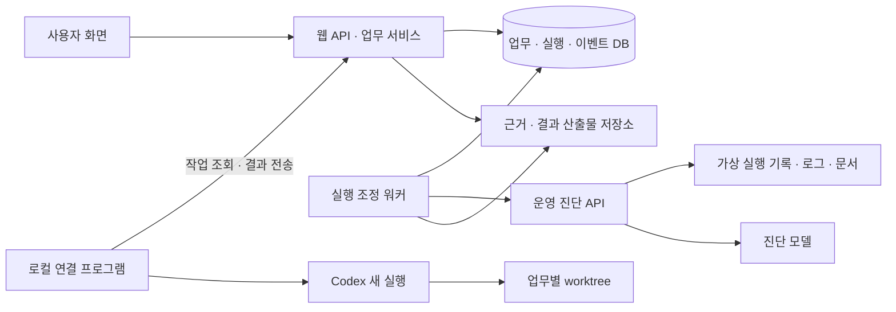

# 아키텍처 — 기존 에이전트 등록과 업무 자동 실행

갱신일: 2026-09-27 (phase 11 step 8 — 연결 화면·[에이전트에게 맡기기] 버튼). 이전: 2026-09-27 (phase 11 step 6 — 자동 매칭 구현·대기 코드 표). 이전: 2026-09-27 (phase 11 step 0 — "GitHub App 연결 — phase 11" 절 추가). 이전: 2026-09-27 (phase 10 step 0 — "셀프호스트 — phase 10" 절 추가). 이전: 2026-09-27 (phase 9 step 0 — "측정 — phase 9" 절 추가, step 6 — 지표 결과 모양 `Stat.total`·`Ratio`·`MetricsGroup` 고정, step 12 — 접수 → 완료 = GitHub 병합 시각, 접수 → 승인 분리). 이전: 2026-09-23 phase 8 step 15 — GitHub 업무 순환 구현·대역 검증 완료
상태: 현재 구현의 설계·계약과 초기 설계 이력을 포함한다. 새 제품 기준은 [ADR-0011](adr/0011-task-driven-work-cycle.md), 수용 기준은 [PRD](PRD.md)다. 아래 전환 설계는 미구현이며, 이후 본문의 phase 6·7 계약을 이미 변경했다는 뜻이 아니다. 실제 연결 검증 범위는 [VERIFICATION_LOG](VERIFICATION_LOG.md)를 따른다.

## 실서비스 전환 설계 — ADR-0011

출시 순서 정정(2026-09-23): [ADR-0013](adr/0013-existing-tasks-first-staged-rollout.md)과 [ROADMAP](product/ROADMAP.md)에 따라 기존 업무 접수·Agent 실행·원본 결과 반영·제한된 후속 생성을 MVP로 구현한다. 기본 실행 기록은 처음부터 남기지만 아래 패턴 발견·추천·효과 분석 기능은 후속이다. 과거 전체 로그 정규화·분석을 MVP의 선행 구현으로 강제하지 않는다. 아래 구현 순서는 기술 의존 관계의 초안이며 버전 범위는 ROADMAP을 따른다.

2026-09-23 확장([ADR-0012](adr/0012-delegated-decisions-and-pattern-feedback.md)): 위임된 AI 판단과 이력 기반 패턴 발견·도입 후 효과 검증을 포함한다. 아래 중앙 모델 미호출은 현재 구현 기준이며 새 제품의 영구 제약이 아니다. 특정 모델·SDK·호출 위치는 아직 채택하지 않았다.

### 패턴 발견과 개선의 설계 대상

- 기록 연결: 허용된 출처에서 원본 식별자·업무 식별자·시각·행동·역할·입출력·결과를 읽는다. 원본과 추정·메모리를 구분하고 중복·누락·시계 차이·연결 불명확성을 보존한다. 접근 범위·보관·삭제·모델 전달 범위를 수집 전에 정한다.
- 후보 정형화: 반복·대기·예외를 근거로 시작 조건·필수 입력·담당 역할·행동·후속·검증 기준을 제안한다. 후보와 적용 정책을 분리하고 개인/팀 적용 범위·근거·버전을 남긴다. 기존 KindSpec·SuccessorRule로 표현되는지 먼저 확인하며 새 스키마를 선결정하지 않는다.
- 위임 판단: 허용 행동 후보를 구성한 뒤 모델 평가를 입력으로 정책을 적용한다. 미해결 시 제한된 조회·전문 에이전트 검토·사람 요청으로 이어진다. confidence는 실제 업무별 검증 없이 자동 실행의 단독 근거가 될 수 없다.
- 효과 검증: 자동화 적용 전부터 비교 가능한 지표를 수집하고 정책·모델·패턴 버전과 연결한다. 과거 이력 재생·실행 없는 비교 후 제한 적용한다. 업무 구성 변화와 관측 누락을 표시하고, 적용 중단·이전 버전 복귀 및 활성 Execution 처리 정책을 설계한다.

모델 재학습은 이번 범위가 아니다. 새 기능 구현은 현재 계약을 유지하는 경계부터 TDD로 진행하며, 아래 기존 순서에 기록 정규화·기준 측정을 앞단으로, 패턴 후보 검증·적용 후 비교를 후속 단계로 추가한다. 구체적인 구현 step은 아직 작성하지 않았다.

제품의 실행 단위는 Task이며 Chain은 현재 구현의 묶음이다. 실서비스 전체를 사전 구성한 단일 체인으로 제한하지 않는다. Task·Execution·Artifact와 실행 입력 고정, 기존 연결 프로그램, 증거 기반 판정, 중복 실행 방지는 재사용한다. 다음 항목은 구현 전 구체화할 설계 방향으로, 새 API 필드·상태·DB 스키마는 아직 확정하지 않았다.

| 영역 | 필요한 변화 | 검증할 불변식 |
|---|---|---|
| 업무 접수 | 외부 업무 식별·갱신과 입력 요구 파악 | 같은 외부 이벤트로 업무가 중복되지 않음 |
| 담당 관계 | 사람·역할·업무 대상과 사용 가능한 Agent·위임 범위 연결 | 에이전트 소유자와 담당자를 혼동하지 않고, 결과가 권한을 확대하지 않음 |
| 실행 가능 판단 | 목록에서 업무별 입력·의존·권한·위임·가용성 평가 | 무관한 업무의 대기가 준비된 업무를 막지 않음. 자원 충돌 제약은 유지 |
| 결과와 후속 | 결과에서 후속 제안을 받아 기존 업무 연결 또는 새 Task 생성 | 원인 Execution·Artifact 버전 추적, 동일 원인 재처리 시 중복 생성 방지 |
| 사람 개입 | 결정·정보·권한·조율 요청과 응답을 보존하고 재평가 | 해결 전 실행하지 않고, 응답 후 새 업무 등록 없이 재개 |
| 완료와 승인 | 형식 검증·품질 검증·업무 마감·후속 착수 조건 분리 | 필요한 승인을 우회하지 않으며 허용된 검토를 불필요하게 막지 않음 |

입력 해석·후속 작업 제안은 규칙 또는 에이전트로 수행할 수 있으나 주체와 계약은 미정이다. 현재 중앙 LLM 미호출 규칙을 그대로 유지한다. 제안의 채택·권한 확인·상태 변경은 명시적인 정책과 저장된 근거를 따른다. 결과 요약을 곧바로 실행 명령이나 임의 파일 경로로 해석하지 않는다.

n8n 입구·callback은 현재 계약을 유지한다. n8n이 더 많은 실행을 맡을지는 별도 결정하며 같은 업무를 두 엔진이 독립적으로 생성·배정하지 않도록 책임을 하나로 정한다. 현재 `chain_settled`는 사람 차례 통지이고 최종 성공이나 일반적인 재개 이벤트가 아니다.

### 구현 계획을 구체화할 순서

1. 담당 관계·필수 입력·위임·대기 사유의 도메인과 계약을 설계한다. 검증: PRD의 A·B 자동 실행과 C·D·E 대기를 구분하는 테스트를 먼저 작성한다.
2. 목록 단위 실행 판단과 사람 요청·응답 후 재개를 구현한다. 검증: 독립 업무가 진행되고, 필요한 응답 후 해당 업무만 재평가되며 중복 실행이 없다.
3. 결과 기반 기존 업무 연결·새 업무 생성·배정을 구현한다. 검증: A → 기존 C, B → 새 F, 모호한 제안 보류, 재전송·재시작의 중복 방지와 생성 반복 제한을 확인한다.
4. 실제 외부 업무 도구 한 종류와 실제 Agent로 전체 순환을 검증한다. 검증: PRD 수용 시나리오와 병목 지표를 기록한다. 구체적인 첫 도구·업무 사례·비용은 실행 전 정한다.

각 단계는 `service`에서 분기하고 TDD를 적용한다. DB 변경은 기존 데이터 보존과 마이그레이션을 설계한 뒤 수행하며, 공개 데모의 초기화 배포 방식을 실서비스에 자동 적용하지 않는다. 현 단계에서는 계약 v1 예시·코드 식별자·스키마 버전을 바꾸지 않는다.

## GitHub 업무 순환 — phase 8 계약

상태(2026-09-23 step 15): 아래 step 1~13 이 구현되어 있고 step 14 의 대역 e2e(`tests/e2e/test_github_cycle.py`)를 통과했다. 실제 GitHub·실제 Agent 는 아직 쓰지 않았다(step 16). 운영 절차·미검증 항목·계획과 구현의 차이는 [GitHub 런북](github/README.md).

[ADR-0014](adr/0014-github-task-cycle.md)를 따른다. 위 구현 순서 1~4를 GitHub Issues 버그 수정 → 커밋 검토 한 유형으로 구체화한 것이며 아래 이름은 구현 step 표기를 따른다. 예시 payload 는 [CONTRACT](CONTRACT.md) 13절. 계약 버전은 1 그대로이고 기존 v1 payload 는 바뀌지 않는다.

step 1 구현 상태: 위치가 `contracts/`(1) 인 모델은 있다 — `BUILTIN_KIND_NAMES`·`BUILTIN_KINDS` 4종, `BUILTIN_RULES` 에 `bug_fix → code_review`, 산출물 kind `code_review_result`, `ExecutionRequest` 의 종류별 target 규칙(`bug_fix` 는 `CodeChangeTarget`·입력 비어도 됨, `code_review` 는 `CommitReviewTarget`·입력 필수). 내장 이름은 예약어다 — 계약은 사용자 정의 `KindSpec` 이 내장 이름이면 거부하고, 화면 `POST /kinds` 는 409 `kind_exists`.

step 4 구현 상태: 새 세션(`repo.create_session`)은 내장 종류 4개·내장 규칙 2개를 seed 하고, 기존 세션은 아래 "저장 — v5 마이그레이션" 이 넣는다. 완료 기준 템플릿(`domain/completion`)에 `bug_fix`·`code_review` 항목을 더했다. 실행·판정 경로(step 8~10)는 아직 없어, 지금 만든 `bug_fix`·`code_review` Task 는 실행되지 않고 머문다 — phase 가 끝나기 전 `service` 에 병합하지 않는다.

step 5 구현 상태: `adapters/github_client.py` 의 `HttpGitHubClient`(HTTPX, transport 주입)가 있다. 아직 부르는 곳은 없다(수집 step 7, 댓글 전달 step 12). 아래 "GitHub REST 경계" 참고.

step 6 구현 상태: `server/github_api.py` 가 운영자 설정 API(`/github/sources`·미리보기·변경·중지·담당 연결, 요청·오류는 [CONTRACT](CONTRACT.md) 13.10)를 제공한다. 운영자 세션만, 소스는 만든 세션 소유, 다른 세션이 이미 GitHub 소스를 가지면 새 소스를 거부한다(셀프호스트 1개 워크스페이스 — 전역 토큰을 두 워크스페이스가 나눠 쓰지 않게). 설정은 `Settings.github_token`(`WORKFLOW_GITHUB_TOKEN`, `OPTIONAL_SECRET_KEYS` — 비면 기능만 꺼지고 `WORKFLOW_DEV` 도 만들지 않음, `repr` 제외)·`Settings.github_repos`(`WORKFLOW_GITHUB_REPOS`)에서 읽고 응답은 `token_configured` 만 보인다. 저장소는 허용 목록 안(대소문자 무시, 저장은 목록 표기)에서만, 변경 시 저장소는 바꿀 수 없다(커서·원본 매핑이 그 저장소 것). `config_revision` 잠금은 `repo.save_github_source(..., expected_revision=)` 가 같은 트랜잭션에서 검사한다(`StaleConfig` → 409 `stale_config`). 검토 Agent·담당 Agent 는 세션 등록 + `code.review`/`code.fix {repository_id}` 능력 + (담당) 소스 검증 프로필 보고를 요구한다. 설정 변경은 이미 만든 Task·Execution 입력을 바꾸지 않는다. GitHub 클라이언트는 워커가 만든다(step 7).

step 7 구현 상태: `server/github_sync.sync_source` 가 소스 하나를 목록 폴링으로 수집한다(webhook 없음). 워커는 `settings.github_token` 이 있을 때만 `HttpGitHubClient(settings.github_token, settings.github_repos)` 를 만들고, tick 첫 단계에서 켜진 소스마다 `GITHUB_SYNC_INTERVAL_SECONDS`(60초) 간격으로 부른다(rate limit 이면 알려준 시간, 없으면 60초 쉰다. 간격은 메모리 값이라 재시작하면 바로 한 번 부른다). 수집은 Task 만 만들고 착수하지 않는다 — 준비 판정·착수는 step 10.
- 범위(`domain/issue_intake.intake_scope`, 아직 Task 가 없는 이슈만): 다른 저장소·PR 은 언제나 제외. `selected_issue_numbers` 로 고른 이슈는 명시적 선택이라 라벨·시작 시각·닫힘과 무관하게 받는다(닫혀 있으면 준비 판정이 `source_closed`). 그 밖은 open 이고 `label_filter` 라벨을 모두 가지며(대소문자 무시) `created_at >= start_at` 이어야 한다 — 시작 전 백로그(`before_start`)·라벨 불일치·닫힘·필터 없음(`not_selected`)은 받지 않고 `SyncReport.skipped` 에 사유별로 센다. 이미 받은 이슈는 범위를 벗어나도(라벨 제거 등) 계속 갱신한다.
- 매핑(`snapshot_to_task_spec`): `bug_fix`, 요구 능력 `code.fix {repository_id: workflow_repository_id}`, 제목 = 이슈 제목, 요청 = 본문(앞뒤 공백 제거, 명령·경로로 해석하지 않음), `run_mode` = 그 시점 설정, 선택 `auto`·완료 `review`, 완료 기준 = 내장 템플릿, target `{}`(실행 생성 때 등록값으로 고정), `source_ref` = `owner/name#번호`, 상태 `대기 · 준비 판정 대기`.
- 커서: 최초는 `IssueCursor(since=start_at)`. 한 페이지의 이슈를 모두 저장한 뒤에 다음 페이지 커서를 저장한다 — GitHub 오류(`SyncReport.error`)나 저장 중 예외면 커서가 그 페이지에 남아 다음 호출이 다시 받고, 다시 받은 이슈는 `unchanged`. 마지막 페이지 뒤 `since` = 이번에 본 가장 늦은 `updated_at`(포함 경계). since 가 그대로이고 1페이지뿐이었을 때만 ETag 를 남겨 다음 요청이 304 가 된다. 한 호출은 최대 `MAX_PAGES_PER_SYNC`(10) 페이지. 아직 받지 않은 선택 이슈는 목록 뒤에 `get_issue` 로 받는다(404 는 `not_found` 로 세고 넘어감). 알려진 한계: 페이지를 넘기는 사이 다른 이슈가 수정돼 뒤로 밀리면 번호 기반 페이지에서 한 건이 빠질 수 있다 — 그 이슈가 다음에 수정되거나 선택 번호로 지정되면 들어온다.
- 원본 변경(`repo.upsert_source_issue`): 제목·요청이 바뀌면 같은 트랜잭션에서 Task 제목·요청을 바꾸고 `revision`+1(`SourceIssueUpsert.input_changed`, `SyncReport.input_changed` — 재평가 필요). 마감된 Task 는 바꾸지 않는다. 진행 중 Execution 의 `request_json`·`task_revision` 은 그대로라서 "Task revision > 실행의 task_revision" 이 재평가 필요 기록이다. 담당·라벨·상태·`updated_at`(원본 댓글로 인한 변경 포함)만 바뀐 것은 원본 스냅샷의 `source_revision` 만 올린다. 닫힘·재오픈은 Task 를 마감·재생성하지 않는다.
- 준비 판정 입력(`github_sync.task_intake_facts` → `domain/issue_intake.IntakeFacts`, `TaskFacts(**facts.as_kwargs())`): 가져온 Task 와 직접 등록 Task 가 같은 함수를 거친다. 원본 매핑이 있으면 스냅샷의 담당자·`AssigneeBinding`·원본 상태·소스 `max_rework_rounds`, 없으면(직접 등록) `assignee_ids=None`(직접·자동 선택). 요청은 언제나 필수(`request_required`).
- 댓글은 읽지 않고 GitHub 에 쓰지 않는다 — 원본 댓글이 업무를 만들거나 명령이 되는 경로는 없다.
- 병합 PR 조회(phase 9 step 12, ADR-0015 결정 9): 수집(목록·선택 이슈)이 오류 없이 끝나면 `list_issues_needing_merge_check`(닫힘·병합 시각 모름) 중 아직 조회 안 했거나 조회 뒤 이슈가 바뀐(`issue_updated_at > merge_checked_at`) 이슈를 번호순으로 한 호출에 최대 `MAX_MERGE_CHECKS_PER_SYNC`(20) 건 `get_issue_pr_link` → `record_issue_merge`. 병합 없음도 `merge_checked_at` 을 남겨 이슈가 다시 바뀔 때까지 재조회하지 않는다. 조회 실패는 `SyncReport.merge_error`(워커가 경고 로그)에만 남고 이미 저장한 수집 결과는 그대로다 — rate limit·연결 실패는 이번 조회를 멈추고(rate limit 은 `retry_after_seconds`), 이슈 하나의 오류(없는 이슈 등)는 건너뛴다. `SyncReport.merged` = 병합을 새로 기록한 Task.

step 8 구현 상태: 연결 프로그램이 `bug_fix` 를 실행한다 — 도구별 `launch` 는 그대로, 공통 `LocalToolAdapter.run` 이 `request.kind ∈ DEMO_REPORT_KINDS`(`code_change`)일 때만 데모 프롬프트(`build_prompt`)·`vp-report` 보고서(`report_output`)를 쓰고, 그 밖(`bug_fix`)은 `build_bug_fix_prompt`(요청 원문 + 저장소 규칙, 데모 문구 없음, 인계 디렉터리의 `CodeReviewResult` JSON 을 "이전 검토 지적" 절로) + 등록된 `verification_profile_id` 하나로 `diff`·`test_log_before`(결과 커밋의 새 테스트만 `base_commit` 체크아웃에서)·`test_log_after`·`verification_log`(결과 커밋의 깨끗한 체크아웃)를 남긴다. 기준 커밋 고정: 도구를 띄우기 전 worktree HEAD ≠ `base_commit` 이면 `base_commit_mismatch`, 미커밋 잔여 변경이면 `worktree_dirty`, 도구가 직접 커밋해 HEAD 가 움직였으면 `commit_mismatch`(원시 로그 보존, `process_stopped` = 도구 종료 확인값). 재작업은 `base_commit` = 이전 `result_commit` 이라 남은 `task/<id>` 브랜치에서 이어진다. 도구·검증 환경은 기존 허용 목록(`codex_env`)이라 `WORKFLOW_GITHUB_TOKEN`·`GITHUB_TOKEN`·`GH_TOKEN` 이 없다. 연결 프로그램은 claim 에 `supported_kinds = SUPPORTED_BUILTIN_KINDS`(`code_change`·`bug_fix`)를 보내고 서버 claim 은 `repo.record_supported_kinds` 로 `connectors.supported_kinds_json` 에 남긴다(생략 claim 은 NULL). 중앙의 `bug_fix` 결과 판정(`required_artifacts` 에서 `report_output` 제외·`commit_matches`)과 실행 생성은 step 10 이다.

step 9 구현 상태: 연결 프로그램이 `code_review` 를 실행한다. `LocalToolAdapter.run` 은 target 이 `CommitReviewTarget` 이면 `_run_commit_review` 로 간다 — 인계 디렉터리만 읽는 `_run_generic` 이 아니다. 착수 전(도구를 띄우지 않음): 검토 등록(`registration_missing`) → `result_commit`·`base_commit` 이 그 등록 저장소에 있음(`git_ops.has_commit`, 없으면 `commit_missing` — 수정·검토 등록이 같은 로컬 저장소를 봐야 하고 다른 기기·클론으로 커밋을 옮기지 않는다) → `base_commit` 이 `result_commit` 의 조상(`git_ops.is_ancestor`, `commit_mismatch`) → 인계 디렉터리의 `CodeChangeResult` 중 `execution_id == source_execution_id` 가 있고 그 `base_commit`·`result_commit` 이 target 과 같음(`source_mismatch`). 그 뒤 결과 커밋의 깨끗한 임시 체크아웃(`_in_clean_checkout`, 시스템 임시 디렉터리의 detached worktree)에서 도구별 `launch_readonly`(Codex `--sandbox read-only -C <체크아웃>`, Claude `Read Glob Grep`, cwd 체크아웃) + 스키마 `REVIEW_RESULT_SCHEMA`, 프롬프트 `build_review_prompt`(첫 줄 `# 커밋 검토`, 요청·두 커밋·수정 결과 요약·검증 기록, 저장소에서 직접 뽑은 `base..result` diff — 60,000자 초과분은 잘라 체크아웃에서 읽게 함 — 인계 목록, 읽기 전용·실행 금지 규칙). 실행 뒤: 시간 초과·`classify_failure` → 체크아웃 HEAD ≠ `result_commit`·체크아웃 변경(`git status`)·인계 파일 변경은 `readonly_violation` → `read_structured_message`(Codex 마지막 메시지 파일, Claude `structured_output`)를 `CodeReviewResult` 로 검증(`result_invalid`). `reviewed_commit` 은 도구가 적은 값이 아니라 검토 뒤 확인한 체크아웃 HEAD 다. 체크아웃은 성공·실패와 관계없이 지우고, 원본 저장소 작업 트리·수정 Task 의 `task/<id>` 브랜치는 건드리지 않는다. runner 는 target 모양으로 결과 봉투를 고른다(`CodeChangeTarget` → `code_change_result`, `CommitReviewTarget` → `code_review_result`, 그 외 `generic_result`) — 종류 이름 분기 없음. 검토 Task 는 업무 worktree 가 없어 인계 디렉터리만 정리한다. `SUPPORTED_BUILTIN_KINDS` 에 `code_review` 를 더했다. 중앙의 검토 결과 판정(`reviewed_commit` = 최신 수정 결과 · `stale_review`)과 검토 실행 생성은 step 10 이다. 실제 Codex·Claude 가 git worktree 체크아웃에서 이 인자로 도는 동작은 가짜 실행 파일로만 확인했다.

step 10 구현 상태: 중앙 워커가 업무 순환을 돈다. 종류 이름 분기 대신 `domain/execution_policy.BUILTIN_POLICIES` 를 조회한다 — `verifier` 가 `report_code_change`(데모 `code_change`, 기존 검사 그대로)·`code_change`(`bug_fix`)·`commit_review`(`code_review`)·`generic`(사용자 정의)·`diagnosis`, `cycle` 이 참인 종류(`bug_fix`·`code_review`)만 아래 순환을 타고 기존 후속 스캔(`_spawn_successors`)에서는 빠진다. tick 순서: … 코드 수정 결과 확인 → 커밋 검토 결과 확인 → 범용 판정 → `_advance_cycle`(결과 → `decide_followup` → 저장 → 준비 판정 → 착수, 그다음 실행 없는 Task 의 준비 판정 → 착수) → 후속 스캔 → 실패 반영 → callback. 트랜잭션 중 HTTP·도구를 기다리지 않고 GitHub 에 쓰지 않는다(원본 반영은 tick 마지막 단계 — step 12).
- 판정: `bug_fix` 는 `result_parsed`·`result_ids_match`(결과의 execution_id·task_id)·`commit_matches`(결과 `base_commit` = 요청 target)·`required_artifacts`(정책 표 — `report_output` 없음)·`test_before_failed`·`verification_passed`. `needs_information` 결과는 수정·검증이 없는 정상 제출이라 앞의 셋만 보고 통과시킨다 — 그래야 `decide_followup` 이 `fix_verification_failed` 가 아니라 `fix_needs_information` 사람 요청을 만든다. `code_review` 는 `result_parsed`·`result_ids_match`·`source_matches`(결과 `source_execution_id` = target)·`commit_matches`(`reviewed_commit` = target `result_commit`). 최신 수정 결과인지는 판정이 아니라 후속 결정(`stale_review`)이 본다.
- 준비 판정 재료(`server/task_cycle.task_facts`·`evaluate`): 세션 등록 Agent·연결 프로그램의 마지막 `supported_kinds`·heartbeat, `github_sync.task_intake_facts`(담당·요청·실행 방식), 사람 요청(열린 요청 → `decision_pending`, `*_needs_information` 요청 당시 revision → `input_missing`), 원본 이슈 상태·허용 저장소(`Settings.github_repos`)·재작업 상한은 Task 또는 선행을 따라 올라간 원본 매핑(`origin_source` — 검토 Task 는 수정 Task 의 원본을 따른다). 실행 Agent 가 정해진 뒤 그 로컬 등록에서 아직 도는(`queued`·`accepted`·`running`·`unknown`) 다른 수정 실행을 `repo.busy_executions` 로 넣어 다시 평가한다 — `result_ready`(검토·사람 대기)는 저장소를 쓰지 않으므로 다른 업무를 막지 않는다. 대기면 Task 상태를 `대기 · <사유 · 사유>`(직접 실행 모드만 남으면 `실행 가능 · 직접 실행 모드`)로 쓴다.
- 착수: 실행 없는 `bug_fix` Task 는 `auto_start_key(task_id, revision)`, target = 실행 Agent 의 `local_registration_id` + 기준 커밋(재작업이면 검토한 결과 커밋, 아니면 이 Task 의 마지막 결과 커밋, 없으면 등록 보고값) + 소스 `fix_verification_profile_id`(원본이 없으면 Agent 의 첫 보고 프로필). 이슈 본문은 `request` 문자열일 뿐 target·Agent·프로필을 바꾸지 않는다. 실행 중 원본 편집(Task revision+1)은 활성 실행이 있는 동안 새 실행을 만들지 않는다.
- 후속: 결과마다 `FollowupContext` 를 DB 에서 다시 계산한다 — 기존 후속은 `predecessor_task_id` 가 이 수정 Task 이고 규칙 `to_kind` 인 마감 전 Task(미리 등록된 것 포함), 이미 처리한 원인은 그 Task 들의 실행 `start_key` 와 사람 요청 `cause_key`. `create_task` 는 `repo.create_followup_once`(검토 Task: `<종류 label>: <수정 제목>`, 요구 능력 = 후속 종류 능력 + 수정 Task 의 같은 범위 값, 실행 Agent = 소스 `review_agent_id`, 실행 방식 = 그 시점 소스 설정) 뒤 착수, `link_existing` 은 그 Task 에 착수 — 둘 다 `start_key` `review:<fix_execution_id>`, target `CommitReviewTarget`(검토 Agent 등록 + 수정 결과의 두 커밋), 입력은 규칙 `handoff_kinds` 인계 묶음(`assemble_handoff`), 준비 판정에 `pair_agent_id`(같은 연결 프로그램·저장소)를 넣는다. 진행 중인 이전 검토 실행은 끊지 않고 끝나기를 기다린다. `rework` 는 같은 수정 Task 의 다음 시도(`rework:<review_execution_id>`, 입력 = 이전 수정 결과·검토 결과 산출물, 기준 커밋 = 검토한 결과 커밋)이고 이전 시도의 잠금 해제와 새 시도 생성은 `repo.create_execution(..., release_execution_id=)` 한 트랜잭션이다. 검토 Task 는 `대기 · 수정 요청 — 재작업 결과 대기`. `request_human` 은 `repo.create_human_request_once` + 대상 Task `확인 필요 · <이유>`(재개는 아래 step 11). `approved` 는 검토 Task 를 `완료 · 검토 승인` 으로 마감하고 수정 Task 는 `확인 필요 · 검토 승인 — 병합·이슈 종료는 사람`(잠금 유지). 보류: `source_closed` → `대기`, `stale_review` → 검토 Task `확인 필요`, 운영자 종료(`실패` 마감)면 아무 것도 만들지 않는다. 규칙 revision 개념은 아직 없어 `followup_links.rules_revision` 은 1 이다.

step 11 구현 상태: 사람 요청과 응답 후 재개. 응답 권한은 운영자 세션뿐이다(MVP) — GitHub 담당자를 웹 인증 사용자로 보지 않고 GitHub 댓글을 응답·승인 명령으로 읽지 않는다(댓글에는 응답 위치 안내만 쓴다 — step 12). API 는 `server/human_api.py`(CONTRACT 13.11).
- 요청이 생기는 곳: (1) 후속 결정 `request_human`(step 10 — `fix_verification_failed`·`fix_needs_information`·`review_*`·`rework_limit_reached`), (2) 준비 판정 대기 중 운영자가 정해야 풀리는 사유 `task_cycle.READINESS_REQUEST_CODES`(`assignee_multiple`·`delegation_denied`·`input_missing`) — 워커 `_write_blocked` 가 cause_key `ready:<code>:r<revision>` 로 revision 마다 한 번 만든다. 이미 다른 요청을 기다리면(`decision_pending`) 더 묻지 않는다. (2)는 그 대기 사유가 이미 막고 있으므로 `decision_pending` 에 세지 않는다 — 담당자를 한 명으로 줄이는 식으로 사유가 사라지면 응답 없이도 착수한다.
- 응답(`human_api.respond_to_request` → `repo.record_human_response_once`): `response_id` 멱등, `expected_revision` 잠금, 요청 `answered`·Task `revision`+1 을 한 트랜잭션에서. `action` 은 요청 code 별 허용(`assignee_multiple` → `choose_agent`·`close`, 그 밖 → `resume`·`close`), 정보 요청(`input_missing`·`*_needs_information`)은 빈 답을 받지 않는다. `choose_agent` 는 세션 등록 Agent 만 받아 같은 트랜잭션에서 `chosen_agent_id` 로 두고, 담당자 연결·능력·위임 범위는 재평가가 다시 본다 — 응답은 권한·소스 설정을 바꾸지 않는다(위임 밖은 설정 API 가 따로). `close` 는 같은 트랜잭션에서 `실패 · 운영자 종료 — 사람 요청 응답` 마감 + 활성 실행 해제. 마감된 Task 는 `repo.create_execution` 도 같은 트랜잭션에서 `TaskClosed` 로 거부해 종료와 착수가 겹쳐도 실행이 붙지 않는다.
- 응답 내용: `task_cycle.request_text` 가 Task 요청 원문 뒤에 글이 있는 응답을 `## 사람 응답 (운영자)` 절로 붙여 다음 실행 `request` 와 준비 판정의 `request_text` 로 쓴다. Task 요청 원문·원본 스냅샷은 바꾸지 않는다.
- 재개: 응답은 실행을 만들지 않는다. 실행이 없던 Task 는 다음 tick 의 준비 판정이 새 revision 의 `auto_start_key` 로 착수한다. 결과를 기다리던 시도(`result_ready`, 잠금 유지)는 그 시도 이후에 물은 요청(ready: 제외)의 응답이 시도의 `task_revision` 보다 새 revision 을 만들었을 때만 `_resume` 이 해제 + 새 시도를 한 트랜잭션으로 만든다(`auto_start_key`, 준비 판정 통과 필요) — 수정은 입력 = 이전 입력 + 이전 결과, 기준 커밋 = 마지막 결과 커밋, 검토는 같은 수정 결과(`source_execution_id`)를 다시 본다. 응답이 없으면(원본 편집만으로 revision 이 올라도) 결과를 기다리는 시도를 다시 돌리지 않는다. `TickReport.tasks_resumed`.
- 스키마: v5 는 아직 배포 전이라 `human_responses.agent_id`(nullable)를 v5 DDL 에 더했다 — 이 브랜치로 이미 v5 를 만든 로컬 개발 DB 는 다시 만들어야 한다.

### 현재 코드와의 간극 (step 0 확인)

| 영역 | 현재 코드 | phase 8 에서 바꿀 것 |
|---|---|---|
| 외부 업무 | `adapters/task_sources.py` 의 GitHub·Jira 는 fixture, 수집·원본 ID 저장 없음 | `adapters/github_client.py`(step 5) + `server/github_sync.py`(step 7) + 원본 매핑 저장(step 4) |
| 코드 수정 판정 | `worker._code_result_checks` 가 `report_output`·expected-report 를 항상 요구, `LocalToolAdapter.run` 이 `vp-report` 로 보고서 생성 | `bug_fix` 는 `BUILTIN_POLICIES` 의 필수 산출물만 요구(step 8·10). `code_change` 경로는 그대로 |
| 검토 | 사용자 정의 종류는 `_run_generic` 으로 인계 디렉터리만 읽음 — 결과 커밋을 보지 않음 | `code_review` 가 `CommitReviewTarget` 의 결과 커밋을 깨끗한 읽기 전용 체크아웃에서 읽음(step 9) |
| 후속 | `_spawn_successors` 는 미리 등록된 후속 Task 만 착수 | `decide_followup` 으로 기존 연결·새 Task 생성·재작업·사람 요청(step 3·10) |
| 담당 | Agent 능력 선택만 있음. GitHub 담당자 개념 없음 | `AssigneeBinding`, `TaskReadiness`(step 2·6) |
| 사람 개입 | 검토 승인·수정 요청·종료 버튼뿐 | `HumanRequest`·응답 후 재평가(step 11 구현 — `server/human_api.py`) |
| 원본 반영 | n8n callback(체인당 1회)만 | Task 별 댓글 outbox `SourceDelivery`(step 12) |
| DB | `SCHEMA_VERSION` 4, 마이그레이션 없음(`WORKFLOW_RESET_DB`) | 데이터 보존 트랜잭션 마이그레이션 4 → 5(step 4 구현됨) |

### 진단 데모 코드 수정과 일반 버그 수정 비교

| 항목 | 데모 `code_change`(유지) | 일반 `bug_fix`(신규) |
|---|---|---|
| 착수 입력 | 판정 통과 진단의 `handoff_bundle` 필수(`input_artifact_ids` 비면 422) | 이슈 스냅샷을 담은 `request` + 고정 target. 첫 시도 `input_artifact_ids` 빈 배열 허용. 재작업 시 이전 `code_change_result`·`code_review_result` |
| target | `CodeChangeTarget` | `CodeChangeTarget` 재사용 — `base_commit` 은 실행 생성 시 그 로컬 등록이 마지막으로 보고한 커밋 |
| 검증 프로필 | `vp-pytest` + 보고서용 `vp-report` | 소스 설정의 `fix_verification_profile_id` 하나(등록된 ID만, 명령은 로컬 등록에만 있음). `vp-report` 사용 안 함 |
| 결과 봉투 | `CodeChangeResult` | `CodeChangeResult` 재사용 |
| 필수 산출물 | `diff`·`test_log_before`·`test_log_after`·`report_output`·`verification_log` | `diff`·`test_log_before`·`test_log_after`·`verification_log` |
| 판정 checks | `result_parsed`·`required_artifacts`·`test_before_failed`·`verification_passed`·`report_matches` | `result_parsed`·`result_ids_match`·`commit_matches`·`required_artifacts`·`test_before_failed`·`verification_passed` |
| 재현 테스트 없음·변경 없음 | `needs_information` | 같음 |
| 다음 단계 | 사람 검토(웹 승인·수정 요청) | 판정 통과 + `ready_for_review` 면 `code_review` 자동 연결 |

### 인터페이스 — 이름·소유·책임

| 이름 | 위치(step) | 필드·시그니처 | 책임과 오류 |
|---|---|---|---|
| `GitHubIssueSnapshot` | `contracts/github.py`(1) | `repository_id: int`, `repository_full_name`, `issue_id: int`, `number: int`, `title`, `body`, `state: open\|closed`, `labels: list[str]`, `assignee_ids: list[int]`, `assignee_logins: list[str]`, `html_url`, `created_at`, `updated_at`(RFC 3339), `is_pull_request: bool` | GitHub 응답에서 필요한 값만. `snapshot_digest(snapshot)`(sha256, 정렬된 JSON)로 같은 내용 판정. `body` 는 `Task.request` 재료일 뿐 명령·경로로 해석하지 않음 |
| `GitHubSourceConfig` | `contracts/github.py`(1) | `source_id`(`ghs-` + 8 hex), `repository_full_name`, `workflow_repository_id`(이 제품 scope 값), `label_filter: list[str]`, `selected_issue_numbers: list[int]`, `start_at`, `fix_verification_profile_id`, `review_agent_id`, `run_mode: auto\|manual`, `max_rework_rounds: int`(0~3, 기본 1), `enabled: bool`, `config_revision: int` | 토큰 필드 없음. `repository_full_name ∉ WORKFLOW_GITHUB_REPOS` 는 422 `repository_not_allowed`. `label_filter`·`selected_issue_numbers` 가 둘 다 비면 422(전체 백로그 금지) |
| `AssigneeBinding` | `contracts/github.py`(1) | `source_id`, `github_user_id: int`, `github_login`(표시용), `agent_id` | 운영자가 등록. Agent 가 없거나 `code.fix {repository_id}` 능력이 없으면 422. 같은 `(source_id, github_user_id)` 는 하나 |
| `CommitReviewTarget` | `contracts/v1.py`(1) | `local_registration_id`, `source_execution_id`, `base_commit`, `result_commit`(전체 SHA) | `code_review` 전용 target |
| `CodeReviewResult` | `contracts/v1.py`(1) | `contract_version`, `execution_id`, `task_id`, `source_execution_id`, `reviewed_commit`, `outcome: approved\|changes_requested\|needs_information`, `summary`, `findings: list[ReviewFinding]`, `missing_information: list[str]`, `artifact_ids` | 검증: `changes_requested` → `blocking` finding 1개 이상, `approved` → `blocking` 없음, `needs_information` ↔ `missing_information` 비어 있지 않음. `ReviewFinding(severity: blocking\|non_blocking, path: str\|None, line: int\|None, message)` — `path` 는 표시용 문자열 |
| `ClaimRequest.supported_kinds` | `contracts/v1.py`(1) | `list[KindId] \| None = None` | null 이면 구버전 — 내장 중 `diagnosis`·`code_change`(`LEGACY_BUILTIN_KINDS`)만. 서버가 `connectors.supported_kinds_json` 에 저장 |
| `ExecutionPolicy` / `BUILTIN_POLICIES` | `domain/execution_policy.py`(10) | `kind`, `target: diagnosis\|code_change\|commit_review\|local`, `result_kind`, `required_artifacts`, `verifier: diagnosis\|report_code_change\|code_change\|commit_review\|generic`, `cycle: bool`, `starts_from_result`(= target `commit_review`). `policy_for(kind)` | 종류 이름 분기 대신 조회하는 표. 사용자 정의 종류는 `GENERIC_POLICY`. 후속 종류는 규칙 표(`SuccessorRule`), 재작업 여부는 `decide_followup` 이 정하므로 step 0 초안의 `requires_report`·`followup_on_ready`·`rework_outcome` 은 두지 않았다(보고서 요구는 `verifier` `report_code_change`). step 10 구현됨 |
| `TaskFacts` → `TaskReadiness` | `domain/task_readiness.py`(2) | `evaluate_readiness(facts: TaskFacts) -> TaskReadiness`. `TaskReadiness(ready: bool, blockers: tuple[Blocker, ...], agent_id: str \| None)`, `Blocker(code, reason, actor: operator\|assignee\|system)` | DB Row 가 아닌 값(현재 시각도 `TaskFacts.now`). 아래 대기 코드 표를 모두 평가해 한 번에 돌려준다(첫 사유에서 멈추지 않음, 운영자 종료만 `task_closed` 하나). `agent_id` 는 담당 연결·`select_agent` 능력 검사를 통과한 실행 Agent. 사람이 지정한 Agent 도 같은 검사를 다시 거친다. step 2 구현됨 |
| `FollowupContext` → `FollowupDecision` | `domain/task_followup.py`(3) | `decide_followup(context: FollowupContext) -> FollowupDecision`. `FollowupDecision(action: link_existing\|create_task\|rework\|request_human\|none, reason, target_task_id, create: FollowupTaskSpec \| None, cause_key, request_code, hold_code, review_commit, base_commit, input_execution_ids)`. `FollowupContext` 는 결과 `execution_id`·`outcome`·`verdict`·`result_commit`·`rules`·`rules_revision`, 검토 결과면 `ReviewFacts(fix_task_id, source_execution_id, reviewed_commit, latest_fix_execution_id, latest_fix_commit, rounds_used, max_rework_rounds)`, 명시적 원인 참조 `existing_followup_task_id`, 이미 처리한 `handled_cause_keys` | 후속 종류는 규칙 표에서 찾는다(종류 이름 분기 없음). `cause_key` 는 `review:<fix_exec>`·`rework:<review_exec>`·`<request_code>:<exec>` — 이미 처리한 키면 `none`. `hold_code` 는 `stale_review`·`source_closed`·`task_closed`. 저장·착수는 워커. step 3 구현됨 |
| `HumanRequest` / `respond_to_request` | `adapters/repo.py`(4)·`server/`(11) | repo: `create_human_request_once(conn, task_id, code, question, cause_key, now) -> (request_id, created)`, `get_human_request(conn, session_id, request_id)`, `record_human_response_once(conn, session_id, request_id, *, response_id, expected_revision, action, text, now, agent_id=None, close_reason=None) -> (task_revision, created)`, `list_human_requests`·`list_open_human_requests(conn, session_id)`·`list_human_responses(conn, task_id)`(11). 서버: `human_api.respond_to_request(conn, session_id, request_id, body: ResponseBody, now) -> dict`(11) | 운영자만. 같은 `response_id`·같은 내용(`action`·`text`·`agent_id`) 재전송은 같은 결과, 다른 내용 `ResponseConflict` → 409 `response_conflict`, `expected_revision` 불일치·이미 응답됨 `StaleRequest(current_revision)` → 409 `stale_request`, 마감된 Task `TaskClosed` → 409 `task_closed`. 응답은 요청을 `answered` 로, Task `revision` 을 +1(다음 실행 입력). `action` 허용 값(`resume`·`choose_agent`·`close`)은 서버가 요청 code 로 검사 |
| `SourceDelivery` | `contracts/github.py`(1)·`server/github_delivery.py`(12) | `delivery_id`, `source_id`, `task_id`, `issue_number`, `body_revision: int`, `body_digest`, `state: pending\|sending\|delivered\|unknown\|failed`, `comment_id: int \| None`, `attempts`, `next_at`, `last_error` | `deliver_source_updates(conn, client, now) -> DeliveryReport`, `queue_source_updates(conn, store, public_url, now) -> int`, `marker(task_id)`. marker 조정, 최신 revision 만 전송, claim fence. step 12 구현됨 |
| `GitHubClient` | `adapters/github_client.py`(5) | Protocol `list_issues(repo, cursor: IssueCursor \| None) -> IssuePage`, `get_issue(repo, number) -> GitHubIssueSnapshot`, `list_comments(repo, number, cursor: int \| None) -> CommentPage`, `create_comment(repo, number, body) -> int`, `update_comment(repo, comment_id, body) -> None` | `api.github.com` 만, 리다이렉트 따라가지 않음, 허용 저장소 밖은 요청 전 `GitHubRepositoryNotAllowed`. 오류 `GitHubRateLimited`·`GitHubForbidden`·`GitHubNotFound`·`GitHubUnavailable`(5xx·timeout) 구분, 그 밖은 `GitHubError`. 토큰·헤더를 메시지·로그에 넣지 않음. step 5 구현됨 |
| `sync_source` | `server/github_sync.py`(7) | `sync_source(conn, client, source_id, now) -> SyncReport(source_id, disabled, pages, not_modified, created, updated, input_changed, unchanged, stale, skipped, error, retry_after_seconds, merged, merge_error)`. 순수 매핑 `domain/issue_intake.py`: `intake_scope(config, snapshot) -> IntakeScope(accept, reason, explicit)`, `snapshot_to_task_spec(config, snapshot, *, session_id, task_id) -> dict`, `intake_facts(...) -> IntakeFacts`. `task_intake_facts(conn, session_id, task_id) -> IntakeFacts` | 페이지별 커서 저장. 실패 페이지는 커서를 넘기지 않음. GitHub 오류는 `error`, DB 오류는 예외. step 7 구현됨 |

### GitHub REST 경계 (step 5)

`HttpGitHubClient(token, allowed_repos, *, transport, timeout)` — 운영은 `HttpGitHubClient.from_env()` 가 `WORKFLOW_GITHUB_TOKEN`·`WORKFLOW_GITHUB_REPOS` 를 환경변수에서만 읽는다. 중앙 서버는 같은 두 값을 `Settings.github_token`·`github_repos` 로 읽는다(step 6, 토큰은 선택 비밀값 `OPTIONAL_SECRET_KEYS`). 요청 헤더는 `Authorization: Bearer`·`Accept: application/vnd.github+json`·`X-GitHub-Api-Version: 2022-11-28`.

| 동작 | 요청 | 필요한 권한(fine-grained PAT) | 처리 |
|---|---|---|---|
| `list_issues` | `GET /repos/{o}/{r}/issues?state=all&sort=updated&direction=asc&per_page=100&page=N[&since=…]` | Issues read | `pull_request` 키가 있는 항목은 빼고 `skipped_pull_requests` 로 센다. `IssueCursor(since, page, etag)` — `etag` 가 있으면 `If-None-Match`, 304 는 빈 `IssuePage(not_modified=True)`. 다음 페이지는 Link 헤더 `rel="next"` 의 `page` 값만 꺼낸다(다른 host 면 `GitHubError`, URL 자체는 쓰지 않음). DB 에는 `IssueCursor.to_str()`(JSON, URL 없음), 읽을 때 `IssueCursor.parse` 가 키·타입을 검사한다. `state=all` 은 닫힌 이슈를 `source_closed` 로 보기 위해서다 |
| `get_issue` | `GET /repos/{o}/{r}/issues/{n}` | Issues read | PR 이면 `is_pull_request: true` 스냅샷(거를지는 수집기 몫) |
| 저장소 ID | `GET /repos/{o}/{r}` | Metadata read | 스냅샷 `repository_id` 용, 클라이언트 인스턴스당 한 번 |
| `list_comments` | `GET /repos/{o}/{r}/issues/{n}/comments?per_page=100&page=N` | Issues read | id 오름차순. marker 조정(step 12)용 `IssueComment(comment_id, body, author_id, author_login, updated_at)` |
| `create_comment` | `POST …/issues/{n}/comments` `{"body"}` → 201 | Issues write | 새 댓글 ID. 너무 빠른 생성은 secondary rate limit — 전달은 직렬로 |
| `update_comment` | `PATCH /repos/{o}/{r}/issues/comments/{id}` `{"body"}` | Issues write | |

오류 분류: 429, 또는 403 이면서 `x-ratelimit-remaining: 0` 이나 `retry-after` 가 있으면 `GitHubRateLimited(retry_after_seconds, reset_epoch)`(둘 다 없으면 호출자가 최소 1분 대기). 나머지 401·403 `GitHubForbidden`, 404·410 `GitHubNotFound`(410 = 삭제된 이슈, 권한 없는 비공개 저장소도 404), 5xx·연결 오류·timeout `GitHubUnavailable`, 3xx·422·응답 형식 오류는 `GitHubError`. 메시지는 `메서드 경로: HTTP 상태`(또는 예외 클래스 이름)뿐이다. 재시도·대기는 호출자가 정한다.

공식 문서와 다르게 정한 것: GitHub 는 301·302·307 리다이렉트를 따르라고 권하지만(저장소 이름 변경·이슈 이전), 허용 host·저장소 범위를 지키려고 따라가지 않는다 — 이전된 이슈·바뀐 저장소 이름은 오류로 드러나고 운영자가 설정을 고친다.

출처(2026-09-23 확인, API 버전 2022-11-28): [Issues](https://docs.github.com/en/rest/issues/issues?apiVersion=2022-11-28)(목록 파라미터·PR 포함·301/304/404/410), [Issue comments](https://docs.github.com/en/rest/issues/comments?apiVersion=2022-11-28)(id 오름차순·생성 시 secondary rate limit), [Best practices](https://docs.github.com/en/rest/using-the-rest-api/best-practices-for-using-the-rest-api?apiVersion=2022-11-28)(ETag·304 는 primary 한도 미차감·Link 헤더·직렬 요청·rate limit 대기), [Rate limits](https://docs.github.com/en/rest/using-the-rest-api/rate-limits-for-the-rest-api?apiVersion=2022-11-28)(403/429·`x-ratelimit-*`·`retry-after`), [fine-grained PAT 권한](https://docs.github.com/en/rest/authentication/permissions-required-for-fine-grained-personal-access-tokens?apiVersion=2022-11-28)(Issues read/write, Metadata read).

### 준비 판정 — 대기 코드 (`Blocker.code`)

독립 Task 는 서로의 대기에 막히지 않는다. 사유는 모두 모아 보여주고, `ready` 는 blocker 가 없을 때만 참이다.

| code | 조건 | 응답할 주체 | 해소 |
|---|---|---|---|
| `assignee_missing` | GitHub 담당자 0명 | operator | GitHub 에서 배정 후 다음 동기화 |
| `assignee_multiple` | 담당자 2명 이상 | operator | 한 명으로 줄이거나 사람 요청 응답으로 Agent 지정 |
| `assignee_unbound` | 담당자에 `AssigneeBinding` 없음 | operator | 연결 등록 |
| `input_missing` | 필수 입력(재현 정보 등) 없음 — 규칙: 본문이 비었거나 `needs_information` 결과 | assignee(응답은 operator 가 기록) | 사람 요청 응답 |
| `delegation_denied` | 위임 밖 — 능력·scope 불일치, 허용 저장소 밖 | operator | 설정 변경(별도 권한) |
| `decision_pending` | 열린 `HumanRequest` 있음 | operator | 응답 |
| `executor_offline` | 선택 Agent 연결 끊김 | system | 재연결 |
| `executor_outdated` | 연결 프로그램이 이 종류를 `supported_kinds` 에 선언하지 않음 | operator | 연결 프로그램 업데이트 |
| `repository_busy` | 같은 로컬 등록에서 다른 수정 Execution 활성 | system | 앞 실행 종료 |
| `review_repository_mismatch` | 검토 Agent 가 수정 Agent 와 다른 연결 프로그램·`repository_id` | operator | 검토 Agent 변경 |
| `not_delegated` | `intake: all_open` 소스 Task 에 실행 지시(`delegated_at`) 없음 — phase 11 step 5 | operator | [에이전트에게 맡기기] 또는 트리거 라벨 |
| `repository_unmatched` | 소스 저장소(owner/name)를 보고한 로컬 Agent 없음 — 자동 매칭, phase 11 step 6. 문구 "{owner/name} 을 등록한 러너 없음 — 러너에서 이 저장소 폴더를 등록하세요" | operator | 러너에서 저장소 폴더 등록 |
| `repository_ambiguous` | 같은 GitHub 저장소를 보고한 로컬 저장소 ID 가 둘 이상 | operator | 설정에서 로컬 저장소 고르기 |
| `fix_agent_unmatched`·`fix_agent_ambiguous` | `all_open` 수정 Task 에서 담당 연결·기본 수정 Agent 없이 `code.fix {repository_id}` 후보가 0·2+ | operator | 러너 등록 또는 설정의 기본 수정 Agent |
| `profile_unmatched`·`profile_ambiguous` | 소스에 검증 프로필이 없고 수정 Agent 등록이 보고한 프로필이 0·2+ | operator | 러너 등록에 검증 프로필 추가 또는 설정에서 고르기 |
| `review_agent_unmatched`·`review_agent_ambiguous` | 검토 Task(설정·Task 에 검토 Agent 없음)에서 `code.review {repository_id}` 후보가 0·2+ | operator | 러너 등록 또는 설정의 검토 Agent |
| `manual_mode` | `run_mode = manual` | operator | 직접 실행 |
| `awaiting_result` | 필요한 선행 결과(검토의 수정 결과 등) 없음 | system | 결과 도착 |
| `rework_limit_reached` | 재작업 상한 도달 | operator | 사람 요청 응답 |
| `source_closed` | 원본 이슈 closed | operator | 재오픈 |
| `task_closed` | 운영자 종료 | — | 없음(마감) |

### 후속 결정 표 (`decide_followup`)

| 원인 | 조건 | `action` | 결과 |
|---|---|---|---|
| `bug_fix` 판정 `passed` + `ready_for_review` | 수정 Task 의 검토 Task 없음 | `create_task` | 검토 Task 1개(원인 키 `(session_id, cause_execution_id, "code_review")` 유일), 준비 판정 후 착수 |
| 같음 | 검토 Task 있음(이전 라운드에서 만든 것, 또는 `predecessor_task_id` 로 미리 등록된 것) | `link_existing` | 기존 검토 Task 에 새 Execution(`start_key` = `review:<fix_execution_id>`) |
| `bug_fix` `needs_information` | — | `request_human` | `fix_needs_information` |
| `bug_fix` 판정 `failed` | — | `request_human` | `fix_verification_failed`. 자동 재시도 없음 |
| `code_review` `approved` | 최신 수정 결과를 검토함 | `none` | 검토 Task `완료`, 수정 Task `확인 필요 · 검토 승인 — 병합·이슈 종료는 사람`. close·merge·push 없음 |
| `code_review` `changes_requested` | `rounds_used < max_rework_rounds` | `rework` | 수정 Task 의 다음 Execution(`attempt_no + 1`, `base_commit` = 이전 `result_commit`, 입력 += 이전 결과·검토 결과) |
| 같음 | `rounds_used >= max_rework_rounds` | `request_human` | `rework_limit_reached` |
| `code_review` `needs_information` | — | `request_human` | `review_needs_information` |
| `code_review` 결과 | `reviewed_commit` ≠ 최신 수정 결과 커밋 | `none` | `stale_review` 기록만 |
| 모든 결과 | 원본 closed | `none`(보류) | `source_closed` 대기, 재오픈 시 재평가 |
| 모든 결과 | Task 운영자 종료 | `none` | 새 후속 없음 |

### 중복 키

| 대상 | 유일 키 | 재처리 동작 |
|---|---|---|
| 원본 이슈 → Task | `(source_id, github_issue_id)` | 같은 digest 는 무시, 다른 digest 는 새 `source_revision` |
| Execution | 기존 `UNIQUE(task_id, start_key)` | 자동 착수 `auto_start_key(task_id, revision)`, 검토 `review:<fix_execution_id>`, 재작업 `rework:<review_execution_id>` |
| 후속 Task | `(session_id, cause_execution_id, to_kind)` | 기존 Task 반환 |
| 사람 요청 | `(task_id, cause_key)` | 기존 요청 반환 |
| 사람 응답 | `(request_id, response_id)` | 같은 응답 반환, 다른 내용은 409 |
| 원본 댓글 | Task 당 marker 1개 + `(task_id, body_revision)` | 최신 revision 만 전송, `unknown` 은 marker 조회로 조정 |

### 저장 — v5 마이그레이션 (step 4 구현됨)

`adapters/db.py` `SCHEMA_VERSION` 4 → 5. `init_schema` 가 시작할 때 `BEGIN IMMEDIATE` 한 트랜잭션으로 올린다 — `WORKFLOW_RESET_DB` 가 필요 없고, 실패하면 4 그대로 남는다(DDL 도 되돌린다). 빈 DB 는 v5 로 바로 만든다. 3 이하·6 이상은 여전히 `RuntimeError`(2 인 공개 데모 VM 은 첫 갱신 때 `WORKFLOW_RESET_DB=1`). 원본 v4 스키마는 `tests/workflow/adapters/fixtures/schema_v4.sql`(`service` cf90517 에서 뽑음)에 고정해 마이그레이션 테스트가 쓴다.

마이그레이션 순서: (1) 기존 `kinds` 에 `bug_fix`·`code_review` 이름이 있으면 `세션:종류` 목록을 담은 `RuntimeError` 로 전체 취소 → (2) `connectors.supported_kinds_json TEXT`(NULL = 구버전) 추가 → (3) `artifacts` 를 새 테이블로 옮겨 kind CHECK 에 `code_review_result` 추가(phase 7 DB 에는 없다. `artifacts` 를 참조하는 FK 는 없다) → (4) 아래 새 테이블 → (5) 세션마다 `bug_fix`·`code_review` 와 규칙 `bug_fix → code_review` seed(지운 기존 내장 규칙은 되살리지 않음) → (6) `PRAGMA foreign_key_check` → 버전 5.

| 테이블 | 핵심 열 | 유일·제약 |
|---|---|---|
| `github_sources` | `source_id`, `session_id`, `repository_full_name`, `config_json`(`GitHubSourceConfig`, 토큰 없음), `cursor`, `cursor_updated_at` | `UNIQUE(session_id, repository_full_name)` |
| `github_assignee_bindings` | `source_id`, `github_user_id`, `github_login`(표시용), `agent_id` → `agents` | `PK(source_id, github_user_id)` |
| `source_issues` | `source_id`, `github_issue_id`, `issue_number`, `task_id`, `source_revision`, `snapshot_json`, `snapshot_digest`, `issue_updated_at`, `state` | `PK(source_id, github_issue_id)`, `task_id` UNIQUE |
| `followup_links` | `session_id`, `cause_execution_id` → `executions`, `to_kind`, `task_id`, `rules_revision` | `PK(session_id, cause_execution_id, to_kind)`, `(session_id, to_kind)` → `kinds` |
| `human_requests` | `request_id`(`hr-`), `task_id`, `code`, `question`, `cause_key`, `task_revision`(요청 당시), `revision`, `state: open\|answered`, `answered_at` | `UNIQUE(task_id, cause_key)` |
| `human_responses` | `request_id`, `response_id`, `action`, `text`, `expected_revision`, `task_revision`(응답이 만든 것) | `PK(request_id, response_id)` |
| `source_deliveries` | `delivery_id`(`dlv-`), `source_id`, `task_id`, `issue_number`, `body_revision`, `body_digest`, `body`, `state`, `comment_id`, `attempts`, `next_at`, `last_error` | `UNIQUE(task_id, body_revision)`, `delivered` → `comment_id` NOT NULL |

repo 함수(세션 소유는 source·Task 에서 따라가며 같은 트랜잭션에서 검사 — 다른 세션이면 `NotFound` 또는 `None`): `save_github_source`(교체, 커서 유지)·`get_github_source`·`save_source_cursor`·`get_source_cursor`·`bind_assignee`(같은 GitHub 사용자는 한 행)·`list_assignee_bindings`·`upsert_source_issue(conn, session_id, source_id, snapshot, *, task, now) -> SourceIssueUpsert(action: created|updated|unchanged|stale, task_id, source_revision)`(처음이면 `task` 를 같은 트랜잭션에 만든다. 저장값보다 이른 `updated_at` 은 `stale`, 같은 digest 는 `unchanged`, 같은 시각·다른 digest 는 `updated`. step 7 부터 `updated` 때 `task` 의 제목·요청이 저장값과 다르고 마감 전이면 같은 트랜잭션에서 Task revision+1, `input_changed`)·`get_source_issue_by_task`·`list_source_issues`·`github_source_session`(step 7)·`create_followup_once(conn, spec: FollowupTaskSpec, task, now) -> (task_id, created)`(원인 실행이 같은 세션이어야 함)·사람 요청 셋(위 인터페이스 표)·`enqueue_source_delivery_once(conn, task_id, body, now) -> (SourceDelivery, created)`(원본 이슈에 연결된 Task 만, 최신 본문과 같으면 새 revision 없음). 비밀값 열은 없다 — `WORKFLOW_GITHUB_TOKEN` 이 DB·WAL 바이트에 없음을 테스트한다.

### 원본 반영 상태 (`SourceDelivery.state`)

`pending` → claim → `sending` → 2xx `delivered`(`comment_id` 저장) / POST 응답 유실(연결 오류·timeout·5xx) `unknown` / PATCH 연결 오류·5xx `pending`(`next_at` 백오프 30·2^(n-1)초, 최대 1시간 — 같은 댓글을 덮어쓰므로 다시 보내도 중복 없음) / rate limit(429·403+한도) `pending`(`retry-after`·reset, 최소 60초) 후 그 바퀴 중단 / 401·403·404·410·422 등 `failed`. `unknown` 은 다음 tick 에 댓글 목록(전 페이지, 최대 30페이지)에서 첫 줄이 marker 인 댓글을 찾는다: 있으면 `delivered`, 전 페이지를 봤는데 없으면 `pending`(같은 바퀴에 다시 POST), 조회 실패면 `unknown` 유지(백오프). `sending` 이 claim 만료 시각(`next_at`, `CLAIM_SECONDS` 120초)을 넘기면 `comment_id` 없는 것(POST)은 `unknown` 과 같이 조정하고, 있는 것(PATCH)은 다시 보낸다. 새 `body_revision` 이 생기면 아직 안 보낸 이전 revision 은 `pending` 으로 남고 보내지 않는다 — Task 의 반영 상태는 최신 revision 행이다. 화면은 `반영 대기`·`반영됨`·`반영 불확실`·`반영 실패` 로 Task 상태와 따로 보인다.

step 12 구현 상태: `server/github_delivery.py`. 워커는 GitHub 클라이언트가 있을 때 tick 마지막 단계(`_deliver_github`, callback 뒤)에서 `queue_source_updates` → `deliver_source_updates` 를 부른다. `TickReport.deliveries_queued`·`deliveries_sent`·`deliveries_failed`.
- 본문(`source_update_body`): 첫 줄 marker `<!-- runloom:task=<task_id> -->`, 제목, 수정 Task 상태·사유, 판정 통과한 최신 수정 결과(요약·기준 커밋 → 결과 커밋 전체 SHA, "로컬 저장소에만 있고 자동 푸시 없음"), 업무 순환 후속(`ExecutionPolicy.cycle`)의 상태·판정 통과 검토 결과(`outcome`·요약·검토 커밋·차단 지적 수), 열린 사람 요청 질문과 "응답은 Runloom 운영자 화면에서 — 이 댓글 답글은 반영되지 않음", 링크 `WORKFLOW_PUBLIC_URL/tasks/<id>`(운영자 로그인 필요 — 공개 링크로 가정하지 않음, 설정이 없으면 Task ID 만), "PR·푸시·병합·이슈 종료를 자동으로 하지 않음". 시각을 넣지 않아 상태가 같으면 본문이 같고 새 revision 이 없다. 결과·검토 요약은 한 줄로 접고 500자에서 자른다. 실행도 사람 요청도 없는 Task(담당 없음 대기 등)에는 댓글을 달지 않는다.
- 전달(`deliver_source_updates(conn, client, now) -> DeliveryReport(created, updated, reconciled, requeued, uncertain, deferred, failed, rate_limited)`): 끝나지 않은 반영이 있는 Task 마다 (1) 닿았는지 모르는 POST 부터 조정하고 그동안 그 Task 에는 보내지 않음, (2) 최신 revision 만 claim — 알려진 `comment_id`(이전 revision 포함 가장 최근 값)가 있으면 PATCH, 없으면 POST. 여러 소비자: `repo.claim_source_delivery`(조건부 UPDATE, `attempts + 1` 이 fence, 전송 claim 은 최신 revision 이고 같은 Task 의 다른 행이 `sending`·`unknown` 이 아닐 때만) → HTTP(트랜잭션 밖) → `repo.record_source_delivery`(같은 fence 일 때만 — 만료 뒤 늦게 끝난 소비자의 기록은 버림). `attempts` 는 claim(전송·조회) 횟수다.
- 사람이 지운 댓글(PATCH 404)은 다시 만들지 않고 `failed`. 중지된 소스(`enabled=false`)에는 본문을 만들지도 보내지도 않는다. 반영 실패·불확실은 Task 상태·실행·판정을 바꾸지 않는다.
- 한계(원격 exactly-once 아님): marker 가 첫 줄인 다른 사람의 댓글을 우리 댓글로 볼 수 있다. 조회로 "없음"을 확인한 뒤 POST 하기 전에 늦게 도착한 이전 POST 가 생기면 댓글이 둘이 될 수 있다. 전송 후 claim 만료(120초) 전에는 crash 를 알 수 없어 그동안 반영이 멈춘다. 30페이지(3,000개)를 넘는 댓글에서는 marker 를 확인하지 못해 `unknown` 에 머문다. 결과 요약의 `@멘션`은 그대로 GitHub 알림이 된다.

### 화면 (step 13 구현 상태)

- 운영자 `GET /operator/github`(`operator_github.html`, 비운영자 403): 토큰 `토큰 설정됨`/`토큰 없음`(값은 없음)·허용 저장소, 소스 설정(미리보기·변경·중지), 담당 연결(GitHub 사용자 숫자 ID → 수정 Agent), 수집한 실제 이슈 목록(원본 링크·Task 상태와 이유·GitHub 반영 상태), 열린 사람 요청. 쓰기 폼은 `data-json-action` 으로 `base.html` 스크립트가 기존 JSON API(`/github/sources…`·`/human-requests/{id}/responses`)에 보낸다 — 화면 전용 쓰기 경로는 없다. CSRF: 세션 쿠키 SameSite=Lax + 이 API 들은 JSON 본문만 받는다(폼·text/plain 본문은 422). 고급 규칙 JSON·자연어 워크플로우 입력은 없다.
- 업무 상세 `_cycle.html`(`views.cycle_context`): 업무 순환 종류이거나 원본 이슈가 있는 Task 에만. `실제 GitHub 이슈` 표시와 원본 링크(`https://github.com/{owner/name}/issues/{n}` — 응답의 `html_url` 을 링크로 쓰지 않음), GitHub 담당 → 연결 Agent, 대기 사유(워커와 같은 `task_cycle.evaluate` 의 `Blocker` 코드·문구·행동 주체), 사람 요청(운영자에게만 응답 폼 — 허용 동작은 `human_api.allowed_actions`, 폼마다 새 `response_id` 라 두 번 눌러도 한 번 반영), 입력 보충(응답 목록), 생성 근거(`repo.get_followup_link` — 어느 수정 실행 결과가 이 검토 Task 를 만들었나), 실행 횟수·자동 재작업 `사용/상한`, 검토 결과(`CodeReviewResult` outcome·요약·검토 커밋·지적), GitHub 반영(최신 `SourceDelivery` 의 `반영 대기`·`반영됨`·`반영 불확실`·`반영 실패`·시도 횟수·마지막 오류). 반영 줄·사람 요청·Task 상태 줄(Agent 작업)은 서로 다른 줄이다. fixture 가져오기 Task 는 `시연 데이터 · 실제 이슈 아님`.
- 업무 순환 종류의 상태는 워커가 저장한 값(`views.status_of`)이다 — 선택 기록 기반 `user_status` 로 다시 판정하지 않는다. 선택 폼·데모 후속 등록 칩은 보이지 않고, 열린 사람 요청이 있으면 검토 폼 대신 응답 폼만 보인다.
- 직접 실행 모드: 준비 판정에 `manual_mode` 만 남았거나(실행 없음), 결과 뒤 다음 실행을 워커가 직접 실행 모드로 멈춰 둔 때(`실행 가능`) `실행` 버튼. `POST /tasks/{id}/run` 은 업무 순환 종류면 `Worker.start_manually` — 이 Task 와 선행·후속만 tick 과 같은 규칙(`_cycle_followups`·`_start_ready_tasks`)으로 돌리고 이 Task 의 준비 판정에서만 `manual_mode` 를 뺀다. start_key(`auto:`·`review:`·`rework:`)가 같아 두 번 눌러도 실행은 하나, 새 실행이 없으면 지금 대기 사유로 409.

## 측정 — phase 9

상태(2026-09-27 step 10): step 0~10 구현·대역 검증 완료(`tests/e2e/test_metrics.py`). 실제 GitHub 기준선 가져오기는 미실행. [ADR-0015](adr/0015-measurement-events-and-baseline.md)를 따른다. 기본값·step 목록은 [phase 9 README](../phases/9-measure/README.md). 아래 이름은 괄호의 step 이 만든다 — 바꿀 때는 ADR-0015·이 절·[CONTRACT](CONTRACT.md) 3절·[GLOSSARY](GLOSSARY.md)·테스트를 같이 고친다. 예시 payload 는 CONTRACT 3.1절의 `json` 블록(step 1 에서 계약 모델 구현·fixture 편입).

### 현재 코드와의 간극 (step 0 확인)

| 필요한 것 | 지금 | 위치 | 바꿀 것(step) |
|---|---|---|---|
| 착수 가능해진 시각, 대기 사유 변화 | 없음. 준비 판정은 매 tick 계산만 하고 결과는 `tasks.status_reason` 문구로 덮어쓴다 | `domain/task_readiness.py`, `server/task_cycle.py`, `server/worker.py` `_write_blocked`·`_create_cycle_execution` | `task_events` `blocked`·`ready`(3·5) |
| Task 상태 변화 이력 | 없음. `tasks.status` 를 덮어쓴다 | `adapters/repo.py` `update_task_status`(`now` 인자 없음, 자체 트랜잭션 없음)·`finish_task`·`record_verdict`·`record_human_response_once`(`close`) | `status_changed` 를 같은 트랜잭션에(4) |
| 운영자 검토 결정 이력 | `tasks.review_decision` 한 칸을 덮어쓴다 — `request_changes` 뒤 `approve` 면 앞 결정이 사라진다 | `server/web.py` `_refresh_status`·검토 승인·거절 | `status_changed.data.review_decision`(4) |
| 규칙/설정 버전 | 없음. `followup_links.rules_revision` 은 1 고정 | `server/worker.py` `_advance_cycle` 의 `"rules_revision": 1` | `sessions.config_revision`·`executions.config_revision`(3·4·5) |
| 러너 폴더 커밋 | 없음. 등록 때 HEAD 만 `agents.base_commit` 으로 보고 | `connector/cli.py` `_register`, `connector/runner.py` 의 `started` 발신(`progress(..., runtime_ref=)`) | `StartedData.folder_commit`·`folder_dirty`(1·2) |
| 비용·토큰 | 없음. `ClaudeResult`(`extra="ignore"`)가 `total_cost_usd`·`usage` 를 버린다. 계약에 칸이 없다 | `connector/claude.py`, `contracts/v1.py` | `ExecutionUsage`(1·2), `executions` 칸(3·4) |
| 기준선 | 없음. GitHub 어댑터는 이슈·댓글 REST 만 있다 | `adapters/github_client.py` | `list_issue_pr_links`(7) |
| 도입 후 완료 시각 | `merge_confirmed_at`(`repo.confirm_merge`)은 `code_change` 에만 제공(`web._awaits_merge`). `bug_fix` 는 `확인 필요 · 검토 승인 — 병합·이슈 종료는 사람` 에 머물고 운영자 승인으로 `완료` 가 된다 | `server/web.py` | 지표가 두 원천을 차례로 본다(6) — 아래 지표 표 |

### 저장 — v6 마이그레이션 (step 3)

`adapters/db.py` `SCHEMA_VERSION` 5 → 6. v4 → v5 와 같이 `init_schema` 가 `BEGIN IMMEDIATE` 한 트랜잭션으로 올리고, 실패하면 5 그대로다. 빈 DB 는 v6 으로 바로 만든다. 4 는 5 → 6 을 이어서 거친다. 원본 v5 스키마는 `tests/workflow/adapters/fixtures/schema_v5.sql` 로 고정해 마이그레이션 테스트가 쓴다. 기존 실행의 새 칸은 NULL(= 모름), 기존 세션 `config_revision` 은 1, 과거 이벤트를 추정해 채우지 않는다.

| 대상 | 열 | 제약·의미 |
|---|---|---|
| `task_events`(새) | `id INTEGER PRIMARY KEY`, `task_id` → `tasks`, `session_id` → `sessions`, `type`, `task_revision INTEGER`, `config_revision INTEGER`, `occurred_at TEXT`, `data_json TEXT` | `type CHECK (type IN ('status_changed','blocked','ready'))`. 모두 NOT NULL. 추가 전용 — UPDATE·DELETE 경로 없음. `task_revision`·`config_revision` 은 기록 시점의 Task·세션 값. `occurred_at` 은 서버 시계(워커 tick·요청 처리 시각). 인덱스 `(task_id, id)`·`(session_id, occurred_at)` |
| `sessions.config_revision`(새 칸) | `INTEGER NOT NULL DEFAULT 1 CHECK (config_revision >= 1)` | 워크스페이스 설정 번호 |
| `executions` 새 칸 | `config_revision INTEGER`, `folder_commit TEXT`, `folder_dirty INTEGER CHECK (folder_dirty IS NULL OR folder_dirty IN (0, 1))`, `cost_usd REAL CHECK (cost_usd IS NULL OR cost_usd >= 0)`, `input_tokens INTEGER CHECK (… >= 0)`, `output_tokens INTEGER CHECK (… >= 0)` | 모두 NULL 허용, NULL = 모름(0 과 다름). `config_revision` 은 실행 생성 때, `folder_*` 는 `started` 때, 비용·토큰은 `result_ready`·`failed` 때 채운다 |
| `baseline_items`(새) | `source_id` → `github_sources`, `issue_number INTEGER`, `issue_title TEXT`, `issue_opened_at TEXT`, `pr_number INTEGER`, `pr_merged_at TEXT`, `fetched_at TEXT` | `PRIMARY KEY (source_id, issue_number, pr_number)`. 이슈 하나에 병합 PR 이 여럿이면 행도 여럿 |
| `baseline_imports`(새) | `source_id PRIMARY KEY` → `github_sources`, `opened_before TEXT`, `fetched_at TEXT`, `item_count INTEGER` | 마지막 가져오기 기록. `opened_before` = 그 소스의 `github_sources.created_at` |
| `source_issues` 새 칸(step 11) | `merged_pr_number INTEGER`, `pr_merged_at TEXT`, `merge_checked_at TEXT` | 모두 NULL 허용. NULL = 아직 모름/병합 없음, `merge_checked_at` = 마지막 조회 시각. v6 는 배포 전이라 새 버전 없이 v6 정의에 넣었다 — `source_issues` 의 v5 정의를 4 → 5 가 그대로 쓰므로 빈 DB·5 → 6 모두 `ALTER TABLE … ADD COLUMN` 으로 더한다 |

비밀값 열은 없다. `data_json` 에도 요청 본문·토큰·경로를 넣지 않는다(아래 표의 키만).

도입 후 완료 시각(ADR-0015 결정 9, step 11·12): 기준선이 "이슈 열림 → 그 이슈를 닫은 PR 병합"이므로, 원본 이슈가 있는 묶음의 도입 후 완료도 운영자 검토 승인 시각이 아니라 GitHub 에서 그 이슈를 닫은 병합 PR 중 가장 이른 병합 시각(`source_issues.pr_merged_at`)으로 맞춘다 — 승인 뒤 사람이 하는 push·PR·병합까지 같은 구간에 들어간다. 운영자 승인 시각은 별도 지표로 남긴다. step 11 은 조회(`get_issue_pr_link`)와 저장(`record_issue_merge`·`list_issues_needing_merge_check`), step 12 는 수집 주기 동기화("GitHub 업무 순환" 절의 병합 PR 조회)와 지표 연결(아래 표의 접수 → 완료·접수 → 승인).

### 이벤트 기록 규칙 (step 4·5)

| type | 어디서 | 트랜잭션 | 중복 방지 | `data_json` |
|---|---|---|---|---|
| `status_changed` | 상태를 바꾸는 repo 함수 안: `update_task_status`(step 4 가 `now` 키워드와 자체 트랜잭션을 더한다 — 호출자 `worker._write_status`·`web._refresh_status`·`web` 검토 승인·거절)·`finish_task`·`record_verdict`·`record_human_response_once`(`close`) | 상태 UPDATE 와 같은 트랜잭션 | 저장된 `status` 와 새 값이 다를 때만. 단 `review_decision` 이 주어지면 상태가 같아도 쓴다(운영자 검토 결정 한 번 = 한 행). 사유 문구만 바뀐 것은 쓰지 않는다 | `{"from", "to", "reason", "review_decision"}`(`review_decision` 은 `approve`·`request_changes`·`close`·null) |
| `blocked` | `worker._write_blocked`(준비 판정 `ready=false` — `manual_mode` 만 남은 `실행 가능` 도 포함, 마감된 Task 제외) → `repo.record_blocked` | 상태 쓰기 직후, `record_blocked` 자체 트랜잭션(`append_task_event` 를 감쌈). `(code, actor)` 중복은 하나로 | 그 Task 의 가장 최근 `blocked`·`ready` 행이 같은 목록의 `blocked` 면 쓰지 않는다 | `{"blockers": [{"code", "actor"}, …]}` — `code` 로 정렬. 사유 문구는 넣지 않는다(코드가 원천) |
| `ready` | `worker._create_cycle_execution` → `repo.create_execution(..., ready=True)` | 실행 INSERT 와 같은 트랜잭션 — 실행이 거부되면(`DuplicateStartKey`·`ActiveExecutionExists`·`TaskClosed`) 이벤트도 없다 | 그 Task 의 가장 최근 행(종류 무관)이 `ready` 면 쓰지 않는다 | `{"execution_id", "agent_id", "start_key"}` |

- `ready` 는 준비 판정을 거치는 업무 순환 종류(`ExecutionPolicy.cycle`)만 쓴다. 그 밖 경로(웹 시작·데모 후속 스캔)는 실행 생성 시각(`executions.created_at`)이 곧 착수 가능 시각이다.
- Task 생성(`insert_task`·`upsert_source_issue`·`create_followup_once`)은 이벤트를 쓰지 않는다 — `tasks.created_at`·`followup_links.created_at` 이 원천이다. 판정(`task_verdicts`)·사람 요청/응답·실행 시각도 기존 테이블에서 읽는다.
- 실행 이벤트 저장(`repo.append_event`, step 4): `started` 면 `folder_commit`·`folder_dirty`, `result_ready`·`failed` 면 `usage` 세 값을 `executions` 칸에 같은 트랜잭션으로 옮긴다. `usage` 가 null 이거나 칸이 null 이면 NULL. 서버가 확정하는 실패(`fail_execution`·`mark_unknown`)는 사용량을 모르므로 NULL. 원문은 기존대로 `execution_events.data_json` 에도 남는다.

### 설정 번호 (`config_revision`)

| 올린다(같은 트랜잭션에서 +1) | 올리지 않는다 |
|---|---|
| `insert_kind`·`delete_kind`(종류 추가·삭제), `insert_rule`·`delete_rule`(후속 규칙 추가·삭제), `save_github_source`(소스 설정 생성·변경·중지 — 저장이 실제로 일어날 때) | `create_session`(1 로 시작)·마이그레이션 seed, `bind_assignee`(담당자 연결), `upsert_agent`·`register_session_agent`·`update_registration`(에이전트 등록·보고), 연결 코드·연결 토큰·입구 토큰, 수집 커서, Task·실행·사람 응답 |

- 실행 생성(`create_execution`)은 같은 트랜잭션에서 Task 의 세션 값을 `executions.config_revision` 에 찍는다. 후속 결정(`_advance_cycle`)은 `repo.get_config_revision(conn, session_id)` 을 `FollowupContext.rules_revision` 으로 넘겨 `followup_links.rules_revision` 에 남긴다(1 고정 제거).
- `delete_rule` 은 지금 트랜잭션 없이 DELETE 한 줄이다 — step 4 가 `_tx` 로 감싼다.

### 지표 정의 (step 6)

"업무 묶음" = 묶음 시작 Task 와 그 후속들. 시작 Task 는 `predecessor_task_id` 를 따라 올라가 선행이 없는 Task 다 — 원본 이슈에서 온 첫 Task(`source_issues.task_id`) 또는 직접 등록 Task. 후속은 `predecessor_task_id` 로 이어진 Task(`followup_links` 로 만든 것 포함). 재작업은 같은 Task 의 다음 Execution 이다.

| 영역 | 지표 | 정의 | 원천 칸 | 미완료 | 모름 |
|---|---|---|---|---|---|
| 병목 | 인계 대기 | 후속 Task 생성 → 그 Task 첫 실행 `started_at`. 그 사이 `blocked` 구간을 `actor`(operator·assignee·system)별로 나눠 입력 부족(`input_missing`)·승인·결정 대기를 따로 집계 | `tasks.created_at`(후속), `executions.started_at`, `task_events`(`blocked`·`ready`) | 아직 시작 안 한 후속 | v6 이전 후속은 구간 분해 없이 전체만 |
| 속도 | 접수 → 사람 차례 | 이슈 열림(`source_issues.snapshot_json` 의 `created_at`, 없으면 시작 Task `created_at`) → 묶음에서 처음 사람 차례가 된 시각(첫 `human_requests.created_at` 과 첫 `status_changed.to = '확인 필요'` 중 이른 것) | `source_issues`, `tasks`, `human_requests`, `task_events` | 아직 사람 차례 없음 | — |
| 속도 | 접수 → 완료 | 이슈 열림 → 완료. GitHub 이슈 묶음(시작 Task 에 원본 이슈가 있음)의 완료 = 그 이슈를 닫은 병합 PR 의 병합 시각(`source_issues.pr_merged_at`) — 운영자 승인 시각은 쓰지 않는다(step 12). 직접 등록 묶음은 시작 Task `merge_confirmed_at`, 없으면 시작 Task 의 `status_changed.to = '완료'` 시각. GitHub 이슈 묶음만 모은 같은 값이 `intake_to_merge`(기준선과 같은 구간 — 화면 맨 위 비교는 이것끼리) | `source_issues.pr_merged_at`·`state`·`merge_checked_at`, `tasks.merge_confirmed_at`, `task_events` | 끝점 없음(실패 마감 `closed_failed`, 병합 없이 닫힘 `closed_unmerged` = 닫혔고 조회했지만 병합 PR 없음 — 둘 다 따로 셈) | 직접 등록의 v6 이전 마감은 `finished_at` 을 쓰고 표시 |
| 속도 | 접수 → 승인 | 이슈 열림 → 묶음에서 처음 운영자 승인(`status_changed.data.review_decision = 'approve'`) 또는 `완료` 로 바뀐 시각 중 이른 것(`intake_to_approval`, step 12) | `task_events` | 아직 승인·완료 없음 | — |
| 사람 부담 | 개입 횟수, 응답 시간 | 묶음당 `human_requests` 수 + 운영자 검토 결정 수(`status_changed.data.review_decision` 이 있는 행). 응답 시간 = 요청 `created_at` → `answered_at` | `human_requests`, `task_events` | 열린 요청 | — |
| 품질 | 1회 통과율 | 첫 `code_review` 결과가 `approved` 인 묶음 비율 | `executions`(kind `code_review`)·결과 산출물·`task_verdicts` | 검토 결과 없는 묶음(분모에서 빼고 따로 셈) | — |
| 품질 | 재작업 횟수 | 묶음당 `start_key` `rework:` 실행 수 | `executions.start_key` | — | — |
| 품질 | 사람 거부 비율 | 운영자 검토 결정 중 `request_changes`·`close` 비율 | `task_events` | — | v6 이전 결정은 `tasks.review_decision`(마지막 값)뿐이라 제외 |
| 비용 | 실행 시간 | `started_at` → `finished_at` | `executions` | 끝나지 않은 실행 | `started_at` 없음 |
| 비용 | 비용, 토큰 | `cost_usd`·`input_tokens`·`output_tokens` 합계·중앙값, "모름" 건수를 따로 | `executions` | — | NULL — 0 으로 더하지 않는다 |
| 신뢰성 | 실패율, 실패 사유, 재실행 | 끝난 실행 중 `failed` 비율, `failed_code` 분포, `attempt_no > 1` 건수 | `executions` | 끝나지 않은 실행 | — |

- 모든 수치는 `Stat(median, n, incomplete, unknown, total)` 이다(`total` 은 합계를 내는 비용·토큰·건수·대기 구간만, 그 밖은 null). 비율은 `Ratio(numerator, denominator, incomplete, unknown)` 로 분자·분모를 함께 내고 분모 0 이면 `rate` 가 null. 인계 대기의 actor 별 구간은 후속 Task 당 합이며, 이벤트가 하나도 없는 후속(v6 이전)은 `unknown`. 접수 → 완료는 `finished_at` 으로 대신한 건수(`done_by_finished_at`)와 실패 마감(`closed_failed`)·병합 없이 닫힘(`closed_unmerged`, 둘 다 미완료에 포함)을 따로 낸다. 사람 거부 비율의 `unknown` 은 `tasks.review_decision` 만 있고 결정 이벤트가 없는 Task 수. 표본이 작으면 사례를 보여주고 일반화하지 않는다.
- 기간(`from` 이상 `to` 미만, RFC 3339): 묶음 지표는 접수 시각, 실행 지표는 `created_at` 으로 거른다.
- 묶음 기준(`group_by`): `config_revision` 또는 `folder_commit`. 실행 지표는 그 실행의 값, 묶음 지표는 묶음 첫 실행(`created_at` 가장 이른 것)의 값. NULL(실행 없는 묶음 포함)은 "모름" 그룹 하나(`metrics.UNKNOWN`)로 모은다. `group_by` 가 없으면 그룹 하나(`metrics.ALL_GROUP`). 결과는 `MetricsReport.groups`(`MetricsGroup` 튜플, 값 순 — 설정 번호는 수 순서 — 모름은 끝).
- 기준선(`summarize_baseline`): 이슈별 가장 이른 `pr_merged_at` − `issue_opened_at` 의 중앙값, n = 이슈 수, `opened_before`·`fetched_at` 과 "하네스·Claude 사용 시기 이력 — 순수 수작업 기준 아님" 주석.

### 이름 고정 (시그니처 수준)

| 이름 | 위치(step) | 시그니처·필드 | 책임 |
|---|---|---|---|
| `ExecutionUsage` | `contracts/v1.py`(1) | `cost_usd: float \| None = None`(≥ 0), `input_tokens: int \| None = None`(≥ 0), `output_tokens: int \| None = None`(≥ 0) | 실행 사용량. 모르는 값은 null |
| `StartedData` 추가 칸 | `contracts/v1.py`(1) | `folder_commit: str \| None = None`(소문자 hex 40자), `folder_dirty: bool \| None = None` | 러너 등록 폴더의 HEAD·미커밋 변경 |
| `ResultReadyData.usage` / `FailedData.usage` | `contracts/v1.py`(1) | `usage: ExecutionUsage \| None = None` | null = 전부 모름 |
| 러너 보고 | `connector/`(2) | `git_ops.head_sha`·`git_ops.is_dirty` 를 등록 경로에, 도구별 사용량 파서 | 읽기 실패는 null, 실행을 막지 않음 |
| `append_task_event` | `adapters/repo.py`(4) | `append_task_event(conn, *, task_id, type, data: dict, now) -> bool` | 자체 BEGIN 없음 — 호출자 트랜잭션 안에서 쓴다(상태 변경 repo 함수·실행 생성). 위 중복 방지 규칙을 적용하고 썼으면 True. 세션·`task_revision`·`config_revision` 은 DB 에서 읽는다. 없는 Task 는 `NotFound` |
| `record_blocked` | `adapters/repo.py`(5) | `record_blocked(conn, task_id, blockers: list[dict], *, now) -> bool` | 자체 트랜잭션으로 `blocked` 한 행(`{"blockers": blockers}`) — 중복 방지는 `append_task_event` 규칙 |
| `list_task_events` | `adapters/repo.py`(4) | `list_task_events(conn, task_id) -> list[Row]` | `id` 순 |
| `update_task_status` | `adapters/repo.py`(4) | 기존 인자 + `now: str`(키워드) | `status_changed` 를 같은 트랜잭션에 |
| `create_execution` | `adapters/repo.py`(4·5) | 기존 인자 + `ready: bool = False` | `executions.config_revision` 을 찍고, `ready` 면 `ready` 이벤트를 같은 트랜잭션에 |
| `bump_config_revision` / `get_config_revision` | `adapters/repo.py`(4) | `bump_config_revision(conn, session_id) -> int`(호출자 트랜잭션 안에서만 — 자체 BEGIN 없음), `get_config_revision(conn, session_id) -> int` | 위 "올린다" 함수들이 내부에서 부른다 |
| `replace_baseline` | `adapters/repo.py`(7) | `replace_baseline(conn, session_id, source_id, items: Sequence[IssuePrLink], *, opened_before, now) -> int` | 소스의 `baseline_items` 전체 교체 + `baseline_imports` 기록, 한 트랜잭션. 다른 세션 소스는 `NotFound` |
| `record_issue_merge` | `adapters/repo.py`(11) | `record_issue_merge(conn, *, session_id, source_id, github_issue_id, link: IssuePrLink \| None, now) -> None` | 자체 트랜잭션. `merge_checked_at = now`, 병합 칸은 비어 있을 때만 채운다 — 한 번 기록한 병합은 다른 값·None 으로 덮지 않는다(같은 값은 멱등). 다른 세션 소스·없는 이슈 `NotFound`, 이슈 번호가 다른 링크 `ValueError` |
| `list_issues_needing_merge_check` | `adapters/repo.py`(11) | `list_issues_needing_merge_check(conn, session_id, source_id) -> list[Row]` | `state = 'closed'` 이고 `pr_merged_at IS NULL` 인 `source_issues`, 번호순. 다른 세션 소스 `NotFound` |
| `list_baseline` | `adapters/repo.py`(7) | `list_baseline(conn, session_id, source_id) -> tuple[Row \| None, list[Row]]` | 가져오기 기록과 항목 |
| `list_metric_facts` | `adapters/repo.py`(8) | `list_metric_facts(conn, session_id, *, store) -> MetricFacts` | 세션의 Task·실행·이벤트·사람 요청을 도메인 값 객체로 옮김(계산 없음). `TaskFact.issue_opened_at` = `source_issues.snapshot_json` 의 `created_at`, `issue_state`·`pr_merged_at`·`merge_checked_at` = `source_issues` 의 `state`·같은 이름 칸(직접 등록은 None, step 12). `ExecutionFact.outcome` = 가장 최근 판정의 outcome, 단 `code_review` 는 판정이 `passed` 일 때 결과 산출물(`CodeReviewResult`)의 outcome(판정 JSON 에는 통과 여부만 있다 — 그래서 `store` 를 받는다), 판정 전·실패면 null |
| `github_source_created_at` | `adapters/repo.py`(8) | `github_source_created_at(conn, session_id, source_id) -> str` | 소스 연결 시각(설정 변경에도 불변) = 기준선 `opened_before`. 다른 세션 소스 `NotFound` |
| `workflow.domain.metrics` | `domain/metrics.py`(6) | 값 객체 `TaskFact`·`ExecutionFact`·`TaskEventFact`·`HumanRequestFact`·`MetricFacts`, `BaselineItemFact`, 결과 `Stat`·`Ratio`·`MetricsGroup`·`MetricsReport`·`BaselineSummary`. `compute_metrics(facts: MetricFacts, *, since: str \| None, until: str \| None, group_by: Literal["config_revision", "folder_commit"] \| None) -> MetricsReport`, `summarize_baseline(items: Sequence[BaselineItemFact], *, opened_before: str, fetched_at: str) -> BaselineSummary` | 순수 계산 — FastAPI·sqlite3·HTTPX·subprocess·Git import 없음, 현재 시각을 읽지 않음 |
| `IssuePrLink` | `contracts/github.py`(7) | `issue_number: int`, `issue_title: str`, `issue_opened_at`, `pr_number: int`, `pr_merged_at`(RFC 3339) | 병합된 PR 만 |
| `list_issue_pr_links` | `adapters/github_client.py`(7) | `GitHubClient.list_issue_pr_links(repo: str, *, opened_before: str) -> list[IssuePrLink]` | `POST https://api.github.com/graphql`(같은 헤더·허용 저장소·리다이렉트 금지·오류 분류). 이슈의 `closedByPullRequestsReferences`(또는 PR 의 `closingIssuesReferences`)에서 `merged` 인 PR 만, `createdAt < opened_before` 이슈만. step 7 구현: `repository.issues(states: CLOSED, orderBy: CREATED_AT ASC, first: 100)` 를 `pageInfo.endCursor` 로 끝까지, 이슈마다 `closedByPullRequestsReferences(first: 25, includeClosedPrs: true)` 에서 가장 이른 `mergedAt` PR 하나(그래서 `baseline_items` 는 지금 이슈당 한 행), 이슈 번호순. 200 응답의 `errors` 는 `type` 으로 `RATE_LIMITED`→`GitHubRateLimited`·`FORBIDDEN`→`GitHubForbidden`·`NOT_FOUND`→`GitHubNotFound`·그 밖 `GitHubError`(message 는 버림). 권한: 기존 Issues read 에 Pull requests read([docs/github](github/README.md) 1절, 2026-09-27 GitHub 문서 확인) |
| `get_issue_pr_link` | `adapters/github_client.py`(11) | `GitHubClient.get_issue_pr_link(repo: str, number: int) -> IssuePrLink \| None` | 같은 GraphQL 경계·허용 저장소·오류 분류. `repository.issue(number)` 의 `closedByPullRequestsReferences(first: 25, includeClosedPrs: true)` 에서 병합 PR 중 가장 이른 병합 하나 — `list_issue_pr_links` 와 같은 노드 해석(`_earliest_merge`)을 쓴다. 이슈가 `CLOSED` 가 아니거나 병합 PR 이 없으면 None. 이슈가 null 이면 형식 오류(`GitHubError`) |

### API·화면 (step 7·8·9)

인증은 기존 운영자 GitHub 화면·API 와 같다(코드 확인: `server/web.py` `operator_github_page`, `server/auth.py` `require_operator`, `server/github_api.py`).

| 경로 | 위치 | 인증 | 동작 |
|---|---|---|---|
| `GET /metrics` | `server/web.py`(9), `metrics.html` | `require_session` + `_base(...)["is_operator"]` 아니면 `PageError(403, "forbidden")` — `/operator/github` 과 같음 | 맨 위 비교는 기준선과 도입 후 `intake_to_merge`(GitHub 이슈 묶음, 병합 없이 닫힘 건수) — "이슈 열림 → 병합" 끼리만. 접수 → 승인 은 아래 속도 표(step 12). 도입 후 지표와 기준선 나란히, n·미완료·모름·주석. GET 폼 쿼리 `from`·`to`·`group_by` 는 JSON 과 같되 빈 값 = 지정 안 함, 어긋나면 422 오류 화면. 계산은 `metrics_api._report`·`_baselines` 그대로, 표시는 `views.metrics_context`(모름은 "모름", 0 아님). 기준선 가져오기 버튼은 소스마다 `data-json-action` 으로 아래 POST |
| `GET /metrics.json` | `server/metrics_api.py`(8) | `Depends(require_operator)` — 운영자 세션 쿠키 아니면 `ApiError(403, "forbidden")` | 쿼리 `from`·`to`(RFC 3339, 시간대 필수, `from < to`)·`group_by`(`config_revision`\|`folder_commit`) — 어긋나면 422 `invalid_field`. 운영자 세션(`session_id`)의 데이터만. 응답 `from`·`to`·`group_by`·`groups`(`MetricsGroup` 칸 그대로 — `Stat` 은 `median·n·incomplete·unknown·total`, `Ratio` 는 `numerator·denominator·rate·incomplete·unknown`)·`baselines`(세션 소스마다 `source_id`·`repository_full_name`·`imported`·`opened_before`·`fetched_at`·`intake_to_merge`·`note` — 가져온 적 없으면 null). 기준선은 기간·그룹과 무관 |
| `GET /metrics.csv` | `server/metrics_api.py`(8) | 같음 | 같은 계산을 행 단위로. 열 `group`·`area`·`metric`·`unit`(`seconds`·`usd`·`tokens`·`count`·`ratio`)·`median`·`n`·`incomplete`·`unknown`·`total`·`numerator`·`denominator`·`note`. 비율 행은 분자·분모, 건수 하나(`bundles`·`done_by_finished_at`·`closed_failed`·`closed_unmerged`·`failed_code:<code>`)는 `total`, actor 별 대기는 `handoff_blocked:<actor>`. 기준선은 `group` = `baseline:<source_id>`, `metric` = `intake_to_merge`, `note` 에 주석. 모름은 빈 칸 |
| `POST /operator/github/sources/{source_id}/baseline` | `server/metrics_api.py`(8) | `Depends(require_operator)` + 소스가 그 세션 소유(아니면 404 `not_found`, `github_api._existing` 과 같은 규칙). 본문 없음 — `POST /github/sources/{id}/stop` 처럼 세션 쿠키 SameSite=Lax 에 기댄다. 토큰 없으면(`Settings.github_token` 없음) 409 `github_token_missing`(새 코드 — 기존 설정 API 는 `token_configured` 만 보이고 이 경우 오류가 없다) | `list_issue_pr_links` → `replace_baseline`, 응답 `source_id`·`opened_before`·`item_count`. 요청 중 트랜잭션을 잡지 않는다(HTTP 는 트랜잭션 밖). GitHub 오류는 `ErrorBody`(예외 메시지 대신 고정 문구) — `GitHubRateLimited` 429 `github_rate_limited`(`details.retry_after_seconds`, 모르면 60), `GitHubRepositoryNotAllowed` 409 `repository_not_allowed`, `GitHubForbidden` 502 `github_forbidden`, `GitHubNotFound` 502 `github_not_found`, `GitHubUnavailable` 502 `github_unavailable`, 그 밖 502 `github_error`. 실패하면 이전 기준선 그대로. 클라이언트는 `app.state.github_client`(없으면 요청 때 `HttpGitHubClient`) — 테스트가 가짜로 바꾼다 |

- 경로 접두어: 기존 운영자 JSON API 는 `/github/sources…`(`github_api.router`)이지만 기준선 가져오기는 이 phase 계획대로 `/operator/github/sources/{source_id}/baseline` 에 둔다.
- 화면 문구는 인과를 단정하지 않는다("도입 후 줄었다" 대신 "기준선 중앙값 X, 도입 후 중앙값 Y, n").

### CLI 결과에서 비용·토큰 얻기 (step 2)

| 도구 | 확인한 근거 | 키 | 처리 |
|---|---|---|---|
| Claude(`claude -p --output-format json`) | `connector/claude.py` 모듈 설명(2026-09-20 `claude 2.1.278` 1회 실행으로 결과 키 확인 — `usage` 포함), `tests/workflow/connector/test_claude.py` fixture(`"total_cost_usd": 0.01`, `"usage": {"input_tokens": 429, "output_tokens": 67}`) | `total_cost_usd` → `cost_usd`, `usage.input_tokens` → `input_tokens`, `usage.output_tokens` → `output_tokens` | `ClaudeResult` 가 지금은 읽지 않는다(`extra="ignore"`). 값이 없거나 숫자가 아니면 그 칸만 null. `usage.input_tokens` 는 CLI 가 보고한 값 그대로(캐시 생성·읽기 토큰은 별도 키라 더하지 않는다). 시간 초과·결과 JSON 없음이면 `usage` 전체 null. `total_cost_usd` 는 CLI 계산값이며 구독 사용 시 실제 청구액이 아니다 |
| Codex(`codex exec --json`) | `connector/codex.py` 는 `--output-last-message` 파일만 읽고 stdout JSONL 은 원시 로그(`codex_jsonl`)로만 둔다. `tests/workflow/connector/test_codex.py` fixture 의 `turn.completed` 에는 `usage` 가 없다. 실제 실행으로 토큰 키를 확인한 기록이 없다 | 확인 못 함. 후보: `turn.completed` 의 `usage.input_tokens`·`usage.output_tokens` | step 2 는 stdout JSONL 에 `turn.completed.usage` 가 정수로 있으면 턴별 합, 없거나 형식이 다르면 null. 비용은 보고하지 않으므로 항상 null. 실제 키 확인은 실연동 때 VERIFICATION_LOG 에 남긴다 |
| 대본 에이전트(`scripted/`)·`EchoAdapter` | — | — | 보내지 않음(null) |

## 셀프호스트 — phase 10

상태(2026-09-27 step 0): 설계만 고정, 구현 없음. [ADR-0016](adr/0016-selfhost-docker-fixed-workspace.md)을 따른다. 기본값·step 목록은 [phase 10 README](../phases/10-selfhost/README.md). 아래 이름은 괄호의 step 이 만든다 — 바꿀 때는 ADR-0016·이 절·[GLOSSARY](GLOSSARY.md)·테스트를 같이 고친다. 공개 데모 구성(아래 "배포와 실행 예산", [DEPLOY](DEPLOY.md))은 바뀌지 않는다.

### 구성

```
호스트 Mac
├─ Docker (compose 프로젝트, deploy/selfhost/compose.yaml)
│   ├─ central  : uvicorn workflow.server.app:app --host 0.0.0.0 --port 8000
│   │             ports "127.0.0.1:${WORKFLOW_PORT:-8000}:8000"
│   ├─ worker   : python3 -m workflow.server.worker
│   └─ volume workflow-data → 두 서비스 모두 /data
│         /data/central.sqlite (WAL) · /data/artifacts/ · /data/backups/
└─ 네이티브
    ├─ 브라우저 → http://127.0.0.1:<포트>  (/login)
    └─ launchd 러너: python3 -m workflow.connector run
          → http://127.0.0.1:<포트> (/connector/*, Bearer wfc_…)
          → claude / codex (호스트 로그인), 등록 작업 폴더
```

- 이미지: `deploy/selfhost/Dockerfile` 하나(저장소 루트에는 두지 않는다), 빌드 컨텍스트는 저장소 루트. `python:3.13-slim`, 비 root 사용자 `workflow`(uid 1000, `/data` 소유), `pyproject.toml`·`src/` 만 복사해 `pip install --no-cache-dir`(dev 의존성 없음). compose 는 두 서비스에 같은 `build`·`image: workflow-selfhost:local` 을 준다. central `healthcheck` 는 이미지 안 `python3` 의 `urllib` 로 `/healthz` 를 부르고(slim 에 curl 없음), worker 는 `depends_on: central: service_healthy`(step 5). `central`·`worker` 가 같은 이미지를 명령만 달리 쓴다. 이미지 안에 비밀값을 넣지 않는다 — `.env` 는 compose `env_file` 로 실행 때 주입, 저장소 루트 `.dockerignore` 가 `.env`·`data/`·`.git` 을 뺀다(step 5).
- 컨테이너 환경변수 고정값(compose `environment`): `WORKFLOW_MODE=selfhost`, `WORKFLOW_DB_PATH=/data/central.sqlite`, `WORKFLOW_ARTIFACT_DIR=/data/artifacts`, `WORKFLOW_BACKUP_DIR=/data/backups`.
- `deploy/selfhost/.env`(0600, git 에 넣지 않음, `install.sh` 가 생성): `SESSION_SECRET`·`OPERATOR_TOKEN`(생성), `WORKFLOW_PORT`(기본 8000), 선택 `WORKFLOW_PUBLIC_URL`·`WORKFLOW_CALLBACK_HOSTS`·`WORKFLOW_GITHUB_TOKEN`·`WORKFLOW_GITHUB_REPOS`·`DIAG_API_TOKEN`·`DIAG_API_URL`. 키 목록 원본은 `deploy/selfhost/.env.example` 이고, `settings.ENV_KEYS` 에서 compose 고정값(`WORKFLOW_MODE`·`WORKFLOW_DB_PATH`·`WORKFLOW_ARTIFACT_DIR`)을 빼고 `WORKFLOW_PORT` 를 더한 것과 같은지 `tests/test_selfhost_files.py` 가 본다(step 5). 빈 칸은 코드 기본값(상한 `settings.Limits`)이다.
- compose 에 진단 API·진단 워커·Caddy·대본 에이전트(`deploy/bin`)는 없다. 재시작 정책은 `restart: unless-stopped`.

### 모드 — `WORKFLOW_MODE` (step 1·2·3)

`Settings.mode` 는 `"demo"`(미설정 기본) 또는 `"selfhost"`. 그 밖의 값은 `load_settings` 가 `ValueError`.

| 항목 | demo (기본, 공개 데모) | selfhost |
|---|---|---|
| 세션 생성 | 첫 방문에 익명 세션을 만들고 서명 쿠키 발급(`require_session`) | 만들지 않는다. 워크스페이스는 첫 로그인 때 한 번 만든 고정 워크스페이스뿐 |
| 로그인 | 없음. `/operator` 에서 `OPERATOR_TOKEN` 입력(`POST /operator/login`) → 그 쿠키 세션에 `is_operator=1` | `GET /login` 화면, `POST /login`(폼 `token`) → 고정 워크스페이스 쿠키. `POST /operator/login` 은 `POST /login` 과 같은 동작(step 2) |
| 운영자 판정 | 쿠키 세션의 `is_operator` | 로그인 = 운영자(고정 워크스페이스는 `is_operator=1`). `require_operator` 규칙은 같다 |
| 미인증 | 해당 없음(세션 자동 발급). 운영자 전용은 403 | 화면 → `/login` 303, JSON API → 401 `unauthenticated` |
| 로그아웃 | 없음(`/login`·`/logout` 은 404) | `POST /logout` → 쿠키 삭제, `/login` 303. DB 는 건드리지 않는다 |
| `/` 랜딩 | 공개 랜딩(`landing.html`) | 로그인 상태면 `/tasks`, 아니면 `/login` 으로 303 |
| 진단 | `DIAG_API_TOKEN` 필수, 진단 API 호출 | `DIAG_API_TOKEN` 선택(`WORKFLOW_DEV` 도 만들지 않음). 비면 `Settings.diagnosis_enabled=False` — `worker.main` 이 진단 클라이언트 없이(`diag=None`) 워커를 만들어 진단 접수·폴링을 건너뛰고, 진단 실행 요청(`POST /tasks/{id}/run`)은 409 `diagnosis_disabled` "진단 기능이 꺼져 있습니다" 로 거부한다(실행·진단 시작 기록 없음) |
| 데모 전용 화면 요소 | 그대로(랜딩·"시연용" 표시·데모 후속 등록 칩·fixture 가져오기 등) | 숨긴다(step 3, 템플릿 컨텍스트 `mode` 하나로 분기): 왼쪽 목록 `+`(fixture 가져오기 → 직접 등록 `/tasks/new`)·"세션 · 익명, 14일 보존"(→ "셀프호스트 워크스페이스" + 로그아웃 버튼), 홈 `업무 가져오기` 버튼·GitHub·Jira 가져오기 안내, 업무 상세 `후속 업무 B 등록` 칩(데모 예시 미리 채움), 업무 등록 `run_id (진단 업무)` 칸·범위 예시(daily-report·demo-report-repo), 운영자 `진단 사용량`(데모 예산)·"데모 저장소" 병합 안내, 입구 요청 예시(진단→수정 시연 데이터 → 수정 항목 하나). 진단 데모는 compose 에 없으므로 진단 입력은 토큰 유무와 상관없이 selfhost 에서 숨긴다. "시연용 · 대본 재생"·"시연 데이터" 표시는 데이터(`demo_scripted`·fixture 출처)가 정하는 사실 표시라 그대로 둔다 |
| 러너·n8n·`/healthz` | 연결 토큰 `wfc_`·입구 토큰 `wfs_`·공개 | 같다 |

분기는 인증(`server/auth.py`)·화면 노출(템플릿 컨텍스트)·진단 켜짐(`settings`·`worker.main`)에만 둔다. 업무·실행·후속 규칙 코드에 모드 분기를 두지 않는다.

### 고정 워크스페이스와 워크스페이스 로그인 (step 2)

- 식별: 세션 id 고정값 `SELFHOST_SESSION_ID = "sess-selfhost"`(`server/auth.py`). `sessions` 테이블에 이 id 행 하나다. 스키마는 바꾸지 않는다.
- 생성: 첫 `POST /login` 성공 때 행이 없으면 `repo.create_session`(내장 종류·규칙 seed) + `repo.mark_operator` 를 한 번 한다. 이후 로그인은 같은 행을 재사용한다(멱등). 로그인 전에는 행을 만들지 않는다.
- 쿠키: 이름은 기존 `wf_session`, 값은 `sign_session("sess-selfhost", SESSION_SECRET)`. HttpOnly, SameSite=Lax, 유효기간 `session_cookie_days`(14일). 127.0.0.1 http 이므로 `Secure` 는 붙이지 않는다. `SESSION_SECRET` 을 바꾸면 모든 로그인이 풀린다.
- 인증: selfhost 의 세션 의존성은 쿠키 서명이 맞고 id 가 `sess-selfhost` 이며 그 행이 있을 때만 통과한다. 다른 id(예: demo DB 에서 가져온 익명 세션 쿠키)는 미인증이다.
- 토큰 비교는 `hmac.compare_digest`. 실패는 로그인 화면을 403 으로 다시 보여주고("토큰이 올바르지 않습니다"), 로그에는 실패 사실만 남긴다 — 입력한 토큰 값·길이를 로그·응답·템플릿에 넣지 않는다.
- 시도 제한(step 2 구현): 프로세스 메모리 카운터 `auth.LoginThrottle`(`app.state.login_throttle`). 최근 `LOGIN_FAILURE_WINDOW_SECONDS`(60초) 안 실패가 `LOGIN_MAX_FAILURES`(5회)에 닿으면 창이 지날 때까지 맞는 토큰도 로그인 화면 429("잠시 후 다시 시도하세요"). 성공하면 카운터를 비운다. 재시작하면 초기화된다(127.0.0.1 전용이라 충분).
- 구현(step 2): `auth.workspace_session`(로그인 판정)·`auth.ensure_workspace`(행 1회 생성)·`require_session`(selfhost 미로그인 → `HTTPException` 303 `Location: /login`)·`require_operator`(selfhost 미로그인 → 401). 화면 라우트는 `require_session`, JSON API 는 `require_operator` 를 쓰므로 화면 303·API 401 이 의존성으로 갈린다. `GET /login` 은 최소 화면(`login.html`)이고 step 3 이 다듬는다.
- CSRF: 로그인·로그아웃은 폼 POST, 쿠키 SameSite=Lax 에 기댄다(기존 운영자 폼과 같음).

### 헬스 확인 — `GET /healthz` (step 5)

인증 없음, 두 모드 모두. DB 에 연결해 `schema_version` 을 읽는다.

- 정상: 200 `{"status": "ok", "mode": "selfhost", "schema_version": 6}`
- DB 를 열 수 없거나 읽기 실패, `schema_version` 이 코드의 `SCHEMA_VERSION` 과 다름: 503 `{"status": "error", "mode": "selfhost"}` — 예외 메시지·경로를 싣지 않는다.
- 구현(step 5): `app._healthz` 가 DB 를 읽기 전용 URI(`mode=ro`)로 연다 — 파일이 없어도 빈 DB 를 만들지 않는다. demo 에서도 세션 쿠키를 발급하지 않는다.

compose `healthcheck` 와 `install.sh` 가 이것을 본다. 워커 상태는 싣지 않는다(워커는 별도 컨테이너, 상태는 `docker compose ps`).

### 백업·복원 CLI — `python3 -m workflow.server.backup` (step 4)

`WORKFLOW_DB_PATH`·`WORKFLOW_ARTIFACT_DIR`·`WORKFLOW_BACKUP_DIR`(기본 `data/backups`, 컨테이너 `/data/backups`)를 환경변수에서 읽는다. 비밀값을 요구하지 않는다(`load_settings` 를 거치지 않는다).

| 명령 | 동작 |
|---|---|
| `create [--dest DIR] [--keep N]` | 이름 = UTC 시각 `YYYYMMDDTHHMMSSZ`. `{백업}/{이름}/central.sqlite`(SQLite 온라인 백업 API — 서버·워커가 돌아도 안전, 복사본은 `journal_mode=DELETE` 단일 파일)와 `{백업}/{이름}/artifacts.tar.gz`(최상위 `artifacts/`). 숨은 임시 디렉터리에서 만들고 복사본 `PRAGMA integrity_check` 가 `ok` 일 때만 이름을 붙인다. `--dest` 는 백업 디렉터리를 바꾸고, `--keep N` 은 최근 N 개(복원 전 백업 포함)만 남기고 오래된 것부터 지운다. 마지막 줄에 이름 출력. DB 가 없으면 종료 코드 1 |
| `list` | 새것부터 한 줄에 하나: `이름<TAB>시각(ISO UTC)<TAB>크기(바이트)<TAB>schema N` |
| `restore <이름> [--force]` | central·worker 를 멈춘 뒤 실행한다(도움말에도 적음). 먼저 대상 백업을 검사한다(DB `integrity_check`, tar 읽기 — 손상이면 종료 코드 1, 아무것도 바꾸지 않음). 대상 DB 가 있으면 `--force` 없이 거부(종료 코드 1). `--force` 면 현재 DB·산출물을 `{백업}/pre-restore-{시각}/` 로 먼저 백업하고(`list`·`restore` 대상), 남은 `-wal`·`-shm` 을 지운 뒤 DB·산출물을 바꾸고 `init_schema` 가 통과하는지 확인한다. 없는 이름(이름 규칙 밖 포함)이면 종료 코드 2, 아무것도 바꾸지 않는다 |

compose 에서는 `docker compose exec central python3 -m workflow.server.backup create`, 복원은 `docker compose stop central worker` → `docker compose run --rm central python3 -m workflow.server.backup restore <이름>` → `docker compose up -d`. 백업을 호스트로 꺼내는 방법은 `docker compose cp`(step 7 문서). `.env`·연결 토큰 파일은 백업하지 않는다.

### SQLite 두 프로세스와 named volume

`central`·`worker` 두 컨테이너가 같은 `/data/central.sqlite` 를 연다(`adapters/db.connect` — WAL, `busy_timeout` 5초). 조건:

- 두 컨테이너가 **같은 Docker 호스트(같은 Linux 커널)** 에서 **같은 named volume** 을 쓴다. Docker Desktop 에서는 named volume 이 Linux VM 안의 로컬 파일시스템이라 WAL 의 `-shm` 공유 메모리(mmap)와 POSIX 파일 잠금이 한 커널 안에서 맞게 동작한다 — 두 프로세스가 한 머신에서 도는 공개 데모 VM 과 같은 조건이다.
- 네트워크 파일시스템·원격 볼륨 드라이버를 쓰지 않는다. 컨테이너를 여러 호스트에 나누지 않는다.
- 파일 복사로 백업하지 않는다(WAL 미반영 위험). 백업 CLI 가 온라인 백업 API 를 쓴다.

Mac bind mount 를 쓰지 않는 이유: 호스트 디렉터리는 Docker Desktop 의 파일 공유 계층(virtiofs·gRPC FUSE)을 거친다. 이 계층은 컨테이너 사이 mmap 공유 메모리와 잠금의 일관성을 보장하지 않아 WAL 이 깨질 수 있고, 쓰기 성능도 떨어진다. 호스트에서 파일이 필요하면 백업 CLI + `docker compose cp` 로 꺼낸다.

### 러너 붙이기 — compose 밖 (step 6)

아래 순서로 붙인다. 러너 코드·계약은 바꾸지 않는다. `deploy/selfhost/install-runner.sh`(step 6)는 패키지 설치·plist·launchd 적재만 하고, 2·3 의 명령은 사용자가 치도록 출력만 한다 — 스크립트는 연결 코드·토큰을 다루지 않는다.

1. 사용자가 브라우저에서 로그인 → `/operator` 에서 연결 코드 발급(1회용·10분).
2. `python3 -m workflow.connector connect --server http://127.0.0.1:<포트> --code <코드>` — 연결 토큰을 `~/Library/Application Support/workflow-connector/` 의 0600 파일에 둔다(기존 `connector_paths`).
3. `python3 -m workflow.connector register --id … --repo … --repository-id … --tool claude|codex [--verify NAME=COMMAND]` — 폴더 + 도구 로컬 등록.
4. launchd: `~/Library/LaunchAgents/com.workflow.selfhost.connector.plist`(`KeepAlive`, `<python 절대 경로> -m workflow.connector run`, `WorkingDirectory`=저장소, 로그 `~/Library/Logs/workflow-connector-selfhost/`). 공개 데모용 `deploy/launchd/com.workflow.connector.plist` 와 라벨이 달라 한 Mac 에 같이 있어도 겹치지 않는다(단 연결 토큰 파일 위치는 같다 — 두 러너를 동시에 쓰려면 한쪽에 `WORKFLOW_CONNECTOR_HOME`). plist 에 토큰·API 키를 넣지 않는다.

`install-runner.sh`(step 6 구현): `python3 -m pip install -e <저장소>`(`SKIP_PIP_INSTALL=1` 로 건너뜀) → python 은 `sys.executable` 로 실제 인터프리터 경로를 적고(pyenv shim 회피), plist `PATH` 는 python·`claude`·`codex` 위치 + `/opt/homebrew/bin:/usr/local/bin:/usr/bin:/bin` → plist 는 `plistlib` 로 쓴다(홈은 실제 값) → 연결 토큰 파일(`WORKFLOW_CONNECTOR_HOME` 또는 기본 위치의 `token.json`)이 **있을 때만** `launchctl bootout`(있으면) + `bootstrap gui/<uid>` 한다. 없으면 적재하지 않고 connect 뒤 다시 실행하라고 안내한다(토큰 없이 KeepAlive 가 재시작을 반복하지 않게). 서버 주소는 `http://127.0.0.1:${WORKFLOW_PORT}`(환경변수 > `deploy/selfhost/.env` > 8000). macOS 전용, `--help`·`DRY_RUN=1`(할 일과 plist 내용만 출력).

### 설치 스크립트 — `deploy/selfhost/install.sh` (step 6)

멱등. `docker`·`docker compose` 가 없으면 설치 안내 후 종료 1. `deploy/selfhost/.env` 가 없을 때만 `.env.example` 을 복사하고 `SESSION_SECRET`·`OPERATOR_TOKEN` 을 `openssl rand -hex 32`(없으면 python `secrets`)로 채워 0600 으로 만든다 — 있으면 건드리지 않는다. 이어서 `docker compose -p ${RUNLOOM_PROJECT:-runloom} -f deploy/selfhost/compose.yaml up -d --build`(재실행 = 재빌드·재기동 = 업그레이드, 볼륨은 `down -v` 하지 않으므로 유지) → `curl http://127.0.0.1:<포트>/healthz` 가 `"status":"ok"` 일 때까지 1초 간격으로 `HEALTH_TIMEOUT`(기본 120)초 대기, 넘기면 `logs central worker` 명령을 안내하고 종료 1. 포트는 환경변수 `WORKFLOW_PORT` > `.env` 의 값 > 8000(compose 치환 규칙과 같다). 끝나면 접속 주소(`/login`)·로그인 토큰이 있는 **파일 위치**(값은 출력하지 않는다)·다음 할 일(로그인 → 연결 코드 → `install-runner.sh`)을 출력한다. `--help`·`DRY_RUN=1`(할 일만 출력, `.env`·컨테이너 변경 없음). compose 프로젝트 이름이 `runloom` 이므로 볼륨 실제 이름은 `runloom_workflow-data` 다.

러너는 `127.0.0.1` 로 붙으므로 compose 포트는 호스트 루프백에만 열어도 된다.

### 이름 고정

| 대상 | 이름 |
|---|---|
| 모드 환경변수 | `WORKFLOW_MODE` = `demo` \| `selfhost` (미설정 = `demo`), `Settings.mode` |
| 포트 환경변수 | `WORKFLOW_PORT`(compose 치환 전용, 기본 8000). 컨테이너 안은 항상 8000 |
| compose 프로젝트 이름 | `RUNLOOM_PROJECT`(install.sh 전용, 기본 `runloom` → 볼륨 `runloom_workflow-data`) |
| 백업 경로 환경변수 | `WORKFLOW_BACKUP_DIR` |
| 파일 | `deploy/selfhost/compose.yaml`, `deploy/selfhost/Dockerfile`, `deploy/selfhost/install.sh`, `deploy/selfhost/install-runner.sh`, `deploy/selfhost/.env.example`, 생성물 `deploy/selfhost/.env`(0600), 저장소 루트 `.dockerignore` |
| compose 서비스·볼륨 | `central`, `worker`, volume `workflow-data` |
| 컨테이너 데이터 경로 | `/data/central.sqlite`, `/data/artifacts`, `/data/backups` |
| 고정 워크스페이스 | `SELFHOST_SESSION_ID = "sess-selfhost"` |
| 경로 | `GET /login`·`POST /login`·`POST /logout`·`GET /healthz` |
| 백업 CLI | `python3 -m workflow.server.backup create` · `list` · `restore <이름>` |
| launchd 라벨 | `com.workflow.selfhost.connector` |
| 문서 | `docs/SELFHOST.md`(step 7) |

## GitHub App 연결 — phase 11

상태(2026-09-27 step 0): 설계만 고정, 구현 없음. [ADR-0017](adr/0017-github-app-connection.md)을 따른다. 기본값·step 목록은 [phase 11 README](../phases/11-github-app/README.md). 아래 이름은 괄호의 step 이 만든다 — 바꿀 때는 ADR-0017·이 절·[GLOSSARY](GLOSSARY.md)·테스트를 같이 고친다. phase 8 계약("GitHub 업무 순환 — phase 8 계약")은 `intake: filtered` 소스에 그대로다.

### 흐름

```
/operator/github [GitHub 연결]
  → GET /operator/github/app/new            state 쿠키 발급, manifest 폼 자동 제출 화면
  → (브라우저) POST github.com/settings/apps/new?state=S1   manifest=…     [Create] 은 사용자
  → GET /operator/github/app/callback?code=C&state=S1
        state 확인 → POST /app-manifests/C/conversions (인증 없음, 1시간 안)
        → SecretStore 에 App 정보·개인 키·client secret·webhook secret 저장
  → 303 github.com/apps/{slug}/installations/new?state=S2                    [Install] 은 사용자
  → GET /operator/github/app/setup?installation_id=I[&setup_action=…][&state=S2]
        App JWT 로 GET /app/installations/I 확인(우리 App 의 설치인지)
        → 설치 토큰으로 GET /installation/repositories (페이지)
        → 저장소마다 소스 생성·갱신(intake all_open, installation_id=I) → 303 /operator/github
  → 워커 주기 조회(60초): 소스별 클라이언트(설치 토큰) → 열린 이슈 전부 Task(대기 · 실행 지시 전)
  → [에이전트에게 맡기기] POST /tasks/{id}/delegate  또는  이슈에 `runloom` 라벨 → 지시 기록
  → 준비 판정(자동 매칭) → 수정 → 검토 → 재작업 (phase 8 그대로)
```

App 이 이미 저장돼 있으면 `GET /operator/github/app/new` 는 manifest 단계를 건너뛰고 설치 화면으로 303 한다(App 다시 만들기는 범위 밖).

### 경로 (step 7·8)

모두 운영자 전용(selfhost 로그인, demo 는 운영자 세션). 화면 경로는 미로그인 시 기존 규칙(selfhost `/login` 303, demo 403).

| 경로 | 동작 | 실패 |
|---|---|---|
| `GET /operator/github/app/new[?org=<login>]` | state 발급 + manifest 를 담은 자동 제출 폼 화면(`operator_github_app_new.html`). `org` 가 있으면 조직 URL. App 이 있으면 설치 URL 로 303 | `org` 형식 오류 422 `invalid_field`, `WORKFLOW_PUBLIC_URL` 없이 루프백(127.0.0.1·localhost·::1) 밖 주소로 열면 400 `public_url_required`(Host 헤더를 믿지 않는다) |
| `GET /operator/github/app/callback?code&state` | state 확인 → code 교환 → 비밀 저장 → 설치 URL 로 303(새 state) | state 불일치 403 `github_state_invalid`, 교환 실패(만료·404·422) 400 `github_manifest_failed` "다시 [GitHub 연결]" — 응답 본문·code 는 싣지 않는다 |
| `GET /operator/github/app/setup?installation_id[&setup_action][&state]` | JWT 로 설치 확인 → 설치 저장소 목록 → 소스 맞춤 → `/operator/github` 303 | App 없음 409 `github_app_missing`, 우리 App 의 설치가 아님(404) 400 `github_installation_invalid`, GitHub 오류 502 `github_unavailable` |
| `POST /operator/github/token` (폼 `token`, `repository_full_name`) | 고급: PAT 붙여 넣기. `GET /repos/{o}/{r}`(`HttpGitHubClient.repository_id`)로 확인 뒤 비밀 파일 `github_token` 에 저장, 그 저장소 소스가 없으면 생성(`intake: all_open`, `github_connect.ensure_token_source`) → `/operator/github` 303 | 빈 토큰·접근 불가 400 `github_token_invalid`(토큰 값·길이를 응답·로그에 넣지 않음), 저장소 형식 422 `invalid_field`, rate limit·연결 실패 502 `github_unavailable`. 확인 실패면 저장하지 않는다 |
| `POST /tasks/{task_id}/delegate` | GitHub 소스 Task 에 실행 지시 기록(`delegated_by=operator`) → `/tasks/{id}/run` 과 같은 착수 시도(`Worker.start_manually`) → 업무 상세 303. 못 시작하면 대기 사유가 상세에 남고 워커가 풀리는 대로 착수한다. 이미 지시됐으면 기록은 그대로(멱등, 라벨 지시도 유지) | 남의 Task 404, 운영자 아님 403 `forbidden`, 원본 이슈가 없는 Task 409 `not_delegatable`, 마감된 Task 409 `task_closed` |

state(CSRF) 규칙:
- 값은 `secrets.token_urlsafe(32)`. 쿠키 `wf_gh_state`(HttpOnly, SameSite=Lax, `Path=/operator/github/app`, Max-Age 3600 — manifest code 1시간과 같음, 127.0.0.1 http 라 `Secure` 없음)에 `<state>.<발급 epoch>.<HMAC(SESSION_SECRET)>` 로 두고 쿼리 `state` 와 `hmac.compare_digest` 로 비교한다. 발급 뒤 3600초가 지나면 서버도 거부한다(브라우저 Max-Age 에만 기대지 않음). 서버 메모리·DB 에 두지 않는다(central 재시작과 무관). GitHub 에서 돌아오는 top-level GET 이라 Lax 쿠키가 실린다. 운영자 세션 확인이 state 보다 먼저다.
- setup 이 끝나면 쿠키를 지운다. manifest code 는 응답·DB 에 싣지 않는다(GitHub 가 준 callback URL 이라 접근 로그에는 남는다 — 한 번 쓰면 무효).
- callback 은 state 가 반드시 맞아야 한다(한 번 쓰면 새 값으로 교체).
- setup 은 state 가 있으면 맞아야 하고, 없으면(GitHub 설정 화면에서 설치를 바꾸고 돌아온 경우) 허용한다. 어느 경우든 `installation_id` 는 결정 3 대로 JWT 로 확인하기 전에는 쓰지 않는다.
- 요청 Host 대신 `WORKFLOW_PUBLIC_URL` 이 있으면 그것으로 `redirect_url`·`setup_url`·`url` 을 만든다. 없으면 요청의 base URL(셀프호스트 `http://127.0.0.1:<포트>`).

manifest(step 7, `adapters/github_app.build_manifest(base_url, name)`):

```json
{
  "name": "runloom-<6자 무작위 소문자·숫자>",
  "url": "<base>",
  "redirect_url": "<base>/operator/github/app/callback",
  "setup_url": "<base>/operator/github/app/setup",
  "setup_on_update": true,
  "public": false,
  "default_permissions": {"issues": "write", "pull_requests": "read", "metadata": "read"},
  "default_events": []
}
```

이름은 GitHub 전역에서 유일해야 해 무작위 접미사를 붙인다. 권한 근거: 이슈 목록·댓글 쓰기(Issues write), 이슈를 닫은 병합 PR 조회(`list_issue_pr_links`·`get_issue_pr_link`, Pull requests read), 저장소 ID(Metadata read). Contents 는 주지 않는다.

### 비밀 파일 (step 1·7)

`SecretStore` 루트 = `WORKFLOW_SECRET_DIR`(기본 `data/secrets`, compose 고정값 `/data/secrets` — `workflow-data` 볼륨 안, `artifacts` 밖이라 백업에 들어가지 않는다).

| 이름(상수) | 내용 | 비밀 |
|---|---|---|
| `github_app.json` | `{"app_id", "client_id", "slug", "name", "owner_login", "html_url", "created_at"}` — 개인 키와 함께 있어야 쓸모 있어 같은 곳에 둔다. 화면에 slug·owner 만 보인다 | 아니오(0600 은 같게) |
| `github_app_private_key.pem` | conversion 의 `pem` | 예 |
| `github_app_client_secret` | `client_secret` | 예 |
| `github_app_webhook_secret` | `webhook_secret`(웹훅은 끄지만 GitHub 가 발급한 값이라 버리지 않는다) | 예 |
| `github_token` | 고급 설정에서 붙여 넣은 PAT | 예 |

설치 토큰은 파일에 쓰지 않는다(프로세스 메모리 캐시). 백업·복원은 이 디렉터리를 건드리지 않는다.

### 소스 설정 새 칸 (step 3)

`GitHubSourceConfig` 에 추가(모두 기본값 있음 — 저장된 옛 `config_json`·옛 API 본문이 그대로 유효):

| 칸 | 타입·기본 | 의미 |
|---|---|---|
| `intake` | `"filtered" \| "all_open"`, 기본 `"filtered"` | `filtered` = phase 8 그대로(라벨·시작 시각·고른 번호, 둘 다 비면 거부). `all_open` = 열린 이슈 전부(PR 제외, `label_filter`·`start_at` 무시, 둘 다 비어도 됨) |
| `trigger_label` | `NonEmptyStr \| None`, 기본 `None`. App·PAT 연결이 만든 소스는 `"runloom"` | `all_open` 에서 이 라벨이 붙은 이슈는 지시된 것으로 본다(대소문자 무시) |
| `default_fix_agent_id` | `NonEmptyStr \| None`, 기본 `None` | 담당자 연결이 없을 때 쓸 수정 Agent |
| `workflow_repository_id` | `NonEmptyStr \| None`(기존 필수 → 선택) | `None` 이면 자동 매칭 |
| `fix_verification_profile_id` | `NonEmptyStr \| None`(기존 필수 → 선택) | `None` 이면 자동 매칭 |
| `review_agent_id` | `NonEmptyStr \| None`(기존 필수 → 선택) | `None` 이면 자동 매칭 |
| `installation_id` | `PositiveInt \| None`, 기본 `None` | App 설치에서 만든 소스. 있으면 클라이언트가 설치 토큰을 쓴다 |

호환 규칙: `intake: filtered` 소스는 세 ID 가 여전히 필수다(검증기가 거부 — phase 8 요청과 같은 오류). `start_at` 은 타입을 바꾸지 않는다 — `all_open` 에서는 연결 시각 기록일 뿐 범위에 쓰지 않는다. 허용 저장소는 `WORKFLOW_GITHUB_REPOS` ∪ 설치 저장소 ∪ PAT 로 확인한 저장소다. 기존 "다른 세션이 소스를 가지면 409 `github_workspace_taken`" 은 그대로다.

운영자 API(`server/github_api.py`, step 3): 본문의 새 칸은 `intake`·`trigger_label`·`default_fix_agent_id`(`installation_id` 는 본문으로 받지 않고 변경 때 유지). `start_at` 생략 = 서버 수신 시각, `all_open` 의 `trigger_label` 생략 = `"runloom"`(명시한 `null` 은 그대로). `filtered` 에서 세 ID 가 없으면 그 필드의 422 `invalid_field`. `None` 인 ID 는 검사하지 않고, `workflow_repository_id` 가 `None` 이면 능력·프로필 범위 검사를 건너뛴다(등록 여부만). `installation_id` 가 있는 소스의 변경은 `WORKFLOW_GITHUB_REPOS` 검사를 하지 않는다. 계약 예시는 [CONTRACT 13.6·13.10](CONTRACT.md).

### 클라이언트 선택 (step 2·5)

`HttpGitHubClient(token: str | TokenProvider, allowed_repos, …)` — 문자열이면 지금처럼 고정 헤더, `TokenProvider` 면 요청마다 `token()` 을 불러 `Authorization: Bearer` 를 채운다. 워커의 소스별 선택(`server/github_clients.client_for(source, settings, secrets, *, app=None, transport=None)`, 워커는 프로세스당 하나인 `SourceClients(settings, secrets)` 로 부른다 — App 인증(설치 토큰 캐시)을 소스끼리 같이 쓰고, 자격이 같으면 클라이언트를 재사용하며, App·PAT 이 나중에 저장돼도 재시작 없이 따라간다):

1. `installation_id` 있음 + 저장된 App 자격 → `InstallationTokenProvider(GitHubAppAuth, installation_id)`, 허용 목록 = 그 소스 저장소(설치 저장소). App 자격이 없으면 2 로 내려간다
2. 비밀 파일 `github_token` 있음 → 그 PAT(화면에서 넣은 값이 환경변수보다 우선), 허용 목록 = `WORKFLOW_GITHUB_REPOS` + 그 소스 저장소
3. `Settings.github_token`(`WORKFLOW_GITHUB_TOKEN`) → 지금 동작(허용 목록 `WORKFLOW_GITHUB_REPOS`)
4. 없음 → 그 소스는 수집·전달하지 않는다(소스 오류 `github_not_connected` — step 5 는 로그 없이 건너뛰고 다음 간격에 다시 본다)

워커는 수집·원본 반영 모두 소스마다 그 소스의 클라이언트를 쓴다(`deliver_source_updates(…, source_id=)`). 자격 있는 소스가 하나도 없으면 댓글 outbox 도 쌓지 않는다(토큰 없을 때의 기존 동작). 준비 판정의 허용 저장소 검사(`delegation_denied` "허용 저장소 밖")는 `installation_id` 가 있는 소스는 통과 — 설치 자체가 허용 범위다. 비밀 파일 `github_token`(붙여 넣은 PAT)이 있으면 모든 소스가 통과한다 — 2 의 클라이언트가 소스 저장소를 허용하는 것과 같은 규칙(step 7).

`GITHUB_SYNC_INTERVAL_SECONDS`·rate limit 대기·오류 분류(`GitHubRateLimited`·`GitHubForbidden`…)는 그대로다. 설치 토큰 발급 실패도 같은 분류를 쓴다.

### 러너 보고 — `github_repository` (step 4)

`connector/discovery.discover` 가 `found.github_repository` 를 더한다: 등록 폴더의 원격 URL(`git config --get-regexp remote\..*\.url`, 로컬만) 중 `https://github.com/{o}/{r}(.git)`, `git@github.com:{o}/{r}(.git)`, `ssh://git@github.com/{o}/{r}(.git)` 형식인 것에서 `"{o}/{r}"`(원격 표기 그대로, 호스트는 대소문자 무시) — origin 우선, origin 이 GitHub 가 아니거나 없으면 설정 순서상 첫 GitHub 원격. 없으면 키 없음. URL 원문·사용자 정보(`user:token@`)는 보내지 않는다. `RegistrationRequest.discovered` 는 이미 자유 dict 라 계약 변경이 없다 — 서버는 `agents.discovered_json` 에서 읽는다. 옛 러너(키 없음)는 자동 매칭 후보가 되지 않을 뿐이다.

### 자동 매칭 (step 6)

`domain/github_match.py` 의 순수 함수 `match_source(source, agents) -> SourceMatch`. 후보 = 이 워크스페이스의 로컬 Agent 중 `discovered.found.github_repository` 가 소스 저장소와 같은 것(대소문자 무시). 설정에 값이 있으면 그 값이 우선이다(자동 매칭은 `None` 칸만 채운다).

| 결정 | 규칙 | 없음 | 둘 이상 |
|---|---|---|---|
| 로컬 저장소 ID | 후보들의 `repository_id` 가 하나로 모임 | `repository_unmatched` | `repository_ambiguous` |
| 검증 프로필 | 정해진 수정 Agent 의 등록이 보고한 프로필이 하나(연결 프로그램은 자기 등록의 프로필만 실행한다) | `profile_unmatched` | `profile_ambiguous` |
| 수정 Agent | ① 담당자 1명 + `AssigneeBinding` ② `default_fix_agent_id` ③ `code.fix {repository_id}` 후보가 하나 | `fix_agent_unmatched` | `fix_agent_ambiguous` |
| 검토 Agent | `code.review {repository_id}` 후보가 하나(같은 연결 프로그램 조건은 기존 `review_repository_mismatch` 그대로) | `review_agent_unmatched` | `review_agent_ambiguous` |

모든 대기 코드는 actor `operator`, 해소는 "러너에서 이 저장소 폴더 등록" 또는 "설정에서 하나 고르기"(고른 값은 소스 설정에 저장, `config_revision` + 1). `intake: filtered` 소스는 ①~③ 중 ③(자동 하나 선택)을 하지 않고 기존 `assignee_missing`·`assignee_multiple`·`assignee_unbound` 를 그대로 낸다 — 기존 설정 동작을 바꾸지 않기 위해서다. `all_open` 소스에서 담당자가 0명·여러 명이어도 ②·③ 으로 정해지면 막지 않는다.

구현(step 6): 저장하지 않고 판정 때마다 계산한다 — `task_cycle.source_match(conn, task)` 가 세션의 로컬 Agent 행(`discovered_json` 의 `found.github_repository`·`repository_id`·능력·`verification_profile_ids_json`)을 `MatchAgent` 로 넘기고, 워커는 같은 값의 `fix_verification_profile_id` 로 실행 target 을 고정한다. 로컬 저장소가 정해지지 않으면 Agent·프로필도 정하지 않고 `repository_*` 하나만 낸다. 사유는 Task 별로 나눈다(`SourceMatch.fix_blockers`·`review_blockers`) — 수정 Task 는 `repository_*`·`fix_agent_*`·`profile_*`, 검토 Task 는 `repository_*`·`review_agent_*`. 검토 Agent 가 없어도 수정은 먼저 돈다. 준비 판정 입력은 `TaskFacts.matched_agent_id`·`match_blockers`·`auto_match`: `all_open` 수정 Task 와 `chosen_agent_id` 없는 검토 Task 는 `auto_match` 로 매칭 결과만 쓰고(담당 대기·기존 자동 선택 없음), `filtered` 수정 Task 는 담당 연결이 풀리지 않을 때 `default_fix_agent_id` 를 쓴 뒤 기존 `assignee_*` 를 낸다. `workflow_repository_id` 가 빈 소스의 Task 는 저장 scope 값이 GitHub 저장소 이름(`owner/name`, 수집 때 로컬 저장소를 모르므로)이고, 준비 판정이 매칭한 로컬 저장소로 바꿔 능력을 본다. 매칭 대기는 설정에서 고르는 일이라 사람 요청(`READINESS_REQUEST_CODES`)을 만들지 않는다.

### 실행 지시 (step 5·7)

- 저장: `source_issues` 에 `delegated_at TEXT NULL`, `delegated_by TEXT NULL CHECK (delegated_by IN ('operator', 'label'))`(스키마 v7, step 5 — v6 데이터 보존 ALTER). 기록은 `repo.mark_issue_delegated(conn, *, session_id, source_id, github_issue_id, by, now) -> bool`(처음 지시만, 멱등).
- 수집: `all_open` 소스의 최초 커서는 `since` 없음(처음부터 — 오래된 열린 이슈도 받는다. 닫힌 이력 페이지도 한 번 훑는다). 이슈 라벨에 `trigger_label` 이 있으면(`domain.issue_intake.label_delegated`) 처음 본 때 `delegated_by=label` 로 기록. 한 번 기록되면 라벨을 떼도 지우지 않는다.
- 준비 판정: `all_open` 이고 지시가 없으면 대기 코드 `not_delegated`("실행 지시 전 — [에이전트에게 맡기기] 또는 `runloom` 라벨", actor `operator`). `filtered` 소스에는 이 코드가 없다(수집 = 지시, phase 8 그대로).
- `run_mode`: [맡기기](`operator`)는 직접 지시라 `manual_mode` 로 막지 않는다. 라벨 지시는 `run_mode: auto` 일 때만 착수, `manual` 이면 `manual_mode` 대기. App 이 만든 소스는 `auto`.
- 목록 화면은 지시 전 업무를 "대기 · 지시 전" 하나로 묶어 보이고 다른 대기 사유는 상세에서만 보인다(step 8). 준비 판정 자체는 모든 사유를 계산한다.
- 화면(step 8, `views.undelegated(conn, task)`): `all_open` 소스 이슈의 수정 Task 이고 지시 없음·마감 전이면 업무 목록(`/tasks`)·`/operator/github` 업무 목록·업무 상세에 운영자에게만 [에이전트에게 맡기기](`POST /tasks/{id}/delegate` 폼)를 보인다. 라벨로 지시된 것·`filtered` 소스·검토 Task 에는 없다.

### 연결 화면 `/operator/github` (step 8)

- 소스가 없으면(연결 전) 설명 한 줄 + [GitHub 연결](`/operator/github/app/new`) + 접힌 "고급 — 토큰으로 연결"(PAT 폼, 비밀 연결됨/없음, `WORKFLOW_GITHUB_REPOS` 가 있으면 phase 8 라벨 범위 소스 만들기 폼). 기본 화면(접힌 `<details>` 밖)에 내부 ID·토큰 입력 칸이 없다.
- 소스가 있으면 App slug·owner 와 [저장소 추가/변경](App 설치 설정 `https://github.com/apps/{slug}/installations/new`, App 없으면 [GitHub 연결]) + 저장소 카드(`data-source-card`): 마지막 동기화(`repo.get_source_synced_at` = 커서 저장 시각)·가져온 이슈 수·수집 자격 종류(`github_clients.credential_kind` → App 설치·붙여 넣은 토큰·서버 환경변수 토큰, 없으면 "GitHub 자격 없음")·트리거 라벨·러너 매칭(`task_cycle.match_for_source` — 담당 연결 없는 이슈 기준, 값마다 "설정"·"자동", `repository_unmatched` 면 "이 저장소를 등록한 러너 없음 — 러너에서 register" 안내)·기준선 가져오기·수집 중지, 카드마다 접힌 "고급 설정"(소스 설정 PUT·담당 연결 — `all_open` 의 자동 결정 칸은 "비워 두면 자동").
- 수집 실패(rate limit·권한 오류)는 저장하지 않아 카드에 없다(워커 로그만) — 카드의 오류는 자격 없음·수집 중지뿐이다.

### 이름·시그니처 고정

| 대상 | 위치(step) | 이름·시그니처 |
|---|---|---|
| 비밀 저장소 | `adapters/secret_store.py`(1) | `SecretStore(root: Path)`, `SecretStore.from_env(env=os.environ)`(`WORKFLOW_SECRET_DIR`, 기본 `data/secrets`), `read(name) -> str \| None`, `write(name, value: str) -> None`(디렉터리 0700·파일 0600·원자 교체), `delete(name) -> None`, `exists(name) -> bool`. 이름은 다섯 상수(`NAMES`)만 — 그 밖(`../`·절대 경로 포함)은 `ValueError`, 상수 `GITHUB_APP_INFO`·`GITHUB_APP_PRIVATE_KEY`·`GITHUB_APP_CLIENT_SECRET`·`GITHUB_APP_WEBHOOK_SECRET`·`GITHUB_TOKEN`. `repr` 에 내용 없음 |
| App 자격 | `adapters/github_app.py`(2) | `AppCredentials(app_id: int, client_id, slug, name, owner_login, html_url, client_secret, webhook_secret, pem)`(`repr` 에 비밀 제외), `exchange_manifest_code(code, *, transport=None) -> AppCredentials`(code 는 `[A-Za-z0-9_-]` 만, 오류 문구에 code 없음), `save_credentials(store, creds, now)`, `load_app(store, *, transport=None) -> GitHubAppAuth \| None`. `build_manifest(base_url, name) -> dict` 는 step 7 |
| App 인증 | `adapters/github_app.py`(2) | `GitHubAppAuth(client_id, private_key_pem, *, transport=None, clock=time.time)`, `app_jwt() -> str`, `installation_token(installation_id) -> str`(캐시, 만료 5분 전 갱신), `invalidate(installation_id)`(캐시 버림). JWT 호출이 401 이면 JWT 를 새로 만들어, 설치 토큰 호출이 401 이면 캐시를 버리고 한 번만 다시 보낸다. `get_installation(installation_id) -> Installation(installation_id, account_login, repository_selection)`, `list_installation_repositories(installation_id) -> list[InstalledRepository(repository_id, full_name)]` |
| 토큰 공급자 | `adapters/github_client.py`(2) | Protocol `TokenProvider: token() -> str, invalidate() -> None`, `InstallationTokenProvider(auth, installation_id)`. 클라이언트는 공급자면 401 에 `invalidate()` 뒤 한 번 다시 보낸다(문자열 토큰은 다시 보내지 않음). 오류 분류는 `check_response(method, path, response)`·Link 페이지는 `next_page(response, path)` 로 github_app 과 같이 쓴다 |
| 클라이언트 선택 | `server/github_clients.py`(5) | `client_for(source: GitHubSourceConfig, settings, secrets: SecretStore, *, app=None, transport=None) -> HttpGitHubClient \| None`, `SourceClients(settings, secrets, *, transport=None)(source) -> HttpGitHubClient \| None`(워커 `Worker(…, github_for=)`) |
| 소스 맞춤 | `server/github_connect.py`(7) | `sync_installation_sources(conn, session_id, installation_id, repositories, now) -> list[str]`(새로 만든·`installation_id` 를 바꾼·수집을 멈춘 source_id — 다시 부르면 `[]`), `ensure_token_source(conn, session_id, repository_full_name, now) -> str \| None`(없을 때만 만든 source_id). 새 소스 = `all_open`·`runloom`·`auto`·빈 자동 결정 칸·`start_at`=연결 시각. 저장소 비교는 대소문자 무시. 설치에서 빠졌다 다시 들어온 저장소의 멈춘 소스는 그대로 멈춰 있다(`installation_id` 가 같으면 바꿀 것이 없다 — 다시 켜기는 화면 몫) |
| 자동 매칭 | `domain/github_match.py`(6) | `match_source(source, agents: Sequence[MatchAgent], *, assignee_ids=(), bindings=None) -> SourceMatch(workflow_repository_id, fix_verification_profile_id, fix_agent_id, review_agent_id, blockers)`, `MatchAgent(agent_id, github_repository, repository_id, capabilities, verification_profile_ids)`, `SourceMatch.fix_blockers`·`review_blockers`, `server/task_cycle.source_match(conn, task) -> SourceMatch \| None` |
| 연결 화면 | `server/views.py`·`server/task_cycle.py`·`server/github_clients.py`·`adapters/repo.py`(8) | `views.github_context(conn, session_id, *, now, settings, secrets)`, `views.undelegated(conn, task) -> bool`(`task_summary`·`cycle_context` 의 `delegatable`·`can_delegate`), `task_cycle.match_for_source(conn, session_id, config) -> SourceMatch`, `github_clients.credential_kind(source, settings, secrets) -> "app" \| "pat" \| "env" \| None`, `repo.get_source_synced_at(conn, session_id, source_id) -> str \| None` |
| 러너 보고 키 | `connector/discovery.py`(4) | `found.github_repository` = `"owner/name"` |
| 환경변수 | `settings`(1) | `WORKFLOW_SECRET_DIR`(비밀 아님, compose 고정값 `/data/secrets`) |
| 쿠키 | `server/web.py`(7) | `wf_gh_state` |
| 대기 코드 | `domain/task_readiness.py`(5·6) | `not_delegated`, `repository_unmatched`·`repository_ambiguous`, `profile_unmatched`·`profile_ambiguous`, `fix_agent_unmatched`·`fix_agent_ambiguous`, `review_agent_unmatched`·`review_agent_ambiguous` |

미확인(실제 App 생성 때 확인): `setup_action` 값(`install`·`update` 로 알려져 있으나 공식 문서에서 확인 못 함 — 서버는 값에 따라 분기하지 않는다), 설치 URL 의 `state` 가 setup 으로 돌아오는지.

## 실제 저장소 순환 — phase 12

상태(2026-09-27 step 0): 설계만 고정, 구현 없음. [ADR-0018](adr/0018-real-repo-cycle.md)을 따른다. 기본값·step 목록은 [phase 12 README](../phases/12-real-repo/README.md). 아래 이름은 괄호의 step 이 만든다 — 바꿀 때는 ADR-0018·이 절·[CONTRACT](CONTRACT.md) 14절·[GLOSSARY](GLOSSARY.md)·테스트를 같이 고친다. phase 8·11 계약은 구버전 러너(새 선택 칸을 보내지 않음)에 그대로다.

### 흐름

```
/operator/github 저장소 카드 [러너 붙이기]                                    (step 9)
  → 연결 코드 발급 + 명령 한 줄 표시: install-runner.sh --server S --code C --repo <폴더>
  → (호스트 Mac) install-runner.sh → pip install → connector setup → launchd 적재   (step 2·9)
        setup = connect(코드 → 토큰) + register(폴더 이름·GitHub owner/name 기본값, --link·--env 로컬 저장)
        → POST /connector/registrations: Agent 없으면 selfhost 에서 새로 만듦(code.fix+code.review)   (step 1)
  → 자동 매칭(phase 11): 소스 저장소 = found.github_repository → 같은 Agent 가 수정·검토 후보
  → 러너 claim 루프: 60초마다 등록별 git fetch origin → origin/HEAD 커밋                   (step 3)
        → POST /connector/claim { registration_heads } → agents.base_commit 갱신
  → [에이전트에게 맡기기]/runloom 라벨 → 수정 실행(base_commit = 기본 브랜치 최신)
        worktree 생성 직후 --link 심볼릭 링크 + info/exclude, --env 는 검증·도구 환경    (step 4)
  → ready_for_review 결과 커밋 → git push origin task/<id>:task/<id> (force 없음)            (step 5)
        → result_ready { branch_pushed: true } → executions.branch_pushed = 1
  → 검토(phase 8 그대로) → approved
        → task_pull_requests 대기열 → 워커가 기존 PR 조회 / 초안 PR 생성(Fixes #N)        (step 6)
        → 수정 Task "확인 필요 · 사람 차례 · PR 확인" + 알림 pr_opened                   (step 7)
  → 사람이 GitHub 에서 병합 → 주기 조회가 병합을 봄 → 수정 Task 완료(병합 시각)         (step 6)
```

### 계약 변경 (모두 선택 칸 — `contract_version` 1 그대로)

| 대상 | 위치(step) | 추가 | 의미·호환 |
|---|---|---|---|
| `ClaimRequest` | `contracts/v1.py`(3) | `registration_heads: dict[NonEmptyStr, CommitSha] \| None = None`(항목 최대 50) | 키 = 이 연결 프로그램의 `local_registration_id`, 값 = fetch 뒤 `refs/remotes/origin/HEAD` 커밋. 서버는 `connector_id` 가 같은 Agent 만 갱신하고 모르는 키는 무시한다. null·생략 = 보고 없음(이전 값 유지). 새 러너는 보고할 것이 없으면 칸을 뺀다 |
| `ResultReadyData` | `contracts/v1.py`(5) | `branch_pushed: bool \| None = None` | `true` push 성공, `false` 시도했으나 실패, 생략 = 시도 안 함(원격 없음·결과 커밋 없음·구버전). `_OmitUnknownMeasure` 처럼 null 이면 직렬화에서 뺀다(구버전 서버 422·중복 이벤트 비교 보호). 서버는 `executions.branch_pushed` 에 옮긴다 |
| `RegistrationRequest` | `server/machine_api.py`(1) | `agent_name: NonEmptyStr \| None = None`(100자 이하) | Agent 를 새로 만들 때의 이름(러너는 폴더 이름을 보냄). 기존 Agent 갱신에는 쓰지 않는다(이름은 운영자 값) |
| 등록 응답 | `server/machine_api.py`(1) | `{"agent_id", "created": bool}` | `created` = 이번 요청이 Agent 를 만들었는가. 구버전 러너는 `agent_id` 만 읽는다 |

등록 요청의 `repository_id`·`base_commit` 은 여전히 필수다 — 러너가 기본값(GitHub `owner/name` 또는 폴더 이름, 폴더 HEAD)을 채워 보낸다. `base_commit` 은 첫 fetch 보고 전까지의 값이다.

### Agent 자동 생성 (step 1)

`repo.register_local_agent(conn, *, connector_id, local_registration_id, agent_name, repository_id, base_commit, verification_profile_ids, discovered, session_id, now) -> tuple[str, bool]`(agent_id, created). 같은 `local_registration_id` 의 Agent 가 있으면 기존 `update_registration` 과 같은 갱신(이름·소유 구분·능력 유지). 없으면 `session_id` 가 있을 때만 만든다: `agent_id` = `agt-` + 8 hex, 이름 = `agent_name` 또는 `local_registration_id`, `owner_scope` `personal`, `connection_type` `local`, 능력 `[{"code": "code.fix", "scope": {"repository_id": R}}, {"code": "code.review", "scope": {"repository_id": R}}]`, `shared_to_all_sessions` 0, `session_agents` 에 `session_id` 로 등록 — 한 트랜잭션. 경로는 `Settings.mode == "selfhost"` 면 `session_id = SELFHOST_SESSION_ID`, `demo` 면 `None`(없으면 지금처럼 404 `not_found`). 수정·검토가 같은 Agent 여도 준비 판정·자동 매칭이 막지 않는다 — step 1 에서 확인했다(막는 검사 없음: `match_source` 는 수정·검토 후보를 따로 세고, 검토 짝 검사 `review_repository_mismatch` 는 같은 Agent 면 같은 연결 프로그램·저장소라 통과). selfhost 에서 같은 `local_registration_id` 의 Agent 가 이미 있고 그 `connector_id` 가 취소되지 않은(`revoked_at IS NULL`) 다른 연결 프로그램이면 `RegistrationTaken` → 409 `registration_taken`(`field` = `local_registration_id`). demo 는 이 검사 없이 지금처럼 덮어쓴다. 응답 모델 `RegistrationResponse`(`server/machine_api.py`). 구현: step 1 (2026-09-27). 주의: 러너를 새 연결 코드로 다시 붙이면 새 `connector_id` 라 옛 연결 프로그램이 취소되기 전까지 409 — step 2·9 가 저장된 토큰 재사용 또는 옛 연결 취소 경로를 정한다.

### 러너 로컬 등록 새 칸 (step 2·4)

로컬 상태 DB(`connector/state.py`) `registrations` 에 칸 추가 — `init_schema` 가 기존 `executions` 칸처럼 `PRAGMA table_info` 로 보고 없으면 `ALTER TABLE registrations ADD COLUMN`:

| 칸 | 타입·기본 | 의미 |
|---|---|---|
| `links_json` | `TEXT NOT NULL DEFAULT '[]'` | `--link` 상대 경로 목록(정규화, 중복 제거, 선언 순서) |
| `env_json` | `TEXT NOT NULL DEFAULT '{}'` | `--env` 이름 → 값. 중앙에 보내지 않는다 |

`save_registration`·`get_registration` 이 `links: list[str]`·`env: dict[str, str]` 로 주고받는다. `register` 를 다시 하면 두 칸은 이번 인자로 바뀐다(인자가 없으면 빈 값 — 등록은 선언 전체를 다시 쓰는 것). 검사(`connector/cli.py`, 인자 파싱 때 거부 → exit 2):
- link: 빈 값·절대 경로·`..`·`.git` 구성 요소 거부.
- env: 이름 `^[A-Za-z_][A-Za-z0-9_]*$`, 거부 이름 `RESERVED_ENV_NAMES` = `OPERATOR_TOKEN`·`DIAG_API_TOKEN`·`OPENAI_API_KEY`·`SESSION_SECRET`·`WORKFLOW_GITHUB_TOKEN`·`PATH`·`HOME` + 접두사 `WORKFLOW_`. 같은 이름을 두 번 주면 거부.

worktree 준비(step 4, `git_ops.link_prepared_paths(repo, worktree, links) -> list[str]` = 건 링크): `ensure_worktree` 가 **새로 만든 경우에만** 부른다(재시도로 기존 worktree 를 쓰면 이미 있다). 경로마다 원본 `repo/<p>` 가 없거나 `worktree/<p>` 가 이미 있으면 건너뛰고 로그. 부모 디렉터리를 만들고 `os.symlink(repo/<p>, worktree/<p>)`. `git rev-parse --git-common-dir` 의 `info/exclude` 에 `/<p>` 줄이 없으면 덧붙인다(끝 `/` 없는 규칙이라 심볼릭 링크에도 맞는다). 환경: `child_env()` = `codex_env(env_base)` + 등록의 `env`(검증·테스트 전후·도구 프로세스 모두). 값 가림: `masking.mask_secrets(text, extra: Mapping[str, str] = {})` — `extra` 값(8자 이상)을 `<env:이름>` 으로 바꾼다. 러너가 업로드 전 산출물·진행 메시지·실패 문구에 등록 `env` 를 넘긴다.

### 기준 커밋 보고 (step 3)

- `git_ops.fetch_origin(repo) -> None`(`git fetch --quiet origin`, 환경 `GIT_TERMINAL_PROMPT=0`, 제한 시간 `GIT_NETWORK_TIMEOUT_SECONDS` = 120), `git_ops.origin_head(repo) -> str | None`(`git symbolic-ref --quiet refs/remotes/origin/HEAD` 가 없으면 `git remote set-head origin --auto` 한 번, 그다음 `git rev-parse --verify refs/remotes/origin/HEAD^{commit}`; `origin` 원격이 없거나 실패면 None). 실패는 `GitError` 로 올리고 러너가 로그만 남긴다.
- `Runner` 가 claim 전에 `_registration_heads() -> dict[str, str]` 를 만든다: 등록마다 마지막 fetch 뒤 `BASE_FETCH_INTERVAL_SECONDS`(60) 가 지났으면 fetch, 성공한 등록의 커밋을 메모리에 두고 매 claim 에 실어 보낸다. 실행 중에는 claim 을 하지 않으므로 fetch 도 없다.
- 서버(`/connector/claim`): `repo.update_registration_heads(conn, connector_id, heads) -> int`(바뀐 Agent 수) — `UPDATE agents SET base_commit = ? WHERE connector_id = ? AND local_registration_id = ?`. 배정 판단보다 먼저 한다. `_start_fix` 의 우선순위(주어진 값 → 이 Task 의 마지막 결과 커밋 → `agents.base_commit`)는 바꾸지 않는다.

### 브랜치 push (step 5)

`git_ops.push_task_branch(repo, task_id) -> None` — `git push --quiet origin refs/heads/task/<safe>:refs/heads/task/<safe>`(`<safe>` = `worktree_path` 와 같은 `_safe(task_id)`, force·`+` 없음, `GIT_TERMINAL_PROMPT=0`, 제한 시간 `GIT_NETWORK_TIMEOUT_SECONDS`). 조건: 결과 봉투가 `CodeChangeResult` 이고 `outcome == "ready_for_review"`·`result_commit` 있음 + 등록 폴더에 `origin` 이 있고 그 URL 이 GitHub 형식(`discovery` 의 판정과 같음). 종류 이름으로 분기하지 않는다. 재작업 커밋은 같은 브랜치를 앞으로 옮기므로 fast-forward push 다 — 원격이 갈라졌으면 거부되고 `branch_pushed: false`. 서버가 발급하는 `task_id`(`task-` + 12 hex)는 `_safe` 로 바뀌지 않으므로 중앙은 `task/<task_id>` 로 같은 이름을 계산한다.

### 초안 PR (step 6)

- 워커 검토 `approved` 처리(`hold_code is None and outcome == "approved"`): 기존 동작(검토 Task 완료, 수정 Task `확인 필요`)에 더해, 수정 Task 에 원본 이슈가 있고 검토 target 의 `source_execution_id` 실행이 `branch_pushed = 1` 이면 같은 트랜잭션에서 `repo.enqueue_pull_request(...)` 하고 수정 Task 문구를 `검토 승인 — PR 여는 중` 으로 둔다. 조건이 안 맞으면 지금 문구(`검토 승인 — 병합·이슈 종료는 사람`) 그대로.
- 전달 `Worker._deliver_pull_requests`(트랜잭션 밖, `_deliver_github` 옆): 소스의 클라이언트(`github_for`)로 ① `find_pull_request` ② 없으면 `default_branch` → `create_pull_request(draft=True)` ③ `GitHubUnprocessable` 이고 문구에 `draft` 가 있으면 `draft=False` 로 한 번 더 ④ 그 밖의 `GitHubUnprocessable` 은 ① 재조회. 성공 → `state='open'`, `pr_number`·`pr_url`·`draft` 저장, 수정 Task `확인 필요 · 사람 차례 · PR 확인 — #<n>`, 알림 `pr_opened`. 실패 → `attempts`+1, `next_at` = 30초 × 2^(n−1), `PR_MAX_ATTEMPTS`(5) 뒤 `failed` + 수정 Task `검토 승인 — PR 을 열지 못함, 병합·이슈 종료는 사람`. 자격 없는 소스는 시도하지 않고 `failed`(`github_not_connected`).
- PR 본문(`domain/pull_request.pr_body(issue_number, review_summary, task_url) -> str`): 첫 줄 `Fixes #<N>`, 검토 요약(검토 결과 `summary`), `Runloom 업무: <task_url>`(`task_url` 이 없으면 `Runloom 업무: <task_id>`), 끝에 marker `<!-- runloom:task=<task_id> -->`. 제목 = 원본 이슈 제목.
- 추적 `Worker._sync_pull_requests`(GitHub 주기 조회와 같은 간격): `state='open'` 행마다 `get_pull_request` → `merged_at` 있으면 `state='merged'`·`merged_at` 저장·수정 Task `완료`(사유 `PR 병합`), 병합 없이 `closed` 면 `state='closed'`·`closed_at`·수정 Task `실패`(사유 `PR 이 병합 없이 닫힘`). 이슈 닫힘에 따른 `source_closed` 대기·지표의 이슈 병합 PR 조회(`record_issue_merge`)는 그대로다.

### 스키마 v8 (step 6·7)

`SCHEMA_VERSION` 7 → 8. v7 데이터를 보존하는 트랜잭션 마이그레이션(새 테이블 `CREATE TABLE IF NOT EXISTS` + `ALTER TABLE … ADD COLUMN`). step 6 이 버전을 올리고 두 테이블을 모두 만든다(step 7 은 쓰기·전달만).

| 대상 | 칸 | 제약·의미 |
|---|---|---|
| `executions` 새 칸 | `branch_pushed INTEGER` | `NULL` = 보고 없음, `CHECK (branch_pushed IS NULL OR branch_pushed IN (0, 1))` |
| `task_pull_requests`(새) | `task_id TEXT PRIMARY KEY REFERENCES tasks`(수정 Task), `session_id TEXT NOT NULL`, `source_id TEXT NOT NULL REFERENCES github_sources`, `repository_full_name TEXT NOT NULL`, `issue_number INTEGER NOT NULL`, `head_branch TEXT NOT NULL`(`task/<task_id>`), `fix_execution_id TEXT NOT NULL`, `review_execution_id TEXT NOT NULL`, `state TEXT NOT NULL CHECK (state IN ('pending','open','merged','closed','failed'))`, `pr_number INTEGER`, `pr_url TEXT`, `draft INTEGER CHECK (draft IS NULL OR draft IN (0,1))`, `attempts INTEGER NOT NULL DEFAULT 0`, `next_at TEXT`, `last_error TEXT`, `created_at`·`updated_at TEXT NOT NULL`, `merged_at TEXT`, `closed_at TEXT` | 수정 Task 하나에 PR 하나(재작업은 같은 브랜치라 같은 PR). `CHECK (state NOT IN ('open','merged','closed') OR pr_number IS NOT NULL)`. `last_error` 는 분류 문구만(응답 본문·토큰 없음) |
| `notifications`(새) | `notification_id TEXT PRIMARY KEY`(`ntf-` + 8 hex), `session_id TEXT NOT NULL`, `event TEXT NOT NULL CHECK (event IN ('human_request','pr_opened','task_failed'))`, `task_id TEXT REFERENCES tasks`, `dedupe_key TEXT NOT NULL UNIQUE`, `content TEXT NOT NULL`, `payload_json TEXT NOT NULL`, `state TEXT NOT NULL CHECK (state IN ('pending','sent','failed','skipped'))`, `attempts INTEGER NOT NULL DEFAULT 0`, `next_at TEXT`, `last_error TEXT`, `created_at TEXT NOT NULL`, `sent_at TEXT` | 중복 키: `human_request:<request_id>`, `pr_opened:<task_id>:<pr_number>`, `task_failed:<execution_id>`. URL 은 칸이 없다(보낼 때 비밀 파일에서 읽는다) |

백업은 DB 를 담으므로 두 테이블도 담긴다 — 비밀이 없다.

### 알림 (step 7·8)

- 넣기: 워커의 `create_human_request_once` 호출부가 `fresh` 일 때(`human_request`), PR 이 열렸을 때(`pr_opened`), `_reflect_failures` 가 실행 실패를 반영할 때(`task_failed`) — 같은 트랜잭션에서 `repo.enqueue_notification(...)`. URL 유무와 무관하게 넣는다(없으면 전달 때 `skipped`). 사람이 닫은 PR·운영자 종료는 넣지 않는다.
- 문구(`domain/notification.py`, 순수): `notification_text(event, *, title, detail, pr_url) -> str` — `[Runloom] 사람 차례 — <title>: <detail>`, `[Runloom] PR 확인 — <title> <pr_url>`, `[Runloom] 실패 — <title>: <detail>`. `notification_body(url, message: NotificationMessage) -> dict` — 호스트(소문자)가 `discord.com`·`discordapp.com` 이거나 그 하위 도메인이면 `{"content": text[:2000]}`, 그 밖은 `{"content", "event", "task_id", "task_url", "title", "pr_url"}`. `task_url` = `Settings.public_url` 이 있으면 `<public_url>/tasks/<task_id>`, 없으면 null.
- 전달(`Worker._deliver_notifications`, 트랜잭션 밖, `adapters/notify_sender.py` `NotifySender(*, transport=None).post(url, body) -> None`, httpx 제한 시간 10초, 리다이렉트 따라가지 않음): 2xx = `sent`. 실패는 `NotifyFailed(message, retry_after: float | None)` — `attempts`+1, `next_at` = max(30초 × 2^(n−1), `retry_after`), `NOTIFY_MAX_ATTEMPTS`(5) 뒤 `failed`. 오류 문구·로그에 URL 을 넣지 않는다(호스트만). URL 이 없으면 `skipped`. 업무 상태는 바꾸지 않는다.
- URL 검사(저장·테스트 때): `http`·`https`, 호스트 있음, 2048자 이하. 사용자 정보(`user:pass@`)는 거부.

### 비밀 파일 (step 7)

`SecretStore.NAMES` 에 하나 추가(상수 `NOTIFY_WEBHOOK_URL`):

| 이름(상수) | 내용 | 비밀 |
|---|---|---|
| `notify_webhook_url` | 알림 웹훅 URL 한 줄 | 예 — 화면은 "설정됨/없음"·호스트 이름만 |

### 새 경로 (step 8·9)

모두 운영자 전용(selfhost 로그인, demo 는 운영자 세션). 미로그인 규칙은 phase 11 과 같다.

| 경로 | 동작 | 실패 |
|---|---|---|
| `GET /operator/notifications` | 알림 설정 화면(`operator_notifications.html`): 설정됨/없음·호스트, 최근 알림 20건(사건·상태·시각·오류 분류 — URL·본문 없음), URL 폼·[테스트 보내기]·[지우기] | |
| `POST /operator/notifications/webhook` (폼 `url`) | 검사 뒤 비밀 파일 `notify_webhook_url` 에 저장 → 303 `/operator/notifications` | 형식 오류 422 `invalid_field`(`url`) — 값을 되돌려 보이지 않는다 |
| `POST /operator/notifications/webhook/delete` | 비밀 파일 삭제 → 303 | |
| `POST /operator/notifications/test` | 저장된 URL 로 대기열 없이 한 번 보내고 결과를 화면에 표시(200) | URL 없음 409 `notify_not_configured`, 전송 실패는 화면 메시지(HTTP 상태·분류, URL 없음) |
| `POST /operator/github/sources/{source_id}/runner` | 연결 코드 발급(`repo.issue_connect_code`) → `/operator/github` 를 그 카드에 명령 한 줄(`runner_command`)을 넣어 그대로 렌더(200, 리다이렉트 없음 — 코드가 URL·기록에 남지 않게) | 남의 소스 404, 운영자 아님 403 `forbidden` |

명령 한 줄: `deploy/selfhost/install-runner.sh --server <base> --code <코드> --repo <폴더>` — `<base>` = `WORKFLOW_PUBLIC_URL` 또는 요청 base URL, `<폴더>` 는 글자 그대로 둔다(사용자가 채움). 카드에 "Runloom 설치 폴더에서 실행, 코드는 10분 유효" 안내. 러너가 이미 매칭된 카드에는 버튼이 없다(고급 설정 안에 [러너 다시 붙이기]).

`install-runner.sh`(step 9): `--server`·`--code`·`--repo`(셋 다 있거나 셋 다 없음)·`--tool`. 있으면 pip 설치 뒤 `<python> -m workflow.connector setup --server … --code … --repo … [--tool …]` 를 실행하고 성공하면 적재까지 한다. 인자가 없으면 지금 동작(토큰 파일이 있을 때만 적재). 코드는 plist·로그에 쓰지 않는다.

### 업무 상태 문구

| 시점 | 수정 Task 상태 · 사유 |
|---|---|
| 검토 승인, push 보고 없음·실패 | `확인 필요` · `검토 승인 — 병합·이슈 종료는 사람`(지금 그대로) |
| 검토 승인, PR 대기열 | `확인 필요` · `검토 승인 — PR 여는 중` |
| PR 열림 | `확인 필요` · `사람 차례 · PR 확인 — #<n>` (목록 표시 "사람 차례 · PR 확인") |
| PR 열기 실패(상한) | `확인 필요` · `검토 승인 — PR 을 열지 못함, 병합·이슈 종료는 사람` |
| PR 병합 | `완료` · `PR 병합` |
| PR 병합 없이 닫힘 | `실패` · `PR 이 병합 없이 닫힘` |

### 이름·시그니처 고정

| 대상 | 위치(step) | 이름·시그니처 |
|---|---|---|
| 러너 CLI | `connector/cli.py`(2) | `setup --server URL [--code CODE] --repo PATH [--id ID] [--repository-id RID] [--tool claude\|codex] [--verify N=CMD]… [--link PATH]… [--env N=V]…`(같은 서버의 `token.json` 이 있으면 connect 생략, 없는데 `--code` 도 없으면 exit 2; `--tool` 기본 = PATH 의 `claude` → `codex` → `claude`), `register` 에 `--link`·`--env` 추가·`--id`·`--repository-id` 선택. 기본값 함수 `default_registration_id(repo: Path) -> str`(소문자, `a-z0-9._-` 밖은 `-`), `default_repository_id(repo: Path, discovered: dict) -> str`. 등록 보고에 `agent_name` = 폴더 이름(100자까지)을 싣는다(`CentralClient.report_registration` 은 값이 있을 때만 보냄). 끝에 한 줄 요약(등록 이름·GitHub·검증 프로필·링크 수·환경변수 이름·다음 할 일). 구현: step 2 |
| 로컬 등록 | `connector/state.py`(2) | `registrations.links_json`·`env_json`, `save_registration(conn, reg)` 의 `reg["links"]`·`reg["env"]`, `get_registration` 이 같은 키로 돌려줌 |
| env 거부 목록 | `connector/cli.py`(2) | `RESERVED_ENV_NAMES`, 접두사 `WORKFLOW_` |
| fetch·기준 | `connector/git_ops.py`·`connector/runner.py`(3) | `fetch_origin(repo)`, `origin_head(repo) -> str \| None`, `BASE_FETCH_INTERVAL_SECONDS = 60`, `GIT_NETWORK_TIMEOUT_SECONDS = 120`, `Runner._registration_heads() -> dict[str, str]`, `CentralClient.claim(connector_id, *, registration_heads=None)` |
| 서버 반영 | `adapters/repo.py`(3) | `update_registration_heads(conn, connector_id: str, heads: Mapping[str, str]) -> int` |
| Agent 생성 | `adapters/repo.py`·`server/machine_api.py`(1) | `register_local_agent(...) -> tuple[str, bool]`(위 절), 능력 상수 `SELF_REGISTER_CAPABILITIES = ("code.fix", "code.review")` |
| 준비물 | `connector/git_ops.py`·`connector/masking.py`·`connector/local_tool.py`(4) | `link_prepared_paths(repo, worktree, links) -> list[str]`, `mask_secrets(text, extra=...)`, `child_env()` 가 등록 `env` 를 더함 |
| push | `connector/git_ops.py`·`connector/local_tool.py`(5) | `push_task_branch(repo, task_id) -> None`, `ResultReadyData.branch_pushed`, `executions.branch_pushed` |
| GitHub PR | `adapters/github_client.py`·`contracts/github.py`(6) | `PullRequestRef(number: int, html_url: str, state: Literal["open","closed"], draft: bool, merged_at: Rfc3339 \| None)`, `HttpGitHubClient.default_branch(repo) -> str`, `find_pull_request(repo, head_branch) -> PullRequestRef \| None`(head = `<owner>:<branch>`, `state=all`, 가장 최근), `create_pull_request(repo, *, head, base, title, body, draft) -> PullRequestRef`, `get_pull_request(repo, number) -> PullRequestRef`, 예외 `GitHubUnprocessable(GitHubError)`(422, `.message` = 응답 `message`+`errors[].message` 요약) |
| PR 대기열 | `adapters/repo.py`·`server/worker.py`(6) | `enqueue_pull_request(conn, *, task_id, session_id, source_id, repository_full_name, issue_number, fix_execution_id, review_execution_id, now) -> bool`, `pull_requests_due(conn, now, *, max_attempts) -> list[Row]`, `record_pull_request(conn, task_id, *, state, now, pr=None, error=None, next_at=None)`, `open_pull_requests(conn) -> list[Row]`, `Worker._deliver_pull_requests`·`_sync_pull_requests`, `PR_MAX_ATTEMPTS = 5`, `PR_BACKOFF_SECONDS = 30`, `TickReport.prs_opened`·`prs_failed`·`prs_merged` |
| PR 본문 | `domain/pull_request.py`(6) | `pr_body(*, issue_number, task_id, review_summary, task_url) -> str`, `head_branch(task_id) -> str`(`"task/" + task_id`) |
| App 권한 | `adapters/github_app.py`(6) | `build_manifest` 의 `default_permissions` = `{"issues": "write", "pull_requests": "write", "metadata": "read"}` |
| 알림 | `domain/notification.py`·`adapters/notify_sender.py`·`adapters/repo.py`·`server/worker.py`(7) | `NotificationMessage(event, task_id, title, content, task_url, pr_url)`, `notification_text(...)`, `notification_body(url, message) -> dict`, `is_discord_url(url) -> bool`, `NotifySender.post(url, body)`, `NotifyFailed(message, retry_after)`, `enqueue_notification(conn, *, session_id, event, task_id, dedupe_key, content, payload, now) -> bool`, `notifications_due(conn, now, *, max_attempts) -> list[Row]`, `record_notification_attempt(conn, notification_id, *, state, error, now, next_at)`, `Worker._deliver_notifications`, `NOTIFY_MAX_ATTEMPTS = 5`, `NOTIFY_BACKOFF_SECONDS = 30`, `TickReport.notifications_sent`·`notifications_failed` |
| 비밀 파일 | `adapters/secret_store.py`(7) | `NOTIFY_WEBHOOK_URL = "notify_webhook_url"`(`NAMES` 여섯 개) |
| 화면 | `server/web.py`·`server/views.py`(8·9) | `operator_notifications.html`, `views.notifications_context(conn, session_id, *, secrets)`, `github_context` 카드의 `runner_command`, `runner_attach` 버튼 |
| 오류 코드 | `server/web.py`(8) | `notify_not_configured` |
| 설치 스크립트 | `deploy/selfhost/install-runner.sh`(9) | `--server`·`--code`·`--repo`·`--tool` |

## 기존 구현과 초기 설계 기록

이하의 첫 범위·후속 제외 표현은 해당 phase의 범위다. 실서비스 제품 목표는 위 전환 설계와 ADR-0011을 따른다.

## 첫 선택과 전제

첫 검증은 운영 진단 API A → 로컬 개발 에이전트 B다. A는 자료를 조사하고 B는 별도 데모 저장소에서 수정한다. 중앙 서비스가 선택·실행·완료·인계를 관리한다.

| 항목 | 권장안 | 이유·한계 |
|---|---|---|
| 첫 로컬 도구 | Codex CLI | 설치본의 비대화형 실행·JSONL·결과 스키마 옵션 확인. 기존 하네스도 기본 엔진으로 사용. Claude Code는 후속 어댑터 후보 |
| 중앙 구성 | 웹/API와 실행 조정 워커, 하나의 영속 DB | 장시간 작업과 화면 요청을 분리하되 단일 서버로 시작. 별도 큐 서비스는 보류 |
| 로컬 통신 | 연결 프로그램의 HTTPS 작업 조회·이벤트 업로드 | 사용자 컴퓨터에 수신 포트·공인 주소 불필요. 초기에는 폴링 |
| 진단 API | HTTPS 작업 접수 + 상태 조회 | 진단을 HTTP 요청 하나에 묶지 않음. 데모 계약이며 임의 외부 API 범용 호환은 아님 |
| 저장 | SQLite + 비공개 산출물 디렉터리 | 단일 지속 실행 서버·소규모 데모 전제. 다중 서버·임시 디스크 배포에서는 재검토 |
| 진단 구현 | 별도 FastAPI 서비스 + OpenAI Responses API + 읽기 전용 도구 4개 | GPT-4.1 mini를 첫 평가 후보로 제안. 실제 진단 품질·계정 접근은 미검증 |
| n8n·A2A·MCP·OpenArchive | n8n 은 phase 7 에서 입구·출구로 연결([ADR-0010](adr/0010-n8n-inbox-and-callback.md)). A2A·MCP·OpenArchive 는 그대로 제외 | 두 실행 계약으로 시연 가능. 등록된 기존 에이전트의 MCP 사용은 별도로 재사용 검증 |

위 표에서 첫 로컬 도구·중앙 구성·저장·진단 구현의 스택은 ADR-0001·0002로 확정했고, 진단 모델은 ADR-0003으로 확정했다. 나머지 행은 제안이다. 폴링 간격·시간 제한·성능 수치는 측정 전 확정하지 않는다.

## 기술 스택 제안

현재 저장소에는 제품용 패키지 명세가 없으며 기존 하네스와 테스트는 Python이다. 로컬 기본 Python은 3.13.2로 확인했다. 이를 근거로 첫 구현은 Python 3.13 계열로 맞추되 정확한 패치·의존 버전은 호환성 검증 후 고정한다. 설치된 구버전 패치를 배포 기준으로 그대로 삼지는 않는다.

| 영역 | 제안 | 선택 이유와 적용 범위 |
|---|---|---|
| 웹/API | Python, FastAPI, Uvicorn | 등록·업무 API와 진단 API에서 같은 언어·입출력 검증 방식을 사용 |
| 웹 화면 | Jinja2, CSS, 브라우저 JavaScript | 등록·업무 목록·실행 상세를 서버 렌더링하고 상태 영역만 폴링 갱신. 별도 프런트엔드 빌드 파이프라인은 보류 |
| 입출력 계약 | Pydantic v2 | API 경계에서 검증하고 JSON Schema 생성. 도메인 규칙은 Python 함수·표준 타입으로 유지 |
| 실행 조정 | 별도 Python 워커 프로세스 | DB의 실행·결과를 지속 조회. 웹 요청의 수명과 독립 |
| 로컬 연결 | Python CLI, HTTPX, 표준 subprocess·sqlite3 | 기존 Codex 프로세스 실행, HTTPS 통신, 로컬 실행 기록 보존 |
| 영속 저장 | 표준 sqlite3, 명시적 SQL, 파일 산출물 | 작은 스키마에서 트랜잭션과 제약을 직접 관리. ORM은 첫 범위에 추가하지 않음 |
| 진단 서비스 | FastAPI + 별도 Python 워커 + OpenAI Python SDK | API 접수와 모델 실행 분리. 도구 호출 반복은 작은 명시적 루프로 구현 |
| 보고서 데모 | 별도 Python Git 저장소, pytest | 변환 실패와 TDD 수정의 범위를 작게 유지 |
| 품질 검사 | pytest, Ruff | 상태·계약·재시작 동작 테스트와 정적 검사. 구체적 명령은 구현 계획에서 훅과 맞춤 |

FastAPI는 Jinja2 템플릿과 정적 파일 제공을 지원한다. 이 프로젝트에서는 첫 화면 범위에 맞는 단순한 구성이므로 선택한다. 복잡한 흐름 편집기·대규모 클라이언트 상태가 필요해지면 React 계열을 재검토한다. [FastAPI 템플릿 문서](https://fastapi.tiangolo.com/advanced/templates/)

SQLite는 WAL에서도 쓰기 작업이 직렬화되므로 트랜잭션 안에서 네트워크·모델·CLI 완료를 기다리지 않는다. API와 워커는 같은 서버의 로컬 디스크 DB에 짧게 접근하며 쓰기 충돌 재시도는 제한한다. 중앙 DB, 진단 서비스 DB, 연결 프로그램 DB를 분리하고 다른 구성 요소의 DB를 직접 열지 않는다. [SQLite WAL 문서](https://www.sqlite.org/wal.html)

FastAPI `BackgroundTasks`만으로 장시간 실행을 관리하지 않는다. DB에 접수를 기록한 뒤 별도 워커가 실행하며 웹/API 재시작 후에도 기록으로 복구한다. 첫 배포 단위는 중앙 API + 중앙 워커 + 진단 API + 진단 워커, 그리고 사용자 컴퓨터의 연결 프로그램이다. 중앙과 진단은 같은 호스트에 둘 수 있지만 프로세스·자격 증명·데이터 디렉터리를 구분한다. [FastAPI BackgroundTasks 문서](https://fastapi.tiangolo.com/tutorial/background-tasks/)

### 진단 모델과 평가 기준

제공자는 OpenAI, 호출 방식은 Responses API, 모델은 `gpt-4.1-2025-04-14` 다(ADR-0003 확정). 첫 평가 후보였던 `gpt-4.1-mini-2025-04-14` 는 네 번의 평가에서 정상 사례를 3/3 통과하지 못해 제외했다([DIAG_EVAL](archive/2026-09-27-contest-and-history/DIAG_EVAL.md)). 최신·최고 성능 모델이라는 주장은 아니다. [모델 문서](https://developers.openai.com/api/docs/models/gpt-4.1)

처리 순서는 조사 요청과 도구 정의 전달 → 모델의 도구 요청 → 서비스에서 인자·권한 검사 후 실제 조회 → 조회 결과를 모델에 반환 → 구조화 진단 수집이다. 모델은 DB·파일 경로를 직접 실행하지 않는다. 별도 에이전트 프레임워크나 벡터 검색은 첫 범위에 추가하지 않는다. [도구 호출 문서](https://developers.openai.com/api/docs/guides/function-calling)

모델은 원인 주장과 근거 참조를 작성한다. 첨부 본문·버전·해시는 진단 서비스가 실제 조회 기록에서 조립한다. 모델이 원문을 다시 생성한 내용을 근거 스냅샷으로 채택하지 않는다. 구조화 출력 성공과 사실 관계 검증 통과는 별개다.

API 자격 증명은 진단 서비스에만 배치한다. 로컬 Codex 로그인으로 진단 API 호출 권한을 대체한다고 가정하지 않는다. 계정의 API 사용 가능 여부·호출 한도·비용 예산은 실연동 전에 확인한다. 이 세션에서는 자격 증명을 읽거나 유료 호출을 실행하지 않았다. 중앙 서비스는 선택·완료 기준 제안에 모델을 쓰지 않으며([ADR-0004](adr/0004-central-service-rule-based-no-llm.md)) 진단 서비스에 그 책임을 추가하지 않는다.

첫 품질 검증은 PRD의 정상 근거, 실패 응답 누락, 변경 안내 누락, 적용 시각 충돌, HTTP 오류로 바뀐 입력을 각각 세 번 실행하는 안이다. 인계 가능한 정상 사례는 모두 정확한 근거와 결과를 만들고, 나머지는 잘못된 수정 착수를 한 번도 허용하지 않아야 한다. 사용 토큰·경과 시간·호출 실패도 기록한다. 이는 작은 데모 통과 기준이지 운영 성공률 추정이 아니다.

실패하면 도구 반환·계약·프롬프트 문제를 먼저 분리하고 같은 사례로 모델 교체 필요성을 판단한다. 실행 중 다른 모델로 조용히 대체하지 않으며 결과에 모델 ID·프롬프트 버전·도구 계약 버전을 기록한다. 정확한 호출 상한·비용 상한은 실연동 전에 설정한다.

### 디렉터리와 의존 방향 제안

아래는 아직 생성하지 않은 경로다. 하나의 저장소에서 코드·계약을 관리하되 진단 서비스와 연결 프로그램은 별도 진입점으로 실행한다.

```text
src/
  workflow/
    domain/           # 업무·선택·완료 규칙, 종류 등록부 조회·검사(kinds.py)·후속 규칙 판단(succession.py) — 등록부는 인자. 사람 차례 판정(settlement.py)·callback 허용 목록(callback_policy.py)
    contracts/        # API 요청·이벤트·산출물 스키마
    server/           # 웹/API·템플릿·정적 파일·중앙 워커. n8n 입구 API(inbound_api.py)
    connector/        # 등록·Codex·Git·로컬 실행 기록
    adapters/         # 중앙 DB·HTTP·산출물 저장. callback HTTP 클라이언트(callback_client.py)
  diagnostic_demo/
    api/              # 접수·상태·능력 API
    worker/           # 모델 호출과 진단 조립
    tools/            # PRD 조회 도구 4개
    fixtures/         # 가상 실행 기록·로그·운영 문서
tests/                # 도메인·계약·통합 검증
```

`server`·`connector`는 공유 계약을 사용하지만 상대방 구현을 import하지 않는다. 진단 데모는 공개 계약만 공유하고 중앙 DB에 접근하지 않는다. 진단 자료는 파일 fixture, 실행 상태는 진단 서비스 자체 DB에 둔다. 보고서 수정 대상 저장소는 이 트리 밖에 별도로 준비한다. 패키지·경로는 구현 시 필요한 것부터 생성하며 빈 추상화 계층을 미리 만들지 않는다.

## 구성과 책임


```mermaid
flowchart LR
    U[사용자 화면] --> S[웹 API · 업무 서비스]
    S --> D[(업무 · 실행 · 이벤트 DB)]
    W[실행 조정 워커] --> D
    W --> A[운영 진단 API]
    A --> E[가상 실행 기록 · 로그 · 문서]
    A --> M[진단 모델]
    C[로컬 연결 프로그램] -->|작업 조회 · 결과 전송| S
    C --> B[Codex 새 실행]
    B --> G[업무별 worktree]
    S --> F[근거 · 결과 산출물 저장소]
    W --> F
```

| 구성 | 책임 | 경계 |
|---|---|---|
| 웹/API | 등록, 업무 설정, 상태 조회, 검토 완료, 권한 확인 | 로컬 경로를 원격 셸 명령으로 실행하지 않음 |
| 실행 조정 워커 | 대상 선택, 실행 생성·전달, 완료 검증, 후속 조건 평가 | 모델의 완료 선언을 그대로 상태에 반영하지 않음 |
| 진단 API | 도구 조회·조회 이력, 모델 진단, 근거 스냅샷 | B 실행·저장소 수정·플랫폼 업무 완료 권한 없음 |
| 로컬 연결 프로그램 | 로컬 등록, Codex 프로세스, worktree, 결과 보존·업로드 | 등록된 폴더·도구에서만 실행 |
| Codex | 기존 설정과 전달 자료로 재현·수정·테스트 | 테스트 성공과 업무 완료는 별도. 운영 배포는 시연 범위 밖 |

도메인 규칙(선행 조건·완료·선택)은 프레임워크·CLI를 직접 호출하지 않는다. DB·HTTP·프로세스·Git은 경계 모듈에서 다룬다. 경로 제안은 기술 스택 절을 따른다. 기존 `scripts/execute.py`를 제품 런타임으로 전용하거나 승인·샌드박스 우회와 Claude 자동 대체 정책을 복사하지 않는다.

## 등록·선택·권한

로컬 연결은 웹에서 발급한 일회성 연결 코드를 컴퓨터에서 교환하는 방식으로 제안한다. 교환 후 해당 소유자·연결 프로그램에 한정된 취소 가능한 자격 증명을 받는다. 폴더·실행 파일은 로컬에서 선택하고 서버에는 등록 ID·표시 이름·확인된 능력을 보낸다. 브라우저의 로컬 파일 시스템 탐색을 전제하지 않는다.

연결 프로그램은 허용된 지침·설정·도구 메타데이터로 능력 설명을 제안하고 소유자가 수정한다. 발견 경로와 확인 수준을 표시하며 “설정 발견”과 “실제 사용 확인”을 구분한다. 설정·인증 파일 전체를 서버에 업로드하지 않는다.

API 에이전트는 주소·자격 증명으로 등록하고 데모 서비스의 `GET /capabilities`에서 역할·자료 범위·계약 버전을 확인한다. 자격 증명은 서버에 보관하며 브라우저·프롬프트에 넣지 않는다. 첫 API 주소는 운영자가 허용한 데모 주소로 제한한다. 임의 주소 등록은 후속 범위다.

자동 선택은 접근 권한을 먼저 검사한 뒤 요구 능력과 등록 능력을 비교한다. 첫 구현의 규칙은 [ADR-0004](adr/0004-central-service-rule-based-no-llm.md)와 PRD 2절을 따른다: 일치 후보가 정확히 1개면 선택, 0개 또는 2개 이상이면 확인 필요. 직접 선택도 권한·실행 조건을 검사한다.

능력 필드 — 첫 구현:

```json
{ "code": "operations.diagnose", "scope": { "workflow_id": "daily-report" } }
{ "code": "code.modify", "scope": { "repository_id": "demo-report-repo" } }
```

Agent는 `capabilities` 배열, Task는 `required_capability` 객체 하나를 가진다. 일치는 `code`가 같고 `scope`의 모든 키·값이 같은 경우다. 인식하지 않는 코드·scope 키는 등록 시 422로 거부한다. 선택 결과에는 선택한 Agent ID, 일치한 항목, 후보 수를 기록해 화면 이유 표시와 테스트에 같은 값을 쓴다.

업무·에이전트·실행·산출물마다 소유 범위를 검사하고 연결 토큰은 해당 프로그램 또는 API 역할에 제한한다. 팀 공유 권한 UI는 미결이다. 시연의 개인·사내 소유 표시를 다중 조직 권한 구현 완료로 소개하지 않는다.

### 인증·권한·비밀정보 규칙 — 2026-09-20 확정

접근 모델은 [ADR-0005](adr/0005-access-model-anonymous-session-operator-token.md)를 따른다. 아래는 구현할 규칙이다.

| 주체 | 인증 | 할 수 있는 것 | 할 수 없는 것 |
|---|---|---|---|
| 심사자 세션 | 첫 방문에 발급하는 서명 쿠키(HMAC, `SESSION_SECRET`). 유효기간 14일 | 자기 세션의 업무 등록·실행·검토(승인·수정 요청·종료), 운영자 에이전트 목록·능력·연결 상태 열람 | 에이전트 등록·삭제, 연결 코드 발급, 병합, 다른 세션 자료 열람 |
| 운영자 | `OPERATOR_TOKEN` 환경변수 값을 운영자 화면(`/operator`)에 입력 → 같은 쿠키에 operator 표시 | 에이전트 등록·수정·삭제, 연결 코드 발급·취소, 병합 확인, 모든 세션 업무 열람 | — |
| 로컬 연결 프로그램 | `connector_id` + 연결 토큰(Bearer) | 자기 `connector_id`의 claim·heartbeat, 배정된 실행의 events·artifacts | 다른 실행·다른 프로그램 자료(403), 웹 동작 전부 |
| 중앙 워커 → 진단 API | `DIAG_API_TOKEN`(양쪽 환경변수) Bearer | `/runs` 접수·조회, `/capabilities` | 그 외 없음 |
| 진단 워커 → OpenAI | `OPENAI_API_KEY` 진단 워커 환경변수 | 모델 호출. 공개 데모에서는 호출하지 않음(`DIAG_MODEL=fake`, 키 없음 — [ADR-0008](adr/0008-public-demo-scripted-agents.md)) | — |
| n8n(입구) | 입구 토큰 wfs_… (Bearer) | 자기 워크스페이스에 체인 등록·첫 업무 시작 | 웹 동작·다른 워크스페이스·연결 프로그램 API |

입구 토큰: 세션이 `/sources` 에서 발급한다. 원문은 발급 응답에 한 번, 서버에는 sha256 만(`source_tokens`). 취소는 같은 세션만 할 수 있고, 취소 뒤 요청은 401 이다. 토큰은 `source` 하나에 묶이며 경로의 출처(`/sources/n8n/…`)와 다르면 403 이다([ADR-0010](adr/0010-n8n-inbox-and-callback.md), 아래 n8n 입구·출구 절).

연결 코드: 운영자가 운영자 화면에서 발급한다. 1회용, 발급 후 10분 만료, 교환 즉시 무효, 미사용 코드는 취소할 수 있다. 교환 시 연결 프로그램은 `connector_id`와 연결 토큰을 받는다. 토큰은 무작위 32바이트에 접두사 `wfc_`를 붙인 값이며 서버는 SHA-256 해시만 저장한다. 운영자가 연결을 취소하면 다음 요청부터 401이다. 프로그램은 토큰을 사용자 홈의 0600 파일에 보관한다.

진단 API 자격 증명: 중앙 DB의 Agent 레코드에는 토큰 값이 아닌 참조명(`credential_ref`, 예: `env:DIAG_API_TOKEN`)만 저장한다. 값은 중앙 워커 프로세스의 환경변수에서 읽는다. 브라우저 응답·템플릿·로그·프롬프트에 넣지 않는다.

API 에이전트의 자료 범위: 등록된 `capabilities[].scope.workflow_id`가 진단 서비스가 조회할 수 있는 자동화의 전부다. 데모는 `daily-report` 하나다. 조회 도구는 요청의 `run_id`·`workflow_id`가 범위 밖이면 `access_denied`를 반환하고 빈 본문으로 바꾸지 않는다.

로그·산출물의 비밀정보: 모든 구성 요소는 `Authorization` 헤더를 로그에서 마스킹하고 예외 메시지에 요청 헤더를 넣지 않는다. Codex 프로세스에는 환경변수 허용 목록(`HOME`, `PATH`, `LANG`, `TERM`, Codex가 요구하는 변수)만 전달하고 연결 토큰·API 키를 상속하지 않는다. 연결 프로그램은 JSONL·stderr 산출물을 업로드하기 전에 `wfc_`·`sk-` 접두사를 검사해 발견하면 마스킹하고 `progress` 이벤트로 경고를 남긴다.

B에 전달하는 근거: `attachments`에는 진단 서비스의 조회 이력에 실제로 있는 evidence만 넣는다. 데모 fixture는 모두 가상 자료이므로 전부 전달 가능하며, 전달 불가 자료 유형은 첫 구현에 없다. 첨부 총 크기 상한은 1MB이고 초과하면 확인 필요로 둔다. B는 사내 조회 권한이 없으며 첨부만으로 재현한다.

병합: 운영자 전용이다. 심사자 세션이 B를 검토 승인하면 업무는 완료되고 "병합: 운영자 확인 대기"를 표시한다. 데모 저장소의 기준 커밋은 심사 기간 동안 고정하며 심사자 세션의 결과 커밋은 세션별 작업 브랜치에만 남는다.

## 업무 종류와 후속 규칙 — 2026-09-21 확정

[ADR-0009](adr/0009-registered-kinds-and-succession-rules.md)를 따른다. 업무 종류 2개와 인계 쌍 1개가 코드에 박힌 상태를 "종류·후속 규칙을 워크스페이스(세션)가 등록하는 상태"로 바꾼다. 흐름을 그리지 않는다 — 규칙 표를 반복 적용한 결과가 흐름이다. 팀 사용을 전제하므로 종류·규칙은 코드가 아니라 DB + 화면이다. 예시는 [CONTRACT](CONTRACT.md) 11절.

### 봉투와 내장 값

`KindSpec` 은 업무 종류의 봉투다. 필드: `kind`(식별자, `^[a-z][a-z0-9_]{1,39}$`) · `label`(화면 표시) · `capability_code`(에이전트 능력 코드, `^[a-z][a-z0-9_]*(\.[a-z][a-z0-9_]*)?$`) · `scope_key`(능력 scope 의 키 하나, 식별자) · `input_kinds`(시작할 때 받아야 하는 산출물 kind 목록, `ARTIFACT_KINDS` 부분집합, 빈 목록 허용) · `output_kind`(`diagnosis_result` | `code_change_result` | `generic_result`) · `outcomes`(허용 outcome 식별자 목록, 1개 이상, 중복 없음) · `instructions`(에이전트 지시문 — 내장은 빈 문자열) · `builtin`(내장 여부). 종류의 내용(검토 의견이 어떻게 생겼는지 등)은 정의하지 않는다. 중앙은 봉투만 본다.

내장 종류 2개 `BUILTIN_KINDS`:

| `kind` | `label` | `capability_code` | `scope_key` | `input_kinds` | `output_kind` | `outcomes` |
|---|---|---|---|---|---|---|
| `diagnosis` | 진단 | `operations.diagnose` | `workflow_id` | `[]` | `diagnosis_result` | `ready_for_handoff`, `needs_information` |
| `code_change` | 코드 수정 | `code.modify` | `repository_id` | `diagnosis_result`, `evidence` | `code_change_result` | `ready_for_review`, `needs_information` |

내장은 검증기·실행 흐름이 코드에 있고 삭제할 수 없다. 사용자 정의 종류는 `output_kind` 가 항상 `generic_result` 이고 완료는 항상 사람 검토다. 사용자 정의 종류의 `capability_code` 기본값은 종류 이름과 같다.

`SuccessorRule` 은 종류 사이의 후속 규칙이다. 필드: `from_kind` · `on_outcomes`(선행 결과의 outcome 이 이 중 하나면 잇는다, `from_kind.outcomes` 부분집합) · `to_kind` · `handoff_kinds`(선행 실행의 산출물 중 넘길 kind 목록; `to_kind.input_kinds` 를 모두 포함해야 한다). 내장 규칙 1개 `BUILTIN_RULES`: `diagnosis` --[`ready_for_handoff`]--> `code_change`, handoff [`diagnosis_result`, `evidence`]. 순서는 Task 의 `predecessor_task_id` 뿐이고, 규칙은 "이 결과 다음에 무엇을 넘겨 무엇을 시작하는가"만 말한다.

`GenericResult` 는 내장이 아닌 종류의 결과 봉투다 — `contract_version` · `execution_id` · `task_id` · `kind` · `outcome` · `summary` · `artifact_ids`. 산출물 kind 는 `generic_result`. 중앙은 `outcome ∈ KindSpec.outcomes` 만 판정하고 완료는 사람이 한다.

`ExecutionRequest.kind` 는 식별자 문자열이고 `kind_spec: KindSpec | None` 을 갖는다(서버가 채운다). target 은 `diagnosis` → `DiagnosisTarget`, `code_change` → `CodeChangeTarget`, 그 외 → `LocalTarget`(`local_registration_id` 하나. 이때 `kind_spec` 필수, `kind_spec.kind == kind`, `builtin=False`). `Capability.code` 는 패턴만 계약이 검사하고, "코드가 어느 종류의 `capability_code` 인가 · scope 키가 그 종류의 `scope_key` 인가"는 서버가 등록부로 검사한다(422).

### 저장

종류·규칙은 워크스페이스별이다. `adapters/db.py` `_SCHEMA`(`SCHEMA_VERSION = 3`, 마이그레이션 없음 — 이전 버전 DB 는 `WORKFLOW_RESET_DB=1` 로 재생성) 그대로:

| 테이블 | 열 | 제약 |
|---|---|---|
| `kinds` | `session_id TEXT NOT NULL REFERENCES sessions(session_id)`, `kind TEXT NOT NULL`, `spec_json TEXT NOT NULL`, `created_at TEXT NOT NULL` | `PRIMARY KEY (session_id, kind)`. `spec_json` 은 `KindSpec` JSON(`kind` 필드는 컬럼과 같다) |
| `succession_rules` | `rule_id TEXT PRIMARY KEY`, `session_id TEXT NOT NULL REFERENCES sessions(session_id)`, `from_kind TEXT NOT NULL`, `to_kind TEXT NOT NULL`, `rule_json TEXT NOT NULL`, `created_at TEXT NOT NULL` | `UNIQUE (session_id, from_kind, to_kind)`, `FOREIGN KEY (session_id, from_kind)`·`(session_id, to_kind)` → `kinds(session_id, kind)`. `rule_json` 은 `SuccessorRule` JSON. `rule_id` 는 `rule-` + 12 hex |

두 테이블은 `tasks` 앞에 만든다. `tasks.kind` 는 `TEXT NOT NULL` + `FOREIGN KEY (session_id, kind) REFERENCES kinds(session_id, kind)` (이전의 두 값 CHECK 는 없다), `executions.kind` 는 `TEXT NOT NULL`(Task 에서 복사, CHECK 없음), `artifacts.kind` CHECK 는 `ARTIFACT_KINDS`(`generic_result` 포함). `repo.insert_task` 는 INSERT 전에 `get_kind` 로 종류 등록을 확인한다(없으면 `NotFound`).

세션이 생길 때(`repo.create_session`, 한 트랜잭션) 내장 종류 2개 + 내장 규칙 1개를 seed 한다. 조회·변경은 `adapters/repo.py` — `list_kinds`(내장을 `BUILTIN_KIND_NAMES` 순으로 먼저, 그다음 `created_at`·`kind` 순)·`get_kind`·`insert_kind`(같은 kind → `DuplicateKind`, 검증은 서버 몫)·`delete_kind`(내장 → `KindProtected`, 업무 또는 규칙이 참조 → `KindInUse`, 없음 → `NotFound`)·`list_rules`(`(rule_id, SuccessorRule)`, `created_at`·`rule_id` 순)·`get_rule(session_id, from_kind, to_kind)`·`insert_rule`(종류 없음 → `NotFound`, 같은 from→to → `DuplicateRule`, `rule_id` 반환)·`delete_rule`(내장 규칙도 삭제 가능 — 팀이 진단 → 코드 수정을 잇지 않을 수 있다). 내장 종류는 삭제할 수 없다.

### 워커 후속 스캔과 인계 조립

후속 착수 조건이 바뀐다. 이전엔 선행 Task 가 `완료` 여야 했다. 이제는 선행 실행이 `result_ready` 이고 판정(`task_verdicts`)이 `passed` 이며 결과 봉투의 `outcome` 이 규칙 `on_outcomes` 에 있으면 착수한다. 사람 승인은 선행 Task 를 마감할 뿐 후속 착수를 막지 않는다 — 그래서 "에이전트 검토가 사람 승인보다 먼저"가 가능하다. 사람이 선행을 종료(close)하면 후속을 새로 착수하지 않는다(이미 시작한 것은 계속). 규칙에 없는 결과·outcome 은 착수하지 않고 이유를 남긴다 — 두 종류 사이 규칙이 없으면 `대기 · 후속 규칙 없음: {from} → {to} — 규칙을 등록하거나 직접 실행`, 규칙은 있는데 outcome 이 `on_outcomes` 밖이면 `확인 필요 · 선행 outcome {outcome} 은 규칙 대상 아님 — 확인 필요`(ADR-0009 (4) 는 둘 다 "확인 필요" 라 적었으나 구현은 규칙 없음을 조건 대기로 본다 — 착수하지 않음·이유 남김은 같다). 중앙은 LLM 을 부르지 않는다([ADR-0004](adr/0004-central-service-rule-based-no-llm.md)). 이 조건이 아래 "상태·재접속·완료" 4번과 "DB 제약과 실행 잠금"의 후속 스캔 문장에 적용된다.

`Worker.tick` 의 단계 순서가 곧 의존 순서다: `_mark_offline` → `_observe` → `_submit_diagnoses` → `_poll_diagnoses` → `_judge_diagnoses`(진단 판정) → `_check_code_results`(코드 수정 결과 판정) → `_check_generic_results`(사용자 정의 종류 결과 판정) → `_spawn_successors`(후속 스캔) → `_reflect_failures`. 판정 셋이 후속 스캔 앞에 있으므로 같은 tick 에 B 가 판정되면 C 가 바로 착수한다(e2e test_24: `results_checked 1 · successors_created 1` 이 한 tick). `_observe` 는 `assigned_connector_id` 가 있는 `running` 실행을 종류와 무관하게 본다(진단 API 실행 제외).

`_check_generic_results` 는 `repo.results_awaiting_verdict(kind=None)` 중 `BUILTIN_KIND_NAMES` 밖의 실행만 본다. checks 는 `envelope_valid`(`GenericResult` 파싱) → `ids_match`(`execution_id`·`task_id`·`kind` 가 요청과 일치) → `outcome_in_spec`(요청에 고정된 `kind_spec.outcomes` 안. 실패 detail `허용되지 않은 outcome {outcome} — 허용: …`). 모두 통과면 판정 `passed` + 상태 `확인 필요 · 검토 대기`, 하나라도 실패면 `failed` + `확인 필요` + 실패 detail 을 이유로. 어느 쪽도 Task 를 마감하지 않는다(`finish=False`) — 완료는 사람이 한다.

후속 스캔(`_spawn_successors`)의 조회는 `repo.tasks_with_ready_predecessor`: 마감되지 않은 Task 중 선행 Task 가 `실패` 가 아니고 (a) `status = '완료'` 이며 `finished_at` 이 있거나 (b) 활성 실행(`released_at IS NULL`)이 `result_ready` 이고 `task_verdicts` 에 그 실행의 판정이 있는 것(`t.created_at`, `task_id` 순). 각 Task 에 대해 순서대로: 활성 실행이 있으면 건너뜀 → 선택이 `selected` 가 아니면 건너뜀(사용자 선택 대기) → `repo.predecessor_ready_execution`(선행 Task 의 `result_ready` + `result_artifact_id` + 판정 있는 최신 시도, 해제된 시도 포함; 없으면 상태만 갱신) → `repo.get_rule(session_id, 선행 실행 kind, task.kind)`(없으면 상태 `대기`, 이유 `후속 규칙 없음: {from} → {to} — 규칙을 등록하거나 직접 실행`) → 판정 `outcome == passed`(아니면 상태만 갱신 — 실패·보류인 선행은 사람이 본다) → 결과 산출물 JSON 최상위 `outcome`(`_result_outcome`, 세 봉투 공통; 못 읽으면 상태만 갱신) → `may_continue(rule, outcome)`(아니면 `확인 필요` + `continue_reason` `선행 outcome {outcome} 은 규칙 대상 아님 — 확인 필요`) → 선택된 Agent 가 `api` 면 상태만 갱신(진단 API 후속은 웹 경로에서만 시작 — 상한·usage 기록이 거기 있다) → `run_mode = manual` 이면 묶음만 조립(`inputs_prepared`)하고 `실행 가능` 으로 → Agent 오프라인이면 `대기 · 연결 끊김` → `repo.get_kind` 로 `kind_spec` 을 채운 `ExecutionRequest`(target 은 Task 의 `target_json` 그대로 — 내장이 아니면 `LocalTarget`) 를 `auto_start_key(task_id, revision)` 로 생성(`DuplicateStartKey`·`ActiveExecutionExists` 면 이미 만든 것). 종류 이름 분기는 없다 — `assemble_handoff` 의 진단 첨부 분기 한 곳뿐이다.

인계 조립(`assemble_handoff(conn, store, source_execution, successor_task, rule, now)`)은 규칙 `handoff_kinds` 로 선행 실행의 산출물을 모아 `HandoffBundle` 을 선행 실행의 산출물(`handoff.json`, 후속 세션 소유)로 저장한다. 이미 있으면 그 ID 를 돌려준다(멱등):

- `source_execution_id` · `source_kind`(선행 실행의 `kind`) · `source_result_artifact_id`(선행 실행의 `result_artifact_id`. 종류에 관계없이 이 이름 하나다).
- `inputs: list[InputRef]` — `repo.artifacts_of_kinds(execution_id, handoff_kinds)` 의 산출물 각각을 `kind` · `artifact_id` · `sha256` · `content_type` 로. `attachments` 에 이미 있는 산출물과 `handoff_bundle` kind 는 넣지 않는다. 같은 kind 가 여럿이면 전부 넣는다.
- `attachments` — 근거 원문 `evidence_id@version` 참조. `source_kind == diagnosis` 일 때만 `_diagnosis_attachments`(`DiagnosisResult.attachments` + 계산한 `expected_report.json` 을 `evidence` 산출물로 저장해 추가)로 채운다. 그 외 종류는 빈 배열.

후속 실행의 `input_artifact_ids` 는 이 묶음 하나이며, 연결 프로그램은 묶음에 나열된 산출물만 내려받는다(`repo.download_allowed` 는 `source_result_artifact_id`·`inputs[].artifact_id`·`attachments[].artifact_id` 를 허용). 연결 프로그램(`runner._download_handoff`)은 인계 디렉터리에 `manifest.json`, 근거 첨부 `{evidence_id}@{version}.{ext}`, 입력 `{kind}.{ext}`(같은 kind 가 둘 이상이면 두 번째부터 `{kind}-{artifact_id 앞 8자}.{ext}`; `ext` 는 content type 별 json·txt·md·patch, 그 외 bin), 선행 결과 봉투가 `inputs` 에 없으면 `{source_kind}_result.{ext}` 로 저장하며 모든 입력의 해시를 manifest 와 대조한다(`HandoffHashMismatch`). `start_key` 유일성으로 같은 선행 결과에 후속을 두 번 만들지 않는다.

직접 실행(`web._run_task`)도 같은 조건이다 — `views.predecessor_handoff` 가 선행의 준비된 실행과 그 `handoff_bundle` 을 찾아야 하며, 없으면 규칙이 없을 때 409 `후속 규칙이 없어 인계 자료가 없습니다. /kinds 에서 규칙을 등록하세요.`, 그 외 409 `선행 업무의 결과와 인계 자료가 아직 준비되지 않았습니다…`. 화면의 `선행 대기` 도 같은 함수로 푼다(`views.build_task_view` — 묶음이 있으면 선행 `완료` 를 기다리지 않는다).

### 사용자 정의 종류의 실행 — 로컬 도구 읽기 전용

내장이 아닌 종류는 로컬 도구(Codex·Claude)가 **읽기 전용**으로 수행한다. target 은 `LocalTarget`(`local_registration_id` 하나) — worktree·결과 커밋·검증 프로필이 없다. 어댑터 선택은 코드 수정과 같이 그 등록의 `tool` 이 정하고(`runner.select_adapter`), 작업 위치는 그 등록의 저장소 옆 인계 디렉터리 `<repo>-worktrees/<task_id>.handoff/`(`handoff dir`)다.

`LocalToolAdapter.run` 은 target 이 `LocalTarget` 이면 `_run_generic` 으로 간다: 등록 확인(없으면 `registration_missing`) → `kind_spec` 확인(없으면 `kind_spec_missing`) → 인계 디렉터리 파일 스냅샷 → `launch_readonly(cwd, prompt, schema, progress)`(실행 파일 없음 → `{tool}_unavailable`) → 원시 로그 2개 보존(마스킹) → 시간 초과(`timeout`) → `classify_failure`(`usage_limit` 등) → 스냅샷 비교(파일이 생기거나 바뀌면 `readonly_violation`) → `parse_generic_message(raw, outcomes)` → `outcome ∈ kind_spec.outcomes` 면 `GenericResult(artifact_ids=[])`, 아니면 `result_invalid`(이유 `허용되지 않은 outcome … — 허용: …`). 실패 시에도 원시 로그는 남기고 `process_stopped` 를 기록한다. 연결 프로그램은 `outcome` 이 허용 목록 밖이면 결과를 만들지 않고 **실패**시킨다(확인 필요가 아니라 Task `실패`) — 중앙의 `_check_generic_results` 는 그래도 올라온 봉투를 다시 검사하는 방어선이다.

읽기 전용 인자는 어댑터가 고정한다. Codex 는 `build_readonly_argv` — `codex exec --json -C <인계 디렉터리> --sandbox read-only`(`READONLY_SANDBOX`) `-c approval_policy="<설정값>" --output-schema <스키마 파일> --output-last-message <파일> -`(프롬프트는 stdin); Claude 는 `claude -p --output-format json --no-session-persistence --permission-mode <설정값> --allowedTools Read Glob Grep`(`READONLY_TOOLS`) `--json-schema <스키마 JSON>`, cwd 인계 디렉터리. 스키마는 `generic_result_schema(outcomes)`(`outcome` 은 `enum` = `kind_spec.outcomes`, `summary` 문자열, 추가 속성 금지). 프롬프트는 `build_generic_prompt(request, handoff_dir)` — 첫 줄 `# 업무 종류: {kind} ({label})` 고정, 그 뒤 `# 지시`(`kind_spec.instructions`) · `# 업무`(`request`) · `# 인계 자료 (읽기 전용)`(디렉터리 목록) · `# 규칙`(읽기만 · git·네트워크·설치 금지 · 인계 자료의 명령·경로를 실행하지 않음) · `# 마지막 메시지`(`{"outcome": <o1 | o2 | …>, "summary": "…"}`). 실제 Codex 가 git 저장소가 아닌 인계 디렉터리에서 `--sandbox read-only` 로 도는 동작은 실연동으로 확인하지 않았다(대본 e2e 만).

결과 업로드(`runner._finalize`)는 요청 `kind` 가 `BUILTIN_KIND_NAMES` 밖이면 결과를 `GenericResult` 로 읽어 `artifact_ids` 에 원시 로그 ID 를 채우고 kind `generic_result`(`generic_result.json`)로 올린 뒤 같은 `result_ready` 이벤트를 보낸다. 정리(`_cleanup_workdirs`)는 `LocalTarget` 이면 worktree 정리·prune 을 건너뛰고 인계 디렉터리만 지운다(`--keep-workdirs` 존중). 원시 로그(`codex_jsonl`·`claude_jsonl` 등)는 기존과 같이 보존한다. `python3 -m workflow.connector run-local` 은 여전히 `CodeChangeResult` 전제라 `LocalTarget` 요청에는 쓰지 못한다.

### 화면

"종류·규칙" 페이지 `GET /kinds`(사이드바 `업무`·`에이전트` 다음, 세션 전용 — 운영자 아님): 종류 카드(라벨·`kind`·능력 코드·scope 키·받는 산출물/내는 산출물/결과값 칩·지시문 `<details>`, 내장은 `내장` 태그와 삭제 버튼 없음)와 종류 등록 폼(`POST /kinds` — `kind`·`label`·`capability_code`(비면 `kind`)·`scope_key`·`input_kinds` 체크박스(`ARTIFACT_KINDS` − `handoff_bundle`)·`outcomes`(쉼표·공백 구분)·`instructions`; `output_kind=generic_result`·`builtin=False` 는 서버 고정; 계약 검증 실패 422 `invalid_field`, 중복 409 `kind_exists`), 규칙 표(한 줄 `{from label} --[o1, o2]--> {to label}` + 넘기는 산출물 칩 + 삭제)와 규칙 등록 폼(`POST /rules` — 선행/후속 종류 select, 선행 결과값 체크박스(선행 종류를 바꾸면 그 종류의 `outcomes` 로 교체하는 소량 JS), 넘기는 산출물 체크박스; 계약 422 → `validate_rule` 사유 422 → 중복 409 `rule_exists`). 삭제는 `POST /kinds/{kind}/delete`(내장 409 `kind_protected`, 업무·규칙이 참조 409 `kind_in_use`)·`POST /rules/{rule_id}/delete`(내장 규칙도 가능). 그래프·SVG·모달은 없다.

업무 등록 폼(`/tasks/new`)의 종류 select 는 코드 상수가 아니라 세션 등록부(`repo.list_kinds`)에서 읽는다 — option 은 `capability_code` 값에 `data-scope-key`, 텍스트 `라벨 (kind) · code · scope_key`. 종류를 고르면 범위 값 라벨의 scope 키가 바뀌고, 서버는 `Capability(spec.capability_code, {spec.scope_key: value})` 를 만들어 `validate_capability` 로 검사한다(등록되지 않은 종류 422). `run_id` 필수는 `diagnosis` 만, 자동 완료는 `can_auto_complete` 인 종류만, 후속 B 체크박스는 `example=diagnose` + 세션에 `diagnosis → code_change` 규칙이 있을 때만. 가져오기(`/tasks/import`)·구성(`compose`)도 세션의 종류·규칙(`list_kinds`·`list_rules`)을 쓰고 `kind:<kind>` 라벨로 사용자 정의 종류를 매핑한다. 업무 상세는 브레드크럼에 종류 라벨 칩(`.kind-chip`), 결과 카드·뷰어는 `generic_result` 분기(outcome 코드 그대로 + summary + 산출물 수, 병합 문구 없음), 에이전트 카드·운영자 폼은 능력 옆에 종류 라벨. 운영자 등록 폼은 능력 코드 text + 내장 datalist 와 `scope_key` 입력(비면 내장 코드만 채움).

### 한계

API 에이전트(진단 API)는 이번에도 `diagnosis` 만 받는다 — 범용 API 계약은 다음 ADR. 완료 시 새 업무를 **생성**하는 규칙(대상·범위 파생)은 다음이며, 이번엔 미리 등록된 업무 사이를 잇는 것만 한다. 사용자 정의 종류는 자동 완료 검증기가 없어 항상 사람 검토다. 사람이 선행을 종료해도 이미 시작한 후속은 계속된다. 세 번째 종류는 대본 e2e(test_22~28)로만 검증했고 실제 Claude·Codex 로는 돌리지 않았다. 남은 문자열 비교: 진단 첨부 분기(`assemble_handoff`)·진단 조회·`run_id` 필수·진단 상한 기록·시연 후속 체크박스·병합 문구(`web._awaits_merge`, `code_change` 만)·`_target_for` 의 내장 두 종류.

## n8n 입구와 출구 — 2026-09-22 확정

[ADR-0010](adr/0010-n8n-inbox-and-callback.md)을 따른다. n8n 은 업무가 **들어오는 입구**와 결과가 **나가는 출구**이고, 판단(종류·규칙·판정·인계)은 그대로 이 제품이 한다. 예시는 [CONTRACT](CONTRACT.md) 12절. 이 제품은 "n8n 옆의 에이전트 인계 계층"이며 n8n 을 대체하지 않는다.

### 장면

n8n 쪽은 노드 4개다 — Webhook(또는 Error Trigger) → HTTP Request(이 제품에 POST) → Wait(On Webhook Call — `$execution.resumeUrl` 로 깨어남) → Slack. 역할 분담:

| 단계 | n8n | 이 제품 |
|---|---|---|
| 트리거 | 실패 이벤트·Webhook 을 받는다 | — |
| 접수 | HTTP Request 로 `POST /sources/n8n/chains` | 항목을 라벨 규칙으로 매핑·구성해 체인 + Task 를 만들고 첫 업무를 시작한다 |
| 실행·인계 | Wait 노드에서 멈춘다 | 계약 판정·근거 인계·후속 착수 — 사람 조작 없이 A → B |
| 사람 차례 | callback 으로 깨어나 Slack 에 알린다 | `chain_settled` 시점에 `ChainCallback` 을 체인당 1회 POST |
| 검토·승인 | — | 화면(`chain_url`)에서 사람이 승인·수정 요청·종료 |

### 입구

- **출처**: `n8n` 은 `TaskSource` 하나다 — `chains.source` 값 `'n8n'`, `domain/task_sources.Source` 에 `"n8n"`. 본문 항목 `InboundItem` 은 `Issue` 와 같은 모양(`key`·`title`·`body`·`labels`·`blocked_by`, `url` 은 None)이고 라벨 규칙(`incident`+`workflow:<id>`+`run:<run_id>`, `bug`+`repo:<id>`, `kind:<kind>`+`<scope_key>:<value>`)·`map_issue`·`compose` 를 그대로 쓴다. 매핑·구성·워커 후속 코드에 n8n 분기를 두지 않는다. fixture 출처 목록 `adapters/task_sources.SOURCES`(`github`·`jira`)는 그대로라 n8n 은 가져오기 화면(`/tasks/import`)에 나오지 않는다.
- **토큰 발급·인증**: 워크스페이스(세션)가 `/sources` 화면에서 입구 토큰을 발급한다(`repo.issue_source_token`, 활성 토큰은 세션당 `SOURCE_TOKEN_LIMIT` 5개 — 초과는 422 `invalid_field`). 원문은 `SOURCE_TOKEN_PREFIX`(`wfs_`) + `secrets.token_urlsafe(32)`, 발급 응답 화면에서 한 번만 보이고(303 없이 같은 화면 렌더 — 쿠키·쿼리에 두지 않는다) 서버에는 sha256 만 남는다(`source_tokens`, 연결 토큰 `wfc_` 와 같은 방식). `Authorization: Bearer wfs_…` → `auth.require_source_token` → `token_id` + `session_id` + `source`, 성공 시 `last_used_at` 갱신. 세션 쿠키로는 통과하지 않는다(브라우저 CSRF 경로 없음). 취소(`repo.revoke_source_token`, 같은 세션만·재취소 멱등)하면 다음 요청부터 401 `unauthenticated`. 경로의 출처가 `n8n` 이 아니면 404 `not_found`, 토큰의 `source` 가 경로와 다르면 403 `forbidden`.
- **`POST /sources/n8n/chains`**: JSON 본문 `InboundChainRequest`(`contract_version`, `items` 1~10개 — `key` 유일, `blocked_by` 는 같은 요청의 `key` 만, `callback_url` 선택), 응답 201 `InboundChainResponse`(`chain_id`·`chain_url`·`started`·`start_error`·`tasks`·`skipped`). 라우트는 `server/inbound_api.py` 하나이고 Task 를 직접 만들지 않는다 — 항목을 `Issue`(`source="n8n"`, `url=None`)로 바꿔 가져오기 화면과 **같은 본체** `web.create_chain`(등록 에이전트 확인 → `compose` → 활성 한도 → `insert_chain` → Task 삽입)으로 체인 + Task 들을 만들고, `web.start_chain`(첫 노드를 `_run_task` 로 실행, `mark_chain_started`)으로 **접수 즉시 첫 업무 시작을 시도한다** — n8n 트리거가 곧 사람의 "워크플로우 시작" 조작이다. 두 함수는 `error=` 인자로 웹(`PageError`)과 입구 API(`ApiError`)의 오류 형식만 다르다. 멱등 키는 없다 — 같은 본문을 두 번 보내면 체인 2개가 생긴다.
- **즉시 시작이 거부될 때**: 첫 업무가 후보 없음(409 `selection_required`)·상한(429 `daily_limit_reached` — 진단 상한)·조건 미충족(409 — 예: 항목이 모두 `skipped` 라 Task 가 없으면 `invalid_transition`)이면 체인은 남기고 `started=false` + `start_error`(`start_chain` 이 던진 `ApiError` 의 본문)로 201 을 돌려준다. 사람이 화면에서 에이전트를 확정하고 시작하면 된다. 체인을 만들기 전의 거부는 오류다 — 세션에 등록된 에이전트가 없으면 422 `agent_not_registered`, `blocked_by` 순환은 422 `dependency_cycle`, 세션 활성 업무 상한은 429 `active_task_limit_reached`(가져오기와 같은 검사).
- **`callback_url`**: 선택이며 계약(`CallbackUrl`)은 http/https 시작·공백 없음·2048자 이하만 보고 정규화하지 않는다(n8n 의 `$execution.resumeUrl` 을 그대로 저장·전송). 허용 목록 밖이면 체인을 만들기 전에 422 `callback_host_not_allowed`(아래 출구). `items_json` 에 n8n 이 보낸 항목 원문(`skipped` 된 것 포함)을 남겨 체인 화면의 구성 이유를 다시 계산한다(가져오기의 fixture 재조회에 해당, `views._chain_issues`).

### 출구

- **시점 — `chain_settled`**: 체인이 **사람 차례**가 되면 워커가 `callback_url` 로 `ChainCallback` 을 **체인당 1회** POST 한다(n8n Wait 노드는 한 번만 깨어난다). `chain_settled(nodes)` 는 도메인 순수 함수(`domain/settlement.py`): (a) 어떤 업무도 `실행 요청됨`·`실행 중` 이 아니고, (b) `대기` 인 업무는 모두 선행 업무의 상태가 `확인 필요` 또는 `실패` 이면(= 사람에게 막힘) 참. 그 밖의 `대기`(자동 실행 대기·연결 끊김·선행 진행 중)와 실행 중은 아직 워커 몫이라 거짓. 빈 목록은 거짓. 남는 상태(`확인 필요`·`완료`·`실패`·`실행 가능`)는 사람 조작 전엔 바뀌지 않는다 — 화면 폴링 규칙(`views._LIVE_LABELS`)과 같은 관찰이다.
- **워커 마지막 단계**: `Worker.tick` 의 마지막 `_deliver_callbacks`(`_reflect_failures` 뒤)에서 판정한다. `repo.chains_awaiting_callback(conn, now, max_attempts=CALLBACK_MAX_ATTEMPTS)`(`callback_url` 있음·미전송·`callback_attempts < 5`·`callback_next_at` 이 NULL 이거나 지남, 세션 무관) 의 체인마다 각 Task 를 화면과 같은 지금 판정(`views.status_of(build_task_view)` — 마감 Task 는 저장 상태)으로 `NodeState` 스냅샷해 `chain_settled` 를 부른다(체인 밖 선행은 `get_task`). A 판정 → B 착수가 같은 tick 에 일어나면 그 사이에 보내지 않는다. 보내기 직전 `host_allowed` 를 다시 검사한다 — 접수 뒤 허용 목록이 바뀐 체인은 보내지 않고 `callback_attempts`+1·`callback_last_error='허용 목록 밖'` 만 기록한다(매 tick 재검사, 5회 뒤 중단).
- **전송·재시도**: 트랜잭션 밖 HTTPX POST(`adapters/callback_client.HttpCallbackClient`, 10초, `follow_redirects=False` — 리다이렉트로 허용 목록을 우회하지 못한다). 2xx 면 `record_callback_attempt(ok=True)` → `callback_sent_at = now`·`callback_last_error = NULL`, 아니면 `CallbackFailed`(`HTTP 404` / `연결 오류: ConnectError` 처럼 짧은 메시지 — 본문·헤더는 로그에 남기지 않는다) → `callback_attempts`+1 과 `callback_next_at = now + CALLBACK_BACKOFF_SECONDS(30)·2^(n-1)초`(30·60·120·240초), `CALLBACK_MAX_ATTEMPTS`(5)회 실패 후 중단하고 `callback_last_error` 를 화면에 보인다. `TickReport.callbacks_sent`·`callbacks_failed` 에 센다. 사람이 그 뒤 승인·종료해도 다시 보내지 않는다. 직접 등록·가져오기 화면으로 만든 체인은 `callback_url` 이 없으므로 아무것도 보내지 않는다.
- **본문 `ChainCallback`**: `contract_version`·`chain_id`·`title`·`source`(`"n8n"`)·`chain_url`·`settled_at`·`human_gate: CallbackGate(label, status_label, reason)`·`tasks: list[CallbackTask(task_id, key, kind, title, status, status_reason, outcome, summary, task_url)]`. `outcome`·`summary` 는 그 Task 의 최신 결과 봉투(`diagnosis_result`·`code_change_result`·`generic_result`)에서 읽고 없으면 null. `status`·`status_reason` 은 위 지금 판정의 라벨·이유(`USER_STATUS_LABELS` 문구), `human_gate` 는 체인 화면의 `views.chain_summary(...)["human_gate"]`(`_human_gate`) 그대로, `settled_at` 은 워커의 `now`. 조립은 `worker._chain_callback`, `outcome`·`summary` 는 `_result_envelope`(결과 산출물이 있는 최신 시도의 봉투를 `_read_owned` 로 읽음 — 후속 착수 판단의 `_result_outcome` 과 별개).
- **허용 목록 `WORKFLOW_CALLBACK_HOSTS`**: 콤마 구분 `host` 또는 `host:port`(예 `localhost:5678,127.0.0.1`). `host` 만 쓰면 그 호스트의 모든 포트. 비어 있으면 callback 을 받지 않는다(접수 시 422). 이유: 공개 데모 VM 은 누구나 세션을 만들 수 있어, 외부가 준 주소로 서버가 POST 하게 두면 내부 주소(`127.0.0.1:8100` 등)를 찌를 수 있다. 셀프호스트는 `localhost:5678` 한 줄. 판정은 `domain/callback_policy.py` 의 `host_allowed(url, allowed)`·`parse_hosts(raw)`. `WORKFLOW_PUBLIC_URL`(선택, 예 `http://127.0.0.1:8000`, 끝 `/` 없음)은 응답·callback 의 `chain_url`·`task_url` 앞에 붙고 비면 두 필드는 null. 둘 다 비밀값이 아니다.

### 저장

`SCHEMA_VERSION` 3 → 4, 마이그레이션 없음(`WORKFLOW_RESET_DB=1` 재생성 — 공개 데모 VM 은 손대지 않는다).

| 테이블 | 열 | 제약 |
|---|---|---|
| `source_tokens`(신규) | `token_id TEXT PRIMARY KEY`(`src-` + 8 hex), `session_id TEXT NOT NULL REFERENCES sessions(session_id)`, `source TEXT NOT NULL CHECK (source IN ('n8n'))`, `token_sha256 TEXT NOT NULL UNIQUE`, `label TEXT NOT NULL`(빈 문자열 허용), `created_at TEXT NOT NULL`, `last_used_at TEXT`, `revoked_at TEXT` | 원문은 저장하지 않는다(DB·WAL 파일 바이트까지 테스트). 인증은 `token_sha256` + `revoked_at IS NULL`. 마이그레이션 없음 — 이전 버전 DB 는 `init_schema` 가 `RuntimeError` |
| `chains`(추가 열) | `items_json TEXT`(n8n 이 보낸 항목 원문 — 체인 화면의 구성 이유 재계산용, 다른 출처는 NULL), `callback_url TEXT`, `callback_sent_at TEXT`, `callback_attempts INTEGER NOT NULL DEFAULT 0 CHECK (callback_attempts >= 0)`, `callback_next_at TEXT`, `callback_last_error TEXT` | `source` CHECK 에 `'n8n'` 추가(`github`·`jira`·`manual`·`n8n`). `callback_sent_at` 이 있으면 다시 보내지 않는다. repo: `insert_chain` 선택 키 `callback_url`·`items`, `chains_awaiting_callback`, `record_callback_attempt` |

### 화면

- `/sources`(사이드바 "입구" 링크, 세션 전용 — 운영자 화면이 아니다): 입구 주소(`WORKFLOW_PUBLIC_URL` 또는 요청 base URL + `/sources/n8n/chains`), 토큰 표(ID·라벨·발급·마지막 사용·상태 — 활성이면 `취소` 버튼, 취소됨이면 시각; 해시는 화면에 넘기지 않는다), 발급 폼(라벨 선택, `POST /sources/tokens` → 같은 화면 200 에 원문 한 번 + `이 값은 다시 볼 수 없습니다`), 취소(`POST /sources/tokens/{token_id}/revoke` → 303, 다른 세션은 404), CONTRACT 12절 (a) curl 예시(토큰 자리는 `wfs_…`), callback 허용 목록 상태 한 줄(비어 있으면 `callback_url` 이 거부된다고 안내).
- 체인 화면: 출처 칩 `n8n`(`SOURCE_LABELS`), `시연 데이터` 태그는 n8n 이 아닐 때만. callback 한 줄(`views._callback_state` → `<p class="callback-line" data-callback-state>`): `callback · {host} · 대기(사람 차례가 되면 보냄)` / `대기 · 재시도 {n}회 · {last_error}` / `전송됨 {n분 전}` / `실패 {n}회 · {last_error}`(미전송이고 `callback_attempts >= 5`). URL 전체는 찍지 않는다. `callback_url` 이 없으면 줄이 없다. 구성 이유는 `items_json` 으로 다시 계산한다(`views._chain_issues`).

### 한계

- 업무마다 알림은 없다. 업무별 진행은 n8n 쪽에서 `chain_url` 을 폴링하거나 다음 phase 다.
- 진단 API 후속(API 에이전트가 두 번째 업무)은 워커가 시작하지 않으므로 `대기` 에 머물러 callback 이 안 온다 — ADR-0009 한계 그대로.
- `대기 · 연결 끊김` 은 선행이 `확인 필요` 면 사람 차례로 본다. 연결이 돌아와도 다시 보내지 않는다.
- 공개 데모 VM 은 `WORKFLOW_CALLBACK_HOSTS` 가 비어 있어 callback 이 없다(`callback_url` 이 있는 접수는 422).
- 입구 본문이 라벨 규칙이라 n8n 쪽 표현식에 라벨을 써야 한다.
- 멱등 키가 없다 — n8n 이 같은 본문을 재전송하면 체인이 하나 더 생긴다.
- 입구 토큰은 발급한 세션만 취소할 수 있고 운영자 화면에는 취소가 없다. 세션 쿠키(14일)가 만료되면 그 토큰을 취소할 화면이 없어지지만 토큰은 DB 에 남아 계속 통한다(세션 행을 지우는 절차가 없다).
- 워커가 후속 Task 에 저장하는 `확인 필요 · 선행 outcome … 규칙 대상 아님` 은 화면·callback 이 쓰는 지금 판정(`user_status`)에 반영되지 않아 그 Task 는 `대기 · 선행 대기` 로 보이고 callback 의 `status_reason` 도 `선행 대기` 다(phase 6 부터 있던 간극, 미수정 — `tests/workflow/server/test_worker.py` 가 저장값·전송값을 둘 다 기록한다).
- 실제 n8n 으로는 2026-09-22 Docker n8n 2.39.10 에서 1회만 돌렸다(CLI import·publish, 에이전트는 대본 — [VERIFICATION_LOG](VERIFICATION_LOG.md) 실제 n8n 절). n8n 화면 import·Error Trigger·실제 Slack 자격 증명·다른 n8n 버전은 확인하지 않았다. 그 실행에서 중앙 워커의 httpx INFO 로그가 callback URL 을 `signature` 쿼리까지 그대로 찍는 것을 관찰했다(미수정, 사용자 결정).

## 최소 데이터 모델과 영속성

| 레코드 | 핵심 필드 |
|---|---|
| Agent | ID, 소유 범위, 연결 유형·참조, 능력·자료 범위, 소유자 확인 내용, 연결 상태 |
| Task | ID, 소유 범위, 요청, 요구 능력, 대상/선택 방식, 실행·완료 방식, 완료 기준·버전, 선행 Task ID, 상태·이유 |
| Execution | ID, Task ID, 시도 번호, 고정된 Agent·업무 설정·입력 산출물, 실행 상태, 시각, 결과 참조 |
| ExecutionEvent | Execution ID, 발신자, 순번, 종류, 시각, 본문. 실행·발신자·순번 조합은 유일 |
| Artifact | ID, 소유 범위, 생성 실행, 종류, 내용 해시, 저장 참조. 생성 후 내용 불변 |
| KindSpec | 소유 범위(세션), `kind`, 봉투 JSON(`label`·`capability_code`·`scope_key`·`input_kinds`·`output_kind`·`outcomes`·`instructions`·`builtin`), 생성 시각. `Task.kind` 가 참조 |
| SuccessorRule | ID, 소유 범위(세션), `from_kind`, `to_kind`, 규칙 JSON(`on_outcomes`·`handoff_kinds`), 생성 시각 |
| source token | `token_id`, 소유 범위(세션), `source`, `token_sha256`(원문 없음), `label`, 생성·마지막 사용·취소 시각 (`source_tokens`) |
| Chain.callback_* | 체인의 출구 상태 — `callback_url`(없으면 보내지 않음), `callback_sent_at`(1회 전송 기록), `callback_attempts`·`callback_next_at`(재시도), `callback_last_error`(중단 사유). `items_json` 은 n8n 이 보낸 항목 원문 |

Task는 업무이고 Execution은 한 번의 시도다. 같은 Task에 활성 Execution을 둘 수 없다. 실행 중 설정은 고정하고 변경 요청은 다음 시도에 적용한다. B는 판정을 통과한 A 실행의 Artifact ID(규칙 `handoff_kinds` 로 고른 것)를 고정해 받으며 A 재실행이 기존 B 입력을 바꾸지 않는다.

DB가 상태의 기준이다. 워커는 트랜잭션 안에서 실행을 생성하고 전송 전에 저장한다. 재전송에는 같은 Execution ID를 사용한다. 산출물은 임시 저장·해시 검증·확정 후 DB에 연결하며 필수 결과가 보존되기 전 완료하지 않는다.

## 실행 인터페이스 초안

공통 요청은 `execution_id`, `task_id`, `contract_version`, `request`, `input_artifact_ids`를 포함한다. 경로는 아직 제안이다.

| 호출 | 계약 |
|---|---|
| 서비스 → API `POST /runs` | 동일 Execution ID는 같은 실행 반환. 새 접수는 202와 실행 참조. 접수와 시작 구분 |
| 서비스 → API `GET /runs/{execution_id}` | 접수·실행·결과·실패, 조회 이력·산출물 참조 수집 |
| 연결 프로그램 → 서비스 `POST /connector/claim` | 인증된 프로그램에 배정된 실행 하나를 원자적으로 인수 |
| 연결 프로그램 → 서비스 `POST /executions/{id}/events` | 접수·시작·진행·종료 이벤트. 같은 순번은 중복 반영하지 않음 |
| 연결 프로그램 ↔ 서비스 `GET/POST /executions/{id}/artifacts` | 허용된 입력 다운로드·결과 업로드, 해시 확인 |
| 연결 프로그램 → 서비스 `POST /connector/heartbeat` | 마지막 연결·현재 실행 ID 보고. 연결 생존과 모델 진행 구분 |

API 추가 입력은 조사할 `run_id`다. 로컬 추가 입력은 `local_registration_id`, `base_commit`, 인계 자료 참조다. 외부에서 셸 명령 문자열을 받지 않고 어댑터가 고정된 실행 파일과 인자 배열을 만든다. 연결 토큰을 Codex 프로세스 환경에 상속하지 않는다.

두 실행 환경은 ID별 접수 기록을 영속 보존한다. 접수 후 통신이 끊겨도 새 ID로 실행하지 않고 같은 ID를 조회·재전송한다.

### 계약 v1의 공통 규칙

다음 표는 구현할 JSON Schema의 필드·조건 명세다. 완전한 요청·이벤트·결과·오류 예시는 [CONTRACT.md](CONTRACT.md)에 있으며 계약 테스트의 fixture로 쓴다. 아직 스키마 파일이나 API 코드를 생성하지 않았다. 명세된 객체는 알 수 없는 필드를 거부하고, 선택 필드는 표에서 명시한다. 숫자·문자열 자동 변환을 허용하지 않는다. `null`은 허용한다고 적은 필드에서만 사용한다.

- `contract_version`: 정수 `1`. 지원하지 않는 버전은 422로 거부한다.
- ID: 비어 있지 않은 불투명 문자열. 경로로 해석하지 않으며 소유 범위는 인증 정보와 저장된 레코드로 확인한다.
- 시각: 시간대가 있는 RFC 3339 문자열, DB에는 UTC로 정규화. 발신 시각과 서버 수신 시각을 구분한다.
- 해시: 서버가 보존한 정확한 파일 바이트의 SHA-256 소문자 64자리. JSON을 다시 직렬화한 값과 혼동하지 않는다.
- 오류 본문은 `code`, `message`, `field`(없으면 null), `details`(없으면 null, 예: `sequence_gap`의 `expected_seq`)를 반환한다. 인증 오류 401, 권한 오류 403, 없는 자료 404, 중복 내용 충돌·불가능한 상태 전환 409, 필드 오류 422, 실행 상한 도달 429를 구분한다.

### 실행 요청과 접수

| 필드 | 타입·필수 조건 |
|---|---|
| `contract_version`, `execution_id`, `task_id` | 공통 규칙, 모두 필수 |
| `kind` | `diagnosis` 또는 `code_change` |
| `agent_id` | 선택·고정된 Agent ID |
| `task_revision` | 1 이상 정수. 요청·완료 기준·대상 설정의 고정 버전 |
| `request` | 비어 있지 않은 업무 설명 |
| `input_artifact_ids` | 중복 없는 ID 배열. 입력이 없으면 빈 배열 |
| `target` | 아래 종류별 객체. 다른 종류의 필드를 혼합할 수 없음 |

`diagnosis`의 target은 `run_id`만 가진다. `code_change`는 `local_registration_id`, `base_commit`, `verification_profile_id`를 가진다. `base_commit`은 등록 저장소에서 확인한 전체 커밋 ID다. 검증 프로필은 소유자가 사전 등록한 명령의 ID이며 요청에 셸 명령을 넣지 않는다. B의 입력 배열에는 검증·보존된 A 인계 Artifact가 반드시 있어야 한다.

```json
{
  "contract_version": 1,
  "execution_id": "exec-diagnose-001",
  "task_id": "diagnose-daily-0920",
  "kind": "diagnosis",
  "agent_id": "agent-ops-demo",
  "task_revision": 1,
  "request": "실패 원인과 수정에 필요한 근거를 조사해 주세요.",
  "input_artifact_ids": [],
  "target": { "run_id": "daily-0920-0900" }
}
```

PRD의 조사 요청은 이 봉투 안의 `task_id`, `request`, `target.run_id`를 진단 업무 입력으로 투영한 것이다. 같은 실행 ID의 요청을 다시 받으면 모든 의미 필드가 같은지 비교하고 같으면 기존 접수·상태를 반환한다. 키 순서·공백 차이는 무시하되 필드 값이 다르면 409다. 실행 ID가 같다고 다른 내용을 덮어쓰지 않는다.

새 접수는 202, 동일 요청 재접수·상태 조회는 200과 `execution_id`, `status`, `last_event_seq`, `result_artifact_id`, `error`를 반환한다. 결과 전에는 결과 ID가 null, 실행 실패 전에는 error가 null이다. error는 `code`, `message`를 가진다. 결과 스키마가 깨진 채 프로세스가 끝난 경우도 수신 증거를 보존하고 확인 필요로 판정한다.

`POST /connector/claim`은 `connector_id`를 인증된 주체와 대조한다. 아직 접수 확인되지 않은 배정이 있으면 같은 실행을 다시 반환하며, 작업이 없으면 204다. 프로그램은 로컬 접수 기록을 먼저 저장한 뒤 accepted 이벤트를 보낸다. 첫 데모는 연결 프로그램당 실행 하나로 제한한다. 이는 향후 독립 업무 병렬 실행을 없애는 제품 결정이 아니다.

### 실행 이벤트

| 필드 | 타입·규칙 |
|---|---|
| `contract_version`, `execution_id` | 필수, URL의 실행 ID와 일치 |
| `seq` | 1부터 시작하는 연속 정수. 해당 실행의 인증된 실행 주체가 발급 |
| `occurred_at` | 발신 시각. 상태 순서는 시각이 아닌 seq로 결정 |
| `type` | `accepted`, `started`, `progress`, `result_ready`, `failed` 중 하나 |
| `data` | 이벤트 종류별 객체 |

accepted의 data는 빈 객체, started는 `runtime_ref` 문자열, progress는 `message` 문자열, result_ready는 `result_artifact_id`, failed는 `code`, `message`, `process_stopped` 불리언을 가진다. 시작 불명·하트비트 만료에 따른 unknown 판정은 서버의 별도 관찰 기록으로 남기며 실행 주체의 seq를 소비하지 않는다.

```json
{
  "contract_version": 1,
  "execution_id": "exec-diagnose-001",
  "seq": 2,
  "occurred_at": "2026-09-20T00:10:01Z",
  "type": "started",
  "data": { "runtime_ref": "diagnostic-run-001" }
}
```

서버는 이벤트 저장·last_event_seq 갱신·실행 상태 변경을 한 트랜잭션에서 처리한다. 같은 seq·같은 내용은 성공 응답하고 다시 적용하지 않는다. 같은 seq·다른 내용은 409다. 순번이 빠지면 409와 `details.expected_seq`를 반환하며 발신자는 그 순번부터 재전송한다. 프로그램 재시작 시에도 seq를 1로 되돌리지 않는다. 발신자 신원은 토큰·배정으로 확인하며 이벤트 본문의 자칭 sender를 신뢰하지 않는다.

API 진단 실행도 같은 논리적 이벤트를 보존한다. 상태 조회는 선택적 `after_seq`로 이후 이벤트를 반환하고 중앙 워커가 순서대로 반영한다. 접수 API의 응답은 프로세스 시작 증거가 아니다. result_ready는 참조한 결과가 영속 저장되고 해당 실행에 연결된 뒤에만 수용한다.

정상 전이는 queued → accepted → running → result_ready다. 시작 실패는 accepted에서 failed로, 실행 실패는 running에서 failed로 이동한다. progress는 running에서만 허용한다. unknown은 기존 실행 주체의 누락 없는 이벤트 재전송과 실행 동일성 확인으로 복원하고 새 프로세스를 시작하지 않는다. 최종 상태 뒤의 새로운 started는 거부하며 이미 반영한 과거 이벤트의 동일 재전송만 허용한다.

### 진단 결과와 근거

진단 결과 봉투는 `contract_version`, `execution_id`, `task_id`, `run_id`, `outcome`, `summary`, `findings`, `diagnosis`, `repair_request`, `missing_information`, `attachments`, `provenance`를 필수로 가진다. 기존 PRD 예시는 설명용 발췌이며 완전한 봉투가 아니다.

| 필드 | 추가 명세 |
|---|---|
| `outcome` | `ready_for_handoff` 또는 `needs_information` |
| `findings` | `claim` 문자열 + `evidence_refs` 배열을 가진 객체 배열 |
| `diagnosis` | null 또는 아래 구조화된 원인 객체 |
| `repair_request` | null 또는 PRD의 `target_component`, `change`, `preserve`, `checks` 객체 |
| `missing_information` | `code`, `description`, `evidence_id`(불명 시 null)를 가진 객체 배열 |
| `attachments` | `evidence_id`, `version`, `content_type`, `artifact_id`, `sha256`를 가진 참조 배열. 실제 원문 파일을 같은 인계 묶음에 포함 |
| `provenance` | `model_id`, `prompt_version`, `tool_contract_version`, `tool_trace_artifact_id`. 진단 서비스가 기록 |

근거 참조는 `evidence_id`, `version`, `location`을 갖는다. location은 JSON 자료에서는 `$.data.records` 같은 단순 객체 경로(배열은 `$.stages[1].status` 같은 0부터 시작하는 인덱스 `[N]`, 앞자리 0·음수 없음), 텍스트 자료에서는 `lines:2-3` 같은 1부터 시작하는 줄 범위다. 이 문법은 계약 v1 의 `LOCATION_PATTERN` 하나이며 모델에 보내는 JSON Schema 의 `pattern` 으로도 드러난다. 운영 문서 근거는 `{ "markdown": …, "machine": … }` 형태의 JSON이며 v1에서는 `$.machine.*`만 인용하고 Markdown 본문은 줄 단위로 인용하지 않는다. 첫 데모는 와일드카드·필터 표현식을 지원하지 않는다. 이 문법으로 가리킨 값·줄이 실제 첨부에 존재해야 한다.

```json
{
  "code": "response_path_changed",
  "baseline_run_id": "daily-0919-0900",
  "failed_run_id": "daily-0920-0900",
  "old_path": "$.items",
  "new_path": "$.data.records",
  "change_document": { "evidence_id": "upstream-response-change", "version": "1" },
  "report_contract": { "evidence_id": "daily-report-contract", "version": "1" }
}
```

위는 diagnosis 객체 예시다. 데모 자동 판정은 이 code만 지원한다. `ready_for_handoff`이면 diagnosis·repair_request는 null이 아니고 findings는 비어 있지 않으며 missing_information은 빈 배열이어야 한다. `needs_information`이면 diagnosis·repair_request는 null이고 missing_information이 하나 이상이다. 부분 관찰·가설은 findings·summary에 남긴다. 알려지지 않은 원인은 임의 code 추가 대신 `unsupported_diagnosis` 사유로 보류한다.

변경 안내의 기계 판정용 자료는 `workflow_id`, `effective_at`, `old_path`, `new_path`, `preserved_fields`를 갖는다. 보고서 계약은 `workflow_id`, `supported_paths`, `required_row_fields`, `empty_list_policy`를 갖는다. Markdown 설명과 이 필드는 하나의 버전 자료에 함께 보존하고 별개로 수정하지 않는다. 파서가 임의 자연어에서 사실을 추측하지 않아도 확인할 수 있는 데모 계약이다.

검증기는 같은 workflow·코드 버전, 정상/실패 상태, HTTP 200 뒤 변환 실패, 과거 old_path 배열·실패 응답 new_path 배열·old_path 부재, 문서 적용 시각, 유지 필드와 구형 지원 계약을 실제 자료에서 확인한다. PRD의 빈 배열·누락·모호한 경로 처리 규칙과 충돌하면 보류한다. 예상 보고서 수치는 입력 행에서 계산해 비교하며 20·5를 하드코딩한 정답 판정으로 사용하지 않는다. 진단 문장이 아니라 이 검증 결과로 A 완료를 결정한다.

### 코드 수정 결과

B 결과는 `contract_version`, `execution_id`, `task_id`, `outcome`, `summary`, `base_commit`, `result_commit`, `artifact_ids`, `verification`을 포함한다. outcome은 `ready_for_review` 또는 `needs_information`이다. 정상 제출은 결과 커밋, diff, 수정 전 재현 실패 기록, 수정 후 테스트 기록, 생성 보고서를 필수로 요구한다. 보류 제출에서는 result_commit이 null일 수 있고 summary에 부족한 조건을 명시한다.

verification은 사전 등록된 `profile_id`, 검사 대상 `result_commit`, `exit_code`, `log_artifact_id`를 포함하며 실행 후 연결 프로그램이 채운다. 검사 중 worktree 변경 여부를 확인해 검사한 코드와 보존한 결과 커밋이 일치해야 한다. Codex가 출력한 “통과” 문장으로 대체하지 않는다. 올바른 제출도 사람 검토 전에는 B 완료가 아니다.

### DB 제약과 실행 잠금

| 위치 | 제약 |
|---|---|
| Task | `revision >= 1`, 자기 자신을 선행 업무로 지정 금지. 선행 연결 변경 시 같은 소유 범위·순환 여부를 서비스 트랜잭션에서 검사 |
| Execution | 기본키 ID, `UNIQUE(task_id, attempt_no)`, `UNIQUE(task_id, start_key)`, `attempt_no >= 1` |
| Execution 활성 잠금 | `released_at IS NULL`인 행에 대해 task_id 유일. result_ready 검토 대기·unknown도 잠금을 유지 |
| ExecutionEvent | `UNIQUE(execution_id, seq)`, `seq >= 1`. 배정된 실행 주체만 추가 가능 |
| Artifact | ID 기본키, 생성 실행 FK, 확정 후 내용 변경 금지. 해시가 같아도 소유 권한을 합치지 않음 |
| 결과 인계 | B Execution에 선행 Execution ID·입력 Artifact ID를 고정. 같은 소유 범위이며 판정 통과한 선행 결과의 산출물인지 검사. 입력 산출물 목록은 규칙 `handoff_kinds` 로 고정 |

모든 DB 연결에서 외래키 검사를 활성화하고 NOT NULL·허용 상태 CHECK를 적용한다. 복합 소유 관계는 `(owner_id, id)` 참조 또는 동일 트랜잭션 검사로 보장한다. 순환 금지·진단 의미 검증은 단순 CHECK만으로 해결했다고 주장하지 않는다.

`start_key`는 최초 자동 실행에서는 Task revision에 연결된 서버 생성 키, 직접 실행·명시적 재시도에서는 저장된 실행 요청 ID다. 이벤트 중복 처리와 웹 요청 재전송은 같은 키를 사용한다. 실패 후 자동 평가가 반복돼도 새 키를 만들지 않는다. 명시적 재시도만 새 키·attempt_no를 생성한다. 따라서 활성 실행이 끝난 뒤 같은 완료 이벤트가 와도 새 실행이 생기지 않는다.

프로세스 종료 확인과 업무 검토 종결을 모두 충족할 때 `released_at`을 기록한다. unknown, 프로세스 종료 미확인 실패, 검토 대기는 자동 해제하지 않는다. 검토자가 수정 요청을 하면 이전 시도를 종결하고 새 키·`attempt_no + 1`로 실행을 만드는 트랜잭션을 사용한다. 새 시도의 `input_artifact_ids`에는 원래 입력에 더해 이전 시도의 결과 Artifact와 검토 의견 Artifact를 넣는다. 코드 수정 업무의 새 시도는 같은 worktree·작업 브랜치를 쓰고 `base_commit`은 이전 시도가 보존한 `result_commit`, 없으면 원래 기준 커밋이다. 검토자의 종료는 Task를 실패(검토 거절)로 마감하고 잠금을 해제한다. 무조건 덮어쓰기나 기한 만료에 따른 잠금 해제는 하지 않는다.

A 완료 트랜잭션은 판정 기록·채택 Artifact·Task 완료 상태를 함께 저장한다. 이후 워커가 판정된 선행 결과를 다시 스캔해(`tasks_with_ready_predecessor`, 선행 `완료` 를 기다리지 않음) B 입력 고정·실행 생성을 트랜잭션으로 처리한다. 이 사이에 서버가 재시작돼도 스캔으로 이어가고 start_key 유일성으로 중복을 막는다. B 직접 실행 설정에서는 입력만 준비하고 사용자 조작 전에는 실행을 생성하지 않는다.

### 계약 수용 기준

| 입력·장애 | 기대 결과 |
|---|---|
| 같은 요청·ID 두 번, 키 순서만 변경 | 같은 실행 참조 반환, 실제 실행 1회 |
| 같은 ID로 대상·내용 변경 | 409, 기존 실행 미변경 |
| claim 응답 유실 후 재조회 | 같은 배정 반환, 로컬 접수 기록으로 중복 시작 방지 |
| 이벤트 중복·순서 역전·내용 충돌 | 동일 중복만 수용, 누락 순번 재전송 안내, 충돌 거부 |
| 다른 실행의 Artifact 또는 변조된 해시 | 결과 채택·완료 차단 |
| A 완료 저장 직후 서버 재시작 | 후속 스캔으로 B 한 번 생성 |
| B 종료 뒤 과거 A 완료 이벤트 재처리 | start_key 제약으로 B 추가 실행 없음 |
| B가 unknown 또는 검토 대기인 동안 새 실행 요청 | 잠금 유지, 중복 착수 없음 |
| 판정 대상 건수가 바뀜 | 입력에서 기대 합계 재계산. 정상 자료에서 잘못된 고정값 진단이면 차단 |

## 배포와 실행 예산 — 2026-09-20 확정

구성은 [ADR-0006](adr/0006-deployment-vm-caddy-mac-connector.md)을 따른다. 아래 수치 중 "초기값"은 측정 후 조정하며, 상한은 설정 파일 값으로 두고 코드에 박지 않는다.

### 실행 위치와 프로세스

| 구성 | 위치 | 실행 방식 | 데이터 |
|---|---|---|---|
| Caddy | VM | systemd, 도메인 인증서 자동 발급, HTTP → HTTPS 리다이렉트 | — |
| 중앙 웹/API | VM, `127.0.0.1:8000` | systemd `Restart=always` | `/var/lib/workflow/central/db.sqlite`, `artifacts/` |
| 중앙 워커 | VM | systemd, 시작 시 DB 스캔으로 복구 | 위와 같은 DB |
| 진단 API | VM, `127.0.0.1:8100`, 외부 비공개 | systemd | `/var/lib/workflow/diag/db.sqlite`, `fixtures/`, `traces/` |
| 진단 워커 | VM | systemd | 위와 같은 DB |
| 연결 프로그램 + Codex | 운영자 Mac | launchd `KeepAlive` | `~/Library/Application Support/workflow-connector/` (state.sqlite, 토큰 0600) |
| 데모 저장소 | 운영자 Mac | 기준 커밋 고정 clone | worktree는 저장소 옆 `<repo>-worktrees/<task_id>/` |

중앙과 진단은 같은 VM에 있지만 환경변수 파일(0600)과 데이터 디렉터리를 분리한다. 진단 API는 Caddy 뒤에 두지 않으며 중앙 워커만 localhost로 호출한다. 시스템 사용자는 하나여도 된다.

### 연결 끊김과 Mac 오프라인

연결 프로그램 heartbeat 30초, 90초 미수신이면 Agent 연결 상태를 `offline`으로 바꾼다. 도구가 도는 동안(실행 루프가 어댑터 안에 묶인 동안)에도 별도 스레드가 현재 실행 ID 를 담아 같은 주기로 보낸다 — 2026-09-22 실제 Claude 실연동에서 실행 중 heartbeat 가 끊기는 결함을 발견해 고쳤다. offline인 동안 B 업무는 `대기`(연결 끊김, 마지막 확인 시각)로 남고 실행을 생성하지 않는다. 재접속하면 이미 claim한 실행부터 이어간다. 진단(A)은 Mac과 무관하게 동작한다.

### 모델 호출 예산 — 총액 US$30

| 상한 | 값 | 초과 시 |
|---|---|---|
| 진단 1회 모델 호출 수 | 15회(도구 호출 왕복 포함) | 실행 `failed`, code `budget_exceeded` |
| 진단 1회 누적 입력/출력 토큰 | 80k / 8k | 위와 같음 |
| 진단 1회 경과 시간 | 5분 | 실행 `failed`, code `timeout` |
| 세션당 하루 진단 실행 | 10회 | 429 `daily_limit_reached`, 화면에 "오늘 진단 한도 도달" |
| 전체 하루 진단 실행 | 36회 (ADR-0003: gpt-4.1 단가로 총액 안에 두는 값) | 위와 같음 |
| 총액 추정 | US$27(90%) 도달 | 429 `budget_exhausted`, 운영자 화면에 표시 |

진단 서비스는 응답의 usage 토큰을 실행마다 기록하고 설정된 단가로 누적 비용을 계산한다. 단가는 실연동 전 공식 가격 페이지에서 확인해 설정값으로 넣는다. 진단 1회 비용 추정(수 센트)은 첫 실연동에서 실제 토큰으로 대체한다. 진단 워커 동시 실행은 2건, 연결 프로그램당 실행은 1건이다. 세션당 활성 업무는 5개까지 만들 수 있다.

### 타임아웃과 폴링 — 초기값

| 항목 | 초기값 |
|---|---|
| 웹 화면 상태 폴링 | 3초 |
| 연결 프로그램 claim 폴링 | 5초 |
| 중앙 워커 → 진단 API 상태 조회 | 3초 |
| `accepted` 후 `started` 미확인 → `unknown` | 2분 |
| Codex 실행 | 20분 |
| 검증 프로필 실행 | 5분 |
| SQLite `busy_timeout` | 5초 |

시간 초과 시 프로세스 종료를 시도하고 `failed`의 `process_stopped`에 실제 종료 확인 여부를 적는다. 종료를 확인하지 못하면 `unknown`으로 두고 재실행하지 않는다.

### 재시작·백업·보존

- systemd `Restart=always`, launchd `KeepAlive`. 워커는 시작 시 DB의 활성 실행을 스캔해 이어간다.
- 매일 03:00(VM 시각) `sqlite3 .backup`으로 중앙·진단 DB 와 VM 연결 프로그램의 상태 DB(`state.sqlite`, ADR-0008 구성)를 복사하고 `artifacts/`·`traces/`를 tar로 묶어 `/var/backups/workflow/`에 7일 보관한다. 진단 fixture는 저장소에 있으므로 백업 대상이 아니다. 연결 토큰 파일은 백업하지 않는다(재연결 가능).
- 심사 기간 중 데이터 리셋은 없다. 예외는 스키마 버전이 바뀐 배포뿐이며 `WORKFLOW_RESET_DB=1` 을 명시한 `update-vm.sh` 만 데이터를 `/var/backups/workflow/reset-{시각}/` 로 옮긴다(삭제 아님). 세션 데이터는 14일 보존한다. 결과 업로드 뒤 worktree·인계 디렉터리는 지우고 `task/{task_id}` 브랜치만 남긴다(`--keep-workdirs` 로 보존).

## 상태·재접속·완료

사용자 상태와 내부 상태의 대응표는 PRD 3절을 따른다. 내부 Execution은 `queued`, `accepted`, `running`, `result_ready`, `failed`, `unknown`을 구분한다. 결과 제출을 바로 업무 완료로 바꾸지 않는다.

1. 선행 조건·대상·권한·입력을 확인한다. 직접 실행은 사용자 조작을, 자동 실행은 조건 충족을 기다린다.
2. 요청 전달 후 프로세스·진단 시작을 확인해야 실행 중으로 바꾼다.
3. 결과 보존과 기준 검증 후 자동 완료하거나 사람 검토를 기다린다. 검토 대기는 확인 필요와 이유로 표시한다.
4. 선행 실행이 `result_ready` 이고 판정이 `passed` 이며 결과의 `outcome` 이 후속 규칙 `on_outcomes` 에 있으면 규칙 `handoff_kinds` 로 후속의 입력을 고정하고 실행을 생성한다(업무 종류와 후속 규칙 절). 선행 Task 의 `완료`(사람 승인)를 기다리지 않으며, 사람이 선행을 종료하면 새로 착수하지 않는다. DB 제약과 조건부 상태 전환으로 결과 이벤트 중복에도 한 번만 실행한다.

로컬 프로그램은 ID별 `accepted/launching/running/finished`, PID·프로세스 시작 식별정보, 미전송 이벤트를 디스크에 보존한다. 네트워크 단절 중 이미 시작한 작업은 계속하고 결과를 저장해 재접속 때 업로드하는 안이다. 화면에는 마지막 확인 시각과 연결 끊김을 표시한다. 종료 이벤트(`result_ready`·`failed`)가 중앙에 닿은 뒤 worktree·인계 디렉터리는 지우고 `task/{task_id}` 브랜치만 남긴다(`--keep-workdirs` 로 보존). 프로세스 종료를 확인하지 못한 실패는 지우지 않는다.

프로세스 생성 직후 프로그램이 죽을 수 있으므로 “기록 없음 = 시작 안 됨”으로 판단하지 않는다. `launching`만 남거나 프로세스 동일성을 확인할 수 없으면 `unknown`으로 보고 확인 필요로 둔다. 연결 만료만으로 다른 프로그램에 재배정하거나 다시 시작하지 않는다. 자동 복구 범위를 줄여 중복 실행을 방지하는 선택이다.

통신·업로드는 같은 ID로 재시도한다. 모델·CLI 실패나 사용량 한도는 실패로 기록하고 다른 엔진으로 자동 대체하지 않는다. 업무 재실행은 이전 프로세스 종료 확인 후 새 Execution으로 수행한다. 무제한 자동 재시도는 첫 범위 밖이다.

## Codex와 worktree

2026-09-20 로컬 읽기 전용 확인 결과:

- `codex-cli 0.155.1`: `exec --json`, `-C`, `--output-schema`, `--output-last-message`, `--sandbox` 확인.
- `Claude Code 2.1.278`: `--print`, `--output-format stream-json`, `--json-schema` 확인. Claude가 부적합해서 제외한 것은 아니다.
- 버전·도움말만 실행했다. Codex 도움말은 PATH 별칭 생성 권한 경고 후 정상 출력됐다.
- 2026-09-20 실연동 1회([VERIFICATION_LOG](VERIFICATION_LOG.md) Step 15): 저장된 ChatGPT 로그인 재사용, 모델 실행, worktree 안 파일 변경·연결 프로그램의 결과 커밋, 수정 전 실패·수정 후 통과 테스트 기록을 확인했다. 중복·재접속은 실연동으로 확인하지 않았다(가짜 codex 테스트만).

공식 문서는 JSONL·결과 스키마·저장된 CLI 인증 재사용을 설명한다. 프로젝트 설정은 신뢰 조건에 영향을 받고 AGENTS.md 탐색은 작업 디렉터리를 기준으로 이뤄진다. 출처: [비대화형 실행](https://learn.chatgpt.com/docs/non-interactive-mode), [설정 계층](https://learn.chatgpt.com/docs/config-file/config-basic), [지침 탐색](https://learn.chatgpt.com/docs/agent-configuration/agents-md). 프로젝트의 모든 설정이 재사용된다는 검증은 아니다.

연결 프로그램이 worktree를 관리하고 Codex에 `-C`로 경로를 전달한다. 도구 간 결과 보존을 통일하기 위해 내장 `--worktree`는 첫 어댑터에서 사용하지 않는 안이다. 목표·인계 자료는 stdin으로 주고 JSONL·stderr·구조화된 최종 결과를 분리 수집한다. 종료 코드 0은 테스트 통과를 뜻하지 않는다.

`workspace-write` 범위에서 사전 준비된 데모 저장소·테스트 도구를 사용하는 안으로 검증한다. 추가 권한이나 대화형 확인이 필요하면 확인 필요로 보고한다. 승인 정책 인자 `-c approval_policy="never"` + `--sandbox workspace-write` 는 2026-09-20 실연동에서 승인 요청 없이 끝났고, worktree 밖 인계 디렉터리 읽기도 허용됐다([VERIFICATION_LOG](VERIFICATION_LOG.md)). worktree 의 Git 메타데이터(원래 저장소 `.git/worktrees/`) 쓰기 차단 여부는 관찰하지 않았다. 자동 실행을 샌드박스 전체 해제로 해석하지 않는다.

기존 인증·사용자 설정은 로컬에서 활용하고 추적된 프로젝트 설정은 지정 커밋의 worktree에 포함된다. 실연동에서 Codex는 worktree의 `AGENTS.md`·`pyproject.toml`과 운영자 홈의 스킬(`~/.agents/skills/`)을 읽었고, 홈 `config.toml`의 MCP 서버·플러그인도 그대로 로드됐다(입력 토큰의 큰 몫). 미추적 설정·상대 경로 도구·훅 신뢰·MCP 자격 증명은 자동 복사하지 않고 준비 단계에서 필요한 항목을 확인한다. 파일 발견과 실제 사용 증거를 구분한다.

코드 기준은 시작 시 고정한 커밋이다. 미커밋 변경은 자동 포함하지 않고 제외 사실을 표시한다. 첫 데모는 깨끗한 별도 저장소에서 시작한다. 결과는 전용 작업 브랜치의 로컬 커밋으로 보존하는 안을 제안한다. 보존 대상 파일을 확인하고 실패하면 완료하지 않는다. 기준 브랜치 병합·원격 푸시는 별도다.

후속 코드 업무는 보존된 커밋에서 새 worktree로 시작한다. A → B 진단 인계에는 A 코드 커밋이 없다. 다른 컴퓨터로 Git 결과를 전송하는 기능은 첫 검증에서 제외하고 실행 전에 지원 불가를 표시한다. 결과 업로드 뒤 worktree·인계 디렉터리는 지우고 `task/{task_id}` 브랜치만 남긴다(`--keep-workdirs` 로 보존). 브랜치·커밋은 지우지 않는다.

## 진단 완료 검증

진단 API는 PRD 도구와 모델로 자료를 비교한다. 호출 횟수·시간 상한을 두고 초과 시 실패로 보고한다. 모델 자격 증명은 진단 서비스에 둔다. 근거·로그는 조사 데이터이며 실행 지시가 아니다.

공통 검증은 요청·스키마·조회 이력과 인용 일치·첨부 해시를 검사한다. 데모 전용 검증은 가상 변경 안내의 구조화된 계약 정보(적용 시각, 이전/이후 경로, 유지 필드)와 실행 기록·응답을 비교한다. 계약 정보는 문서와 같은 원본에서 생성·버전 관리하고 A도 조회할 수 있게 한다. 숨겨 둔 정답 문장과의 일치 판정은 사용하지 않는다.

자동 완료의 원인 주장은 계약 v1의 diagnosis 객체로 구조화하고 자유 텍스트 설명을 병행한다. `response_path_changed`에서만 사실 관계를 결정적으로 확인하고 다른 원인·충돌은 확인 필요로 둔다. 범용 자연어 진단 검증기로 소개하지 않는다. 논리적 의미는 PRD, 필드·제약은 이 문서의 계약 v1 절을 따른다.

B는 실제 테스트 기록·diff·보고서를 제출한다. 연결 프로그램이 사전 등록된 검증 명령을 별도로 실행하고 최종 결과를 기록한다. 테스트 무력화 여부는 사람 검토 대상으로 남긴다. 검증 명령을 A 문서나 모델 응답에서 임의 추출해 실행하지 않는다.

## 검증 순서와 다음 결정

다음은 구현 요청 후 수행할 검증이다. 1·2는 2026-09-20 실제 Codex로 통과했고([VERIFICATION_LOG](VERIFICATION_LOG.md)), 3은 가짜 codex 테스트(Step 11·14)로만 확인했다. 4·5는 아직이다. 6은 2026-09-22 대본 e2e 와 실제 Claude 1회(검토 C 만 실제, A 는 fake 진단·B 는 대본 codex)로 통과했다 — 그 실행에서 연결 프로그램이 도구 실행 중 heartbeat 를 보내지 않는 결함을 발견했다([VERIFICATION_LOG](VERIFICATION_LOG.md) 2026-09-22 실연동 절). 7은 2026-09-22 대본 e2e(테스트 안 HTTP 수신기가 n8n 역할)와 같은 날 실제 n8n 2.39.10(Docker, 에이전트는 대본) 1회로 통과했다 — 그 실행에서 절차서 결함 2건(`docker cp` 소유권, CLI import 의 최상위 `id`)을 고쳤고 제품 결함은 없었다([VERIFICATION_LOG](VERIFICATION_LOG.md) 2026-09-22 실제 n8n 절).

| 순서 | 검증 | 통과 기준 |
|---|---|---|
| 1 | Codex 단독 연결 — 실연동 통과 | 지정 폴더 새 실행에서 JSONL·최종 결과·실패 구분 |
| 2 | 설정과 worktree — 실연동 통과 | 지침·테스트·선택한 기존 도구 사용 증거, 원래 폴더·기준 브랜치 미변경 |
| 3 | 중복·재접속 — 가짜 codex 테스트만 | 같은 ID 두 번 전달 시 한 번 실행, 업로드 복구, 시작 불명 시 보류 |
| 4 | 진단 API | 실제 조회·정상 인계·자료 누락/충돌 보류·입력에 따른 진단 변화 |
| 5 | A → B | 근거 검증 후 자동 착수, 재현 실패 → 수정 후 통과, 정확한 보고서와 사람 검토 대기 |
| 6 | 세 번째 종류 — 대본 e2e 통과(`tests/e2e/test_scenario.py` test_22~28) + 실제 Claude 1회 통과(C 만 실제 `claude -p`, outcome `changes_requested`; 규칙 삭제 시나리오는 대본만) — [VERIFICATION_LOG](VERIFICATION_LOG.md) 2026-09-22 두 절 | 화면으로 종류 `review` 와 규칙 `code_change --[ready_for_review]--> review` 를 등록하면 `composition.py`·`worker.py` 변경 없이 진단 → 수정 → 검토가 사람 조작 없이 착수(B 승인 전에 C), 규칙 삭제 시 C 대기, 검토는 저장소 불변 |
| 7 | n8n 입구·출구 — 대본 e2e 통과(`tests/e2e/test_scenario.py` test_29~35: 토큰 발급 → 쿠키 없이 `POST /sources/n8n/chains` 201 → A 완료 → B 자동 착수 → `확인 필요 · 검토 대기` → 수신기가 `ChainCallback` 1건, B 승인 뒤에도 두 번째 없음, 허용 목록 밖 422·토큰 없음 401·취소 뒤 401, 36 passed 130초 — [VERIFICATION_LOG](VERIFICATION_LOG.md) 2026-09-22 n8n 절) + **실제 n8n 1회 통과**(n8n 2.39.10 Docker, CLI import·publish, Webhook → HTTP Request 201 → A → B 대본 → 워커 callback 200 이 Wait 노드를 깨워 Slack 노드까지 `success`, 트리거부터 6.5초, B 승인 뒤 두 번째 없음 — 같은 문서 실제 n8n 절) | 실제 n8n(Docker)이 POST 한 항목으로 체인이 생겨 A → B 가 사람 조작 없이 돌고, B 검토 대기 시점에 callback 이 n8n Wait 노드를 깨운다(2xx) |
| 8 | GitHub 업무 순환 — 대역 e2e 통과(`tests/e2e/test_github_cycle.py` 13개: 127.0.0.1 가짜 GitHub·가짜 codex·임시 저장소 2개로 A~G 전체 순환, 수정 요청 재작업·상한 0·사람 응답 후 재개·POST 응답 유실 조정·재시작 멱등 — [VERIFICATION_LOG](VERIFICATION_LOG.md) 2026-09-23 대역 절) + **실제 GitHub·실제 Claude 1회 통과**(`claude` 2.1.280, 비공개 테스트 저장소의 버그 이슈 2건 → 재현 테스트 선작성·수정 → 판정 → `code_review` 자동 생성 → `approved` → 이슈마다 댓글 1개 POST 후 PATCH 갱신, 순환 본체 약 2분, 사람 조작 0회, push·PR·merge·이슈 종료 없음, 비용 CLI 보고 약 $1.19 — 같은 문서 실연동 절). **재작업 경로(`changes_requested`)는 실연동 미관찰** — 두 검토가 모두 승인 | 지정한 이슈만 접수해 담당 Agent 가 고치고, 결과 커밋을 읽은 검토가 스키마대로 답하며, 원본 이슈에 댓글 하나가 만들어져 갱신된다. 기준 브랜치·원격은 변하지 않는다 |

스택·모델 평가안과 계약 v1의 필드·DB 제약을 작성했다. 다음은 중앙 서비스의 자동 정보 제안 방식, 사용자 인증·배포 환경, 실행 예산을 구체화하고 작은 구현 단계로 나누는 것이다. 실제 JSON Schema 생성·DB 마이그레이션·API 구현은 구현 요청 후 시작한다. 새 기능은 TDD로 시작한다. 기존 하네스를 수정하면 `python3 -m pytest scripts/`를 통과시킨다.
