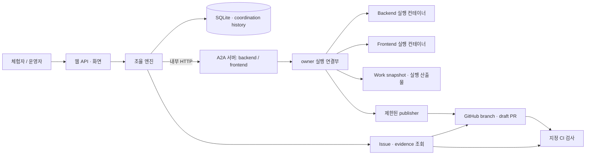

# Gateless Architecture — MVP 초안

> 상태: 사용자 검토용 초안. 2026-09-16 작성. 제품 구현·추가 probe는 수행하지 않았다.
> 진입 근거: 사용자가 세 feasibility 검증의 제한된 결론을 수용하고 독립 리뷰를 종료했다. 이 문서는 Architecture 단계로 진행한 현재 세션의 결정을 기록한다.
> 목표: freeze된 MVP의 lifecycle을 구현 가능한 최소 구조에 매핑한다. 새로운 제품 기능·범용 플랫폼을 추가하지 않는다.

## 1. 기준 문서와 결정의 구분

제품·도메인·runtime·범위는 각각 [PRD](../product/PRD.md), [Domain Model](../domain/DOMAIN_MODEL.md), [Work Engine](../domain/WORK_ENGINE.md), [MVP Spec](../product/MVP_SPEC.md)을 따른다. 실행으로 확인한 사실과 한계는 [Prepared environment 검증 기록](../research/PREPARED_ENVIRONMENT_VERIFICATION.md), 보존 evidence는 [README](../research/prepared-probe/README.md)를 따른다. 과거 Discovery나 저장소 루트의 빈 설계 템플릿을 기준으로 사용하지 않는다.

이 문서의 표기는 다음과 같다. **[B]**는 변경하지 않는 baseline, **[A]**는 이번 Architecture 초안의 새 제안으로 아직 사용자 검토 전, **[U]**는 실제 integration에서 검증해야 하는 가정이다. **ADR 후보**는 검토 후 별도 결정 기록이 필요한 선택이며, 이번에는 ADR 파일을 작성하지 않는다.

### 1.1 이미 결정된 것 [B]

| 영역 | 유지할 결정 |
|---|---|
| 책임 | Owner가 경계를 정하고 Agent가 기술적 요청·결과를 제안한다. Gateless는 contract를 집행하며 Agent가 기술적 판단을 맡는다. |
| 모델 | Request는 관계·조건, Work는 조율 lifecycle, Execution은 실제 시도다. 결과 충족은 Request 조건과 Result/Evidence 사이의 판정이다. |
| 현재 위임 | Accepted는 영구 실행권이 아니다. 향후 관련 행동에 현재 위임을 적용하고 과거 사실은 보존한다. |
| 조율 | original Work당 active Request 하나, 자동 위임 1-hop, owner당 슬롯 하나, 확인된 긴급 우선·동일 긴급도 READY FIFO, 재개 시 새 순번, non-preemption. |
| 대기·실패 | 실제 실행 전 조건 부족은 BLOCKED, 실행 후 continuation 대기는 WAITING. 종료 확인 후 슬롯 반환. 실행 불명 시 슬롯 유지. 자동 실행 retry·재작업 제외. |
| 업무·결과 | GitHub Issue가 목표·취소·최종 완료를 소유한다. draft PR·고정 SHA의 지정 검사·공유 JSON으로 결과를 확인한다. Merge·배포를 기다리지 않는다. |
| 준비 구성 | private repo 하나, owner별 Work snapshot, 한 호스트의 격리 컨테이너, Node 24/Codex 0.154.0, A2A SDK 0.3.25/protocol 0.3.0, 단일 A2A 서비스의 두 owner 경로. |
| 범위 | 배송비 미정 B1/R1과 슬롯·큐 확인용 보조 업무. Jira/n8n·범용 온보딩·정책 언어·process mining 제외. 구조화된 coordination history는 MVP에 포함. |

### 1.2 검증 사실과 설계의 출발점

확인된 것은 지정한 컨테이너 경로의 접근 제한, loopback A2A와 실제 Codex 3회 실행 연결, 공유 JSON을 받은 새 Backend의 compatibility 검사다. 기존 probe는 고정 driver의 순차 실행이다. Gateless의 accept·인가·큐·자동 재개·복구, Git export·GitHub publication, 웹 서비스가 검증된 것은 아니다.

이 차이를 구현·수용 검증 항목으로 유지한다. 현재 확인된 새로운 feasibility blocker는 없다. 미검증이라는 이유만으로 추가 research/probe를 선행 조건으로 만들지 않는다. 실제로 baseline과 양립할 수 없는 API·권한·실행 제약이 발견되면 깨진 가정과 영향을 특정해 사용자에게 알린다.

## 2. 배포와 기술 구성 [A]

**한 호스트, 하나의 Python 서비스 프로세스, SQLite 하나, Execution별 컨테이너**를 제안한다. 별도 메시지 브로커·분산 scheduler·독립 프론트엔드 서버를 두지 않는다. 논리적 모듈 경계는 유지하되 owner 연결부를 별도 마이크로서비스로 배포하지 않는다.

| 구성 | 선택과 이유 | 비용·한계 |
|---|---|---|
| 서버 | Python 3.12, Starlette/uvicorn. 이미 사용한 A2A Python SDK를 연결하고 웹 API·정적 파일도 제공 | 서비스 replica·uvicorn worker는 하나로 제한. 프로세스 장애가 전체 조율에 영향 |
| 조율 저장소 | Python 표준 SQLite 드라이버, 호스트 영속 볼륨. 짧은 쓰기 transaction으로 판정·예약·이력 원자성 확보 | 다중 호스트·고가용성 제외. 외부 효과까지 transaction으로 묶을 수 없음 |
| 웹 | 서버 제공 HTML/CSS와 작은 JavaScript, JSON API polling | 복잡한 SPA·실시간 push 제외. 화면 갱신은 관찰 주기에 의존 |
| Agent 실행 | baseline의 Node/Codex 이미지로 매 Execution 새 Docker 컨테이너 | 동일 세션 복원이 아닌 파일 상태 기반 continuation. 모델·컨테이너 장애는 별도 관찰 필요 |
| A2A | 실제 HTTP `message/send`·`tasks/get`·artifact. `/backend/`, `/frontend/`를 내부 경로로 제공 | 같은 신뢰 프로세스 안의 연결. 서로 다른 조직 identity 인증을 주장하지 않음 |
| GitHub | 등록된 한 repo/Issue/PR/check를 조회하고 제한된 publisher가 branch·draft PR 발행 | publisher가 신뢰 경계에 포함됨. 실제 권한과 CI 왕복은 [U] |

서비스는 loopback에 bind한다. 외부 체험 공개가 필요하면 TLS reverse proxy가 웹 경로만 전달하고 A2A 경로는 전달하지 않는다. 웹의 상태 변경은 준비자가 발급한 세션과 CSRF 검사를 거친다. Owner 설정·예외·철회는 운영자 권한으로 제한하고, 체험자는 등록된 demo의 실행 시작과 상태 조회만 할 수 있다. 1인 2-owner 운영을 서로 다른 실제 사용자의 identity 분리로 표현하지 않는다. 실제 공개 주소·접근 자격 배포 방식은 운영 설정 값으로 남긴다.

그림의 컨테이너는 동시에 상주하는 두 Agent가 아니라 실행별 생성되는 환경이다. 별도 owner의 실행은 병렬 가능하며, Python의 동기 Docker/CLI 대기로 서버 요청 처리를 막지 않는다. 상태 판정 transaction은 짧게 직렬화해도 장시간 모델 실행은 직렬화하지 않는다.

## 3. 모듈 책임과 의존 방향 [A]

| 모듈 역할 | 책임 | 수행하지 않는 일 |
|---|---|---|
| Domain / Engine | baseline 규칙으로 accept·READY·dispatch·wait·result·resume·escalation 결정 | HTTP·Docker·Git 명령 직접 실행, 모델을 통한 기술적 정답 재판정 |
| Application | 입력 정규화, transaction 경계, 외부 관찰 수집, 결정 실행, 시작 시 복구 | 별도 정책 언어·workflow graph 해석 |
| Store | 상태·조건 판본·판정·실행 의도·중복 식별·history 보존 | 외부 성공을 추정해 DB 상태 생성 |
| A2A / Runner | owner 경로와 Execution 매핑, 시작 전 인가, 컨테이너 실행·종료 관찰, artifact 구성 | Agent가 지정한 owner·경로·명령을 무조건 실행 |
| GitHub reader / Publisher | 등록 대상 조회, snapshot export, 허용 파일만 발행, 외부 효과 대조 | worker에 token·전체 clone 전달, merge·Issue 자동 close |
| Web | 현재 상태와 관찰·판정 이유, 외부 근거, 사람 결정·개입 기록 | 클라이언트에서 위임·결과 수용 판정 |

Domain은 표준 데이터와 규칙만 사용하고 SDK·웹·저장소를 import하지 않는다. Application이 Domain과 연동 구현을 연결한다. 같은 상태를 각 모듈의 별도 메모리 원장으로 관리하지 않는다. 사전 위임은 준비자가 입력한 두 owner의 구조화된 설정과 판본으로 저장한다. 범용 편집기 대신 MVP에 필요한 제한된 설정·철회·예외 명령만 제공한다.

제안 코드 배치의 역할은 `gateless/domain/`, `gateless/application/`, `gateless/store/`, `gateless/integrations/`, `gateless/web/`다. 파일 생성은 구현 단계에서 한다. 기존 `scripts/execute.py` 개발 하네스와 probe driver를 제품 runtime으로 재사용하지 않는다. Probe의 Docker 옵션·A2A 호출 방식은 참고하되 고정 prepare→consumer→resume 순서는 이식하지 않는다.

## 4. 상태·식별자·영속성 [A]

아래는 최소 저장 단위이며 SQL schema 확정은 아니다. Request의 독립 실행 상태 머신이나 Result의 중복 완료 플래그를 추가하지 않는다.

| 저장 단위 | 보존할 내용 |
|---|---|
| Contract / Source observation | owner·허용 행동·공유·최소 증거·슬롯 설정의 판본, repo/Issue 식별과 관찰 상태·시각 |
| Work / Handoff | original Work 계보, owner, Work 상태와 사유, 요청 조건·수락 근거·수신 Work 연결, active 관계 해소 근거 |
| Execution / Slot | Execution ID, Work·owner, 실행 의도·접수·시작·종료·불명 관찰, 슬롯 예약, task/container/외부 작업 식별자 |
| READY entry | owner, 단조 증가 순번, 확인된 긴급성 근거, 이번 READY 진입의 원인 |
| Result / Assessment | Request·Execution·산출물 SHA, evidence 관찰, 보존 조건과 현재 기준에 대한 충족·불충족·판정 불가 기록 |
| Context reference | Work 내부 snapshot·남은 작업, 허용된 공유 JSON·digest·출처, 전달 대상과 적용 공유 경계 |
| Effect / A2A task | 외부 실행·발행 의도와 관찰 결과, Execution→task 연결, task 상태·artifact 참조, 미확정 여부 |
| Coordination event | event ID·관찰/발생 시각·주체·상관 식별자·사유·근거·사람 결정/개입. 상태 변경과 같은 transaction에서 기록 |

DB의 현재 상태와 append-only 판정·event를 함께 저장한다. Event 전체를 재생해 현재 상태를 만드는 event sourcing은 도입하지 않는다. GitHub가 소유한 Issue/PR/check의 복제본은 마지막 관찰이며 최신 외부 사실 자체로 취급하지 않는다.

슬롯 예약은 owner당 하나, 미해소 active handoff는 original Work당 하나, 수신 Work는 수락된 Request당 하나만 존재하도록 저장소 제약과 transaction을 함께 사용한다. 재개 입력의 중복 처리는 `Work + 대기 회차 + 사용한 결과 판정`으로 식별한다. Agent의 구조화 요청 식별자는 제출 Execution에 묶고 재전달·수정 제출을 구분한다. 문자열 유사성으로 동일 요청을 추정하지 않는다.

A2A message/task, CLI 실행, GitHub Issue/PR/SHA를 Gateless ID와 구분해 매핑한다. 재전달된 동일 Execution 요청은 기존 task로 연결한다. SDK task store도 SQLite에 보존하도록 연결한다. **[U]** 이 SDK 버전의 영속 task store와 HTTP 재전달 처리 결합은 실제 구현 검증이 필요하다. InMemoryTaskStore를 유지하면서 복구를 보장한다고 표현하지 않는다.

코드 snapshot·큰 CLI 로그·공유 fixture는 호스트 영속 디렉터리에 두고 DB에는 경로 대신 관리된 artifact ID, digest, 소유·접근 범위와 참조를 저장한다. 파일은 임시 파일 작성 후 확정하고 DB 참조를 연결한다. 중간 crash로 생긴 참조 없는 파일은 자동 결과로 채택하지 않는다. Secret·전체 CLI 로그를 UI event에 복사하지 않는다. 실행·판정에 사용한 artifact는 해당 실행 동안 불변으로 취급한다.

## 5. Lifecycle의 실제 경로 [A]

### 5.1 Source → READY → dispatch

1. 준비자가 등록한 repo/Issue만 GitHub reader가 조회한다. Issue 종료 사유 매핑은 MVP Spec을 따른다. 조회 실패와 취소를 구분하며 Reopen으로 종료 Work를 자동 부활시키지 않는다.
2. Engine이 책임·현재 위임·입력 조건을 평가한다. 최초 조건 부족은 BLOCKED, 실행 가능하면 READY entry를 만든다.
3. Scheduler가 owner별 실행 가능한 READY를 정렬한다. 서로 다른 owner의 슬롯은 별도로 선택한다. 긴급 여부는 준비자가 승인한 출처만 읽으며 Agent 주장으로 바꾸지 않는다. 실제 출처 값은 11절의 미결 설정이다.
4. Dispatch 직전 Source·관련 위임·context를 다시 확인한다. DB transaction에서 확인한 판본·상태가 바뀌지 않았는지 검사하고 Execution 의도, 슬롯 예약, event를 함께 저장한다. 네트워크 I/O 중 DB 쓰기 transaction을 잡지 않는다.
5. 예약된 Execution ID로 내부 A2A 요청을 보낸다. 전송 전 관련 변경을 인지하면 보내지 않는다. 이미 전송했는지 불명확하면 예약을 유지한다.

### 5.2 Owner 연결부의 실제 시작

Runner는 인증된 coordinator 요청인지, endpoint owner·Work·Execution·허용 행동이 일치하는지 확인한다. DB에 등록되지 않은 Execution이나 payload만으로 넓어진 범위는 거부한다. Worker에는 A2A credential을 전달하지 않는다.

Runner는 실제 컨테이너 시작 직전 Application의 인가 경로를 호출해 현재 Issue 관찰·관련 위임·슬롯 귀속·중복 시작 여부를 재확인한다. 인가를 확인할 수 없으면 시작하지 않는다. 시작 승인을 소비한 사실과 container 식별자를 먼저 영속화하고 외부 생성을 수행한다. 동일 Execution은 한 번만 시작 경로를 점유한다.

각 컨테이너에 Execution ID를 label/name으로 부여하고, 생성·시작·종료 관찰을 별도로 기록한다. 프로세스 종료를 확인하기 전에 자동 삭제하지 않아 서비스 재시작 시 대조할 수 있게 한다. 완료 관찰·필요 로그 보존 후 해당 컨테이너만 정리한다. 이는 probe의 `--rm`보다 복구용 잔존 자원 관리가 추가되는 선택이다.

인가 확인과 Docker 시작, GitHub의 외부 취소를 전역적으로 원자화하지 못한다. 마지막 확인 시각과 시작 관찰 시각을 기록하고, 그 사이 인지한 철회는 시작 중단 또는 정지 요청으로 처리한다. 시작·종료 불명은 슬롯 해제 근거가 아니다. A2A `working`도 실제 CLI 시작 증거로 대신 사용하지 않는다.

### 5.3 Agent 결과 → accept / wait

Agent는 자기 workspace에 정해진 형식의 결과 파일을 작성한다. Backend 첫 실행 결과에는 B1의 남은 작업과 cross-owner 요청 제안이 포함된다. Runner가 크기·형식·출처를 검사하고 실제 종료·테스트 관찰과 함께 artifact를 구성한다. CLI의 성공 문장만으로 결과를 만들지 않는다.

Engine은 제안의 최초 Work 계보·1-hop·양측 현재 위임·책임·최소 결과 기준·공유 범위와 active Request 제한을 검사한다. 수락·수신 Work 생성·관계 연결은 하나의 transaction이다. 부적합하거나 판정 불가이면 이유와 필요한 owner 판단을 남긴다. 고정 phase 이름으로 Frontend를 무조건 실행하지 않는다.

원래 Execution의 종료가 확인되면 슬롯을 반환하고 Work를 WAITING으로 둔다. 수락 보류라면 사람 판단이 필요하다는 사유를 붙인다. 결과가 먼저 도착해도 이전 실행이 살아 있으면 재개하지 않는다. B1 snapshot은 Work 단위로 남아 B2 실행과 섞이지 않는다.

### 5.4 Result satisfaction → resume

Frontend 실행 종료와 발행 결과를 연결한 뒤 GitHub reader가 정확한 repo/PR/head SHA·지정 검사·fixture를 조회한다. 검사 대기는 계속 관찰하고, 명시적 실패·필수 결과 누락은 escalation, 조회 불가는 판정 보류로 구분한다.

Engine이 보존된 Request 조건과 현재 자동 수용 기준에 대한 판정을 기록한다. 후속 사용이 허용된 JSON의 내용·출처·digest와 Backend 내부 snapshot·남은 작업이 준비되고, 원본 Issue·현재 재개 위임·이전 종료 조건이 충족되면 한 번만 READY로 복귀한다. 새 FIFO 순번을 받고 dispatch 시 다시 인가한다. 매번 사람의 재개 승인을 요구하지 않는다.

Backend 후속 Execution은 보존된 자기 파일과 허용 JSON으로 compatibility 검사를 작성·실행한다. 다른 owner 소스나 private PR URL에 대한 직접 접근에 의존하지 않는다. 후속 실행 시작이 확인되면 기존 active handoff의 사용·해소를 기록한다. 수신 Work의 CLOSED, 결과 충족, Backend 재개, Issue 최종 완료는 별도로 표시한다.

## 6. Snapshot·publisher·CI 경계 [B + A]

### 6.1 Work별 파일 상태

**[B]** Worker는 GitHub token·전체 clone·`.git`·상대 workspace·Docker socket을 받지 않는다. **[A]** 신뢰된 호스트가 고정 commit의 해당 owner subtree만 Git tree에서 export한다. 경로는 서버의 owner/Work 매핑으로 정하고 Agent 제공 경로를 host 경로로 사용하지 않는다.

최초 export와 이후 발행 모두 허용된 일반 파일·디렉터리만 취급한다. Symlink·submodule·특수 파일과 정규화 후 허용 root를 벗어나는 경로는 거부한다. Work별 base commit·현재 작업 commit·snapshot 참조를 보존하고, 다른 Work의 변경을 자동 합치지 않는다. B1 resume는 B1의 보존 상태를 사용하며 Frontend 변경은 명시된 공유 JSON으로만 받는다.

### 6.2 발행 절차

**[B]** 한 repo와 신뢰된 publisher 선택은 유지한다. **[A]** 구체적인 발행 경로는 다음과 같다.

1. Worker 종료를 확인한 뒤 snapshot을 읽는다. 실행 중 writable tree를 그대로 검사·발행하지 않는다.
2. 허용 경로·파일 종류·변경 목록을 검사하고 신뢰된 staging 영역에 일반 파일로 복사한다. 검증한 복사본을 발행해 검사 이후 파일 교체를 방지한다.
3. Owner subtree 밖 변경과 보호된 계약·수용 검사·CI 기준 변경을 거부한다. 경로 삭제·rename도 같은 기준으로 검사한다. Agent가 추가한 unit test와 보호된 최소 수용 기준을 구분한다.
4. Work별 고정 base에서 허용 변경만 반영해 commit을 만들고 전용 branch에 push한다. Branch 명칭·대상 repo·base branch는 서버가 생성·고정한다. 기존 branch의 예상 head와 다르면 자동 덮어쓰기·force push 없이 보류한다.
5. Draft PR을 생성하거나 해당 Work의 기존 draft PR을 갱신한다. 발행 작업 ID, commit SHA·branch·PR 연결을 보존한다. 임의 Git 명령·hook·worker 코드 실행을 publisher에 허용하지 않는다.

호스트의 GitHub 자격은 등록된 demo repo에 한정한다. 필요한 능력은 Issue/PR/check/commit 읽기, 허용 branch의 contents 쓰기와 draft PR 쓰기다. Credential 종류와 실제 권한 설정은 [U]로 남기며 worker·CI 실행 환경에는 publisher credential을 제공하지 않는다. Publisher API에는 merge·deploy·권한 변경·Issue close 동작이 없다. Token 자체의 repo 쓰기 능력이 더 넓을 수 있으므로 GitHub의 보호 규칙·merge 제한도 실제 계정에서 확인해야 한다. Owner별 path 제한을 GitHub token 자체가 보장한다고 주장하지 않는다.

### 6.3 검사와 evidence

CI workflow와 최소 수용 검사는 준비자가 관리하고 Agent 변경 범위 밖에 둔다. 테스트 대상 commit에는 정확한 Node 기준으로 producer/consumer/compatibility 검사를 실행한다. Agent 작성 테스트만으로 계약 충족을 판정하지 않고, 필수 paid/free/pending 사례와 사례 형식을 보호된 검사에서 확인한다. Worker 산출물은 CI에서도 비신뢰 코드이므로 publisher·모델 credential과 production secret을 주지 않는다.

수용할 evidence는 `repo + PR + head SHA + 지정 검사 이름 + 승인된 검사 출처 + 완료/성공 + fixture 경로/digest`의 연결이다. 동일 이름의 임의 check나 다른 SHA의 green 결과는 수용하지 않는다. 검사 실행이 어떤 commit을 대상으로 했는지, workflow의 신뢰 기준과 그 연결을 GitHub adapter가 확인해야 한다. PR merge용 합성 commit의 검사를 head SHA 검사처럼 사용하지 않는다.

Fixture는 검사된 고정 commit에서 reader가 가져와 허용 형식·크기·필수 사례·digest를 확인하고, 공유가 허용된 데이터만 전달한다. 전달 직렬화가 달라지면 원본 bytes digest와 파싱한 내용의 대응을 따로 확인한다. Digest는 서명이나 신뢰 출처 인증을 대체하지 않는다. 후속 Backend의 compatibility 보고서는 양측 SHA와 사용 fixture를 연결한다.

**[U]** 실제 repo에서 draft PR의 CI trigger, 정확한 commit/검사 출처 대응, 필요한 조회 권한, 보호 규칙과 발행 경로는 미검증이다. 제품 통합의 수용 검증에서 확인할 항목이며 이번 Architecture 초안을 막는 새 blocker로 간주하지 않는다.

## 7. 현재 권한·공유와 실행 경계 [A]

| 경계 | 집행 지점 |
|---|---|
| 요청·수락 | Engine이 양측의 책임·실행·공유·결과 최소 조건 확인 |
| dispatch·실제 시작 | Engine 예약과 Runner 시작 인가에서 현재 관련 위임 확인 |
| worker 파일 접근 | 기존 비루트·read-only root·capability 제거·제한 mount 구성 |
| GitHub 발행 | Publisher가 현재 발행 위임과 변경 범위를 다시 확인한 뒤 외부 쓰기 수행 |
| 결과 수용·전달·재개 | 현재 결과 기준 및 공유·사용 위임 확인. 과거 판정은 보존 |
| 웹 사람 결정 | 운영자 권한·대상 owner·허용 결정 종류 확인. 한 owner 예외로 상대 경계를 우회하지 않음 |

Owner 연결부와 publisher는 한 운영자의 신뢰된 호스트 안에 있다. 모듈 분리가 OS 수준의 상호 격리를 뜻하지 않는다. Worker의 모델 인증 읽기와 outbound network는 baseline의 알려진 한계다. 내부 A2A는 credential과 Execution 범위 검사로 우회 호출을 거부하며, 컨테이너에서 접근 가능하더라도 인증만으로 임의 실행을 만들 수 없어야 한다. 컨테이너 탈출·모델 인증 반출 방지가 검증된 multi-tenant 서비스로 공개하지 않는다.

진행 중 위임 철회를 인지하면 관련된 새 행동을 막고 해당 실행의 정지를 요청한다. 이미 발생한 파일 변경·외부 효과나 전달된 정보의 회수를 보장하지 않는다. Frontend 추가 수정 위임 철회와 이미 받은 결과를 사용한 Backend 재개 허용은 관련 행동별로 분리한다.

## 8. 실패·중복·재시작 [A]

외부 효과 전에 DB에 의도를 기록하고, 이후 확인한 결과를 연결한다. 별도 범용 outbox/queue 제품은 두지 않고 Execution과 발행 작업 레코드에서 미확정 의도를 조회한다. 의도 보존이 exactly-once 실행을 보장하지는 않는다.

| 실패 지점 | 처리 |
|---|---|
| 예약 후 전송 전 crash | 재시작 후 미전송 확정 여부 대조. 전송 여부가 불명하면 같은 슬롯을 유지하고 먼저 조회 |
| A2A 응답 유실 | Execution ID로 기존 task·runner 기록을 조회. task ID를 못 받았다는 이유로 새 Execution 생성 금지 |
| 컨테이너 생성·시작 도중 crash | Execution label/name과 DB 시작 의도를 대조. 실행 가능성이 남으면 중복 시작 금지·슬롯 유지 |
| 종료 후 DB 반영 전 crash | 남아 있는 컨테이너 종료 상태·로그·산출물을 대조해 종료 관찰을 복구. 컨테이너 부재만으로 성공/미실행 확정 금지 |
| Push/PR 생성 응답 유실 | 미리 기록한 작업 ID·branch·commit으로 GitHub 조회. 기존 효과를 연결하거나 판정 불가로 보류. 무조건 재발행 금지 |
| 중복 Request/result/poll | 저장된 식별자·판정으로 연결. 수신 Work·READY 순번·Execution 중복 생성 금지 |
| CLI/test 확정 실패·부적합 결과 | 실패·미충족과 근거를 표시하고 escalation. 자동 Agent retry·자동 재작업 없음 |
| 취소·철회·timeout | 관련 후속 행동 차단. 정지 요청과 실제 종료를 구분. 시간 초과나 사람의 재개 클릭만으로 슬롯 반환 금지 |

프로세스 재시작 시 새 dispatch를 먼저 막고 예약·미확정 시도·미확정 발행을 대조한다. 각 슬롯의 안전한 상태가 확인되면 해당 슬롯부터 조율을 재개한다. SQLite 기록만으로 외부 실행이 없었다고 추정하지 않는다. 복구 불가능한 시도는 슬롯을 격리하고 근거와 필요한 확인을 UI에 보여준다.

CLI 종료 이후 CI를 기다리는 시간에는 Agent 슬롯을 점유하지 않는다. 다만 같은 Execution에 귀속된 host 측 실행·발행 작업이 아직 진행되거나 불명확하면 그것까지 종료·확인한 뒤 슬롯을 반환한다. 외부 CI polling은 새 Agent 실행이 아니며 Work는 결과 확인 대기로 남을 수 있다. Workspace를 정리하거나 회차를 초기화하기 전에 연결된 활성·미확정 작업이 없어야 한다.

## 9. 웹과 관찰 [A]

화면은 준비된 Issue 목록, owner별 READY 큐·예약/실행·대기 사유, B1↔R1↔수신 Work↔결과↔재개 연결, PR/SHA/check 근거와 history를 제공한다. DB의 마지막 관찰 시각과 미확정 상태를 표시하고 polling 중이라는 이유로 성공을 예측하지 않는다. Agent 성공·결과 충족·원래 업무 완료를 별개로 보여준다.

사람 판단 화면은 막힌 행동·필요한 결정·해당 owner를 명시한다. 승인이라는 단일 버튼으로 모든 조건을 우회하지 않는다. 정보 보충·허용된 조건 조정·철회·안전한 재실행 결정·조율 종료를 지원하되 각 명령은 Engine 재평가 입력이다. 일반적인 결과 충족 뒤 재개 승인 화면을 추가하지 않는다.

상태 전이 event와 사람의 조율 개입 기록을 Work/Request/Execution에 연결한다. 능동 조율 시간, Agent/CI 대기, 설정·정책 유지·재작업을 구분하고 수동 비교 회차는 같은 단위의 관찰 기록을 사용할 수 있게 한다. 분석 대시보드·패턴 추천은 추가하지 않는다. 실제 효과 판정은 PRD의 수동/자동 비교로 수행한다.

## 10. 구현 이후 수용 검증과 근거 [A]

아래는 실행 완료 보고가 아니라 구현의 검증 책임이다. 새 기능은 프로젝트 규칙대로 테스트를 먼저 작성한다. 기존 feasibility evidence를 제품 테스트의 통과 결과로 재사용하지 않는다.

| 계층 | 확인할 핵심 항목 |
|---|---|
| Engine 단위 | Work Engine 10절 사례, 관련 현재 위임, BLOCKED/WAITING, active 해소 시점, 중복 resume·새 FIFO 순번 |
| Store·동시성 | 같은 original Work 동시 accept, 같은 owner 동시 예약, 별도 owner 병렬 실행, 상태·event transaction 일관성 |
| Runner·복구 | 실제 시작 전 철회, 응답 유실·crash 구간, 종료 불명 슬롯 유지, 기존 Execution 조회와 중복 시작 방지 |
| Publisher·GitHub | 실제 snapshot→허용 branch/draft PR/check, 경로 이탈·symlink·CI 기준 변경 거부, merge 제한, 유실 응답 대조 |
| Evidence·context | 다른 SHA/검사 출처 거부, fixture 누락·변조, 허용 context 부족 시 재개 보류, 결과 공유 철회 |
| 실제 통합 loop | 고정 driver 없이 Issue→B1→R1→Frontend→결과 판정→Backend 새 실행, B2/F1의 슬롯·큐 경쟁 |
| 웹·측정 | 실제 상태·근거 표시, 운영자/체험자 명령 제한, 개입·시간·설정/재작업 기록과 결과 적합성 비교 |

정상 외부 loop와 장애 주입 결과를 구분해서 기록한다. 이전 실험과 같은 실패를 재현하기 위한 추가 probe를 지금 수행하지 않는다.

## 11. 미검증 가정과 미결 설정

| 구분 | 남은 항목 | 처리 시점 |
|---|---|---|
| [U] 실제 연동 | demo repo/Issue 생성, Git export·publisher·PR/check 왕복, 보호 규칙·최소 권한 | 해당 adapter 구현의 integration 수용 검증 |
| [U] 실행·복구 | A2A 영속 task 매핑, 컨테이너 재조회·중복 시작 방지, 프로세스 재시작 복구 | Runner/Store 구현 검증 |
| [U] 운영 환경 | 실제 공개 호스트의 Docker·모델 인증·네트워크, TLS proxy와 내부 경로 차단 | 웹 공개 전에 확인. 현재 호스트에서의 probe 성공을 배포 성공으로 간주하지 않음 |
| 미결 설정 | 실제 repo·credential 주체·허용 branch, 보호 검사 위치·이름·출처, 공유 JSON의 크기 제한 | 첫 실제 demo 실행 전에 명시 |
| 미결 설정 | 신뢰 긴급성 출처·유효기간, polling/관찰 시간·읽기 retry 한도 | 관련 기능 수용 검증 전에 명시. 미설정 긴급 우선권을 추정하지 않음 |
| 미결 설정 | Agent/API 예산·실행 한도, 관찰 기간·실험 반복 수·로그/context 보존 기간 | 체험 실행·비교 실험 전에 사용자와 확정 |

이 값들을 임의의 구현 기본값으로 숨기지 않는다. 미설정 항목이 필요한 행동은 시작하지 않고 이유를 표시한다. 현재 사용자 검토를 막는 새로운 기술적 불가능 근거는 없으며, 이 목록을 feasibility review 재개 요구로 해석하지 않는다.

## 12. 핵심 Architecture 결정과 ADR 후보

| 후보 | 이번 초안의 제안 [A] | 중요한 trade-off / 검토 질문 |
|---|---|---|
| ADR-01: 단일 서비스·SQLite | 조율·웹·owner 연결부를 같은 Python 프로세스에 배치하고 상태·의도·history 영속화 | 빠른 구현과 짧은 원자적 판정 대신 전체 프로세스 장애 영향·단일 호스트 제약을 수용하는가? |
| ADR-02: 실행 인가와 복구 | DB 예약 + 시작 직전 현재 인가 + 영속 Execution/task/container 매핑, 불명 시 슬롯 유지 | 가용성보다 중복 실행 방지를 우선하며 운영자 확인이 필요할 수 있는가? |
| ADR-03: 발행 신뢰 경계 | baseline의 한 repo+publisher를 host staging·경로 검사·보호 CI·정확한 SHA 검증으로 구체화 | Agent에서 제거한 repo 권한을 신뢰된 host가 보유하는 비용과 실제 enforcement 검증 책임을 수용하는가? |

ADR-03은 한 repo 선택 자체를 다시 여는 문서가 아니라 그 선택을 실제로 집행하는 경계의 기록이다. Node/Codex·A2A 버전·1-hop·슬롯·상태 모델처럼 이미 정해진 항목은 새 선택으로 포장하지 않는다. 정적 웹과 polling은 현재 규모의 단순한 구현 선택으로 이 문서에서 관리한다.

다음 순서는 이 초안의 핵심 선택 검토 → 확정한 중요한 선택의 ADR → 구현 PLAN이다. 본 문서 작성은 구현 착수나 미검증 integration의 성공 선언이 아니다.
